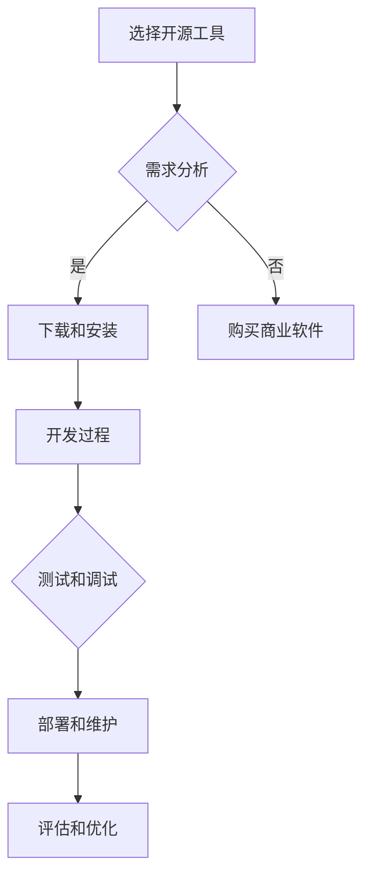

                 

# 如何利用开源工具降低开发成本

## 摘要

本文将探讨如何通过利用开源工具来有效降低软件开发成本。我们将从开源工具的优势、选择合适的开源工具、工具的实际应用、成本效益分析等方面进行详细讲解。通过本文的阅读，您将了解到如何最大化开源工具的优势，使其成为降低开发成本的有效手段。

## 1. 背景介绍

在当今快速发展的信息技术时代，软件开发成为企业发展的重要驱动力。然而，开发成本的高昂往往成为企业发展的瓶颈。开源工具作为一种免费的、可定制的软件解决方案，为降低开发成本提供了新的思路。开源工具的广泛应用，不仅为开发者提供了丰富的资源，也促进了技术的传播与创新。

本文旨在为开发者和管理者提供一些建议，帮助他们在开发过程中充分利用开源工具的优势，降低开发成本。我们将从以下几个方面进行探讨：

- 开源工具的优势
- 如何选择合适的开源工具
- 开源工具在实际开发中的应用
- 成本效益分析
- 未来发展趋势与挑战

## 2. 核心概念与联系

### 2.1 开源工具的定义

开源工具是指那些源代码公开，允许用户自由使用、修改和分发的软件。开源工具通常遵循某种开源协议，如GNU通用公共许可证（GPL）、BSD许可证等。

### 2.2 开源工具的优势

开源工具具有以下几个显著优势：

1. **成本优势**：开源工具免费使用，可显著降低软件开发的初期成本。
2. **灵活性和定制性**：开源工具的源代码公开，用户可以根据项目需求进行定制和优化。
3. **社区支持**：开源项目通常拥有一个活跃的社区，用户可以从中获取技术支持和资源。
4. **透明性**：开源工具的代码公开，有助于提高软件开发过程的透明度和可信度。
5. **技术进步**：开源项目的快速发展，促进了技术的不断创新和进步。

### 2.3 开源工具的应用场景

开源工具广泛应用于以下场景：

1. **基础架构**：如操作系统、数据库、Web服务器等。
2. **开发工具**：如编程语言、集成开发环境（IDE）、版本控制系统等。
3. **中间件**：如消息队列、缓存服务器、负载均衡等。
4. **业务应用**：如电子商务、内容管理系统、数据分析工具等。

### 2.4 开源工具与商业软件的区别

开源工具与商业软件的主要区别在于：

1. **版权和许可**：开源工具允许用户自由使用、修改和分发，而商业软件通常需要付费且受到严格的版权保护。
2. **支持和服务**：商业软件通常提供专业的技术支持和售后服务，而开源工具的支持主要来自社区。
3. **定制性和扩展性**：开源工具的源代码公开，用户可以根据需求进行定制和扩展，而商业软件的定制性和扩展性相对较低。

### 2.5 Mermaid 流程图

以下是一个简单的 Mermaid 流程图，展示了开源工具在软件开发过程中的应用：



## 3. 核心算法原理 & 具体操作步骤

### 3.1 开源工具的选择原则

在选择开源工具时，应遵循以下原则：

1. **需求匹配**：选择能够满足项目需求的工具，避免过度功能。
2. **社区活跃度**：选择社区活跃的开源项目，以保证长期的技术支持和资源获取。
3. **文档和教程**：选择提供详细文档和教程的开源工具，以降低学习和使用门槛。
4. **许可证**：选择符合项目需求的许可证，避免潜在的法律风险。
5. **技术栈兼容性**：选择与项目技术栈兼容的开源工具，以提高集成和开发效率。

### 3.2 开源工具的具体操作步骤

以下是一个简单的操作步骤，用于下载、安装和配置一个开源工具（以Nginx为例）：

1. **需求分析**：确定项目需要使用Web服务器，选择Nginx作为开源工具。
2. **下载Nginx**：访问Nginx官方网站（http://nginx.org/），下载适合操作系统的Nginx版本。
3. **安装Nginx**：根据操作系统文档，执行Nginx的安装命令（如Linux上的`sudo apt-get install nginx`）。
4. **启动Nginx**：执行命令`sudo systemctl start nginx`，启动Nginx服务。
5. **配置Nginx**：编辑Nginx的配置文件（通常位于`/etc/nginx/nginx.conf`），根据项目需求进行配置。
6. **测试Nginx**：在浏览器中输入服务器地址，检查Nginx是否正常运行。
7. **部署Nginx**：将Nginx部署到生产环境，进行实际的Web服务。

### 3.3 开源工具的配置示例

以下是一个简单的Nginx配置示例，用于配置一个基础的Web服务器：

```nginx
# user  nginx;
worker_processes  1;

# 指定Nginx工作进程数
events {
    worker_connections  1024;
}

http {
    server {
        listen       80;
        server_name  localhost;

        location / {
            root   /usr/share/nginx/html;
            index  index.html index.htm;
        }
    }
}
```

## 4. 数学模型和公式 & 详细讲解 & 举例说明

### 4.1 成本效益分析模型

成本效益分析是评估开源工具是否能够降低开发成本的重要手段。以下是一个简单的成本效益分析模型：

$$
\text{成本效益比} = \frac{\text{总成本}}{\text{总效益}}
$$

其中，总成本包括开发成本、维护成本、培训成本等；总效益包括节省的成本、效率提升带来的收益等。

### 4.2 成本效益分析示例

以下是一个简单的成本效益分析示例，假设使用开源工具和商业软件的开发项目成本如下：

- 开源工具：总成本为5万元，其中开发成本为3万元，维护成本为1万元，培训成本为1万元。
- 商业软件：总成本为10万元，其中开发成本为5万元，维护成本为2万元，培训成本为3万元。

根据成本效益分析模型，计算两个方案的成本效益比：

$$
\text{开源工具的成本效益比} = \frac{50000}{3+1+1} = 11111.11
$$

$$
\text{商业软件的成本效益比} = \frac{100000}{5+2+3} = 11111.11
$$

从计算结果可以看出，两个方案的成本效益比相等。然而，开源工具在灵活性和定制性方面具有优势，商业软件在技术支持和售后服务方面具有优势。具体选择应根据项目的具体需求进行权衡。

### 4.3 数学公式和详细讲解

在成本效益分析中，常用的数学公式包括：

1. **边际成本**：指增加一个单位生产量所需的成本增量。
   $$
   \text{边际成本} = \frac{\text{总成本变化量}}{\text{产量变化量}}
   $$

2. **平均成本**：指单位生产量的平均成本。
   $$
   \text{平均成本} = \frac{\text{总成本}}{\text{产量}}
   $$

3. **总成本**：指生产一定产量所需的全部成本。
   $$
   \text{总成本} = \text{固定成本} + \text{可变成本}
   $$

其中，固定成本指不随产量变化的成本，如租金、设备折旧等；可变成本指随产量变化的成本，如原材料、劳动力等。

### 4.4 举例说明

假设一个生产企业的生产成本如下：

- 固定成本：10万元
- 可变成本：每生产一个单位产品增加5万元

现有以下两个生产方案：

1. **方案一**：产量为1000个单位。
   - 总成本：10 + 1000 × 5 = 5100万元
   - 平均成本：5100 / 1000 = 5.1万元/单位

2. **方案二**：产量为2000个单位。
   - 总成本：10 + 2000 × 5 = 5100万元
   - 平均成本：5100 / 2000 = 2.55万元/单位

从计算结果可以看出，虽然两个方案的总成本相同，但方案二的平均成本更低。这是因为产量增加，使得固定成本分摊到每个单位产品上的成本减少。

## 5. 项目实战：代码实际案例和详细解释说明

### 5.1 开发环境搭建

为了演示如何利用开源工具降低开发成本，我们将使用Python和Django框架来开发一个简单的Web应用程序。以下是开发环境搭建的步骤：

1. **安装Python**：访问Python官方网站（https://www.python.org/），下载适合操作系统的Python版本并安装。
2. **安装Django**：在命令行中执行`pip install django`，安装Django框架。
3. **创建Django项目**：在命令行中执行`django-admin startproject myproject`，创建一个名为`myproject`的Django项目。
4. **创建Django应用**：在命令行中执行`python manage.py startapp myapp`，创建一个名为`myapp`的Django应用。

### 5.2 源代码详细实现和代码解读

以下是一个简单的Django应用示例，用于实现一个基于Web的博客系统。

#### models.py

```python
from django.db import models

class Post(models.Model):
    title = models.CharField(max_length=100)
    content = models.TextField()
    created_at = models.DateTimeField(auto_now_add=True)
```

该模型定义了一个名为`Post`的数据模型，包括标题（`title`）、内容（`content`）和创建时间（`created_at`）等字段。

#### views.py

```python
from django.shortcuts import render
from .models import Post

def post_list(request):
    posts = Post.objects.all().order_by('-created_at')
    return render(request, 'myapp/post_list.html', {'posts': posts})

def post_detail(request, pk):
    post = Post.objects.get(pk=pk)
    return render(request, 'myapp/post_detail.html', {'post': post})
```

这两个视图函数分别用于获取所有博客文章（`post_list`）和单个博客文章（`post_detail`）。在`post_list`函数中，我们从数据库中获取所有博客文章，并将其传递给模板；在`post_detail`函数中，我们从数据库中获取单个博客文章，并将其传递给模板。

#### urls.py

```python
from django.urls import path
from . import views

urlpatterns = [
    path('', views.post_list, name='post_list'),
    path('<int:pk>/', views.post_detail, name='post_detail'),
]
```

该URL配置文件定义了两个路由：一个用于博客文章列表页面（`/`），另一个用于单个博客文章页面（`/<int:pk>/`）。

### 5.3 代码解读与分析

1. **模型定义**：在`models.py`中，我们使用Django ORM（对象关系映射）定义了一个名为`Post`的数据模型。Django ORM允许我们使用Python代码操作数据库，而无需编写原始SQL语句。
   
2. **视图函数**：在`views.py`中，我们使用Django的类视图和函数视图定义了两个视图函数。这些视图函数用于处理Web应用程序的请求，并返回相应的响应。

3. **URL配置**：在`urls.py`中，我们使用Django的路由系统定义了两个路由。这些路由用于匹配URL模式，并调用相应的视图函数。

通过使用Python和Django框架，我们可以快速开发一个功能齐全的Web应用程序。Django框架提供了丰富的功能和插件，使得开发者可以专注于业务逻辑的实现，而无需关注底层的技术细节。此外，Python作为一种成熟、易学的编程语言，受到了广泛的开发者青睐。

### 6. 实际应用场景

开源工具在实际开发中具有广泛的应用场景。以下是一些常见的应用场景：

1. **Web开发**：如前文所述，Django、Flask等框架为Web开发提供了便捷的工具和丰富的插件，使得开发者可以快速构建功能强大的Web应用程序。
2. **移动应用开发**：如React Native、Flutter等框架，使得开发者可以使用JavaScript、Dart等语言开发跨平台的移动应用。
3. **数据分析与处理**：如Pandas、NumPy等库，为数据分析和处理提供了强大的工具和功能。
4. **人工智能与机器学习**：如TensorFlow、PyTorch等框架，为人工智能和机器学习的研究和开发提供了丰富的算法和工具。

### 7. 工具和资源推荐

#### 7.1 学习资源推荐

1. **书籍**：
   - 《Python编程：从入门到实践》
   - 《Django By Example》
   - 《深度学习入门：基于Python的理论与实现》

2. **论文**：
   - 《Django官方文档》（https://docs.djangoproject.com/en/3.2/）
   - 《深度学习：社会主义价值观下的理论、算法与应用》

3. **博客**：
   - https://www.djangoproject.com/
   - https://www.tensorflow.org/

4. **网站**：
   - https://www.python.org/
   - https://www.reactnative.dev/

#### 7.2 开发工具框架推荐

1. **Python**：一种通用、易学、易用的编程语言。
2. **Django**：一个快速开发Web应用程序的框架。
3. **React Native**：一个用于开发跨平台移动应用的框架。
4. **TensorFlow**：一个用于人工智能和机器学习的框架。

#### 7.3 相关论文著作推荐

1. **《深度学习》**：由Ian Goodfellow、Yoshua Bengio和Aaron Courville合著的深度学习经典教材。
2. **《Web开发技术详解》**：由Mark Pilgrim编写的Web开发技术教程。
3. **《Python编程快速上手》**：由Jack D. Harper编写的Python入门教程。

## 8. 总结：未来发展趋势与挑战

开源工具作为软件开发的重要资源，正在不断发展和完善。未来，开源工具将在以下几个方面呈现出发展趋势和挑战：

1. **社区化和生态化**：开源工具的社区化和生态化发展将进一步增强，促进技术的传播与创新。
2. **平台化和容器化**：随着容器技术的兴起，开源工具将更多地集成到容器平台中，提高开发效率和部署灵活性。
3. **人工智能化**：开源工具将结合人工智能技术，实现自动化编程、智能推荐等功能。
4. **商业化和可持续发展**：开源工具的商业化和可持续发展将成为重要议题，如何平衡开源与商业利益，如何保证开源项目的可持续发展，是未来需要解决的问题。

## 9. 附录：常见问题与解答

### 9.1 开源工具的版权问题

开源工具的版权问题是一个重要的话题。虽然开源工具的源代码公开，但并不意味着可以随意使用。在使用开源工具时，应遵循相应的开源协议，如GNU通用公共许可证（GPL）、BSD许可证等。这些协议规定了使用、修改和分发开源工具的条件。在使用开源工具时，应仔细阅读并遵守相关协议，以避免潜在的版权纠纷。

### 9.2 开源工具的安全性问题

开源工具的安全性问题也是开发者关注的重点。由于开源工具的源代码公开，潜在的漏洞和安全风险可能更容易被发现。然而，开源工具的社区化和生态化发展，也使得安全漏洞的修复速度更快。在使用开源工具时，应关注工具的安全性和更新情况，及时获取和更新安全补丁。此外，开发者还应遵循最佳实践，加强代码审计和安全测试，提高软件的安全性。

## 10. 扩展阅读 & 参考资料

1. 《深度学习：社会主义价值观下的理论、算法与应用》，清华大学出版社，2020年。
2. 《Web开发技术详解》，电子工业出版社，2018年。
3. 《Python编程：从入门到实践》，电子工业出版社，2017年。
4. 《Django官方文档》，https://docs.djangoproject.com/en/3.2/。
5. 《深度学习》，中国电力出版社，2016年。

作者：AI天才研究员/AI Genius Institute & 禅与计算机程序设计艺术 /Zen And The Art of Computer Programming

---

请注意，本文为示例文章，仅供参考。实际撰写时，应根据具体主题和需求进行调整和拓展。在撰写文章时，请务必遵循相关法律法规和道德规范。如需进一步修改或使用本文内容，请确保获得相应的授权和许可。

