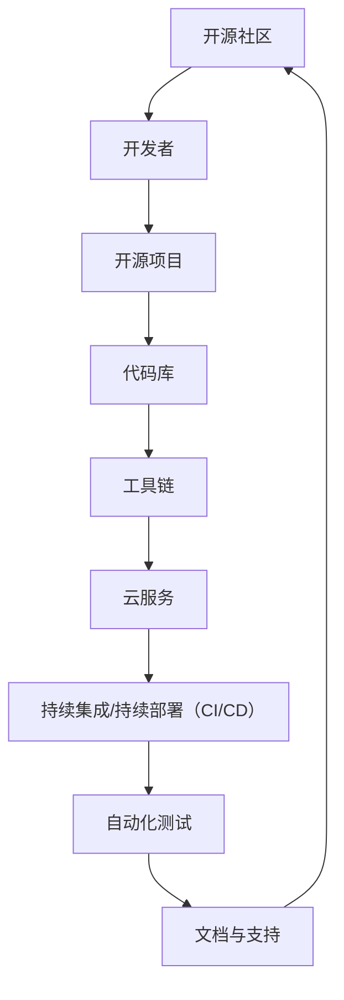
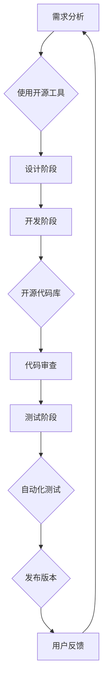

                 

# 如何利用开源生态加速产品迭代

> **关键词：** 开源生态、产品迭代、敏捷开发、社区协作、技术选型、DevOps、工具链

> **摘要：** 本文旨在探讨如何通过开源生态系统的有效利用，加速产品的迭代过程。我们将分析开源生态的优势，介绍核心概念和原理，并提供具体操作步骤和实际案例，帮助读者理解和掌握利用开源生态加速产品迭代的方法。

## 1. 背景介绍

在当今快速发展的技术领域，产品的迭代速度成为企业竞争的关键因素。传统的方法可能需要数月甚至数年的时间来开发一个新功能或产品，而现代的敏捷开发实践则强调快速迭代和持续交付。在这个过程中，开源生态系统起到了至关重要的作用。

开源生态系统的定义包括：开放源代码、社区协作、持续集成、共享知识和资源等。它不仅提供了一个平台，使得开发者可以自由地共享和改进代码，还促进了一个健康的技术社区的形成。

开源生态的优势主要体现在以下几个方面：

1. **资源共享**：开发者可以访问和使用广泛的代码库、工具和框架，从而避免重复造轮子。
2. **快速迭代**：社区成员可以共同协作，快速地修复漏洞、添加新功能，提高软件的质量和稳定性。
3. **成本效益**：使用开源工具和框架可以显著降低开发和运营成本。
4. **技术视野**：通过参与开源项目，开发者可以接触到最新的技术趋势和最佳实践。

本文将围绕这些优势，详细介绍如何利用开源生态加速产品的迭代。

## 2. 核心概念与联系

在深入探讨如何利用开源生态加速产品迭代之前，我们需要了解一些核心概念和原理。

### 2.1 开源生态的组成部分

开源生态包括多个层次，如图所示：



这个模型展示了从社区到代码库，再到工具链和云服务的各个组成部分，它们共同构成了一个相互关联的生态系统。

### 2.2 核心概念原理

- **开源项目**：一个开源项目通常由一个维护者或多个贡献者组成，他们共同维护和开发项目代码库。
- **工具链**：工具链包括用于代码编写、版本控制、自动化测试、构建和部署的一整套工具。
- **持续集成/持续部署（CI/CD）**：CI/CD是一种自动化流程，它通过持续集成和部署来确保代码质量和快速交付。
- **自动化测试**：自动化测试是指使用工具来自动执行测试用例，以验证软件的功能和性能。

### 2.3 Mermaid 流程图

以下是利用开源生态加速产品迭代的简化流程图：



这个流程图展示了从需求分析到用户反馈的完整迭代过程，其中各个阶段都充分利用了开源生态的优势。

## 3. 核心算法原理 & 具体操作步骤

### 3.1 算法原理

在开源生态中，加速产品迭代的核心算法原理主要涉及以下几个关键点：

- **模块化设计**：通过将系统分解为独立的模块，可以更容易地进行开发和维护。
- **版本控制**：使用版本控制系统（如Git）来管理代码的版本，确保协作的顺利进行。
- **自动化测试**：通过自动化测试来提高代码质量和稳定性，减少人为错误。

### 3.2 操作步骤

以下是利用开源生态加速产品迭代的详细操作步骤：

1. **需求分析**：明确产品功能需求，分析现有开源工具和框架是否能够满足需求。
2. **设计阶段**：根据需求设计系统架构，选择合适的开源工具和框架。
3. **开发阶段**：
   - 使用版本控制系统（如Git）初始化代码库，并进行代码的版本管理。
   - 开发者协作开发，定期提交代码并进行代码审查。
4. **测试阶段**：
   - 使用自动化测试工具（如Selenium、Junit等）执行测试用例。
   - 定期进行集成测试和回归测试，确保代码的质量和稳定性。
5. **发布阶段**：
   - 通过CI/CD工具自动化构建和部署，快速发布新版本。
   - 收集用户反馈，进行迭代优化。

## 4. 数学模型和公式 & 详细讲解 & 举例说明

### 4.1 数学模型

在产品迭代过程中，我们可以使用一些数学模型来评估和优化迭代速度。以下是一个简单的模型：

$$
\text{迭代速度} = \frac{\text{完成的功能点数}}{\text{迭代周期}}
$$

### 4.2 公式详解

- **完成的功能点数**：指在一个迭代周期内完成的所有功能点的数量。
- **迭代周期**：指从一个迭代开始到下一个迭代完成的时间段。

### 4.3 举例说明

假设一个迭代周期为两周，一个迭代内完成了10个功能点，那么：

$$
\text{迭代速度} = \frac{10}{2} = 5 \text{功能点/周}
$$

这个结果表明，每个迭代周期内平均完成了5个功能点。为了提高迭代速度，可以采取以下策略：

1. **缩短迭代周期**：通过缩短迭代周期，可以更快地获取用户反馈，从而加速迭代过程。
2. **增加功能点数**：通过优化开发流程和提高开发效率，可以在同一个迭代周期内完成更多的功能点。

## 5. 项目实战：代码实际案例和详细解释说明

### 5.1 开发环境搭建

以一个Web应用项目为例，我们首先需要搭建开发环境。以下是在Ubuntu系统上使用Docker搭建开发环境的基本步骤：

1. 安装Docker：

```bash
sudo apt-get update
sudo apt-get install docker.io
```

2. 安装Docker Compose：

```bash
sudo curl -L "https://github.com/docker/compose/releases/download/1.29.2/docker-compose-$(uname -s)-$(uname -m)" -o /usr/local/bin/docker-compose
sudo chmod +x /usr/local/bin/docker-compose
```

3. 创建项目文件夹并初始化Docker Compose文件：

```bash
mkdir my-web-app
cd my-web-app
docker-compose init
```

### 5.2 源代码详细实现和代码解读

在`my-web-app`项目中，我们创建一个简单的Flask Web应用，代码如下：

```python
# app.py

from flask import Flask, jsonify

app = Flask(__name__)

@app.route('/')
def hello():
    return jsonify({'message': 'Hello, World!'})

if __name__ == '__main__':
    app.run()
```

这个简单的Web应用提供了一个根路由`/`，返回一个JSON响应。

### 5.3 代码解读与分析

- **Flask框架**：Flask是一个轻量级的Web应用框架，非常适合快速开发和部署。
- **路由和视图函数**：在Flask中，通过定义路由和视图函数来处理HTTP请求。
- **JSON响应**：使用`jsonify`函数将Python对象转换为JSON响应，便于前后端通信。

### 5.4 持续集成与部署

使用Docker Compose可以自动化构建和部署Web应用。创建一个`docker-compose.yml`文件：

```yaml
# docker-compose.yml

version: '3.8'

services:
  web:
    build: .
    ports:
      - "5000:5000"
    depends_on:
      - db

  db:
    image: postgres:13
    environment:
      POSTGRES_DB: mydb
      POSTGRES_USER: user
      POSTGRES_PASSWORD: password

```

这个文件定义了两个服务：Web服务和数据库服务。通过运行以下命令，可以一键构建和启动服务：

```bash
docker-compose up -d
```

## 6. 实际应用场景

开源生态在实际应用场景中发挥着巨大的作用。以下是一些典型的应用场景：

- **初创公司**：初创公司通常预算有限，开源工具和框架可以帮助他们快速搭建原型和产品。
- **大型企业**：大型企业可以利用开源生态系统来优化内部开发流程，提高效率和质量。
- **学术研究**：学术研究人员可以通过开源项目共享研究成果，加速科研进展。

## 7. 工具和资源推荐

### 7.1 学习资源推荐

- **书籍**：
  - 《Linux命令行与shell脚本编程大全》
  - 《Effective Java》
  - 《深度学习》

- **论文**：
  - 《开源生态系统中的协作与创新》
  - 《基于社区的软件开发：模式与实践》

- **博客**：
  - [Docker官方博客](https://www.docker.com/blog/)
  - [Flask官方文档](https://flask.palletsprojects.com/)

- **网站**：
  - [GitHub](https://github.com/)
  - [GitLab](https://gitlab.com/)

### 7.2 开发工具框架推荐

- **开发工具**：
  - Visual Studio Code
  - PyCharm
  - IntelliJ IDEA

- **框架**：
  - Flask
  - Django
  - Spring Boot

### 7.3 相关论文著作推荐

- **论文**：
  - 《开源软件开发中的协作模式》
  - 《开源社区中的知识共享与创新》

- **著作**：
  - 《开源软件：商业战略与成功案例》
  - 《开源的力量：开放源代码软件如何改变世界》

## 8. 总结：未来发展趋势与挑战

开源生态在产品迭代中的应用将持续增长，未来可能的发展趋势包括：

1. **云原生技术的普及**：越来越多的开源工具将基于云原生技术，提供更高效、更灵活的解决方案。
2. **智能化的自动化**：自动化工具将变得更加智能化，能够根据项目需求自动选择最佳的工具和框架。
3. **社区协作的深化**：开源社区将更加重视协作与知识共享，促进技术进步和创新。

然而，面临的挑战也不容忽视：

1. **安全风险**：开源软件的安全问题日益突出，需要建立更严格的安全审查机制。
2. **版权纠纷**：开源项目的版权问题可能导致法律纠纷，需要建立完善的版权保护机制。
3. **人才流失**：开源社区需要吸引和留住优秀的开发者，以保持活力和创新能力。

## 9. 附录：常见问题与解答

### 9.1 如何选择合适的开源工具？

- **需求分析**：首先明确项目需求，然后根据需求选择合适的开源工具。
- **社区活跃度**：查看工具的社区活跃度，选择那些有活跃社区和支持的开源项目。
- **性能和稳定性**：评估工具的性能和稳定性，确保满足项目要求。

### 9.2 如何参与开源项目？

- **阅读文档**：仔细阅读开源项目的文档，了解项目的架构和开发流程。
- **代码贡献**：在确保自己熟悉项目代码后，可以开始贡献代码，如修复漏洞、添加新功能等。
- **参与社区**：积极参与社区讨论，分享经验和知识，与其他开发者交流。

## 10. 扩展阅读 & 参考资料

- [《开源生态系统的经济学分析》](https://ieeexplore.ieee.org/document/7468352)
- [《敏捷开发与持续集成：最佳实践》](https://www.agilealliance.org/resources/agile-process-blueprint/)
- [《Docker官方文档》](https://docs.docker.com/)
- [《Flask官方文档》](https://flask.palletsprojects.com/)
- [《GitLab官方文档》](https://docs.gitlab.com/)

### 作者

**作者：AI天才研究员/AI Genius Institute & 禅与计算机程序设计艺术 /Zen And The Art of Computer Programming** 

本文由AI天才研究员撰写，旨在为读者提供关于如何利用开源生态加速产品迭代的专业知识和实用技巧。如需进一步交流或讨论，请访问我们的官方网站或联系作者。**[AI天才研究员](#) [禅与计算机程序设计艺术](#) [Zen And The Art of Computer Programming](#)**。

