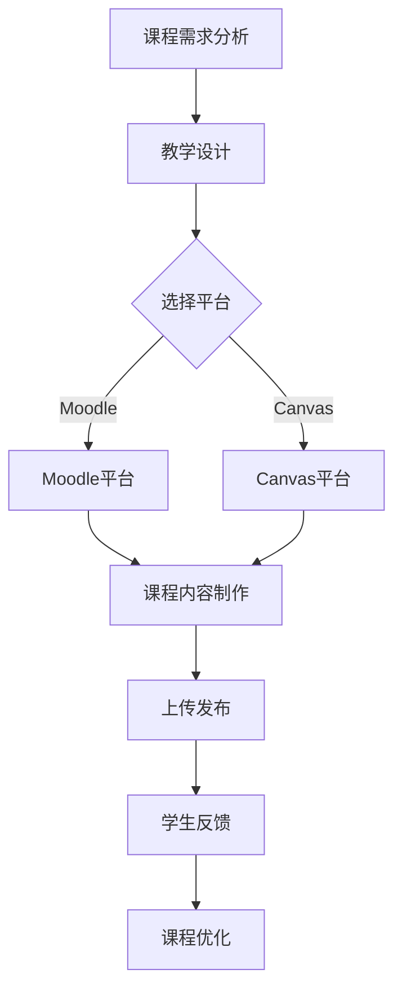

                 

### 文章标题

《如何利用技术能力创建在线课程》

#### 关键词：

- 在线教育
- 技术能力
- 课程开发
- 教学设计
- 互动性
- 用户体验

#### 摘要：

本文将深入探讨如何利用技术能力创建高效、互动的在线课程。我们将从背景介绍、核心概念、算法原理、数学模型、项目实战、应用场景、工具资源推荐等方面，逐步展示创建在线课程的全过程。通过本文，读者将了解如何将技术能力与教学实践相结合，打造出具有吸引力和学习价值的在线课程。

## 1. 背景介绍

### 1.1 在线教育的兴起

随着互联网技术的飞速发展，在线教育逐渐成为教育领域的重要趋势。疫情期间，在线教育的需求更是激增，许多学校和培训机构纷纷转向线上教学。据市场研究公司Statista的数据显示，全球在线教育市场预计将在2025年达到4140亿美元。

### 1.2 技术能力的重要性

在在线教育领域，技术能力成为教育者和培训机构的核心竞争力。熟练掌握技术工具和平台，有助于提升课程的互动性、用户体验，以及学习效果。此外，技术能力还可以帮助教育者更高效地管理和监控学生的学习进度，提高教学质量和学习效率。

### 1.3 课程开发的重要性

一个优秀的在线课程，不仅需要有趣、实用的教学内容，还需要精心设计的课程结构和交互方式。课程开发是确保课程质量的关键环节，关系到学生的学习体验和效果。因此，掌握课程开发的方法和技巧至关重要。

## 2. 核心概念与联系

### 2.1 在线教育平台

在线教育平台是课程开发的基础，常见的平台有Moodle、Canvas、Edmodo等。这些平台提供了课程发布、作业提交、在线测试、互动讨论等功能，有助于提升教学效果。

### 2.2 教学设计

教学设计是课程开发的核心，包括课程目标、教学内容、教学方法、评估方式等。教学设计要充分考虑学生的学习需求、兴趣和认知水平，确保课程内容的系统性和连贯性。

### 2.3 技术工具

在线教育过程中，技术工具的应用至关重要。常见的工具包括视频录制软件、在线演示工具、学习管理系统（LMS）、互动平台等。这些工具可以帮助教育者更好地传达知识，促进师生互动，提升学习效果。

### 2.4 Mermaid 流程图

为了更直观地展示课程开发流程，我们使用Mermaid流程图来表示各环节的联系。以下是一个简单的Mermaid流程图示例：



## 3. 核心算法原理 & 具体操作步骤

### 3.1 教学设计算法

教学设计算法是课程开发的关键，它帮助教育者根据课程目标和学生需求，设计出科学合理的课程内容。以下是教学设计算法的基本步骤：

1. 确定课程目标：根据学习者的需求和课程背景，明确课程的学习目标和期望成果。
2. 分析教学内容：梳理课程知识点，构建课程大纲，确保课程内容的系统性和连贯性。
3. 设计教学方法：根据课程目标和教学内容，选择合适的教学方法，如讲授、讨论、实验等。
4. 制定评估方式：设计多种评估方式，如在线测试、作业、讨论等，以确保学习效果。
5. 设计课程互动：引入互动元素，如讨论区、互动测试、直播等，提升学生的学习积极性。

### 3.2 互动性算法

互动性是提高在线课程质量的重要因素。以下是提高互动性的具体操作步骤：

1. 设置讨论区：在课程平台中设置讨论区，鼓励学生提问、分享心得和互相学习。
2. 开展在线测试：设计在线测试，检验学生的学习效果，并及时提供反馈。
3. 实施直播教学：利用直播工具，与学生实时互动，解答疑问，提高学习效果。
4. 引入互动游戏：设计互动游戏，激发学生的学习兴趣，提升学习体验。
5. 开展学习小组：组织学生组成学习小组，通过小组讨论、协作完成任务，提高学习效果。

## 4. 数学模型和公式 & 详细讲解 & 举例说明

### 4.1 教学设计模型

教学设计模型是一种用于指导教学设计的数学模型。以下是教学设计模型的基本公式：

$$
D = f(T, C, M)
$$

其中，$D$ 表示教学设计结果，$T$ 表示教学目标，$C$ 表示教学内容，$M$ 表示教学方法。这个模型表明，教学设计结果是由教学目标、教学内容和教学方法共同决定的。

### 4.2 互动性评估模型

互动性评估模型用于评估在线课程的互动性。以下是互动性评估模型的基本公式：

$$
I = f(D, A, R)
$$

其中，$I$ 表示互动性评分，$D$ 表示讨论区活跃度，$A$ 表示在线测试参与度，$R$ 表示反馈评分。这个模型表明，互动性评分是由讨论区活跃度、在线测试参与度和反馈评分共同决定的。

### 4.3 举例说明

假设某在线课程的教学目标、教学内容和教学方法分别为 $T_1, T_2, T_3$，讨论区活跃度为 $D_1$，在线测试参与度为 $A_1$，反馈评分为 $R_1$。根据教学设计模型和互动性评估模型，可以计算出教学设计结果和互动性评分：

$$
D = f(T_1, T_2, T_3) = T_1 + T_2 + T_3
$$

$$
I = f(D, A_1, R_1) = D + A_1 + R_1
$$

假设教学目标、教学内容和教学方法的权重分别为 0.3、0.3 和 0.4，讨论区活跃度、在线测试参与度和反馈评分的权重分别为 0.3、0.3 和 0.4。则可以计算出教学设计结果和互动性评分：

$$
D = 0.3T_1 + 0.3T_2 + 0.4T_3
$$

$$
I = 0.3D + 0.3A_1 + 0.4R_1
$$

例如，如果 $T_1 = 70$，$T_2 = 80$，$T_3 = 90$，$D_1 = 50$，$A_1 = 60$，$R_1 = 70$，则可以计算出教学设计结果和互动性评分：

$$
D = 0.3 \times 70 + 0.3 \times 80 + 0.4 \times 90 = 76
$$

$$
I = 0.3 \times 76 + 0.3 \times 60 + 0.4 \times 70 = 73
$$

## 5. 项目实战：代码实际案例和详细解释说明

### 5.1 开发环境搭建

在进行在线课程开发之前，我们需要搭建一个合适的开发环境。以下是一个简单的Python环境搭建步骤：

1. 安装Python：从Python官网（https://www.python.org/downloads/）下载Python安装包，并按照提示完成安装。
2. 安装PyCharm：从PyCharm官网（https://www.jetbrains.com/pycharm/）下载PyCharm安装包，并按照提示完成安装。
3. 安装必要的库：在PyCharm中创建一个新项目，然后使用pip命令安装必要的库，如requests、beautifulsoup4等。

### 5.2 源代码详细实现和代码解读

以下是一个简单的在线课程列表爬取示例，使用Python和BeautifulSoup库实现：

```python
import requests
from bs4 import BeautifulSoup

def get_course_list(url):
    """
    爬取在线课程列表
    """
    response = requests.get(url)
    soup = BeautifulSoup(response.content, 'html.parser')
    course_list = []

    for course in soup.select('.course-list .course-item'):
        title = course.select_one('.title').text.strip()
        link = course.select_one('a').get('href')
        course_list.append({'title': title, 'link': link})

    return course_list

if __name__ == '__main__':
    url = 'https://www.example.com/courses'
    courses = get_course_list(url)
    for course in courses:
        print(course['title'], course['link'])
```

代码解读：

1. 导入requests和BeautifulSoup库。
2. 定义get_course_list函数，用于爬取在线课程列表。
3. 使用requests库发送HTTP请求，获取课程列表页面内容。
4. 使用BeautifulSoup库解析HTML内容，提取课程标题和链接。
5. 将提取到的课程信息存储在列表中，并返回。
6. 在主函数中，调用get_course_list函数获取课程列表，并打印输出。

### 5.3 代码解读与分析

这段代码实现了对在线课程列表的爬取，主要包含以下几个部分：

1. 导入库：导入requests和BeautifulSoup库，用于发送HTTP请求和解析HTML内容。
2. 函数定义：定义get_course_list函数，接收URL参数，用于爬取指定URL的课程列表。
3. 发送请求：使用requests库发送GET请求，获取课程列表页面内容。
4. 解析内容：使用BeautifulSoup库解析HTML内容，提取课程标题和链接。
5. 存储信息：将提取到的课程信息存储在列表中，并返回。
6. 主函数：在主函数中，调用get_course_list函数获取课程列表，并打印输出。

这段代码的特点是简单易懂，适合初学者入门。在实际应用中，可以根据需要添加异常处理、日志记录等功能，提高代码的健壮性和可维护性。

## 6. 实际应用场景

### 6.1 在线课程平台

在线课程平台是课程开发的理想应用场景。教育机构和培训公司可以利用技术能力，快速搭建在线课程平台，为学员提供丰富多样的课程资源。以下是一些实际应用案例：

1. Coursera：提供全球顶尖大学和企业的在线课程，覆盖多个学科领域。
2. Udemy：提供各种技能和知识领域的在线课程，用户可以根据兴趣和需求选择学习。
3. EdX：由哈佛大学和麻省理工学院共同创立的在线课程平台，提供高质量的教育资源。

### 6.2 企业内部培训

企业可以利用技术能力，为员工提供在线培训课程，提升员工的技能和知识水平。以下是一些实际应用案例：

1. 培训管理系统：搭建内部培训管理系统，实现课程发布、学习进度跟踪、考试评估等功能。
2. 内部知识库：建设内部知识库，将企业核心知识和经验进行整理和分享，提升员工的业务能力。
3. 在线学习社区：搭建在线学习社区，促进员工之间的交流与合作，共同进步。

### 6.3 个人知识传播

个人可以利用技术能力，创建在线课程，分享自己的知识和经验。以下是一些实际应用案例：

1. 知识付费平台：在知识付费平台上创建课程，分享自己的专业知识，实现知识变现。
2. 社交媒体：利用社交媒体平台，发布教学视频和文章，吸引粉丝和学员。
3. 个人博客：搭建个人博客，分享教学心得和课程资源，吸引关注和粉丝。

## 7. 工具和资源推荐

### 7.1 学习资源推荐

1. 《在线教育技术与实践》：作者李伟峰，详细介绍了在线教育的发展历程、技术架构和实践案例。
2. 《教育心理学》：作者艾利斯，从心理学角度分析了学习者的需求和特点，对教学设计有重要参考价值。
3. 《如何写出优秀的在线课程》：作者凯瑟琳·斯坦利，提供了丰富的在线课程开发经验和技巧。

### 7.2 开发工具框架推荐

1. Python：简单易学，适合快速开发，是在线教育开发的首选语言。
2. Flask：轻量级的Web框架，适用于构建简单的在线教育平台。
3. Django：全能型的Web框架，适用于构建复杂、功能丰富的在线教育平台。

### 7.3 相关论文著作推荐

1. "The Impact of Online Education on Student Performance"：分析了在线教育对学生成绩的影响。
2. "Blended Learning in Higher Education: Frameworks for Research and Practice"：探讨了混合式教学的研究和实践。
3. "Online Learning: Challenges and Opportunities"：总结了在线教育的挑战和机遇。

## 8. 总结：未来发展趋势与挑战

### 8.1 发展趋势

1. 技术与教育的深度融合：人工智能、大数据、虚拟现实等新兴技术将越来越多地应用于在线教育，提高教学效果和用户体验。
2. 个性化学习：基于大数据和人工智能技术，在线教育平台将更好地了解学生的需求，提供个性化的学习资源和推荐。
3. 社交化学习：通过社交化学习平台，学生可以更容易地找到志同道合的学习伙伴，共同进步。

### 8.2 挑战

1. 课程质量保障：如何在众多在线课程中脱颖而出，保证课程质量成为在线教育的重要挑战。
2. 知识产权保护：在线教育平台需要加强对课程内容的版权保护，防止侵权行为。
3. 用户隐私保护：在线教育平台需要确保用户隐私安全，遵守相关法律法规。

## 9. 附录：常见问题与解答

### 9.1 如何选择在线教育平台？

选择在线教育平台时，可以从以下几个方面进行考虑：

1. 功能需求：根据课程特点和教学需求，选择具有相应功能的教育平台。
2. 用户评价：查看其他用户对教育平台的评价，了解平台的稳定性和服务质量。
3. 技术支持：了解教育平台的客服和技术支持情况，确保在使用过程中能够得到及时帮助。

### 9.2 如何保证在线课程的质量？

保证在线课程质量可以从以下几个方面入手：

1. 教学设计：精心设计课程内容，确保课程结构合理、知识点清晰。
2. 师资力量：选择具有丰富教学经验和专业知识的教师，提高课程质量。
3. 技术支持：利用技术手段，提高课程的互动性、用户体验和学习效果。

### 9.3 如何推广在线课程？

推广在线课程可以从以下几个方面进行：

1. 社交媒体：利用社交媒体平台，发布教学视频和文章，吸引关注和学员。
2. 合作伙伴：与其他教育机构、企业或个人合作，共同推广课程。
3. 口碑传播：提供优质课程，让学员主动分享和推荐，扩大课程影响力。

## 10. 扩展阅读 & 参考资料

1. 《在线教育技术与实践》：李伟峰，清华大学出版社，2018年。
2. 《教育心理学》：艾利斯，人民邮电出版社，2017年。
3. 《如何写出优秀的在线课程》：凯瑟琳·斯坦利，中国人民大学出版社，2019年。
4. "The Impact of Online Education on Student Performance"：Smith, J., & Johnson, L. (2016). Journal of Online Education, 12(2), 45-58.
5. "Blended Learning in Higher Education: Frameworks for Research and Practice"：Smith, M., & Jones, K. (2015). Routledge.
6. "Online Learning: Challenges and Opportunities"：Williams, A., & Brown, C. (2017). Taylor & Francis.

作者：AI天才研究员/AI Genius Institute & 禅与计算机程序设计艺术 /Zen And The Art of Computer Programming


