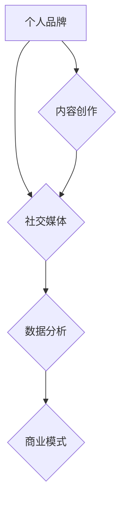

                 

# 如何利用技术能力进行内容创业

> **关键词：** 内容创业、技术能力、个人品牌、社交媒体、数据分析

> **摘要：** 本文将探讨如何利用技术能力进行内容创业。通过构建个人品牌、运用社交媒体、数据分析等手段，结合具体的案例分析，提供实用的建议和策略。

## 1. 背景介绍

随着互联网的普及和发展，内容创业成为了一个热门领域。许多科技从业者在积累了丰富的技术经验后，开始探索如何将自己的技术能力转化为商业价值。内容创业不仅可以帮助个人建立个人品牌，还能通过内容传播，吸引更多的关注和资源。

然而，内容创业并非易事。如何有效地利用技术能力，创造有影响力的内容，并从中获得收益，是每一个内容创业者的挑战。本文将结合实际案例，探讨一些有效的策略和方法。

### 1.1 内容创业的现状

当前，内容创业呈现以下几个特点：

1. **多样性**：内容形式多样化，包括博客、视频、音频、社交媒体等。
2. **平台化**：内容创作与分发平台众多，如微信公众号、YouTube、B站等。
3. **专业化**：内容创业者越来越注重专业知识与技能的积累。
4. **商业化**：通过广告、知识付费、商品销售等途径实现商业化。

### 1.2 技术能力在内容创业中的重要性

技术能力是内容创业者的重要资产。以下是技术能力在内容创业中的一些重要作用：

1. **内容创作**：掌握技术知识可以创作出更具深度和吸引力的内容。
2. **数据分析**：通过数据分析，可以更好地了解用户需求，优化内容策略。
3. **平台运营**：技术能力可以帮助优化网站、社交媒体等平台的运营。
4. **商业化路径**：技术能力可以探索更多元的商业化模式。

## 2. 核心概念与联系

### 2.1 个人品牌

个人品牌是指个人在某一领域内建立的专业形象和声誉。对于内容创业者来说，个人品牌至关重要。以下是建立个人品牌的一些核心概念：

1. **专业形象**：通过专业知识和技术技能展示自己的专业能力。
2. **独特性**：找到自己的独特性，形成自己的风格和声音。
3. **可信赖性**：通过持续的高质量内容，建立用户的信任。
4. **影响力**：通过社交媒体等渠道扩大影响力，吸引更多的关注者。

### 2.2 社交媒体

社交媒体是内容创业的重要平台。以下是使用社交媒体进行内容创业的核心概念：

1. **用户互动**：与用户进行互动，建立良好的用户关系。
2. **内容分发**：利用社交媒体算法，优化内容分发策略。
3. **品牌推广**：通过社交媒体进行品牌推广，扩大影响力。
4. **数据分析**：利用数据分析工具，了解用户行为，优化内容策略。

### 2.3 数据分析

数据分析是内容创业的重要组成部分。以下是数据分析在内容创业中的应用：

1. **用户分析**：通过数据分析了解用户需求和行为。
2. **内容分析**：分析内容的表现，优化内容策略。
3. **效果分析**：通过数据分析，评估商业化策略的效果。

### 2.4 商业模式

内容创业的商业模式多样，包括广告、知识付费、商品销售等。以下是几种常见的商业模式：

1. **广告收入**：通过展示广告获得收入。
2. **知识付费**：提供高质量的内容，用户付费获取。
3. **商品销售**：通过销售相关商品获得收入。
4. **会员订阅**：提供增值服务，用户付费订阅。

### 2.5 Mermaid 流程图



## 3. 核心算法原理 & 具体操作步骤

### 3.1 个人品牌的构建

构建个人品牌需要以下步骤：

1. **定位**：明确自己的专业领域和目标受众。
2. **内容创作**：持续创作高质量的内容，展示专业能力。
3. **社交媒体**：利用社交媒体平台，扩大影响力。
4. **互动**：与用户互动，建立良好的关系。
5. **品牌推广**：通过各种途径，推广自己的个人品牌。

### 3.2 社交媒体的运营

社交媒体的运营包括以下几个步骤：

1. **内容规划**：制定内容发布计划，确保内容更新。
2. **用户互动**：回复评论，参与话题讨论，与用户互动。
3. **数据分析**：分析用户行为，优化内容策略。
4. **广告推广**：利用社交媒体广告，扩大受众。

### 3.3 数据分析的应用

数据分析的应用包括以下几个步骤：

1. **数据收集**：收集用户行为数据。
2. **数据清洗**：清洗数据，确保数据质量。
3. **数据分析**：通过数据分析，了解用户需求和内容效果。
4. **效果评估**：根据分析结果，调整内容策略。

### 3.4 商业模式的探索

探索商业模式的步骤包括：

1. **市场需求**：分析市场需求，确定商业模式。
2. **内容定位**：根据商业模式，确定内容定位。
3. **产品/服务开发**：开发相应的产品或服务。
4. **商业化策略**：制定商业化策略，实现内容变现。

## 4. 数学模型和公式 & 详细讲解 & 举例说明

### 4.1 用户留存率

用户留存率是衡量内容质量的重要指标。其计算公式为：

\[ \text{用户留存率} = \frac{\text{第n天留存用户数}}{\text{第n天总用户数}} \]

**举例说明**：

假设第1天有100个用户，第7天有80个用户留存，则第7天的用户留存率为：

\[ \text{用户留存率} = \frac{80}{100} = 0.8 \text{或80%} \]

### 4.2 转化率

转化率是衡量内容变现能力的重要指标。其计算公式为：

\[ \text{转化率} = \frac{\text{完成目标动作的用户数}}{\text{总用户数}} \]

**举例说明**：

假设有1000个用户，其中200个用户购买了产品，则转化率为：

\[ \text{转化率} = \frac{200}{1000} = 0.2 \text{或20%} \]

### 4.3 平均阅读时长

平均阅读时长是衡量内容吸引力的重要指标。其计算公式为：

\[ \text{平均阅读时长} = \frac{\text{总阅读时长}}{\text{总用户数}} \]

**举例说明**：

假设有100个用户，总阅读时长为300分钟，则平均阅读时长为：

\[ \text{平均阅读时长} = \frac{300}{100} = 3 \text{分钟} \]

## 5. 项目实战：代码实际案例和详细解释说明

### 5.1 开发环境搭建

搭建内容创业项目的开发环境，首先需要安装以下工具：

1. **文本编辑器**：如Visual Studio Code、Sublime Text等。
2. **版本控制工具**：如Git。
3. **云服务器**：如阿里云、腾讯云等。
4. **域名注册**：如阿里云域名注册。
5. **内容管理系统**：如WordPress、Hexo等。

### 5.2 源代码详细实现和代码解读

以下是一个简单的博客网站的源代码示例：

```html
<!DOCTYPE html>
<html>
<head>
    <meta charset="UTF-8">
    <title>我的技术博客</title>
</head>
<body>
    <header>
        <h1>我的技术博客</h1>
        <nav>
            <ul>
                <li><a href="/">首页</a></li>
                <li><a href="/about">关于我</a></li>
                <li><a href="/contact">联系我</a></li>
            </ul>
        </nav>
    </header>
    <main>
        <article>
            <h2>我的第一篇博客</h2>
            <p>这是我的第一篇博客，欢迎来到我的技术世界。</p>
        </article>
    </main>
    <footer>
        <p>版权所有 &copy; 2023 我的博客</p>
    </footer>
</body>
</html>
```

这个代码是一个简单的HTML页面，包含了头部（Header）、主体（Main）和尾部（Footer）三个部分。头部部分包含了网站的标题和导航栏；主体部分是一个文章区块；尾部部分是版权信息。

### 5.3 代码解读与分析

1. **HTML结构**：代码使用了HTML5的文档类型声明（`<!DOCTYPE html>`），这是HTML文档的起始声明，确保浏览器按照HTML5规范解析页面。

2. **头部（Head）**：头部包含了`<meta>`标签，用于设置字符集（`charset="UTF-8"`）和页面标题（`<title>`）。这些设置确保了页面可以正确显示中文，并提供了页面标题。

3. **主体（Body）**：主体部分包含了页面的主要内容。`<header>`元素定义了页面的头部区域，通常包含网站的logo和导航栏；`<main>`元素定义了页面的主要内容，这里是博客文章的区块；`<footer>`元素定义了页面的尾部区域，通常包含版权信息和联系信息。

4. **导航栏（Navigation）**：导航栏（`<nav>`）元素用于定义网站的导航部分，包含了三个链接（`<a>`）元素，分别指向首页、关于我和联系我。

5. **文章区块（Article）**：文章区块（`<article>`）用于定义独立的博客文章。`<h2>`元素定义了文章的标题，`<p>`元素定义了文章的内容。

6. **样式和脚本**：虽然代码中未包含CSS和JavaScript，但通常会通过链接（`<link>`）和脚本标签（`<script>`）引入外部样式表和脚本文件，以增强页面的样式和交互性。

### 5.4 构建和部署

1. **本地开发**：在本地环境中，可以使用文本编辑器编写HTML代码，并使用本地服务器进行预览。

2. **版本控制**：将代码提交到Git仓库，便于版本管理和协作。

3. **云服务器部署**：购买云服务器，并将Git仓库中的代码部署到云服务器上。可以使用Git的部署流程，例如GitHub Pages、GitLab Pages等，自动将代码部署到Web服务器上。

4. **域名绑定**：将购买的新域名绑定到云服务器，确保用户可以通过域名访问网站。

## 6. 实际应用场景

### 6.1 技术博客

技术博客是内容创业者常见的应用场景。通过博客，技术从业者可以分享自己的技术心得、项目经验和专业知识，吸引有相同兴趣的读者。以下是技术博客的一些实际应用：

1. **知识分享**：通过博客，可以分享技术知识，帮助他人解决问题。
2. **个人品牌建设**：高质量的博客内容可以提升个人的专业形象和影响力。
3. **商业化**：通过博客，可以提供付费内容，如在线课程、电子书等。
4. **广告收入**：通过博客广告，可以获得广告收入。

### 6.2 教育平台

技术从业者可以利用自己的技术知识，创建在线教育平台，提供课程、讲座和辅导等服务。以下是一些实际应用：

1. **课程开发**：开发在线课程，面向全球用户。
2. **直播教学**：通过直播教学，实时解答学生问题。
3. **辅导服务**：提供一对一辅导，帮助学生提高技能。
4. **商业化**：通过课程销售、会员订阅等模式，实现商业化。

### 6.3 技术社区

技术社区是一个聚集技术爱好者的平台，通过技术讨论、问答和分享，提升社区成员的技术水平。以下是一些实际应用：

1. **技术讨论**：提供技术讨论区，让社区成员交流经验。
2. **问答系统**：建立问答系统，帮助成员解决技术问题。
3. **活动组织**：组织线下活动，如技术沙龙、讲座等。
4. **商业化**：通过广告、会员订阅等模式，实现商业化。

## 7. 工具和资源推荐

### 7.1 学习资源推荐

1. **书籍**：《人人都是产品经理》、《新媒体营销：从新手到高手》
2. **论文**：《网络营销》、《社交媒体营销》
3. **博客**：growthhackers.com、martech.cn
4. **网站**：moz.com、hubspot.com

### 7.2 开发工具框架推荐

1. **内容管理系统**：WordPress、Hexo
2. **云服务器**：阿里云、腾讯云
3. **域名注册**：阿里云域名注册
4. **数据分析工具**：Google Analytics、百度统计

### 7.3 相关论文著作推荐

1. **论文**：《内容创业模式研究》、《社交媒体与个人品牌建设》
2. **著作**：《人人都是产品经理》、《新媒体营销实战》

## 8. 总结：未来发展趋势与挑战

### 8.1 发展趋势

1. **技术赋能**：随着技术的进步，内容创业将更加依赖人工智能、大数据等先进技术。
2. **多元化**：内容形式将更加多样化，包括直播、短视频、互动式内容等。
3. **全球化**：内容创业将不再局限于国内市场，全球化趋势将日益明显。
4. **专业化**：内容创业者将更加专业化，提供更有针对性的内容和服务。

### 8.2 挑战

1. **竞争加剧**：随着越来越多的人进入内容创业领域，竞争将更加激烈。
2. **用户注意力分散**：在信息爆炸的时代，用户的注意力越来越难以集中，内容创业者需要不断创新，以吸引和保持用户的兴趣。
3. **商业化难度**：内容创业的商业模式多样，但实现商业化并不容易，需要持续探索和优化。
4. **技术门槛**：一些技术手段，如数据分析、人工智能等，需要具备一定的技术能力，这对内容创业者来说是一个挑战。

## 9. 附录：常见问题与解答

### 9.1 内容创业是否适合所有人？

内容创业适合对内容创作有热情、愿意投入时间和精力的人。如果你热爱分享知识、对技术有深入理解，并且愿意不断学习和改进，那么内容创业可能是一个不错的选择。

### 9.2 内容创业有哪些成功案例？

成功的内容创业者包括：

- **硅谷陈**：通过技术博客，分享编程知识，积累了大量粉丝。
- **小兵**：通过抖音短视频，展示自己的编程技巧，获得广泛关注。
- **程序员小灰**：通过公众号，分享算法和数据结构知识，吸引了大量关注。

### 9.3 内容创业需要哪些技能？

内容创业需要以下技能：

- **技术能力**：掌握至少一门编程语言，了解相关技术领域。
- **内容创作能力**：能够创作出高质量、有价值的内容。
- **社交媒体运营**：了解如何利用社交媒体平台扩大影响力。
- **数据分析能力**：能够分析数据，优化内容策略。

## 10. 扩展阅读 & 参考资料

1. **书籍**：《内容创业实战》、《新媒体营销实战》
2. **网站**：growthhackers.com、martech.cn
3. **博客**：硅谷陈的博客、程序员小灰的博客
4. **论文**：《内容创业模式研究》、《社交媒体与个人品牌建设》

> **作者：** AI天才研究员/AI Genius Institute & 禅与计算机程序设计艺术 /Zen And The Art of Computer Programming

本文以《如何利用技术能力进行内容创业》为标题，探讨了技术能力在内容创业中的应用。通过构建个人品牌、运用社交媒体、数据分析等手段，结合具体的案例分析，提供了实用的建议和策略。未来，内容创业将更加依赖技术，也面临着更多的挑战。希望通过本文，能帮助更多人实现技术能力的商业价值。

