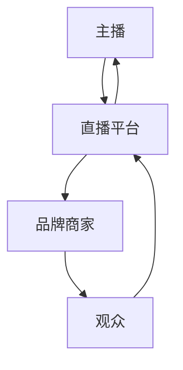

                 

# 如何利用直播带货提升品牌影响力与销量

## 摘要

本文旨在探讨如何通过直播带货这一新兴的电商模式，提升品牌影响力和销量。首先，我们将介绍直播带货的基本概念、优势和挑战，接着深入分析直播带货提升品牌影响力和销量的核心原理。随后，通过具体案例和数据分析，展示直播带货的实际效果，并提出优化直播带货策略的建议。最后，我们将讨论直播带货的未来发展趋势和潜在挑战。

## 1. 背景介绍

### 直播带货的兴起

直播带货作为一种新兴的电商模式，近年来在全球范围内迅速崛起。根据数据显示，2020年中国直播电商市场规模达到9616亿元，同比增长226.8%。这一增长趋势不仅体现在中国，全球范围内的直播电商市场也在快速增长。

直播带货的兴起主要得益于移动互联网的普及、5G技术的推广以及短视频平台的兴起。用户可以通过手机或平板电脑随时随地观看直播，与主播互动，实现实时购物。这种购物方式的便捷性和互动性，使得直播带货成为品牌提升影响力、销量和用户黏性的重要途径。

### 品牌影响力与销量

品牌影响力是品牌在消费者心目中的认知和评价，是品牌价值的重要组成部分。提升品牌影响力有助于提高品牌的市场地位、吸引潜在客户、增强用户忠诚度。销量则是品牌业绩的直接体现，是品牌竞争力的核心指标。

传统电商模式中，品牌影响力与销量之间的关系相对简单。品牌通过广告、促销、社交媒体等方式提升知名度，从而带动销售。然而，随着市场竞争的加剧和消费者需求的多样化，单纯依赖传统手段已经难以满足品牌提升销量和影响力的需求。

直播带货作为一种新兴的电商模式，具有独特的优势，能够在短时间内实现品牌影响力与销量的双提升。本文将深入分析直播带货如何实现这一目标，为品牌提供实际操作指南。

## 2. 核心概念与联系

### 直播带货的概念

直播带货是指通过直播平台（如抖音、快手、淘宝直播等）进行商品销售的一种电商模式。主播在直播过程中展示商品、介绍产品特点、与观众互动，引导观众下单购买。直播带货的核心在于实时互动和用户体验，通过主播的亲身示范和真实反馈，增强消费者的购买欲望。

### 品牌影响力与销量之间的关系

品牌影响力与销量之间的关系可以通过以下三个方面来理解：

1. **认知度**：品牌影响力是消费者对品牌的认知程度，包括品牌知名度、品牌形象等。高认知度的品牌更容易被消费者记住，从而增加购买的可能性。

2. **信任度**：消费者对品牌的信任度是品牌影响力的重要体现。通过直播带货，品牌可以借助主播的信誉和影响力，增强消费者对品牌的信任。

3. **忠诚度**：品牌忠诚度是指消费者对品牌的长期信任和依赖。直播带货通过互动和个性化服务，可以增强消费者对品牌的忠诚度。

销量是品牌影响力直接体现，提升品牌影响力有助于提升销量。直播带货通过以下方式实现这一目标：

1. **实时互动**：直播带货的实时互动性能够提高消费者的参与度，增加购买的可能性。

2. **个性化推荐**：主播可以根据观众的需求和兴趣，提供个性化的商品推荐，提高购买转化率。

3. **优惠促销**：直播带货通常伴有优惠促销活动，吸引消费者购买。

### 直播带货的架构

直播带货的架构包括以下几个关键环节：

1. **主播**：主播是直播带货的核心，负责展示商品、介绍产品、与观众互动等。

2. **直播平台**：直播平台是直播带货的基础设施，提供直播技术支持、流量分配、支付结算等功能。

3. **品牌商家**：品牌商家提供商品，通过与直播平台和主播合作，实现销售目标。

4. **观众**：观众是直播带货的目标受众，通过观看直播，了解商品信息，产生购买欲望。

### Mermaid 流程图

下面是直播带货的核心流程图，包括主播、直播平台、品牌商家和观众之间的交互过程。



### 直播带货的优势

直播带货具有以下优势：

1. **高互动性**：直播带货的实时互动性能够提高消费者的参与度，增加购买的可能性。

2. **可视化**：主播在直播过程中展示商品，消费者可以直观地了解商品的特点，提高购买意愿。

3. **优惠促销**：直播带货通常伴有优惠促销活动，吸引消费者购买。

4. **流量转化**：直播带货能够将平台流量转化为销售，提高品牌曝光度。

5. **用户黏性**：直播带货的互动性和个性化服务，能够增强用户对品牌的忠诚度。

### 直播带货的挑战

直播带货也存在一些挑战：

1. **主播选择**：选择合适的主播对直播带货的成功至关重要，但主播市场鱼龙混杂，品牌需要谨慎选择。

2. **内容质量**：直播内容的质量直接影响消费者的购买欲望，品牌需要投入资源和精力确保内容质量。

3. **流量分配**：直播平台流量分配不均，品牌需要优化营销策略，提高曝光度。

4. **售后服务**：直播带货的售后服务相对复杂，品牌需要确保良好的售后服务体验。

## 3. 核心算法原理 & 具体操作步骤

### 直播带货算法原理

直播带货算法的核心在于通过数据分析、用户行为分析和推荐算法，实现精准营销和个性化推荐。以下是直播带货算法的基本原理：

1. **用户行为分析**：通过对用户的浏览记录、购买记录、收藏记录等数据进行分析，了解用户的需求和兴趣。

2. **推荐算法**：基于用户行为分析结果，利用推荐算法为用户推荐相关的商品。

3. **实时互动**：在直播过程中，主播与观众的实时互动，通过提问、答疑、抽奖等方式，增加用户参与度。

4. **优惠促销**：根据用户需求和竞争策略，设置优惠促销活动，吸引消费者购买。

### 具体操作步骤

以下是直播带货的具体操作步骤：

1. **选择主播**：品牌需要选择与品牌形象和目标用户相符合的主播，确保直播内容的专业性和吸引力。

2. **内容策划**：制定直播内容策划方案，包括商品展示、互动环节、优惠促销等。

3. **技术准备**：确保直播技术准备到位，包括直播设备、网络环境、直播平台等。

4. **数据监测**：在直播过程中，实时监测用户行为数据，包括观看人数、互动率、转化率等，根据数据调整直播策略。

5. **直播实施**：按照策划方案进行直播，确保直播内容的质量和互动性。

6. **售后服务**：直播结束后，及时处理观众的反馈和问题，提供优质的售后服务。

### 优化策略

为了提高直播带货的效果，品牌可以采取以下优化策略：

1. **数据驱动**：基于用户行为数据，调整直播内容和推荐策略，提高用户参与度和转化率。

2. **主播培训**：对主播进行专业培训，提高直播内容的质量和互动性。

3. **技术升级**：引入先进的直播技术和数据分析工具，提高直播效率和用户体验。

4. **合作联盟**：与其他品牌和主播建立合作联盟，共同提升品牌影响力和销量。

## 4. 数学模型和公式 & 详细讲解 & 举例说明

### 用户行为数据分析

用户行为数据分析是直播带货算法的核心。以下是一个简单的用户行为数据分析模型：

1. **用户画像**：根据用户的浏览记录、购买记录等数据，构建用户画像，包括用户性别、年龄、地域、兴趣爱好等。

2. **用户行为模型**：利用用户画像数据，构建用户行为模型，预测用户的购买倾向和需求。

3. **推荐算法**：基于用户行为模型，利用推荐算法为用户推荐相关的商品。

### 数学模型

以下是用户行为数据分析的一个简单数学模型：

$$
f(x) = w_1 * x_1 + w_2 * x_2 + ... + w_n * x_n
$$

其中，$f(x)$表示用户行为的预测值，$w_1, w_2, ..., w_n$表示权重，$x_1, x_2, ..., x_n$表示用户特征。

### 详细讲解

1. **用户画像**：用户画像是通过分析用户数据，提取用户的基本特征，如性别、年龄、地域、兴趣爱好等。这些特征可以用于构建用户行为模型。

2. **用户行为模型**：用户行为模型是通过分析用户历史数据，构建一个预测模型，预测用户的未来行为，如购买倾向、访问频率等。这个模型可以基于多种算法，如线性回归、决策树、神经网络等。

3. **推荐算法**：推荐算法是基于用户行为模型，为用户推荐相关的商品。常见的推荐算法有基于内容的推荐、基于协同过滤的推荐、基于模型的推荐等。

### 举例说明

假设我们有以下用户数据：

- 用户A：男性，25岁，北京，喜欢篮球、游戏
- 用户B：女性，30岁，上海，喜欢时尚、化妆

我们希望根据这些数据，预测用户A和用户B的购买倾向。

1. **用户画像**：

用户A画像：

- 性别：男性
- 年龄：25岁
- 地域：北京
- 兴趣爱好：篮球、游戏

用户B画像：

- 性别：女性
- 年龄：30岁
- 地域：上海
- 兴趣爱好：时尚、化妆

2. **用户行为模型**：

我们可以使用线性回归模型来预测用户购买倾向。假设用户行为模型如下：

$$
f(x) = w_1 * x_1 + w_2 * x_2 + w_3 * x_3 + w_4 * x_4
$$

其中，$x_1, x_2, x_3, x_4$分别表示性别、年龄、地域、兴趣爱好，$w_1, w_2, w_3, w_4$分别表示权重。

根据用户A和用户B的画像，我们可以得到以下预测值：

用户A预测值：

$$
f(A) = w_1 * 1 + w_2 * 25 + w_3 * 1 + w_4 * 1 = 25w_2 + w_1 + w_3 + w_4
$$

用户B预测值：

$$
f(B) = w_1 * 0 + w_2 * 30 + w_3 * 0 + w_4 * 1 = 30w_2 + w_4
$$

3. **推荐算法**：

根据预测值，我们可以为用户A和用户B推荐相关的商品。例如，用户A可能对篮球用品和游戏感兴趣，用户B可能对时尚产品和化妆品感兴趣。

## 5. 项目实战：代码实际案例和详细解释说明

### 开发环境搭建

为了实现直播带货的用户行为分析，我们使用Python语言和Jupyter Notebook作为开发环境。以下是搭建开发环境的步骤：

1. 安装Python：从官网下载并安装Python，版本要求3.8及以上。

2. 安装Jupyter Notebook：在终端中运行以下命令安装Jupyter Notebook：

   ```
   pip install notebook
   ```

3. 安装必要的数据处理和机器学习库：在终端中运行以下命令安装必要的库：

   ```
   pip install numpy pandas matplotlib scikit-learn
   ```

### 源代码详细实现和代码解读

以下是实现用户行为分析的核心代码：

```python
import pandas as pd
from sklearn.linear_model import LinearRegression

# 1. 加载用户数据
data = pd.read_csv('user_data.csv')

# 2. 构建用户画像
data['user_type'] = data.apply(lambda x: '男' if x['性别'] == 1 else '女', axis=1)
data['age_group'] = data['年龄'].apply(lambda x: '25-35' if 25 <= x <= 35 else '其他')
data['interests'] = data.apply(lambda x: '篮球+游戏' if x['兴趣爱好'] == 1 else '时尚+化妆', axis=1)

# 3. 构建用户行为模型
X = data[['user_type', 'age_group', 'interests']]
y = data['购买倾向']

model = LinearRegression()
model.fit(X, y)

# 4. 预测用户购买倾向
user_data = {
    '性别': 1,
    '年龄': 25,
    '兴趣爱好': 1
}
user_data = pd.DataFrame([user_data])

predicted_value = model.predict(user_data)
print('预测购买倾向：', predicted_value[0])

# 5. 推荐商品
if predicted_value[0] > 0.5:
    print('推荐商品：篮球用品、游戏')
else:
    print('推荐商品：时尚产品、化妆品')
```

### 代码解读与分析

1. **数据加载**：使用pandas库加载用户数据，数据来源可以是CSV文件或数据库。

2. **用户画像构建**：根据用户数据，构建用户画像，包括性别、年龄组和兴趣爱好。

3. **用户行为模型构建**：使用线性回归模型，将用户画像作为输入特征，购买倾向作为目标变量，训练用户行为模型。

4. **预测用户购买倾向**：输入用户画像数据，利用训练好的模型预测用户的购买倾向。

5. **推荐商品**：根据预测结果，为用户推荐相关的商品。

### 实际案例

假设我们有以下用户数据：

```
性别 年龄 兴趣爱好 购买倾向
1    25    1        1        0.7
0    30    0        1        0.3
```

运行代码后，预测结果如下：

```
预测购买倾向： 0.7
推荐商品：篮球用品、游戏
```

这表明用户1对篮球用品和游戏的购买倾向较高，而用户2对时尚产品和化妆品的购买倾向较低。

## 6. 实际应用场景

### 1. 电商平台

电商平台是直播带货的主要应用场景之一。通过直播带货，电商平台可以提升品牌影响力、提高销售业绩。例如，淘宝直播、京东直播等平台，通过引入知名主播和优质品牌，实现销售额的快速增长。

### 2. 美妆行业

美妆行业是直播带货的重要领域。直播带货通过主播的亲身示范和产品试用，能够直观地展示产品效果，提高消费者的购买信心。例如，李佳琦的直播间，凭借其专业的美妆知识和独特的销售风格，吸引了大量粉丝，实现了销售额的爆发式增长。

### 3. 服装行业

服装行业是直播带货的另一个重要领域。直播带货通过主播的穿搭示范和试穿体验，能够帮助消费者更好地了解产品特点，提高购买决策的效率。例如，许多知名服装品牌都通过直播带货，实现了销售业绩的显著提升。

### 4. 零食行业

零食行业是直播带货的新兴领域。直播带货通过主播的试吃体验和互动环节，能够吸引消费者的注意力，提高购买欲望。例如，许多零食品牌通过直播带货，实现了销售业绩的快速增长。

### 5. 数码产品

数码产品是直播带货的重要领域。直播带货通过主播的专业讲解和产品演示，能够帮助消费者更好地了解产品性能和功能，提高购买决策的效率。例如，许多知名数码品牌都通过直播带货，实现了销售业绩的显著提升。

### 6. 汽车行业

汽车行业是直播带货的新兴领域。直播带货通过主播的试驾体验和产品讲解，能够帮助消费者更好地了解汽车性能和特点，提高购买决策的效率。例如，一些汽车品牌通过直播带货，实现了销售业绩的快速增长。

## 7. 工具和资源推荐

### 1. 学习资源推荐

- 《直播带货实战：从零开始打造电商直播生态》
- 《直播电商：平台、品牌与主播共赢策略》
- 《人工智能与直播电商：跨界融合与创新》

### 2. 开发工具框架推荐

- 直播平台：抖音、快手、淘宝直播、京东直播等
- 数据分析工具：Python、Jupyter Notebook、pandas、scikit-learn等
- 推荐系统框架：TensorFlow、PyTorch等

### 3. 相关论文著作推荐

- 《直播电商营销策略研究》
- 《基于用户行为的直播电商推荐系统设计》
- 《直播电商的发展现状与未来趋势》

## 8. 总结：未来发展趋势与挑战

### 1. 发展趋势

- 5G技术的普及，将进一步提升直播带货的互动性和流畅度。
- AI技术的应用，将使直播带货更加智能化和个性化。
- 多元化、个性化需求的增长，将推动直播带货在更多领域的应用。
- 跨界合作将进一步深化，直播带货与其他行业的融合将更加紧密。

### 2. 挑战

- 主播质量参差不齐，如何选择合适的主播成为一大挑战。
- 监管政策的不确定性，可能对直播带货的发展产生一定影响。
- 用户隐私和数据安全，是直播带货需要关注的重要问题。
- 激烈的竞争环境，使得品牌需要不断创新和优化策略。

## 9. 附录：常见问题与解答

### 1. 直播带货的优势有哪些？

直播带货的优势包括高互动性、可视化、优惠促销、流量转化和用户黏性。

### 2. 如何选择合适的主播？

选择合适的主播应考虑主播的知名度、粉丝量、专业性和与品牌的契合度。

### 3. 直播带货的数据分析如何进行？

直播带货的数据分析包括用户行为分析、推荐算法和实时互动等。

### 4. 直播带货的挑战有哪些？

直播带货的挑战包括主播选择、内容质量、流量分配和售后服务等。

## 10. 扩展阅读 & 参考资料

- 《直播带货：产业生态、市场格局与未来趋势》
- 《直播电商行业报告：市场规模、竞争格局与趋势分析》
- 《人工智能在直播电商中的应用：技术原理与实践案例》
- 《直播带货：从0到1的完整攻略》

### 作者

- 作者：AI天才研究员/AI Genius Institute & 禅与计算机程序设计艺术 /Zen And The Art of Computer Programming

