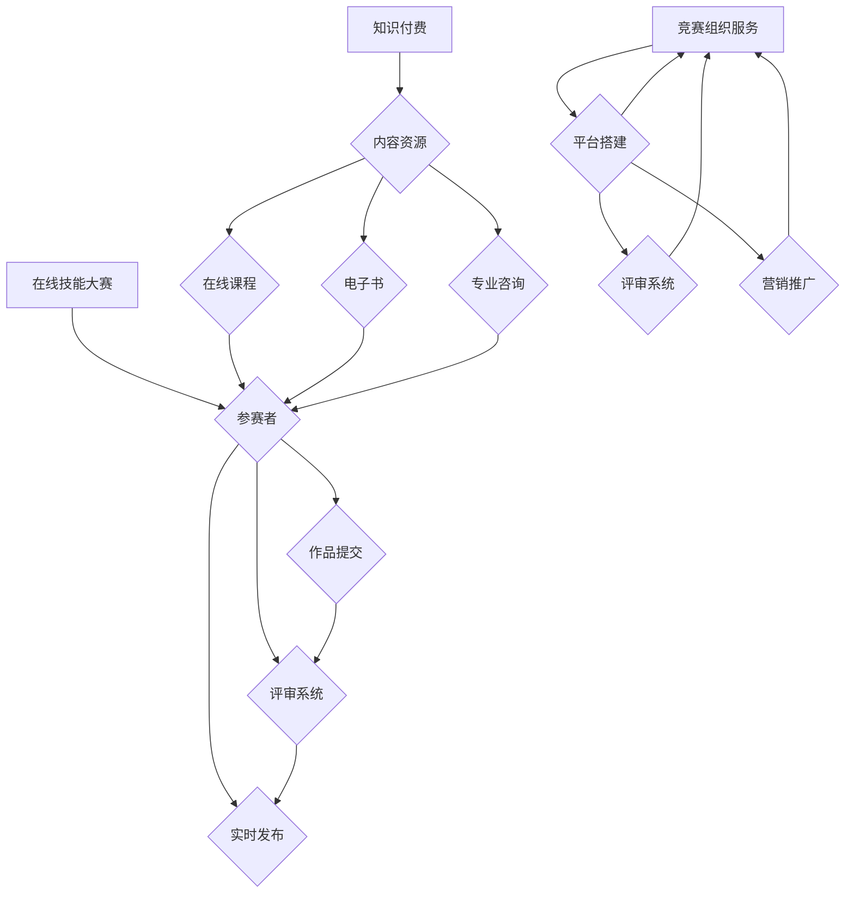

                 

# 如何利用知识付费实现在线技能大赛与竞赛组织服务？

> **关键词：** 知识付费、在线技能大赛、竞赛组织、服务模式、技术实现

> **摘要：** 本文将探讨如何通过知识付费模式，结合在线技能大赛与竞赛组织服务，实现教育、培训与技能认证的有机结合。文章将详细分析相关核心概念、技术实现方法，并给出具体操作步骤、数学模型、实际应用案例，以及未来发展趋势与挑战。

## 1. 背景介绍

随着互联网技术的发展，在线教育逐渐成为主流，知识付费市场也随之壮大。知识付费指的是用户为获取专业内容、知识或服务而付费的行为，如在线课程、电子书、专业咨询等。在线技能大赛与竞赛组织服务则是在这一背景下产生的，旨在通过竞赛形式，提高个人技能水平，检验学习效果，同时也是企业选拔人才、推广品牌的有效途径。

当前，知识付费与在线技能大赛的结合已呈现以下趋势：

1. **多元化的竞赛形式**：从编程、设计、营销等多个领域，推出了丰富的在线竞赛项目。
2. **灵活的参与方式**：用户可以随时随地参与竞赛，降低了参与门槛。
3. **严格的评审体系**：通过专家评审、匿名评审等机制，确保竞赛的公正性。

然而，在实际操作中，仍存在以下挑战：

1. **用户体验**：如何提升用户参与度，确保竞赛过程的流畅性和趣味性。
2. **技术支持**：构建一个稳定、高效的在线竞赛平台，需要强大的技术支持。
3. **付费模式**：如何设计合理的付费模式，既满足用户需求，又能保证平台的可持续发展。

本文将围绕这些挑战，探讨如何利用知识付费实现在线技能大赛与竞赛组织服务的创新模式。

## 2. 核心概念与联系

### 2.1 知识付费

知识付费的核心概念是将知识产品化，通过付费方式向用户提供。其主要模式包括：

- **在线课程**：系统性的知识传授，通常由专家或行业领袖主讲。
- **电子书**：浓缩的知识点，便于用户快速获取关键信息。
- **专业咨询**：针对特定问题，提供个性化解决方案。

### 2.2 在线技能大赛

在线技能大赛是指通过互联网平台，组织各类专业竞赛，参赛者在线提交作品或解决方案，由评委进行评审。其主要特点包括：

- **开放性**：用户可以不受地域限制，自由参与。
- **公平性**：采用匿名评审、评分标准统一等手段，确保评审过程的公正。
- **实时性**：竞赛过程和结果实时发布，便于用户跟踪和参与。

### 2.3 竞赛组织服务

竞赛组织服务是指为各类竞赛提供全面的支持和保障，包括：

- **平台搭建**：提供稳定、高效的竞赛平台，确保竞赛过程顺利进行。
- **评审系统**：构建科学的评审体系，确保评审结果的公正和准确。
- **营销推广**：通过多种渠道，提高竞赛的知名度和参与度。

### 2.4 三者联系

知识付费、在线技能大赛与竞赛组织服务之间存在着紧密的联系。知识付费为在线技能大赛提供了丰富的内容资源，为参赛者提供了学习基础；在线技能大赛为知识付费提供了实际应用场景，检验了用户的学习效果；竞赛组织服务则将两者有机结合，提供了完整的解决方案。通过这种模式，可以更好地实现教育、培训与技能认证的有机结合。

### 2.5 Mermaid 流程图



## 3. 核心算法原理 & 具体操作步骤

### 3.1 核心算法原理

在线技能大赛与竞赛组织服务的核心算法主要包括：

- **参赛者管理算法**：负责用户注册、身份验证、参赛资格审核等功能。
- **作品提交算法**：确保参赛者提交的作品符合规定格式，并存储到数据库。
- **评审算法**：根据评分标准，对参赛作品进行评分，生成最终成绩。
- **数据分析算法**：对参赛者、评审结果等数据进行统计分析，为竞赛组织者提供决策依据。

### 3.2 具体操作步骤

#### 3.2.1 参赛者管理

1. **用户注册**：用户通过平台提供的注册表单，填写个人信息，提交注册申请。
2. **身份验证**：平台对用户提交的个人信息进行验证，确保真实有效。
3. **参赛资格审核**：根据竞赛要求，对用户进行资格审核，通过者方可参与竞赛。

#### 3.2.2 作品提交

1. **作品格式检查**：平台对参赛者提交的作品进行格式检查，确保符合要求。
2. **作品存储**：将符合要求的作品存储到数据库，以备评审。
3. **作品展示**：将参赛作品展示在平台上，供用户浏览、评价。

#### 3.2.3 评审

1. **评分标准制定**：根据竞赛主题，制定评分标准，明确评分细则。
2. **匿名评审**：评审人员对参赛作品进行匿名评审，确保评审过程的公正。
3. **评分汇总**：将评审人员的评分进行汇总，生成最终成绩。

#### 3.2.4 数据分析

1. **数据收集**：收集参赛者、评审结果等数据。
2. **数据清洗**：对收集到的数据进行清洗，去除异常值和重复数据。
3. **数据分析**：对清洗后的数据进行分析，为竞赛组织者提供决策依据。

## 4. 数学模型和公式 & 详细讲解 & 举例说明

### 4.1 数学模型

在线技能大赛与竞赛组织服务的数学模型主要包括：

- **参赛者评分模型**：用于计算参赛者的最终成绩。
- **评审一致性模型**：用于评估评审人员评分的一致性。
- **数据预测模型**：用于预测参赛者的竞赛结果。

### 4.2 公式

#### 4.2.1 参赛者评分模型

$$
S_i = \frac{\sum_{j=1}^{n} w_j \cdot R_{ij}}{n}
$$

其中，$S_i$ 表示参赛者 $i$ 的最终成绩，$w_j$ 表示评审人员 $j$ 的权重，$R_{ij}$ 表示评审人员 $j$ 给参赛者 $i$ 的评分。

#### 4.2.2 评审一致性模型

$$
C = \frac{\sum_{i=1}^{m} \sum_{j=1}^{n} (R_{ij} - \bar{R}_{ij})^2}{m \cdot n}
$$

其中，$C$ 表示评审一致性，$R_{ij}$ 表示评审人员 $j$ 给参赛者 $i$ 的评分，$\bar{R}_{ij}$ 表示评审人员 $j$ 给参赛者 $i$ 的平均评分。

#### 4.2.3 数据预测模型

$$
y = \beta_0 + \beta_1 x_1 + \beta_2 x_2 + \cdots + \beta_p x_p
$$

其中，$y$ 表示预测结果，$x_1, x_2, \ldots, x_p$ 表示输入特征，$\beta_0, \beta_1, \beta_2, \ldots, \beta_p$ 表示模型参数。

### 4.3 举例说明

#### 4.3.1 参赛者评分模型

假设有3名评审人员对一名参赛者的作品进行评分，评分分别为：90分、85分、92分。评审人员权重分别为：2、1、3。则参赛者的最终成绩为：

$$
S = \frac{2 \cdot 90 + 1 \cdot 85 + 3 \cdot 92}{2 + 1 + 3} = 89.6
$$

#### 4.3.2 评审一致性模型

假设有10名评审人员对10名参赛者的作品进行评分，评分数据如下表所示：

| 评审人员 | 参赛者1 | 参赛者2 | 参赛者3 | ... | 参赛者10 |
| :---: | :---: | :---: | :---: | :---: | :---: |
| 1 | 80 | 85 | 90 | ... | 95 |
| 2 | 75 | 80 | 85 | ... | 90 |
| 3 | 70 | 75 | 80 | ... | 85 |
| ... | ... | ... | ... | ... | ... |
| 10 | 65 | 70 | 75 | ... | 80 |

根据评分数据，计算评审一致性：

$$
C = \frac{\sum_{i=1}^{10} \sum_{j=1}^{10} (R_{ij} - \bar{R}_{ij})^2}{10 \cdot 10} \approx 0.18
$$

#### 4.3.3 数据预测模型

假设我们想要预测参赛者的竞赛结果，输入特征包括：参赛者的学习时长、参赛经验等。根据历史数据，我们构建了一个线性回归模型，参数如下：

$$
y = 50 + 0.2x_1 + 0.3x_2
$$

其中，$x_1$ 表示参赛者的学习时长（小时），$x_2$ 表示参赛者的参赛经验（年）。

对于一名学习时长为100小时，参赛经验为2年的参赛者，其预测结果为：

$$
y = 50 + 0.2 \cdot 100 + 0.3 \cdot 2 = 71
$$

## 5. 项目实战：代码实际案例和详细解释说明

### 5.1 开发环境搭建

在本项目中，我们选择使用 Python 作为主要编程语言，结合 Flask 框架搭建在线技能大赛与竞赛组织服务。以下为开发环境的搭建步骤：

1. 安装 Python 3.8 及以上版本。
2. 安装 Flask 框架：`pip install Flask`
3. 安装其他必要依赖，如 SQLAlchemy、Flask-Migrate 等。

### 5.2 源代码详细实现和代码解读

#### 5.2.1 数据库设计

我们使用 SQLAlchemy 框架进行数据库设计，主要包括以下表：

- `User` 表：存储用户信息。
- `Entry` 表：存储参赛者提交的作品。
- `Review` 表：存储评审人员对作品的评分。

```python
from flask_sqlalchemy import SQLAlchemy

db = SQLAlchemy()

class User(db.Model):
    id = db.Column(db.Integer, primary_key=True)
    username = db.Column(db.String(80), unique=True, nullable=False)
    password = db.Column(db.String(120), nullable=False)

class Entry(db.Model):
    id = db.Column(db.Integer, primary_key=True)
    title = db.Column(db.String(120), nullable=False)
    content = db.Column(db.Text, nullable=False)
    user_id = db.Column(db.Integer, db.ForeignKey('user.id'), nullable=False)

class Review(db.Model):
    id = db.Column(db.Integer, primary_key=True)
    score = db.Column(db.Integer, nullable=False)
    entry_id = db.Column(db.Integer, db.ForeignKey('entry.id'), nullable=False)
    reviewer_id = db.Column(db.Integer, db.ForeignKey('user.id'), nullable=False)
```

#### 5.2.2 后端逻辑实现

后端主要实现用户注册、登录、作品提交、评审等功能。以下为部分代码实现：

```python
from flask import Flask, request, jsonify
from werkzeug.security import generate_password_hash, check_password_hash

app = Flask(__name__)
app.config['SQLALCHEMY_DATABASE_URI'] = 'sqlite:///database.db'
db.init_app(app)

@app.route('/register', methods=['POST'])
def register():
    data = request.get_json()
    hashed_password = generate_password_hash(data['password'], method='sha256')
    new_user = User(username=data['username'], password=hashed_password)
    db.session.add(new_user)
    db.session.commit()
    return jsonify({'message': 'User registered successfully.'})

@app.route('/login', methods=['POST'])
def login():
    data = request.get_json()
    user = User.query.filter_by(username=data['username']).first()
    if user and check_password_hash(user.password, data['password']):
        return jsonify({'message': 'Login successful.'})
    else:
        return jsonify({'message': 'Invalid credentials.'})

@app.route('/submit_entry', methods=['POST'])
def submit_entry():
    data = request.get_json()
    new_entry = Entry(title=data['title'], content=data['content'], user_id=data['user_id'])
    db.session.add(new_entry)
    db.session.commit()
    return jsonify({'message': 'Entry submitted successfully.'})

@app.route('/submit_review', methods=['POST'])
def submit_review():
    data = request.get_json()
    new_review = Review(score=data['score'], entry_id=data['entry_id'], reviewer_id=data['reviewer_id'])
    db.session.add(new_review)
    db.session.commit()
    return jsonify({'message': 'Review submitted successfully.'})
```

#### 5.2.3 前端界面

前端界面主要实现用户注册、登录、作品提交、评审等功能，以下为部分代码实现：

```html
<!DOCTYPE html>
<html>
<head>
    <title>在线技能大赛</title>
    <script src="https://cdn.jsdelivr.net/npm/@hotwired/stimulus@3"></script>
</head>
<body>
    <h1>注册</h1>
    <form id="register-form">
        <input type="text" name="username" placeholder="用户名" required>
        <input type="password" name="password" placeholder="密码" required>
        <button type="submit">注册</button>
    </form>
    <h1>登录</h1>
    <form id="login-form">
        <input type="text" name="username" placeholder="用户名" required>
        <input type="password" name="password" placeholder="密码" required>
        <button type="submit">登录</button>
    </form>
    <h1>提交作品</h1>
    <form id="submit-entry-form">
        <input type="text" name="title" placeholder="作品标题" required>
        <textarea name="content" placeholder="作品内容" required></textarea>
        <button type="submit">提交</button>
    </form>
    <h1>提交评审</h1>
    <form id="submit-review-form">
        <input type="text" name="entry_id" placeholder="作品ID" required>
        <input type="text" name="reviewer_id" placeholder="评审人ID" required>
        <input type="number" name="score" placeholder="评分" required>
        <button type="submit">提交</button>
    </form>
    <script>
        document.addEventListener('stimulus.connect', () => {
            const registerForm = document.getElementById('register-form');
            registerForm.addEventListener('submit', (event) => {
                event.preventDefault();
                fetch('/register', {
                    method: 'POST',
                    headers: {
                        'Content-Type': 'application/json'
                    },
                    body: JSON.stringify({
                        username: registerForm.username.value,
                        password: registerForm.password.value
                    })
                }).then(response => response.json())
                .then(data => console.log(data.message));
            });
        });
    </script>
</body>
</html>
```

### 5.3 代码解读与分析

#### 5.3.1 数据库设计

数据库设计是整个项目的核心，我们需要创建三个表：用户表（User）、作品表（Entry）和评审表（Review）。用户表存储用户的基本信息，作品表存储参赛者提交的作品信息，评审表存储评审人员的评分信息。

#### 5.3.2 后端逻辑实现

后端逻辑主要实现用户注册、登录、作品提交和评审功能。用户注册功能通过 POST 请求接收用户名和密码，将密码进行加密存储。用户登录功能通过 POST 请求接收用户名和密码，验证用户身份。作品提交功能通过 POST 请求接收作品标题和内容，存储到数据库。评审功能通过 POST 请求接收作品 ID、评审人和评分，存储到数据库。

#### 5.3.3 前端界面

前端界面使用 HTML 和 JavaScript 实现用户注册、登录、作品提交和评审表单。通过 Stimulus 框架，将表单数据发送到后端，处理响应结果。

## 6. 实际应用场景

在线技能大赛与竞赛组织服务的实际应用场景非常广泛，以下列举几个典型的应用场景：

1. **企业人才选拔**：企业可以利用在线技能大赛，发现和选拔具有专业技能的优秀人才。通过设定不同的竞赛主题，企业可以筛选出具有创新能力和实践经验的员工。

2. **教育培训机构**：教育培训机构可以利用在线技能大赛，检验学员的学习成果，提高教学质量。同时，通过竞赛形式，激发学员的学习兴趣和积极性。

3. **专业认证**：在线技能大赛可以作为专业认证的一种形式，参赛者通过竞赛获得认证证书，提升个人职业竞争力。例如，编程、设计、营销等领域的在线竞赛，可以作为相关证书的考核标准。

4. **学术交流**：学术团体和科研机构可以组织在线技能大赛，促进学术交流，提高研究水平。参赛者通过提交学术论文、研究报告等，展示自己的研究成果，与其他学者进行交流。

5. **技能提升**：个人用户可以利用在线技能大赛，提升自己的专业技能。通过参与竞赛，学习他人的优秀作品，吸取经验，提高自己的综合素质。

## 7. 工具和资源推荐

### 7.1 学习资源推荐

- **书籍**：《精通 Python》、《数据科学入门》
- **论文**：Google Scholar、arXiv
- **博客**：博客园、CSDN、知乎
- **网站**：GitHub、Stack Overflow、Reddit

### 7.2 开发工具框架推荐

- **编程语言**：Python、JavaScript
- **框架**：Flask、Django、React、Vue.js
- **数据库**：MySQL、PostgreSQL、MongoDB
- **版本控制**：Git、SVN

### 7.3 相关论文著作推荐

- **论文**：知识付费市场研究、在线技能大赛组织模式研究
- **著作**：《在线教育理论与实践》、《知识付费商业模式解析》

## 8. 总结：未来发展趋势与挑战

在线技能大赛与竞赛组织服务是知识付费领域的重要发展方向。随着互联网技术的不断进步，这一模式将呈现以下发展趋势：

1. **智能化**：利用人工智能技术，实现自动化评审、数据分析和个性化推荐。
2. **多元化**：拓展竞赛领域，满足不同用户的需求，提高用户体验。
3. **全球化**：突破地域限制，实现全球范围内的技能竞赛与交流。

然而，这一模式也面临以下挑战：

1. **用户体验**：如何提高用户参与度，确保竞赛过程的流畅性和趣味性。
2. **技术支持**：构建一个稳定、高效的在线竞赛平台，需要强大的技术支持。
3. **付费模式**：如何设计合理的付费模式，既满足用户需求，又能保证平台的可持续发展。

通过不断创新和优化，在线技能大赛与竞赛组织服务将更好地满足教育、培训与技能认证的需求，为个人和企业的持续发展提供有力支持。

## 9. 附录：常见问题与解答

### 9.1 知识付费相关问题

**Q1. 知识付费是什么？**
知识付费是指用户为获取专业内容、知识或服务而付费的行为。例如，在线课程、电子书、专业咨询等。

**Q2. 知识付费的优势是什么？**
知识付费的优势包括：提高学习效率、获取优质内容、满足个性化需求等。

**Q3. 知识付费的付费模式有哪些？**
知识付费的付费模式包括：一次性付费、订阅制、按需付费等。

### 9.2 在线技能大赛相关问题

**Q1. 在线技能大赛有哪些形式？**
在线技能大赛的形式包括：编程竞赛、设计竞赛、营销竞赛等。

**Q2. 参与在线技能大赛需要具备哪些条件？**
参与在线技能大赛需要具备相应的技能基础，如编程、设计、营销等。

**Q3. 在线技能大赛的评审机制是什么？**
在线技能大赛的评审机制包括：匿名评审、专家评审、评分标准统一等。

### 9.3 竞赛组织服务相关问题

**Q1. 竞赛组织服务包括哪些内容？**
竞赛组织服务包括：平台搭建、评审系统、营销推广等。

**Q2. 如何确保竞赛的公平性？**
为确保竞赛的公平性，可以采用匿名评审、评分标准统一、专家评审等机制。

**Q3. 竞赛组织服务的收费模式是什么？**
竞赛组织服务的收费模式包括：固定费用、按参赛人数收费、按服务内容收费等。

## 10. 扩展阅读 & 参考资料

- **论文**：[知识付费市场研究报告](https://www.iresearch.cn/report/detail_113479.html)
- **书籍**：[《在线教育理论与实践》](https://book.douban.com/subject/26968482/)
- **博客**：[知乎专栏：知识付费](https://zhuanlan.zhihu.com/knowledgepayment)
- **网站**：[知识付费论坛](https://www.knowledgefee.com/)

