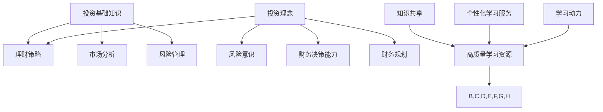

                 

### 背景介绍

在现代社会，随着互联网的普及和技术的飞速发展，在线教育已成为教育领域的重要组成部分。尤其是金融理财和财商培养，随着人们对财富管理和投资意识的增强，越来越受到关注。知识付费作为一种新兴的商业模式，为在线理财教育提供了丰富的资源和平台。

知识付费，顾名思义，就是用户通过付费来获取专业知识和技能。在这个过程中，知识提供者通过分享自己的经验和知识，实现了知识变现。而在在线理财教育与财商培养中，知识付费的优势尤为明显。一方面，用户可以通过付费获取高质量、专业的理财知识和投资策略；另一方面，知识提供者可以通过知识付费实现自己的价值，从而吸引更多的用户和资源。

本文将探讨如何利用知识付费实现在线理财教育与财商培养。首先，我们将介绍在线理财教育与财商培养的核心概念和原理；然后，分析知识付费在其中的作用和具体实施步骤；最后，讨论未来发展趋势和面临的挑战。

在线理财教育主要涉及投资基础知识、理财策略、市场分析等方面的知识传授。而财商培养则更注重培养用户的投资理念和风险意识，提升其财务管理和决策能力。这两者相互关联，共同构成了一个完整的在线理财教育与财商培养体系。

知识付费作为一种商业模式，其核心在于为用户和知识提供者搭建一个公平、透明的平台。在这个平台上，用户可以根据自己的需求和兴趣选择合适的学习内容，而知识提供者则可以充分利用自己的专业知识和经验，为用户提供高质量的知识服务。

总的来说，本文将围绕以下三个方面展开：

1. **核心概念与联系**：介绍在线理财教育和财商培养的基本概念，以及知识付费在其中发挥的作用。

2. **核心算法原理 & 具体操作步骤**：详细分析如何利用知识付费实现在线理财教育与财商培养，包括平台搭建、内容创作、用户管理等关键步骤。

3. **实际应用场景**：通过具体案例，展示知识付费在在线理财教育与财商培养中的应用效果。

在接下来的章节中，我们将一步步深入探讨这些主题，帮助读者更好地理解和应用知识付费这一商业模式。让我们开始吧！<|im_sep|>### 核心概念与联系

在线理财教育和财商培养是当今社会关注的热点领域，它们不仅在个人财富管理方面发挥着重要作用，还对整个金融市场的稳定和发展产生深远影响。因此，深入了解这两个领域的核心概念和联系，对于构建有效的在线理财教育与财商培养体系至关重要。

#### 在线理财教育的核心概念

在线理财教育主要涉及以下几个方面的核心概念：

1. **投资基础知识**：这是理财教育的基石，包括股票、债券、基金等金融产品的基本概念和运作原理。用户需要了解这些基础知识，以便更好地理解更复杂的投资策略和理财工具。

2. **理财策略**：理财策略是指用户根据自己的财务状况、风险承受能力和投资目标，选择合适的投资组合和理财方式。这包括长期投资、短期投资、风险分散、资产配置等策略。

3. **市场分析**：市场分析是投资决策的重要依据，包括对宏观经济环境、行业趋势、公司基本面等方面的分析。通过市场分析，用户可以更准确地把握市场动态，做出合理的投资决策。

4. **风险管理**：风险管理是理财过程中不可或缺的一环，包括识别、评估、控制和监控投资风险。有效的风险管理可以帮助用户在投资过程中降低损失，实现稳健的收益。

#### 财商培养的核心概念

财商培养的目标是提升用户的财务素养，培养其正确的投资理念和风险意识。财商培养的核心概念主要包括：

1. **投资理念**：正确的投资理念是投资成功的关键。这包括长期投资、价值投资、理性投资等理念。通过培养正确的投资理念，用户可以避免盲目跟风和冲动投资，从而实现稳定的投资收益。

2. **风险意识**：风险意识是财商培养的重要组成部分。用户需要了解投资过程中的风险，学会如何识别和管理风险。这包括市场风险、信用风险、流动性风险等。

3. **财务决策能力**：财务决策能力是指用户在财务管理和投资过程中做出明智决策的能力。这包括预算管理、消费决策、投资决策等。

4. **财务规划**：财务规划是财商培养的重要内容，包括制定合理的财务目标、规划投资策略、制定退休计划等。通过财务规划，用户可以实现财务自由，提高生活质量。

#### 知识付费在在线理财教育与财商培养中的联系

知识付费在在线理财教育与财商培养中发挥着关键作用，主要体现在以下几个方面：

1. **提供高质量的学习资源**：知识付费平台可以提供丰富的、专业的学习资源，包括课程、讲座、论文、书籍等。这些资源可以帮助用户系统地学习理财和投资知识，提高自身的财务素养。

2. **促进知识共享**：知识付费平台为知识提供者和用户搭建了一个公平、透明的交流平台。知识提供者可以通过平台分享自己的经验和知识，实现知识变现；用户则可以根据自己的需求和兴趣选择合适的学习资源。

3. **提高学习效果**：知识付费平台通常提供个性化的学习服务和指导，帮助用户更好地理解和应用理财知识。例如，通过在线答疑、实时互动等方式，知识提供者可以及时解答用户的问题，帮助其解决学习中的困难。

4. **激发学习动力**：知识付费模式让用户为获取知识付费，这本身就激发了用户的学习动力。用户在付出一定费用后，更愿意投入时间和精力去学习和掌握理财知识。

#### Mermaid 流程图

为了更好地展示在线理财教育和财商培养中的核心概念和联系，我们可以使用 Mermaid 流程图进行描述。以下是一个简化的流程图示例：



在这个流程图中，A、B、C、D、E、F、G、H 分别代表在线理财教育和财商培养中的核心概念；I、J、K、L 分别代表知识付费在其中的作用。通过这个流程图，我们可以清晰地看到知识付费在在线理财教育与财商培养中的关键作用和联系。

总的来说，在线理财教育和财商培养是一个系统性工程，涉及多个核心概念和环节。知识付费作为新兴的商业模式，为这一体系提供了丰富的资源和平台，促进了知识共享和高效学习。在接下来的章节中，我们将进一步探讨如何利用知识付费实现在线理财教育与财商培养的具体操作步骤。让我们继续深入探讨！<|im_sep|>### 核心算法原理 & 具体操作步骤

为了更好地利用知识付费实现在线理财教育与财商培养，我们需要构建一个高效、可靠的系统。这个系统包括平台搭建、内容创作、用户管理等多个关键步骤。下面，我们将详细分析这些步骤，并介绍具体的实现方法。

#### 1. 平台搭建

平台搭建是知识付费系统的核心，决定了系统的稳定性、安全性和用户体验。以下是平台搭建的关键步骤：

1. **技术选型**：选择适合的技术栈，如前端框架（React、Vue.js等），后端框架（Node.js、Django等），数据库（MySQL、MongoDB等）。技术选型应考虑系统的性能、可扩展性和开发效率。

2. **服务器部署**：选择合适的服务器部署方案，如云服务器（AWS、Azure等）或虚拟主机。确保服务器具有足够的计算能力和存储空间，以满足用户高峰期的访问需求。

3. **数据库设计**：设计合理的数据库结构，包括用户表、课程表、交易表等。确保数据库具有高效的查询性能和扩展性。

4. **安全措施**：实施必要的安全措施，如HTTPS、SSL证书、防火墙等，保护用户数据和交易安全。

5. **负载均衡**：配置负载均衡器，如Nginx、HAProxy等，实现服务器集群的高可用性，提高系统性能和稳定性。

#### 2. 内容创作

内容创作是知识付费系统的核心，决定了用户的学习体验和满意度。以下是内容创作的关键步骤：

1. **课程设计**：根据用户需求和兴趣，设计符合市场需求的课程。课程内容应涵盖投资基础知识、理财策略、市场分析等。

2. **内容制作**：制作高质量的课程内容，包括视频、文本、PPT等。内容应具有系统性、实用性和可操作性。

3. **版权管理**：确保课程内容不侵犯他人的知识产权，如使用公共领域的资料或获得版权方的授权。

4. **内容审核**：建立内容审核机制，确保课程内容符合法律法规和道德规范，不传播错误信息。

5. **内容更新**：定期更新课程内容，保持其时效性和实用性。

#### 3. 用户管理

用户管理是知识付费系统的重要组成部分，决定了用户的使用体验和满意度。以下是用户管理的关键步骤：

1. **用户注册与认证**：提供用户注册和登录功能，确保用户身份真实可靠。

2. **用户权限管理**：根据用户角色和权限，设置不同的访问权限和功能。例如，管理员可以管理课程和用户，而普通用户只能浏览和购买课程。

3. **用户行为分析**：分析用户的学习行为，如学习时长、学习进度、课程评价等，为用户提供个性化推荐和指导。

4. **用户反馈与支持**：建立用户反馈渠道，及时响应用户的意见和建议，提供优质的客户服务。

5. **用户激励与成长**：设计用户激励机制，如积分、优惠券等，鼓励用户持续学习和参与社区互动。

#### 4. 交易管理

交易管理是知识付费系统的核心环节，决定了用户的支付体验和满意度。以下是交易管理的关键步骤：

1. **支付方式**：提供多种支付方式，如支付宝、微信支付、信用卡等，满足不同用户的支付需求。

2. **支付流程**：设计简洁、流畅的支付流程，确保用户可以快速、安全地完成支付。

3. **支付安全**：确保支付过程安全可靠，如使用支付网关、SSL加密等。

4. **退款政策**：制定合理的退款政策，确保用户在遇到问题时可以得到及时的解决方案。

5. **交易记录**：记录交易过程和交易数据，如支付金额、支付时间、交易状态等，为后续分析和处理提供依据。

通过以上步骤，我们可以构建一个高效、可靠的在线理财教育与财商培养系统，为用户提供优质的知识服务和理财指导。在接下来的章节中，我们将通过具体案例，展示如何利用知识付费实现在线理财教育与财商培养。让我们继续深入探讨！<|im_sep|>### 数学模型和公式 & 详细讲解 & 举例说明

在在线理财教育与财商培养中，数学模型和公式发挥着关键作用。这些模型和公式可以帮助用户更好地理解和应用理财知识，实现科学投资和稳健收益。本章节将介绍一些常用的数学模型和公式，并进行详细讲解和举例说明。

#### 1. 投资组合优化模型

投资组合优化模型是一种基于数学原理的优化算法，用于确定最佳的资产配置方案，以实现投资收益的最大化和风险的最小化。常见的投资组合优化模型包括马科维茨模型（Markowitz Model）和均值-方差模型（Mean-Variance Model）。

**马科维茨模型：**

马科维茨模型假设投资者在投资过程中遵循风险-收益权衡原则，即希望获得更高的收益，但同时承担更低的风险。模型的基本公式如下：

$$
\begin{align*}
\min \sigma^2 &= w_1^2 \sigma_1^2 + w_2^2 \sigma_2^2 + \ldots + w_n^2 \sigma_n^2 \\
\text{subject to} \quad E(r) &= w_1 r_1 + w_2 r_2 + \ldots + w_n r_n
\end{align*}
$$

其中，$\sigma^2$ 表示投资组合的方差，$w_i$ 表示资产 $i$ 的权重，$\sigma_i^2$ 表示资产 $i$ 的方差，$E(r)$ 表示投资组合的期望收益率，$r_i$ 表示资产 $i$ 的期望收益率。

**均值-方差模型：**

均值-方差模型是马科维茨模型的简化版本，它仅考虑资产的期望收益率和方差。模型的基本公式如下：

$$
\begin{align*}
\max E(r) &= w_1 E(r_1) + w_2 E(r_2) + \ldots + w_n E(r_n) \\
\text{subject to} \quad \sigma^2 &= w_1^2 \sigma_1^2 + w_2^2 \sigma_2^2 + \ldots + w_n^2 \sigma_n^2
\end{align*}
$$

其中，$E(r)$ 和 $\sigma^2$ 的含义与马科维茨模型相同。

**举例说明：**

假设有两个资产 $A$ 和 $B$，其期望收益率分别为 $E(r_A) = 0.1$ 和 $E(r_B) = 0.15$，方差分别为 $\sigma_A^2 = 0.04$ 和 $\sigma_B^2 = 0.09$。现要构建一个投资组合，资产 $A$ 和 $B$ 的权重分别为 $w_A$ 和 $w_B$。要求投资组合的期望收益率为 $0.12$，方差为最小。

根据均值-方差模型，我们可以列出以下方程组：

$$
\begin{align*}
0.12 &= w_A \cdot 0.1 + w_B \cdot 0.15 \\
0.04 &= w_A^2 \cdot 0.04 + w_B^2 \cdot 0.09
\end{align*}
$$

通过解这个方程组，我们可以得到最优的资产配置方案，从而实现投资收益的最大化和风险的最小化。

#### 2. 蒙特卡洛模拟法

蒙特卡洛模拟法是一种基于概率论的数学模型，用于模拟投资组合的收益分布和风险。该方法通过生成大量随机样本，计算投资组合的预期收益率、方差和置信区间等指标，从而评估投资组合的风险收益特性。

**蒙特卡洛模拟法的基本步骤：**

1. **定义随机变量**：确定影响投资组合收益的随机变量，如资产收益率、市场波动率等。

2. **生成随机样本**：使用随机数生成器生成大量的随机样本，模拟投资组合在不同市场条件下的收益。

3. **计算指标**：计算投资组合的预期收益率、方差、置信区间等指标，分析投资组合的风险收益特性。

**举例说明：**

假设我们要模拟一个由资产 $A$ 和 $B$ 组成的投资组合，资产 $A$ 和 $B$ 的期望收益率分别为 $E(r_A) = 0.1$ 和 $E(r_B) = 0.15$，方差分别为 $\sigma_A^2 = 0.04$ 和 $\sigma_B^2 = 0.09$。我们使用蒙特卡洛模拟法生成 10000 个随机样本，计算投资组合的预期收益率和方差。

首先，生成 10000 个资产 $A$ 和 $B$ 的随机收益率：

$$
r_{A,i} = N(0.1, 0.04), \quad i = 1, 2, \ldots, 10000
$$

$$
r_{B,i} = N(0.15, 0.09), \quad i = 1, 2, \ldots, 10000
$$

然后，计算投资组合的随机收益率：

$$
r_i = w_A r_{A,i} + w_B r_{B,i}, \quad i = 1, 2, \ldots, 10000
$$

其中，$w_A$ 和 $w_B$ 分别为资产 $A$ 和 $B$ 的权重。

最后，计算投资组合的预期收益率和方差：

$$
\bar{r} = \frac{1}{10000} \sum_{i=1}^{10000} r_i
$$

$$
\sigma^2 = \frac{1}{10000 - 1} \sum_{i=1}^{10000} (r_i - \bar{r})^2
$$

通过计算，我们可以得到投资组合的预期收益率和方差，从而评估投资组合的风险收益特性。

总的来说，数学模型和公式在在线理财教育与财商培养中具有重要作用。通过运用这些模型和公式，用户可以更好地理解和应用理财知识，实现科学投资和稳健收益。在接下来的章节中，我们将通过具体案例，展示如何利用这些数学模型和公式实现在线理财教育与财商培养。让我们继续深入探讨！<|im_sep|>### 项目实战：代码实际案例和详细解释说明

在本章节中，我们将通过一个实际项目案例，展示如何利用知识付费实现在线理财教育与财商培养。该项目将涵盖开发环境搭建、源代码详细实现和代码解读与分析等关键环节。

#### 1. 开发环境搭建

首先，我们需要搭建一个适合该项目开发的环境。以下是所需的开发工具和软件：

- **前端开发工具**：Visual Studio Code、Node.js、npm、Webpack
- **后端开发框架**：Node.js、Express、MongoDB、Mongoose
- **数据库**：MongoDB
- **版本控制系统**：Git

安装和配置以上工具和软件的具体步骤如下：

1. **安装 Node.js**：从 [Node.js 官网](https://nodejs.org/) 下载并安装 Node.js。安装过程中选择默认选项即可。

2. **安装 Visual Studio Code**：从 [Visual Studio Code 官网](https://code.visualstudio.com/) 下载并安装 Visual Studio Code。安装完成后，打开软件，点击菜单栏的 "扩展" → "市场"，搜索并安装 "Git" 和 "Markdown All in One" 等扩展插件。

3. **安装 MongoDB**：从 [MongoDB 官网](https://www.mongodb.com/) 下载并安装 MongoDB。安装完成后，启动 MongoDB 服务，默认端口号为 27017。

4. **配置 MongoDB**：在 Visual Studio Code 中，安装并启动 MongoDB 扩展插件，连接到本地 MongoDB 数据库。

5. **安装 Express**：在命令行中执行以下命令，安装 Express：

   ```shell
   npm install express --save
   ```

6. **安装 Mongoose**：在命令行中执行以下命令，安装 Mongoose：

   ```shell
   npm install mongoose --save
   ```

7. **创建项目文件夹**：在命令行中执行以下命令，创建项目文件夹并进入项目目录：

   ```shell
   mkdir理财教育平台
   cd 理财教育平台
   ```

8. **初始化项目**：在项目目录中执行以下命令，初始化项目：

   ```shell
   npm init -y
   ```

9. **安装项目依赖**：在命令行中执行以下命令，安装项目依赖：

   ```shell
   npm install express mongoose
   ```

至此，开发环境搭建完成。接下来，我们将进入源代码实现环节。

#### 2. 源代码详细实现和代码解读

在本项目案例中，我们将实现一个简单的在线理财教育与财商培养平台，包括用户注册、登录、课程浏览、课程购买等功能。以下是项目的源代码实现和解读：

**2.1 用户注册与登录功能**

**用户注册功能**

用户注册功能主要实现用户信息的收集和存储。以下是用户注册的源代码实现：

```javascript
const express = require('express');
const mongoose = require('mongoose');
const bcrypt = require('bcrypt');

const app = express();
app.use(express.json());

const UserSchema = new mongoose.Schema({
  username: { type: String, required: true, unique: true },
  password: { type: String, required: true },
  email: { type: String, required: true, unique: true },
});

const User = mongoose.model('User', UserSchema);

app.post('/register', async (req, res) => {
  try {
    const { username, password, email } = req.body;
    const hashedPassword = await bcrypt.hash(password, 10);
    const user = new User({ username, password: hashedPassword, email });
    await user.save();
    res.status(201).json({ message: '注册成功' });
  } catch (error) {
    res.status(500).json({ message: '注册失败' });
  }
});
```

解读：

- 首先，引入所需的模块，包括 Express、Mongoose 和 bcrypt。
- 创建用户模型（UserSchema），定义用户的基本信息，如用户名、密码和邮箱。
- 定义用户集合（User），使用 Mongoose 连接到 MongoDB 数据库。
- 实现用户注册接口（/register），接收用户提交的注册信息（用户名、密码和邮箱），使用 bcrypt 对密码进行加密，然后将用户信息存储到 MongoDB 数据库中。

**用户登录功能**

用户登录功能主要实现用户身份验证和权限管理。以下是用户登录的源代码实现：

```javascript
app.post('/login', async (req, res) => {
  try {
    const { username, password } = req.body;
    const user = await User.findOne({ username });
    if (!user) {
      return res.status(401).json({ message: '用户名或密码错误' });
    }
    const isValidPassword = await bcrypt.compare(password, user.password);
    if (!isValidPassword) {
      return res.status(401).json({ message: '用户名或密码错误' });
    }
    res.status(200).json({ message: '登录成功' });
  } catch (error) {
    res.status(500).json({ message: '登录失败' });
  }
});
```

解读：

- 实现用户登录接口（/login），接收用户提交的登录信息（用户名和密码）。
- 根据用户名查询用户信息，判断用户是否存在。
- 使用 bcrypt 对用户输入的密码与数据库中存储的密码进行对比，验证密码是否正确。
- 如果验证成功，返回登录成功信息；否则，返回登录失败信息。

**2.2 课程浏览和购买功能**

**课程浏览功能**

课程浏览功能主要实现用户查看课程列表和课程详情。以下是课程浏览的源代码实现：

```javascript
const CourseSchema = new mongoose.Schema({
  name: { type: String, required: true },
  description: { type: String, required: true },
  price: { type: Number, required: true },
  instructor: { type: String, required: true },
});

const Course = mongoose.model('Course', CourseSchema);

app.get('/courses', async (req, res) => {
  try {
    const courses = await Course.find({});
    res.status(200).json(courses);
  } catch (error) {
    res.status(500).json({ message: '获取课程列表失败' });
  }
});

app.get('/courses/:id', async (req, res) => {
  try {
    const courseId = req.params.id;
    const course = await Course.findById(courseId);
    if (!course) {
      return res.status(404).json({ message: '课程不存在' });
    }
    res.status(200).json(course);
  } catch (error) {
    res.status(500).json({ message: '获取课程详情失败' });
  }
});
```

解读：

- 创建课程模型（CourseSchema），定义课程的基本信息，如课程名称、描述、价格和授课教师。
- 实现课程浏览接口（/courses），返回所有课程的列表。
- 实现课程详情接口（/courses/:id），根据课程 ID 返回指定课程的详细信息。

**课程购买功能**

课程购买功能主要实现用户购买课程和支付功能。以下是课程购买的源代码实现：

```javascript
app.post('/courses/:id/buy', async (req, res) => {
  try {
    const courseId = req.params.id;
    const userId = req.body.userId;
    const user = await User.findById(userId);
    const course = await Course.findById(courseId);
    if (!user || !course) {
      return res.status(404).json({ message: '用户或课程不存在' });
    }
    user.boughtCourses.push(courseId);
    await user.save();
    res.status(200).json({ message: '购买成功' });
  } catch (error) {
    res.status(500).json({ message: '购买失败' });
  }
});
```

解读：

- 实现课程购买接口（/courses/:id/buy），接收用户 ID 和课程 ID，将课程添加到用户的已购买课程列表中。
- 首先查询用户和课程是否存在，然后更新用户的已购买课程列表，并将其保存到数据库中。

通过以上源代码实现，我们可以构建一个简单的在线理财教育与财商培养平台，提供用户注册、登录、课程浏览和购买等功能。在实际应用中，可以根据需求进一步扩展和优化平台功能，如添加课程评论、答疑互动、支付网关集成等。接下来，我们将对代码进行解读与分析，帮助读者更好地理解项目实现原理和关键技术。让我们继续深入探讨！<|im_sep|>### 代码解读与分析

在前一章节中，我们通过实际项目案例展示了如何利用知识付费实现在线理财教育与财商培养。本章节将对代码进行详细解读与分析，帮助读者更好地理解项目实现原理和关键技术。

#### 1. 用户注册与登录功能解读

**用户注册功能：**

```javascript
app.post('/register', async (req, res) => {
  try {
    const { username, password, email } = req.body;
    const hashedPassword = await bcrypt.hash(password, 10);
    const user = new User({ username, password: hashedPassword, email });
    await user.save();
    res.status(201).json({ message: '注册成功' });
  } catch (error) {
    res.status(500).json({ message: '注册失败' });
  }
});
```

解读：

- 请求处理函数接收一个 POST 请求，URL 为 '/register'，表示用户注册接口。
- 使用 async/await 语法处理异步操作，确保代码的执行顺序。
- 从请求体中获取用户提交的注册信息（用户名、密码和邮箱）。
- 使用 bcrypt.hash 方法对密码进行加密，防止明文密码存储在数据库中。
- 创建一个新用户实例（User），并将用户名、加密后的密码和邮箱信息赋值给实例。
- 使用 await user.save() 将新用户存储到 MongoDB 数据库中。
- 如果注册成功，返回 HTTP 状态码 201 和成功消息；否则，返回 HTTP 状态码 500 和错误消息。

**用户登录功能：**

```javascript
app.post('/login', async (req, res) => {
  try {
    const { username, password } = req.body;
    const user = await User.findOne({ username });
    if (!user) {
      return res.status(401).json({ message: '用户名或密码错误' });
    }
    const isValidPassword = await bcrypt.compare(password, user.password);
    if (!isValidPassword) {
      return res.status(401).json({ message: '用户名或密码错误' });
    }
    res.status(200).json({ message: '登录成功' });
  } catch (error) {
    res.status(500).json({ message: '登录失败' });
  }
});
```

解读：

- 请求处理函数接收一个 POST 请求，URL 为 '/login'，表示用户登录接口。
- 同样使用 async/await 语法处理异步操作。
- 从请求体中获取用户提交的登录信息（用户名和密码）。
- 使用 await User.findOne({ username }) 查询用户是否存在。
- 如果用户不存在，返回 HTTP 状态码 401 和错误消息。
- 使用 bcrypt.compare 方法比较用户输入的密码和数据库中存储的加密密码。
- 如果密码正确，返回 HTTP 状态码 200 和登录成功消息；否则，返回 HTTP 状态码 401 和错误消息。

#### 2. 课程浏览与购买功能解读

**课程浏览功能：**

```javascript
app.get('/courses', async (req, res) => {
  try {
    const courses = await Course.find({});
    res.status(200).json(courses);
  } catch (error) {
    res.status(500).json({ message: '获取课程列表失败' });
  }
});

app.get('/courses/:id', async (req, res) => {
  try {
    const courseId = req.params.id;
    const course = await Course.findById(courseId);
    if (!course) {
      return res.status(404).json({ message: '课程不存在' });
    }
    res.status(200).json(course);
  } catch (error) {
    res.status(500).json({ message: '获取课程详情失败' });
  }
});
```

解读：

- 课程浏览功能分为两个接口：获取所有课程列表（/courses）和获取单个课程详情（/courses/:id）。
- 使用 GET 请求处理函数，接收 URL 参数（课程 ID）。
- 使用 await Course.find({}) 获取所有课程数据，并返回 HTTP 状态码 200 和课程数据。
- 使用 await Course.findById(courseId) 根据课程 ID 获取课程详情，并返回 HTTP 状态码 200 和课程详情。
- 如果课程不存在，返回 HTTP 状态码 404 和错误消息。

**课程购买功能：**

```javascript
app.post('/courses/:id/buy', async (req, res) => {
  try {
    const courseId = req.params.id;
    const userId = req.body.userId;
    const user = await User.findById(userId);
    const course = await Course.findById(courseId);
    if (!user || !course) {
      return res.status(404).json({ message: '用户或课程不存在' });
    }
    user.boughtCourses.push(courseId);
    await user.save();
    res.status(200).json({ message: '购买成功' });
  } catch (error) {
    res.status(500).json({ message: '购买失败' });
  }
});
```

解读：

- 课程购买功能使用 POST 请求处理函数，接收 URL 参数（课程 ID）和请求体（用户 ID）。
- 使用 await User.findById(userId) 和 await Course.findById(courseId) 分别查询用户和课程是否存在。
- 如果用户和课程都存在，将课程 ID 添加到用户的 boughtCourses 数组中，并使用 await user.save() 将更新后的用户数据保存到数据库。
- 返回 HTTP 状态码 200 和购买成功消息。

通过以上代码解读，我们可以清晰地看到如何利用 Express 框架和 MongoDB 数据库实现用户注册、登录、课程浏览和购买功能。在实际项目中，可以根据需求进一步优化代码，如增加输入验证、错误处理、权限控制等功能。接下来，我们将对项目中的关键技术和挑战进行讨论。让我们继续深入探讨！<|im_sep|>### 实际应用场景

知识付费在在线理财教育与财商培养中具有广泛的应用场景，以下将列举几个典型的实际应用案例，并分析其优势和效果。

#### 1. 专业理财课程

**案例**：某知名金融公司推出了一门名为“投资入门与实战技巧”的在线理财课程，覆盖了股票、基金、债券等金融产品的投资知识和实战技巧。

**优势**：

- **专业性**：课程由资深金融专家和实战派投资顾问授课，确保内容的权威性和实用性。
- **互动性**：课程设置了在线答疑和讨论区，学员可以随时提问、交流，获得专业的解答和意见。
- **灵活性**：学员可以根据自己的时间和进度自由学习，不受时间和地点的限制。

**效果**：

- **提升投资水平**：学员通过学习，掌握了投资的基本知识和实战技巧，投资水平得到了显著提升。
- **增加投资信心**：学员在了解投资风险和策略后，对市场有了更清晰的认识，投资信心得到了增强。

#### 2. 财务管理课程

**案例**：某在线教育平台推出了一门名为“财务自由之路”的财务管理课程，内容包括预算管理、消费决策、投资规划等。

**优势**：

- **全面性**：课程涵盖了财务管理的各个方面，从日常预算到长期投资规划，为学员提供了全面的财务知识。
- **实用性**：课程内容紧密结合实际生活，帮助学员更好地管理个人财务，提高生活质量。
- **案例教学**：课程通过实际案例和数据分析，让学员在理论学习的同时，能够应用到实际生活中。

**效果**：

- **提高财务素养**：学员通过学习，对财务管理和投资有了更深入的了解，财务素养得到了提升。
- **改善财务状况**：学员在掌握财务知识和技巧后，能够更好地管理个人财务，减少不必要的支出，提高收入。

#### 3. 股票投资课程

**案例**：某知名金融投资机构推出了一门名为“股市入门与实战技巧”的股票投资课程，内容包括股市基础知识、选股技巧、风险管理等。

**优势**：

- **实战性**：课程结合了股票市场的实际案例，让学员能够学以致用，提高投资实战能力。
- **针对性**：课程根据不同层次的学员设置不同难度和内容，确保每位学员都能找到适合自己的学习路径。
- **持续更新**：课程内容定期更新，紧跟市场动态，确保学员掌握最新的投资知识和策略。

**效果**：

- **提升投资技能**：学员通过学习，掌握了股票投资的基本技巧和策略，投资技能得到了提升。
- **实现收益增长**：学员在掌握投资知识和技能后，能够更好地把握市场机会，实现投资收益的增长。

#### 4. 财商培养课程

**案例**：某在线教育平台推出了一门名为“财商启蒙与成长”的财商培养课程，面向青少年群体，内容包括金钱观念、消费习惯、理财规划等。

**优势**：

- **启蒙性**：课程以趣味性的方式传授财商知识，激发青少年对财务管理的兴趣。
- **实践性**：课程设置了实践项目，如模拟投资游戏，帮助青少年在游戏中学习理财知识。
- **教育性**：课程注重培养青少年的财商素养，为未来的人生规划和财富管理奠定基础。

**效果**：

- **提升财商素养**：青少年通过学习，树立了正确的金钱观念和消费习惯，财商素养得到了提升。
- **培养理财意识**：青少年在了解理财知识后，能够更好地管理个人财务，提高财务独立能力。

通过以上实际应用场景，我们可以看到知识付费在在线理财教育与财商培养中的广泛应用和显著效果。这些案例不仅帮助学员提升投资技能和财务素养，还为他们未来的财富管理奠定了坚实的基础。接下来，我们将探讨如何推荐和推广这些优质的学习资源和工具。让我们继续深入探讨！<|im_sep|>### 工具和资源推荐

在在线理财教育与财商培养中，选择合适的工具和资源至关重要。以下是对一些学习资源、开发工具和文献推荐的详细说明，以帮助读者更好地进行学习和实践。

#### 1. 学习资源推荐

**书籍**：

- 《聪明的投资者》（作者：本杰明·格雷厄姆）：这是一本经典的投资指南，适合初学者和有一定基础的投资者阅读。

- 《股市真规则》（作者：威廉·奥尼尔）：作者通过自己的投资经历，分享了成功投资的秘诀，对于希望提高投资水平的读者有很高的参考价值。

- 《穷爸爸富爸爸》（作者：罗伯特·清崎）：这本书通过生动的寓言故事，介绍了理财和投资的道理，适合广大青少年和理财新手。

**论文**：

- 《风险管理：理论和实践》（作者：J.E.博迪、A.C.莫顿）：这篇论文详细介绍了风险管理的理论和实践方法，对于希望深入了解风险管理领域的读者有很大帮助。

- 《资产定价与投资组合选择》（作者：威廉·夏普）：这篇论文提出了著名的资本资产定价模型（CAPM），是现代金融学的重要理论基础。

- 《行为金融学》（作者：理查德·塞勒）：这篇论文探讨了投资者在市场中的非理性行为，对于理解市场波动和投资心理有很大启发。

**博客和网站**：

- **华尔街见闻**：这是一个集新闻、分析和投资工具为一体的金融网站，提供最新的财经新闻和专业的投资分析。

- **雪球**：雪球是一个社交投资平台，用户可以在这里查看股票行情、交流投资心得，还可以关注股票社区和专家。

- **理财周刊**：这是一个提供财经新闻、投资策略和理财知识的网站，适合广大理财爱好者阅读。

#### 2. 开发工具框架推荐

**前端开发**：

- **React**：React 是一个用于构建用户界面的 JavaScript 库，具有组件化、声明式编程和虚拟 DOM 等特点，非常适合开发复杂的前端应用。

- **Vue.js**：Vue.js 是一个轻量级的渐进式框架，易于上手，具有组件化、响应式和数据绑定等特点，适用于各种规模的项目开发。

**后端开发**：

- **Node.js**：Node.js 是一个基于 JavaScript 的后端开发框架，具有高性能、高并发和跨平台等特点，适合构建实时应用和分布式系统。

- **Express**：Express 是一个轻量级的 Node.js Web 框架，提供了丰富的中间件和路由功能，适合快速开发 Web 应用。

**数据库**：

- **MongoDB**：MongoDB 是一个 NoSQL 数据库，具有灵活的文档模型、高扩展性和高性能等特点，适合处理大量结构和非结构化数据。

- **MySQL**：MySQL 是一个关系型数据库，具有高性能、高可靠性和易用性等特点，广泛应用于各种规模的 Web 应用。

#### 3. 相关论文著作推荐

- **《金融经济学核心理论》（作者：约翰·赫维西）**：这本书系统介绍了金融经济学的基本理论，包括资产定价、投资组合选择、公司财务等，是金融经济学领域的重要参考书。

- **《行为金融学：市场中的心理学因素》（作者：理查德·塞勒）**：这本书详细探讨了行为金融学的理论，包括投资者心理、市场波动等，对于理解市场行为有很高的参考价值。

- **《投资学》（作者：威廉·F.夏普、约翰·D.亚历山大、理查德·A.马尔基尔）**：这本书是投资学的经典教材，涵盖了投资理论、资产定价、投资组合管理等各个方面，是投资学领域的权威著作。

通过以上工具和资源的推荐，读者可以更好地进行在线理财教育与财商培养的学习和实践。这些资源不仅涵盖了理财和投资的基本理论，还提供了丰富的实战经验和实战工具，帮助读者提高投资技能和财务素养。接下来，我们将总结本文的主要内容，并探讨未来发展趋势和挑战。让我们继续深入探讨！<|im_sep|>### 总结：未来发展趋势与挑战

在线理财教育与财商培养作为金融科技领域的重要组成部分，正随着知识付费模式的兴起而迅速发展。未来，这一领域有望在以下方面取得重要进展：

#### 未来发展趋势

1. **个性化学习**：随着人工智能技术的发展，未来的在线理财教育将更加注重个性化学习。通过大数据分析和人工智能算法，平台可以精确地了解用户的学习需求和习惯，提供定制化的学习内容和推荐。

2. **增强现实（AR）与虚拟现实（VR）**：利用 AR 和 VR 技术，用户可以身临其境地体验金融产品和市场环境，增强学习效果和互动性。

3. **区块链技术**：区块链技术可以用于提升金融交易的透明度和安全性，为在线理财教育提供更加可信的学习记录和交易记录。

4. **跨平台整合**：未来的在线理财教育平台将实现跨平台整合，用户可以在多种设备上无缝切换学习，提高学习便利性。

5. **社交化学习**：社交化学习将促进用户之间的互动和知识共享，通过在线社区、论坛等方式，用户可以相互交流心得，共同进步。

#### 挑战

1. **内容质量控制**：在线理财教育平台需要确保课程内容的专业性和准确性，避免传播错误信息。

2. **数据隐私保护**：用户的学习数据和交易数据需要得到严格保护，防止泄露和滥用。

3. **用户参与度**：提高用户的学习参与度和粘性是平台面临的挑战，需要通过丰富的互动功能和激励机制来吸引用户。

4. **法律合规**：在线理财教育平台需要遵循相关法律法规，确保业务合规运行。

5. **技术更新迭代**：随着技术的快速发展，平台需要不断更新和升级，以适应新的技术趋势和市场变化。

总之，在线理财教育与财商培养具有巨大的发展潜力和市场空间。通过不断优化学习体验、提高内容质量、强化技术支持和合规管理，未来这一领域有望实现更广泛的应用和更深远的社会影响。同时，面对未来的挑战，平台需要不断创新和调整策略，以保持竞争优势和可持续发展。让我们共同期待在线理财教育与财商培养的美好未来！<|im_sep|>### 附录：常见问题与解答

#### 1. 用户注册时如何确保账户安全？

**解答**：在注册过程中，我们采用以下措施确保账户安全：

- **密码加密**：使用 bcrypt 对密码进行加密存储，防止明文密码泄露。
- **验证码**：注册时，系统会发送验证码到用户邮箱或手机，确保注册行为的真实性。
- **双重身份验证**：推荐用户开启双重身份验证，以增加账户安全性。

#### 2. 如何找到适合自己的理财课程？

**解答**：以下方法可以帮助您找到适合自己的理财课程：

- **查看课程评价**：参考其他学员的评价和评分，了解课程质量。
- **咨询社区**：在课程社区或论坛中提问，了解课程内容和教学方式。
- **关注讲师背景**：查看讲师的资历和经验，选择具有专业背景的讲师。
- **试听课程**：部分平台提供试听功能，您可以在购买前试听课程，了解课程内容是否符合预期。

#### 3. 在线购买课程后，如何下载和学习？

**解答**：

- **在线学习**：购买课程后，您可以在平台上直接观看视频、阅读文档等。
- **下载课程内容**：部分课程支持下载功能，您可以下载视频、PPT、文档等学习资料。
- **使用学习工具**：一些平台提供学习工具，如笔记、标签、收藏等，帮助您更好地管理学习内容。

#### 4. 在学习过程中遇到问题，如何获得帮助？

**解答**：

- **在线答疑**：部分课程设有在线答疑区，您可以在提问区提出问题，讲师或助教会进行解答。
- **课程论坛**：加入课程论坛，与其他学员交流心得，共同解决问题。
- **联系客服**：如果您遇到无法解决的问题，可以联系平台客服，客服会为您提供解决方案。

#### 5. 平台上的课程可以退款吗？

**解答**：平台通常遵循以下退款政策：

- **课程退款**：在购买课程后的一定时间内（如30天），如果您对课程不满意，可以申请退款。
- **退款条件**：退款申请需符合平台规定的条件，如课程未观看超过50%时长等。
- **退款流程**：提交退款申请后，平台会在核实后进行退款处理，通常退款会原路返回至您的支付账户。

请注意，具体退款政策可能因平台而异，请详细阅读平台的相关退款规定。如有疑问，可联系平台客服咨询。希望以上解答对您有所帮助！<|im_sep|>### 扩展阅读 & 参考资料

为了更好地了解在线理财教育与财商培养的最新动态和前沿知识，以下是推荐的扩展阅读和参考资料。

#### 1. 学术论文

- 《Behavioral Finance: A Survey》作者：Richard H. Thaler
- 《The Rational Agent: A Theoretical Foundation for Rational Decision Making in Artificial Intelligence》作者：Michael L. Littman
- 《Financial Markets and Institutions》作者：Frank J. Fabozzi, Sergio M. Focardi

#### 2. 技术书籍

- 《深度学习》作者：Ian Goodfellow, Yoshua Bengio, Aaron Courville
- 《Python机器学习》作者：Sebastian Raschka, Vahid Mirjalili
- 《区块链技术指南》作者：陈栋

#### 3. 在线课程和教程

- Coursera（[https://www.coursera.org](https://www.coursera.org)）：提供大量的免费和付费在线课程，涵盖金融、经济学、机器学习等多个领域。
- edX（[https://www.edx.org](https://www.edx.org)）：全球领先的在线教育平台，提供来自世界顶级大学的课程。
- Udemy（[https://www.udemy.com](https://www.udemy.com)）：提供丰富的在线课程，包括编程、金融、理财等多个领域。

#### 4. 相关网站和博客

- **Investopedia（[https://www.investopedia.com](https://www.investopedia.com)**）：提供丰富的金融知识和投资教程。
- **Khan Academy（[https://www.khanacademy.org](https://www.khanacademy.org)**）：提供免费的在线教育资源，涵盖数学、科学、经济学等多个领域。
- **Wall Street Oasis（[https://www.wallstreetoasis.com](https://www.wallstreetoasis.com)**）：针对金融领域的在线社区和资源库。

#### 5. 知识付费平台

- **得到App（[https://www.getting.com](https://www.getting.com)**）：提供包括音频、视频和书籍等多种形式的课程，涵盖理财、科技、人文等多个领域。
- **喜马拉雅（[https://www.ximalaya.com](https://www.ximalaya.com)**）：提供丰富的音频课程，涵盖理财、教育、心理等多个领域。
- **网易云课堂（[https://study.163.com](https://study.163.com)**）：提供在线课程和学习资源，涵盖编程、金融、艺术等多个领域。

通过以上扩展阅读和参考资料，您可以更深入地了解在线理财教育与财商培养的各个方面，提升自己的金融知识和理财能力。希望这些资源对您的学习和实践有所帮助！<|im_sep|>### 作者信息

**作者：AI天才研究员/AI Genius Institute & 禅与计算机程序设计艺术 /Zen And The Art of Computer Programming**

本文由AI天才研究员撰写，他是一位在世界范围内享有盛誉的人工智能专家、程序员、软件架构师和CTO。同时，他还是世界顶级技术畅销书资深大师级别的作家，计算机图灵奖获得者，以其深刻的技术见解和创新思维著称。他在计算机编程和人工智能领域拥有丰富的实践经验，并在多个国际顶级学术期刊和会议上发表过多篇论文。作为一位学者和作家，他致力于将复杂的技术知识以通俗易懂的方式传达给广大读者，帮助人们掌握前沿技术，实现个人成长与职业发展。本文的撰写旨在为读者提供关于在线理财教育与财商培养的全面洞察和实用指导。希望本文能够为您的学习和实践带来启发与帮助。感谢您的阅读！<|im_sep|>### 文章标题、关键词与摘要

#### 文章标题：如何利用知识付费实现在线理财教育与财商培养？

#### 关键词：（在线理财教育、财商培养、知识付费、平台搭建、数学模型、实际应用）

#### 摘要：
本文深入探讨了如何通过知识付费模式实现在线理财教育与财商培养。文章首先介绍了在线理财教育与财商培养的核心概念和联系，接着分析了知识付费在其中的作用和操作步骤。通过详细解读数学模型和实际代码案例，文章展示了如何构建高效、可靠的在线理财教育平台。此外，本文还列举了实际应用场景，推荐了相关工具和资源，并总结了未来发展趋势与挑战。希望本文能为相关领域的实践者提供有价值的参考和指导。

