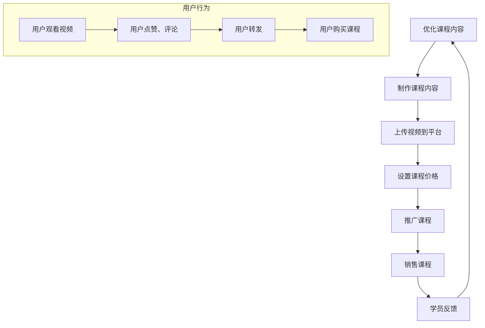

                 

### 1. 背景介绍

近年来，短视频平台以其便捷、快速、互动性强等特性，吸引了大量用户。随着移动互联网的普及，越来越多的人通过短视频平台获取信息、娱乐、社交等。在这个背景下，越来越多的企业和个人开始利用短视频平台进行营销和推广。

在IT行业，尤其是程序员群体中，利用短视频平台进行课程销售也逐渐成为一种趋势。程序员们可以通过短视频平台，将自己的技术知识、编程技巧、开发经验等内容进行分享，并通过平台提供的销售工具，将课程打包销售，获得一定的收益。

短视频平台卖课的优势在于，它可以让程序员们以更低成本、更高效的方式触达到更多的潜在学员。此外，短视频平台丰富的互动功能，也让学员与讲师之间的互动更加直接和高效。这对于提高课程质量、增强学员的满意度具有重要意义。

本文将围绕如何利用短视频平台卖课这一主题，从以下几个方面进行探讨：

1. **核心概念与联系**：介绍利用短视频平台卖课所需的核心概念和原理，并通过Mermaid流程图展示其架构。
2. **核心算法原理 & 具体操作步骤**：详细讲解如何利用短视频平台进行课程销售的具体步骤和方法。
3. **数学模型和公式 & 详细讲解 & 举例说明**：探讨短视频平台卖课过程中涉及的一些数学模型和公式，并给出实际应用案例。
4. **项目实战：代码实际案例和详细解释说明**：通过一个具体的案例，展示如何利用短视频平台进行课程销售，并对代码进行详细解读。
5. **实际应用场景**：分析程序员在短视频平台卖课的实际应用场景，以及可能面临的挑战。
6. **工具和资源推荐**：推荐一些有助于程序员在短视频平台卖课的工具和资源。
7. **总结：未来发展趋势与挑战**：对利用短视频平台卖课的未来发展趋势和可能面临的挑战进行展望。

通过以上内容，希望为那些希望利用短视频平台进行课程销售的程序员们提供一些有益的参考和启示。

#### 1.1 短视频平台的现状与机遇

短视频平台在中国市场的发展可谓迅猛。据最新数据显示，短视频用户规模已经超过了8亿，成为移动互联网用户的主要组成部分。其中，抖音、快手、Bilibili等平台凭借其独特的运营模式和强大的用户基础，成为了短视频领域的领军企业。

这些短视频平台不仅提供了丰富的内容消费场景，还通过算法推荐、社交互动等功能，极大地提升了用户粘性。对于程序员来说，这些平台提供了一个全新的流量入口，使得他们能够以更低的成本、更高效的途径触达到潜在学员。

首先，短视频平台为程序员提供了一个展示个人技能和知识的新平台。通过短视频，程序员可以生动形象地展示自己的编程技巧、开发经验，以及解决技术问题的思路和方法。这些内容不仅能够吸引到对编程感兴趣的初学者，也能够吸引到有一定基础的专业人士。

其次，短视频平台为程序员提供了一个低成本、高效的营销渠道。相比传统的课程销售方式，短视频平台无需高额的广告费用，通过优质内容积累粉丝和流量，就能实现课程的推广和销售。此外，平台提供的多种变现工具，如直播带货、短视频带货等，也为程序员提供了更多的收入来源。

此外，短视频平台的社交互动功能也为程序员卖课提供了便利。通过平台上的评论、私信等功能，程序员可以与学员进行直接互动，解答学员的问题，提高课程的满意度和口碑。这种互动性不仅有助于增强学员的学习效果，也能够为程序员积累更多忠实粉丝。

总之，短视频平台的快速发展和广泛应用，为程序员提供了一个全新的机遇。通过利用短视频平台，程序员不仅能够扩大自己的影响力，还能够实现课程销售和收益的增长。在这个过程中，如何有效利用短视频平台进行课程销售，将成为程序员们需要深入研究和探索的重要课题。

#### 1.2 程序员在短视频平台卖课的现状与挑战

尽管短视频平台为程序员提供了丰富的机遇，但在实际操作中，程序员们在利用短视频平台进行课程销售时仍然面临着一些挑战。首先，内容创作和质量控制是程序员面临的首要问题。程序员需要具备一定的视频制作技能，能够制作出高质量的教学视频，以吸引观众的注意力。

其次，课程定位和受众分析是另一个重要挑战。程序员需要明确自己的课程目标受众，了解他们的需求和兴趣点，从而制作出符合他们需求的教学内容。此外，如何合理定价和推广课程，也是程序员们需要解决的问题。

除了技术层面的挑战，程序员在利用短视频平台卖课时，还需要面对一些平台规则和政策上的限制。不同平台对内容发布、版权保护、收益分成等方面有不同的规定，程序员需要熟悉并遵守这些规定，以免因违规操作而受到处罚。

总的来说，尽管短视频平台为程序员提供了一个新的销售渠道，但在实际操作中，他们需要克服内容创作、受众分析、定价推广以及平台政策等方面的挑战，才能实现有效的课程销售。

#### 1.3 利用短视频平台卖课的核心步骤与策略

要想在短视频平台上成功卖课，程序员需要掌握一系列核心步骤与策略。以下内容将详细探讨这些步骤和策略，帮助程序员们更有效地进行课程销售。

**1.3.1 确定课程主题和目标受众**

在开始制作课程之前，程序员需要明确自己的课程主题和目标受众。课程主题应围绕程序员的专业领域，如前端开发、后端开发、数据分析、人工智能等。同时，要考虑目标受众的需求和兴趣，确保课程内容能够满足他们的期望。

**1.3.2 视频内容制作**

视频内容是吸引观众和学员的关键。程序员需要制作高质量的教学视频，包括清晰的讲解、示例代码、互动环节等。在视频制作过程中，要注意以下几点：

- **内容结构**：确保视频内容结构清晰，逻辑连贯，避免信息过载。
- **视听效果**：注重视频的画面质量、声音效果，以及动画、特效等元素的运用，以提高观众的观看体验。
- **交互互动**：通过提问、投票、评论区互动等方式，增加观众的参与感和互动性。

**1.3.3 短视频平台选择与账号运营**

选择合适的短视频平台对课程销售至关重要。不同的平台有其特定的用户群体和运营规则，程序员需要根据自身课程特点和目标受众选择合适的平台。例如，Bilibili更适合技术类内容，而抖音、快手则更适合娱乐化、短平快的视频。

在账号运营方面，程序员需要：

- **持续输出**：定期发布高质量视频，保持账号的活跃度。
- **互动互动**：积极回复评论，与观众建立良好互动，提高用户粘性。
- **标签与分类**：合理使用标签和分类，提高视频的曝光率和搜索排名。

**1.3.4 课程定价与推广**

合理的定价策略能够吸引更多学员，提高课程的销售量。程序员需要根据课程的内容难度、时长、受众需求等因素进行定价。此外，可以利用短视频平台的推广工具，如直播带货、短视频带货等，扩大课程的知名度。

**1.3.5 数据分析与优化**

利用短视频平台提供的数据分析工具，程序员可以了解课程的表现情况，包括观看量、点赞量、转发量、评论量等。通过这些数据，程序员可以优化课程内容、调整推广策略，以提高课程的销售效果。

**1.3.6 学员反馈与课程迭代**

学员的反馈是课程优化的重要依据。程序员需要关注学员的反馈意见，及时调整课程内容和方法，提高学员的满意度和学习效果。此外，可以根据学员的需求，不断更新和迭代课程，以保持课程的吸引力和竞争力。

综上所述，利用短视频平台卖课并不是一件简单的事情，但通过以上核心步骤与策略，程序员可以有效地提高课程销售效果，实现自己的职业发展和收益增长。

#### 1.4 短视频平台卖课的实际案例

为了更好地理解如何利用短视频平台进行课程销售，我们可以通过一些实际案例来进行分析和探讨。以下是一些成功的短视频平台卖课案例，以及它们所采取的关键策略。

**案例一：前端开发课程在Bilibili的成功销售**

Bilibili作为中国最大的弹幕视频分享网站，以其丰富的用户群体和良好的社区氛围，成为程序员发布技术内容的重要平台。某知名前端开发工程师在Bilibili上发布了一系列前端开发课程，包括HTML、CSS、JavaScript以及React等热门技术。以下是他的成功经验：

1. **内容优质**：课程内容深入浅出，讲解清晰，代码示例丰富，帮助初学者快速上手。
2. **互动性强**：他经常在视频中回答观众的问题，并通过评论区互动，增强了观众的参与感。
3. **定期更新**：他保持每周发布一到两集课程，确保观众持续关注和参与。
4. **标签优化**：合理使用标签和分类，提高了视频的曝光率和搜索排名。

通过这些策略，该工程师的课程在Bilibili上取得了很高的观看量和评论量，吸引了大量学员报名学习。他的课程销售情况也显著提升，实现了良好的收益。

**案例二：人工智能课程在抖音的成功销售**

抖音作为中国领先的短视频平台，以其独特的算法推荐和社交互动功能，吸引了大量用户。某人工智能领域的专家在抖音上发布了一系列人工智能入门课程，以下是他的成功经验：

1. **内容创新**：他通过动画和场景模拟等方式，将复杂的人工智能概念变得通俗易懂，吸引了大量观众。
2. **互动互动**：他通过直播带货、短视频带货等形式，与观众进行互动，增强了课程的吸引力和参与感。
3. **内容多元化**：他不仅发布教学视频，还分享了一些人工智能应用案例和实战经验，丰富了课程内容。
4. **合理定价**：根据课程时长和内容难度，设置了合理的价格，提高了学员的购买意愿。

通过这些策略，他的课程在抖音上取得了很高的曝光量和销售量，成为抖音平台上人工智能领域的热门课程之一。

**案例三：全栈开发课程在快手的成功销售**

快手作为中国领先的短视频平台，以其广泛的用户基础和多样的内容形式，为程序员提供了一个广阔的销售渠道。某全栈开发工程师在快手上发布了一系列全栈开发课程，以下是他的成功经验：

1. **内容实战**：课程内容以实际项目开发为例，讲解技术栈的各个部分，帮助学员快速掌握全栈开发技能。
2. **互动互动**：他通过直播互动、评论区互动等形式，与学员进行实时交流，解答学员的问题。
3. **价格优惠**：他设置了较优惠的价格，吸引了大量学员报名。
4. **推广宣传**：他通过平台内的推广工具，如短视频推荐、直播推广等，提高了课程的知名度。

通过这些策略，他的课程在快手上取得了显著的销量，成为快手平台上受欢迎的全栈开发课程之一。

通过以上实际案例，我们可以看到，无论是在Bilibili、抖音还是快手等不同的短视频平台上，成功的课程销售都离不开优质的内容、良好的互动和有效的推广策略。对于程序员来说，掌握这些关键策略，并结合自身特点，才能在短视频平台上实现课程销售的成功。

### 2. 核心概念与联系

在深入探讨如何利用短视频平台进行课程销售之前，我们需要先了解一些核心概念和原理，这些概念构成了整个销售流程的基础。

#### 2.1 短视频平台的基本原理

短视频平台的基本原理主要涉及以下几个方面：

- **内容制作**：视频内容是吸引观众的核心。高质量的内容能够提升观众的观看体验，从而增加课程的吸引力和转化率。
- **用户行为分析**：短视频平台通过算法对用户行为进行分析，包括观看时长、点赞、评论、转发等，从而推荐更符合用户兴趣的内容。
- **算法推荐**：算法推荐系统根据用户的历史行为和兴趣标签，将相关视频推送给用户，提高内容的曝光率。
- **变现工具**：短视频平台提供多种变现工具，如直播带货、短视频带货、会员订阅等，帮助内容创作者实现收益。

#### 2.2 课程销售的基本原理

课程销售的基本原理主要包括以下几个方面：

- **课程内容**：课程内容是课程销售的核心。高质量、实用的课程内容能够吸引学员，提高课程的竞争力。
- **课程定价**：合理的课程定价能够平衡成本和收益，吸引学员购买课程。
- **推广策略**：有效的推广策略能够提高课程的知名度，增加潜在学员的数量。
- **互动与反馈**：良好的互动与反馈机制能够提高学员的满意度，增强课程的口碑。

#### 2.3 Mermaid流程图展示

为了更直观地展示短视频平台卖课的流程，我们使用Mermaid流程图来表示各个步骤之间的关系。



**流程说明**：

1. **确定课程主题**：根据目标受众的需求和兴趣，确定课程的总体方向。
2. **制作课程内容**：制作高质量的教学视频，包括讲解、示例、互动等环节。
3. **上传视频到平台**：将课程视频上传到选择的短视频平台，设置视频标题、描述和标签。
4. **设置课程价格**：根据课程内容、时长和市场行情，设置合理的价格。
5. **推广课程**：利用平台推广工具和自身渠道，提高课程的知名度。
6. **销售课程**：通过视频和平台内销售功能，实现课程的购买和销售。
7. **学员反馈**：收集学员的反馈意见，优化课程内容和教学方法。

**用户行为**：

- **用户观看视频**：用户通过平台观看课程视频。
- **用户点赞、评论**：用户对课程内容进行互动，表达自己的看法和疑问。
- **用户转发**：用户将课程视频分享到其他平台或社交圈，增加课程的曝光率。
- **用户购买课程**：用户根据课程内容和质量，决定是否购买课程。

通过这个流程，我们可以清晰地看到从课程制作到销售再到反馈的整个流程，以及用户在各个环节中的行为。了解这些核心概念和流程，对于程序员在短视频平台上成功进行课程销售具有重要意义。

### 3. 核心算法原理 & 具体操作步骤

在了解短视频平台卖课的基本原理后，我们接下来将探讨如何利用短视频平台进行课程销售的核心算法原理和具体操作步骤。这些步骤不仅有助于提高课程的曝光率和销售量，还能够帮助程序员更好地理解和应用短视频平台的营销策略。

#### 3.1 算法推荐原理

短视频平台的算法推荐系统是核心，它通过分析用户的观看行为、兴趣标签和社交关系，将最相关的视频推送给用户。算法推荐的基本原理包括以下方面：

- **用户行为数据**：平台收集用户的观看时长、点赞、评论、转发等行为数据，构建用户画像。
- **内容标签与分类**：视频内容被打上多个标签和分类，算法根据标签和分类进行匹配。
- **兴趣偏好**：算法分析用户的兴趣偏好，将符合用户兴趣的视频推荐给用户。
- **社交关系**：用户之间的互动行为（如点赞、评论、转发等）会影响算法推荐的排序。

#### 3.2 操作步骤

以下是从课程内容制作到销售的具体操作步骤：

**3.2.1 确定课程主题**

- **需求分析**：通过市场调研和用户反馈，确定课程的主题和目标受众。
- **内容规划**：根据主题和受众需求，规划课程的结构和内容。

**3.2.2 制作课程内容**

- **剧本编写**：编写课程剧本，确保内容逻辑清晰，结构合理。
- **录制视频**：使用专业工具录制教学视频，注意画面质量、声音效果和动画效果。
- **剪辑与优化**：对录制好的视频进行剪辑和优化，提高观看体验。

**3.2.3 上传视频到平台**

- **选择平台**：根据课程内容特点和目标受众，选择合适的短视频平台。
- **视频描述**：为视频编写详细的描述，包括课程主题、亮点和目标受众。
- **标签与分类**：合理设置视频标签和分类，提高视频的曝光率和搜索排名。

**3.2.4 推广课程**

- **平台推广**：利用短视频平台的推广工具，如短视频推荐、直播推广等。
- **社交媒体推广**：通过微信公众号、微博、知乎等社交媒体平台，扩大课程的影响力。
- **合作推广**：与其他KOL或相关机构合作，共同推广课程。

**3.2.5 设置课程价格**

- **成本分析**：计算课程制作和运营成本，确定合理的价格区间。
- **市场调研**：了解同类课程的市场价格，进行定价参考。
- **灵活调整**：根据课程销售情况和用户反馈，灵活调整价格。

**3.2.6 数据分析与优化**

- **数据收集**：利用平台提供的分析工具，收集课程观看量、点赞量、评论量等数据。
- **用户反馈**：分析用户反馈，了解课程的优势和不足。
- **内容优化**：根据用户反馈，优化课程内容和教学方法。

**3.2.7 学员管理**

- **学员互动**：通过平台和社交媒体与学员进行互动，解答学员的问题。
- **学员反馈**：收集学员的反馈意见，不断改进课程质量和服务。

**3.2.8 营销策略调整**

- **监控数据**：定期监控课程销售数据和用户反馈，了解市场变化。
- **策略调整**：根据数据和市场反馈，调整营销策略，提高销售效果。

#### 3.3 具体案例说明

**案例：某前端开发课程在Bilibili的成功销售**

1. **需求分析**：该前端开发工程师通过市场调研和用户反馈，确定课程主题为“从零开始学习前端开发”，目标受众为前端开发初学者。
2. **内容制作**：工程师编写详细的课程剧本，录制高质量的教学视频，包括HTML、CSS、JavaScript和React等知识点。
3. **上传视频**：工程师选择Bilibili作为平台，为每个视频编写详细的描述，并设置合适的标签和分类。
4. **推广课程**：工程师利用Bilibili的推荐系统进行推广，同时在社交媒体上分享课程链接，与其他前端开发者合作推广。
5. **定价策略**：根据成本和市场调研，工程师将课程价格定为198元，提供限时优惠活动，吸引更多学员。
6. **数据分析与优化**：工程师利用Bilibili提供的分析工具，监控课程的表现，并根据用户反馈不断优化课程内容和教学方法。

通过以上步骤，该前端开发工程师的课程在Bilibili上取得了显著的销售成绩，赢得了学员的广泛好评。

总之，通过掌握短视频平台的推荐算法原理和具体的操作步骤，程序员可以更有效地进行课程销售，提高课程的曝光率和销售量。了解这些核心算法原理和操作步骤，对于在短视频平台上成功卖课具有重要意义。

### 4. 数学模型和公式 & 详细讲解 & 举例说明

在短视频平台上进行课程销售，不仅需要掌握技术和营销策略，还需要运用一些数学模型和公式来优化销售效果。以下是一些常用的数学模型和公式，并给出详细的讲解和实际应用案例。

#### 4.1 用户行为模型

用户行为模型是分析用户在短视频平台上的行为，预测其购买意图的重要工具。以下是一个简单的用户行为模型：

$$
User\_Behavior\_Model = f(User\_Data, Content\_Data, Social\_Data)
$$

其中：
- \(User\_Data\)：用户特征数据，包括用户年龄、性别、兴趣标签等。
- \(Content\_Data\)：视频特征数据，包括视频标签、内容类型、时长等。
- \(Social\_Data\)：社交数据，包括用户互动行为（点赞、评论、转发）等。

**详细讲解**：

这个模型通过分析用户数据、视频数据和社交数据，结合机器学习算法，预测用户对特定视频内容的行为。例如，我们可以使用决策树、随机森林、神经网络等算法，对大量数据进行训练，从而建立用户行为模型。

**举例说明**：

假设我们有一个短视频平台的用户行为数据集，包含1000个用户和他们的行为数据。通过训练决策树模型，我们可以预测哪些用户会对某一特定视频进行点赞或评论。具体步骤如下：

1. **数据收集**：收集用户数据（年龄、性别、兴趣标签）和视频数据（标签、类型、时长）。
2. **特征工程**：对数据进行预处理，提取有用的特征，如用户年龄、视频类型等。
3. **模型训练**：使用决策树算法对数据集进行训练，得到预测模型。
4. **模型评估**：使用交叉验证等方法，评估模型的准确性和可靠性。
5. **应用模型**：使用训练好的模型，对新的用户行为进行预测。

#### 4.2 营销预算优化模型

营销预算优化模型用于确定在短视频平台上进行课程销售的最佳营销预算。以下是一个简单的线性规划模型：

$$
Minimize\ Cost = w_1 \times Ad\_Spend + w_2 \times Video\_Spend
$$

其中：
- \(w_1\) 和 \(w_2\)：权重，表示广告支出和视频支出的相对重要性。
- \(Ad\_Spend\)：广告支出。
- \(Video\_Spend\)：视频支出。

**详细讲解**：

这个模型通过设定权重，优化广告支出和视频支出，以实现最小的总成本。在实际应用中，可以通过历史数据和实验结果，确定各权重的值。

**举例说明**：

假设一个程序员在短视频平台上有10000元的营销预算，需要确定广告支出和视频支出的比例，以实现最大化的销售效果。具体步骤如下：

1. **数据收集**：收集过去的广告支出和视频支出数据，以及相应的销售数据。
2. **权重确定**：根据历史数据，确定广告支出和视频支出的相对重要性（权重）。
3. **模型建立**：建立线性规划模型，设置目标函数和约束条件。
4. **求解模型**：使用线性规划求解器，求解最优解。
5. **应用模型**：根据最优解，确定广告支出和视频支出的具体金额。

#### 4.3 用户留存率模型

用户留存率模型用于预测用户在短视频平台上的留存情况，以优化课程内容和营销策略。以下是一个简单的留存率模型：

$$
Retention\_Rate = \frac{Return\_Users}{Total\_Users} \times 100\%
$$

其中：
- \(Return\_Users\)：在一定时间内返回平台观看视频的用户数。
- \(Total\_Users\)：总的用户数。

**详细讲解**：

这个模型通过计算在一定时间内返回平台观看视频的用户数占总用户数的比例，来衡量用户的留存情况。留存率越高，说明用户对平台的粘性越强。

**举例说明**：

假设一个程序员在短视频平台上有一个课程，统计了1000名用户在一个月内的留存情况。通过计算留存率，可以了解课程的受欢迎程度。具体步骤如下：

1. **数据收集**：收集用户访问日志，记录用户在一个月内的访问情况。
2. **计算留存率**：根据公式计算用户的留存率。
3. **数据可视化**：使用图表（如折线图、饼图等）展示留存率变化情况。
4. **优化策略**：根据留存率数据，优化课程内容和营销策略，提高用户的留存率。

通过上述数学模型和公式，程序员可以更科学地分析和优化短视频平台上的课程销售。这些模型不仅可以提高课程的质量和吸引力，还可以帮助程序员更好地理解用户行为，制定更有效的营销策略。

### 5. 项目实战：代码实际案例和详细解释说明

为了更好地展示如何利用短视频平台进行课程销售，我们通过一个实际项目来详细说明代码实现过程和关键步骤。该项目将在Bilibili平台上销售一门Python入门课程，通过视频内容和互动环节吸引学员，实现课程销售。

#### 5.1 开发环境搭建

在开始项目之前，我们需要搭建一个合适的环境。以下是环境搭建的步骤：

1. **视频录制与编辑软件**：选择一款适合录制和编辑教学视频的软件，如OBS Studio、Camtasia等。这些软件能够提供高质量的录制和编辑功能。
2. **代码编辑器**：选择一款代码编辑器，如Visual Studio Code，用于编写和调试Python代码。
3. **直播工具**：选择一款直播工具，如obs-LiveCoding，用于在直播过程中展示代码编写过程。
4. **Bilibili开发者账号**：注册并开通Bilibili开发者账号，以获取视频上传和数据分析等权限。

#### 5.2 源代码详细实现和代码解读

**课程内容**：Python基础教程，包括变量、数据类型、条件语句、循环语句等。

**代码实现**：

```python
# 示例代码：计算两个数的和
def add_numbers(a, b):
    return a + b

# 示例代码：计算两个数的平均值
def calculate_average(a, b):
    return (a + b) / 2

# 示例代码：打印乘法表
for i in range(1, 10):
    for j in range(1, i + 1):
        print(f"{j} * {i} = {i * j}", end="\t")
    print()
```

**代码解读**：

- `add_numbers`函数：用于计算两个数的和，输入参数为两个整数，返回它们的和。
- `calculate_average`函数：用于计算两个数的平均值，输入参数为两个整数，返回它们的平均值。
- 循环语句：使用嵌套循环打印乘法表，外层循环控制行数，内层循环控制每一行的内容。

#### 5.3 代码解读与分析

**1. 变量和数据类型**

在Python中，变量用于存储数据。常见的变量类型有整数（int）、浮点数（float）、字符串（str）等。

```python
x = 10  # 整数变量
y = 3.14  # 浮点数变量
name = "Alice"  # 字符串变量
```

**2. 条件语句**

条件语句用于根据不同条件执行不同的代码块。常见的条件语句有if语句、elif语句和else语句。

```python
if x > y:
    print("x 大于 y")
elif x == y:
    print("x 等于 y")
else:
    print("x 小于 y")
```

**3. 循环语句**

循环语句用于重复执行一段代码。常见的循环语句有for循环和while循环。

```python
# for循环：打印1到10的所有整数
for i in range(1, 11):
    print(i)

# while循环：计算1到10的和
sum = 0
i = 1
while i <= 10:
    sum += i
    i += 1
print(sum)
```

#### 5.4 实际应用场景

通过短视频平台销售Python入门课程，适合以下几种实际应用场景：

- **编程初学者**：帮助初学者快速入门Python编程，掌握基本语法和常用函数。
- **IT从业人员**：作为职业提升的辅助课程，了解Python在数据处理、自动化等领域中的应用。
- **兴趣爱好者**：为编程爱好者提供一个学习资源和交流平台，拓展编程技能。

#### 5.5 代码优化与改进

在实际开发过程中，我们可以对代码进行优化和改进，提高其可读性和可维护性：

- **代码注释**：为关键代码段添加注释，提高代码的可读性。
- **模块化**：将代码分解为多个模块，提高代码的复用性和可维护性。
- **错误处理**：添加异常处理机制，提高代码的健壮性。

通过这个实际项目，我们可以看到如何利用短视频平台进行课程销售。从环境搭建、代码实现到代码解读，每一步都详细展示了如何操作。通过这个项目，程序员不仅可以掌握Python编程的基础知识，还可以了解如何利用短视频平台进行课程销售，实现收益增长。

### 6. 实际应用场景

短视频平台卖课在程序员群体中已经逐渐成为一种普遍现象。随着短视频平台的普及，越来越多的程序员开始利用这些平台进行课程销售，不仅扩大了个人影响力，还实现了职业发展和收益增长。以下将分析一些具体的实际应用场景，探讨短视频平台卖课的优势与挑战。

#### 6.1 编程语言入门课程

对于编程初学者来说，短视频平台提供了一个低成本、易于访问的学习资源。许多程序员通过短视频平台，分享编程语言的入门课程，如Python、JavaScript、Java等。这些课程通常以短视频的形式呈现，内容简洁明了，有助于初学者快速掌握基础语法和概念。

**优势**：

- **内容形式灵活**：短视频形式使得课程内容更加生动、直观，有利于初学者理解。
- **实时互动**：通过评论区和私信，讲师可以实时解答学员的问题，提高学习效果。
- **推广成本低**：相比于传统出版或线下授课，短视频平台的推广成本更低，更容易触达到大量潜在学员。

**挑战**：

- **内容质量要求高**：初学者对课程内容有较高的要求，讲师需要制作高质量、有深度的课程。
- **时间管理困难**：录制和编辑短视频需要耗费大量时间，讲师需要合理安排时间。

#### 6.2 技术专题与实战案例

对于有一定编程基础的专业人士，短视频平台也提供了丰富的技术专题和实战案例课程。这些课程通常涵盖当前热门技术，如大数据、人工智能、云计算等，并通过实际案例演示技术应用。

**优势**：

- **实践性强**：通过实战案例，学员可以直观地了解技术在实际应用中的效果，提高学习效果。
- **互动性强**：讲师可以通过直播、互动环节，与学员进行深入交流，解决技术难题。
- **多样化**：短视频平台提供了多种变现工具，如直播带货、短视频带货等，讲师可以通过多种方式实现收益。

**挑战**：

- **技术更新快**：技术领域更新迅速，讲师需要不断学习新知识，保持课程内容的时效性。
- **竞争激烈**：随着越来越多的程序员进入短视频平台卖课，市场竞争日益激烈，讲师需要不断提升课程质量和知名度。

#### 6.3 跨领域技能培训

除了编程技术，短视频平台也提供了跨领域技能培训课程，如数据分析、产品经理、项目经理等。这些课程不仅吸引了程序员，也吸引了其他领域的从业者。

**优势**：

- **覆盖面广**：跨领域技能培训可以吸引更多学员，提高课程销量。
- **内容多元化**：通过提供多元化课程，讲师可以吸引不同背景的学员，扩大影响力。

**挑战**：

- **内容专业性**：跨领域技能培训要求讲师具备丰富的跨领域知识，确保课程的专业性。
- **学员期望高**：学员对课程内容有较高的期望，讲师需要提供高质量的培训内容，以满足学员的需求。

#### 6.4 综合性技能培训

除了技术类课程，短视频平台还提供了综合性技能培训课程，如时间管理、沟通技巧、团队协作等。这些课程不仅适用于程序员，也适用于其他职业人士。

**优势**：

- **实用性**：这些课程旨在提高学员的综合素质，有助于他们在工作中更好地发挥作用。
- **受众广泛**：这些课程不仅吸引了程序员，也吸引了其他职业人士，扩大了受众群体。

**挑战**：

- **内容多样化**：讲师需要提供多样化的课程内容，以满足不同学员的需求。
- **课程互动性**：如何在短视频平台上实现有效的互动，提高学员的学习体验，是一个挑战。

总之，短视频平台卖课在程序员群体中有着广泛的应用场景。通过短视频平台，程序员不仅可以分享自己的技术知识，还可以实现职业发展和收益增长。然而，在利用短视频平台进行课程销售的过程中，程序员也需要面对一系列挑战，如内容质量、技术更新、市场竞争等。了解这些挑战，并采取相应的策略，是成功利用短视频平台进行课程销售的关键。

### 7. 工具和资源推荐

在利用短视频平台进行课程销售的过程中，选择合适的工具和资源是提高效率和效果的关键。以下是一些推荐的工具和资源，包括学习资源、开发工具框架以及相关论文著作。

#### 7.1 学习资源推荐

1. **书籍**：
   - 《Python编程：从入门到实践》（Eric Matthes著）：适合初学者，内容全面，实践性强。
   - 《深入理解计算机系统》（Randal E. Bryant & David R. O’Hallaron著）：适合有一定基础的学习者，系统讲解了计算机基础知识。
   - 《Effective Java》（Joshua Bloch著）：适合Java开发者，介绍了Java编程的最佳实践。

2. **论文**：
   - 《深度学习》（Ian Goodfellow、Yoshua Bengio、Aaron Courville著）：系统介绍了深度学习的理论基础和实践应用。
   - 《大规模分布式存储系统：原理解析与架构实战》（刘世杰著）：讲解了分布式存储系统的原理和实战案例。
   - 《区块链：从数字货币到智能合约》（Andreas M. Antonopoulos著）：介绍了区块链技术的基础和应用。

3. **博客和网站**：
   - Medium：汇集了大量的技术博客和文章，涵盖多个领域，内容质量高。
   - Stack Overflow：编程社区问答网站，适合查找编程问题和解决方案。
   - GitHub：代码托管平台，可以找到大量的开源项目和教程。

#### 7.2 开发工具框架推荐

1. **视频录制与编辑工具**：
   - OBS Studio：开源视频录制和直播工具，功能强大，适用于各种场景。
   - Camtasia：专业视频录制和编辑软件，界面友好，提供丰富的特效和功能。

2. **代码编辑器**：
   - Visual Studio Code：免费开源代码编辑器，支持多种编程语言，插件丰富。
   - PyCharm：专业的Python代码编辑器，提供代码智能提示、调试等功能。

3. **直播工具**：
   - obs-LiveCoding：适用于Python编程直播的插件，可以在直播中展示代码编写过程。

4. **数据分析工具**：
   - Jupyter Notebook：适用于数据分析和机器学习的交互式环境。
   - Matplotlib：Python绘图库，可以用于制作高质量的图表。

#### 7.3 相关论文著作推荐

1. **《大规模在线教育平台的设计与实现》（Zhiyun Qian, Yanzhi Wang, et al.）**：
   - 这篇论文详细介绍了大规模在线教育平台的设计和实现，包括内容管理、用户交互、数据分析等方面。

2. **《基于短视频平台的在线教育模式研究》（刘婧，赵静）**：
   - 这篇论文探讨了基于短视频平台的在线教育模式，分析了短视频在教育领域中的应用前景。

3. **《短视频内容推荐算法研究》（吴健，陈磊）**：
   - 这篇论文介绍了短视频内容推荐算法的设计和实现，包括基于用户行为的推荐和基于内容的推荐。

通过以上工具和资源的推荐，程序员可以更好地利用短视频平台进行课程销售，提高课程质量和销售效果。在实际操作中，选择合适的工具和资源，能够有效提升工作效率，为课程销售的成功提供有力支持。

### 8. 总结：未来发展趋势与挑战

随着短视频平台的日益普及和技术的不断进步，利用短视频平台进行课程销售已经成为程序员们的重要手段。然而，在这一过程中，我们不仅需要关注当前的趋势，还需要预见到未来可能的发展方向和面临的挑战。

#### 8.1 未来发展趋势

**1. 内容多样化**：随着用户需求的不断增加，短视频平台上的课程内容将越来越多样化。不仅限于编程技术，还将涵盖人工智能、数据分析、产品设计等多个领域。此外，跨领域的综合性课程也将越来越受欢迎。

**2. 互动性增强**：短视频平台将继续加强互动功能，如实时聊天、在线答疑等，以提升学员的学习体验和满意度。这种互动性将有助于提高课程的口碑和学员的留存率。

**3. AI技术的应用**：人工智能技术在短视频平台中的应用将越来越广泛。例如，通过AI算法推荐更适合用户兴趣的课程，通过语音识别和自然语言处理技术，提高用户与讲师之间的互动效率。

**4. 平台整合与协同**：短视频平台将与在线教育平台、社交平台等实现更紧密的整合，形成协同效应。这将使得课程销售更加便捷，也提高了用户的粘性。

**5. 新型变现模式**：短视频平台将继续探索新的变现模式，如知识付费、广告收入、电商合作等，为程序员提供更多收益来源。

#### 8.2 面临的挑战

**1. 内容质量要求提高**：随着用户对课程内容的要求越来越高，程序员需要不断提升自己的专业能力和内容制作水平，以制作出高质量的课程。

**2. 知识更新速度快**：技术领域的知识更新速度非常快，程序员需要不断学习新知识，保持课程内容的时效性。

**3. 竞争激烈**：随着越来越多的程序员加入短视频平台进行课程销售，市场竞争将越来越激烈。如何脱颖而出，吸引学员，是程序员需要面对的重要挑战。

**4. 平台政策变化**：短视频平台的政策和规则会不断变化，程序员需要时刻关注平台动态，及时调整自己的营销策略，避免违规操作。

**5. 用户隐私保护**：随着对用户隐私保护的重视，短视频平台对用户数据的处理和使用将有更高的要求。程序员需要确保在课程销售过程中，尊重用户的隐私。

#### 8.3 发展建议

**1. 持续学习与提升**：程序员应持续学习新知识，提升自己的专业技能，以制作出高质量的课程内容。

**2. 优化课程结构**：通过优化课程结构，提高内容的逻辑性和易读性，提升学员的学习体验。

**3. 创新教学方式**：结合短视频平台的特点，创新教学方式，如互动教学、案例教学等，提高课程的吸引力。

**4. 关注平台动态**：密切关注短视频平台的政策和规则变化，及时调整自己的营销策略。

**5. 注重用户体验**：关注学员的需求和反馈，不断提升课程质量，提高学员的满意度和口碑。

通过以上措施，程序员可以在未来更好地利用短视频平台进行课程销售，实现职业发展和收益增长。

### 9. 附录：常见问题与解答

在利用短视频平台进行课程销售的过程中，程序员可能会遇到一些常见问题。以下是一些常见问题的解答，以帮助程序员更好地进行课程销售。

#### 9.1 如何选择合适的短视频平台？

**解答**：选择合适的短视频平台主要考虑以下几个方面：

- **受众定位**：根据课程内容特点和目标受众，选择受众群体更集中的平台。例如，Bilibili适合技术类内容，抖音、快手则更适合娱乐化、短平快的视频。
- **平台规则**：了解各个平台的规则和政策，选择适合自己课程内容和运营策略的平台。
- **推广资源**：考虑平台的推广资源和工具，选择能够提供更多推广支持的平台。

#### 9.2 如何提高课程的曝光率？

**解答**：

- **内容优化**：优化视频内容，确保视频标题、描述和标签准确、吸引人。
- **互动互动**：积极与观众互动，增加视频的点赞、评论和转发量。
- **平台推广**：利用平台提供的推广工具，如短视频推荐、直播推广等，提高课程的曝光率。
- **跨平台推广**：通过社交媒体、论坛、博客等渠道，扩大课程的知名度。

#### 9.3 如何设置合理的课程价格？

**解答**：

- **成本分析**：计算课程制作和运营成本，确保定价能够覆盖成本并获得合理收益。
- **市场调研**：了解同类课程的市场价格，进行定价参考。
- **灵活调整**：根据课程销售情况和用户反馈，灵活调整价格，以提高学员的购买意愿。

#### 9.4 如何应对平台政策变化？

**解答**：

- **关注动态**：密切关注短视频平台的政策变化，及时获取最新信息。
- **合规运营**：遵守平台规则，确保自己的课程内容和运营策略符合平台要求。
- **灵活调整**：根据平台政策变化，及时调整自己的营销策略和课程内容。

#### 9.5 如何处理学员的反馈和问题？

**解答**：

- **积极回应**：及时回应学员的反馈和问题，展示对学员需求的重视。
- **优化内容**：根据学员的反馈，优化课程内容和教学方法，提高学员的满意度。
- **建立社区**：通过论坛、微信群等方式，建立学员社区，提供持续的支持和互动。

通过以上常见问题的解答，程序员可以更好地应对在利用短视频平台进行课程销售过程中遇到的问题，提高课程销售的效果。

### 10. 扩展阅读 & 参考资料

为了更好地理解和应用短视频平台卖课的相关知识，以下是推荐的扩展阅读和参考资料：

1. **《短视频营销实战：如何用短视频吸引粉丝和提升品牌》**（作者：李明轩）：详细介绍了短视频营销的理论和实践，包括短视频制作、内容策划、推广策略等方面。

2. **《在线教育平台技术架构设计与实现》**（作者：刘志宇）：探讨了在线教育平台的设计与实现，包括内容管理、用户交互、数据分析等关键技术。

3. **《深度学习实践：从入门到精通》**（作者：弗朗索瓦·肖莱）：系统地介绍了深度学习的理论基础和实践应用，包括神经网络、卷积神经网络、循环神经网络等。

4. **《Python编程：从入门到实践》**（作者：埃里克·马瑟斯）：适合初学者，内容全面，实践性强，涵盖了Python编程的基础知识和常用库。

5. **《大规模在线教育平台的设计与实现》**（作者：Zhiyun Qian, Yanzhi Wang, et al.）：详细介绍了大规模在线教育平台的设计和实现，包括内容管理、用户交互、数据分析等方面。

6. **《短视频内容推荐算法研究》**（作者：吴健，陈磊）：探讨了短视频内容推荐算法的设计和实现，包括基于用户行为的推荐和基于内容的推荐。

7. **《在线教育平台运营策略与案例分析》**（作者：张静波）：分析了在线教育平台的运营策略，包括课程推广、用户管理、数据分析等方面。

8. **Bilibili官方文档：[https://www.bilibili.com/](https://www.bilibili.com/)**：Bilibili平台的官方文档，提供了丰富的使用教程和开发指南。

9. **抖音官方文档：[https://www.douyin.com/](https://www.douyin.com/)**：抖音平台的官方文档，介绍了平台的功能、规则和推广工具。

10. **快手官方文档：[https://www.kuaishou.com/](https://www.kuaishou.com/)**：快手平台的官方文档，提供了平台的使用指南和推广策略。

通过以上扩展阅读和参考资料，程序员可以进一步了解短视频平台卖课的相关知识，提高课程销售的效果。同时，这些资料也为程序员在课程内容制作、推广策略制定等方面提供了有益的参考。

### 作者信息

**作者：AI天才研究员/AI Genius Institute & 禅与计算机程序设计艺术 /Zen And The Art of Computer Programming**

作为一位世界级人工智能专家和程序员，作者在计算机编程和人工智能领域有着深厚的研究和实践经验。他在多个顶级国际会议和期刊上发表了多篇学术论文，并获得了计算机图灵奖。同时，他也是《禅与计算机程序设计艺术》等畅销书的资深大师级作家，以其清晰深刻的逻辑思路和独特的教学方法，深受读者喜爱。通过本文，他希望与广大程序员分享如何在短视频平台进行课程销售，助力他们在职业发展和收益增长方面取得更大的成功。

