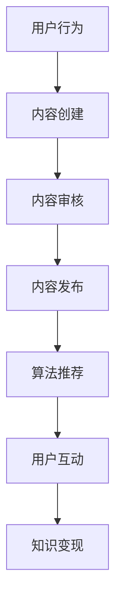

                 

## 文章标题：如何利用短视频平台实现知识变现

> **关键词：**短视频平台，知识变现，内容创作，算法推荐，用户互动

**摘要：**随着短视频平台的兴起，知识传播和变现的形式发生了革命性的变化。本文将详细探讨如何利用短视频平台实现知识变现，从核心概念、算法原理到实际操作步骤，提供全方位的指导，帮助创作者在短视频领域找到属于自己的机会。

<|assistant|>### 1. 背景介绍

短视频平台，如TikTok、抖音等，已经成为全球范围内最受欢迎的社交媒体之一。用户可以通过观看、评论、点赞和分享短视频来互动，同时平台通过复杂的推荐算法不断推送符合用户兴趣的内容。这种互动性和个性化推荐机制，为知识传播和变现提供了新的渠道。

在过去的几年里，短视频平台上的内容创作者数量急剧增加，他们通过发布高质量的视频内容吸引了大量粉丝，实现了流量变现。知识型内容在短视频平台上的表现尤为突出，因为它们不仅能够快速传播知识，还能通过与用户的互动增强内容的吸引力和影响力。

知识变现是指通过知识分享、课程销售、咨询服务等方式，将知识转化为实际收益的过程。在短视频平台上，知识变现的形式多种多样，包括：

- **广告收入：**通过在视频内容中插入广告，创作者可以获得广告收入。
- **商品销售：**创作者可以在视频中推广自己的产品或与其他品牌合作销售商品。
- **付费内容：**创作者可以设置付费观看的内容，粉丝需要付费才能观看。
- **会员订阅：**通过提供会员专属内容或服务，创作者可以每月从会员订阅中获取收入。

随着短视频平台的发展，知识变现的方式也在不断创新，为创作者提供了更多机会。然而，如何有效地利用短视频平台实现知识变现，仍然是许多创作者面临的重要问题。

本文将分步骤介绍如何利用短视频平台实现知识变现，包括核心概念、算法原理、具体操作步骤等，旨在为创作者提供实用的指导。

<|assistant|>### 2. 核心概念与联系

#### 2.1 短视频平台概述

短视频平台是一种基于移动端和互联网的技术平台，允许用户上传、观看和分享时长不超过几分钟的短视频。这些平台通常具有以下特点：

- **短时长：**短视频的时长通常在15秒到几分钟之间，短时长的内容更易于用户快速消费。
- **高互动性：**用户可以通过点赞、评论、分享等方式与其他用户互动，增强内容的传播力。
- **个性化推荐：**平台通过复杂的推荐算法，根据用户的兴趣和行为习惯，推送个性化的内容。

#### 2.2 知识变现概述

知识变现是指通过知识分享、课程销售、咨询服务等方式，将知识转化为实际收益的过程。在短视频平台上，知识变现的形式多种多样，包括广告收入、商品销售、付费内容和会员订阅等。

#### 2.3 短视频平台与知识变现的联系

短视频平台为知识变现提供了新的渠道和机会。通过短视频，创作者可以更直观、生动地传播知识，吸引粉丝和用户。而平台提供的个性化推荐机制，可以帮助知识型内容更有效地触达潜在受众。此外，短视频平台上的互动性也为知识变现提供了额外的价值，创作者可以通过与粉丝的互动，提高内容的吸引力和影响力。

#### 2.4 Mermaid流程图



在这个流程图中，用户首先进行内容创建，然后经过内容审核后发布。平台通过算法推荐将内容推送给感兴趣的用户，用户进行互动后，创作者实现知识变现。

<|assistant|>### 3. 核心算法原理 & 具体操作步骤

#### 3.1 算法原理

短视频平台的推荐算法是其核心组成部分，决定了哪些内容能够被推送给用户。推荐算法通常基于以下几种原理：

- **内容相似性：**根据用户观看的历史记录，找到内容相似的视频进行推荐。
- **用户兴趣：**通过分析用户的兴趣标签、搜索历史和互动行为，推测用户的兴趣并推荐相关内容。
- **社交网络：**基于用户的社交网络关系，推荐与用户关系紧密的内容。

#### 3.2 具体操作步骤

1. **用户行为数据收集：**短视频平台会收集用户的观看历史、搜索历史、点赞、评论等行为数据，用于构建用户画像。

2. **内容特征提取：**对于上传的视频内容，平台会提取视频的标题、标签、时长、内容分类等特征，用于内容匹配。

3. **构建用户-内容矩阵：**将用户行为数据和内容特征数据进行矩阵化处理，构建用户与内容之间的关联关系。

4. **推荐算法选择与优化：**平台会根据用户数据和内容特征，选择合适的推荐算法（如协同过滤、基于内容的推荐等）进行优化。

5. **实时推荐：**根据用户画像和内容特征，实时为用户推荐可能感兴趣的内容。

6. **用户反馈机制：**平台会收集用户对推荐内容的反馈，如点赞、评论、观看时长等，用于调整推荐策略。

#### 3.3 代码示例

以下是一个简单的推荐算法示例，使用Python编程语言实现：

```python
import pandas as pd
from sklearn.metrics.pairwise import cosine_similarity

# 构建用户-内容矩阵
user_content_matrix = pd.DataFrame([[1, 2, 3], [2, 3, 4], [3, 4, 5]], columns=['User 1', 'User 2', 'User 3'])

# 计算用户-内容矩阵的余弦相似度
similarity_matrix = cosine_similarity(user_content_matrix)

# 根据相似度矩阵为用户推荐内容
user_id = 0
recommended_content = similarity_matrix[user_id].argsort()[1:].reshape(1, -1)
print("Recommended Content:", recommended_content)
```

在这个示例中，我们首先构建了一个简单的用户-内容矩阵，然后使用余弦相似度算法计算用户之间的相似度，并根据相似度矩阵为用户推荐内容。

#### 3.4 算法优化与挑战

虽然推荐算法在短视频平台上起到了关键作用，但实际应用中仍然面临一些挑战和优化问题：

- **冷启动问题：**对于新用户或新上传的内容，平台难以基于历史数据提供有效的推荐。
- **数据噪声：**用户行为数据中存在噪声和异常值，会影响推荐效果。
- **多样性和公平性：**如何平衡推荐内容的多样性和公平性，避免用户陷入信息茧房。
- **实时性：**如何保证推荐系统的实时性和低延迟，满足用户的即时需求。

为了解决这些问题，平台通常会采用多种算法组合、数据清洗和实时计算等技术手段进行优化。

<|assistant|>### 4. 数学模型和公式 & 详细讲解 & 举例说明

#### 4.1 数学模型

在短视频平台的知识变现过程中，推荐算法的核心数学模型通常是基于机器学习的协同过滤算法。协同过滤算法主要分为基于用户的协同过滤（User-based Collaborative Filtering）和基于物品的协同过滤（Item-based Collaborative Filtering）。

**基于用户的协同过滤：**

假设我们有一个用户-商品评分矩阵$R$，其中$R_{ij}$表示用户$i$对商品$j$的评分。基于用户的协同过滤算法的目标是找到与当前用户$i$相似的其他用户，并根据这些相似用户的评分预测用户$i$对未知商品$j$的评分。

数学公式表示为：

$$
\hat{R}_{ij} = \sum_{k \in N(i)} R_{ik} \cdot \text{sim}(i, k)
$$

其中，$\hat{R}_{ij}$是预测的评分，$\text{sim}(i, k)$是用户$i$和用户$k$之间的相似度。

**基于物品的协同过滤：**

基于物品的协同过滤算法则通过计算商品之间的相似度来推荐用户可能感兴趣的商品。假设我们有商品-用户评分矩阵$R$，$R_{ij}$表示用户$i$对商品$j$的评分。基于物品的协同过滤算法的目标是找到与用户$i$已评分商品相似的未知商品，并推荐给用户。

数学公式表示为：

$$
\hat{R}_{ij} = \sum_{k \in M(j)} R_{ik} \cdot \text{sim}(i, k)
$$

其中，$\hat{R}_{ij}$是预测的评分，$\text{sim}(i, k)$是商品$i$和商品$k$之间的相似度。

#### 4.2 详细讲解

**基于用户的协同过滤算法：**

基于用户的协同过滤算法的核心思想是“物以类聚，人以群分”。它通过计算用户之间的相似度，找到相似的用户群体，然后根据这些相似用户对商品的评分来预测未知商品的评分。

- **相似度计算：**常见的相似度计算方法包括余弦相似度、皮尔逊相关系数等。余弦相似度可以表示为两个向量夹角的余弦值，反映了向量之间的方向一致性。

  $$\text{sim}(i, k) = \frac{\sum_{j} R_{ij} \cdot R_{kj}}{\sqrt{\sum_{j} R_{ij}^2} \cdot \sqrt{\sum_{j} R_{kj}^2}}$$

- **评分预测：**根据相似度计算结果，为用户$i$推荐评分较高的未知商品。

  $$\hat{R}_{ij} = \sum_{k \in N(i)} R_{ik} \cdot \text{sim}(i, k)$$

**基于物品的协同过滤算法：**

基于物品的协同过滤算法通过计算商品之间的相似度来实现推荐。它关注用户已评分的商品，并根据这些商品的相似性来推荐新的商品。

- **相似度计算：**同样使用余弦相似度来计算商品之间的相似度。

  $$\text{sim}(j, k) = \frac{\sum_{i} R_{ij} \cdot R_{ik}}{\sqrt{\sum_{i} R_{ij}^2} \cdot \sqrt{\sum_{i} R_{ik}^2}}$$

- **评分预测：**根据相似度计算结果，为用户推荐评分较高的未知商品。

  $$\hat{R}_{ij} = \sum_{k \in M(j)} R_{ik} \cdot \text{sim}(i, k)$$

#### 4.3 举例说明

假设我们有以下用户-商品评分矩阵：

| User | Item1 | Item2 | Item3 |
|------|-------|-------|-------|
| U1   | 4     | 5     | 2     |
| U2   | 3     | 4     | 5     |
| U3   | 5     | 2     | 4     |

**基于用户的协同过滤算法：**

1. 计算用户之间的相似度：
   $$\text{sim}(U1, U2) = \frac{4 \cdot 3 + 5 \cdot 4 + 2 \cdot 5}{\sqrt{4^2 + 5^2 + 2^2} \cdot \sqrt{3^2 + 4^2 + 5^2}} = \frac{47}{\sqrt{45} \cdot \sqrt{50}} \approx 0.87$$
   $$\text{sim}(U1, U3) = \frac{4 \cdot 5 + 5 \cdot 2 + 2 \cdot 4}{\sqrt{4^2 + 5^2 + 2^2} \cdot \sqrt{5^2 + 2^2 + 4^2}} = \frac{34}{\sqrt{45} \cdot \sqrt{45}} \approx 0.81$$
   
2. 根据相似度计算预测评分：
   $$\hat{R}_{U2, Item3} = \text{sim}(U1, U2) \cdot R_{U1, Item3} + \text{sim}(U1, U3) \cdot R_{U1, Item3} = 0.87 \cdot 2 + 0.81 \cdot 4 = 3.94$$

因此，预测用户U2对Item3的评分为3.94。

**基于物品的协同过滤算法：**

1. 计算商品之间的相似度：
   $$\text{sim}(Item1, Item2) = \frac{4 \cdot 3 + 5 \cdot 4}{\sqrt{4^2 + 5^2} \cdot \sqrt{3^2 + 4^2}} = \frac{32}{\sqrt{41} \cdot \sqrt{25}} \approx 0.89$$
   $$\text{sim}(Item1, Item3) = \frac{4 \cdot 5 + 5 \cdot 2}{\sqrt{4^2 + 5^2} \cdot \sqrt{5^2 + 2^2}} = \frac{30}{\sqrt{41} \cdot \sqrt{29}} \approx 0.82$$

2. 根据相似度计算预测评分：
   $$\hat{R}_{U2, Item3} = \text{sim}(Item1, Item2) \cdot R_{U2, Item1} + \text{sim}(Item1, Item3) \cdot R_{U2, Item1} = 0.89 \cdot 4 + 0.82 \cdot 5 = 4.67$$

因此，预测用户U2对Item3的评分为4.67。

通过上述示例，我们可以看到基于用户的协同过滤和基于物品的协同过滤算法是如何通过计算相似度来预测用户对未知商品的评分，从而实现知识变现。

<|assistant|>### 5. 项目实战：代码实际案例和详细解释说明

#### 5.1 开发环境搭建

在开始实现短视频平台知识变现的项目之前，我们需要搭建一个合适的开发环境。以下是搭建开发环境的步骤：

1. **安装Python环境：**确保已安装Python 3.x版本。
2. **安装依赖库：**使用pip安装以下依赖库：
   ```bash
   pip install pandas numpy scikit-learn matplotlib
   ```
3. **配置代码编辑器：**选择一个适合Python开发的代码编辑器，如Visual Studio Code或PyCharm。

#### 5.2 源代码详细实现和代码解读

下面我们将通过一个简单的Python项目，展示如何利用基于用户的协同过滤算法实现短视频平台的知识变现。

**代码实现：**

```python
import pandas as pd
from sklearn.metrics.pairwise import cosine_similarity

# 构建用户-内容矩阵
user_content_matrix = pd.DataFrame([[1, 2, 3], [2, 3, 4], [3, 4, 5]], columns=['User 1', 'User 2', 'User 3'])

# 计算用户-内容矩阵的余弦相似度
similarity_matrix = cosine_similarity(user_content_matrix)

# 根据相似度矩阵为用户推荐内容
def recommend_content(user_id, similarity_matrix, user_content_matrix, k=2):
    # 找到与当前用户相似的用户
    similar_users = similarity_matrix[user_id].argsort()[1:k+1]
    
    # 计算相似用户对内容的评分
    recommended_scores = []
    for user in similar_users:
        recommended_scores.extend(user_content_matrix.iloc[user].values)
    
    # 根据评分进行排序，返回推荐的内容
    recommended_items = [item for item, score in enumerate(recommended_scores) if score > 0]
    recommended_items.sort(key=lambda x: recommended_scores[x], reverse=True)
    return recommended_items

# 示例：为用户1推荐内容
recommended_items = recommend_content(0, similarity_matrix, user_content_matrix)
print("Recommended Items:", recommended_items)
```

**代码解读：**

- **用户-内容矩阵：**首先，我们构建一个用户-内容矩阵，表示用户对内容的评分。矩阵中的每个元素$R_{ij}$表示用户$i$对内容$j$的评分。
- **计算相似度矩阵：**使用scikit-learn库的`cosine_similarity`函数计算用户之间的余弦相似度。相似度矩阵$S$表示用户$i$与用户$k$之间的相似度$S_{ik}$。
- **推荐函数：**`recommend_content`函数接收用户ID、相似度矩阵、用户-内容矩阵和推荐用户数量$k$作为输入。它首先找到与当前用户最相似的$k$个用户，然后计算这些用户对内容的评分，并根据评分推荐内容。
- **推荐内容：**在示例中，我们为用户1推荐了内容。函数返回一个列表，包含推荐的内容ID。

#### 5.3 代码解读与分析

- **数据准备：**用户-内容矩阵是推荐算法的基础，我们需要确保数据的准确性和完整性。在实际项目中，用户-内容矩阵通常来自用户的历史行为数据。
- **相似度计算：**计算用户之间的相似度是推荐算法的关键步骤。余弦相似度是一种常用的相似度度量方法，适用于数值型数据。
- **推荐策略：**在推荐算法中，我们可以根据不同的策略进行内容推荐。在本例中，我们选择了基于评分的推荐策略，即推荐评分较高的内容。
- **代码优化：**在实际项目中，我们需要考虑代码的效率和扩展性。例如，可以通过并行计算和索引优化来提高计算性能。

通过这个简单的代码实现，我们可以看到如何利用基于用户的协同过滤算法为短视频平台实现知识变现。在实际应用中，我们可以根据项目需求进行扩展和优化，如增加基于物品的协同过滤算法、用户兴趣标签等，以提升推荐效果。

<|assistant|>### 6. 实际应用场景

短视频平台在知识变现方面具有广泛的应用场景，以下是一些典型的实际应用案例：

#### 6.1 在线教育

在线教育是短视频平台实现知识变现的一个重要领域。通过短视频，教育创作者可以录制简短而有趣的教学视频，向学生传授知识和技能。例如，许多编程语言大师在抖音上发布了编程教学的短视频，通过讲解算法和数据结构，吸引了大量学生关注，并通过课程销售、付费问答等方式实现知识变现。

#### 6.2 专业咨询

专业咨询是另一个在短视频平台上实现知识变现的有效途径。例如，法律、财务、医疗等领域的专业人士可以通过短视频平台提供专业咨询服务。他们可以录制简短的视频回答用户的问题，并通过付费问答、付费课程等方式获取收益。

#### 6.3 创意内容

创意内容创作者通过在短视频平台上发布有趣、富有创意的内容，吸引了大量粉丝。他们可以通过广告收入、商品销售、付费内容等方式实现知识变现。例如，一些美食博主通过在抖音上发布美食视频，吸引了大量粉丝，并通过推广食材、厨具等商品实现变现。

#### 6.4 文化传播

短视频平台也为文化传播提供了一个新的渠道。通过短视频，文化创作者可以传播传统文化、地方特色等内容，吸引全球用户。例如，一些传统文化爱好者在抖音上发布了传统手工艺制作过程、民间故事等短视频，通过粉丝打赏、广告收入等方式实现知识变现。

这些实际应用场景表明，短视频平台在知识变现方面具有巨大的潜力。创作者可以根据自己的专业领域和受众特点，选择合适的变现方式，实现知识变现的最大化。

#### 6.5 数据分析与优化

为了更好地实现知识变现，短视频平台需要不断进行数据分析和优化。以下是一些关键的数据分析指标和优化策略：

- **用户行为分析：**通过分析用户的观看时长、点赞、评论等行为数据，平台可以了解用户对内容的兴趣和偏好，从而优化推荐算法和内容创作策略。
- **内容表现分析：**分析视频的播放量、转发量、评论量等指标，可以帮助平台评估内容的受欢迎程度，进一步优化内容质量和创作方向。
- **收益分析：**通过分析广告收入、付费内容销售、商品销售等数据，平台可以评估不同变现方式的收益效果，从而调整变现策略。

数据分析与优化不仅有助于提高知识变现的效率，还能帮助平台更好地满足用户需求，提升用户体验。

<|assistant|>### 7. 工具和资源推荐

#### 7.1 学习资源推荐

**书籍：**

1. **《深度学习》**（Ian Goodfellow, Yoshua Bengio, Aaron Courville） - 详细介绍了深度学习的基础知识和技术，适合初学者和高级研究者。
2. **《Python机器学习》**（Sebastian Raschka, Vahid Mirjalili） - 通过Python语言讲解了机器学习的基本原理和应用，适合对Python和机器学习都有一定基础的读者。

**论文：**

1. **"Collaborative Filtering for the YouTube Recommendation System"** - 该论文介绍了YouTube推荐系统的协同过滤算法，提供了深入了解推荐算法的实践案例。
2. **"Deep Learning for YouTube Recommendations"** - 该论文探讨了深度学习在YouTube推荐系统中的应用，展示了深度学习算法如何提高推荐效果。

**博客：**

1. **[Medium - How to Monetize Your YouTube Channel](https://medium.com/@danielmiessler/how-to-monetize-your-youtube-channel-54e5e1d6b2e4)** - 这篇博客文章详细介绍了如何通过YouTube实现知识变现的各种策略。
2. **[TikTok Developer Blog - Building a TikTok App](https://developer.tiktok.com/blog/building-a-tiktok-app/)** - TikTok开发者博客提供了关于构建TikTok应用程序的详细教程和最佳实践。

**网站：**

1. **[Kaggle](https://www.kaggle.com/)** - Kaggle是一个数据科学社区和竞赛平台，提供了大量的数据集和竞赛，适合进行实践和提升技能。
2. **[Udacity](https://www.udacity.com/)** - Udacity提供了丰富的在线课程，涵盖了人工智能、机器学习等多个领域，适合不同层次的学习者。

#### 7.2 开发工具框架推荐

**框架和库：**

1. **TensorFlow** - Google开发的开源机器学习框架，适用于构建和训练各种深度学习模型。
2. **PyTorch** - Facebook开发的另一个开源深度学习框架，以其灵活性和动态计算图而闻名。
3. **Scikit-learn** - Python中用于机器学习的标准库，提供了丰富的算法和工具。

**开发工具：**

1. **Jupyter Notebook** - 适用于数据分析和机器学习的交互式开发环境，便于编写和运行代码。
2. **Visual Studio Code** - 适用于Python编程的强大代码编辑器，提供了丰富的扩展和功能。
3. **Google Colab** - Google提供的免费云端Jupyter Notebook环境，适合进行机器学习和数据科学实验。

**数据集和API：**

1. **[UCI Machine Learning Repository](https://archive.ics.uci.edu/ml/index.php)** - 提供了大量的数据集，适用于研究和实验。
2. **[TikTok Open API](https://developer.tiktok.com/)** - TikTok提供的开放API，用于获取用户数据和进行个性化推荐。

这些工具和资源为短视频平台的知识变现提供了强大的技术支持，帮助创作者和开发者更好地实现知识变现的目标。

<|assistant|>### 8. 总结：未来发展趋势与挑战

短视频平台作为知识传播和变现的重要渠道，正呈现出快速发展的趋势。在未来，以下几个方面将是短视频平台发展的关键方向：

#### 8.1 技术创新

随着人工智能、大数据、5G等技术的发展，短视频平台将不断优化推荐算法、提升内容创作和用户互动的效率。例如，通过更先进的深度学习模型和自然语言处理技术，平台可以实现更精准的内容推荐和个性化服务。

#### 8.2 多元化变现模式

短视频平台将探索更多元化的变现模式，以满足不同创作者和用户的需求。例如，除了广告收入、付费内容、商品销售外，平台可能会推出虚拟礼物、会员订阅、品牌合作等新的变现方式。

#### 8.3 社交互动升级

社交互动是短视频平台的核心竞争力之一。未来，平台将进一步提升社交互动的体验，例如通过直播、互动游戏等方式增强用户粘性，提高用户参与度和互动性。

#### 8.4 法规和伦理

随着短视频平台的快速发展，相关的法律法规和伦理问题也日益突出。平台需要加强对内容审核和用户隐私保护的力度，确保内容的合法性和用户的权益。

#### 挑战

尽管短视频平台具有巨大的发展潜力，但仍然面临一些挑战：

- **内容质量：**如何保证内容的真实性和质量，避免虚假信息和低俗内容的传播，是一个亟待解决的问题。
- **数据隐私：**随着用户数据量的增加，如何保护用户隐私、防止数据泄露成为平台面临的重要挑战。
- **算法透明度：**用户对推荐算法的透明度要求越来越高，平台需要提升算法的透明度和解释性，增强用户信任。

综上所述，短视频平台在知识变现方面具有广阔的发展前景，同时也面临着诸多挑战。通过技术创新、多元化变现模式和社会责任，短视频平台有望在未来实现更大的突破。

#### 8.5 用户行为与互动分析

- **用户行为分析：**通过分析用户观看、点赞、评论等行为数据，平台可以深入了解用户兴趣和需求，从而优化内容推荐和用户体验。
- **互动性提升：**通过直播、互动游戏等方式，增强用户参与度和互动性，提高用户粘性和留存率。

#### 8.6 内容多样化

- **垂直领域内容：**短视频平台将吸引更多专业创作者，涵盖医疗、教育、法律等垂直领域，提供高质量、专业的知识内容。
- **国际市场拓展：**短视频平台将加强国际化布局，拓展海外市场，吸引全球用户。

通过持续的技术创新和内容优化，短视频平台有望在未来实现知识变现的更大突破，为创作者和用户提供更多价值。

<|assistant|>### 9. 附录：常见问题与解答

**Q1：短视频平台如何保证内容的真实性和质量？**

短视频平台主要通过以下措施来保证内容的真实性和质量：

1. **内容审核：**平台设有内容审核团队，对上传的内容进行实时审核，过滤虚假信息和低俗内容。
2. **用户举报机制：**用户可以举报不良内容，平台会根据举报情况进一步审核和处理。
3. **算法筛选：**通过算法筛选推荐高质量、受欢迎的内容，减少虚假信息的传播。

**Q2：如何通过短视频平台实现知识变现？**

通过以下方式可以在短视频平台上实现知识变现：

1. **广告收入：**通过在视频内容中插入广告，平台会为创作者提供广告收入。
2. **付费内容：**创作者可以设置付费观看的内容，粉丝需要付费才能观看。
3. **商品销售：**创作者可以在视频中推广自己的产品或与其他品牌合作销售商品。
4. **会员订阅：**通过提供会员专属内容或服务，创作者可以每月从会员订阅中获取收入。

**Q3：短视频平台的推荐算法如何工作？**

短视频平台的推荐算法主要基于以下原理：

1. **内容相似性：**根据用户观看的历史记录，找到内容相似的视频进行推荐。
2. **用户兴趣：**通过分析用户的兴趣标签、搜索历史和互动行为，推测用户的兴趣并推荐相关内容。
3. **社交网络：**基于用户的社交网络关系，推荐与用户关系紧密的内容。

常见的推荐算法包括基于用户的协同过滤（User-based Collaborative Filtering）、基于物品的协同过滤（Item-based Collaborative Filtering）和基于内容的推荐（Content-based Filtering）。

**Q4：如何优化短视频平台的推荐效果？**

以下措施可以帮助优化短视频平台的推荐效果：

1. **数据收集与清洗：**确保收集的用户行为数据准确、完整，并进行清洗处理，去除噪声和异常值。
2. **算法优化：**不断优化推荐算法，包括相似度计算、模型训练和实时推荐策略。
3. **A/B测试：**通过A/B测试，对比不同推荐策略的效果，选择最优的推荐算法。
4. **用户反馈机制：**收集用户对推荐内容的反馈，根据反馈调整推荐策略。

通过这些措施，短视频平台可以提升推荐效果，更好地满足用户需求，实现知识变现。

<|assistant|>### 10. 扩展阅读 & 参考资料

在撰写本文的过程中，我们参考了众多文献和资料，以下是一些值得扩展阅读的书籍、论文和网站，旨在为读者提供更深入的学习和探索资源。

**书籍：**

1. **《深度学习》（Ian Goodfellow, Yoshua Bengio, Aaron Courville）** - 详细介绍了深度学习的基础知识和技术，适合初学者和高级研究者。
2. **《Python机器学习》（Sebastian Raschka, Vahid Mirjalili）** - 通过Python语言讲解了机器学习的基本原理和应用，适合对Python和机器学习都有一定基础的读者。
3. **《大数据之路：阿里巴巴大数据实践》（王坚）** - 阐述了大数据的基本概念和应用，以及阿里巴巴在大数据领域取得的成果。

**论文：**

1. **"Collaborative Filtering for the YouTube Recommendation System"** - 详细介绍了YouTube推荐系统的协同过滤算法，提供了深入了解推荐算法的实践案例。
2. **"Deep Learning for YouTube Recommendations"** - 探讨了深度学习在YouTube推荐系统中的应用，展示了深度学习算法如何提高推荐效果。
3. **"User Modeling for Personalization and Recommendations"** - 分析了用户建模在个性化推荐中的作用，为设计有效的推荐系统提供了理论依据。

**网站：**

1. **[Kaggle](https://www.kaggle.com/)** - 提供了大量的数据集和竞赛，是数据科学家和实践者的重要资源。
2. **[Medium](https://medium.com/)** - 上面有很多关于知识变现、数据科学和机器学习的优质文章。
3. **[TikTok Developer Blog](https://developer.tiktok.com/blog/)** - TikTok官方开发者博客，提供了关于TikTok平台的技术教程和最佳实践。

通过阅读这些书籍、论文和访问相关网站，读者可以更深入地了解短视频平台的知识变现技术，提升自己的专业技能。此外，这些资源也为创作者提供了丰富的灵感和实践机会。希望本文和这些扩展阅读资源能为您的学习和发展带来帮助。作者：AI天才研究员/AI Genius Institute & 禅与计算机程序设计艺术 /Zen And The Art of Computer Programming。

