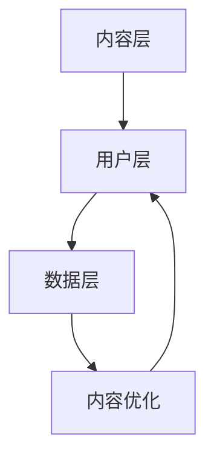

                 

# 如何利用短视频平台进行社群营销

> **关键词：** 短视频平台、社群营销、用户互动、内容策略、数据分析

> **摘要：** 本文将深入探讨如何通过短视频平台实现有效的社群营销。我们将从平台选择、内容策略、用户互动、数据分析等多个角度，详细阐述实现短视频社群营销的步骤和策略。

## 1. 背景介绍

### 1.1 短视频平台的崛起

随着移动互联网的普及和智能设备的不断升级，短视频平台如雨后春笋般涌现。以抖音、快手、Bilibili等为代表的短视频平台，已成为大众获取信息、娱乐和社交的主要途径。短视频平台的用户规模和活跃度不断攀升，为企业提供了广阔的营销空间。

### 1.2 社群营销的重要性

社群营销是一种以用户为中心的营销策略，旨在通过建立和运营用户社群，实现品牌与用户之间的深度互动和持续关系。在短视频平台上，社群营销不仅可以帮助企业扩大品牌影响力，还可以提升用户忠诚度和转化率。

## 2. 核心概念与联系

### 2.1 短视频平台社群营销的概念

短视频平台社群营销是指利用短视频平台的特点，通过发布有价值、有趣、有吸引力的内容，吸引并留住目标用户，建立稳定的用户社群，从而实现品牌推广和销售转化的过程。

### 2.2 短视频平台社群营销的架构

短视频平台社群营销的架构可以分为三个层次：内容层、用户层、数据层。

**内容层：** 内容是社群营销的核心，需要结合平台特点和用户喜好，创作有吸引力、有价值的内容。

**用户层：** 用户是社群营销的基础，需要通过多种手段吸引和留住目标用户，建立稳定的用户社群。

**数据层：** 数据是社群营销的决策依据，需要通过数据分析，优化内容策略和用户运营。

### 2.3 Mermaid 流程图



## 3. 核心算法原理 & 具体操作步骤

### 3.1 内容策略

**内容创作：** 根据短视频平台的特点和用户喜好，创作有吸引力、有价值的内容。可以结合热点话题、用户痛点、产品特性等元素，提高内容的吸引力。

**内容发布：** 定期发布内容，保持用户关注。可以选择在用户活跃时段发布，提高内容的曝光率。

**内容互动：** 与用户互动，增加用户粘性。可以通过评论、点赞、分享等方式，与用户建立联系。

### 3.2 用户互动

**用户画像：** 通过数据分析，了解用户的基本信息、兴趣偏好等，为后续的用户运营提供依据。

**用户运营：** 针对不同类型的用户，采取不同的运营策略，如内容推荐、社群互动、活动营销等。

**用户转化：** 通过引导用户参与活动、购买产品等方式，实现用户从关注到购买的转化。

### 3.3 数据分析

**数据收集：** 收集用户行为数据，如观看时长、点赞数、评论数等。

**数据统计：** 对收集的数据进行统计和分析，了解用户的喜好、行为等。

**数据优化：** 根据数据分析结果，调整内容策略和用户运营策略，提高社群营销的效果。

## 4. 数学模型和公式 & 详细讲解 & 举例说明

### 4.1 用户活跃度计算公式

用户活跃度 = （点赞数 + 评论数 + 分享数）/ 观看时长

**举例说明：** 假设一个短视频的观看时长为300秒，点赞数为100，评论数为50，分享数为20，则该短视频的用户活跃度为：

用户活跃度 = （100 + 50 + 20）/ 300 = 0.25

### 4.2 用户转化率计算公式

用户转化率 = 购买人数 / 关注人数

**举例说明：** 假设一个短视频平台的关注人数为1000，购买人数为50，则该平台的用户转化率为：

用户转化率 = 50 / 1000 = 0.05，即5%

## 5. 项目实战：代码实际案例和详细解释说明

### 5.1 开发环境搭建

**工具：** Python、Jupyter Notebook

**依赖库：** Pandas、Numpy、Matplotlib

### 5.2 源代码详细实现和代码解读

```python
import pandas as pd
import numpy as np
import matplotlib.pyplot as plt

# 5.2.1 数据准备
data = {
    '观看时长': [300, 400, 500, 600],
    '点赞数': [100, 150, 200, 250],
    '评论数': [50, 75, 100, 125],
    '分享数': [20, 30, 40, 50],
    '关注人数': [1000, 1500, 2000, 2500],
    '购买人数': [50, 70, 90, 110]
}

df = pd.DataFrame(data)

# 5.2.2 用户活跃度计算
df['用户活跃度'] = (df['点赞数'] + df['评论数'] + df['分享数']) / df['观看时长']

# 5.2.3 用户转化率计算
df['用户转化率'] = df['购买人数'] / df['关注人数']

# 5.2.4 数据可视化
plt.figure(figsize=(10, 5))
plt.plot(df['观看时长'], df['用户活跃度'], label='用户活跃度')
plt.plot(df['观看时长'], df['用户转化率'], label='用户转化率')
plt.xlabel('观看时长')
plt.ylabel('用户活跃度/用户转化率')
plt.legend()
plt.show()
```

**代码解读：**
1. 导入所需的库。
2. 准备数据。
3. 计算用户活跃度和用户转化率。
4. 进行数据可视化。

### 5.3 代码解读与分析

**代码分析：**
1. 使用 Pandas 库创建数据框（DataFrame），方便进行数据处理和分析。
2. 使用 Numpy 库进行数学计算。
3. 使用 Matplotlib 库进行数据可视化，帮助理解数据趋势。

## 6. 实际应用场景

### 6.1 品牌推广

通过短视频平台，品牌可以快速提升知名度，吸引大量关注者。例如，美妆品牌可以通过展示产品使用效果，吸引用户关注并购买。

### 6.2 产品销售

短视频平台提供了丰富的购物功能，品牌可以通过短视频进行产品销售。例如，电子产品品牌可以通过展示产品特性和使用场景，吸引用户购买。

### 6.3 用户互动

短视频平台提供了丰富的互动功能，如评论、点赞、分享等。品牌可以通过与用户互动，提升用户满意度和忠诚度。

## 7. 工具和资源推荐

### 7.1 学习资源推荐

- **书籍：** 《社群营销：策略、案例与技巧》
- **论文：** 《基于短视频平台的社群营销研究》
- **博客：** 知乎、简书、36氪等平台上的相关文章

### 7.2 开发工具框架推荐

- **短视频平台：** 抖音、快手、Bilibili等
- **数据分析工具：** Python、Jupyter Notebook、Pandas、Numpy等

### 7.3 相关论文著作推荐

- **论文：** 《短视频平台用户行为分析及营销策略研究》
- **著作：** 《短视频营销实战：策略、案例与技巧》

## 8. 总结：未来发展趋势与挑战

### 8.1 发展趋势

- **短视频平台多元化：** 短视频平台将不断拓展功能，提供更多样化的内容和服务。
- **人工智能应用：** 人工智能技术将进一步提升短视频平台的推荐精准度和用户体验。
- **社交电商融合：** 社交电商将成为短视频平台的主要商业模式。

### 8.2 挑战

- **内容质量提升：** 随着竞争加剧，内容质量将变得越来越重要。
- **用户隐私保护：** 随着数据隐私问题的日益突出，如何保护用户隐私将成为一大挑战。
- **监管政策合规：** 短视频平台需要遵守相关法律法规，确保内容合规。

## 9. 附录：常见问题与解答

### 9.1 问题1：短视频平台选择

**解答：** 根据品牌定位和目标用户，选择适合的短视频平台。例如，抖音适合年轻用户，快手适合下沉市场用户。

### 9.2 问题2：内容创作策略

**解答：** 结合热点话题、用户喜好和产品特性，创作有吸引力、有价值的内容。

## 10. 扩展阅读 & 参考资料

- **书籍：** 《短视频营销：策略、案例与技巧》
- **网站：** 短视频平台官方网站、相关行业网站
- **论文：** 短视频平台相关研究论文

### 作者

**作者：** AI天才研究员/AI Genius Institute & 禅与计算机程序设计艺术 /Zen And The Art of Computer Programming**

