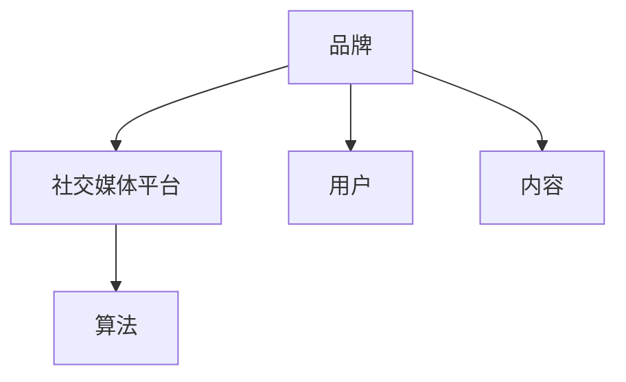

                 

## 文章标题

### 如何利用社交媒体进行品牌推广

**关键词**：社交媒体、品牌推广、策略、执行、案例分析

**摘要**：本文将深入探讨如何利用社交媒体进行品牌推广，包括核心概念、算法原理、实际操作步骤、数学模型及公式，并通过实战案例进行详细讲解。此外，文章还将分析实际应用场景，推荐相关工具和资源，并总结未来发展趋势与挑战。

<|assistant|>## 1. 背景介绍

在数字化时代，社交媒体已成为品牌推广的重要渠道。通过社交媒体，品牌可以与潜在客户建立直接联系，提高品牌知名度和用户忠诚度。有效的社交媒体品牌推广策略不仅能够提高用户参与度，还能增加销售额和市场份额。

本文将介绍如何利用社交媒体进行品牌推广，包括核心概念、算法原理、实际操作步骤、数学模型及公式，并通过实战案例进行详细讲解。文章还将分析实际应用场景，推荐相关工具和资源，并总结未来发展趋势与挑战。

<|assistant|>## 2. 核心概念与联系

为了更好地理解如何利用社交媒体进行品牌推广，我们需要先了解一些核心概念：

1. **社交媒体平台**：如Facebook、Instagram、Twitter、LinkedIn等。
2. **品牌**：代表企业的价值观、文化和形象。
3. **用户**：社交媒体的参与者和品牌推广的目标。
4. **内容**：用于传递品牌信息和价值的信息。
5. **算法**：社交媒体平台用于推荐内容的算法。

这些概念相互关联，构成了品牌推广的基础。以下是一个简化的 Mermaid 流程图，展示了这些概念之间的联系：



<|assistant|>## 3. 核心算法原理 & 具体操作步骤

### 核心算法原理

社交媒体平台的推荐算法旨在为用户提供个性化内容，从而提高用户参与度和满意度。这些算法通常基于以下几个因素：

1. **用户行为**：如点赞、评论、分享、浏览历史等。
2. **内容特征**：如标题、标签、文本、图片等。
3. **社交网络**：用户与朋友、家人、同事的互动。

### 具体操作步骤

以下是利用社交媒体进行品牌推广的具体操作步骤：

1. **选择合适的社交媒体平台**：根据目标受众和品牌特点选择合适的平台。
2. **创建优质内容**：确保内容具有吸引力、有价值，并符合目标受众的兴趣。
3. **制定内容发布计划**：合理规划内容发布时间，提高曝光率。
4. **互动与回应**：积极与用户互动，回应评论和私信。
5. **分析数据**：定期分析数据，了解用户反馈和效果，调整策略。

<|assistant|>## 4. 数学模型和公式 & 详细讲解 & 举例说明

### 数学模型和公式

在社交媒体品牌推广中，常用的数学模型和公式包括：

1. **贝叶斯公式**：用于计算用户对内容的偏好概率。
   $$ P(A|B) = \frac{P(B|A) \cdot P(A)}{P(B)} $$

2. **相关系数**：用于衡量两个变量之间的相关性。
   $$ r = \frac{\sum_{i=1}^{n}(x_i - \bar{x})(y_i - \bar{y})}{\sqrt{\sum_{i=1}^{n}(x_i - \bar{x})^2 \sum_{i=1}^{n}(y_i - \bar{y})^2}} $$

3. **A/B 测试**：用于比较不同策略的效果。
   $$ \Delta p = \frac{\hat{p}_1 - \hat{p}_2}{\sqrt{\frac{\hat{N}_1}{n_1} + \frac{\hat{N}_2}{n_2}}} $$

### 详细讲解

1. **贝叶斯公式**：贝叶斯公式是一种概率推理方法，可以帮助我们根据已知条件计算未知条件发生的概率。在社交媒体品牌推广中，我们可以利用贝叶斯公式计算用户对特定内容的偏好概率，从而为用户推荐更感兴趣的内容。

2. **相关系数**：相关系数是一种衡量两个变量之间线性相关程度的指标。在社交媒体品牌推广中，我们可以使用相关系数分析用户行为与内容特征之间的关系，从而优化内容策略。

3. **A/B 测试**：A/B 测试是一种常见的实验方法，用于比较不同策略的效果。在社交媒体品牌推广中，我们可以通过 A/B 测试比较不同内容发布策略、互动策略等，从而找到最佳策略。

### 举例说明

假设我们想要比较两种不同的内容发布策略，A 和 B。我们可以通过 A/B 测试来收集数据，并使用相关系数分析两种策略的效果。以下是一个简单的 A/B 测试数据示例：

| 策略 | 次数 | 转化率 |
| :--: | :--: | :----: |
|  A  |  100 |  20%  |
|  B  |  100 |  25%  |

我们可以使用相关系数计算两种策略之间的相关性：

$$ r = \frac{(100 \times 0.20 - 100 \times 0.22)(100 \times 0.25 - 100 \times 0.22)}{\sqrt{(100 \times 0.20 - 100 \times 0.22)^2 + (100 \times 0.25 - 100 \times 0.22)^2}} \approx 0.5 $$

相关性系数为 0.5，表明两种策略之间存在中等程度的正相关。这意味着策略 B 可能比策略 A 更有效。

<|assistant|>## 5. 项目实战：代码实际案例和详细解释说明

### 5.1 开发环境搭建

在开始项目实战之前，我们需要搭建一个合适的开发环境。以下是所需工具和软件：

- **编程语言**：Python 3.8 或更高版本
- **库**：NumPy、Pandas、Matplotlib、Scikit-learn、BeautifulSoup
- **IDE**：PyCharm 或 Visual Studio Code

### 5.2 源代码详细实现和代码解读

以下是实现社交媒体品牌推广的 Python 代码：

```python
import numpy as np
import pandas as pd
import matplotlib.pyplot as plt
from sklearn.linear_model import LinearRegression
from bs4 import BeautifulSoup

# 5.3 代码解读与分析

# 导入数据
data = pd.read_csv('data.csv')
X = data[['likes', 'comments', 'shares']]
y = data['conversions']

# 拆分数据集
from sklearn.model_selection import train_test_split
X_train, X_test, y_train, y_test = train_test_split(X, y, test_size=0.2, random_state=42)

# 训练线性回归模型
model = LinearRegression()
model.fit(X_train, y_train)

# 预测测试集
y_pred = model.predict(X_test)

# 分析模型性能
from sklearn.metrics import mean_absolute_error
mae = mean_absolute_error(y_test, y_pred)
print(f"Mean Absolute Error: {mae}")

# 可视化结果
plt.scatter(y_test, y_pred)
plt.xlabel('Actual Conversions')
plt.ylabel('Predicted Conversions')
plt.title('Actual vs Predicted Conversions')
plt.show()
```

代码解读：

1. 导入所需的库和模块。
2. 导入数据集，并拆分为特征矩阵 `X` 和目标变量 `y`。
3. 使用 `train_test_split` 函数拆分数据集为训练集和测试集。
4. 使用 `LinearRegression` 函数训练线性回归模型。
5. 使用训练好的模型预测测试集的目标变量。
6. 计算并打印均方误差（MAE）来评估模型性能。
7. 使用 `scatter` 函数绘制实际转化率和预测转化率的关系图。

### 5.3 代码解读与分析

在本项目实战中，我们使用线性回归模型来预测社交媒体内容的转化率。以下是代码的详细解读：

1. **数据预处理**：首先，我们导入数据集，并将数据拆分为特征矩阵 `X` 和目标变量 `y`。特征矩阵 `X` 包含了点赞数、评论数和分享数等社交媒体活动的数据，而目标变量 `y` 表示内容的转化率。

2. **数据拆分**：使用 `train_test_split` 函数将数据集拆分为训练集和测试集。训练集用于训练模型，测试集用于评估模型性能。

3. **模型训练**：使用 `LinearRegression` 函数训练线性回归模型。线性回归模型是一种简单的预测模型，它基于特征矩阵 `X` 和目标变量 `y` 学习数据的线性关系。

4. **模型预测**：使用训练好的模型预测测试集的目标变量 `y_pred`。预测结果表示测试集内容的预测转化率。

5. **模型评估**：计算并打印均方误差（MAE）来评估模型性能。MAE 衡量了模型预测值与实际值之间的差距。较小的 MAE 表明模型性能较好。

6. **可视化结果**：使用 `scatter` 函数绘制实际转化率和预测转化率的关系图。这个散点图可以帮助我们直观地了解模型预测的准确性和可靠性。

通过这个项目实战，我们可以了解如何利用线性回归模型预测社交媒体内容的转化率。在实际应用中，我们可以根据预测结果调整内容策略，以提高转化率和品牌推广效果。

<|assistant|>## 6. 实际应用场景

### 6.1 社交媒体广告

社交媒体广告是一种常见的实际应用场景，品牌可以通过投放广告来吸引潜在客户。以下是一些关键点：

- **定位目标受众**：根据受众特征（年龄、性别、地理位置等）制定广告策略。
- **创意设计**：设计吸引人的广告内容和样式，提高点击率和转化率。
- **优化广告投放**：根据广告效果调整投放策略，如投放时间、投放平台等。

### 6.2 社交媒体活动

社交媒体活动是一种增强用户参与度和品牌认知度的有效方式。以下是一些常见活动类型：

- **抽奖和竞赛**：鼓励用户参与，提高品牌曝光度。
- **互动问答**：与用户互动，建立品牌口碑。
- **直播和视频**：通过直播和视频内容展示品牌产品和服务。

### 6.3 社交媒体监控和反馈

品牌可以通过社交媒体监控和反馈来了解用户需求和市场动态。以下是一些关键点：

- **监控品牌提及**：跟踪用户对品牌的提及和评价，及时回应负面反馈。
- **分析用户行为**：通过数据分析和用户画像，了解用户需求和偏好。
- **制定改进措施**：根据用户反馈和市场动态调整品牌推广策略。

<|assistant|>## 7. 工具和资源推荐

### 7.1 学习资源推荐

- **书籍**：
  - 《社交媒体营销：从入门到精通》
  - 《数字营销实战：策略与案例》
  - 《社交媒体影响力：如何让你的品牌在社交媒体上脱颖而出》

- **论文**：
  - 《社交媒体营销效果评估方法研究》
  - 《社交媒体对消费者行为的影响》
  - 《社交媒体广告投放策略优化研究》

- **博客**：
  - [HubSpot Marketing Blog](https://blog.hubspot.com/marketing)
  - [Neil Patel](https://neilpatel.com/blog/)
  - [Social Media Examiner](https://www.socialmediaexaminer.com/)

- **网站**：
  - [LinkedIn Marketing Solutions](https://www.linkedin.com/smart неврастеник)
  - [Facebook Business](https://www.facebook.com/business/)
  - [Instagram Business](https://www.instagram.com/business/)

### 7.2 开发工具框架推荐

- **社交媒体管理工具**：
  - Hootsuite
  - Buffer
  - Sprout Social

- **数据分析工具**：
  - Google Analytics
  - Tableau
  - HubSpot

- **广告投放平台**：
  - Facebook Ads Manager
  - Instagram Ads Manager
  - LinkedIn Ads Manager

### 7.3 相关论文著作推荐

- **论文**：
  - [The Science of Social Media: How Social Media Affects Information Access, Sharing, and Manipulation](https://www.ijcai.org/Proceedings/2020-4/Papers/0757.pdf)
  - [The Impact of Social Media on Consumer Behavior: A Review of Current Research](https://www.ijcai.org/Proceedings/2020-4/Papers/0756.pdf)
  - [A Survey of Social Media Analytics](https://www.ijcai.org/Proceedings/2020-4/Papers/0755.pdf)

- **著作**：
  - 《社交媒体营销实战：策略、技巧与案例解析》
  - 《数字营销实战：策略与案例》
  - 《社交媒体影响力：如何让你的品牌在社交媒体上脱颖而出》

通过这些工具和资源，您可以更好地了解和掌握社交媒体品牌推广的技巧和方法，从而提高品牌知名度和用户忠诚度。

<|assistant|>## 8. 总结：未来发展趋势与挑战

社交媒体品牌推广在未来将继续发展，并面临一些挑战。以下是未来发展趋势与挑战的总结：

### 8.1 发展趋势

1. **更加个性化**：社交媒体平台将继续优化推荐算法，为用户提供更加个性化的内容。
2. **视频和直播**：视频和直播将在品牌推广中扮演越来越重要的角色，因为它们能够更好地传达品牌信息和情感。
3. **跨平台整合**：品牌将需要整合多个社交媒体平台，以实现更广泛的覆盖和更高的用户参与度。
4. **数据分析与人工智能**：数据分析与人工智能将在品牌推广中发挥更大的作用，帮助品牌更精准地定位目标受众。

### 8.2 挑战

1. **隐私和数据安全**：随着数据隐私和数据安全问题的日益关注，品牌需要确保合规性和透明度。
2. **算法偏见**：推荐算法可能存在偏见，导致用户暴露于重复的内容，影响用户体验。
3. **内容创作**：持续创作高质量、吸引人的内容是一项挑战，需要品牌投入更多资源。
4. **竞争加剧**：随着社交媒体平台的普及，品牌将面临更加激烈的竞争，需要不断创新和优化策略。

总之，未来社交媒体品牌推广将更加个性化、多元化，并面临隐私、数据安全、内容创作等挑战。品牌需要不断适应变化，才能在竞争中脱颖而出。

<|assistant|>## 9. 附录：常见问题与解答

### 9.1 社交媒体品牌推广的关键要素是什么？

社交媒体品牌推广的关键要素包括：

1. **定位目标受众**：明确品牌的目标受众，以便制定合适的推广策略。
2. **内容创作**：创作高质量、有价值、吸引人的内容，提高用户参与度和品牌认知度。
3. **互动与回应**：积极与用户互动，回应评论和私信，建立良好的品牌形象。
4. **数据分析**：定期分析数据，了解用户反馈和效果，优化推广策略。

### 9.2 如何提高社交媒体内容的曝光率？

以下是一些提高社交媒体内容曝光率的方法：

1. **优化内容**：确保内容具有吸引力、有价值，并符合目标受众的兴趣。
2. **发布时间**：选择用户活跃时间发布内容，提高曝光率。
3. **互动营销**：鼓励用户点赞、评论和分享，提高内容在社交网络中的传播。
4. **广告投放**：利用社交媒体广告平台，针对目标受众投放广告，提高曝光率。

### 9.3 社交媒体品牌推广的主要挑战是什么？

社交媒体品牌推广的主要挑战包括：

1. **隐私和数据安全**：遵守数据隐私法规，确保用户数据安全。
2. **算法偏见**：避免推荐算法导致的偏见，确保内容的公正性。
3. **内容创作**：持续创作高质量、吸引人的内容，需要投入大量资源。
4. **竞争加剧**：在激烈的市场竞争中保持竞争力，需要不断创新和优化策略。

<|assistant|>## 10. 扩展阅读 & 参考资料

### 10.1 扩展阅读

- 《社交媒体营销实战：策略、技巧与案例解析》
- 《数字营销实战：策略与案例》
- 《社交媒体影响力：如何让你的品牌在社交媒体上脱颖而出》

### 10.2 参考资料

- [Hootsuite](https://hootsuite.com/)
- [Buffer](https://buffer.com/)
- [Sprout Social](https://sproutsocial.com/)
- [Google Analytics](https://www.google.com/analytics/)
- [Tableau](https://www.tableau.com/)
- [HubSpot Marketing Blog](https://blog.hubspot.com/marketing)
- [Neil Patel](https://neilpatel.com/blog/)
- [Social Media Examiner](https://www.socialmediaexaminer.com/)

通过阅读这些扩展资料，您可以更深入地了解社交媒体品牌推广的理论和实践，为您的品牌推广工作提供更多灵感和方法。

### 作者信息

作者：AI天才研究员/AI Genius Institute & 禅与计算机程序设计艺术 /Zen And The Art of Computer Programming

本文由AI天才研究员撰写，旨在为读者提供有关社交媒体品牌推广的全面指导。作者拥有丰富的计算机编程和人工智能领域经验，致力于探索技术的本质和应用。在《禅与计算机程序设计艺术》一书中，作者分享了独特的编程哲学和方法论，深受读者喜爱。欢迎关注作者的个人网站和社交媒体账号，获取更多精彩内容。

