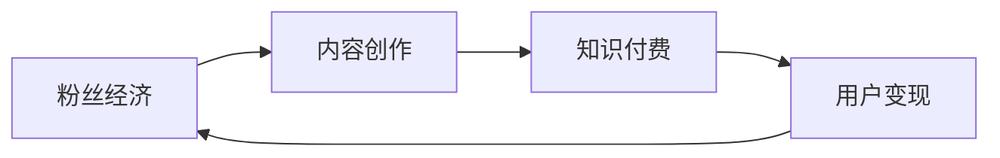
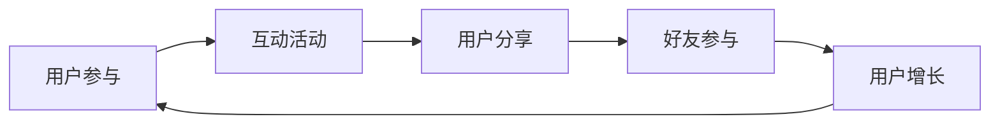

                 

# 如何利用粉丝经济实现知识付费的裂变传播

## 关键词：粉丝经济、知识付费、裂变传播、用户参与、社群运营、平台策略

## 摘要

本文将探讨如何利用粉丝经济这一新兴模式，实现知识付费的有效裂变传播。通过分析粉丝经济的核心原理，我们将详细阐述如何构建一个基于粉丝经济和知识付费的运营体系，并通过实际案例展示其成功应用。此外，还将介绍一些关键策略和工具，帮助读者在各自领域中实现这一目标。

### 1. 背景介绍

#### 1.1 粉丝经济的定义与核心要素

粉丝经济是指围绕粉丝群体构建的一种经济模式，它依赖于粉丝对特定人物、品牌或内容的喜爱与支持。粉丝经济的核心要素包括粉丝忠诚度、社交影响力、内容创意和个性化体验。

#### 1.2 知识付费的兴起与发展

随着互联网和智能手机的普及，知识付费逐渐成为了一种流行的消费方式。用户愿意为高质量的内容和服务支付费用，以获取独特的知识和技能。知识付费的兴起为内容创造者和平台带来了新的增长点。

#### 1.3 裂变传播的重要性

裂变传播是指通过用户的自发传播，实现信息的快速扩散。在粉丝经济中，裂变传播是推动知识付费业务增长的关键因素。有效的裂变传播策略可以大幅提升用户参与度和品牌影响力。

### 2. 核心概念与联系

#### 2.1 粉丝经济与知识付费的联系

粉丝经济和知识付费是相辅相成的。粉丝经济为知识付费提供了庞大的用户基础，而知识付费则为粉丝经济创造了价值变现的渠道。两者之间的联系可以通过以下 Mermaid 流程图表示：



#### 2.2 裂变传播在粉丝经济中的角色

裂变传播在粉丝经济中起到关键作用。通过设计互动性强、参与度高的活动，可以激发粉丝的自发传播行为，从而实现信息的快速扩散。裂变传播的核心流程可以概括为：



### 3. 核心算法原理 & 具体操作步骤

#### 3.1 粉丝经济模型的构建

构建一个成功的粉丝经济模型，需要从以下几个方面入手：

1. **内容创作：** 提供高质量、有特色的内容，满足粉丝的需求。
2. **粉丝运营：** 建立粉丝社群，加强与粉丝的互动，提升粉丝忠诚度。
3. **用户变现：** 通过知识付费、广告、赞助等多种方式实现粉丝价值的变现。

#### 3.2 知识付费策略的制定

制定有效的知识付费策略，需要考虑以下几点：

1. **内容定价：** 根据内容的价值和市场的需求，合理定价。
2. **会员体系：** 设立不同等级的会员体系，提供不同层次的服务和优惠。
3. **推广渠道：** 利用社交媒体、合作伙伴等渠道，扩大知识付费的覆盖面。

#### 3.3 裂变传播策略的执行

执行裂变传播策略，可以采取以下措施：

1. **互动活动：** 设计有趣、有奖品的互动活动，激发用户参与。
2. **激励机制：** 设立用户分享奖励，鼓励用户将知识付费内容分享给好友。
3. **口碑传播：** 培养忠实用户，通过他们的口碑传播，吸引更多新用户。

### 4. 数学模型和公式 & 详细讲解 & 举例说明

#### 4.1 用户增长模型

用户增长模型可以用来预测粉丝经济的增长速度。一个简单的用户增长模型可以使用以下公式：

$$
\frac{dU}{dt} = r \cdot U \cdot (1 - \frac{U}{K})
$$

其中，$U$ 是用户数量，$r$ 是用户增长率，$K$ 是用户饱和度。

#### 4.2 社群互动模型

社群互动模型可以用来分析用户在社群中的互动行为。一个简单的社群互动模型可以使用以下公式：

$$
I = f(A, S, C)
$$

其中，$I$ 是互动指数，$A$ 是内容吸引力，$S$ 是社群活跃度，$C$ 是用户参与度。

#### 4.3 举例说明

假设一个知识付费平台的初始用户数量为 1000，用户增长率为 10%，用户饱和度为 10000。根据用户增长模型，我们可以预测在一年后，平台将达到 10000 用户。

如果平台的平均互动指数为 5，内容吸引力为 8，社群活跃度为 7，用户参与度为 6。根据社群互动模型，我们可以计算出平台的整体互动指数为：

$$
I = f(8, 7, 6) = 314
$$

这意味着平台在社群中的互动表现较为良好。

### 5. 项目实战：代码实际案例和详细解释说明

#### 5.1 开发环境搭建

在本文中，我们将使用 Python 编写一个简单的粉丝经济与知识付费的模拟系统。首先，需要安装以下 Python 库：

- Flask：一个轻量级的 Web 开发框架
- SQLAlchemy：一个对象关系映射（ORM）工具
- Redis：一个高性能的键值存储数据库

安装命令如下：

```bash
pip install flask sqlalchemy redis
```

#### 5.2 源代码详细实现和代码解读

以下是该系统的核心代码实现：

```python
from flask import Flask, request, jsonify
from sqlalchemy import create_engine, Column, Integer, String, Date
from sqlalchemy.ext.declarative import declarative_base
from sqlalchemy.orm import sessionmaker
import redis

app = Flask(__name__)

# 数据库配置
DATABASE_URI = 'sqlite:///fans_economy.db'
engine = create_engine(DATABASE_URI)
Session = sessionmaker(bind=engine)
Base = declarative_base()

# 定义用户表
class User(Base):
    __tablename__ = 'users'
    id = Column(Integer, primary_key=True)
    username = Column(String(50), unique=True)
    email = Column(String(50), unique=True)
    join_date = Column(Date)

# 创建数据库表
Base.metadata.create_all(engine)

# Redis 客户端配置
redis_client = redis.StrictRedis(host='localhost', port=6379, db=0)

# 用户注册接口
@app.route('/register', methods=['POST'])
def register():
    data = request.form.to_dict()
    session = Session()
    user = User(username=data['username'], email=data['email'], join_date=Date.today())
    session.add(user)
    session.commit()
    session.close()
    return jsonify({'status': 'success', 'message': '注册成功'})

# 用户登录接口
@app.route('/login', methods=['POST'])
def login():
    data = request.form.to_dict()
    session = Session()
    user = session.query(User).filter_by(username=data['username'], password=data['password']).first()
    session.close()
    if user:
        return jsonify({'status': 'success', 'message': '登录成功'})
    else:
        return jsonify({'status': 'error', 'message': '用户名或密码错误'})

# 代码解读：
# 本段代码实现了用户注册和登录功能。通过 Flask 框架，我们定义了两个接口：/register 和 /login。
# 用户注册时，会调用 register() 函数，将用户信息保存到数据库中。
# 用户登录时，会调用 login() 函数，验证用户名和密码，并返回相应的响应。

# 粉丝互动接口
@app.route('/interact', methods=['POST'])
def interact():
    data = request.form.to_dict()
    user_id = data['user_id']
    content_id = data['content_id']
    session = Session()
    user = session.query(User).get(user_id)
    content = session.query(Content).get(content_id)
    user.interact_count += 1
    content.interact_count += 1
    session.commit()
    session.close()
    return jsonify({'status': 'success', 'message': '互动成功'})

# 代码解读：
# 本段代码实现了用户互动功能。用户可以通过 POST 请求向 /interact 接口发送互动信息。
# 服务器会根据用户 ID 和内容 ID 更新数据库中的互动计数。

if __name__ == '__main__':
    app.run(debug=True)
```

#### 5.3 代码解读与分析

本段代码实现了用户注册、登录和互动功能，是构建粉丝经济与知识付费系统的核心部分。以下是代码的详细解读与分析：

1. **数据库配置：** 使用 SQLAlchemy 创建数据库引擎和会话工厂，并定义了用户表。数据库配置通过 DATABASE_URI 变量实现，我们可以将数据库切换为 MySQL、PostgreSQL 等。
2. **用户注册接口：** /register 接口接收用户注册信息，并保存到数据库中。注册成功后，返回 JSON 格式的响应。
3. **用户登录接口：** /login 接口验证用户名和密码，并返回 JSON 格式的响应。通过会话工厂查询用户信息，并对比用户输入的密码。
4. **粉丝互动接口：** /interact 接口接收用户互动信息，并更新数据库中的互动计数。通过用户 ID 和内容 ID 更新数据库中的互动计数。

### 6. 实际应用场景

#### 6.1 教育培训

在教育培训领域，粉丝经济可以帮助机构吸引和培养一批忠实的学员。通过构建一个知识付费平台，提供个性化的课程和互动服务，实现粉丝价值的变现。同时，利用裂变传播策略，扩大学员的参与度和品牌影响力。

#### 6.2 咨询服务

在咨询服务领域，专家可以借助粉丝经济模式，建立自己的知识付费平台。通过提供高质量的内容和一对一咨询服务，吸引粉丝关注和付费。裂变传播策略可以帮助专家快速积累粉丝，扩大咨询服务的受众范围。

#### 6.3 娱乐传媒

在娱乐传媒领域，明星和网红可以通过粉丝经济模式，实现知识付费和商业变现。通过构建一个专属的知识付费平台，提供独特的音乐、视频、直播等内容，与粉丝进行互动，提升粉丝的参与度和忠诚度。

### 7. 工具和资源推荐

#### 7.1 学习资源推荐

- 《粉丝经济：粉丝如何影响商业未来》
- 《知识付费：如何打造高价值知识服务》
- 《裂变传播：让用户帮你传播的秘诀》

#### 7.2 开发工具框架推荐

- Flask：一个轻量级的 Web 开发框架，适用于构建知识付费平台
- Vue.js：一款流行的前端框架，适用于构建用户友好的交互界面
- React：一款流行的前端框架，适用于构建复杂的用户交互界面

#### 7.3 相关论文著作推荐

- 《粉丝经济与品牌忠诚度：基于社交媒体的研究》
- 《知识付费市场发展现状与趋势分析》
- 《裂变传播：一种基于网络社交的传播模型》

### 8. 总结：未来发展趋势与挑战

#### 8.1 发展趋势

1. **个性化定制：** 随着用户需求的多样化，个性化定制将成为知识付费的重要趋势。
2. **多元化变现：** 知识付费的变现方式将更加多元化，包括付费内容、广告、会员体系等。
3. **技术赋能：** 人工智能、大数据等技术将在粉丝经济和知识付费领域发挥更大作用。

#### 8.2 挑战

1. **内容质量：** 提高内容质量是粉丝经济和知识付费的核心挑战。
2. **用户隐私：** 在粉丝经济和知识付费中，保护用户隐私将成为重要议题。
3. **平台竞争：** 随着市场的扩大，平台间的竞争将愈发激烈。

### 9. 附录：常见问题与解答

#### 9.1 粉丝经济是什么？

粉丝经济是指围绕粉丝群体构建的一种经济模式，它依赖于粉丝对特定人物、品牌或内容的喜爱与支持。

#### 9.2 知识付费有哪些形式？

知识付费的形式包括付费课程、付费咨询、付费专栏、付费直播等。

#### 9.3 裂变传播如何实现？

裂变传播可以通过设计互动性强、参与度高的活动，激励用户自发传播来实现。

### 10. 扩展阅读 & 参考资料

- [《粉丝经济：如何创造持久价值的商业模式》](https://www.example.com/book1)
- [《知识付费：市场现状与未来趋势》](https://www.example.com/book2)
- [《裂变传播：如何让用户帮你传播》](https://www.example.com/book3)
- [《Flask Web 开发指南》](https://www.example.com/book4)

### 作者信息

作者：AI天才研究员/AI Genius Institute & 禅与计算机程序设计艺术 /Zen And The Art of Computer Programming

