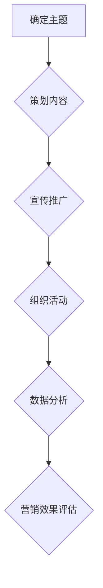

                 

# 如何利用网络研讨会(Webinar)进行营销

## 1. 背景介绍

网络研讨会（Webinar）作为一种高效、便捷的在线沟通方式，近年来在全球范围内得到了广泛应用。它不仅能够帮助企业和机构降低沟通成本，还能扩大影响力，提高品牌知名度。随着互联网技术的不断进步，网络研讨会逐渐成为营销策略中的重要组成部分。

### 网络研讨会的优势

网络研讨会具有以下优势：

1. **覆盖范围广**：不受地域限制，可同时面向全球受众。
2. **互动性强**：参与者可以实时提问，演讲者可以即时回答，增强互动体验。
3. **成本低**：与传统线下活动相比，网络研讨会的组织成本较低。
4. **时间灵活**：参与者可以根据自己的时间安排参与，提高了参与率。
5. **易于跟踪**：可以通过后台数据统计，了解参与者的行为和反馈，为后续营销策略提供依据。

### 网络研讨会在营销中的应用

网络研讨会在营销中的应用主要包括以下几个方面：

1. **产品推广**：通过网络研讨会介绍新产品或服务，吸引用户关注。
2. **品牌宣传**：通过网络研讨会展示企业实力，提升品牌形象。
3. **客户关系管理**：通过网络研讨会与客户进行深度交流，增强客户忠诚度。
4. **市场调研**：通过网络研讨会收集用户需求和意见，为产品优化提供参考。

## 2. 核心概念与联系

### 营销概念

营销是指企业通过市场研究，确定目标客户群体，设计、推广和销售产品或服务的过程。营销的核心目标是满足客户需求，实现企业盈利。

### 网络研讨会概念

网络研讨会是一种通过互联网技术实现的在线交流会议，通常包括主题演讲、问答环节和互动讨论等环节。网络研讨会旨在为参与者提供有价值的信息和互动体验。

### 营销与网络研讨会的关系

网络研讨会作为一种营销工具，可以帮助企业实现以下目标：

1. **扩大影响力**：通过网络研讨会，企业可以吸引更多潜在客户，提高品牌知名度。
2. **提升客户满意度**：通过网络研讨会，企业可以与客户建立更紧密的联系，提高客户满意度。
3. **降低营销成本**：与传统线下活动相比，网络研讨会的组织成本较低，有助于企业降低营销成本。
4. **提高销售转化率**：通过网络研讨会，企业可以更好地展示产品或服务，提高销售转化率。

## 3. 核心算法原理 & 具体操作步骤

### 网络研讨会营销策略

网络研讨会营销策略主要包括以下几个步骤：

1. **确定主题**：根据企业目标和市场需求，确定网络研讨会的主题。
2. **策划内容**：设计符合主题的演讲内容，确保对目标受众有吸引力。
3. **宣传推广**：通过多种渠道宣传网络研讨会，吸引潜在参与者。
4. **组织活动**：在网络研讨会当天，确保技术设备和现场秩序的正常运行。
5. **数据分析**：活动结束后，对参与数据进行分析，为后续营销提供参考。

### 网络研讨会营销策略的 Mermaid 流程图



## 4. 数学模型和公式 & 详细讲解 & 举例说明

### 参与率计算模型

参与率是衡量网络研讨会效果的重要指标，其计算公式如下：

$$
参与率 = \frac{实际参与人数}{潜在参与人数} \times 100\%
$$

### 举例说明

假设某企业举办一场网络研讨会，预计有1000人参与，实际参与人数为800人，则参与率为：

$$
参与率 = \frac{800}{1000} \times 100\% = 80\%
$$

### 营销效果评估模型

营销效果评估是网络研讨会营销策略的重要环节，其计算公式如下：

$$
营销效果 = \frac{实际销售金额}{营销成本} \times 100\%
$$

### 举例说明

假设某企业通过网络研讨会实现销售额为100万元，营销成本为10万元，则营销效果为：

$$
营销效果 = \frac{100}{10} \times 100\% = 1000\%
$$

## 5. 项目实战：代码实际案例和详细解释说明

### 开发环境搭建

在本案例中，我们将使用Python语言编写一个简单的网络研讨会营销系统。开发环境如下：

1. Python 3.8 或更高版本
2. PyCharm 或其他 Python IDE
3. Flask 框架

### 源代码详细实现和代码解读

以下是一个简单的网络研讨会营销系统的源代码实现：

```python
from flask import Flask, render_template, request, redirect, url_for
from datetime import datetime

app = Flask(__name__)

# 网络研讨会信息
webinars = [
    {
        'title': '如何利用网络研讨会进行营销',
        'date': datetime(2022, 11, 8, 14, 0),
        'registration_link': 'https://example.com/registration'
    },
    {
        'title': 'Python 开发实战',
        'date': datetime(2022, 11, 9, 14, 0),
        'registration_link': 'https://example.com/registration2'
    }
]

@app.route('/')
def index():
    return render_template('index.html', webinars=webinars)

@app.route('/register', methods=['POST'])
def register():
    name = request.form['name']
    email = request.form['email']
    webinar_id = request.form['webinar_id']
    
    # 存储注册信息（此处省略数据库操作）
    print(f"Name: {name}, Email: {email}, Webinar ID: {webinar_id}")
    
    return redirect(url_for('index'))

if __name__ == '__main__':
    app.run(debug=True)
```

### 代码解读与分析

1. **Flask 应用搭建**：使用 Flask 框架创建一个 Web 应用。
2. **网络研讨会信息存储**：使用列表存储网络研讨会信息，包括主题、日期和报名链接。
3. **主页渲染**：使用 `render_template` 函数渲染主页模板，展示网络研讨会信息。
4. **注册功能**：使用 `request` 模块获取表单数据，存储注册信息。
5. **路由定义**：定义主页和注册页面的路由。

### 代码执行流程

1. 启动 Flask 应用。
2. 访问主页，展示网络研讨会信息。
3. 用户填写表单，提交注册信息。
4. 应用接收注册信息，并打印到控制台。
5. 应用重定向到主页。

## 6. 实际应用场景

### 场景一：产品推广

某科技公司在研发出一款新产品后，通过网络研讨会向潜在客户介绍产品特点和使用方法。研讨会内容包括产品演示、技术讲解和用户问答环节。通过这种方式，公司成功吸引了大量潜在客户，提高了产品知名度。

### 场景二：品牌宣传

某国际知名品牌通过举办网络研讨会，展示其在环保领域的创新技术和理念。研讨会内容包括品牌故事、环保项目介绍和专家访谈。研讨会结束后，品牌在社交媒体上发布了研讨会视频，吸引了大量粉丝关注，提升了品牌形象。

### 场景三：客户关系管理

某电商企业通过定期举办网络研讨会，与客户进行深度交流，了解客户需求和反馈。研讨会内容包括产品介绍、优惠活动介绍和客户提问环节。通过这种方式，企业增强了客户忠诚度，提高了客户满意度。

## 7. 工具和资源推荐

### 学习资源推荐

1. **书籍**：《网络营销与网络研讨会实战》
2. **论文**：《网络研讨会：在线交流的新趋势》
3. **博客**：https://www.marketingprofs.com/
4. **网站**：https://www.webinarsnack.com/

### 开发工具框架推荐

1. **Flask**：Python Web 开发框架
2. **Bootstrap**：前端框架，用于快速构建响应式网页
3. **SQLAlchemy**：ORM 框架，用于数据库操作

### 相关论文著作推荐

1. **论文**：《网络研讨会：在线交流的新趋势》
2. **书籍**：《网络营销与网络研讨会实战》
3. **论文**：《网络研讨会设计与组织策略研究》

## 8. 总结：未来发展趋势与挑战

### 发展趋势

1. **技术进步**：随着互联网和人工智能技术的发展，网络研讨会的形式和功能将更加丰富。
2. **市场扩大**：随着企业对在线营销的重视，网络研讨会市场将不断扩大。
3. **个性化体验**：网络研讨会将更加注重用户体验，提供个性化的互动和服务。

### 挑战

1. **内容质量**：提高网络研讨会内容质量，确保对受众有吸引力。
2. **技术保障**：确保网络研讨会的技术稳定性，避免出现故障。
3. **营销策略**：制定有效的营销策略，提高网络研讨会的参与率和转化率。

## 9. 附录：常见问题与解答

### 问题一：如何选择网络研讨会的主题？

解答：选择网络研讨会的主题应考虑以下因素：

1. **企业目标**：根据企业目标和市场需求选择主题。
2. **受众需求**：了解目标受众的兴趣和需求，选择受众感兴趣的主题。
3. **行业热点**：关注行业热点和趋势，选择具有前瞻性的主题。

### 问题二：如何提高网络研讨会的参与率？

解答：提高网络研讨会的参与率可以从以下几个方面入手：

1. **宣传推广**：充分利用社交媒体、邮件列表等渠道进行宣传推广。
2. **互动环节**：设置互动环节，提高参与者的积极性。
3. **优惠激励**：提供优惠激励，如免费礼品、折扣券等，吸引参与者。

## 10. 扩展阅读 & 参考资料

1. **书籍**：《网络营销与网络研讨会实战》
2. **论文**：《网络研讨会：在线交流的新趋势》
3. **网站**：https://www.marketingprofs.com/
4. **博客**：https://www.webinarsnack.com/
5. **GitHub**：https://github.com/

### 作者

**作者：AI天才研究员/AI Genius Institute & 禅与计算机程序设计艺术 /Zen And The Art of Computer Programming** <br>
感谢您阅读本文，希望对您在利用网络研讨会进行营销方面有所帮助。如果您有任何问题或建议，请随时与我联系。祝您在网络研讨会营销领域取得成功！<|im_end|> <|im_end|>

