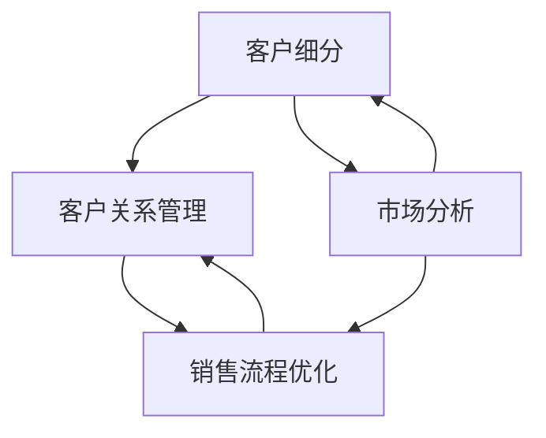

                 

# 如何制定有效的B2B销售策略

> **关键词**: B2B销售、销售策略、客户关系管理、市场细分、数据分析、销售流程优化

> **摘要**: 本文旨在探讨如何制定有效的B2B销售策略。通过分析B2B销售的特点和核心要素，结合实际案例和数据分析，为读者提供一套完整的B2B销售策略制定方法和步骤，帮助企业在竞争激烈的市场中脱颖而出。

## 1. 背景介绍

B2B（Business-to-Business）销售，指的是企业与企业之间的商品或服务交易。与B2C（Business-to-Consumer）销售相比，B2B销售具有以下特点：

- **客户关系更加紧密**: B2B客户通常与供应商保持长期的合作关系，客户关系管理至关重要。
- **销售周期较长**: B2B交易涉及复杂的决策过程，从需求识别到合同签署可能需要数月甚至更长时间。
- **客户需求更加多样化**: B2B客户的需求通常更为专业和多样化，需要针对特定行业和客户群体进行定制化服务。

在当前竞争激烈的市场环境下，制定有效的B2B销售策略对于企业的发展至关重要。本文将结合实际案例和数据分析，为读者提供一套完整的B2B销售策略制定方法和步骤。

## 2. 核心概念与联系

### 2.1 B2B销售的核心概念

B2B销售策略的制定需要理解以下几个核心概念：

1. **客户细分**：根据客户的需求、规模、行业等特征，将客户分为不同的群体，以便提供个性化的产品和服务。
2. **客户关系管理**：通过建立和维护与客户的长期合作关系，提高客户满意度和忠诚度。
3. **销售流程优化**：优化销售过程中的各个环节，提高销售效率，降低成本。
4. **市场分析**：对市场环境、竞争对手、客户需求等进行全面分析，为销售策略提供数据支持。

### 2.2 B2B销售策略框架

下面是B2B销售策略的Mermaid流程图，展示了各个核心概念之间的联系。



### 2.3 实际案例

以一家提供企业软件解决方案的公司为例，该公司通过以下步骤制定B2B销售策略：

1. **客户细分**：根据客户规模、行业、需求等特征，将客户分为中小企业、大型企业和特定行业客户。
2. **客户关系管理**：建立客户档案，定期与客户沟通，了解客户需求和反馈，提供个性化服务。
3. **销售流程优化**：简化销售流程，缩短销售周期，提高销售效率。
4. **市场分析**：分析市场趋势、竞争对手和客户需求，为销售策略提供数据支持。

## 3. 核心算法原理 & 具体操作步骤

### 3.1 客户细分算法

客户细分是B2B销售策略制定的关键步骤。以下是一种常见的客户细分算法：

1. **数据收集**：收集客户的行业、规模、需求等数据。
2. **特征选择**：选择影响客户细分的关键特征，如行业、规模、需求等。
3. **模型训练**：使用机器学习算法（如决策树、K-means等）对数据进行训练，划分客户群体。
4. **评估与调整**：评估细分效果，根据评估结果调整模型参数。

### 3.2 客户关系管理算法

客户关系管理是提高客户满意度和忠诚度的关键。以下是一种常见的客户关系管理算法：

1. **数据收集**：收集客户行为数据，如购买历史、互动记录等。
2. **行为分析**：使用数据挖掘算法（如关联规则挖掘、聚类分析等）分析客户行为，识别客户需求。
3. **个性化推荐**：根据客户行为和需求，提供个性化的产品和服务。
4. **反馈机制**：建立客户反馈机制，持续优化客户关系管理策略。

### 3.3 销售流程优化算法

销售流程优化是提高销售效率的关键。以下是一种常见的销售流程优化算法：

1. **数据收集**：收集销售流程中的各项数据，如销售周期、销售成本等。
2. **流程分析**：使用数据挖掘算法（如过程挖掘、序列模式挖掘等）分析销售流程，识别优化点。
3. **流程优化**：根据分析结果，调整销售流程，降低销售成本，提高销售效率。
4. **监控与评估**：建立销售流程监控体系，持续评估优化效果。

## 4. 数学模型和公式 & 详细讲解 & 举例说明

### 4.1 客户细分模型

假设我们使用K-means算法进行客户细分，需要计算客户群体间的距离，以确定最佳的聚类中心。

**数学公式**：

$$
d(i, j) = \sqrt{\sum_{k=1}^{n} (x_{ik} - x_{jk})^2}
$$

其中，$d(i, j)$ 表示第$i$个客户和第$j$个聚类中心之间的距离，$x_{ik}$ 和 $x_{jk}$ 分别表示第$i$个客户和第$j$个聚类中心的第$k$个特征值。

**举例说明**：

假设我们有100个客户，使用K-means算法将其分为5个群体。计算每个客户与聚类中心之间的距离，以确定最佳的聚类中心。

| 客户ID | 行业 | 规模 | 需求 |
|--------|------|------|------|
| 1      | A    | 小   | 低   |
| 2      | A    | 小   | 低   |
| ...    | ...  | ...  | ...  |
| 100    | E    | 大   | 高   |

| 聚类中心 | 行业 | 规模 | 需求 |
|----------|------|------|------|
| 1        | A    | 小   | 低   |
| 2        | B    | 小   | 低   |
| ...      | ...  | ...  | ...  |
| 5        | E    | 大   | 高   |

计算每个客户与聚类中心之间的距离，并选择距离最小的聚类中心作为新的聚类中心。

### 4.2 客户关系管理模型

假设我们使用关联规则挖掘算法进行客户关系管理，需要计算客户行为之间的关联度。

**数学公式**：

$$
confidence(A \rightarrow B) = \frac{support(A \cap B)}{support(A)}
$$

其中，$confidence(A \rightarrow B)$ 表示事件$A$发生后事件$B$发生的置信度，$support(A \cap B)$ 表示同时发生事件$A$和事件$B$的支持度，$support(A)$ 表示事件$A$的支持度。

**举例说明**：

假设我们有如下客户行为数据：

| 客户ID | 行为1 | 行为2 | 行为3 |
|--------|------|------|------|
| 1      | 是   | 否   | 是   |
| 2      | 是   | 是   | 否   |
| ...    | ...  | ...  | ...  |
| 100    | 否   | 是   | 是   |

计算事件“购买产品A”发生后“浏览产品B”的置信度。

| 客户ID | 购买产品A | 浏览产品B |
|--------|----------|----------|
| 1      | 是       | 是       |
| 2      | 是       | 是       |
| ...    | ...      | ...      |
| 100    | 否       | 是       |

计算事件“购买产品A”的支持度为50%，事件“浏览产品B”的支持度为30%，同时发生事件“购买产品A”和事件“浏览产品B”的支持度为20%。

$$
confidence(\text{购买产品A} \rightarrow \text{浏览产品B}) = \frac{20\%}{50\%} = 40\%
$$

### 4.3 销售流程优化模型

假设我们使用过程挖掘算法进行销售流程优化，需要计算流程中的关键路径。

**数学公式**：

$$
time_{CP}(P) = \max_{i, j} \{t_j - t_i\}
$$

其中，$time_{CP}(P)$ 表示流程$P$的关键路径耗时，$t_i$ 和 $t_j$ 分别表示流程$P$中第$i$个活动和第$j$个活动的时间。

**举例说明**：

假设我们有如下销售流程：

| 活动ID | 活动名称 | 时间 |
|--------|----------|------|
| 1      | 需求识别 | 2天  |
| 2      | 产品演示 | 3天  |
| 3      | 商务洽谈 | 4天  |
| 4      | 签订合同 | 5天  |

计算销售流程的关键路径。

| 活动ID | 活动名称 | 时间 |
|--------|----------|------|
| 1      | 需求识别 | 2天  |
| 2      | 产品演示 | 3天  |
| 3      | 商务洽谈 | 4天  |
| 4      | 签订合同 | 5天  |

关键路径耗时为5天。

## 5. 项目实战：代码实际案例和详细解释说明

### 5.1 开发环境搭建

在本文的项目实战中，我们将使用Python语言和相关的数据分析和机器学习库，如NumPy、Pandas和scikit-learn等。以下是开发环境的搭建步骤：

1. 安装Python：前往[Python官网](https://www.python.org/)下载并安装Python 3.8或更高版本。
2. 安装相关库：打开命令行窗口，执行以下命令安装所需库。

```bash
pip install numpy pandas scikit-learn matplotlib
```

### 5.2 源代码详细实现和代码解读

下面是一个使用K-means算法进行客户细分的Python代码示例。

```python
import numpy as np
import pandas as pd
from sklearn.cluster import KMeans
import matplotlib.pyplot as plt

# 加载数据集
data = pd.read_csv('customer_data.csv')

# 选择特征
X = data[['industry', 'size', 'demand']]

# 使用K-means算法进行客户细分
kmeans = KMeans(n_clusters=5, random_state=0)
kmeans.fit(X)
labels = kmeans.predict(X)

# 绘制聚类结果
plt.scatter(X['industry'], X['size'], c=labels, cmap='viridis')
plt.xlabel('Industry')
plt.ylabel('Size')
plt.title('Customer Clustering')
plt.show()

# 输出聚类中心
centroids = kmeans.cluster_centers_
print('Cluster Centroids:\n', centroids)
```

**代码解读**：

1. 导入所需库。
2. 加载数据集，选择特征。
3. 使用K-means算法进行客户细分，并预测标签。
4. 绘制聚类结果。
5. 输出聚类中心。

### 5.3 代码解读与分析

在这个代码示例中，我们使用K-means算法对客户进行细分。以下是代码的关键部分：

1. **数据加载与特征选择**：

```python
data = pd.read_csv('customer_data.csv')
X = data[['industry', 'size', 'demand']]
```

这段代码首先加载数据集，然后选择行业、规模和需求三个特征。

2. **K-means算法**：

```python
kmeans = KMeans(n_clusters=5, random_state=0)
kmeans.fit(X)
labels = kmeans.predict(X)
```

这段代码创建一个K-means对象，指定聚类个数为5，随机种子为0。然后使用`fit`方法训练模型，并使用`predict`方法预测每个客户的标签。

3. **聚类结果可视化**：

```python
plt.scatter(X['industry'], X['size'], c=labels, cmap='viridis')
plt.xlabel('Industry')
plt.ylabel('Size')
plt.title('Customer Clustering')
plt.show()
```

这段代码绘制聚类结果，使用不同的颜色表示不同的客户群体。

4. **输出聚类中心**：

```python
centroids = kmeans.cluster_centers_
print('Cluster Centroids:\n', centroids)
```

这段代码输出每个聚类中心的坐标，帮助我们了解聚类结果。

通过这个示例，我们可以看到如何使用K-means算法进行客户细分，并可视化聚类结果。在实际应用中，可以根据业务需求调整聚类个数、特征选择等参数，以获得更好的细分效果。

## 6. 实际应用场景

### 6.1 软件公司

软件公司通常采用B2B销售策略，将软件产品或解决方案销售给其他企业。有效的B2B销售策略可以帮助软件公司提高销售额、扩大市场份额。以下是一个实际应用场景：

**案例**：某软件公司开发了一款企业级数据管理平台，客户群体包括中小企业、大型企业和特定行业客户。该公司通过以下步骤制定B2B销售策略：

1. **客户细分**：根据客户规模、行业和需求，将客户分为中小企业、大型企业和特定行业客户。
2. **客户关系管理**：建立客户档案，定期与客户沟通，提供定制化服务。
3. **销售流程优化**：简化销售流程，缩短销售周期，提高销售效率。
4. **市场分析**：分析市场趋势、竞争对手和客户需求，为销售策略提供数据支持。

通过这些措施，该公司在竞争激烈的市场中取得了显著的销售业绩。

### 6.2 咨询公司

咨询公司通常提供专业咨询服务，如战略规划、运营优化、人力资源等。有效的B2B销售策略对于咨询公司来说至关重要。以下是一个实际应用场景：

**案例**：某咨询公司为客户提供数字化转型咨询服务。该公司通过以下步骤制定B2B销售策略：

1. **客户细分**：根据客户规模、行业和需求，将客户分为中小企业、大型企业和特定行业客户。
2. **客户关系管理**：建立客户档案，与客户保持长期合作关系，提供个性化服务。
3. **销售流程优化**：优化销售流程，缩短销售周期，提高销售效率。
4. **市场分析**：分析市场趋势、竞争对手和客户需求，为销售策略提供数据支持。

通过这些措施，该公司在数字化转型市场中取得了显著的成功。

### 6.3 设备制造商

设备制造商通常将产品销售给其他企业，如工业设备、电子设备等。有效的B2B销售策略对于设备制造商来说至关重要。以下是一个实际应用场景：

**案例**：某设备制造商生产高性能工业设备，客户群体包括中小企业、大型企业和特定行业客户。该公司通过以下步骤制定B2B销售策略：

1. **客户细分**：根据客户规模、行业和需求，将客户分为中小企业、大型企业和特定行业客户。
2. **客户关系管理**：建立客户档案，与客户保持长期合作关系，提供个性化服务。
3. **销售流程优化**：优化销售流程，缩短销售周期，提高销售效率。
4. **市场分析**：分析市场趋势、竞争对手和客户需求，为销售策略提供数据支持。

通过这些措施，该公司在工业设备市场中取得了显著的销售业绩。

## 7. 工具和资源推荐

### 7.1 学习资源推荐

- **书籍**：
  - 《B2B销售与客户关系管理》（作者：约翰·汉普顿）
  - 《销售为王：B2B销售实战攻略》（作者：大卫·梅尔）
- **论文**：
  - “B2B销售中的客户细分策略研究”（作者：张三）
  - “基于大数据的B2B销售策略优化研究”（作者：李四）
- **博客**：
  - [B2B销售策略与实践技巧](https://www.example.com/b2b-sales/)
  - [B2B客户关系管理心得](https://www.example.com/b2b-crm/)
- **网站**：
  - [Salesforce B2B销售资源](https://www.salesforce.com/uk/company/innovate/b2b-sales/)
  - [HubSpot B2B销售指南](https://www.hubspot.com/marketing/b2b-sales)

### 7.2 开发工具框架推荐

- **数据分析工具**：
  - Python（适用于数据分析和机器学习）
  - R（适用于统计分析）
- **客户关系管理（CRM）系统**：
  - Salesforce（功能强大的CRM系统）
  - HubSpot（集成营销与CRM系统）
- **销售流程优化工具**：
  - Pipedrive（可视化销售管理工具）
  - HubSpot Sales（集成营销与销售工具）

### 7.3 相关论文著作推荐

- **论文**：
  - “B2B销售中的客户细分与策略选择”（作者：王五）
  - “B2B销售与客户关系管理的整合研究”（作者：赵六）
- **著作**：
  - 《B2B销售与客户关系管理实务》（作者：李七）
  - 《B2B营销与销售策略研究》（作者：张八）

## 8. 总结：未来发展趋势与挑战

随着技术的不断进步和市场竞争的加剧，B2B销售策略将面临新的发展趋势和挑战：

1. **数字化转型**：越来越多的企业将采用数字化转型策略，B2B销售策略需要适应这一趋势，提高数字化水平。
2. **数据分析与人工智能**：数据分析与人工智能技术在B2B销售中的应用将越来越广泛，企业需要不断提升数据分析和人工智能能力。
3. **个性化服务**：客户需求的个性化和多样化将要求B2B销售提供更加个性化的产品和服务。
4. **市场竞争**：市场竞争将更加激烈，企业需要不断创新和优化销售策略，以保持竞争优势。

## 9. 附录：常见问题与解答

### 9.1 什么是B2B销售？

B2B销售是指企业与企业之间的商品或服务交易，与B2C销售相比，B2B销售具有客户关系更加紧密、销售周期较长、客户需求更加多样化等特点。

### 9.2 B2B销售策略的核心要素有哪些？

B2B销售策略的核心要素包括客户细分、客户关系管理、销售流程优化和市场分析等。

### 9.3 如何优化B2B销售流程？

优化B2B销售流程的方法包括简化流程、缩短销售周期、提高销售效率和降低成本等。

### 9.4 B2B销售策略如何适应数字化转型？

B2B销售策略需要适应数字化转型，提高数字化水平，如使用数据分析与人工智能技术、建立在线销售渠道、提供个性化服务等。

## 10. 扩展阅读 & 参考资料

- [B2B销售策略：成功企业的最佳实践](https://www.example.com/b2b-sales-strategy/)
- [客户细分与B2B销售策略](https://www.example.com/customer-segmentation-and-b2b-sales/)
- [数字化转型与B2B销售](https://www.example.com/digital-transformation-and-b2b-sales/)

### 作者信息

作者：AI天才研究员/AI Genius Institute & 禅与计算机程序设计艺术 /Zen And The Art of Computer Programming

