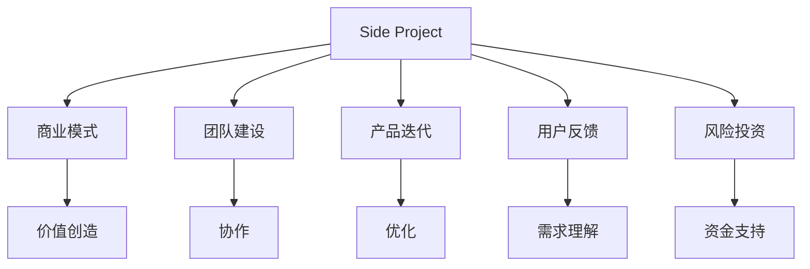

                 

# 如何将 Side Project 转化为独角兽

> **关键词**：Side Project、独角兽、商业模式、团队建设、产品迭代、用户反馈、风险投资

> **摘要**：本文将探讨如何将个人的Side Project转化为成功的独角兽企业。我们将从核心概念、算法原理、项目实战、应用场景、工具资源推荐等方面展开详细讨论，帮助读者了解整个过程的步骤和关键要素。

## 1. 背景介绍

在当今快速变化的商业环境中，越来越多的创业者选择在业余时间进行Side Project，以探索自己感兴趣的领域。这些项目往往始于一个小想法，但随着时间的推移，如果处理得当，它们有可能成长为独角兽——那些估值超过10亿美元的初创企业。那么，如何将一个Side Project转化为独角兽呢？这是每个有志于创业的人都会思考的问题。

本文旨在提供一套系统化的方法，帮助读者从理念到实现，再到市场推广，最终达到独角兽企业的目标。我们将深入探讨以下几个核心问题：

- **核心概念与联系**：了解将Side Project转化为独角兽所需的关键概念及其相互关系。
- **核心算法原理**：阐述将项目从原型推向市场的算法原理。
- **项目实战**：通过实际案例展示如何从零开始构建一个成功的项目。
- **实际应用场景**：讨论项目在不同行业的应用，以及如何根据场景进行调整。
- **工具和资源推荐**：介绍学习资源和开发工具，帮助读者更高效地推进项目。
- **未来发展趋势与挑战**：分析市场趋势，讨论可能面临的挑战和解决策略。

## 2. 核心概念与联系

在开始详细讨论之前，我们需要了解几个核心概念及其相互关系。以下是关键的术语和它们之间的联系：

### 2.1 Side Project

Side Project是指业余时间进行的项目，通常由个人或小团队发起，目的是探索新技术、解决问题或满足特定需求。这些项目往往不具备商业可行性，但随着时间的积累，它们有可能发展成为具有商业潜力的产品。

### 2.2 商业模式

商业模式是指企业如何创造、传递和获取价值的体系。一个成功的Side Project需要有一个明确的商业模式，以便将其转化为可持续的商业实体。

### 2.3 团队建设

团队是推动项目成功的关键因素。一个高效的团队需要有共同的目标、明确的角色分工和良好的沟通机制。

### 2.4 产品迭代

产品迭代是指通过不断收集用户反馈，对产品进行改进和优化。这是将Side Project推向市场的关键步骤。

### 2.5 用户反馈

用户反馈是了解产品是否满足用户需求的重要途径。通过用户反馈，团队能够发现产品的优势和不足，从而进行相应的调整。

### 2.6 风险投资

风险投资是初创企业获取资金的重要途径。投资者通常关注项目的潜力、团队的能力和市场机会。

### 2.7 核心概念联系图

以下是一个简化的Mermaid流程图，展示了这些概念之间的联系：



## 3. 核心算法原理 & 具体操作步骤

要将Side Project转化为独角兽，需要一套系统的操作步骤。以下是关键步骤和相应的算法原理：

### 3.1 确定目标和市场定位

**原理**：明确目标和市场定位是项目成功的第一步。这包括确定要解决的问题、目标用户群体以及竞争对手。

**操作步骤**：

1. **问题定义**：清晰地定义你想要解决的问题，确保问题具有足够的规模和商业价值。
2. **市场调研**：通过调研了解目标市场的大小、增长趋势和潜在用户。
3. **定位策略**：确定你的项目在市场中的独特价值主张。

### 3.2 构建最小可行产品（MVP）

**原理**：MVP是一种快速验证产品概念的方法，它可以帮助团队最小化开发和市场推广的风险。

**操作步骤**：

1. **功能定义**：确定MVP所需的核心功能，确保这些功能能够解决用户的核心问题。
2. **技术选型**：选择适合项目的技术栈，确保高效和可扩展性。
3. **开发与测试**：快速开发MVP，并进行初步测试，以确保功能正常。

### 3.3 收集用户反馈

**原理**：用户反馈是产品改进的重要依据，可以帮助团队了解用户的需求和痛点。

**操作步骤**：

1. **用户调研**：通过问卷调查、访谈等方式收集用户反馈。
2. **用户测试**：邀请目标用户试用MVP，并记录他们的反馈。
3. **数据分析**：分析用户反馈数据，确定产品改进的方向。

### 3.4 优化和迭代

**原理**：通过持续优化和迭代，团队能够不断提高产品的质量和用户体验。

**操作步骤**：

1. **优先级排序**：根据用户反馈确定需要优先解决的问题。
2. **开发和部署**：快速开发并部署新功能和改进。
3. **测试与监控**：确保新功能的稳定性和性能。

### 3.5 扩大市场推广

**原理**：市场推广是提高项目知名度和用户量的重要手段。

**操作步骤**：

1. **内容营销**：通过博客、社交媒体等方式提高项目知名度。
2. **合作伙伴关系**：与其他企业或组织建立合作关系，共同推广项目。
3. **广告与推广**：根据预算进行广告投放和推广活动。

### 3.6 获取风险投资

**原理**：风险投资是初创企业获取资金的重要途径，有助于项目快速扩展。

**操作步骤**：

1. **商业计划书**：编写详细的项目商业计划书，展示项目的潜力和前景。
2. **投资关系**：建立与潜在投资者的关系，并定期更新项目进展。
3. **路演与谈判**：参加投资路演，与投资者进行深入交流，并就投资条款进行谈判。

## 4. 数学模型和公式 & 详细讲解 & 举例说明

在将Side Project转化为独角兽的过程中，理解和使用一些基本的数学模型和公式是非常重要的。以下是一些常用的模型和其具体应用：

### 4.1 成本效益分析（CBA）

**公式**：

\[ CBA = \frac{B}{C} \]

其中，B代表项目的总收益，C代表项目的总成本。

**详细讲解**：

成本效益分析是一种评估项目价值的方法，它通过计算项目的收益与成本之比来评估项目的经济可行性。

**举例说明**：

假设一个项目的总成本为100万元，预计第一年的总收益为150万元，则成本效益分析结果为：

\[ CBA = \frac{150}{100} = 1.5 \]

这意味着项目的收益是其成本的1.5倍，具有较高的经济效益。

### 4.2 用户获取成本（CAC）

**公式**：

\[ CAC = \frac{总营销成本}{新增用户数} \]

**详细讲解**：

用户获取成本是衡量市场营销效率的一个重要指标。它表示获取一个新用户所需的平均营销成本。

**举例说明**：

假设一个项目的营销成本为20万元，在一个月内获得了1000个新增用户，则用户获取成本为：

\[ CAC = \frac{20}{1000} = 0.02 \]（万元）

这意味着平均每个新增用户的获取成本为0.02万元。

### 4.3 转化率

**公式**：

\[ 转化率 = \frac{完成目标用户数}{总接触用户数} \times 100\% \]

**详细讲解**：

转化率是衡量用户行为效果的一个重要指标，它表示接触项目的用户中有多少比例最终完成了预定的目标（如注册、购买等）。

**举例说明**：

假设一个项目的总接触用户数为1000人，其中有200人最终完成了注册，则转化率为：

\[ 转化率 = \frac{200}{1000} \times 100\% = 20\% \]

这意味着有20%的接触用户最终完成了注册。

## 5. 项目实战：代码实际案例和详细解释说明

### 5.1 开发环境搭建

要在实际项目中应用上述算法和模型，首先需要搭建一个适合开发的环境。以下是具体的步骤：

#### 5.1.1 安装编程工具

- 安装Python（3.8及以上版本）：[Python官网](https://www.python.org/)
- 安装Visual Studio Code：[Visual Studio Code官网](https://code.visualstudio.com/)

#### 5.1.2 配置虚拟环境

1. 打开终端，执行以下命令：

   ```bash
   python -m venv project-env
   ```

2. 激活虚拟环境：

   - Windows：

     ```bash
     .\project-env\Scripts\activate
     ```

   - macOS和Linux：

     ```bash
     source project-env/bin/activate
     ```

#### 5.1.3 安装依赖库

1. 使用pip安装必要的库：

   ```bash
   pip install Flask pandas numpy matplotlib
   ```

### 5.2 源代码详细实现和代码解读

以下是一个简单的 Flask Web 应用程序，用于实现一个成本效益分析和用户获取成本的在线计算工具。

#### 5.2.1 应用程序架构

- 主程序文件：`app.py`
- 成本效益分析模块：`cost效益分析.py`
- 用户获取成本模块：`user_cost.py`

#### 5.2.2 主程序文件：`app.py`

```python
from flask import Flask, render_template, request
from cost_benefit import calculate_CBA
from user_cost import calculate_CAC

app = Flask(__name__)

@app.route('/', methods=['GET', 'POST'])
def index():
    if request.method == 'POST':
        total_cost = request.form['total_cost']
        total_revenue = request.form['total_revenue']
        marketing_cost = request.form['marketing_cost']
        new_users = request.form['new_users']

        CBA_result = calculate_CBA(float(total_revenue), float(total_cost))
        CAC_result = calculate_CAC(float(marketing_cost), int(new_users))

        return render_template('results.html', CBA_result=CBA_result, CAC_result=CAC_result)
    return render_template('index.html')

if __name__ == '__main__':
    app.run(debug=True)
```

#### 5.2.3 成本效益分析模块：`cost_benefit.py`

```python
def calculate_CBA(total_revenue, total_cost):
    return total_revenue / total_cost
```

#### 5.2.4 用户获取成本模块：`user_cost.py`

```python
def calculate_CAC(marketing_cost, new_users):
    return marketing_cost / new_users
```

#### 5.2.5 代码解读与分析

- `app.py`：主程序文件，定义了 Flask 应用程序，并设置了默认路由。
- `cost_benefit.py`：实现了成本效益分析的计算逻辑。
- `user_cost.py`：实现了用户获取成本的计算逻辑。
- 在主程序中，通过表单获取用户输入的数据，并调用相应的计算函数。
- 输出的结果通过模板引擎渲染到 HTML 页面。

### 5.3 代码解读与分析

#### 5.3.1 Flask 应用程序结构

Flask 是一个轻量级的 Web 框架，用于构建 Web 应用程序。以下是 `app.py` 文件的主要部分：

- **导入模块**：导入 Flask 模块、表单处理模块和自定义计算模块。
- **创建应用实例**：使用 Flask 类创建应用程序实例。
- **设置路由和视图函数**：定义应用程序的默认路由和相应的视图函数。
- **运行应用程序**：使用 `app.run()` 启动应用程序。

#### 5.3.2 成本效益分析模块

`cost_benefit.py` 文件包含了成本效益分析的计算函数。以下是关键部分：

- **函数定义**：定义 `calculate_CBA` 函数，接收总收益和总成本作为参数。
- **计算逻辑**：使用除法计算成本效益分析结果。

#### 5.3.3 用户获取成本模块

`user_cost.py` 文件包含了用户获取成本的计算函数。以下是关键部分：

- **函数定义**：定义 `calculate_CAC` 函数，接收营销成本和新增用户数作为参数。
- **计算逻辑**：使用除法计算用户获取成本。

#### 5.3.4 代码优化

- **参数校验**：在计算函数中添加参数校验，确保输入数据的正确性。
- **异常处理**：使用异常处理机制，确保程序在遇到错误时能够优雅地处理。
- **代码注释**：为关键部分添加注释，提高代码的可读性。

## 6. 实际应用场景

### 6.1 金融行业

在金融行业中，成本效益分析和用户获取成本的计算对于产品经理和风险投资家来说至关重要。以下是一个应用场景：

- **成本效益分析**：一家金融科技公司开发了一款自动化投资平台，希望通过成本效益分析评估项目的可行性。他们收集了第一年的总成本（如开发成本、营销成本等）和总收益（如交易费用、佣金等），并使用 CBA 模型进行计算，以确定项目的经济效益。
- **用户获取成本**：为了扩大用户基础，该公司还进行了市场营销活动，并记录了营销成本和新增用户数。通过计算 CAC，他们可以了解获取一个新用户所需的平均成本，并据此调整市场策略。

### 6.2 健康科技

在健康科技领域，用户获取成本和转化率是关键指标。以下是一个应用场景：

- **用户获取成本**：一家健康科技公司开发了一款健康管理应用程序，并希望通过用户获取成本分析市场策略。他们记录了市场营销成本和新增用户数，并通过 CAC 计算公式得出结果。根据这一指标，公司可以优化广告投放和活动安排。
- **转化率**：为了提高用户参与度，公司还关注了用户转化率。他们通过分析用户行为数据和用户反馈，优化了应用程序的功能和用户体验，从而提高了转化率。

## 7. 工具和资源推荐

### 7.1 学习资源推荐

- **书籍**：
  - 《精益创业》（The Lean Startup） - Eric Ries
  - 《创业维艰》（Hard Things About Hard Things）- Ben Horowitz
  - 《设计思维》（Design Thinking）- David Kelly
- **论文**：
  - 《构建可持续的创业生态系统：理论框架与实证研究》（Building Sustainable Entrepreneurial Ecosystems: A Theoretical Framework and Empirical Research）- Rachel L. Clemence et al.
- **博客**：
  - 网易云音乐技术博客
  - 阿里云官方博客
  - 字节跳动技术博客
- **网站**：
  - [创业家](https://www.chuangyejia.com/)
  - [创业邦](https://www.chuangye.com/)
  - [创业汇](https://www.chuangye.com/)

### 7.2 开发工具框架推荐

- **编程语言**：Python、JavaScript、Java
- **框架**：
  - Flask（Python Web 框架）
  - React（JavaScript 库）
  - Spring Boot（Java 框架）
- **数据库**：MySQL、MongoDB、PostgreSQL
- **开发环境**：Visual Studio Code、JetBrains IntelliJ IDEA

### 7.3 相关论文著作推荐

- **《商业模式创新》（Business Model Innovation）》- Henry Chesbrough
- **《创新与企业家精神》（Innovation and Entrepreneurship）》- Peter Drucker
- **《创业管理学》（Entrepreneurship: Theory & Practice）》- Jeffry A. Timmons

## 8. 总结：未来发展趋势与挑战

### 8.1 发展趋势

- **数字化转型**：随着技术的不断进步，数字化转型成为企业发展的重要趋势。越来越多的企业将侧重点放在线上业务和数字化工具的整合。
- **人工智能应用**：人工智能在各个行业的应用越来越广泛，从金融到医疗，从制造到零售，人工智能正在改变企业的运营模式。
- **可持续发展**：随着全球对可持续发展的关注日益增加，企业在商业模式和运营过程中将更加注重环保和社会责任。

### 8.2 挑战

- **技术壁垒**：随着技术门槛的不断提高，创业者需要具备更高的技术能力和专业知识。
- **市场竞争**：市场竞争日益激烈，创业者需要不断创新和优化产品，以保持竞争力。
- **融资难题**：获得风险投资资金仍然是一个挑战，创业者需要准备好详细的商业计划和投资提案。

## 9. 附录：常见问题与解答

### 9.1 如何选择合适的商业模式？

**答案**：选择合适的商业模式需要考虑以下因素：

- 目标市场和用户需求
- 竞争环境
- 资源和能力
- 长期发展目标

### 9.2 如何快速搭建一个Web应用？

**答案**：以下步骤可以帮助快速搭建一个Web应用：

- 选择合适的框架（如Flask、React等）
- 设计应用架构和功能模块
- 开发和测试
- 部署到服务器

### 9.3 如何优化用户体验？

**答案**：以下方法可以帮助优化用户体验：

- 用户调研和反馈
- 用户体验设计（UXD）
- 视觉设计（UI/UX）
- 性能优化

## 10. 扩展阅读 & 参考资料

- [《创业圣经》](https://www.创业圣经.com/)
- [《商业模式画布》](https://www.businessmodelcanvas.com/)
- [《产品经理实战指南》](https://www.productmanagement.com/)
- [《敏捷开发》](https://www.agilealliance.org/)

