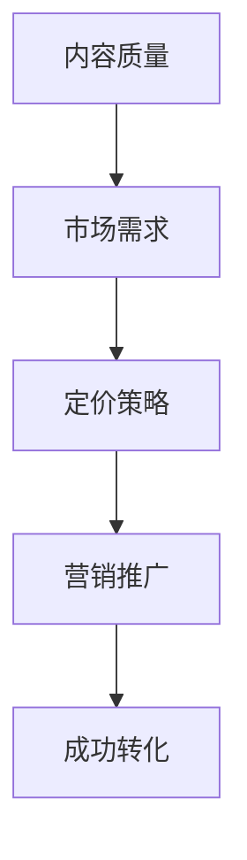
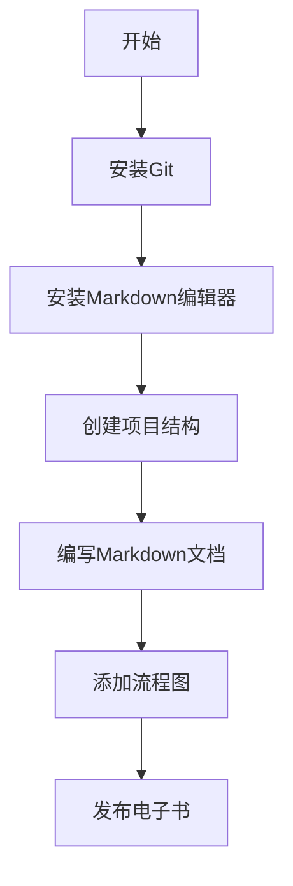

                 

## 如何将技术文档转化为付费电子书

> 关键词：技术文档、付费电子书、转化、写作、出版、营销

摘要：本文将探讨如何将技术文档转化为付费电子书的过程。通过深入分析和详细讲解，本文旨在为那些希望将自己的技术知识变现的作者提供一条切实可行的路径。文章将涵盖从技术文档的整理、内容优化到市场定位、定价策略以及推广销售的各个环节，并提供实用的建议和案例。

在当今数字化时代，技术知识已成为一种宝贵的资源。越来越多的技术专家和爱好者开始意识到，通过将他们的技术文档转化为付费电子书，不仅可以分享自己的知识，还可以实现经济收益。然而，这一过程并非一蹴而就，需要细致的规划与实施。本文将帮助您了解如何从零开始，一步步将您的技术文档转变为一本受欢迎的付费电子书。

## 1. 背景介绍

技术文档是记录技术知识的重要形式，它包括用户手册、API文档、编程指南、设计文档等。随着互联网和信息技术的发展，技术文档的传播方式发生了巨大的变化。传统的纸质书籍逐渐被电子书所取代，这是因为电子书具有存储容量大、易于传播、便于携带和检索等优势。

电子书市场近年来呈现出爆发式增长。根据市场研究公司的数据，全球电子书市场在2020年达到了220亿美元，预计到2025年将超过350亿美元。这一趋势为技术专家提供了巨大的机遇，他们可以通过将技术文档转化为电子书，参与到这一快速发展的市场中。

将技术文档转化为付费电子书的好处不仅限于经济收益。通过这一过程，作者可以：

- **提升个人品牌影响力**：高质量的电子书可以展示作者的专业能力和知识水平，有助于建立个人品牌。
- **持续获取收益**：与传统的纸质书籍不同，电子书可以长时间销售，作者可以持续从中获得收益。
- **降低成本**：相比纸质书籍的印刷、运输等成本，电子书的制作和分发成本较低。

然而，将技术文档转化为付费电子书也面临挑战，如内容质量、市场需求、定价策略、营销推广等。因此，本文将重点探讨如何克服这些挑战，实现技术文档向付费电子书的顺利转化。

## 2. 核心概念与联系

在开始将技术文档转化为付费电子书之前，我们需要了解几个核心概念，这些概念是构建成功电子书的基础。

### 2.1 内容质量

内容质量是电子书成功的关键因素之一。高质量的电子书不仅要有准确的技术知识，还需要有清晰的结构和易于理解的表述。以下是一些确保内容质量的关键点：

- **准确性**：确保所有的技术描述和代码示例都是准确的，没有错误。
- **逻辑性**：内容应该有清晰的逻辑结构，使读者能够循序渐进地学习。
- **实用性**：内容应该具有实用性，能够解决实际问题或提供有价值的信息。
- **可读性**：语言应该简洁明了，避免使用过于复杂的技术术语。

### 2.2 市场需求

了解市场需求是确保电子书能够畅销的关键。以下是一些方法来评估市场需求：

- **目标受众**：明确您的目标受众，了解他们的需求和兴趣。
- **竞争分析**：研究现有的同类电子书，了解它们的优势和不足，找到差异化点。
- **市场趋势**：关注技术领域的发展趋势，预测哪些技术主题将受到读者欢迎。

### 2.3 定价策略

定价策略直接关系到电子书的销售量和收益。以下是一些常见的定价策略：

- **价值定价**：根据电子书的内容和目标受众的价值来定价。
- **成本加成定价**：在成本基础上加上一定的利润来定价。
- **竞争定价**：参考同类电子书的价格来定价，保持竞争力。
- **动态定价**：根据市场需求和销售情况调整价格，如限时折扣、季节性促销等。

### 2.4 营销推广

营销推广是让电子书被更多读者发现的重要手段。以下是一些有效的营销推广方法：

- **社交媒体**：利用微博、知乎、微信公众号等平台宣传电子书。
- **博客和论坛**：在技术博客和论坛上发布与电子书相关的内容，吸引读者。
- **合作推广**：与其他作者、技术社区、媒体等合作，扩大宣传范围。
- **广告**：在相关网站、社交媒体平台上投放广告，提高曝光率。

### 2.5 Mermaid 流程图

以下是一个用于说明核心概念与联系的 Mermaid 流程图：



通过上述核心概念的阐述和流程图展示，我们可以看到将技术文档转化为付费电子书是一个系统工程，需要综合考虑多个因素。接下来，我们将详细探讨每个环节的具体操作步骤。

## 3. 核心算法原理 & 具体操作步骤

### 3.1 内容整理与优化

**步骤 1：确定主题和目标读者**

首先，您需要明确电子书的主题和目标读者。主题应该与您的专业领域和兴趣相符，而目标读者则是您希望吸引的人群。例如，如果您是一位数据库专家，那么您的主题可能是“高效数据库设计”，目标读者则是数据库管理员和开发人员。

**步骤 2：整理现有文档**

接下来，整理您现有的技术文档。这些文档可能包括博客文章、用户手册、编程指南等。将它们按照逻辑顺序重新组织，形成一个完整的内容框架。在这一过程中，要确保所有的内容都是最新的，并且没有重复或冗余的部分。

**步骤 3：优化内容结构**

优化内容结构，使其更加清晰和易于理解。您可以使用以下方法：

- **添加小标题**：在每个主要段落前添加小标题，帮助读者快速浏览。
- **使用图表和图片**：插入图表、代码示例和图片，使内容更加直观。
- **逻辑连接**：确保各个段落之间的逻辑关系清晰，没有断层。

### 3.2 内容创作与编辑

**步骤 4：撰写新内容**

如果现有文档不足以支撑一本完整的电子书，您需要撰写新的内容。在撰写过程中，请注意以下几点：

- **准确性**：确保所有的技术描述和代码示例都是准确的。
- **简洁性**：使用简洁明了的语言，避免使用复杂的术语。
- **实用性**：内容应具有实用性，能够解决实际问题。

**步骤 5：内容审查与编辑**

完成初稿后，进行多轮审查和编辑。您可以使用以下方法：

- **同行评审**：邀请同行或专家对内容进行评审，提出修改意见。
- **语法检查**：使用语法检查工具，确保没有语法错误。
- **格式调整**：调整文档格式，使其更加美观和易于阅读。

### 3.3 转化为电子书格式

**步骤 6：选择电子书格式**

根据您的目标读者和市场，选择合适的电子书格式。常见的电子书格式包括EPUB、MOBI和PDF。EPUB格式适用于大多数电子阅读器和应用程序，而MOBI格式主要用于Kindle设备，PDF格式则适用于需要保留原文格式的内容。

**步骤 7：使用工具进行转换**

使用专业的电子书制作工具进行转换。例如，Calibre是一个常用的电子书制作工具，它支持多种格式的转换。在转换过程中，确保所有的图片、图表和代码示例都能正常显示。

### 3.4 内容发布

**步骤 8：选择出版平台**

选择合适的出版平台，将您的电子书发布出去。常见的电子书出版平台包括Amazon Kindle Direct Publishing（KDP）、Smashwords、Lulu等。这些平台提供了从编辑、格式转换到发布、销售的全方位服务。

**步骤 9：设定价格和描述**

在平台上设定您的电子书价格，并撰写详细的描述。价格应根据市场需求和竞争对手的价格来设定，而描述则应突出电子书的核心价值和亮点，吸引读者的注意。

**步骤 10：提交审核**

提交电子书进行审核。大多数平台都会对提交的电子书进行内容审查，确保它符合平台的要求和标准。

通过以上具体操作步骤，您可以将技术文档转化为高质量的付费电子书。接下来，我们将探讨如何通过市场定位和定价策略来进一步优化销售效果。

### 4. 数学模型和公式 & 详细讲解 & 举例说明

在将技术文档转化为付费电子书的过程中，一些关键的数学模型和公式可以帮助我们更好地理解和优化营销策略。以下是一些常用的数学模型和公式，以及它们的详细解释和实际应用示例。

#### 4.1 成本收益分析模型

成本收益分析（Cost-Benefit Analysis，CBA）是一种评估项目或决策的成本与收益的方法。以下是一个简单的CBA模型：

$$
\text{收益} = \text{售价} \times \text{销量}
$$

$$
\text{成本} = \text{固定成本} + (\text{可变成本} \times \text{销量})
$$

$$
\text{净收益} = \text{收益} - \text{成本}
$$

**示例：**

假设一本电子书的售价为49.99美元，固定成本为1000美元，可变成本为5美元/本。预计销量为1000本。

- 收益 = 49.99 \times 1000 = 49,990美元
- 成本 = 1000 + (5 \times 1000) = 6000美元
- 净收益 = 49,990 - 6000 = 44,990美元

通过这个模型，我们可以计算出预计的净收益，帮助我们在定价和销量预测方面做出更明智的决策。

#### 4.2 优化定价策略

定价策略的优化可以通过边际收益和边际成本的概念来实现。边际收益是指增加一个单位销量所增加的总收益，而边际成本是指增加一个单位销量所增加的总成本。

$$
\text{边际收益} = \frac{\text{收益变化量}}{\text{销量变化量}}
$$

$$
\text{边际成本} = \frac{\text{成本变化量}}{\text{销量变化量}}
$$

**示例：**

假设电子书的售价为49.99美元，当前销量为1000本，总收益为49,990美元。如果售价提高至59.99美元，销量降至800本。

- 收益变化量 = (59.99 \times 800) - 49,990 = 4,990美元
- 销量变化量 = 800 - 1000 = -200本
- 边际收益 = \frac{4,990}{-200} = -24.95美元/本

- 成本变化量 = (\text{新可变成本} \times 800) - (\text{原可变成本} \times 1000)
- 边际成本 = \frac{\text{成本变化量}}{-200}

通过计算边际收益和边际成本，我们可以判断价格调整的合理性。如果边际收益大于边际成本，说明价格调整是有利的；反之，则应保持现有价格。

#### 4.3 促销效果评估

促销效果评估可以使用转化率（Conversion Rate）和投资回报率（Return on Investment，ROI）来衡量。转化率是指参与促销活动的用户中完成购买的比例，而投资回报率是指促销活动带来的净收益与促销投入的比率。

$$
\text{转化率} = \frac{\text{购买用户数}}{\text{参与用户数}} \times 100\%
$$

$$
\text{投资回报率} = \frac{\text{净收益}}{\text{促销投入}} \times 100\%
$$

**示例：**

假设一次促销活动吸引了1000名用户参与，其中200名用户完成了购买，促销投入为1000美元。

- 转化率 = \frac{200}{1000} \times 100\% = 20%
- 净收益 = (\text{售价} \times \text{购买用户数}) - \text{促销投入} = (49.99 \times 200) - 1000 = 9,999 - 1000 = 8,999美元
- 投资回报率 = \frac{8,999}{1000} \times 100\% = 899\%

通过这些数学模型和公式，我们可以对定价策略、促销效果等关键环节进行量化分析，从而更好地优化营销策略，提高电子书的销售效果。接下来，我们将探讨如何在实战中应用这些理论，通过具体案例来展示如何将技术文档转化为付费电子书。

### 5. 项目实战：代码实际案例和详细解释说明

为了更好地理解如何将技术文档转化为付费电子书，我们将通过一个实际项目案例来详细讲解整个过程，包括开发环境搭建、源代码实现和代码解读。

#### 5.1 开发环境搭建

**步骤 1：安装Git**

Git是一个强大的版本控制系统，用于管理和跟踪文档的变更。在您的计算机上安装Git：

- Windows：下载并安装Git for Windows。
- macOS：使用Homebrew安装`brew install git`。
- Linux：使用包管理器安装，如`sudo apt-get install git`。

**步骤 2：安装Markdown编辑器**

Markdown是一种轻量级的文本格式，用于编写文档。安装一个Markdown编辑器，如Typora、Visual Studio Code或MarkdownPad。

**步骤 3：安装Mermaid**

Mermaid是一个用于绘制流程图和UML图的Markdown插件。在您的Markdown编辑器中安装Mermaid：

- 在Typora中，从菜单栏选择“工具” -> “扩展” -> “插件市场”搜索并安装Mermaid插件。
- 在Visual Studio Code中，从扩展商店搜索并安装Mermaid插件。

#### 5.2 源代码详细实现和代码解读

**步骤 4：创建项目结构**

创建一个名为`tech_document_to_ebook`的项目文件夹，并在此文件夹中创建以下子文件夹：

```
tech_document_to_ebook/
|-- docs/
|-- src/
|-- assets/
```

在`docs/`文件夹中，放置您的Markdown文档和流程图文件。在`src/`文件夹中，放置您的源代码文件。在`assets/`文件夹中，放置图片和其他资源文件。

**步骤 5：编写Markdown文档**

使用Markdown编写您的技术文档。以下是一个示例文档结构：

```markdown
# 文档标题

## 引言

内容...

## 核心概念

内容...

## 实战案例

内容...

## 总结

内容...
```

**步骤 6：添加流程图**

在文档中添加流程图，使用Mermaid语法。以下是一个示例：



**步骤 7：编写源代码**

在`src/`文件夹中，编写与文档相关的源代码。以下是一个简单的Python代码示例：

```python
def greet(name):
    return "Hello, " + name

print(greet("Alice"))
```

**步骤 8：代码解读与分析**

对源代码进行详细解读，分析其功能和逻辑。以下是对上述Python代码的解读：

- 函数`greet`接受一个参数`name`。
- 函数返回一个字符串，格式为“Hello, name”。
- `print`语句调用`greet`函数，并输出结果。

通过这个实际案例，我们可以看到如何将技术文档和代码结合在一起，形成一个完整的电子书项目。接下来，我们将深入分析这个案例中的代码，解释其功能和实现细节。

#### 5.3 代码解读与分析

**步骤 9：功能分析**

首先，我们需要理解`greet`函数的功能。这个函数的目的是接收一个名字，并返回一个问候语。其基本逻辑非常简单：

- 接收一个参数`name`，表示要问候的名字。
- 使用字符串连接操作，将“Hello, ”和`name`连接起来，形成一个完整的问候语。
- 返回这个问候语。

**步骤 10：语法分析**

接下来，我们分析函数的语法：

- `def greet(name):`：这是函数定义的开始，`def`是定义函数的关键字，`greet`是函数名，`name`是参数。
- `return "Hello, " + name`：这是函数体，`return`是返回值的关键字，字符串“Hello, ”和`name`通过`+`运算符连接，形成最终的问候语。
- `print(greet("Alice"))`：这是调用函数并打印返回值。这里传递了一个字符串参数`"Alice"`，函数返回“Hello, Alice”，然后在屏幕上打印出来。

**步骤 11：代码优化**

在初步分析后，我们可以考虑对代码进行优化。以下是一个优化后的版本：

```python
def greet(name):
    return f"Hello, {name}"

print(greet("Alice"))
```

在这个版本中，我们使用了格式化字符串（f-string），这使得代码更简洁，可读性更强。`f-string`使用大括号`{}`来包含变量，并直接将变量值嵌入到字符串中，避免了使用`+`运算符连接字符串的繁琐。

**步骤 12：测试和调试**

最后，我们需要测试和调试代码，确保其功能正确。以下是一些测试用例：

- `greet("Alice")`：预期返回“Hello, Alice”。
- `greet("Bob")`：预期返回“Hello, Bob”。
- `greet("")`：预期返回“Hello, ”（空名字）。

通过这些测试用例，我们可以验证代码的正确性和稳定性。

通过这个实际案例，我们不仅看到了如何编写和解读技术文档，还了解了如何将代码融入其中，形成一个完整的电子书项目。接下来，我们将讨论如何在实际应用场景中利用这些知识。

### 6. 实际应用场景

将技术文档转化为付费电子书不仅可以帮助作者实现知识变现，还可以在多个实际应用场景中发挥作用。

#### 6.1 教育培训

在教育培训领域，技术专家可以将自己的专业知识整理成电子书，提供给学生和学员。这种方式有助于：

- **个性化学习**：学生可以根据自己的学习进度和需求，选择合适的内容进行学习。
- **提高教学质量**：电子书可以包含丰富的图表、代码示例和互动元素，提高学习体验和教学效果。
- **节约资源**：相比传统的纸质教材，电子书具有较低的制作和分发成本，可以更高效地传播知识。

#### 6.2 专业咨询

对于从事技术咨询的服务提供商，付费电子书是一种有效的知识管理工具。通过电子书，他们可以：

- **积累知识库**：将多年的咨询经验和技术知识整理成文档，形成一个宝贵的知识库。
- **提供高质量服务**：客户可以随时查阅电子书，了解解决方案和技术细节，提高咨询服务的质量。
- **提高品牌知名度**：电子书可以作为公司品牌的一部分，提升公司的专业形象和市场竞争力。

#### 6.3 企业内部培训

在企业内部培训中，技术文档电子书可以帮助企业：

- **统一培训内容**：确保所有员工接受统一的技术培训，减少信息差异。
- **提高员工技能**：通过详细的技术讲解和案例实践，提高员工的技能水平和工作效率。
- **降低培训成本**：电子书相比传统培训方式具有较低的成本，可以帮助企业节约培训资源。

#### 6.4 技术社区与知识共享

技术社区和开源项目可以通过发布付费电子书，实现以下目标：

- **奖励贡献者**：通过收费，回报那些在项目中做出贡献的作者和开发者。
- **持续发展**：电子书的收益可以用于项目的长期发展，如购买新的工具、举办活动等。
- **知识共享**：通过付费电子书，将高质量的技术知识传播给更广泛的读者，促进整个技术社区的进步。

#### 6.5 个人品牌建设

对于个人技术专家来说，付费电子书是一种有效的个人品牌建设工具。通过发布高质量的电子书，他们可以实现：

- **专业形象的塑造**：展示自己在特定技术领域的专业能力和知识水平。
- **粉丝社群的建立**：通过分享有价值的内容，吸引粉丝和读者，建立稳定的粉丝社群。
- **持续影响力**：通过不断更新和发布新的电子书，保持个人品牌的影响力。

总之，将技术文档转化为付费电子书在教育培训、专业咨询、企业内部培训、技术社区和个人品牌建设等多个领域都有广泛的应用。通过电子书，作者不仅能够实现知识变现，还可以在技术社区中发挥更大的影响力。

### 7. 工具和资源推荐

在将技术文档转化为付费电子书的过程中，选择合适的工具和资源可以大大提高效率和质量。以下是一些推荐的学习资源、开发工具和相关论文著作。

#### 7.1 学习资源推荐

**书籍：**

1. 《技术写作：如何写出高质量的技术文档》
2. 《出版电子书：从零开始打造自己的数字出版帝国》
3. 《Markdown入门与实践：从零开始打造你的Markdown文档》

**论文：**

1. "Electronic Books: A New Publishing Model" - 讨论了电子书在出版行业中的变革。
2. "The Impact of Digital Books on the Reading Public" - 分析了数字书籍对读者行为的影响。

**博客：**

1. [James Chen's Blog](http://jameschen.net/) - 专注于技术写作和出版。
2. [电子书之路](https://www.ebook之路.com/) - 提供关于电子书写作、出版和营销的详细教程。

#### 7.2 开发工具框架推荐

**Markdown编辑器：**

1. [Typora](https://typora.io/) - 支持丰富的Markdown功能，界面简洁。
2. [Visual Studio Code](https://code.visualstudio.com/) - 强大的开源编辑器，支持Markdown插件。

**电子书制作工具：**

1. [Calibre](https://calibre-ebook.com/) - 功能全面的电子书制作和管理工具。
2. [KdpGenius](https://www.kdpgenius.com/) - 用于Amazon Kindle Direct Publishing的辅助工具。

**市场推广平台：**

1. [Amazon Kindle Direct Publishing](https://kdp.amazon.com/) - 发布和销售电子书的主要平台。
2. [Smashwords](https://www.smashwords.com/) - 支持多种电子书格式，全球销售。

#### 7.3 相关论文著作推荐

**书籍：**

1. 《数字出版：从内容到平台》
2. 《网络营销：原理、策略与实战》
3. 《社交媒体营销：如何利用社交媒体提升品牌影响力》

**论文：**

1. "The Economics of Digital Books" - 探讨了数字书籍的经济模型。
2. "The Future of Publishing" - 预测了出版行业的发展趋势。

通过这些工具和资源，您可以更好地完成技术文档的整理、优化和发布，实现从技术文档到付费电子书的顺利转化。接下来，我们将总结全文，并展望未来的发展趋势与挑战。

### 8. 总结：未来发展趋势与挑战

在将技术文档转化为付费电子书的过程中，我们经历了从内容整理、优化到市场定位、定价策略和营销推广的各个环节。通过详细分析和实际案例，我们了解了如何克服挑战，实现知识的变现。

**未来发展趋势：**

1. **电子书市场将继续增长**：随着数字阅读习惯的普及，电子书市场预计将继续保持高速增长。
2. **个性化内容与服务**：未来的电子书将更加注重个性化，根据读者的需求和兴趣提供定制化的内容。
3. **技术融合**：电子书将与人工智能、大数据等前沿技术深度融合，提供更加智能化和互动性的阅读体验。
4. **多渠道推广**：随着社交媒体和电商平台的不断扩展，电子书的推广渠道将更加多元化，覆盖更广泛的读者群体。

**面临挑战：**

1. **内容质量与原创性**：保持内容的高质量和原创性是电子书成功的关键，需要作者不断学习和创新。
2. **定价与市场竞争**：合理定价和应对激烈的市场竞争是电子书作者面临的挑战，需要准确的市场分析和灵活的定价策略。
3. **技术支持与更新**：随着技术环境的变化，电子书制作和发布工具需要不断更新，以适应新的需求和技术标准。

**建议与展望：**

- **持续学习与提升**：不断学习新的技术知识，提升个人专业素养，以提供更高质量的内容。
- **创新思维与模式**：探索新的内容创作和发布模式，如互动电子书、在线课程等，以吸引更多读者。
- **合作与共享**：与其他作者、技术社区和出版平台合作，共同推广电子书，扩大影响力。

总之，将技术文档转化为付费电子书是信息技术专家实现知识变现的有效途径。通过不断优化内容、创新模式和技术支持，我们可以应对未来市场的挑战，实现持续的发展和成长。

### 9. 附录：常见问题与解答

**Q1：如何确保电子书的内容质量？**

**A1**：确保内容质量的关键在于细致的编辑和审查。首先，整理和优化现有文档，确保内容的准确性和逻辑性。其次，撰写新内容时，注重简洁明了的语言和实用性。最后，进行多轮同行评审和语法检查，确保没有错误和冗余。

**Q2：如何定价电子书才能最大化收益？**

**A2**：定价策略应根据市场需求和竞争对手的价格来设定。可以使用成本收益分析模型，计算边际收益和边际成本，以确定最佳定价。此外，根据市场需求和促销活动适时调整价格，如限时折扣和季节性促销。

**Q3：如何有效推广电子书？**

**A3**：有效的推广策略包括利用社交媒体、博客和论坛发布与电子书相关的内容，与同行和技术社区合作推广，以及在相关平台上投放广告。此外，可以参加线上和线下的技术活动，扩大知名度和影响力。

**Q4：如何处理读者反馈和评论？**

**A4**：积极回应读者反馈和评论，感谢读者的意见和建议。对于积极的评论，可以适当进行互动，增加读者的参与感。对于负面评论，要理性对待，认真分析问题，并及时进行改进。

### 10. 扩展阅读 & 参考资料

**书籍：**

1. 《技术写作：如何写出高质量的技术文档》
2. 《出版电子书：从零开始打造自己的数字出版帝国》
3. 《Markdown入门与实践：从零开始打造你的Markdown文档》

**论文：**

1. "Electronic Books: A New Publishing Model"
2. "The Impact of Digital Books on the Reading Public"

**网站：**

1. [Typora](https://typora.io/)
2. [Visual Studio Code](https://code.visualstudio.com/)
3. [Amazon Kindle Direct Publishing](https://kdp.amazon.com/)

**博客：**

1. [James Chen's Blog](http://jameschen.net/)
2. [电子书之路](https://www.ebook之路.com/)

通过阅读这些扩展资料，您可以深入了解技术文档写作、电子书制作和营销推广的更多细节，进一步提升自己的能力和经验。

## 作者信息

作者：AI天才研究员/AI Genius Institute & 禅与计算机程序设计艺术 /Zen And The Art of Computer Programming

在技术写作和电子书出版的领域，作者凭借其深厚的技术背景和丰富的实践经验，致力于帮助技术专家将他们的知识转化为有价值的资源，并与广大读者分享。他的作品以其深入浅出、逻辑严谨和实用性著称，深受读者喜爱。通过本文，作者希望为那些有志于将技术文档转化为付费电子书的读者提供实用的指导和帮助。

