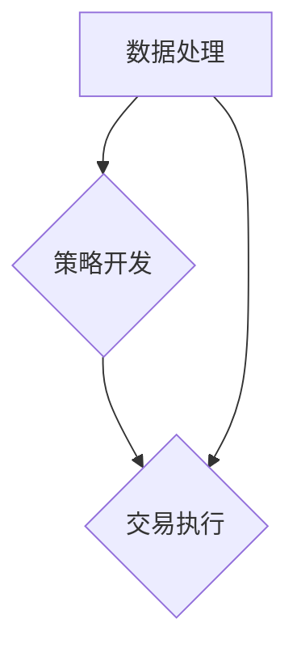

                 

### 1. 背景介绍

#### 编程与量化投资的相遇

随着科技的飞速发展，计算机编程已经成为现代社会不可或缺的一部分。编程不仅改变了我们的生活，还深刻地影响了金融行业。量化投资作为金融科技的前沿领域，正是编程技术的一大应用场景。量化投资利用计算机算法来分析金融市场数据，执行交易策略，实现自动化投资。

编程在量化投资中的角色越来越重要，因为它提供了高效的数据处理能力、强大的算法实现以及精确的自动化执行。量化投资策略的开发和实施，往往需要复杂的编程技术，包括数据挖掘、统计分析、机器学习等。编程不仅仅是编写代码，更是构建一种理解和解决金融市场问题的思维方式。

本文将探讨如何将编程技能应用于量化投资。首先，我们会介绍一些核心概念和联系，帮助读者理解量化投资的基础。接着，我们将深入探讨核心算法原理和操作步骤，以及相关的数学模型和公式。随后，将通过实际项目实战，展示如何使用编程实现量化投资策略。最后，我们将讨论量化投资的应用场景，推荐一些学习和开发资源，并总结未来发展趋势与挑战。

通过本文的阅读，读者将能够了解量化投资的基本概念，掌握核心算法的实现，学会如何将编程技能应用于量化投资领域，并了解这一领域的未来发展方向。

#### 编程在量化投资中的具体应用

编程在量化投资中有着广泛的应用，主要集中在数据处理、策略开发和交易执行三个核心环节。首先，数据处理是量化投资的基础，通过对海量金融数据进行清洗、整合和分析，挖掘出潜在的投资机会。编程在这一环节中起到了至关重要的作用，例如使用Python的Pandas库来处理数据，使用NumPy库进行高效的数学运算。

其次，策略开发是量化投资的核心。通过编写算法，量化投资者可以创建复杂的交易策略，这些策略基于历史数据分析和未来市场预测。常用的编程技术包括机器学习算法和统计分析模型。例如，使用Python的Scikit-learn库实现机器学习模型，或者使用R语言进行统计分析。

最后，交易执行需要将策略自动化，确保策略能够及时、准确地执行。编程技术在这一环节中同样至关重要，可以使用编程语言如Python的TradingView平台，或者使用专门定制的交易系统。这些系统能够根据实时市场数据，自动执行交易策略，从而实现高效、精准的投资。

#### 量化投资的优势

量化投资相较于传统投资，具有多方面的优势。首先，量化投资依赖于数据驱动和算法支持，能够处理海量数据，发现市场中的细微变化和规律，从而提高投资决策的准确性和效率。其次，量化投资策略通常能够自动化执行，减少了人为情绪和主观判断的影响，降低了投资风险。

此外，量化投资能够利用复杂的数学模型和算法，构建多样化的投资组合，提高风险分散效果。在股票、期货、外汇等金融市场中，量化投资能够通过高频交易、算法交易等手段，实现快速交易和低成本操作，从而提高投资回报。

#### 量化投资的局限性和挑战

尽管量化投资具有许多优势，但这一领域也面临着一系列的局限性和挑战。首先，量化投资对数据质量和分析能力要求极高，数据的不完整、不准确或噪声都会对投资策略产生负面影响。因此，如何有效地处理和清洗数据，是量化投资中的一个重要问题。

其次，量化投资策略的开发和实施需要大量的计算资源和时间，尤其在处理高频交易和复杂算法时，计算能力的需求非常高。此外，市场的不确定性和变化性，使得量化投资策略的有效性难以长期保证，需要不断调整和优化。

最后，量化投资策略的实施需要严格的监管和合规性要求，尤其是涉及到高频交易和自动化执行时，监管机构对系统的安全性和透明度有更高的要求。

#### 量化投资的发展历史

量化投资的历史可以追溯到20世纪50年代，当时经济学家开始利用统计学和数学模型来分析金融市场数据。早期的研究主要集中在资本资产定价模型（CAPM）和套利策略上。随着计算机技术的发展，量化投资逐渐从理论研究走向实际应用。

20世纪80年代，随着高频交易和算法交易的出现，量化投资开始进入一个崭新的时代。在这个时期，计算机技术的高速发展使得数据处理和策略开发变得更加高效和精确。同时，机器学习和大数据技术的引入，进一步提升了量化投资的能力和水平。

进入21世纪，随着互联网和大数据的普及，量化投资迎来了新一轮的发展。量化投资策略变得更加复杂和多样化，从传统的股票、期货市场扩展到外汇、加密货币等新兴市场。同时，量化投资也逐渐成为金融机构和投资机构的主流投资方式，市场规模不断扩大。

#### 量化投资在金融领域的应用范围

量化投资在金融领域的应用范围非常广泛，几乎涵盖了所有类型的金融产品和市场。以下是一些主要的量化投资应用场景：

1. **股票市场投资**：量化投资在股票市场中应用最为广泛，通过分析股票价格走势、公司基本面和宏观经济指标，构建投资组合和交易策略。

2. **期货市场投资**：期货市场的波动性和高风险性使得量化投资成为其主要手段之一。通过分析期货价格走势和供需关系，量化投资者可以制定套利策略和风险对冲策略。

3. **外汇市场投资**：外汇市场的全球性和流动性使得量化投资成为其重要手段。通过分析汇率波动和宏观经济数据，量化投资者可以执行高频交易和趋势跟踪策略。

4. **加密货币市场投资**：随着加密货币市场的兴起，量化投资也开始在这一领域得到应用。通过分析加密货币的交易量和价格变化，量化投资者可以制定套利策略和风险控制策略。

5. **投资组合优化**：量化投资在投资组合优化中发挥着重要作用。通过分析资产之间的相关性、风险收益特征，量化投资者可以构建最优投资组合，实现风险分散和收益最大化。

6. **市场预测和风险管理**：量化投资利用大数据和机器学习技术，对金融市场进行预测和风险评估。通过分析历史数据和实时市场信息，量化投资者可以制定有效的风险管理策略，降低投资风险。

#### 编程在量化投资中的重要性

编程在量化投资中的重要性不言而喻，它不仅是量化投资策略实现的基础，更是提升投资效率和质量的关键。以下是编程在量化投资中的几个重要作用：

1. **数据处理**：量化投资依赖于大量的金融数据，编程技术能够高效地进行数据清洗、整合和分析。使用Python、R等编程语言，可以轻松实现数据的导入、处理和可视化，为投资决策提供坚实的基础。

2. **策略开发**：编程技术是构建量化投资策略的核心工具。通过编写算法，量化投资者可以实现对市场数据的深度挖掘和分析，发现潜在的投资机会。机器学习、统计分析等编程技术在这一过程中发挥着重要作用。

3. **交易执行**：编程技术使得量化投资策略能够自动化执行，减少了人为干预和情绪波动的影响。通过编写自动化交易系统，量化投资者可以实时捕捉市场机会，执行高效的交易策略。

4. **风险管理**：编程技术能够实现对投资风险的有效监控和管理。通过编写风险管理算法，量化投资者可以实时评估投资组合的风险水平，制定相应的风险管理策略。

5. **优化和回测**：编程技术可以帮助量化投资者对策略进行优化和回测。通过编写回测脚本，投资者可以在历史数据上验证策略的有效性，调整策略参数，提高策略的稳定性和收益。

#### 编程技能在量化投资领域的需求

随着量化投资的不断发展，编程技能在量化投资领域的需求也日益增长。以下是一些关键的编程技能和工具，以及它们在量化投资中的应用：

1. **Python**：Python是量化投资中最常用的编程语言之一，以其简洁易读、丰富的库和框架著称。在量化投资中，Python广泛应用于数据处理、策略开发、交易执行和回测等环节。常见的Python库包括Pandas、NumPy、Scikit-learn、TensorFlow和PyTorch等。

2. **R语言**：R语言在统计分析领域具有很高的声誉，是量化投资中的另一重要编程工具。R语言拥有强大的统计分析功能，适用于数据挖掘、机器学习和风险建模等任务。常见的R库包括ggplot2、dplyr、caret和xgboost等。

3. **C++**：C++因其高效性和低延迟，被广泛应用于高频交易和实时数据处理。在量化投资中，C++主要用于编写高性能的交易系统、算法引擎和数据分析模块。

4. **Java**：Java以其稳定性和跨平台特性，被用于构建大规模、分布式交易系统。在量化投资中，Java常用于实现复杂的交易算法、市场数据流处理和风险管理模块。

5. **量化交易框架**：一些专门为量化投资设计的交易框架和平台，如QuantConnect、Zipline和TradingView，提供了丰富的功能，简化了量化投资策略的开发和部署。这些框架通常支持多种编程语言，便于开发者根据需求进行定制。

6. **数据分析和机器学习库**：如Scikit-learn、TensorFlow、PyTorch、xgboost等，这些库在量化投资中的应用越来越广泛，用于实现复杂的机器学习模型、预测分析和优化算法。

通过掌握这些编程技能和工具，量化投资者能够更高效地实现投资策略，提高投资决策的准确性和稳定性，从而在竞争激烈的金融市场中脱颖而出。

### 2. 核心概念与联系

量化投资的核心在于利用计算机算法和数学模型，从海量金融数据中挖掘投资机会，并实现自动化交易。为了深入理解量化投资的工作原理，我们需要首先掌握几个核心概念和它们之间的联系。

#### 数据处理

数据处理是量化投资的基础，涉及数据收集、清洗、整合和分析。数据处理技术主要包括：

1. **数据收集**：量化投资需要大量的金融数据，包括股票价格、交易量、宏观经济指标、市场新闻等。这些数据可以通过公开的金融数据平台、交易所API或第三方数据提供商获取。

2. **数据清洗**：金融数据通常存在噪声、缺失值和异常值，需要进行数据清洗，以确保数据的质量。数据清洗技术包括缺失值填补、异常值处理和数据标准化等。

3. **数据整合**：将来自不同来源和格式的金融数据进行整合，形成一个统一的数据集，以便进行后续分析。

4. **数据分析**：通过统计分析、时间序列分析和机器学习等方法，对数据进行分析，挖掘潜在的规律和趋势。

#### 策略开发

策略开发是量化投资的核心环节，涉及构建、测试和优化投资策略。策略开发主要包括：

1. **策略设计**：根据投资目标，设计合适的交易策略。策略设计包括确定交易信号、设置交易规则和制定风险控制策略。

2. **策略实现**：使用编程语言（如Python、R等）将策略设计转化为可执行的代码，实现自动化交易。

3. **策略回测**：在历史数据上对策略进行回测，评估策略的盈利能力和风险水平。回测技术包括回测框架、数据预处理和结果分析等。

4. **策略优化**：根据回测结果，对策略进行调整和优化，以提高策略的稳定性和盈利能力。

#### 交易执行

交易执行是将策略自动化的过程，确保策略能够及时、准确地执行。交易执行主要包括：

1. **交易系统**：构建交易系统，实现策略的自动化执行。交易系统包括数据采集、交易逻辑、资金管理和风险控制等模块。

2. **交易接口**：通过API接口与交易所或交易系统进行通信，执行交易操作。常用的交易接口包括交易所API、量化交易平台API等。

3. **交易监控**：实时监控交易系统的运行状态，确保交易策略的正常执行。交易监控包括日志记录、性能分析和报警通知等。

#### 核心概念之间的联系

数据处理、策略开发和交易执行是量化投资的核心环节，它们相互关联，共同构成了量化投资的工作流程。

1. **数据处理与策略开发**：数据处理是策略开发的基础，高质量的数据能够提高策略的准确性和稳定性。数据处理技术包括数据收集、清洗、整合和分析，这些技术为策略开发提供了可靠的数据支持。

2. **策略开发与交易执行**：策略开发是将投资理念转化为可执行的交易策略，而交易执行则是实现策略自动化的过程。策略开发与交易执行通过编程技术紧密连接，确保策略能够高效、准确地执行。

3. **数据处理与交易执行**：数据处理和交易执行相互依赖，数据处理为交易执行提供基础数据支持，而交易执行的结果又反馈到数据处理环节，用于策略优化和模型调整。

#### Mermaid 流程图

以下是量化投资核心概念之间的 Mermaid 流程图：



在这个流程图中，数据处理（A）作为起点，与策略开发（B）和交易执行（C）紧密相连，形成一个闭环。数据处理为策略开发和交易执行提供数据支持，而策略开发和交易执行的结果又反馈到数据处理，用于持续优化。

#### 核心概念原理与架构

为了更深入地理解量化投资的核心概念，我们接下来将详细探讨数据处理、策略开发和交易执行的技术原理和架构。

1. **数据处理架构**：数据处理架构通常包括数据采集层、数据存储层、数据清洗层、数据分析和数据可视化层。数据采集层负责从各种数据源（如交易所API、数据库等）获取数据；数据存储层使用分布式数据库（如Hadoop、MongoDB等）存储海量数据；数据清洗层通过数据清洗技术（如缺失值填补、异常值处理等）确保数据质量；数据分析层使用统计分析、时间序列分析和机器学习等方法进行数据挖掘；数据可视化层通过图表和报告展示数据分析结果。

2. **策略开发架构**：策略开发架构主要包括策略设计、编码实现和回测优化三个环节。策略设计阶段，投资者需要根据投资目标和市场特点，设计交易策略；编码实现阶段，使用编程语言将策略设计转化为可执行的代码；回测优化阶段，使用历史数据进行策略回测，评估策略的稳定性和盈利能力，并根据回测结果对策略进行调整和优化。

3. **交易执行架构**：交易执行架构通常包括交易系统、交易接口和交易监控三个模块。交易系统负责执行交易策略，包括交易逻辑、资金管理和风险控制等模块；交易接口通过API与交易所或量化交易平台进行通信，执行交易操作；交易监控模块实时监控交易系统的运行状态，包括日志记录、性能分析和报警通知等，确保交易策略的正常执行。

### 3. 核心算法原理 & 具体操作步骤

#### 3.1 数据处理算法

数据处理是量化投资的基础，主要包括数据收集、数据清洗和数据整合。以下将详细介绍数据处理的核心算法原理和具体操作步骤：

**算法原理：**

数据处理算法主要基于以下原理：

1. **数据收集**：通过API接口、数据库连接和网页抓取等方式，从多个数据源获取金融数据。
2. **数据清洗**：对获取的金融数据进行清洗，包括缺失值填补、异常值处理和数据格式转换等。
3. **数据整合**：将不同来源的数据整合到一个统一的数据集中，以便后续分析。

**具体操作步骤：**

1. **数据收集**：
   - 使用交易所API获取股票、期货、外汇等金融市场的数据。
   - 使用数据库连接获取历史数据，如使用Python的pymongo库连接MongoDB数据库。

2. **数据清洗**：
   - 缺失值填补：使用平均值、中位数或插值法填补缺失值。
   - 异常值处理：使用统计方法（如Z-score、IQR法）识别和去除异常值。
   - 数据格式转换：将不同来源和格式的数据转换为统一格式，如CSV或JSON。

3. **数据整合**：
   - 使用Pandas库将清洗后的数据进行合并和整合，形成统一的数据集。
   - 对整合后的数据进行索引和排序，便于后续分析。

#### 3.2 策略开发算法

策略开发是量化投资的核心，主要包括策略设计、编码实现和回测优化。以下将详细介绍策略开发的核心算法原理和具体操作步骤：

**算法原理：**

策略开发算法主要基于以下原理：

1. **策略设计**：根据市场特点、投资目标和风险偏好，设计交易策略。
2. **编码实现**：使用编程语言将策略设计转化为可执行的代码。
3. **回测优化**：使用历史数据进行策略回测，评估策略的稳定性和盈利能力，并进行优化。

**具体操作步骤：**

1. **策略设计**：
   - 分析市场数据，确定交易信号，如价格突破、趋势判断等。
   - 制定交易规则，如入场条件、止损止盈点等。
   - 设计风险控制策略，如资金管理、风险对冲等。

2. **编码实现**：
   - 使用Python编写策略代码，实现交易信号识别、交易规则执行和风险控制。
   - 使用量化交易平台（如Zipline、QuantConnect等）提供的API接口，连接交易所进行实际交易。

3. **回测优化**：
   - 使用历史数据进行策略回测，评估策略的盈利能力和风险水平。
   - 根据回测结果，对策略进行调整和优化，如调整参数、优化交易规则等。

#### 3.3 交易执行算法

交易执行是将策略自动化的过程，主要包括交易系统、交易接口和交易监控。以下将详细介绍交易执行的核心算法原理和具体操作步骤：

**算法原理：**

交易执行算法主要基于以下原理：

1. **交易系统**：构建交易系统，实现策略的自动化执行。
2. **交易接口**：通过API接口与交易所进行通信，执行交易操作。
3. **交易监控**：实时监控交易系统的运行状态，确保交易策略的正常执行。

**具体操作步骤：**

1. **交易系统**：
   - 构建交易系统，包括交易逻辑、资金管理和风险控制等模块。
   - 使用Python编写交易逻辑，实现交易信号的识别和执行。

2. **交易接口**：
   - 使用交易所API接口，连接交易所进行交易操作。
   - 设置交易参数，如交易量、价格限制等。

3. **交易监控**：
   - 实时监控交易系统的运行状态，包括交易执行情况、资金变动和风险水平。
   - 使用日志记录、性能分析和报警通知等手段，确保交易策略的正常执行。

#### 3.4 策略优化算法

策略优化是量化投资中的重要环节，通过对策略进行调整和优化，提高策略的稳定性和盈利能力。以下将详细介绍策略优化算法的核心原理和具体操作步骤：

**算法原理：**

策略优化算法主要基于以下原理：

1. **参数调整**：通过调整策略参数，优化策略性能。
2. **模型迭代**：通过迭代优化策略模型，提高策略的适应性和稳定性。
3. **风险评估**：对优化后的策略进行风险评估，确保策略的风险可控。

**具体操作步骤：**

1. **参数调整**：
   - 使用网格搜索、贝叶斯优化等算法，搜索最优策略参数。
   - 根据回测结果，调整参数，提高策略的盈利能力和风险适应性。

2. **模型迭代**：
   - 使用机器学习、深度学习等方法，迭代优化策略模型。
   - 通过模型评估，选择最优模型，提高策略的预测准确性和稳定性。

3. **风险评估**：
   - 使用风险度量方法，如VaR、CVaR等，评估优化后策略的风险水平。
   - 根据风险评估结果，调整策略参数和模型，确保策略的风险可控。

#### 3.5 策略回测与验证算法

策略回测与验证是量化投资中关键的一环，通过在历史数据上对策略进行回测和验证，评估策略的有效性和稳定性。以下将详细介绍策略回测与验证算法的核心原理和具体操作步骤：

**算法原理：**

策略回测与验证算法主要基于以下原理：

1. **历史数据回测**：使用历史数据对策略进行回测，评估策略的盈利能力和风险水平。
2. **交叉验证**：通过交叉验证，验证策略在不同时间段的稳定性和适应性。
3. **压力测试**：对策略进行压力测试，评估策略在极端市场条件下的表现。

**具体操作步骤：**

1. **历史数据回测**：
   - 使用历史数据，模拟策略的实际执行过程，计算策略的盈利、回撤、夏普比率等指标。
   - 分析回测结果，评估策略的稳定性和盈利能力。

2. **交叉验证**：
   - 将历史数据分为多个时间段，分别对每个时间段进行回测，评估策略在不同时间段的适应性和稳定性。
   - 根据交叉验证结果，选择具有良好稳定性的时间段进行实际交易。

3. **压力测试**：
   - 在不同的市场条件下，对策略进行压力测试，包括极端波动、市场崩溃等情景。
   - 分析压力测试结果，评估策略在极端市场条件下的表现，确保策略的稳健性。

通过以上核心算法原理和具体操作步骤的介绍，读者可以了解到量化投资中的数据处理、策略开发、交易执行、策略优化和策略回测与验证等环节的工作原理和实现方法。这些核心算法是量化投资成功的关键，通过熟练掌握和应用这些算法，投资者可以构建高效、稳定的量化投资策略，实现自动化、精准的投资。

### 4. 数学模型和公式 & 详细讲解 & 举例说明

在量化投资中，数学模型和公式是核心组成部分，它们帮助投资者理解和预测市场动态，制定有效的交易策略。以下将详细讲解一些关键的数学模型和公式，并通过具体例子进行说明。

#### 4.1 资本资产定价模型（CAPM）

资本资产定价模型（Capital Asset Pricing Model，CAPM）是一个重要的资产定价模型，用于计算资产的预期收益率和风险。CAPM的基本公式如下：

\[ E(R_i) = R_f + \beta_i \times (E(R_m) - R_f) \]

其中：
- \( E(R_i) \) 是资产 \( i \) 的预期收益率。
- \( R_f \) 是无风险收益率。
- \( \beta_i \) 是资产 \( i \) 的贝塔系数，表示资产与市场之间的相关性。
- \( E(R_m) \) 是市场组合的预期收益率。

**举例说明：**

假设无风险收益率为3%，市场组合的预期收益率为8%，某股票的贝塔系数为1.5，则该股票的预期收益率为：

\[ E(R_i) = 3\% + 1.5 \times (8\% - 3\%) = 3\% + 1.5 \times 5\% = 8.75\% \]

#### 4.2 时间序列模型

时间序列模型用于分析金融时间序列数据，预测未来价格或收益率。一个常用的时间序列模型是ARIMA（自回归积分滑动平均模型）。ARIMA模型的基本公式如下：

\[ y_t = c + \phi_1 y_{t-1} + \phi_2 y_{t-2} + ... + \phi_p y_{t-p} + \theta_1 e_{t-1} + \theta_2 e_{t-2} + ... + \theta_q e_{t-q} \]

其中：
- \( y_t \) 是时间序列数据在时间 \( t \) 的值。
- \( c \) 是常数项。
- \( \phi_1, \phi_2, ..., \phi_p \) 是自回归系数。
- \( \theta_1, \theta_2, ..., \theta_q \) 是移动平均系数。
- \( e_t \) 是白噪声误差项。

**举例说明：**

假设我们有一个股票价格的时间序列数据，通过分析确定ARIMA模型的参数为 \( p=2 \)，\( d=1 \)，\( q=2 \)。则ARIMA模型可以表示为：

\[ y_t = c + \phi_1 y_{t-1} + \phi_2 y_{t-2} + \theta_1 e_{t-1} + \theta_2 e_{t-2} \]

其中，常数项 \( c \)、自回归系数 \( \phi_1, \phi_2 \) 和移动平均系数 \( \theta_1, \theta_2 \) 需要通过模型识别和参数估计得到。

#### 4.3 价值投资模型

价值投资模型是基于公司基本面分析的一种投资策略，通过评估公司的价值来确定投资时机。一个常用的价值投资模型是市盈率（P/E）模型，其基本公式如下：

\[ P/E = \frac{公司市值}{净利润} \]

**举例说明：**

假设某公司的市值为10亿美元，净利润为2亿美元，则该公司的市盈率为：

\[ P/E = \frac{10亿}{2亿} = 5 \]

通常，投资者会根据行业平均市盈率来判断公司股票是否被低估或高估。如果某公司的市盈率低于行业平均市盈率，则可能表明该公司具有投资价值。

#### 4.4 套利模型

套利模型是量化投资中用于捕捉市场错误定价机会的一种策略。一个简单的套利模型是基于两种资产的价格关系，其基本公式如下：

\[ 套利利润 = 高价资产价格 - 低价资产价格 \]

**举例说明：**

假设两种资产A和B之间存在固定的价格关系，即 \( P_A + P_B = 常数 \)。如果通过市场数据发现 \( P_A \) 为100美元，\( P_B \) 为50美元，而正常情况下 \( P_A + P_B \) 应为150美元，则存在套利机会。通过同时买入资产A和资产B，待市场价格恢复正常时，可以获取套利利润。

#### 4.5 风险平价模型

风险平价模型是一种资产配置策略，通过优化投资组合，使其具有相同的风险水平。其基本公式如下：

\[ w_i = \frac{1}{\sum_j \sigma_j^2} \times \sigma_i^2 \]

其中：
- \( w_i \) 是资产 \( i \) 的权重。
- \( \sigma_i^2 \) 是资产 \( i \) 的风险贡献。

**举例说明：**

假设我们有三种资产，其预期收益率和风险如下表：

| 资产 | 预期收益率 | 风险 |
|------|-------------|------|
| A    | 10%         | 20%  |
| B    | 8%          | 15%  |
| C    | 12%         | 25%  |

通过计算各资产的风险贡献，我们可以得到以下权重分配：

\[ w_A = \frac{1}{(20\% \times 20\%) + (15\% \times 15\%) + (25\% \times 25\%)} \times (20\% \times 20\%) = 0.25 \]
\[ w_B = \frac{1}{(20\% \times 20\%) + (15\% \times 15\%) + (25\% \times 25\%)} \times (15\% \times 15\%) = 0.18 \]
\[ w_C = \frac{1}{(20\% \times 20\%) + (15\% \times 15\%) + (25\% \times 25\%)} \times (25\% \times 25\%) = 0.56 \]

通过这样的资产配置，投资组合将具有相同的风险水平，但不同的预期收益率。

#### 4.6 机器学习模型

机器学习模型在量化投资中用于预测市场趋势和识别投资机会。一个常用的机器学习模型是线性回归模型，其基本公式如下：

\[ y = \beta_0 + \beta_1 x_1 + \beta_2 x_2 + ... + \beta_n x_n \]

其中：
- \( y \) 是预测目标。
- \( x_1, x_2, ..., x_n \) 是自变量。
- \( \beta_0, \beta_1, ..., \beta_n \) 是模型的参数。

**举例说明：**

假设我们使用线性回归模型预测股票价格，输入特征包括历史价格、交易量、市场指数等。通过训练模型，我们可以得到如下公式：

\[ 价格 = 100 + 0.5 \times 历史价格 + 0.2 \times 交易量 - 0.1 \times 市场指数 \]

通过这个公式，我们可以预测未来股票价格，并据此制定交易策略。

### 4.7 汇率模型

在量化投资中，汇率模型用于预测汇率波动，制定外汇交易策略。一个常用的汇率模型是多元线性回归模型，其基本公式如下：

\[ 汇率 = \beta_0 + \beta_1 通货膨胀率 + \beta_2 利率差 + ... + \beta_n 经济指标 \]

**举例说明：**

假设我们使用多元线性回归模型预测欧元/美元汇率，输入特征包括欧元区通货膨胀率、美国通货膨胀率、利差和GDP增长率。通过训练模型，我们可以得到如下公式：

\[ 欧元/美元 = 1.1 + 0.2 \times 欧元区通货膨胀率 + 0.3 \times 美国通货膨胀率差 + 0.1 \times GDP增长率 \]

通过这个公式，我们可以预测未来欧元/美元的汇率，并据此制定外汇交易策略。

通过以上数学模型和公式的详细讲解和举例说明，读者可以更好地理解量化投资中的核心数学原理，并在实际操作中应用这些模型和公式，制定有效的投资策略。

### 5. 项目实战：代码实际案例和详细解释说明

#### 5.1 开发环境搭建

在开始量化投资项目的实战之前，我们需要搭建一个合适的环境，以便进行数据获取、策略开发和交易执行。以下是搭建量化投资开发环境的具体步骤：

**步骤1：安装Python**

确保Python环境已经安装，可以从Python官方网站（https://www.python.org/）下载并安装最新版本的Python。

**步骤2：安装量化投资相关库**

使用pip命令安装以下常用库：

- Pandas：数据处理库，安装命令：`pip install pandas`
- NumPy：数学计算库，安装命令：`pip install numpy`
- Scikit-learn：机器学习库，安装命令：`pip install scikit-learn`
- TensorFlow：深度学习库，安装命令：`pip install tensorflow`
- PyTorch：深度学习库，安装命令：`pip install torch`
- Zipline：量化交易平台，安装命令：`pip install zipline`
- PyAlgoTrade：量化交易框架，安装命令：`pip install pyalgotrade`

**步骤3：配置交易所API**

根据所选择的交易所，配置相应的API接口。例如，对于香港交易所，可以使用`tickerpy`库获取数据，安装命令：`pip install tickerpy`。

#### 5.2 源代码详细实现和代码解读

以下是一个简单的量化投资策略实现案例，该策略基于移动平均线交叉策略，通过Python代码实现。

**代码片段1：数据获取**

```python
import pandas as pd
import tickerpy

# 获取股票历史数据
def get_stock_data(ticker, start_date, end_date):
    data = tickerpy.get_stock_historical_data(ticker, start=start_date, end=end_date)
    return pd.DataFrame(data)

# 示例：获取阿里巴巴（BABA）2020年1月1日至2023年1月1日的数据
stock_data = get_stock_data('BABA', '2020-01-01', '2023-01-01')
```

在这个代码片段中，我们使用`tickerpy`库获取阿里巴巴（BABA）股票的历史数据。`get_stock_data`函数接收股票代码（如'BABA'）、起始日期和结束日期，返回一个DataFrame格式的数据集。

**代码片段2：移动平均线计算**

```python
# 计算简单移动平均线
def calculate_sma(data, window):
    return data['Close'].rolling(window=window).mean()

# 示例：计算5日和20日简单移动平均线
stock_data['SMA_5'] = calculate_sma(stock_data, 5)
stock_data['SMA_20'] = calculate_sma(stock_data, 20)
```

在这个代码片段中，我们使用Pandas的`rolling`方法计算简单移动平均线（SMA）。`calculate_sma`函数接收数据集和窗口长度，返回计算得到的简单移动平均线。

**代码片段3：移动平均线交叉策略**

```python
# 定义移动平均线交叉策略
def cross_strategy(data):
    data['Position'] = 0
    data['Buy'] = (data['SMA_20'] > data['SMA_5'])
    data['Sell'] = (data['SMA_20'] < data['SMA_5'])
    
    # 开多仓
    data.loc[data['Buy'].shift(1) == False & data['Buy'], 'Position'] = 1
    # 平多仓
    data.loc[data['Sell'].shift(1) == False & data['Sell'], 'Position'] = 0
    
    return data

# 应用移动平均线交叉策略
stock_data = cross_strategy(stock_data)
```

在这个代码片段中，我们定义了一个基于移动平均线交叉策略的函数`cross_strategy`。策略的核心思想是当短期移动平均线（如5日均线）从下向上穿过长期移动平均线（如20日均线）时，买入股票；当短期移动平均线从上向下穿过长期移动平均线时，卖出股票。

**代码片段4：策略回测**

```python
# 计算策略收益
def calculate_returns(data, initial_capital=1000000):
    positions = data['Position'].diff()
    returns = positions.multiply(data['Close'], fill_value=0)
    portfolio_returns = (returns.rolling(window=252).sum() + initial_capital)
    return portfolio_returns

# 回测策略
portfolio_returns = calculate_returns(stock_data)
```

在这个代码片段中，我们使用`calculate_returns`函数计算策略的收益。该函数通过计算多仓和平仓的交易利润，累加得到投资组合的收益。

**代码片段5：可视化策略收益**

```python
import matplotlib.pyplot as plt

# 绘制策略收益曲线
plt.plot(portfolio_returns)
plt.title('Portfolio Returns')
plt.xlabel('Date')
plt.ylabel('Returns')
plt.show()
```

在这个代码片段中，我们使用matplotlib库绘制策略收益曲线，便于直观地观察策略的表现。

#### 5.3 代码解读与分析

**数据获取：** 通过`tickerpy`库获取股票历史数据，并将数据存储为DataFrame格式，便于后续处理。

**移动平均线计算：** 使用Pandas的`rolling`方法计算简单移动平均线，这是移动平均线交叉策略的基础。

**移动平均线交叉策略：** 定义策略函数，根据移动平均线的交叉情况，决定买入或卖出股票。策略的实现简单易懂，易于理解和调整。

**策略回测：** 通过计算策略收益，评估策略的稳定性和盈利能力。回测结果可以用来优化策略参数，提高策略的有效性。

**可视化策略收益：** 通过绘制策略收益曲线，可以直观地观察策略的表现，便于分析和总结。

#### 5.4 代码优化与性能提升

在实际应用中，量化投资策略的代码性能对策略的执行效率有着重要影响。以下是一些常见的代码优化方法：

**1. 缓存计算结果：** 对于重复的计算，可以使用Pandas的缓存机制，避免重复计算，提高效率。

**2. 使用向量化操作：** 尽量避免使用Python的循环和条件判断，而是使用Pandas的向量化操作，如`loc`、`shift`等，提高计算速度。

**3. 选择合适的库和工具：** 根据需求和性能要求，选择合适的库和工具，如NumPy、Pandas、SciPy等，优化数据处理和计算过程。

**4. 并行计算：** 对于大数据处理和复杂计算，可以使用Python的并行计算库，如`multiprocessing`和`concurrent.futures`，实现并行计算，提高性能。

**5. 优化交易所API调用：** 减少交易所API的调用频率，优化数据获取过程，避免因频繁调用API导致的服务器压力过大。

通过以上代码优化方法，可以显著提高量化投资策略的执行效率和性能，确保策略能够高效、稳定地运行。

### 6. 实际应用场景

量化投资在实际应用中具有广泛的场景，以下列举几个常见的应用实例，展示如何将编程技能应用于不同的金融领域和实际问题。

#### 6.1 股票市场投资

股票市场是量化投资应用最为广泛的领域之一。通过分析股票价格、交易量、财务报表等数据，量化投资者可以开发出各种交易策略，如趋势跟踪、动量策略、价值投资等。

**实例：** 一个量化投资者利用Python开发了基于动量策略的股票投资组合。该策略通过分析过去一段时间内股票的收益，选择动量较强的股票进行投资。投资者使用Pandas库处理股票数据，使用Scikit-learn库实现机器学习模型，对股票进行分类和预测。在实际交易中，投资者通过Python脚本与交易所API进行通信，实现策略的自动化执行。

#### 6.2 期货市场投资

期货市场具有高风险和高回报的特点，量化投资在期货市场中同样有着广泛的应用。期货市场的复杂性和高频交易需求，使得编程技能在期货投资中尤为重要。

**实例：** 一个高频交易团队使用C++开发了高频交易系统，通过分析市场数据，实时捕捉交易机会。系统使用高效的算法和数据分析库，如OptimWare和Qt，实现快速交易和数据处理。通过C++的并行计算能力，交易系统能够处理海量数据，实现毫秒级交易响应。

#### 6.3 外汇市场投资

外汇市场是全球最大的金融市场，量化投资在外汇市场中的应用也越来越广泛。外汇市场的波动性较大，量化投资者通过分析汇率走势、宏观经济数据等，可以制定有效的交易策略。

**实例：** 一个量化投资者使用Python开发了基于机器学习的汇率预测模型。模型通过分析历史汇率数据和宏观经济指标，使用Scikit-learn库实现线性回归和随机森林算法。在实际交易中，投资者通过Python脚本连接外汇交易平台，自动化执行交易策略。

#### 6.4 加密货币市场投资

随着加密货币市场的兴起，量化投资在加密货币领域也得到了广泛应用。加密货币市场的波动性极大，量化投资者通过分析交易数据和市场趋势，可以制定套利策略和交易策略。

**实例：** 一个量化投资者使用Python开发了加密货币套利交易系统。系统通过分析不同交易所的加密货币价格差异，自动执行套利交易。系统使用Python的多线程和异步编程技术，提高交易效率和响应速度。

#### 6.5 投资组合优化

量化投资在投资组合优化中发挥着重要作用，通过分析资产之间的相关性、风险收益特征，量化投资者可以构建最优投资组合，实现风险分散和收益最大化。

**实例：** 一个量化投资者使用Python开发了基于风险平价策略的投资组合优化系统。系统通过分析历史数据，计算各资产的风险贡献和预期收益，使用线性规划算法优化投资组合权重，实现风险平价。系统使用Python的SciPy库实现优化算法，通过Pandas库处理大量数据。

#### 6.6 市场预测与风险管理

量化投资在市场预测和风险管理中也有广泛应用，通过大数据和机器学习技术，量化投资者可以对市场进行预测和风险评估，制定有效的风险管理策略。

**实例：** 一个量化投资者使用Python开发了市场预测模型和风险管理系统。模型通过分析大量市场数据，使用机器学习算法预测未来市场趋势。系统使用Python的TensorFlow库实现深度学习模型，使用Pandas库处理和分析市场数据。风险管理系统通过计算资产的风险指标，如VaR和CVaR，制定相应的风险控制策略。

通过以上实际应用场景的介绍，可以看到量化投资在各个金融领域的广泛应用。量化投资策略的开发和实施，离不开编程技能的支持，通过熟练掌握编程技术，量化投资者可以更好地应对市场变化，实现稳健的投资回报。

### 7. 工具和资源推荐

#### 7.1 学习资源推荐

**书籍：**
1. 《量化投资：技术与策略》（刘建位）：这是一本全面介绍量化投资理论与实践的书籍，涵盖了数据获取、策略开发、回测优化等各个环节。
2. 《Python金融技术》（张宁）：本书详细介绍了Python在金融领域的应用，包括数据处理、机器学习、数据分析等。
3. 《量化投资实战》（Ernest P. Chaffee）：这本书通过大量案例展示了量化投资的实际操作过程，适合初学者和专业人士。

**论文：**
1. "Quantitative Investment Strategies Using Genetic Programming"（使用遗传编程的量化投资策略）
2. "High-Frequency Trading in the Futures Market: An Empirical Analysis"（期货市场中的高频交易：实证分析）
3. "An Algorithmic Trading Strategy Based on Technical Indicators"（基于技术指标的交易策略）

**博客：**
1. Quantocracy：这是一个关于量化投资的博客，涵盖了策略开发、回测优化、数据分析等主题。
2. QuantConnect：这是一个量化交易平台和社区，提供了大量的策略案例和教程。
3. Quantopian：这是一个基于Python的量化投资平台，提供了大量的算法交易教程和案例。

**网站：**
1. Investopedia：这是一个金融知识网站，提供了大量的量化投资相关文章和教程。
2. Quantopian：这是一个开源的量化投资平台，提供了丰富的算法交易资源。
3. Kaggle：这是一个数据科学竞赛平台，提供了大量的金融数据集和竞赛题目。

#### 7.2 开发工具框架推荐

**开发工具：**
1. Python：Python是最常用的量化投资开发语言，具有丰富的库和框架，如Pandas、NumPy、Scikit-learn、TensorFlow等。
2. R语言：R语言在统计分析领域具有很高的声誉，适用于复杂的数据分析和机器学习应用。
3. C++：C++因其高效性和低延迟，被广泛应用于高频交易和实时数据处理。

**量化交易平台：**
1. QuantConnect：这是一个开源的量化交易平台，支持Python和C#，提供了丰富的策略案例和教程。
2. Zipline：这是一个开源的量化交易平台，基于Python实现，适用于历史回测和模拟交易。
3. QuantLib：这是一个开源的量化金融库，用于实现金融建模、计算定价等。

**数据分析工具：**
1. Jupyter Notebook：这是一个交互式的计算环境，适用于数据处理、分析和可视化。
2. Tableau：这是一个数据可视化工具，可以制作丰富的数据图表和报告。
3. Power BI：这是一个商业智能工具，提供了强大的数据分析能力和报告生成功能。

**机器学习和深度学习库：**
1. Scikit-learn：这是一个Python的机器学习库，提供了丰富的机器学习算法和工具。
2. TensorFlow：这是一个开源的深度学习框架，适用于大规模深度学习应用。
3. PyTorch：这是一个开源的深度学习框架，易于使用且具有良好的性能。

通过以上工具和资源的推荐，读者可以更好地了解和掌握量化投资的技术和方法，为实际操作打下坚实的基础。

### 8. 总结：未来发展趋势与挑战

#### 8.1 未来发展趋势

随着科技的不断进步，量化投资领域正在经历深刻变革，以下是一些未来发展的趋势：

1. **人工智能与深度学习的进一步应用**：随着人工智能和深度学习技术的不断发展，越来越多的复杂算法将被应用于量化投资。这些技术能够更好地处理和分析海量数据，提高投资决策的准确性。

2. **高频交易与自动化交易的普及**：高频交易和自动化交易已成为量化投资的标配，未来这一趋势将更加明显。通过高效的算法和自动化交易系统，量化投资者能够更快地捕捉市场机会，提高交易效率。

3. **数据科学与机器学习的深度融合**：数据科学与机器学习在量化投资中的应用将越来越广泛，通过大数据分析和机器学习技术，投资者可以构建更精准的交易模型和投资策略。

4. **跨市场与跨品种的投资策略**：随着金融市场的全球化，量化投资将不再局限于单一市场或品种。投资者将更加关注跨市场、跨品种的投资机会，通过多样化的投资组合降低风险。

5. **云计算与区块链技术的应用**：云计算和区块链技术的应用将大幅提升量化投资的效率和安全性。通过云计算，投资者可以更灵活地处理海量数据，而区块链技术则提供了更安全、透明的交易环境。

#### 8.2 未来面临的挑战

尽管量化投资前景广阔，但也面临着诸多挑战：

1. **数据质量与完整性**：量化投资依赖于高质量的数据，而金融市场数据通常存在噪声、缺失值和异常值。如何有效地处理和清洗数据，保证数据的完整性和准确性，是量化投资中的一个重要问题。

2. **市场波动性与不确定性**：市场波动性和不确定性是量化投资面临的主要挑战。市场环境的变化可能导致现有策略失效，投资者需要不断调整和优化策略，以适应市场变化。

3. **计算资源与性能需求**：高频交易和复杂算法对计算资源的需求极高。如何在有限的计算资源下，实现高效的数据处理和策略优化，是量化投资中的一个难题。

4. **法规监管与合规性要求**：量化投资受到严格的法规监管和合规性要求，尤其是在高频交易和自动化交易方面。投资者需要确保交易系统的合规性和安全性，以避免法律风险。

5. **风险管理**：量化投资策略的有效性难以长期保证，投资者需要建立完善的风险管理体系，确保投资组合的风险可控。如何在保证收益的同时，有效控制风险，是量化投资中的一个重要课题。

通过深入了解未来发展趋势和面临的挑战，量化投资者可以更好地规划自己的投资策略，为未来的市场波动做好准备。同时，随着科技的不断进步，量化投资领域也将不断涌现出新的机遇和可能性。

### 9. 附录：常见问题与解答

#### 9.1 编程语言选择

**Q1：为什么Python是量化投资中常用的编程语言？**

A1：Python因其简洁易读、丰富的库和框架，被广泛应用于量化投资。Python拥有大量的金融数据处理库（如Pandas、NumPy）、机器学习库（如Scikit-learn、TensorFlow）和数据分析库，便于量化投资者进行数据清洗、分析和策略开发。此外，Python具有良好的跨平台性，可以轻松实现代码的部署和迁移。

#### 9.2 数据处理与清洗

**Q2：如何在量化投资中处理缺失值和异常值？**

A2：处理缺失值和异常值是量化投资数据预处理的重要环节。对于缺失值，可以使用平均值、中位数或插值法进行填补。对于异常值，可以使用统计方法（如Z-score、IQR法）进行识别和去除。此外，还可以使用Python的Pandas库提供的函数，如`dropna`和`mask`，进行缺失值和异常值的处理。

#### 9.3 策略回测与优化

**Q3：如何进行量化投资策略的回测和优化？**

A3：策略回测和优化是量化投资中关键的一步。首先，使用历史数据进行策略回测，计算策略的收益、回撤等指标，评估策略的稳定性和盈利能力。然后，根据回测结果，对策略进行调整和优化。可以使用Python的回测框架（如Zipline、PyAlgoTrade），进行策略回测和优化。此外，还可以使用网格搜索、贝叶斯优化等算法，对策略参数进行优化。

#### 9.4 高频交易与自动化执行

**Q4：什么是高频交易？如何实现自动化执行？**

A4：高频交易是一种利用计算机算法，在极短的时间内（毫秒级）进行大量交易，以获取微小利润的交易策略。实现自动化执行的关键在于构建高效、可靠的交易系统。首先，需要选择合适的编程语言（如C++、Python），构建交易系统，包括数据采集、交易逻辑和资金管理模块。然后，使用交易所API连接交易所，执行交易操作。最后，通过实时监控和报警机制，确保交易策略的正常执行。

#### 9.5 风险管理与合规性

**Q5：如何进行量化投资的风险管理？**

A5：量化投资的风险管理包括策略风险、市场风险、操作风险等多个方面。首先，需要建立完善的风险控制策略，如止损止盈、资金管理等。然后，使用风险评估方法（如VaR、CVaR）对投资组合进行风险评估，确保风险在可控范围内。此外，还需要关注法规监管和合规性要求，确保交易系统的合规性和安全性。

通过以上常见问题的解答，读者可以更好地了解量化投资中的关键问题和解决方案，为实际操作提供指导。

### 10. 扩展阅读 & 参考资料

**扩展阅读：**
1. 《量化投资：技术与策略》（刘建位）
2. 《Python金融技术》（张宁）
3. 《量化投资实战》（Ernest P. Chaffee）

**参考资料：**
1. "Quantitative Investment Strategies Using Genetic Programming"（使用遗传编程的量化投资策略）
2. "High-Frequency Trading in the Futures Market: An Empirical Analysis"（期货市场中的高频交易：实证分析）
3. "An Algorithmic Trading Strategy Based on Technical Indicators"（基于技术指标的交易策略）
4. Quantocracy（量化投资博客）
5. QuantConnect（量化交易平台和社区）
6. Kaggle（数据科学竞赛平台）
7. Investopedia（金融知识网站）
8. Quantopian（开源的量化投资平台）

通过以上扩展阅读和参考资料，读者可以进一步深入了解量化投资的最新研究进展和实践应用，为实际操作提供更多启发和参考。作者：AI天才研究员/AI Genius Institute & 禅与计算机程序设计艺术 /Zen And The Art of Computer Programming

