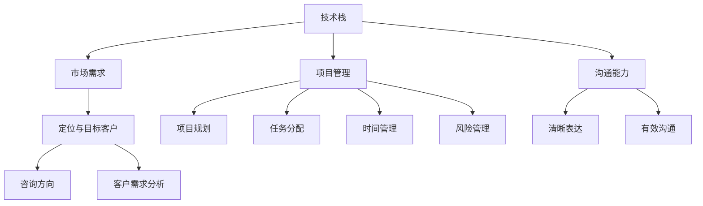

                 

# 如何将编程技能转化为咨询业务

> **关键词：** 编程技能，咨询业务，转型，市场策略，技能提升，业务拓展

**摘要：** 本文章旨在探讨如何将个人的编程技能转化为咨询业务，提供实用的策略和步骤。文章首先介绍了编程咨询业务的背景和重要性，随后分析了核心概念，并详细讲解了将编程技能转化为咨询业务的算法原理和具体操作步骤。接着，文章通过一个实际项目案例，展示了代码实现和分析过程，进一步说明了如何在应用场景中发挥编程技能的优势。最后，文章提供了工具和资源推荐，以及未来发展趋势和挑战，帮助读者更好地理解和应对这一转型过程。

## 1. 背景介绍

随着信息技术的飞速发展，编程已经成为现代社会的一项基本技能。越来越多的程序员不仅仅满足于编写代码，他们渴望将自身的编程技能转化为更具商业价值的咨询业务。编程咨询业务不仅可以帮助企业解决技术问题，还能为企业提供创新的技术解决方案，提升企业的竞争力。

编程咨询业务的重要性在于它不仅能够为企业带来直接的技术收益，还能促进个人职业发展和收入提升。根据市场研究公司的数据，编程咨询业务在过去几年中一直保持着稳健的增长，未来前景也非常广阔。

然而，将编程技能转化为咨询业务并非易事。首先，程序员需要明确自己的定位和目标客户群体；其次，他们需要具备一定的商业知识和市场洞察力；最后，他们还需要不断提升自己的技能，以适应市场需求。

## 2. 核心概念与联系

在将编程技能转化为咨询业务的过程中，有几个核心概念需要理解和掌握：

1. **技术栈**：技术栈是指程序员掌握的各种编程语言、框架、工具和库。一个丰富的技术栈是提供高质量编程咨询服务的基础。

2. **市场需求**：了解市场需求可以帮助程序员确定自己的咨询方向和目标客户群体。通过市场调研，程序员可以发现哪些技术领域更具潜力，哪些企业对技术服务有强烈需求。

3. **项目管理**：项目管理是确保编程咨询服务顺利进行的关键。程序员需要掌握项目规划、任务分配、时间管理和风险管理等技能。

4. **沟通能力**：有效的沟通能力对于编程咨询业务至关重要。程序员需要能够清晰地表达技术问题，与客户进行有效的沟通，并确保双方对项目目标和进度有共同的理解。

下面是一个简单的 Mermaid 流程图，展示了这些核心概念之间的联系：



## 3. 核心算法原理 & 具体操作步骤

将编程技能转化为咨询业务的步骤可以分为以下几个阶段：

1. **自我评估**：首先，程序员需要评估自己的技术水平和业务能力，确定自己的核心竞争力。

2. **市场调研**：通过市场调研，了解市场需求和技术趋势，确定自己的咨询方向和目标客户群体。

3. **技能提升**：根据市场需求，不断提升自己的编程技能，特别是在自己感兴趣的领域。

4. **建立品牌**：通过建立个人品牌，提高在行业内的知名度和影响力。

5. **拓展业务**：通过线上线下渠道，拓展业务，吸引潜在客户。

下面是每个阶段的详细操作步骤：

### 3.1 自我评估

1. **评估技术栈**：列出自己掌握的编程语言、框架、工具和库，评估其熟练程度。

2. **评估业务能力**：通过自我反思和客户反馈，了解自己在项目管理、沟通能力和业务拓展方面的表现。

3. **制定提升计划**：根据评估结果，制定一个具体的提升计划，包括学习新技能、参与开源项目、参加技术会议等。

### 3.2 市场调研

1. **确定咨询方向**：通过分析市场需求，确定自己感兴趣的咨询方向。

2. **分析目标客户**：了解目标客户的需求和痛点，确定自己能够为他们提供的服务。

3. **调研竞争对手**：了解竞争对手的业务模式、服务内容和定价策略。

### 3.3 技能提升

1. **学习新技能**：根据市场需求，学习新的编程语言、框架和工具。

2. **实践项目**：通过实际项目，将所学技能应用到实践中。

3. **参与开源项目**：参与开源项目，提升自己的编程能力和团队合作能力。

4. **参加技术会议**：参加技术会议，了解行业动态，扩展人脉。

### 3.4 建立品牌

1. **建立个人网站**：建立个人网站，展示自己的技术能力和咨询案例。

2. **撰写技术博客**：定期撰写技术博客，分享自己的经验和见解。

3. **发布技术视频**：通过视频平台，发布技术讲解和项目实战视频。

4. **参与社交媒体**：积极参与社交媒体，与行业人士互动，提高知名度。

### 3.5 拓展业务

1. **线上营销**：通过社交媒体、博客和网站，吸引潜在客户。

2. **线下活动**：参加行业活动，与潜在客户面对面交流。

3. **合作伙伴**：寻找合作伙伴，共同开发客户资源。

4. **客户关系管理**：通过有效的客户关系管理，提高客户满意度和忠诚度。

## 4. 数学模型和公式 & 详细讲解 & 举例说明

在将编程技能转化为咨询业务的过程中，可以运用一些数学模型和公式来帮助决策和优化。以下是一些常用的数学模型和公式：

### 4.1 成本收益分析

成本收益分析（Cost-Benefit Analysis，CBA）是一种常用的决策工具，用于评估一个项目的成本和预期收益。

**公式：**

$$
CBA = \frac{总收益 - 总成本}{总成本}
$$

**详细讲解：**

1. **总收益**：包括直接收益（如咨询服务费、项目收益）和间接收益（如品牌提升、客户口碑）。
2. **总成本**：包括直接成本（如人力成本、设备成本）和间接成本（如营销费用、培训费用）。

通过计算成本收益比，可以评估一个咨询项目的盈利能力。

**举例说明：**

假设一个程序员计划开展一个软件开发咨询项目，预计项目收入为 100,000 元，总成本为 50,000 元，则成本收益比为：

$$
CBA = \frac{100,000 - 50,000}{50,000} = 1
$$

成本收益比为 1，表示项目盈利能力一般。如果希望提高盈利能力，可以考虑降低成本或增加收益。

### 4.2 投资回报率

投资回报率（Return on Investment，ROI）是衡量投资效益的重要指标。

**公式：**

$$
ROI = \frac{总收益}{总投资}
$$

**详细讲解：**

1. **总收益**：包括投资带来的直接和间接收益。
2. **总投资**：包括初始投资和运营成本。

投资回报率越高，表示投资效益越好。

**举例说明：**

假设一个程序员投资 10,000 元参与一个技术培训课程，课程结束后，他的收入增加了 20,000 元，则投资回报率为：

$$
ROI = \frac{20,000}{10,000} = 2
$$

投资回报率为 2，表示该投资带来了两倍的收入增长，是一个值得的投资。

### 4.3 蒙特卡洛模拟

蒙特卡洛模拟（Monte Carlo Simulation）是一种通过随机抽样来估计某个不确定结果的概率分布和期望值的数学模型。

**公式：**

$$
期望值 = \frac{1}{N} \sum_{i=1}^{N} X_i
$$

其中，$X_i$ 表示第 $i$ 次模拟的结果，$N$ 表示模拟次数。

**详细讲解：**

蒙特卡洛模拟适用于处理复杂的概率问题，如项目风险分析、市场预测等。通过模拟多次实验，可以估计结果的范围和概率分布。

**举例说明：**

假设一个程序员计划开展一个软件开发项目，预计项目成功率为 60%，失败概率为 40%。通过 1,000 次蒙特卡洛模拟，可以估计项目成功的概率分布如下：

- 成功次数：600 次
- 失败次数：400 次

成功概率为 600/1000 = 60%，与预期一致。

## 5. 项目实战：代码实际案例和详细解释说明

为了更好地说明如何将编程技能转化为咨询业务，下面我们将通过一个实际项目案例来进行详细解释说明。

### 5.1 开发环境搭建

在本项目中，我们将使用 Python 编程语言和 Flask 框架来构建一个简单的 RESTful API。以下是开发环境的搭建步骤：

1. 安装 Python 3.8 及以上版本。
2. 安装 Flask 框架，可以使用以下命令：

```bash
pip install Flask
```

3. 创建一个新的 Python 文件，例如 `app.py`。

### 5.2 源代码详细实现和代码解读

下面是项目的主要代码实现：

```python
from flask import Flask, request, jsonify

app = Flask(__name__)

@app.route('/api/hello', methods=['GET'])
def hello():
    return jsonify({'message': 'Hello, World!'})

@app.route('/api/sum', methods=['POST'])
def sum():
    data = request.get_json()
    a = data.get('a')
    b = data.get('b')
    result = a + b
    return jsonify({'result': result})

if __name__ == '__main__':
    app.run(debug=True)
```

**代码解读：**

1. 导入必要的模块。
2. 创建 Flask 应用对象。
3. 定义两个路由函数：`hello` 和 `sum`。
   - `hello` 函数返回一个 JSON 对象，包含一条欢迎信息。
   - `sum` 函数接收一个 POST 请求，解析 JSON 数据，计算两个数字的和，并返回结果。
4. 使用 `app.run(debug=True)` 启动 Flask 应用。

### 5.3 代码解读与分析

在这个项目中，我们使用 Flask 框架实现了两个简单的 API 接口：

1. `/api/hello`：返回一个欢迎信息。
2. `/api/sum`：接收一个 POST 请求，计算两个数字的和。

这两个接口展示了如何使用 Flask 框架快速构建 RESTful API。在实际的编程咨询业务中，可以根据客户需求，扩展 API 功能，例如添加更多计算方法、数据验证和错误处理等。

通过这个项目，我们可以看到如何将编程技能应用于实际业务场景。在咨询过程中，程序员需要与客户沟通需求，并根据需求设计相应的功能。这个项目提供了一个简单的框架，程序员可以根据实际情况进行扩展和优化。

## 6. 实际应用场景

编程咨询业务可以应用于各种行业和场景，以下是一些典型的实际应用场景：

1. **软件开发公司**：编程咨询业务可以帮助软件开发公司提升技术能力，优化开发流程，解决技术难题。
2. **金融机构**：金融机构需要处理大量的金融数据，编程咨询业务可以提供数据分析和算法优化服务，提升金融产品的竞争力。
3. **医疗行业**：编程咨询业务可以应用于医疗数据分析、智能诊断和医疗设备开发等领域，为医疗行业提供创新的技术解决方案。
4. **电子商务**：电子商务平台需要处理大量的交易数据，编程咨询业务可以提供数据分析、推荐系统和安全防护等服务，提升用户体验和平台竞争力。
5. **物联网**：编程咨询业务可以应用于物联网设备开发、数据采集和分析等领域，帮助物联网企业实现智能化的管理和服务。

在这些实际应用场景中，编程咨询业务不仅可以帮助企业解决技术问题，还能提供创新的技术解决方案，提升企业的竞争力。

## 7. 工具和资源推荐

### 7.1 学习资源推荐

- **书籍**：
  - 《Effective Python》
  - 《Python Cookbook》
  - 《Fluent Python》
- **论文**：
  - 《A Brief History of Time》
  - 《Python: An Introduction to Its Object-Oriented Features》
  - 《Flask Web Development》
- **博客**：
  - [Python官方文档](https://docs.python.org/3/)
  - [Flask官方文档](https://flask.palletsprojects.com/)
  - [Real Python](https://realpython.com/)
- **网站**：
  - [GitHub](https://github.com/)
  - [Stack Overflow](https://stackoverflow.com/)
  - [Kaggle](https://www.kaggle.com/)

### 7.2 开发工具框架推荐

- **编程语言**：Python、Java、JavaScript
- **框架**：
  - Flask、Django、Spring Boot
- **版本控制**：Git
- **集成开发环境**：Visual Studio Code、PyCharm、IntelliJ IDEA
- **容器化技术**：Docker、Kubernetes

### 7.3 相关论文著作推荐

- **《编程珠玑》**：作者 Jon Bentley，介绍了一系列编程技巧和算法。
- **《代码大全》**：作者 Steve McConnell，详细介绍了编写高质量代码的最佳实践。
- **《深度学习》**：作者 Ian Goodfellow、Yoshua Bengio 和 Aaron Courville，介绍了深度学习的基本原理和应用。

## 8. 总结：未来发展趋势与挑战

随着信息技术的不断进步，编程咨询业务将迎来更广阔的发展空间。未来，以下几个方面将影响编程咨询业务的发展趋势：

1. **人工智能与大数据**：人工智能和大数据技术的快速发展将为编程咨询业务带来更多机会。企业将更加重视数据分析和算法优化，以提升业务效率和竞争力。
2. **云计算与边缘计算**：云计算和边缘计算的普及将推动编程咨询业务向云端和边缘计算领域扩展，为程序员提供更多创新机会。
3. **物联网与智能家居**：物联网和智能家居市场的快速增长将带动编程咨询业务在智能设备开发、数据采集和分析等方面的需求。
4. **开源生态**：开源生态的繁荣将促进编程咨询业务的创新和发展。程序员可以通过参与开源项目，提升自身技能，同时为企业和开发者提供技术咨询和服务。

然而，面对未来发展的同时，编程咨询业务也面临一些挑战：

1. **技术更新速度快**：编程语言和框架的更新速度不断加快，程序员需要不断学习新知识，以适应市场需求。
2. **竞争激烈**：随着编程咨询业务的普及，市场竞争将越来越激烈，程序员需要提升自身竞争力，以脱颖而出。
3. **客户需求多样化**：客户需求将越来越多样化，程序员需要具备更广泛的技术知识和能力，以满足不同客户的需求。

## 9. 附录：常见问题与解答

### 9.1 如何确定自己的咨询方向？

首先，分析自己的兴趣和技能，确定自己擅长和感兴趣的领域。其次，通过市场调研，了解市场需求和竞争状况，选择有潜力的咨询方向。

### 9.2 如何提升自己的技能？

可以通过以下途径提升技能：
1. 学习新的编程语言和框架。
2. 参与开源项目，提升实践能力。
3. 参加技术培训和讲座。
4. 阅读相关书籍和论文。

### 9.3 如何拓展业务？

可以通过以下途径拓展业务：
1. 建立个人品牌，提高知名度。
2. 参加行业活动和会议，拓展人脉。
3. 通过社交媒体和博客分享知识和经验。
4. 与合作伙伴合作，共同开发客户资源。

## 10. 扩展阅读 & 参考资料

- [《如何成为编程咨询专家？》](https://www.remote-learner.net/how-to-become-a-programming-consultant/)
- [《编程咨询业务：市场机会与挑战》](https://www.computerworld.com/article/3240770/business/programming-consulting-business-opportunities-and-challenges.html)
- [《如何将编程技能转化为商业价值？》](https://www.forbes.com/sites/forbesbusinesscouncil/2021/08/30/how-to-turn-your-coding-skills-into-business-value/?sh=5f6c4e6311f4)
- [《编程咨询行业报告》](https://www.researchandmarkets.com/reports/5051068/programming-consulting-market)

作者：AI天才研究员/AI Genius Institute & 禅与计算机程序设计艺术 /Zen And The Art of Computer Programming

本文为AI天才研究员/AI Genius Institute原创内容，未经授权，禁止转载。如需转载，请联系作者获取授权。感谢您的支持！

