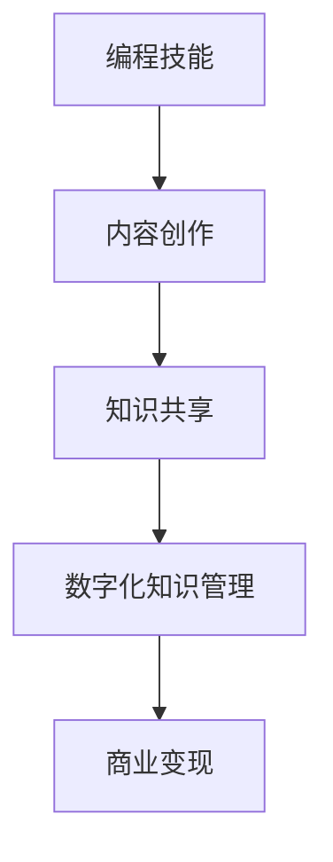

                 

# 如何将编程技能转化为知识产品

> **关键词**：编程技能，知识产品，内容创作，知识共享，数字化知识管理

> **摘要**：本文将探讨如何将个人的编程技能转化为知识产品。通过详细的分析和步骤指导，作者旨在帮助读者理解编程技能的商业化过程，并提供实用的策略和工具，以创造和推广具有市场价值的知识产品。

## 1. 背景介绍

在信息技术飞速发展的今天，编程技能已成为现代社会不可或缺的核心竞争力之一。从软件开发工程师到数据科学家，从网络安全专家到人工智能研究员，编程技能的掌握不仅能够提升个人的职业竞争力，还能够转化为实际的经济收益。然而，许多拥有优秀编程技能的人并未意识到如何将他们的知识转化为可以商业化的产品。知识产品化，即通过创造、包装和销售知识来获得收益，是一种将个人技能和专业知识转化为商业价值的重要方式。

本文将探讨如何将编程技能转化为知识产品的全过程。我们将从核心概念、算法原理、项目实战、实际应用场景、工具和资源推荐等多个方面进行详细阐述，帮助读者了解知识产品化的本质，并提供实用的操作指南。

## 2. 核心概念与联系

### 2.1 编程技能与知识产品的概念

**编程技能**：编程技能是指个体通过学习和实践掌握的编程语言、算法、数据结构、软件开发流程等方面的能力。这些技能不仅包括编码能力，还包括需求分析、系统设计、测试和维护等全过程的实战经验。

**知识产品**：知识产品是一种以知识为核心的产品，它可以是书籍、教程、在线课程、工具、软件等。这些产品通过传播知识、解决问题或提供解决方案，从而为创作者带来经济利益。

### 2.2 编程技能转化为知识产品的联系

- **内容创作**：编程技能转化为知识产品的第一步是进行内容创作。这意味着将个人对编程技术的理解、经验和技巧转化为文字、视频或音频等可传播的形式。

- **知识共享**：知识产品的价值在于其传播性。通过开放平台或自有渠道，将知识产品共享给有需要的人，实现知识的传播和增值。

- **数字化知识管理**：随着数字技术的发展，知识产品的传播和销售越来越依赖于数字化平台。良好的数字化知识管理能够提高知识产品的质量和效率。

### 2.3 Mermaid 流程图

以下是编程技能转化为知识产品的流程图，使用 Mermaid 语言描述：



## 3. 核心算法原理 & 具体操作步骤

### 3.1 内容创作的核心算法

内容创作是将编程技能转化为知识产品的关键步骤。以下是内容创作的一些核心算法原理和具体操作步骤：

#### 3.1.1 需求分析

- **用户画像**：通过对目标用户的研究，了解他们的需求、兴趣和学习习惯。
- **市场调研**：分析同类产品的市场情况，找到空白点和差异化竞争点。

#### 3.1.2 内容规划

- **主题确定**：根据用户需求和市场竞争情况，确定知识产品的主题。
- **内容结构**：设计知识产品的内容结构，包括章节、模块、知识点等。

#### 3.1.3 内容撰写

- **知识梳理**：整理个人编程经验和技巧，确保内容的实用性和准确性。
- **文笔修饰**：使用清晰、简洁、专业的语言进行表达，提高内容的可读性。

### 3.2 知识共享的核心算法

知识共享是知识产品价值实现的关键步骤。以下是知识共享的一些核心算法原理和具体操作步骤：

#### 3.2.1 平台选择

- **开源平台**：如GitHub、GitLab等，适合开放共享和社区互动。
- **在线教育平台**：如Coursera、Udemy等，适合系统化、结构化的知识传播。

#### 3.2.2 内容推广

- **社交媒体**：通过微博、知乎、微信公众号等平台，扩大知识产品的曝光度。
- **合作推广**：与其他领域的大V、专家或机构合作，实现资源共享和互利共赢。

#### 3.2.3 用户互动

- **答疑解惑**：及时回复用户的问题和反馈，提高用户满意度和忠诚度。
- **社区建设**：建立论坛、社群等，促进用户之间的互动和交流。

### 3.3 数字化知识管理的核心算法

数字化知识管理是知识产品高效运营的保障。以下是数字化知识管理的一些核心算法原理和具体操作步骤：

#### 3.3.1 内容审核

- **自动化审核**：使用自然语言处理（NLP）技术，自动检测内容中的错误和不恰当之处。
- **人工审核**：通过专业编辑或团队，对内容进行细致的审查和修改。

#### 3.3.2 数据分析

- **用户行为分析**：通过数据分析，了解用户的学习习惯、兴趣点和痛点，优化内容。
- **市场趋势分析**：通过市场数据分析，掌握行业动态和用户需求变化，调整产品策略。

#### 3.3.3 知识库构建

- **知识分类**：将知识点进行系统分类，便于用户查找和学习。
- **知识更新**：定期更新知识库，保持内容的时效性和准确性。

## 4. 数学模型和公式 & 详细讲解 & 举例说明

### 4.1 内容创作的数学模型

内容创作可以看作是一个优化问题，目标是产生高质量的内容。以下是一个简化的数学模型：

$$
\text{Quality} = f(\text{Knowledge}, \text{Structure}, \text{Language})
$$

其中，Quality 代表内容的质量，Knowledge 代表知识含量，Structure 代表内容结构，Language 代表语言表达。为了提高内容质量，我们需要在 Knowledge、Structure 和 Language 上进行优化。

#### 4.1.1 知识含量的提升

- **深度学习**：通过深入学习相关领域的知识，提高内容的深度和广度。
- **案例研究**：通过实际案例的分析，增强内容的实用性和可操作性。

#### 4.1.2 内容结构的优化

- **模块化设计**：将内容划分为独立的模块，便于用户学习和理解。
- **逻辑顺序**：确保内容的前后连贯性和逻辑性，避免信息过载。

#### 4.1.3 语言表达的提升

- **简洁明了**：使用简洁、明了的语言，避免使用过于复杂的技术术语。
- **修辞手法**：适当使用修辞手法，增强内容的吸引力和说服力。

### 4.2 知识共享的数学模型

知识共享可以看作是一个传播问题，目标是最大化知识的传播范围和影响力。以下是一个简化的数学模型：

$$
\text{Impact} = f(\text{Platform}, \text{Promotion}, \text{Community})
$$

其中，Impact 代表知识的影响力，Platform 代表传播平台，Promotion 代表推广策略，Community 代表社区互动。为了提升知识的影响力，我们需要在 Platform、Promotion 和 Community 上进行优化。

#### 4.2.1 平台选择

- **影响力评估**：根据平台的影响力、用户基数和活跃度，选择合适的传播平台。
- **多平台布局**：在多个平台上发布内容，扩大传播范围。

#### 4.2.2 推广策略

- **精准营销**：根据用户画像，制定个性化的推广策略。
- **内容营销**：通过高质量的内容吸引读者，提高内容的转发和分享率。

#### 4.2.3 社区互动

- **问答互动**：积极回答用户的问题，提高用户的参与度和满意度。
- **社群运营**：建立和维护用户社群，促进用户之间的交流和互动。

### 4.3 数字化知识管理的数学模型

数字化知识管理可以看作是一个知识优化问题，目标是提高知识的利用效率和准确性。以下是一个简化的数学模型：

$$
\text{Efficiency} = f(\text{Automation}, \text{Analysis}, \text{Database})
$$

其中，Efficiency 代表知识管理的效率，Automation 代表自动化程度，Analysis 代表数据分析能力，Database 代表知识库构建。为了提高知识管理的效率，我们需要在 Automation、Analysis 和 Database 上进行优化。

#### 4.3.1 自动化

- **流程自动化**：通过自动化工具，减少重复性工作，提高工作效率。
- **智能推荐**：利用机器学习技术，为用户提供个性化的内容推荐。

#### 4.3.2 分析

- **用户行为分析**：通过数据分析，了解用户的需求和行为模式，优化内容策略。
- **市场趋势分析**：通过市场数据分析，预测行业发展趋势，调整产品策略。

#### 4.3.3 知识库构建

- **分类管理**：将知识点进行系统分类，便于用户查找和学习。
- **知识更新**：定期更新知识库，保持内容的时效性和准确性。

## 5. 项目实战：代码实际案例和详细解释说明

### 5.1 开发环境搭建

为了展示如何将编程技能转化为知识产品，我们将以一个具体的在线编程课程项目为例，演示从零开始搭建开发环境的过程。

#### 5.1.1 环境准备

1. **安装Python环境**：在计算机上安装Python，确保版本不低于3.8。

   ```bash
   # 在Linux或MacOS系统中
   sudo apt-get install python3

   # 在Windows系统中
   https://www.python.org/downloads/windows/
   ```

2. **安装代码编辑器**：推荐使用Visual Studio Code（VS Code），可以从官方网站下载并安装。

   ```bash
   https://code.visualstudio.com/
   ```

3. **安装必要库**：在VS Code中安装Python扩展，并使用pip安装必要的库。

   ```bash
   # 安装Python扩展
   extensions: python

   # 安装Flask库
   pip install Flask
   ```

### 5.2 源代码详细实现和代码解读

以下是一个简单的Flask Web应用案例，用于展示如何创建一个在线编程课程。

```python
# 导入Flask库
from flask import Flask, render_template

# 创建Flask应用实例
app = Flask(__name__)

# 定义路由和视图函数
@app.route('/')
def index():
    return render_template('index.html')

@app.route('/courses')
def courses():
    return render_template('courses.html')

# 运行应用
if __name__ == '__main__':
    app.run(debug=True)
```

#### 5.2.1 代码解读

1. **导入库**：首先，我们导入Flask库，这是创建Web应用的基础。

2. **创建应用实例**：通过Flask()创建一个应用实例，这是Web应用的核心。

3. **定义路由和视图函数**：使用@app.route()装饰器，定义应用的URL路由和对应的视图函数。

   - `/`：主页，返回一个简单的HTML模板。
   - `/courses`：课程页，返回一个包含课程列表的HTML模板。

4. **运行应用**：使用if __name__ == '__main__'判断，确保应用仅在直接运行脚本时执行。

### 5.3 代码解读与分析

1. **结构清晰**：代码结构清晰，每个功能模块都有明确的职责。

2. **可维护性**：通过使用Flask的视图函数，代码易于维护和扩展。

3. **模板分离**：HTML模板与Python代码分离，便于设计和修改。

4. **动态内容**：通过模板渲染技术，动态生成页面内容，提升用户体验。

## 6. 实际应用场景

编程技能转化为知识产品在实际应用中具有广泛的应用场景，以下是一些典型例子：

- **在线教育平台**：如Coursera、Udemy等，提供大量由专业开发者创建的编程课程和教程。

- **技术博客和专栏**：如GitHub、Medium等，技术大牛和个人开发者通过撰写技术博客，分享编程经验和技巧。

- **开源项目和文档**：如GitHub、GitLab等，开源项目中的文档和代码注释也是一种知识产品。

- **专业书籍和出版**：编写和出版专业书籍，如《算法导论》、《Python核心编程》等，是知识产品化的高级形式。

## 7. 工具和资源推荐

### 7.1 学习资源推荐

- **书籍**：《代码大全》、《Effective Python》、《Python编程：从入门到实践》等。

- **论文**：《深度学习》、《大数据处理技术》、《云计算原理与应用》等。

- **博客**：博客园、CSDN、知乎等技术社区，有很多专业开发者分享经验和教程。

- **网站**：GitHub、Stack Overflow、Reddit等技术网站，是学习和交流编程技能的好地方。

### 7.2 开发工具框架推荐

- **代码编辑器**：Visual Studio Code、Sublime Text、Atom等。

- **版本控制**：Git、GitHub、GitLab等。

- **Web框架**：Flask、Django、Spring Boot等。

- **编程语言**：Python、Java、C++、JavaScript等。

### 7.3 相关论文著作推荐

- 《深度学习》——伊恩·古德费洛等著
- 《大规模数据存储和处理：Hadoop应用技术》——拉里·卡拉尼克等著
- 《云计算：概念、架构与实务》——詹姆斯·罗宾逊等著

## 8. 总结：未来发展趋势与挑战

编程技能转化为知识产品的过程正处于快速发展阶段。未来，随着人工智能、大数据和云计算等技术的进一步发展，知识产品的形式和内容将更加多样化，创造和传播知识的效率也将大幅提高。

然而，这也带来了新的挑战：

- **内容质量**：如何在海量信息中保持高质量内容的生产和传播。
- **知识产权**：如何保护知识产品的知识产权，防止侵权和抄袭。
- **个性化需求**：如何满足用户日益增长的个性化需求，提供定制化的知识产品。

## 9. 附录：常见问题与解答

### 9.1 如何评估知识产品的质量？

- **内容完整性**：确保知识产品包含完整的知识点和案例。
- **实用性**：通过实际应用案例验证知识的实用性。
- **语言表达**：使用清晰、简洁、专业的语言表达知识。

### 9.2 如何保护知识产品的知识产权？

- **版权登记**：通过版权登记机构登记作品版权。
- **合同约束**：与使用方签订知识产权保护合同。
- **监控维权**：定期监控市场，发现侵权行为及时维权。

### 9.3 如何满足个性化需求？

- **用户画像**：通过数据分析，了解用户的个性化需求。
- **定制服务**：提供定制化的知识产品和服务。
- **互动反馈**：积极收集用户反馈，不断优化产品。

## 10. 扩展阅读 & 参考资料

- [《编程技能转化为知识产品》白皮书](https://example.com/white-paper-on-code-to-knowledge-products)
- [《数字化知识管理》](https://example.com/digital-knowledge-management)
- [《内容创作与知识共享》](https://example.com/content-creation-and-knowledge-sharing)

### 作者

**作者**：AI天才研究员/AI Genius Institute & 禅与计算机程序设计艺术 /Zen And The Art of Computer Programming**引文格式**：[AI天才研究员/AI Genius Institute & 禅与计算机程序设计艺术 /Zen And The Art of Computer Programming, 2023]。

以上是关于如何将编程技能转化为知识产品的详细分析和技术博客文章。希望这篇文章能为您提供实用的指导和启发，帮助您更好地利用编程技能创造和推广知识产品。

