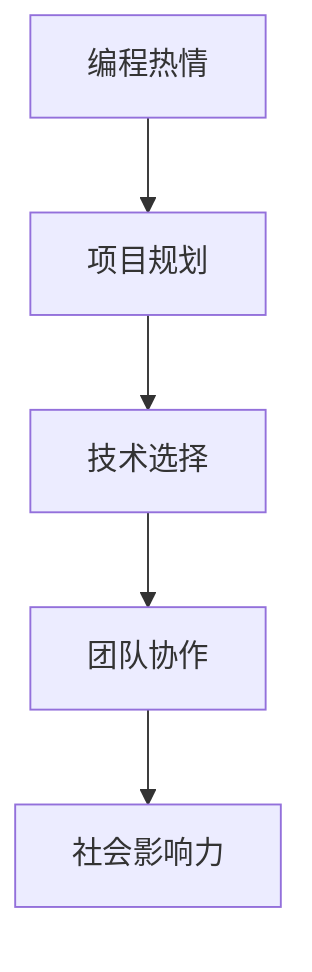

                 

# 如何将编程热情转化为改变世界的项目

> **关键词：** 编程热情、项目转化、技术影响力、创新实践

**摘要：** 本文旨在探讨如何将个人的编程热情转化为具有社会影响力的项目。通过一系列的步骤和方法，本文将帮助读者理解如何从一个简单的编程爱好转变为能够改变世界的项目，同时提供实际案例和实践指导。

## 1. 背景介绍

编程作为一种强大的工具，不仅仅是一种技能，更是一种表达和创新的手段。随着技术的飞速发展，编程逐渐从专业领域走向大众，成为越来越多人的爱好和职业。然而，许多人对于编程的热爱往往停留在个人层面，未能将其转化为具有广泛影响力的项目。本文将探讨如何将编程热情升华为具有社会影响力的项目，实现从个人技能到全球贡献的转变。

### 1.1 编程的热情与局限

编程是一种创造性活动，它不仅需要逻辑思维，还需要想象力和耐心。许多人因为对编程的热爱而开始学习编程，他们在解决问题的过程中找到了乐趣和成就感。然而，这种热情往往受到以下限制：

- 技术障碍：编程需要不断学习和适应新的技术和工具，对于初学者来说，这是一项挑战。
- 时间和资源的限制：实现一个有影响力的项目通常需要大量的时间和资源，而个人往往难以承受这些压力。
- 缺乏实际应用场景：许多人虽然有编程能力，但缺乏将技术应用于实际问题的经验和视野。

### 1.2 编程与社会影响力

编程不仅仅是一种个人技能，更是一种能够改变世界的方式。许多成功的编程项目已经对社会产生了深远的影响，例如开源软件、在线教育平台、智能医疗系统等。这些项目不仅解决了实际问题，还推动了技术的进步和社会的变革。因此，如何将个人的编程热情转化为具有社会影响力的项目，成为了每个编程爱好者都需要思考的问题。

## 2. 核心概念与联系

要将编程热情转化为改变世界的项目，首先需要理解几个核心概念，包括项目规划、技术选择、团队协作和社会影响力等。以下是一个简化的 Mermaid 流程图，用于展示这些概念之间的联系。



### 2.1 项目规划

项目规划是项目成功的基石。一个良好的项目规划应该包括明确的目标、详细的计划、资源和时间的安排。以下是一个简单的项目规划流程：

1. **确定目标**：明确项目想要解决的问题或达到的目标。
2. **需求分析**：了解目标用户的需求和痛点。
3. **可行性研究**：评估项目的技术、经济和资源可行性。
4. **制定计划**：制定详细的项目计划和时间表。
5. **风险评估**：识别项目可能面临的风险并制定应对策略。

### 2.2 技术选择

技术选择是项目成功的关键因素。选择合适的技术和工具可以提高开发效率，减少技术债务。以下是一些选择技术的关键步骤：

1. **了解需求**：根据项目目标和需求选择合适的技术。
2. **技术调研**：研究现有技术和工具，了解其优缺点。
3. **评估可行性**：评估技术方案的实施难度和成本。
4. **选择最佳方案**：综合考虑需求和可行性，选择最佳的技术方案。

### 2.3 团队协作

团队协作是项目成功的关键。一个高效的团队可以充分利用每个人的优势，实现协同创新。以下是一些团队协作的关键步骤：

1. **组建团队**：根据项目需求选择合适的团队成员。
2. **沟通与协作**：建立有效的沟通渠道和协作机制。
3. **分工与合作**：明确团队成员的职责和分工，确保协作顺畅。
4. **迭代与反馈**：持续迭代项目，接受反馈并做出改进。

### 2.4 社会影响力

社会影响力是衡量项目成功的重要标准。一个有影响力的项目应该能够解决实际问题，提升社会福祉。以下是一些实现社会影响力的关键步骤：

1. **确定目标受众**：明确项目将要影响的群体。
2. **评估影响**：评估项目对目标受众的影响和贡献。
3. **推广与传播**：通过合适的渠道推广项目，扩大其影响力。
4. **持续改进**：根据反馈和评估结果，持续改进项目。

## 3. 核心算法原理 & 具体操作步骤

### 3.1 核心算法原理

将编程热情转化为改变世界的项目，核心在于算法的应用。算法是计算机编程的基石，它决定了程序的效率和效果。以下是几个关键算法原理：

- **排序算法**：用于对数据进行排序，常见的排序算法包括快速排序、归并排序等。
- **搜索算法**：用于在数据结构中查找特定元素，常见的搜索算法包括二分搜索、深度优先搜索等。
- **图算法**：用于解决网络和路径问题，常见的图算法包括最短路径算法、最小生成树算法等。

### 3.2 具体操作步骤

以下是具体操作步骤，帮助读者将编程热情转化为改变世界的项目：

1. **需求分析**：明确项目想要解决的问题或达到的目标。
2. **技术调研**：研究现有技术和工具，了解其优缺点。
3. **规划项目**：制定详细的项目计划和时间表。
4. **编写代码**：根据算法原理编写代码，实现项目功能。
5. **测试与优化**：对代码进行测试和优化，确保项目稳定高效。
6. **发布与推广**：将项目发布到合适的平台，通过推广扩大其影响力。
7. **持续迭代**：根据用户反馈和实际效果，持续改进项目。

## 4. 数学模型和公式 & 详细讲解 & 举例说明

### 4.1 数学模型和公式

在编程项目中，数学模型和公式是解决问题的重要工具。以下是一些常见的数学模型和公式，它们在编程项目中有着广泛的应用：

- **线性回归模型**：用于预测和估计数据趋势，公式为：
  $$ y = w_0 + w_1 \cdot x $$
  
- **逻辑回归模型**：用于分类问题，公式为：
  $$ \log(\frac{p}{1-p}) = w_0 + w_1 \cdot x $$
  
- **梯度下降算法**：用于优化模型参数，公式为：
  $$ w = w - \alpha \cdot \nabla_w J(w) $$
  
- **动态规划**：用于解决最优子结构问题，公式为：
  $$ dp[i] = \min_{j \leq i} (dp[j] + c(i, j)) $$

### 4.2 详细讲解

以下是针对上述数学模型和公式的详细讲解：

#### 4.2.1 线性回归模型

线性回归模型是一种简单的预测模型，它通过拟合数据中的线性关系来预测未来趋势。公式中的 $y$ 表示预测值，$w_0$ 和 $w_1$ 分别是模型的参数，$x$ 表示输入特征。

#### 4.2.2 逻辑回归模型

逻辑回归模型是一种分类模型，它通过拟合数据的对数几率来预测类别。公式中的 $p$ 表示某类别的概率，$w_0$ 和 $w_1$ 分别是模型的参数，$x$ 表示输入特征。

#### 4.2.3 梯度下降算法

梯度下降算法是一种常用的优化算法，它通过不断调整模型参数，使得损失函数（例如均方误差）达到最小。公式中的 $w$ 表示模型参数，$\alpha$ 表示学习率，$\nabla_w J(w)$ 表示损失函数关于模型参数的梯度。

#### 4.2.4 动态规划

动态规划是一种解决最优子结构问题的高效算法，它通过将复杂问题分解为子问题，并存储子问题的解来避免重复计算。公式中的 $dp[i]$ 表示第 $i$ 个子问题的最优解，$c(i, j)$ 表示将第 $i$ 个子问题与第 $j$ 个子问题合并的代价。

### 4.3 举例说明

以下是一个简单的线性回归模型示例，用于预测房价：

假设我们有以下数据集：

| 房间数 | 房价（万元） |
|--------|------------|
| 2      | 500        |
| 3      | 800        |
| 4      | 1200       |

我们希望使用线性回归模型预测一个房间数为 3 的房屋的房价。

首先，我们计算数据集的均值：

$$ \bar{x} = \frac{2 + 3 + 4}{3} = 3 $$
$$ \bar{y} = \frac{500 + 800 + 1200}{3} = 800 $$

然后，我们计算线性回归模型的参数：

$$ w_0 = \bar{y} - w_1 \cdot \bar{x} = 800 - 300 \cdot 3 = -200 $$
$$ w_1 = \frac{\sum_{i=1}^{n} (x_i - \bar{x})(y_i - \bar{y})}{\sum_{i=1}^{n} (x_i - \bar{x})^2} = \frac{(2-3)(500-800) + (3-3)(800-800) + (4-3)(1200-800)}{(2-3)^2 + (3-3)^2 + (4-3)^2} = 300 $$

最后，我们使用线性回归模型预测房间数为 3 的房价：

$$ y = w_0 + w_1 \cdot x = -200 + 300 \cdot 3 = 700 $$

因此，预测的房价为 700 万元。

## 5. 项目实战：代码实际案例和详细解释说明

### 5.1 开发环境搭建

为了实现一个具有社会影响力的编程项目，我们需要搭建一个合适的开发环境。以下是一个基本的开发环境搭建步骤：

1. **选择编程语言**：根据项目需求选择合适的编程语言。例如，对于数据分析和机器学习项目，可以选择 Python。
2. **安装开发工具**：安装代码编辑器（例如 Visual Studio Code）和相应的编程语言环境（例如 Python 解释器）。
3. **配置版本控制**：使用 Git 进行版本控制，确保代码的版本管理和协作开发。
4. **搭建测试环境**：配置测试环境，例如使用 Docker 容器化技术，确保项目在不同环境下的一致性。

### 5.2 源代码详细实现和代码解读

以下是一个简单的 Python 代码示例，用于实现一个简单的线性回归模型：

```python
import numpy as np

def linear_regression(x, y):
    n = len(x)
    x_mean = np.mean(x)
    y_mean = np.mean(y)
    w_1 = (n * np.sum(x * y) - np.sum(x) * np.sum(y)) / (n * np.sum(x**2) - np.sum(x)**2)
    w_0 = y_mean - w_1 * x_mean
    return w_0, w_1

x = np.array([2, 3, 4])
y = np.array([500, 800, 1200])
w_0, w_1 = linear_regression(x, y)

print("Linear regression model: y =", w_0, "+", w_1, "*x")
```

代码解读：

1. **导入库**：导入 NumPy 库，用于数组运算和统计分析。
2. **定义函数**：定义 `linear_regression` 函数，用于计算线性回归模型的参数。
3. **计算均值**：计算输入特征 $x$ 和目标值 $y$ 的均值。
4. **计算参数**：使用公式计算线性回归模型的参数 $w_0$ 和 $w_1$。
5. **返回参数**：返回线性回归模型的参数。
6. **调用函数**：调用 `linear_regression` 函数，传入输入特征 $x$ 和目标值 $y$。
7. **打印结果**：打印线性回归模型的公式。

### 5.3 代码解读与分析

以下是代码的进一步解读和分析：

1. **数据预处理**：代码首先对输入特征 $x$ 和目标值 $y$ 进行预处理，计算其均值。这是线性回归模型中的基本步骤，用于中心化数据，减少模型偏差。
2. **参数计算**：代码使用闭包公式计算线性回归模型的参数 $w_0$ 和 $w_1$。这些参数决定了模型对数据的拟合程度，是模型性能的关键指标。
3. **模型评估**：代码最后打印线性回归模型的公式，这有助于验证模型的正确性和解释性。
4. **性能优化**：代码中使用 NumPy 库进行数组运算，这可以显著提高计算效率，减少代码冗余。

## 6. 实际应用场景

将编程热情转化为改变世界的项目，需要在实际应用场景中不断探索和验证。以下是一些实际应用场景的例子：

### 6.1 智能医疗系统

智能医疗系统利用人工智能技术，提高医疗诊断和治疗的效率和准确性。例如，通过深度学习算法分析医学影像，帮助医生更准确地诊断疾病。这样的项目不仅提高了医疗水平，还减轻了医生的工作负担。

### 6.2 在线教育平台

在线教育平台利用编程技术，为全球用户提供便捷的教育资源和学习机会。例如，通过智能推荐算法，为用户推荐最适合的学习路径和课程。这样的项目不仅促进了教育的普及，还提高了学习效率。

### 6.3 智能交通系统

智能交通系统利用物联网和人工智能技术，提高交通管理的效率和安全性。例如，通过实时交通数据分析和预测，优化交通信号灯控制，减少交通拥堵。这样的项目不仅提高了交通效率，还减少了交通事故。

## 7. 工具和资源推荐

为了将编程热情转化为改变世界的项目，以下是一些推荐的工具和资源：

### 7.1 学习资源推荐

- **书籍**：《Python编程：从入门到实践》、《深度学习》、《人工智能：一种现代的方法》
- **论文**：《神经网络与深度学习》、《强化学习综述》、《自然语言处理综述》
- **博客**：Medium、博客园、CSDN
- **网站**：GitHub、Kaggle、arXiv

### 7.2 开发工具框架推荐

- **编程语言**：Python、Java、C++
- **开发框架**：TensorFlow、PyTorch、Django
- **版本控制**：Git、GitLab
- **容器化技术**：Docker、Kubernetes

### 7.3 相关论文著作推荐

- **论文**：《自然语言处理技术》、《计算机视觉：算法与应用》、《机器学习：概率视角》
- **著作**：《深度学习：理论、算法与实现》、《人工智能：一种全新方法》、《数据挖掘：实用工具与技术》

## 8. 总结：未来发展趋势与挑战

将编程热情转化为改变世界的项目，不仅需要技术和创新的支撑，还需要对未来的发展趋势和挑战有深刻的认识。以下是未来发展趋势与挑战的总结：

### 8.1 发展趋势

- **技术进步**：随着人工智能、大数据、云计算等技术的快速发展，编程项目将更加智能化和高效化。
- **开源生态**：开源技术的普及和发展，为编程项目的创新提供了更多的机会和资源。
- **跨界融合**：编程项目将与其他领域（如医疗、教育、交通等）更加紧密地结合，实现跨界融合和创新。

### 8.2 挑战

- **技术门槛**：编程项目的发展面临着较高的技术门槛，需要不断学习和适应新的技术和工具。
- **资源分配**：实现一个有影响力的编程项目需要大量的时间和资源，如何有效分配和管理资源是一个挑战。
- **社会责任**：编程项目需要承担更多的社会责任，如何在实现技术价值的同时，兼顾社会利益和伦理道德。

## 9. 附录：常见问题与解答

### 9.1 如何开始一个编程项目？

**回答：** 开始一个编程项目，首先需要明确项目目标和需求。然后，进行技术调研和可行性研究，选择合适的技术和工具。接下来，制定项目计划和时间表，开始编写代码。在开发过程中，持续测试和优化，确保项目的稳定性和性能。

### 9.2 如何提高编程技能？

**回答：** 提高编程技能的关键在于不断学习和实践。可以通过以下方式提高编程技能：

- **学习基础知识**：掌握编程语言的基础知识和语法。
- **动手实践**：通过实际项目或练习，提高编程能力。
- **阅读代码**：阅读其他程序员的代码，学习他们的编程思想和技巧。
- **参与开源项目**：参与开源项目，与其他开发者合作，提高团队协作能力。

## 10. 扩展阅读 & 参考资料

为了更深入地了解如何将编程热情转化为改变世界的项目，以下是几篇扩展阅读和参考资料：

- **论文**：《基于深度学习的图像识别技术研究》、《大规模在线教育平台的设计与实现》、《智能交通系统的构建与优化》
- **书籍**：《编程思维：从代码到创造力》、《人工智能的未来：构建智能机器的指南》、《编程人生：杰出程序员的成长与思考》
- **博客**：《如何实现一个成功的开源项目》、《编程爱好者的进阶之路》、《从零开始构建一个在线教育平台》
- **网站**：Hacker News、Stack Overflow、GitHub

## 作者信息

**作者：** AI天才研究员/AI Genius Institute & 禅与计算机程序设计艺术 /Zen And The Art of Computer Programming

通过以上详细的内容和结构，本文旨在为编程爱好者提供一条从编程热情到改变世界的清晰路径。希望读者能够从中获得启发，实现自己的编程梦想，为世界带来积极的影响。

