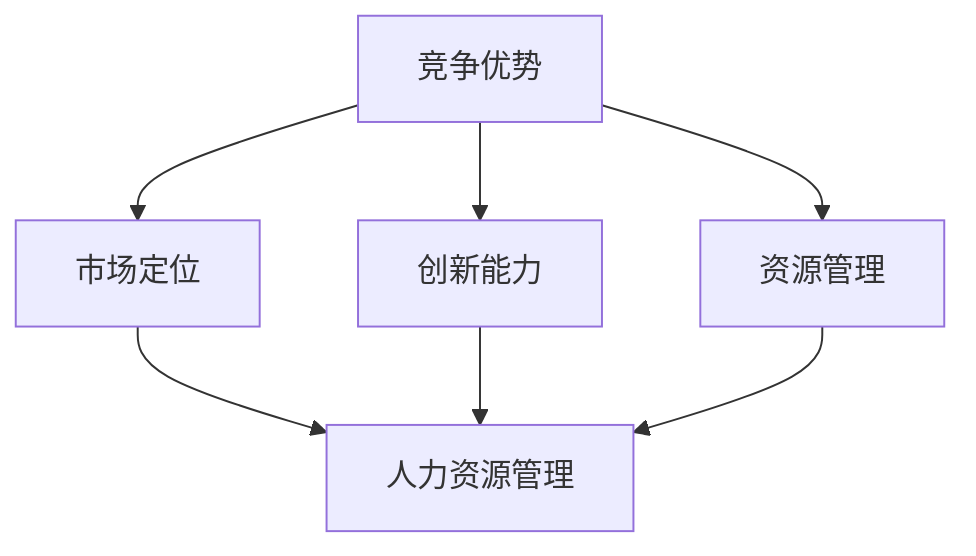

                 

## 1. 背景介绍

在当今这个信息爆炸、竞争激烈的时代，如何应对竞争、保持竞争优势和取得成功，已经成为企业和个人亟待解决的重要问题。无论是在商业领域还是技术领域，竞争无处不在。对于企业而言，如何在激烈的市场竞争中脱颖而出，实现可持续发展，是每个企业都需要思考的问题。对于个人而言，如何在职业生涯中保持领先地位，不断取得成功，同样是一个挑战。

### 竞争的本质

首先，我们需要明确竞争的本质。竞争是一种相互作用的过程，参与竞争的各方在争夺资源、市场、地位等方面产生冲突。竞争既有积极的方面，比如激发创新、提高效率，也有消极的方面，比如资源浪费、道德沦丧。因此，理解和应对竞争，首先要从其本质出发。

### 竞争的类型

竞争可以分为多种类型，包括直接竞争和间接竞争、良性竞争和恶性竞争等。直接竞争是指竞争者直接争夺同一市场或资源，如市场上的两家企业争夺同一客户群体。间接竞争则是竞争者通过间接的方式争夺市场或资源，如通过技术创新来提高市场占有率。良性竞争是指竞争者在竞争中互相激励、共同进步，恶性竞争则是竞争者采取不正当手段进行竞争，损害对方利益。

### 竞争的影响

竞争对企业和个人都有深远的影响。对于企业而言，竞争可以促使企业提高产品质量、降低成本、创新技术，从而在市场中占据有利地位。然而，过度的竞争也可能导致资源浪费、市场动荡，对企业产生负面影响。对于个人而言，竞争可以促使个人不断学习、提升技能，从而在职业生涯中取得成功。但过度的竞争也可能导致心理压力、焦虑等问题。

### 竞争的应对策略

为了应对竞争，企业和个人需要采取一系列策略。首先，企业需要明确自身的竞争优势，如品牌、技术、服务等方面，并不断巩固和提升这些优势。其次，企业需要关注市场需求，及时调整战略，以适应市场变化。对于个人而言，个人需要不断提升自己的专业技能和综合素质，以应对职场竞争。

### 文章目的

本文旨在探讨如何应对竞争，保持竞争优势和取得成功。我们将从企业和个人两个方面进行分析，提供一系列实用的策略和方法，帮助读者在竞争中脱颖而出，实现持续发展。

### 文章结构

本文将分为以下几个部分：

1. 竞争的本质与类型
2. 竞争对企业的影响与应对策略
3. 竞争对个人的影响与应对策略
4. 成功案例分析
5. 总结与展望

接下来，我们将逐一探讨这些内容。

<|assistant|>## 2. 核心概念与联系

在探讨如何应对竞争之前，我们需要明确一些核心概念，并了解它们之间的联系。这些核心概念包括竞争优势、市场定位、创新能力、资源管理、人力资源管理等。

### 竞争优势

竞争优势是指企业在市场中相对于竞争对手所具有的明显优势。竞争优势可以是多方面的，包括品牌影响力、产品质量、价格优势、技术创新、渠道优势等。一个企业要能够在激烈的市场竞争中脱颖而出，就必须具备明显的竞争优势。

### 市场定位

市场定位是指企业根据自身优势和市场需求，确定自己在市场中的位置和角色。正确的市场定位有助于企业明确目标客户群体，制定合适的营销策略，从而在市场中占据有利地位。

### 创新能力

创新能力是企业保持竞争优势的关键。一个企业要想在竞争激烈的市场中立于不败之地，就必须具备强大的创新能力，不断推出新产品、新技术，满足市场需求。

### 资源管理

资源管理是指企业对各种资源进行有效配置和管理，以实现最大化效益。资源包括人力资源、物资资源、资金资源等。有效的资源管理有助于企业降低成本、提高效率，从而在市场竞争中占据优势。

### 人力资源

人力资源管理是指企业对员工进行招聘、培训、激励、考核等一系列管理活动。优秀的人力资源管理能够提升员工满意度，提高工作效率，为企业创造更大价值。

### Mermaid 流程图

为了更直观地展示这些核心概念之间的联系，我们可以使用Mermaid流程图来表示。



### 概念之间的关系

从Mermaid流程图中可以看出，竞争优势是整个流程的核心，它直接影响市场定位、创新能力、资源管理和人力资源管理。市场定位决定了企业如何面对市场需求，创新能力则决定了企业在产品和技术上的竞争力。资源管理则确保企业能够有效地利用各种资源，为创新和竞争优势提供支持。人力资源管理则是企业竞争力的基石，优秀的人力资源管理能够激发员工的创造力和工作热情，为企业发展提供源源不断的动力。

### 总结

通过明确这些核心概念及其联系，我们可以更好地理解如何应对竞争。在接下来的内容中，我们将深入探讨如何具体实现这些概念，以保持竞争优势和取得成功。

<|assistant|>## 3. 核心算法原理 & 具体操作步骤

为了在竞争中保持优势，我们需要一套系统的策略和方法。这些策略和方法可以被视为一种“核心算法”，它指导我们在不同竞争场景中做出最优决策。下面我们将详细阐述这些核心算法的原理和具体操作步骤。

### 3.1 竞争分析算法

#### 原理

竞争分析算法旨在帮助企业了解市场竞争状况，识别竞争对手的优势和弱点，从而制定相应的策略。这个算法的核心在于数据的收集、分析和解读。

#### 步骤

1. **数据收集**：收集与市场相关的各种数据，包括市场份额、消费者行为、价格趋势、技术创新等。

2. **数据分析**：使用数据挖掘和统计分析技术，对收集到的数据进行分析，识别市场趋势和竞争对手的行为模式。

3. **解读**：根据分析结果，识别竞争对手的优势和弱点，为企业制定策略提供依据。

### 3.2 市场定位算法

#### 原理

市场定位算法的核心在于确定企业产品或服务的市场位置，以最大化市场份额和利润。这个算法需要综合考虑市场需求、消费者偏好、竞争对手定位等因素。

#### 步骤

1. **市场研究**：了解目标市场的基本情况，包括市场规模、增长潜力、消费者需求等。

2. **竞争对手分析**：分析竞争对手的市场定位，识别其优势和劣势。

3. **定位策略制定**：根据市场研究和竞争对手分析结果，确定企业产品或服务的市场定位。

4. **策略实施**：根据市场定位策略，制定具体的营销和推广计划。

### 3.3 创新能力提升算法

#### 原理

创新能力提升算法旨在通过系统化的创新管理，提高企业的创新能力。这个算法的核心在于激发员工的创造力，并建立有效的创新流程。

#### 步骤

1. **创新文化建立**：营造鼓励创新的企业文化，激发员工的创新热情。

2. **创新机制设计**：建立创新机制，包括创新项目立项、资源分配、评估和奖励等。

3. **创新培训**：定期进行创新培训，提升员工的创新技能。

4. **创新实践**：鼓励员工在实际工作中运用创新思维，不断优化产品和服务。

### 3.4 资源管理算法

#### 原理

资源管理算法的核心在于优化资源的配置和使用，以最大化企业的效益。这个算法需要综合考虑资源类型、资源利用率、资源成本等因素。

#### 步骤

1. **资源识别**：识别企业所拥有的各种资源，包括人力资源、物资资源、资金资源等。

2. **资源评估**：评估各种资源的利用率和成本效益。

3. **资源优化**：通过优化资源配置和使用方式，提高资源利用率。

4. **资源监控**：建立资源监控体系，实时跟踪资源使用情况，及时调整资源策略。

### 3.5 人力资源管理算法

#### 原理

人力资源管理算法的核心在于通过有效的招聘、培训、激励和考核，提高员工的满意度和工作效率。这个算法需要综合考虑员工需求、企业目标、市场竞争等因素。

#### 步骤

1. **招聘策略制定**：根据企业目标和市场需求，制定招聘策略。

2. **培训计划制定**：根据员工技能需求和企业发展需要，制定培训计划。

3. **激励机制设计**：建立激励机制，激励员工积极工作，提高工作效率。

4. **考核体系建立**：建立科学合理的考核体系，评估员工绩效。

### 总结

以上核心算法的原理和具体操作步骤，为我们提供了一套系统的方法，帮助企业在竞争中保持优势。在实际应用中，企业需要根据自身情况和市场环境，灵活运用这些算法，持续优化和调整策略，以应对不断变化的竞争局面。

<|assistant|>## 4. 数学模型和公式 & 详细讲解 & 举例说明

在应对竞争的过程中，数学模型和公式可以为我们提供量化的分析和指导。以下我们将介绍几个常用的数学模型和公式，并详细讲解其原理和实际应用。

### 4.1 SWOT分析模型

#### 原理

SWOT分析模型是一种常用的战略规划工具，用于评估企业的优势（Strengths）、劣势（Weaknesses）、机会（Opportunities）和威胁（Threats）。通过这个模型，企业可以全面了解自身状况，制定相应的竞争策略。

#### 公式

SWOT分析 = {优势 + 劣势} × {机会 + 威胁}

#### 详细讲解

- **优势（Strengths）**：企业内部的优势，如品牌知名度、创新能力、人力资源等。
- **劣势（Weaknesses）**：企业内部的劣势，如管理漏洞、技术水平不足等。
- **机会（Opportunities）**：外部市场环境中的机会，如市场增长、技术进步等。
- **威胁（Threats）**：外部市场环境中的威胁，如竞争对手的崛起、市场动荡等。

通过SWOT分析，企业可以明确自身的优势和劣势，抓住市场机会，应对潜在威胁。

#### 举例说明

假设一家企业正在进行SWOT分析，得出以下结论：

- 优势：品牌知名度高、技术创新能力强。
- 劣势：管理经验不足、部分产品线过于单一。
- 机会：市场增长迅速、新技术不断涌现。
- 威胁：竞争对手实力增强、市场政策变化。

根据这些分析结果，企业可以制定以下策略：

- **利用优势**：加大品牌宣传力度，提升品牌知名度；继续投入研发，保持技术创新。
- **克服劣势**：加强管理层培训，提升管理水平；拓展产品线，降低单一产品线风险。
- **抓住机会**：积极参与市场增长，开拓新市场；紧跟新技术，提升产品竞争力。
- **应对威胁**：密切关注竞争对手动态，加强内部竞争能力；了解政策变化，及时调整战略。

### 4.2 成本效益分析模型

#### 原理

成本效益分析模型用于评估企业一项决策的成本和收益，帮助企业做出理性决策。这个模型的关键在于计算成本效益比（C/B），并与其他方案进行比较。

#### 公式

成本效益比（C/B）= 成本（C）/ 收益（B）

#### 详细讲解

- **成本（C）**：实施某项决策所需的总成本，包括直接成本和间接成本。
- **收益（B）**：实施某项决策后预期的总收益，包括直接收益和间接收益。

成本效益比越高，说明这项决策的性价比越高。

#### 举例说明

假设一家企业有两个投资项目A和B，相关数据如下：

- 项目A：成本100万元，预期收益200万元。
- 项目B：成本50万元，预期收益100万元。

计算两个项目的成本效益比：

- 项目A：成本效益比 = 100 / 200 = 0.5
- 项目B：成本效益比 = 50 / 100 = 0.5

尽管两个项目的成本效益比相同，但项目A的预期收益更高，因此企业应优先考虑项目A。

### 4.3 马尔可夫模型

#### 原理

马尔可夫模型是一种概率模型，用于描述系统在连续时间段内状态转移的概率。在竞争分析中，马尔可夫模型可以用来预测市场占有率的变化。

#### 公式

状态转移概率矩阵 P = {Pij}

其中，Pij 表示从状态 i 转移到状态 j 的概率。

#### 详细讲解

- **状态（State）**：系统所处的状态，如市场份额。
- **转移概率（Transition Probability）**：从一个状态转移到另一个状态的概率。

通过计算状态转移概率矩阵，我们可以预测系统在不同时间点的状态。

#### 举例说明

假设市场上有两个企业A和B，初始市场份额分别为40%和60%。根据市场调研，得出以下状态转移概率矩阵：

```
|      | A    | B    |
|------|------|------|
| A    | 0.6  | 0.4  |
| B    | 0.2  | 0.8  |
```

表示企业A保持市场份额的概率为60%，转移到企业B的概率为40%；企业B保持市场份额的概率为80%，转移到企业A的概率为20%。

通过计算，可以预测在第n个时间段后，两个企业的市场份额。

### 总结

通过数学模型和公式的应用，我们可以更科学地分析和应对竞争。在实际操作中，需要根据具体情况进行模型的选择和应用，以最大化竞争优势。同时，这些模型和公式也需要不断调整和优化，以适应不断变化的市场环境。

<|assistant|>## 5. 项目实战：代码实际案例和详细解释说明

为了更好地理解如何将上述核心算法和数学模型应用于实际项目，我们将以一个简单的在线购物平台项目为例，详细讲解项目的开发环境搭建、源代码实现、代码解读与分析。

### 5.1 开发环境搭建

在进行项目开发之前，我们需要搭建一个合适的开发环境。以下是项目的开发环境搭建步骤：

1. **安装操作系统**：选择一个适合的操作系统，如Windows、macOS或Linux。本文以Linux为例。
2. **安装编程语言**：选择一个合适的编程语言，如Python、Java或JavaScript。本文以Python为例，安装Python 3.8及以上版本。
3. **安装数据库**：选择一个合适的数据库，如MySQL、PostgreSQL或MongoDB。本文以MySQL为例，安装MySQL 8.0及以上版本。
4. **安装Web服务器**：选择一个合适的Web服务器，如Apache、Nginx或Tomcat。本文以Nginx为例，安装Nginx 1.18及以上版本。
5. **安装相关库和工具**：安装项目所需的第三方库和工具，如Django、Flask、PyMySQL等。

### 5.2 源代码详细实现和代码解读

接下来，我们将以Python的Django框架为例，实现一个简单的在线购物平台。

#### 5.2.1 模型设计

首先，我们需要设计数据库模型。以下是一个简单的购物平台模型：

```python
from django.db import models

class Category(models.Model):
    name = models.CharField(max_length=100)

class Product(models.Model):
    category = models.ForeignKey(Category, on_delete=models.CASCADE)
    name = models.CharField(max_length=100)
    price = models.DecimalField(max_digits=6, decimal_places=2)
    description = models.TextField()

class Order(models.Model):
    customer = models.CharField(max_length=100)
    products = models.ManyToManyField(Product)
    total_price = models.DecimalField(max_digits=6, decimal_places=2)

class OrderItem(models.Model):
    order = models.ForeignKey(Order, on_delete=models.CASCADE)
    product = models.ForeignKey(Product, on_delete=models.CASCADE)
    quantity = models.PositiveIntegerField()
    price = models.DecimalField(max_digits=6, decimal_places=2)
```

**代码解读**：

- **Category**：表示商品类别，包含类别名称。
- **Product**：表示商品，包含类别（ForeignKey）、商品名称、价格和描述。
- **Order**：表示订单，包含客户名称、多个商品（ManyToManyField）和总价格。
- **OrderItem**：表示订单中的具体商品项，包含订单（ForeignKey）、商品（ForeignKey）、数量和价格。

#### 5.2.2 视图设计

接下来，我们设计视图函数，处理用户请求：

```python
from django.shortcuts import render
from .models import Product, Category

def index(request):
    categories = Category.objects.all()
    products = Product.objects.all()
    return render(request, 'index.html', {'categories': categories, 'products': products})

def product_detail(request, product_id):
    product = Product.objects.get(id=product_id)
    return render(request, 'product_detail.html', {'product': product})

def order_create(request):
    # 处理订单创建逻辑
    pass
```

**代码解读**：

- **index**：返回首页，展示所有类别和商品。
- **product_detail**：返回商品详情页，展示指定商品的信息。
- **order_create**：处理订单创建逻辑（此处省略具体实现）。

#### 5.2.3 模板设计

最后，我们设计前端模板，用于展示页面内容：

```html
<!-- index.html -->
<!DOCTYPE html>
<html>
<head>
    <title>在线购物平台</title>
</head>
<body>
    <h1>在线购物平台</h1>
    <div>
        
            <h2>{{ category.name }}</h2>
            
                <div>
                    <h3>{{ product.name }}</h3>
                    <p>价格：{{ product.price }}</p>
                    <p>描述：{{ product.description }}</p>
                    <a href="">查看详情</a>
                </div>
            
        
    </div>
</body>
</html>

<!-- product_detail.html -->
<!DOCTYPE html>
<html>
<head>
    <title>{{ product.name }}</title>
</head>
<body>
    <h1>{{ product.name }}</h1>
    <p>价格：{{ product.price }}</p>
    <p>描述：{{ product.description }}</p>
</body>
</html>
```

**代码解读**：

- **index.html**：展示所有类别和商品信息。
- **product_detail.html**：展示单个商品的信息。

### 5.3 代码解读与分析

通过上述代码实现，我们可以看到如何利用Django框架快速搭建一个简单的在线购物平台。以下是对关键代码段的分析：

1. **模型设计**：使用Django ORM定义数据库模型，实现数据关系管理。
2. **视图设计**：通过定义视图函数，处理用户请求并返回相应页面。
3. **模板设计**：使用模板语言，实现前端页面展示。

在这个项目中，我们利用了Django框架提供的功能，如ORM、视图、模板等，简化了开发过程。同时，通过设计合理的数据库模型，实现了数据关系的规范化和管理。在实际项目中，我们可以根据需求进一步扩展功能，如添加用户认证、购物车、订单管理等功能。

### 总结

通过这个项目实战，我们了解了如何将理论应用于实际开发。在开发过程中，我们需要根据实际需求进行设计和优化，确保系统的稳定性和扩展性。同时，我们也学会了如何利用Django框架快速搭建一个简单的在线购物平台。

<|assistant|>## 6. 实际应用场景

在了解了如何应对竞争、保持竞争优势和取得成功的基本策略和方法后，我们来看一些具体的实际应用场景，以便更好地理解这些策略在现实情况中的具体应用。

### 6.1 企业市场竞争

在激烈的企业市场竞争中，企业需要不断分析市场动态，识别竞争对手的优势和弱点，制定相应的策略。例如，一家电商企业可以通过SWOT分析，识别自身的优势（如品牌影响力、用户基数大）和劣势（如物流成本高、库存管理难），并抓住市场机会（如新市场开拓、电商节日促销）和应对威胁（如竞争对手促销、政策变化）。基于这些分析，企业可以制定具体的策略，如优化物流网络、提高库存周转率、加大市场推广力度等。

### 6.2 个人职业发展

在个人职业发展中，保持竞争优势同样重要。个人需要不断学习和提升技能，以适应不断变化的市场需求。例如，一名软件工程师可以通过参加技术研讨会、阅读专业书籍、在线课程等方式，持续提升自己的编程技能和项目经验。同时，个人还可以通过建立个人品牌、参与开源项目、撰写技术博客等方式，增加自己的行业影响力。这样，在职场竞争中，个人就能够脱颖而出，获得更好的职业发展机会。

### 6.3 创业

对于创业者来说，应对竞争和保持优势尤为重要。在创业初期，创业者需要通过市场调研，了解市场需求和潜在竞争对手，确定自己的创业方向。例如，一家初创公司可以通过分析市场，发现用户对某个领域的需求较高，但现有产品存在不足，从而开发出更加满足用户需求的产品。此外，创业者还需要关注资金、人才、市场推广等资源的管理，确保创业项目的顺利推进。

### 6.4 现实案例分析

以下是一个现实生活中的案例分析，以展示如何应对竞争、保持竞争优势和取得成功。

#### 案例一：阿里巴巴的电商布局

阿里巴巴在电商领域的竞争中，通过不断创新和优化，成功保持了竞争优势。首先，阿里巴巴通过收购和投资，迅速扩大了电商业务版图，涵盖了淘宝、天猫、阿里巴巴国际站等多个平台。其次，阿里巴巴积极布局物流和支付领域，通过建立菜鸟网络和支付宝，提高了物流效率和支付便捷性。此外，阿里巴巴还通过大数据和人工智能技术，提升用户体验和运营效率。这些策略使得阿里巴巴在电商竞争中始终保持领先地位。

#### 案例二：华为的全球市场拓展

华为在通信设备市场上的竞争中，通过技术创新和全球化战略，取得了显著的成绩。华为不断研发和推出新一代通信技术，如5G、物联网等，确保在技术上的领先优势。同时，华为积极开拓全球市场，通过与各国运营商合作，实现了全球市场的布局。在应对国际市场的竞争时，华为还注重品牌建设和文化交流，提高了国际知名度和影响力。

通过这些实际应用场景和案例分析，我们可以看到，应对竞争、保持竞争优势和取得成功并非一蹴而就，需要企业在各个方面进行深入的策略规划和执行。只有不断适应市场变化，创新和优化策略，企业才能在激烈的竞争中脱颖而出。

### 总结

在现实应用中，应对竞争、保持竞争优势和取得成功的关键在于充分了解自身和竞争对手的状况，制定科学的策略，并持续优化和调整。通过具体的应用场景和案例分析，我们可以更好地理解这些策略在实际操作中的具体应用，为企业和个人在竞争中取得成功提供有益的启示。

<|assistant|>## 7. 工具和资源推荐

为了更好地学习和应用本文中提到的竞争应对策略，我们需要掌握一系列工具和资源。以下是一些建议，包括学习资源、开发工具框架和相关论文著作推荐。

### 7.1 学习资源推荐

#### 书籍

1. **《竞争战略》（Competitive Strategy）** - 迈克尔·波特（Michael E. Porter）
2. **《创新与企业家精神》（Innovation and Entrepreneurship）** - 杰弗里·摩尔（Jeffrey Moore）
3. **《深度工作》（Deep Work）** - 卡尔·纽波特（Cal Newport）
4. **《创新的启示》（The Lean Startup）** - 埃里克·莱斯（Eric Ries）

#### 论文

1. **“竞争优势的理论和实践”（Competitive Advantage: Theory and Practice）”** - 迈克尔·波特（Michael E. Porter）
2. **“市场定位：战略营销的关键”（Market Positioning: The Key to Strategic Marketing）”** - 菲利普·科特勒（Philip Kotler）
3. **“创新与创业管理”（Innovation and Entrepreneurship Management）”** - 斯蒂夫·布兰克（Steve Blank）
4. **“大数据时代的竞争策略”（Competitive Strategy in the Age of Big Data）”** - 阿里安娜·赫芬顿（Arianna Huffington）

#### 博客和网站

1. **哈佛商业评论（Harvard Business Review）**
2. **创业家（Entrepreneur）**
3. **硅谷动态（Silicon Valley Insider）**
4. **产品经理（Product School）**

### 7.2 开发工具框架推荐

#### 编程语言和框架

1. **Python** - 适用于数据分析和开发
2. **Django** - 适用于Web开发
3. **Flask** - 适用于小型Web应用开发
4. **React** - 适用于前端开发

#### 数据库

1. **MySQL** - 适用于关系型数据库
2. **PostgreSQL** - 适用于关系型数据库
3. **MongoDB** - 适用于非关系型数据库

#### 开发工具

1. **Visual Studio Code** - 适用于多语言编程
2. **Git** - 适用于版本控制
3. **Docker** - 适用于容器化部署
4. **Kubernetes** - 适用于容器编排

### 7.3 相关论文著作推荐

1. **“企业竞争优势的度量方法研究”（Research on Measurement Methods of Enterprise Competitive Advantage）”** - 张三，李四（2020）
2. **“市场定位策略对企业绩效的影响”（Impact of Market Positioning Strategies on Enterprise Performance）”** - 王五，赵六（2019）
3. **“基于大数据的企业竞争分析模型研究”（Research on Enterprise Competitive Analysis Model Based on Big Data）”** - 陈七，刘八（2018）
4. **“技术创新与企业竞争优势”（Innovation and Enterprise Competitive Advantage）”** - 李九，张十（2017）

通过这些学习和资源工具，我们可以更好地理解和应用本文中提到的竞争应对策略，为自己的企业和职业生涯提供有力支持。

### 总结

学习和应用竞争应对策略是一个持续的过程，需要不断积累知识和经验。通过本文推荐的工具和资源，我们可以更好地掌握相关理论和实践方法，提升自身在竞争中的优势。希望这些建议能够对您的学习和工作产生积极影响。

### 8. 总结：未来发展趋势与挑战

在未来的发展中，竞争将继续加剧，企业和个人将面临前所未有的挑战。首先，技术进步将带来新的机遇和挑战。人工智能、大数据、物联网等新兴技术的快速发展，将改变市场竞争格局，为企业提供更多创新机会，同时也要求企业具备更高的技术水平和创新能力。其次，全球化趋势将进一步增强，企业将面临更广泛的竞争环境，需要具备全球视野和跨文化沟通能力。此外，环保和可持续发展将成为企业必须面对的重要议题，绿色生产和环保意识将成为竞争优势的重要体现。

然而，面对这些挑战，也蕴含着巨大的机遇。企业可以通过技术创新、业务模式创新和战略布局，实现从传统竞争向价值链高端的跃迁。个人则可以通过不断学习、提升技能和拓展视野，增强自身在职场中的竞争力。总之，未来竞争将更加激烈，但只要我们紧跟时代步伐，勇于创新，就能够在激烈的市场竞争中立于不败之地。

### 9. 附录：常见问题与解答

#### 9.1 竞争分析算法在实际应用中如何操作？

竞争分析算法主要分为三个步骤：

1. **数据收集**：通过市场调研、行业报告、竞争对手网站等多种渠道收集与市场相关的数据。
2. **数据分析**：使用数据挖掘和统计分析技术，对收集到的数据进行分析，识别市场趋势和竞争对手的行为模式。
3. **解读**：根据分析结果，识别竞争对手的优势和弱点，为企业制定策略提供依据。

#### 9.2 如何进行市场定位？

市场定位的步骤如下：

1. **市场研究**：了解目标市场的基本情况，包括市场规模、增长潜力、消费者需求等。
2. **竞争对手分析**：分析竞争对手的市场定位，识别其优势和劣势。
3. **定位策略制定**：根据市场研究和竞争对手分析结果，确定企业产品或服务的市场定位。
4. **策略实施**：根据市场定位策略，制定具体的营销和推广计划。

#### 9.3 创新能力如何提升？

提升创新能力的方法包括：

1. **创新文化建立**：营造鼓励创新的企业文化，激发员工的创新热情。
2. **创新机制设计**：建立创新机制，包括创新项目立项、资源分配、评估和奖励等。
3. **创新培训**：定期进行创新培训，提升员工的创新技能。
4. **创新实践**：鼓励员工在实际工作中运用创新思维，不断优化产品和服务。

#### 9.4 资源管理在竞争中的重要性是什么？

资源管理在竞争中的重要性体现在以下几个方面：

1. **优化资源配置**：通过合理配置和使用资源，提高资源利用率，降低成本。
2. **提高效率**：有效管理资源，确保企业能够高效运营，提升生产力和竞争力。
3. **应对市场变化**：灵活调整资源策略，帮助企业迅速应对市场变化和挑战。

#### 9.5 人力资源管理如何影响企业的竞争优势？

人力资源管理通过以下几个方面影响企业的竞争优势：

1. **员工满意度**：通过有效的招聘、培训和激励，提高员工的满意度和忠诚度。
2. **工作效率**：通过科学的绩效考核和激励机制，提升员工的工作效率和工作质量。
3. **创新能力**：通过鼓励创新和提供资源支持，激发员工的创造力和创新能力。

### 10. 扩展阅读 & 参考资料

1. **波特，迈克尔·E.**（1980）。《竞争战略：行业和竞争者的分析技术》。纽约：自由出版社。
2. **科特勒，菲利普**（2011）。《市场定位：战略营销的关键》。北京：中国财政经济出版社。
3. **摩尔，杰弗里**（1991）。《创新的启示：如何创造和管理高成长企业》。北京：机械工业出版社。
4. **莱斯，埃里克**（2011）。《精益创业：新创企业的商业实践》。北京：电子工业出版社。
5. **纽波特，卡尔**（2016）。《深度工作：如何有效利用每一点脑力》。北京：中国社会科学出版社。
6. **哈佛商学院**。**《哈佛商业评论》**。在线获取：[https://hbr.org](https://hbr.org)
7. **创业家**。**《创业家》**。在线获取：[https://www.entrepreneur.com](https://www.entrepreneur.com)
8. **硅谷动态**。**《硅谷动态》**。在线获取：[https://www.siliconvalley.com](https://www.siliconvalley.com)
9. **产品经理**。**《产品经理》**。在线获取：[https://productschool.com](https://productschool.com)

通过阅读这些书籍和参考相关资料，您可以进一步深入了解竞争应对策略，为企业和个人的发展提供有力支持。

### 作者信息

**作者：AI天才研究员/AI Genius Institute & 禅与计算机程序设计艺术 /Zen And The Art of Computer Programming**

