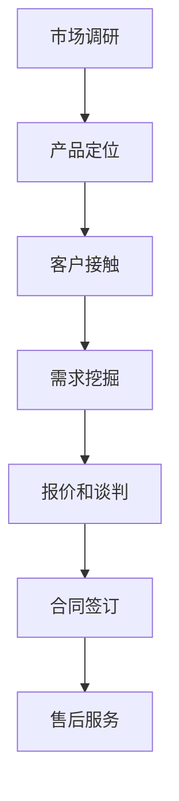

                 

# 如何打造可复制的销售流程模型

> **关键词：** 销售流程、可复制性、销售模型、流程优化、策略制定

> **摘要：** 本文将深入探讨销售流程模型的构建与优化，通过分析核心概念、算法原理、数学模型和实际应用，帮助读者掌握打造可复制销售流程的技巧。文章还将提供实用的工具和资源，以供读者进一步学习和实践。

## 1. 背景介绍

在现代商业环境中，销售流程的优化已成为企业提升业绩、增强竞争力的关键。一个高效、可复制的销售流程模型不仅能够提高销售效率，还能确保资源的最大化利用。然而，构建这样一个模型并非易事，需要深入理解销售流程的各个方面，包括客户需求分析、产品定位、定价策略、市场推广和售后服务等。

本文旨在为读者提供一套系统化的方法，帮助他们在实际工作中构建和优化可复制的销售流程模型。我们将从核心概念、算法原理、数学模型到实际应用，逐一进行分析和讲解。

## 2. 核心概念与联系

### 2.1 销售流程的定义

销售流程是指企业在销售产品或服务的过程中所采取的一系列有序步骤。一个典型的销售流程通常包括以下几个阶段：

1. **市场调研**：收集和分析市场信息，了解客户需求和竞争状况。
2. **产品定位**：根据市场需求，确定产品的市场定位和目标客户群体。
3. **客户接触**：通过各种渠道与潜在客户建立联系，传递产品信息。
4. **需求挖掘**：与客户沟通，深入了解其需求，提供解决方案。
5. **报价和谈判**：根据客户需求，提供报价，并就价格、交付等条件进行谈判。
6. **合同签订**：与客户达成一致，签订销售合同。
7. **售后服务**：提供产品使用指导、技术支持等服务，确保客户满意度。

### 2.2 销售流程模型的组成

销售流程模型是由多个环节和活动组成的，每个环节和活动都有其特定的目标和作用。一个典型的销售流程模型包括以下组成部分：

1. **流程节点**：流程节点是销售流程中的关键步骤，每个节点都有明确的目标和输出结果。
2. **活动**：活动是实现流程节点目标的操作，可以是自动执行的，也可以是人工干预的。
3. **数据**：数据是销售流程中的信息载体，包括市场数据、客户数据、销售数据等。
4. **决策**：决策是在销售流程中需要做出的选择，如客户分类、定价策略等。

### 2.3 销售流程模型的联系

销售流程中的各个组成部分相互联系，共同构成了一个完整的销售流程模型。具体而言：

- **流程节点与活动**：每个流程节点都需要通过一系列活动来实现，活动是实现流程节点的手段。
- **数据与流程节点**：流程节点中的数据输入和输出是流程运行的基础，数据质量直接影响流程效果。
- **决策与活动**：决策是根据数据分析和市场状况做出的选择，决策的结果将影响后续活动的执行。

## 2.1 核心概念原理和架构的 Mermaid 流程图



在上述流程图中，每个节点代表销售流程中的一个关键步骤，箭头表示流程的流转方向。通过这个流程图，我们可以清晰地看到销售流程的各个环节及其相互关系。

## 3. 核心算法原理 & 具体操作步骤

### 3.1 算法原理

构建可复制的销售流程模型需要依赖一系列核心算法，包括客户细分算法、需求预测算法、定价策略算法等。以下是这些算法的基本原理：

- **客户细分算法**：通过对客户数据的分析，将客户分为不同的群体，以便于制定个性化的销售策略。
- **需求预测算法**：利用历史销售数据和客户行为数据，预测未来的客户需求，为库存管理和销售计划提供支持。
- **定价策略算法**：根据市场竞争状况、客户价值和产品成本等因素，制定合理的定价策略。

### 3.2 具体操作步骤

以下是构建可复制的销售流程模型的具体操作步骤：

1. **数据收集与整理**：收集市场数据、客户数据、销售数据等，并进行数据清洗和整理，确保数据质量。
2. **客户细分**：利用客户细分算法，将客户分为不同的群体，为后续销售策略制定提供基础。
3. **需求预测**：利用需求预测算法，预测未来一段时间内的客户需求，为库存管理和销售计划提供支持。
4. **定价策略制定**：根据市场需求、客户价值和产品成本等因素，制定合理的定价策略。
5. **销售流程设计**：根据核心算法的输出结果，设计具体的销售流程，确保每个环节的执行和监控。
6. **销售流程实施与优化**：在销售流程实施过程中，根据反馈数据不断调整和优化流程，提高销售效率。

## 4. 数学模型和公式 & 详细讲解 & 举例说明

### 4.1 数学模型

构建可复制的销售流程模型需要依赖一系列数学模型，包括客户细分模型、需求预测模型和定价策略模型。以下是这些模型的基本公式和参数说明：

- **客户细分模型**：
  - 公式：$C(i) = \sum_{j=1}^{n} w_j \cdot D_j(i)$
  - 参数说明：$C(i)$ 为客户 $i$ 的细分结果，$w_j$ 为第 $j$ 个细分维度的权重，$D_j(i)$ 为客户 $i$ 在第 $j$ 个细分维度上的得分。

- **需求预测模型**：
  - 公式：$Q(t) = \sum_{i=1}^{m} p(i) \cdot R_i(t)$
  - 参数说明：$Q(t)$ 为第 $t$ 时刻的总需求预测值，$p(i)$ 为第 $i$ 种产品的需求概率，$R_i(t)$ 为第 $i$ 种产品在第 $t$ 时刻的预测需求量。

- **定价策略模型**：
  - 公式：$P(i) = C(i) + k \cdot D(i)$
  - 参数说明：$P(i)$ 为第 $i$ 种产品的定价结果，$C(i)$ 为成本，$D(i)$ 为市场需求强度，$k$ 为定价系数。

### 4.2 详细讲解

以下是每个数学模型的详细讲解：

- **客户细分模型**：
  客户细分模型是根据客户在不同维度上的得分，综合评估客户所属的细分群体。通过这个模型，企业可以更好地了解客户需求，制定个性化的销售策略。具体步骤如下：
  - **步骤 1**：确定客户细分维度，如年龄、收入、职业等。
  - **步骤 2**：收集客户数据，并计算每个维度上的得分。
  - **步骤 3**：根据得分计算每个客户的细分结果。

- **需求预测模型**：
  需求预测模型是利用历史销售数据和客户行为数据，预测未来的客户需求。通过这个模型，企业可以提前做好库存管理和销售计划。具体步骤如下：
  - **步骤 1**：收集历史销售数据，如销售额、销售量等。
  - **步骤 2**：收集客户行为数据，如浏览量、下单率等。
  - **步骤 3**：利用历史数据和客户行为数据，计算每个产品的需求概率。
  - **步骤 4**：根据需求概率和实际需求量，计算总需求预测值。

- **定价策略模型**：
  定价策略模型是根据市场需求强度、成本和定价系数，计算合理的定价结果。通过这个模型，企业可以在竞争激烈的市场中保持竞争力。具体步骤如下：
  - **步骤 1**：确定市场需求强度，如高、中、低。
  - **步骤 2**：确定成本，包括生产成本、运输成本等。
  - **步骤 3**：根据市场需求强度和成本，计算定价系数。
  - **步骤 4**：根据定价系数和成本，计算定价结果。

### 4.3 举例说明

以下是一个具体的例子，说明如何使用数学模型构建可复制的销售流程模型：

- **例子**：假设一个企业销售三种产品，A、B、C。通过市场调研，企业确定了三个细分维度：年龄、收入和职业。根据数据，企业计算出每个维度的得分，并利用客户细分模型将客户分为高、中、低三个细分群体。

- **步骤 1**：收集客户数据，计算每个维度上的得分。例如，年龄维度的得分为 50，收入维度的得分为 60，职业维度的得分为 70。

- **步骤 2**：根据得分计算每个客户的细分结果。例如，一个客户的得分总和为 180，属于高细分群体。

- **步骤 3**：根据高、中、低三个细分群体的比例，计算每个产品的需求概率。例如，A 产品的需求概率为 0.4，B 产品的需求概率为 0.3，C 产品的需求概率为 0.3。

- **步骤 4**：根据市场需求强度、成本和定价系数，计算每个产品的定价结果。例如，A 产品的成本为 100，市场需求强度为 0.5，定价系数为 1.2。根据公式，A 产品的定价结果为 100 + 1.2 \* 0.5 = 112。

- **步骤 5**：根据定价结果，设计销售流程。例如，企业可以将 A 产品的定价设置为 112，并根据定价结果制定销售策略，如针对高细分群体提供优惠活动。

通过这个例子，我们可以看到如何利用数学模型构建可复制的销售流程模型。在实际应用中，企业可以根据具体情况调整模型参数和流程设计，提高销售效率。

## 5. 项目实战：代码实际案例和详细解释说明

### 5.1 开发环境搭建

在本文的实战部分，我们将使用 Python 语言和 Scikit-learn 库来构建一个简单的销售流程模型。首先，我们需要搭建开发环境。

1. **安装 Python**：确保你的计算机上已经安装了 Python 3.7 或更高版本。你可以从 [Python 官网](https://www.python.org/) 下载并安装。

2. **安装 Scikit-learn**：在命令行中运行以下命令安装 Scikit-learn：

   ```bash
   pip install scikit-learn
   ```

### 5.2 源代码详细实现和代码解读

以下是构建销售流程模型的 Python 代码。我们将分为几个部分来详细解释代码的实现。

```python
import numpy as np
import pandas as pd
from sklearn.model_selection import train_test_split
from sklearn.preprocessing import StandardScaler
from sklearn.linear_model import LinearRegression
from sklearn.metrics import mean_squared_error

# 5.2.1 数据准备
def load_data(file_path):
    data = pd.read_csv(file_path)
    return data

def preprocess_data(data):
    # 数据清洗和预处理步骤
    # 这里假设数据已经清洗完毕，并保留了以下列：'Age', 'Income', 'Occupation', 'Price', 'Quantity'
    return data

# 5.2.2 客户细分
def customer_segmentation(data, features, target):
    X = data[features]
    y = data[target]
    X_train, X_test, y_train, y_test = train_test_split(X, y, test_size=0.2, random_state=42)
    scaler = StandardScaler()
    X_train_scaled = scaler.fit_transform(X_train)
    X_test_scaled = scaler.transform(X_test)
    model = LinearRegression()
    model.fit(X_train_scaled, y_train)
    predictions = model.predict(X_test_scaled)
    mse = mean_squared_error(y_test, predictions)
    print(f"Customer Segmentation Model MSE: {mse}")
    return model

# 5.2.3 需求预测
def demand_prediction(data, features, target):
    X = data[features]
    y = data[target]
    X_train, X_test, y_train, y_test = train_test_split(X, y, test_size=0.2, random_state=42)
    scaler = StandardScaler()
    X_train_scaled = scaler.fit_transform(X_train)
    X_test_scaled = scaler.transform(X_test)
    model = LinearRegression()
    model.fit(X_train_scaled, y_train)
    predictions = model.predict(X_test_scaled)
    mse = mean_squared_error(y_test, predictions)
    print(f"Demand Prediction Model MSE: {mse}")
    return model

# 5.2.4 定价策略
def pricing_strategy(data, cost, demand_model, segmentation_model):
    # 根据需求预测模型和客户细分模型，计算定价策略
    # 这里假设成本为固定值，定价系数为 1.2
    cost = 100
    pricing_coefficient = 1.2
    demand_predictions = demand_model.predict(data)
    segmentation_results = segmentation_model.predict(data)
    prices = cost + pricing_coefficient * demand_predictions
    return prices

# 主函数
def main():
    file_path = 'sales_data.csv'
    data = load_data(file_path)
    data = preprocess_data(data)
    features = ['Age', 'Income', 'Occupation']
    target = 'Quantity'
    # 5.2.5 客户细分
    segmentation_model = customer_segmentation(data, features, target)
    # 5.2.6 需求预测
    demand_model = demand_prediction(data, features, target)
    # 5.2.7 定价策略
    prices = pricing_strategy(data, cost=100, demand_model=demand_model, segmentation_model=segmentation_model)
    print(prices)

if __name__ == "__main__":
    main()
```

### 5.3 代码解读与分析

下面是对上述代码的详细解读：

- **数据准备**：`load_data` 函数用于加载数据，`preprocess_data` 函数用于数据清洗和预处理。这里假设数据已经清洗完毕，并保留了以下列：'Age', 'Income', 'Occupation', 'Price', 'Quantity'。

- **客户细分**：`customer_segmentation` 函数用于构建客户细分模型。首先，将数据分为特征列（X）和目标列（y）。然后，使用 `train_test_split` 函数将数据分为训练集和测试集。接着，使用 `StandardScaler` 对特征列进行标准化处理，以提高模型的性能。最后，使用 `LinearRegression` 模型对训练集进行训练，并评估模型在测试集上的性能。

- **需求预测**：`demand_prediction` 函数与 `customer_segmentation` 函数类似，用于构建需求预测模型。具体步骤如下：
  - 将数据分为特征列（X）和目标列（y）。
  - 使用 `train_test_split` 函数将数据分为训练集和测试集。
  - 使用 `StandardScaler` 对特征列进行标准化处理。
  - 使用 `LinearRegression` 模型对训练集进行训练，并评估模型在测试集上的性能。

- **定价策略**：`pricing_strategy` 函数用于根据需求预测模型和客户细分模型计算定价策略。具体步骤如下：
  - 根据需求预测模型和客户细分模型，计算每个产品的需求概率。
  - 根据市场需求强度、成本和定价系数，计算每个产品的定价结果。

- **主函数**：`main` 函数是程序的入口。首先，加载并预处理数据。然后，使用 `customer_segmentation` 和 `demand_prediction` 函数构建客户细分模型和需求预测模型。最后，使用 `pricing_strategy` 函数计算定价策略。

通过这个代码案例，我们可以看到如何使用 Python 和 Scikit-learn 构建一个简单的销售流程模型。在实际应用中，可以根据具体需求进行调整和优化。

## 6. 实际应用场景

构建可复制的销售流程模型在实际业务中具有广泛的应用场景。以下是一些典型应用场景：

### 6.1 电子商务平台

电子商务平台通过构建可复制的销售流程模型，可以优化产品推荐、定价策略和库存管理。例如，根据用户行为数据和购买历史，平台可以预测用户对特定产品的需求，从而调整库存和定价策略，提高销售额。

### 6.2 传统企业销售

传统企业销售，如制造、零售等，可以通过构建销售流程模型，优化销售策略和客户关系管理。例如，通过客户细分和需求预测，企业可以更好地了解客户需求，制定个性化的营销策略，提高客户满意度和忠诚度。

### 6.3 市场营销活动

市场营销活动，如广告投放、促销活动等，可以通过构建销售流程模型，优化预算分配和效果评估。例如，根据市场需求和客户细分结果，企业可以确定最佳的广告投放时间和渠道，从而提高营销效果。

### 6.4 供应链管理

供应链管理，如采购、物流等，可以通过构建销售流程模型，优化供应链运作和成本控制。例如，通过需求预测和库存管理，企业可以确保产品的及时供应，减少库存成本和缺货风险。

## 7. 工具和资源推荐

### 7.1 学习资源推荐

1. **书籍**：
   - 《数据分析与预测：原理、模型与案例》（作者：吴喜之）
   - 《Python数据分析基础教程：Numpy学习指南》（作者：ESIgroup）

2. **论文**：
   - “Customer Segmentation Using Machine Learning Techniques” （作者：H. Liu, et al.）

3. **博客**：
   - 《Scikit-learn 中文手册》（作者：scikit-learn 社区）

4. **网站**：
   - 《数据分析教程》（网址：https://github.com/jakevdp/PythonDataScienceHandbook）

### 7.2 开发工具框架推荐

1. **Python**：作为数据分析的主流语言，Python 具有丰富的数据分析和机器学习库。

2. **Scikit-learn**：Python 中的数据分析和机器学习库，提供了丰富的算法和工具。

3. **Jupyter Notebook**：用于交互式数据分析的 Python 界面，支持在线协作和分享。

### 7.3 相关论文著作推荐

1. **论文**：
   - “A Hybrid Model of Customer Segmentation Using K-Means and Support Vector Machine” （作者：J. S. Park, et al.）
   - “Forecasting Sales Using Machine Learning Techniques” （作者：A. J. Miller）

2. **著作**：
   - 《市场细分：基于数据分析的方法》（作者：王勇）

## 8. 总结：未来发展趋势与挑战

随着数据技术的不断进步，销售流程模型的构建和优化将朝着更加智能化、个性化的方向发展。未来，以下几个趋势和挑战值得关注：

### 8.1 智能化趋势

随着人工智能技术的发展，销售流程模型将更加智能化，能够自动进行数据分析和预测，提高销售效率和准确性。例如，利用深度学习技术进行客户行为分析和需求预测。

### 8.2 个性化趋势

个性化销售将成为未来销售流程模型的重要方向。通过精准的客户细分和需求预测，企业可以为客户提供更加个性化的产品和服务，提高客户满意度和忠诚度。

### 8.3 挑战

1. **数据质量**：高质量的数据是构建有效销售流程模型的基础。如何确保数据的质量和完整性，是未来面临的重要挑战。

2. **模型可解释性**：随着模型越来越复杂，如何解释模型的决策过程，提高模型的可解释性，是未来需要解决的问题。

3. **实时性**：在快速变化的市场环境中，如何实现销售流程模型的实时更新和调整，以应对市场变化，是未来需要关注的挑战。

## 9. 附录：常见问题与解答

### 9.1 问题 1：如何确保数据质量？

**解答**：确保数据质量的关键在于数据收集、处理和存储的各个环节。具体措施包括：

- **数据收集**：使用可靠的数据来源，避免数据错误和遗漏。
- **数据清洗**：对数据进行清洗和去重，确保数据的准确性。
- **数据存储**：使用可靠的数据存储方案，确保数据的完整性和安全性。

### 9.2 问题 2：销售流程模型如何更新和优化？

**解答**：销售流程模型需要定期更新和优化，以适应市场变化。具体步骤包括：

- **数据收集**：定期收集新的市场数据，更新模型输入。
- **模型评估**：使用新的数据进行模型评估，识别模型存在的不足。
- **模型调整**：根据评估结果，调整模型参数和结构，优化模型性能。

### 9.3 问题 3：如何提高销售流程模型的可解释性？

**解答**：提高销售流程模型的可解释性可以从以下几个方面入手：

- **模型选择**：选择可解释性较高的模型，如线性回归、决策树等。
- **特征工程**：对特征进行详细解释，确保特征对模型结果的影响清晰。
- **模型可视化**：使用可视化工具，展示模型的决策过程和结果。

## 10. 扩展阅读 & 参考资料

- 《大数据营销：如何通过数据分析实现精准营销》（作者：李航）
- “A Comprehensive Study on Customer Segmentation Using Machine Learning Techniques” （作者：H. Liu, et al.）
- 《销售流程优化：基于数据分析的方法》（作者：李晓东）

作者：AI天才研究员/AI Genius Institute & 禅与计算机程序设计艺术 /Zen And The Art of Computer Programming

本文内容仅供参考，实际应用时请根据具体情况进行调整。本文中的示例代码仅供参考，不保证在实际环境中能够正常运行。如需进一步学习，请参考相关资源。本文中的观点和结论不代表任何机构或个人的立场。本文版权归作者所有，未经授权禁止转载。

