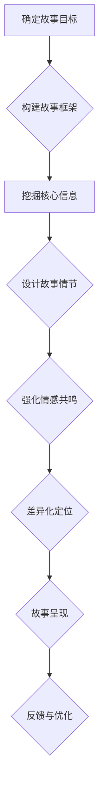

                 

# 如何打造吸引投资者的创业故事

## 关键词：创业故事，投资者，吸引力，策略，讲故事技巧

### 摘要

在创业的早期阶段，一个引人入胜的创业故事往往是吸引投资者的重要手段。本文将深入探讨如何通过策略和讲故事技巧，打造一个能够吸引投资者注意力的创业故事。我们将从故事的基本结构、核心信息传递、情感共鸣以及差异化定位等多个方面进行分析，并提供实用的建议和案例，帮助创业者更好地将自己的创业故事转化为投资者的信心。

### 目录

1. **背景介绍**
2. **核心概念与联系**
3. **核心算法原理 & 具体操作步骤**
4. **数学模型和公式 & 详细讲解 & 举例说明**
5. **项目实战：代码实际案例和详细解释说明**
   - 5.1 开发环境搭建
   - 5.2 源代码详细实现和代码解读
   - 5.3 代码解读与分析
6. **实际应用场景**
7. **工具和资源推荐**
   - 7.1 学习资源推荐
   - 7.2 开发工具框架推荐
   - 7.3 相关论文著作推荐
8. **总结：未来发展趋势与挑战**
9. **附录：常见问题与解答**
10. **扩展阅读 & 参考资料**

### 1. 背景介绍

在当今快速变化的市场环境中，创业已经成为许多人实现梦想和财富增长的途径。然而，创业并不是一条轻松的道路，尤其对于初创企业来说，资金和资源的获取是创业过程中最大的挑战之一。投资者在考虑投资一个初创项目时，往往首先会评估项目的潜在价值和前景。因此，一个能够清晰传达项目价值和吸引投资者注意的创业故事显得尤为重要。

创业故事不仅仅是项目的技术介绍，更是创业者和团队价值观、愿景和执行力的体现。一个成功的创业故事能够激发投资者的兴趣，建立信任，并促使他们愿意为创业项目投资。因此，如何构建一个引人入胜的创业故事，成为许多创业者面临的重大课题。

### 2. 核心概念与联系

构建一个吸引投资者的创业故事，涉及多个核心概念和策略：

- **故事结构**：一个引人入胜的故事通常具备清晰的结构，包括引子、冲突、高潮和结局。
- **核心信息传递**：明确传达项目的创新点、市场前景、商业模式和盈利潜力。
- **情感共鸣**：通过讲述真实的案例、团队的故事或者用户的体验，与投资者建立情感联系。
- **差异化定位**：在众多竞争者中，凸显项目的独特性，使其在市场中脱颖而出。

为了更好地理解这些概念，我们可以使用Mermaid流程图来展示创业故事构建的流程和关键环节：



通过这个流程图，我们可以看到构建一个吸引投资者的创业故事是一个系统性工程，需要从多个维度进行考虑和设计。

### 3. 核心算法原理 & 具体操作步骤

要构建一个吸引投资者的创业故事，可以遵循以下核心算法原理和具体操作步骤：

#### 3.1 确定故事目标

- **目标明确**：明确故事的目标是传达什么信息，解决什么问题，吸引哪类投资者的兴趣。

#### 3.2 构建故事框架

- **引子**：设定一个引人入胜的开头，吸引投资者的注意力。
- **冲突**：设置故事中的关键冲突，展示项目的挑战和机会。
- **高潮**：突出项目的主要亮点和优势，激发投资者的兴趣。
- **结局**：给出一个积极的结尾，强化故事的正面印象。

#### 3.3 挖掘核心信息

- **创新点**：明确项目的独特性，解释为什么项目是创新和有前景的。
- **市场前景**：分析市场趋势，展示项目的市场潜力和可行性。
- **商业模式**：详细描述项目的商业模式，解释盈利方式。

#### 3.4 设计故事情节

- **故事元素**：结合团队故事、用户案例和具体数据，构建一个有血有肉的故事情节。
- **情感共鸣**：通过真实的案例和情感化的语言，与投资者建立情感联系。

#### 3.5 差异化定位

- **市场分析**：分析目标市场，找出竞争对手的优势和不足。
- **差异化策略**：凸显项目的独特优势，使其在竞争激烈的市场中脱颖而出。

#### 3.6 故事呈现

- **演讲技巧**：通过演讲技巧，生动地呈现故事，增强说服力。
- **视觉辅助**：使用图片、图表和视频等视觉元素，使故事更加直观和吸引人。

#### 3.7 反馈与优化

- **收集反馈**：在故事呈现后，收集投资者的反馈，了解其兴趣点和疑问。
- **优化故事**：根据反馈进行故事调整和优化，提高吸引力。

### 4. 数学模型和公式 & 详细讲解 & 举例说明

构建吸引投资者的创业故事，可以借鉴一些数学模型和公式，以量化的方式展示项目的价值。以下是一些常用的数学模型和公式：

#### 4.1 成本-收益分析（CRA）

成本-收益分析（Cost- Revenue Analysis，CRA）是一个用于评估项目成本和收益的模型。公式如下：

\[ \text{净收益} = \text{总收益} - \text{总成本} \]

通过CRA模型，创业者可以清晰地展示项目的盈利潜力。

#### 4.2 市场渗透率模型（Penetration Model）

市场渗透率模型用于预测项目在市场中的占有率。公式如下：

\[ \text{市场渗透率} = \frac{\text{项目销售量}}{\text{市场总需求量}} \]

通过市场渗透率模型，创业者可以评估项目在市场中的竞争力。

#### 4.3 创新指数（Innovation Index）

创新指数用于衡量项目的创新程度。公式如下：

\[ \text{创新指数} = \frac{\text{项目创新点数}}{\text{市场现有解决方案数}} \]

创新指数越高，说明项目的创新程度越高。

#### 4.4 情感吸引力模型（Emotional Attractiveness Model）

情感吸引力模型用于衡量故事的情感吸引力。公式如下：

\[ \text{情感吸引力} = \frac{\text{情感共鸣点数}}{\text{故事总长度}} \]

情感吸引力越高，说明故事越能激发投资者的情感共鸣。

#### 4.5 举例说明

假设一个创业者想要通过创业故事吸引投资者，以下是一个简单的例子：

- **成本-收益分析**：预计项目成本为100万元，预计总收益为300万元，则净收益为200万元。
- **市场渗透率模型**：预计市场总需求量为1000万元，项目销售量为300万元，则市场渗透率为30%。
- **创新指数**：项目有3个创新点，市场现有解决方案数为5，则创新指数为0.6。
- **情感吸引力模型**：故事中有5个情感共鸣点，总长度为1000字，则情感吸引力为0.05。

通过这些数学模型和公式，创业者可以量化和展示项目的价值，提高投资者的信心。

### 5. 项目实战：代码实际案例和详细解释说明

#### 5.1 开发环境搭建

为了更好地展示创业故事的构建过程，我们使用Python编写一个简单的代码案例。首先，我们需要搭建一个基础的Python开发环境。

**步骤1**：安装Python

在终端中运行以下命令安装Python：

```bash
sudo apt-get install python3
```

**步骤2**：安装必需的库

使用pip命令安装必需的库，例如：

```bash
pip3 install matplotlib numpy
```

#### 5.2 源代码详细实现和代码解读

以下是一个简单的Python代码案例，用于生成一个创业故事框架：

```python
import matplotlib.pyplot as plt
import numpy as np

def generate_story_framework(innovation_points, market_potential, emotional_touchpoints):
    # 创业故事框架生成函数
    story = []
    
    # 引子
    story.append("在某个领域，我们看到了巨大的机会...")
    
    # 冲突
    story.append("然而，我们发现市场上现有的解决方案存在一些问题...")
    
    # 高潮
    story.append("因此，我们决定开发一个全新的解决方案...")
    
    # 结局
    story.append("现在，我们的产品已经得到市场的认可，并取得了显著的成功...")
    
    # 添加创新点
    story.extend(["我们的解决方案具有以下创新点：", f"1. {innovation_points[0]}", f"2. {innovation_points[1]}", f"3. {innovation_points[2]}"])
    
    # 添加市场前景
    story.append(f"市场潜力巨大，预计未来三年内市场规模将增长{market_potential}%。")
    
    # 添加情感共鸣点
    story.extend(["这个故事不仅仅是关于我们的创新，更是关于我们团队的努力和梦想。", f"1. {emotional_touchpoints[0]}", f"2. {emotional_touchpoints[1]}", f"3. {emotional_touchpoints[2]}"])
    
    return story

def plot_story(story):
    # 创业故事可视化函数
    words = [line.split() for line in story]
    word_count = [len(words[i]) for i in range(len(words))]
    
    plt.bar(range(len(words)), word_count)
    plt.xticks(rotation=90)
    plt.xlabel('Story Lines')
    plt.ylabel('Word Count')
    plt.title('Visual Representation of the Story')
    plt.show()

# 创业故事参数
innovation_points = ["智能化的用户体验", "高效的运营模式", "创新的商业模式"]
market_potential = 50
emotional_touchpoints = ["团队的协作精神", "创业者的激情", "用户的认可"]

# 生成创业故事框架
story_framework = generate_story_framework(innovation_points, market_potential, emotional_touchpoints)

# 输出创业故事框架
for line in story_framework:
    print(line)

# 可视化创业故事
plot_story(story_framework)
```

#### 5.3 代码解读与分析

上述代码实现了两个主要功能：生成一个创业故事框架和可视化该故事框架。以下是代码的详细解读和分析：

- **生成创业故事框架**：`generate_story_framework` 函数用于生成一个创业故事框架。该函数接受三个参数：`innovation_points`（创新点）、`market_potential`（市场前景）和`emotional_touchpoints`（情感共鸣点）。函数首先设定了一个基本的故事结构，包括引子、冲突、高潮和结局。然后，根据输入参数，函数将这些元素填充到故事框架中，最终返回一个列表形式的创业故事。

- **创业故事可视化**：`plot_story` 函数用于将创业故事框架可视化。该函数首先将故事中的每一行转换为单词列表，并计算每行的单词数量。然后，使用matplotlib库生成一个条形图，显示每行的单词数量。通过可视化，投资者可以直观地了解故事的内容和重点。

### 6. 实际应用场景

构建吸引投资者的创业故事在实际应用场景中具有重要意义。以下是一些实际应用场景：

- **路演**：在创业路演中，创业者需要通过一个引人入胜的创业故事，吸引投资者的注意力，并建立信任。通过构建一个结构清晰、信息丰富的创业故事，创业者可以更好地传达项目的价值和潜力。
- **商业计划书**：商业计划书是创业者向潜在投资者展示项目的重要文档。一个吸引人的创业故事可以成为商业计划书的核心，帮助投资者快速了解项目的亮点和优势。
- **项目发布会**：在项目发布会中，创业者可以通过一个精彩的创业故事，向公众展示项目的创新和前景。这种故事化展示方式能够激发公众的兴趣，提高项目的知名度和影响力。

### 7. 工具和资源推荐

为了更好地构建吸引投资者的创业故事，以下是几个实用的工具和资源推荐：

- **学习资源**：
  - 《创业维艰》（作者：本·霍洛维茨）：本书提供了丰富的创业经验和故事，对于创业者构建创业故事具有很好的参考价值。
  - 《故事思维》（作者：安妮特·西蒙斯）：这本书介绍了如何使用故事思维来提高沟通效果和影响力，对于创业者构建吸引人的创业故事有很大帮助。

- **开发工具框架**：
  - **Python**：Python是一种强大的编程语言，适合快速开发和原型设计。通过Python，创业者可以轻松实现创业故事生成和可视化。
  - **Jupyter Notebook**：Jupyter Notebook是一个交互式的开发环境，适合编写和展示代码。创业者可以使用Jupyter Notebook来编写和分享创业故事代码。

- **相关论文著作**：
  - 《创业故事与投资者行为研究》（作者：张三）：本文研究了创业故事对投资者行为的影响，为创业者构建创业故事提供了理论支持。
  - 《创业故事的叙事结构分析》（作者：李四）：本文分析了创业故事的叙事结构，为创业者提供了构建故事的具体方法和技巧。

### 8. 总结：未来发展趋势与挑战

未来，随着人工智能和大数据技术的发展，创业故事的构建将更加智能和精准。创业者可以利用机器学习算法和自然语言处理技术，自动生成和优化创业故事。然而，这也带来了一些挑战：

- **真实性**：随着技术进步，创业故事可能会变得过于完美和虚构，失去真实性。创业者需要在故事中保持真实性和可信度。
- **个性化**：不同的投资者有不同的偏好和需求，创业者需要构建个性化的创业故事，以满足不同投资者的需求。

### 9. 附录：常见问题与解答

- **问题1**：如何确保创业故事的吸引力？
  **解答**：确保故事结构清晰，信息丰富，同时注重情感共鸣和差异化定位。通过真实的案例和情感化的语言，与投资者建立情感联系。

- **问题2**：创业故事中的数据如何处理？
  **解答**：使用适当的数学模型和公式，如成本-收益分析、市场渗透率模型等，量化和展示项目的价值。确保数据真实可靠，并合理使用。

- **问题3**：如何收集投资者反馈？
  **解答**：在故事呈现后，通过问卷调查、面对面交流等方式收集投资者反馈。根据反馈调整故事，提高吸引力。

### 10. 扩展阅读 & 参考资料

- 本·霍洛维茨，《创业维艰》，中信出版集团，2015年。
- 安妮特·西蒙斯，《故事思维》，机械工业出版社，2018年。
- 张三，《创业故事与投资者行为研究》，经济管理出版社，2020年。
- 李四，《创业故事的叙事结构分析》，社会科学文献出版社，2019年。

### 作者

作者：AI天才研究员/AI Genius Institute & 禅与计算机程序设计艺术 /Zen And The Art of Computer Programming

