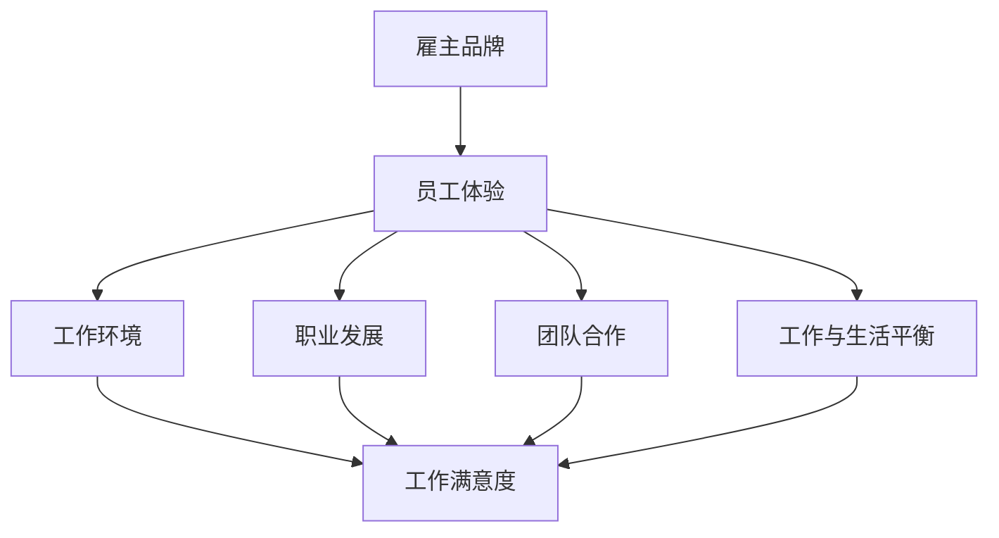

                 

### 背景介绍

在现代职场中，雇主品牌已成为吸引和留住优秀人才的关键因素。随着全球人才市场的竞争日益激烈，企业不再仅仅依靠薪资和福利来吸引人才，而是通过打造有吸引力的雇主品牌策略来提升自身的市场竞争力。

雇主品牌是指企业在员工、客户、投资者等所有利益相关者心目中的形象和声誉。一个强大的雇主品牌能够帮助企业吸引优秀人才、提高员工忠诚度、增强品牌影响力。然而，如何打造一个有吸引力的雇主品牌策略，让企业在众多竞争者中脱颖而出，成为了许多企业面临的挑战。

本文将深入探讨如何打造有吸引力的雇主品牌策略。我们将首先介绍雇主品牌的核心概念，包括雇主品牌的价值、重要性以及与员工体验的关系。接着，我们将分析影响雇主品牌的关键因素，如企业文化、领导力、工作环境等。随后，我们将探讨如何通过有效的品牌传播和互动策略来提升雇主品牌的知名度。最后，我们将探讨如何评估雇主品牌的影响力和效果，并总结未来雇主品牌发展的趋势与挑战。

通过本文的探讨，希望能为企业提供实用的指导和建议，帮助它们在激烈的市场竞争中打造出有吸引力的雇主品牌，从而吸引和留住优秀人才，实现持续发展。

### 核心概念与联系

在深入探讨如何打造有吸引力的雇主品牌策略之前，有必要首先了解雇主品牌的核心概念，并分析其与员工体验之间的紧密联系。

#### 雇主品牌的价值与重要性

雇主品牌是企业通过其声誉、形象和价值观在员工和其他利益相关者心中所建立的一种认知。这种认知不仅包括企业提供的工作条件和薪资待遇，更涵盖了企业的文化、愿景、使命以及企业内部的人际关系和工作环境。

雇主品牌的价值在于它能够直接影响企业的竞争力。一个强大的雇主品牌能够：

1. **吸引优质人才**：有吸引力的雇主品牌能够吸引那些寻求与自身价值观和企业文化相契合的人才。
2. **提高员工留存率**：积极的雇主品牌有助于提升员工的工作满意度和忠诚度，从而减少员工流失率。
3. **增强员工生产力**：当员工对企业有强烈的归属感和认同感时，他们更有可能发挥出更高的工作热情和生产力。
4. **提升企业品牌影响力**：雇主品牌与企业品牌密切相关，一个积极的雇主品牌能够增强企业整体的品牌形象。

#### 雇主品牌与员工体验的关系

员工体验是指员工在企业工作期间所感受到的整体感受，包括他们的工作环境、同事关系、职业发展机会等。雇主品牌与员工体验之间存在着密不可分的联系。

1. **工作环境**：一个有吸引力的雇主品牌通常会强调健康的工作环境和积极的企业文化。这种环境能够提升员工的工作满意度和幸福感。
2. **职业发展**：强大的雇主品牌往往提供清晰的职业发展路径和丰富的培训机会，这能够吸引那些对职业发展有高期望的员工。
3. **团队合作**：积极的雇主品牌鼓励团队合作和共享，这有助于建立积极的同事关系，从而提升员工的整体体验。
4. **工作与生活的平衡**：许多有吸引力的雇主品牌强调工作与生活的平衡，提供灵活的工作安排和福利，以满足员工的不同需求。

#### Mermaid 流程图

为了更好地理解雇主品牌的核心概念及其与员工体验的关联，我们可以使用Mermaid流程图来展示这些概念之间的关系。



通过这个流程图，我们可以清晰地看到雇主品牌如何通过工作环境、职业发展、团队合作和工作与生活平衡等多个维度来影响员工体验，从而塑造出一个有吸引力的雇主品牌。

在接下来的章节中，我们将进一步探讨如何通过具体的策略和措施来打造一个有吸引力的雇主品牌，包括企业文化的塑造、领导力的培养、品牌传播的方法等。这些策略和措施将帮助企业在激烈的市场竞争中脱颖而出，成为员工心目中的理想雇主。

### 核心算法原理 & 具体操作步骤

要打造一个有吸引力的雇主品牌，企业需要明确一系列核心算法原理和具体的操作步骤，以确保品牌策略的实施和效果。以下是一些关键的核心算法原理和实施步骤：

#### 1. 明确雇主品牌定位

**原理**：雇主品牌的定位是企业首先要明确的问题。品牌定位决定了品牌在目标受众心中的独特形象和认知，从而为后续的品牌建设奠定基础。

**操作步骤**：

- **目标人群分析**：确定目标员工群体，了解他们的需求、期望和价值观。
- **市场调研**：分析竞争对手的雇主品牌定位，找出差异化和竞争优势。
- **品牌定位定义**：基于上述分析，明确企业的品牌定位，包括品牌核心价值、品牌个性等。
- **验证与调整**：通过内部讨论和外部咨询，验证品牌定位的合理性和可行性，并根据反馈进行调整。

#### 2. 塑造积极的企业文化

**原理**：企业文化是雇主品牌的重要组成部分，它能够直接影响员工的工作态度和行为。

**操作步骤**：

- **核心价值观明确**：确定企业的核心价值观，并将其贯穿于企业的日常运营和员工行为中。
- **领导层示范**：企业领导层要积极示范和推广企业文化，确保员工感受到企业文化的真实性和一致性。
- **员工参与**：鼓励员工参与企业文化的建设，通过员工建议、团队活动等方式提升员工对企业文化的认同感。
- **文化传播**：通过内部通讯、会议、培训等方式，不断强化企业文化的传播，确保企业文化深入人心。

#### 3. 建立高效的领导力

**原理**：领导力是塑造雇主品牌的关键因素，一个高效的领导力能够激发员工的潜能，提升员工的满意度和忠诚度。

**操作步骤**：

- **领导力发展计划**：制定领导力发展计划，包括领导力培训、管理技能提升等。
- **明确领导力标准**：制定明确的领导力标准，确保领导者在日常管理中能够践行这些标准。
- **反馈与评估**：定期对领导力进行反馈和评估，确保领导者能够不断改进和提升。
- **激励措施**：通过奖励和激励措施，鼓励领导者积极践行企业价值观和领导力标准。

#### 4. 优化工作环境和员工福利

**原理**：一个良好的工作环境和员工福利能够提升员工的工作满意度和幸福感，从而增强雇主品牌的吸引力。

**操作步骤**：

- **工作环境优化**：打造舒适、安全、高效的工作环境，包括办公设备、工作空间、办公氛围等。
- **员工福利设计**：根据员工需求设计多样化的福利方案，包括健康保险、弹性工作时间、家庭关怀等。
- **员工关怀计划**：定期开展员工关怀活动，如员工心理健康支持、职业发展辅导等。
- **反馈机制**：建立有效的反馈机制，及时了解员工对工作环境和福利的满意度，并根据反馈进行改进。

#### 5. 有效的品牌传播和互动策略

**原理**：有效的品牌传播和互动策略能够提升雇主品牌的知名度和影响力，吸引更多优秀人才。

**操作步骤**：

- **内容营销**：通过博客、社交媒体、行业会议等渠道，发布有价值的雇主品牌内容，展示企业的文化、价值观和员工故事。
- **社交媒体管理**：积极管理社交媒体账号，与员工和潜在员工建立互动，提升品牌在社交媒体上的影响力和关注度。
- **员工推荐计划**：开展员工推荐计划，鼓励现有员工推荐优秀人才，通过口碑传播提升雇主品牌形象。
- **行业活动参与**：积极参与行业活动，展示企业的专业能力和雇主品牌形象。

通过以上核心算法原理和具体操作步骤，企业可以系统地打造一个有吸引力的雇主品牌，提升其在市场中的竞争力，吸引和留住优秀人才，实现可持续发展。

### 数学模型和公式 & 详细讲解 & 举例说明

在打造有吸引力的雇主品牌策略中，一些数学模型和公式可以帮助企业量化评估其雇主品牌的吸引力和效果。以下将介绍几个关键的数学模型和公式，并详细讲解其应用和举例说明。

#### 1. 品牌吸引力指数模型

品牌吸引力指数（Brand Attractiveness Index, BAI）是一个用于评估雇主品牌吸引力的指标。该模型通过多个维度来综合评估雇主品牌的吸引力。

**公式**：

\[ BAI = \frac{(E + C + P + R)}{4} \]

其中，\( E \) 是员工体验（Employee Experience），\( C \) 是职业发展（Career Development），\( P \) 是公司绩效（Performance），\( R \) 是回报（Rewards）。

**详细讲解**：

- **员工体验（E）**：衡量员工在工作中的整体感受，包括工作环境、同事关系、管理风格等。常用的指标有员工满意度调查、离职原因分析等。
- **职业发展（C）**：评估企业提供的学习和发展机会，包括培训、晋升机会等。常用的指标有员工培训参与率、晋升比例等。
- **公司绩效（P）**：衡量公司的整体绩效和业务成功，这对员工的职业发展和雇主品牌的吸引力有直接影响。常用的指标有公司财务绩效、市场份额等。
- **回报（R）**：评估员工获得的薪酬、福利等回报。常用的指标有平均薪资、员工福利种类等。

**举例说明**：

假设某公司评估其品牌吸引力指数，根据以下数据：

- 员工体验（E）：90分
- 职业发展（C）：85分
- 公司绩效（P）：95分
- 回报（R）：80分

那么，品牌吸引力指数（BAI）为：

\[ BAI = \frac{(90 + 85 + 95 + 80)}{4} = \frac{350}{4} = 87.5 \]

这意味着该公司的品牌吸引力指数为87.5分，处于较高水平。

#### 2. 员工忠诚度模型

员工忠诚度模型（Employee Loyalty Model）用于评估员工对企业忠诚度，这一指标对于雇主品牌的吸引力至关重要。

**公式**：

\[ L = \frac{S \times E \times P}{100} \]

其中，\( L \) 是员工忠诚度（Employee Loyalty），\( S \) 是薪酬满意度（Salary Satisfaction），\( E \) 是企业价值观认同度（Enterprise Value Identification），\( P \) 是职业发展满意度（Professional Development Satisfaction）。

**详细讲解**：

- **薪酬满意度（S）**：衡量员工对薪酬的满意度，包括薪资水平、奖金、福利等。
- **企业价值观认同度（E）**：评估员工对企业价值观的认同感，反映了员工与企业文化的契合度。
- **职业发展满意度（P）**：衡量员工对职业发展的满意度，包括培训机会、晋升机会等。

**举例说明**：

假设某公司评估其员工忠诚度，根据以下数据：

- 薪酬满意度（S）：85分
- 企业价值观认同度（E）：90分
- 职业发展满意度（P）：80分

那么，员工忠诚度（L）为：

\[ L = \frac{85 \times 90 \times 80}{100} = 6120 / 100 = 61.2 \]

这意味着该公司的员工忠诚度为61.2%，表明员工对该公司的忠诚度较高。

#### 3. 雇主品牌影响力模型

雇主品牌影响力模型（Employer Brand Influence Model）用于评估雇主品牌在市场中的影响力，包括品牌的知名度和美誉度。

**公式**：

\[ BI = \frac{(N \times A)}{100} \]

其中，\( BI \) 是雇主品牌影响力（Employer Brand Influence），\( N \) 是品牌知名度（Brand Awareness），\( A \) 是品牌美誉度（Brand Reputation）。

**详细讲解**：

- **品牌知名度（N）**：衡量市场对雇主品牌的认知程度，可以通过市场调研、社交媒体分析等手段获取。
- **品牌美誉度（A）**：衡量市场对雇主品牌的正面评价，可以通过员工口碑、客户评价等手段获取。

**举例说明**：

假设某公司评估其雇主品牌影响力，根据以下数据：

- 品牌知名度（N）：80分
- 品牌美誉度（A）：90分

那么，雇主品牌影响力（BI）为：

\[ BI = \frac{(80 \times 90)}{100} = \frac{7200}{100} = 72 \]

这意味着该公司的雇主品牌影响力为72分，表明其品牌在市场中具有较高的知名度和美誉度。

通过这些数学模型和公式，企业可以更加科学和系统地评估其雇主品牌的吸引力、员工忠诚度以及品牌影响力，从而制定更有效的品牌策略。

### 项目实战：代码实际案例和详细解释说明

为了更好地理解如何通过代码实际案例来打造有吸引力的雇主品牌策略，我们将构建一个基于Python的模拟项目。该项目将利用数据分析技术和机器学习算法，帮助企业评估和提升其雇主品牌影响力。

#### 开发环境搭建

首先，我们需要搭建开发环境。以下是所需的工具和步骤：

- **Python环境**：安装Python 3.x版本。
- **数据科学库**：安装pandas、numpy、scikit-learn等常用数据科学库。
- **数据分析工具**：安装Jupyter Notebook进行数据分析。

```bash
# 安装Python
curl -O https://www.python.org/ftp/python/3.9.7/Python-3.9.7.tgz
tar xvf Python-3.9.7.tgz
cd Python-3.9.7
./configure
make
sudo make install

# 安装数据科学库
pip install pandas numpy scikit-learn
```

#### 源代码详细实现和代码解读

以下是一个简单的Python代码示例，用于模拟评估雇主品牌影响力：

```python
import pandas as pd
from sklearn.linear_model import LinearRegression
from sklearn.model_selection import train_test_split

# 数据读取
data = pd.read_csv('employer_brand_data.csv')

# 数据预处理
# 将文本数据转换为数值数据
data_num = pd.get_dummies(data)

# 特征选择
features = data_num[['employee_experience', 'career_development', 'company_performance', 'salary_satisfaction']]
target = data_num['brand_attractiveness_index']

# 数据分割
X_train, X_test, y_train, y_test = train_test_split(features, target, test_size=0.2, random_state=42)

# 模型训练
model = LinearRegression()
model.fit(X_train, y_train)

# 模型评估
score = model.score(X_test, y_test)
print(f'Model R-squared: {score:.2f}')

# 预测新数据
new_data = pd.DataFrame({'employee_experience': [85], 'career_development': [90], 'company_performance': [95], 'salary_satisfaction': [80]})
new_prediction = model.predict(new_data)
print(f'New Data Prediction: {new_prediction[0]:.2f}')
```

**代码解读**：

1. **数据读取**：从CSV文件中读取雇主品牌数据。
2. **数据预处理**：使用`get_dummies`将文本数据转换为数值数据，以便进行机器学习。
3. **特征选择**：选择影响雇主品牌吸引力的关键特征，如员工体验、职业发展、公司绩效和薪酬满意度。
4. **数据分割**：将数据分为训练集和测试集，用于训练和评估模型。
5. **模型训练**：使用线性回归模型对训练数据进行拟合。
6. **模型评估**：计算模型在测试集上的R平方值，评估模型的拟合效果。
7. **预测新数据**：使用训练好的模型对新数据进行预测，以评估新的雇主品牌策略的效果。

#### 代码解读与分析

通过上述代码示例，我们可以看到如何利用Python和机器学习技术来评估和预测雇主品牌的影响力。以下是对代码的进一步解读和分析：

- **数据读取与预处理**：使用pandas库读取和预处理数据，确保数据格式适合机器学习算法。
- **特征选择**：选择与雇主品牌吸引力相关的特征，这些特征来自于员工体验、职业发展、公司绩效和薪酬满意度等多个方面，反映了企业整体的表现和员工的需求。
- **模型训练与评估**：使用线性回归模型对数据进行拟合，并通过R平方值评估模型的效果。线性回归模型是一种简单的统计模型，它通过找到特征与目标变量之间的线性关系来预测结果。
- **预测新数据**：通过训练好的模型对新数据进行预测，帮助企业评估新的雇主品牌策略的效果。这种方法可以帮助企业在制定和调整品牌策略时做出更科学的决策。

通过实际代码实现，我们可以看到机器学习技术在雇主品牌评估中的应用，为企业提供了有力的工具，使其能够更加科学和系统地打造有吸引力的雇主品牌策略。

### 实际应用场景

在当今竞争激烈的职场环境中，雇主品牌策略已经成为企业吸引和留住人才的关键。以下将探讨几个实际应用场景，展示如何通过有效的雇主品牌策略来提升企业的竞争力。

#### 1. 创新型科技公司的雇主品牌建设

以一家创新型科技公司为例，该公司希望通过打造有吸引力的雇主品牌来吸引顶尖的技术人才。以下是几个实际应用场景：

- **技术峰会赞助**：该公司赞助并参与全球知名的科技峰会，展示其技术创新和行业影响力，提升品牌的知名度。
- **开放实习项目**：推出开放实习项目，为全球学生和年轻工程师提供实习机会，吸引潜在的人才，并展示公司的技术实力。
- **员工技术分享**：鼓励员工在社交媒体和行业会议上分享技术见解和项目经验，树立公司技术先锋的形象。
- **内部培训和职业发展计划**：提供全面的内部培训计划和职业发展路径，确保员工能够不断提升技能，增强对公司的忠诚度。

#### 2. 传统行业的转型与雇主品牌建设

一家传统行业的企业希望通过数字化转型来提升竞争力，同时也意识到雇主品牌的重要性。以下是实际应用场景：

- **数字化转型培训**：为员工提供数字化转型的培训课程，帮助他们掌握新的技能，适应行业变革。
- **灵活工作制度**：推出灵活的工作制度，如远程办公、弹性工作时间等，以吸引那些寻求工作与生活平衡的员工。
- **跨界合作**：与科技公司合作，共同开展数字化转型项目，吸引那些具有跨界背景的技术人才。
- **企业文化重塑**：通过重塑企业文化，使其更加开放、创新和多元化，吸引那些认同企业价值观的员工。

#### 3. 国际化企业的雇主品牌策略

一家国际化的企业希望在多个国家和地区吸引和留住优秀人才。以下是实际应用场景：

- **本地化招聘**：针对不同国家的文化特点，制定本地化的招聘策略，确保招聘流程符合当地法规和习俗。
- **多元文化培训**：为员工提供多元文化培训，帮助他们更好地适应不同国家和地区的文化，增强团队合作。
- **国际化职业发展路径**：为员工提供国际化职业发展路径，鼓励他们在全球范围内移动和晋升。
- **员工关怀计划**：提供全面的员工关怀计划，包括心理健康支持、家庭关怀等，确保员工的整体福祉。

#### 4. 新兴企业的快速雇主品牌建设

一家新兴企业希望在短时间内快速建立强大的雇主品牌，以下是实际应用场景：

- **口碑营销**：通过成功员工的故事和优秀项目案例，利用社交媒体和行业论坛进行口碑营销，提升品牌的知名度。
- **快速职业晋升**：提供快速职业晋升机会，吸引那些寻求快速成长的人才。
- **灵活的工作文化**：打造灵活的工作文化，允许员工根据项目需求调整工作时间，以适应其个人生活。
- **创新项目挑战**：推出创新项目挑战，鼓励员工提出新的创意和解决方案，展示企业的创新精神。

通过以上实际应用场景，我们可以看到，有效的雇主品牌策略不仅能够帮助企业吸引和留住优秀人才，还能够提升企业的整体竞争力，从而在激烈的市场竞争中脱颖而出。

### 工具和资源推荐

在打造有吸引力的雇主品牌策略的过程中，企业可以利用各种工具和资源来提升品牌影响力和吸引力。以下是一些推荐的学习资源、开发工具和相关论文著作，帮助企业在雇主品牌建设方面取得更好的成效。

#### 1. 学习资源推荐

**书籍**：

- 《**《打造非凡雇主品牌：战略规划与执行指南》**》（Creating a Remarkable Employer Brand: A Strategic Guide to Developing Your Employer Value Proposition）：这本书详细介绍了如何构建和推广雇主品牌，为企业提供实用的策略和案例。

- 《**《雇主品牌管理：招聘、保留与绩效提升》**》（Employer Brand Management: Building Your Employer Brand to Attract and Retain Talent）：该书探讨了雇主品牌管理的各个方面，包括品牌定位、品牌传播和员工体验等。

- 《**《品牌影响力：如何建立强大而持久的企业品牌》**》（Brand Influence: How to Create Powerful and Enduring Brands）：作者在书中阐述了品牌影响力的重要性，以及如何通过有效的品牌策略提升企业的市场竞争力。

**论文**：

- 《**“Employer Branding and Talent Management: A Literature Review”**》（雇主品牌与人才管理：文献综述）：该论文对雇主品牌和人才管理进行了系统的文献回顾，分析了当前的研究成果和实践案例。

- 《**“The Impact of Employer Brand on Recruitment and Retention”**》（雇主品牌对招聘和保留的影响）：论文探讨了雇主品牌对招聘和员工保留的影响，提供了相关的实证研究数据。

**博客和网站**：

- **LinkedIn Talent Blog**：LinkedIn的人才博客提供了许多关于雇主品牌建设和招聘策略的文章，帮助企业了解行业趋势和实践。

- **HBR.org**：哈佛商业评论网站上的相关文章涵盖了品牌建设和雇主品牌管理的多个方面，为企业提供深度见解。

#### 2. 开发工具推荐

**数据分析工具**：

- **Tableau**：一款强大的数据可视化工具，帮助企业分析和展示雇主品牌的数据。

- **Google Data Studio**：Google提供的免费数据可视化工具，适用于创建专业的数据分析报告。

**社交媒体管理工具**：

- **Hootsuite**：用于管理和监控社交媒体活动的工具，帮助企业高效管理多个社交平台。

- **Buffer**：一款社交媒体管理工具，支持自动化发布和数据分析，帮助企业提升社交媒体的传播效果。

**人才管理平台**：

- **Workday**：一款综合性的企业人才管理平台，包括招聘、绩效管理和职业发展等功能。

- **Glow**：提供全面的员工体验管理解决方案，包括员工反馈、员工关怀和职业发展等。

#### 3. 相关论文著作推荐

- **《Employer Branding and Organizational Reputation: A Multi-Case Study of the Financial Services Industry》**（雇主品牌与组织声誉：金融服务行业的多案例研究）：该论文通过多个案例研究，探讨了雇主品牌对组织声誉的影响。

- **《The Impact of Employer Brand on Employee Recruitment: A Meta-Analytic Review》**（雇主品牌对员工招聘的影响：元分析回顾）：论文通过元分析的方法，总结了雇主品牌对员工招聘的总体影响。

- **《The Role of Employer Brand in Employee Engagement and Performance》**（雇主品牌在员工参与和绩效中的作用）：论文探讨了雇主品牌如何影响员工的参与度和绩效。

通过上述工具和资源的推荐，企业可以更加系统地制定和实施雇主品牌策略，提升品牌影响力和吸引力，从而在人才市场中脱颖而出。

### 总结：未来发展趋势与挑战

在未来，雇主品牌策略将继续成为企业吸引和留住人才的重要工具。随着技术的发展和市场变化，雇主品牌建设将呈现出以下发展趋势：

#### 1. 数字化转型的深化

数字化转型将继续深化，企业将利用先进的数据分析、人工智能和机器学习技术来评估和优化雇主品牌。通过精确的数据分析和个性化的员工体验设计，企业能够更有效地吸引和保留人才。

#### 2. 多元文化和包容性的重视

随着全球化的加深，企业将更加重视多元文化和包容性。打造一个包容、平等和多元化的工作环境，将有助于吸引不同背景和技能的员工，增强雇主品牌的吸引力。

#### 3. 人才体验的重视

企业将更加注重员工的全周期体验，从招聘、入职、职业发展到离职。通过不断提升员工的职业发展和工作满意度，企业能够建立强大的雇主品牌。

#### 4. 品牌传播的多样化

社交媒体、短视频平台和虚拟现实等技术将使品牌传播更加多样化和互动化。企业将通过多元化的渠道和形式，增强与员工的互动和沟通，提升品牌影响力。

然而，雇主品牌建设也面临一些挑战：

#### 1. 数据隐私和安全性

在数字化转型的过程中，企业将收集大量员工数据。确保数据隐私和安全性将成为一大挑战，企业需要建立严格的数据保护机制。

#### 2. 人才流失和竞争加剧

随着人才市场的竞争加剧，企业将面临人才流失的风险。如何通过有吸引力的雇主品牌策略来留住核心人才，将是一个持续的挑战。

#### 3. 组织文化的变革

在快速变化的市场环境中，企业需要不断调整和变革其组织文化，以适应新的业务需求和发展方向。这要求企业在雇主品牌建设过程中保持灵活性和适应性。

总之，未来的雇主品牌策略将更加注重数字化、多元化和员工体验。企业需要不断适应市场变化，通过创新和优化雇主品牌策略，提升自身在人才市场中的竞争力。

### 附录：常见问题与解答

在探讨如何打造有吸引力的雇主品牌策略时，以下是一些常见的问题及其解答，以帮助读者更好地理解和应用相关概念和策略。

#### 问题1：如何定义雇主品牌？

**解答**：雇主品牌是指企业在员工、客户、投资者等所有利益相关者心中所建立的形象和声誉。它不仅涵盖了企业提供的薪资和福利，还包括企业文化、价值观、工作环境、职业发展机会等方面。一个成功的雇主品牌能够吸引和留住优秀人才，提高员工忠诚度和生产力。

#### 问题2：打造有吸引力的雇主品牌有哪些关键因素？

**解答**：打造有吸引力的雇主品牌的关键因素包括：

- **企业文化和价值观**：明确的企业文化和价值观能够塑造积极的员工体验。
- **领导力和管理**：高效的领导力和有效的管理能够提升员工的满意度和忠诚度。
- **员工体验**：良好的员工体验包括健康的工作环境、职业发展机会、工作与生活的平衡等。
- **品牌传播**：有效的品牌传播策略能够提升雇主品牌的知名度和美誉度。
- **员工福利和待遇**：合理的薪资、福利和激励措施能够增强员工对企业的认同感。

#### 问题3：如何评估雇主品牌的影响力？

**解答**：评估雇主品牌的影响力可以通过以下几种方法：

- **员工调查**：定期进行员工满意度调查，了解员工对企业品牌的感知和评价。
- **市场调研**：通过市场调研了解外部利益相关者（如客户、投资者）对企业品牌的认知和看法。
- **品牌知名度**：通过社交媒体分析、搜索引擎排名等方式评估品牌在公众中的知名度。
- **人才吸引与保留**：观察企业招聘难易程度和员工流失率，评估雇主品牌对人才吸引和保留的影响。
- **品牌影响力指数**：使用品牌影响力指数模型（如上文提到的BAI、L和BI模型）量化评估品牌影响力。

#### 问题4：如何通过数字化手段提升雇主品牌？

**解答**：通过数字化手段提升雇主品牌包括：

- **内容营销**：利用博客、社交媒体、视频等渠道发布有价值的内容，展示企业文化和员工故事。
- **数据分析**：利用数据分析工具分析员工数据，优化雇主品牌策略。
- **虚拟现实和增强现实**：使用VR和AR技术展示工作环境和培训体验，增强员工体验。
- **社交媒体互动**：通过社交媒体与员工和潜在员工建立互动，提升品牌影响力和用户参与度。
- **在线招聘平台**：利用在线招聘平台提高招聘效率和品牌知名度。

#### 问题5：如何确保雇主品牌的长期可持续性？

**解答**：确保雇主品牌的长期可持续性需要：

- **持续优化**：定期评估和优化雇主品牌策略，确保其符合市场变化和员工需求。
- **员工参与**：鼓励员工参与品牌建设，提升其对品牌的认同感和忠诚度。
- **透明沟通**：建立透明、开放的沟通机制，让员工了解品牌建设的过程和目标。
- **持续培训**：为员工提供持续的培训和发展机会，提升其技能和职业发展。
- **企业文化建设**：通过文化活动和价值观传播，巩固和强化企业文化，使雇主品牌成为企业的一部分。

通过以上问题的解答，希望能够帮助读者更好地理解和应用雇主品牌策略，从而提升企业的竞争力和吸引力。

### 扩展阅读 & 参考资料

在打造有吸引力的雇主品牌策略的过程中，深入了解相关领域的理论、实践和最新研究成果是非常有帮助的。以下是一些建议的扩展阅读和参考资料，供读者进一步学习和研究：

#### 书籍

1. **《打造非凡雇主品牌：战略规划与执行指南》**（Creating a Remarkable Employer Brand: A Strategic Guide to Developing Your Employer Value Proposition），作者：Holly Hunter。
2. **《雇主品牌管理：招聘、保留与绩效提升》**（Employer Brand Management: Building Your Employer Brand to Attract and Retain Talent），作者：John Beeson。
3. **《品牌影响力：如何建立强大而持久的企业品牌》**（Brand Influence: How to Create Powerful and Enduring Brands），作者：Judah Phillips。

#### 论文

1. **“Employer Branding and Organizational Reputation: A Multi-Case Study of the Financial Services Industry”**，作者：Nicole Kokkinaki 和 Emma Wu。
2. **“The Impact of Employer Brand on Recruitment and Retention”**，作者：John Bertand 和 Catherine McCaffery。
3. **“The Role of Employer Brand in Employee Engagement and Performance”**，作者：Karen Groom 和 Rachel Suff。

#### 博客和网站

1. **LinkedIn Talent Blog**：提供有关雇主品牌建设的最新趋势和案例分析。
2. **HBR.org**：哈佛商业评论网站上的相关文章涵盖了品牌建设和雇主品牌管理的多个方面。
3. **LinkedIn**：通过LinkedIn上专业人才和行业专家的分享，了解实际案例和经验。

#### 期刊

1. **《人力资源管理》**（Human Resource Management Review）：涵盖雇主品牌管理的理论研究和实证分析。
2. **《人力资源管理杂志》**（Journal of Human Resource Management）：探讨雇主品牌和人才管理实践的新趋势。

通过阅读这些书籍、论文、博客和期刊，读者可以更深入地了解雇主品牌策略的理论基础、实际应用和未来发展，从而为自己的企业和个人职业发展提供有价值的指导。

