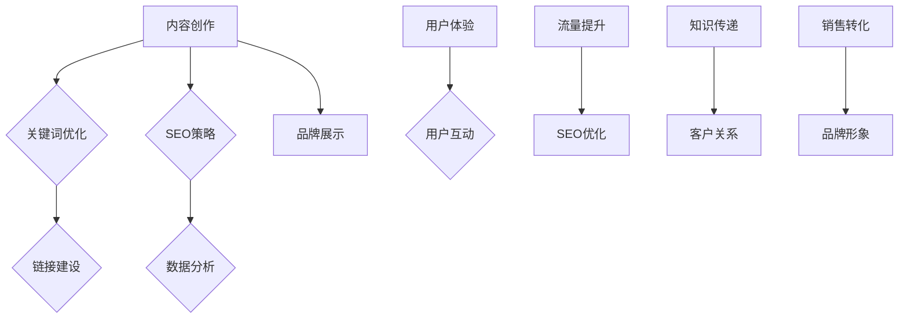

                 

### 如何打造有影响力的企业博客

> **关键词：** 企业博客、影响力、内容策略、SEO优化、用户体验、案例分析

**摘要：** 在数字化时代，企业博客已经成为展示品牌形象、传递知识和建立客户关系的重要渠道。本文将详细探讨如何通过精心策划和执行，打造一个具有高影响力和用户粘性的企业博客。内容包括博客定位、内容创作、SEO优化、用户体验以及案例分析等关键环节。

### 1. 背景介绍

随着互联网的普及，企业博客已经不再是一个简单的在线日记或信息发布平台。它成为了一种重要的营销工具，可以帮助企业提升品牌知名度、增强客户关系、促进销售转化。以下是企业博客的几个重要作用：

- **品牌展示**：通过博客，企业可以展示自身的专业能力和行业地位，增强品牌形象。
- **知识传递**：博客是企业分享知识和经验的重要渠道，有助于建立行业权威。
- **客户互动**：博客可以与客户建立直接联系，收集反馈，提高客户满意度。
- **SEO优化**：高质量的博客内容有助于提高网站在搜索引擎中的排名，吸引更多流量。

尽管企业博客具有诸多优势，但在实际操作中，许多企业面临着如何提升博客影响力和用户粘性的挑战。本文将围绕这一核心问题，提供一系列切实可行的策略和建议。

### 2. 核心概念与联系

#### 企业博客的基本概念

**定义：** 企业博客是指企业或个人在互联网上发布文章、分享知识和经验的平台。它通常包括文章、评论、分类、标签等功能。

**组成部分：**

- **内容创作**：包括文章、图片、视频等多种形式。
- **用户互动**：如评论、点赞、分享等功能。
- **SEO优化**：通过关键词、链接等技术手段提高搜索引擎排名。
- **数据分析**：分析博客流量、用户行为等数据，优化内容策略。

#### 企业博客与SEO的关系

**定义：** SEO（搜索引擎优化）是指通过提高网站在搜索引擎中的排名，吸引更多访问者的过程。

**关系：**

- **内容质量**：高质量的内容是SEO成功的关键。搜索引擎偏好权威、原创且具有价值的文章。
- **关键词优化**：合理选择和布局关键词，提高文章在搜索结果中的可见性。
- **链接建设**：内部链接和外部链接都能提高网站权威性和搜索引擎排名。

**Mermaid 流程图：**



### 3. 核心算法原理 & 具体操作步骤

#### 内容创作算法

**步骤：**

1. **主题定位**：确定博客主题，确保内容具有针对性和专业性。
2. **研究关键词**：使用工具分析目标受众，选择合适的关键词。
3. **内容撰写**：遵循结构化原则，确保文章逻辑清晰、信息丰富。
4. **内容优化**：对文章进行SEO优化，提高搜索引擎可见性。
5. **内容发布**：定期发布文章，保持博客活跃度。

**算法原理：**

- **A/B测试**：通过对比不同内容的表现，优化内容策略。
- **数据分析**：分析用户行为和反馈，持续改进内容质量。

#### SEO优化算法

**步骤：**

1. **关键词研究**：选择目标关键词，确保与内容相关。
2. **内容优化**：在文章中合理布局关键词，提高搜索引擎友好性。
3. **链接建设**：建立内部链接和外部链接，提高网站权威性。
4. **数据分析**：监控SEO效果，调整优化策略。

**算法原理：**

- **PageRank**：基于链接分析，评估网页的重要性。
- **内容质量**：高质量的内容是SEO成功的关键。

### 4. 数学模型和公式 & 详细讲解 & 举例说明

#### 关键词密度计算公式

$$
关键词密度 = \frac{关键词出现次数}{文章总字数} \times 100\%
$$

**详细讲解：**

- **关键词出现次数**：在文章中实际出现的关键词数量。
- **文章总字数**：文章的总字数。

**举例说明：**

假设一篇文章总共有1000字，其中关键词“SEO优化”出现了20次，那么该关键词的密度为：

$$
关键词密度 = \frac{20}{1000} \times 100\% = 2\%
$$

#### 页面流量预测公式

$$
页面流量 = 关键词搜索量 \times 关键词密度 \times 转化率
$$

**详细讲解：**

- **关键词搜索量**：某个关键词在搜索引擎中的搜索量。
- **关键词密度**：文章中关键词的密度。
- **转化率**：访问者转化为客户或潜在客户的比率。

**举例说明：**

假设关键词“SEO优化”的搜索量为1000次/天，关键词密度为2%，转化率为5%，那么该页面的流量为：

$$
页面流量 = 1000 \times 2\% \times 5\% = 10 \text{ 人/天}
$$

### 5. 项目实战：代码实际案例和详细解释说明

#### 开发环境搭建

**步骤：**

1. **环境配置**：安装Node.js、MySQL、WordPress等必要软件。
2. **数据库设置**：配置MySQL数据库，设置用户和权限。
3. **网站搭建**：使用WordPress搭建博客网站，安装必要的插件。

**代码示例：**

```sql
-- 创建数据库
CREATE DATABASE blog_db CHARACTER SET utf8 COLLATE utf8_general_ci;

-- 创建用户
CREATE USER 'blog_user'@'localhost' IDENTIFIED BY 'password';

-- 授权用户
GRANT ALL PRIVILEGES ON blog_db.* TO 'blog_user'@'localhost';

-- 刷新权限
FLUSH PRIVILEGES;
```

#### 源代码详细实现和代码解读

**WordPress配置文件：**

```php
<?php
/**
 * WordPress basic configuration
 *
 * The $wordpress_config array holds the essential features needed to
 * initialize a WordPress environment.
 */
$wordpress_config = array(
    'blogname' => '企业博客',
    'blogdescription' => '分享专业知识和行业见解',
    'dbhost' => 'localhost',
    'dbuser' => 'blog_user',
    'dbpassword' => 'password',
    'dbname' => 'blog_db',
    'wp_url' => 'https://www.example.com',
    'home' => $wp_url,
    'admin_email' => 'admin@example.com',
    'table_prefix' => 'wp_',
    'wp_version' => '6.1',
    'locale' => 'zh_CN',
);

/**
 * WordPress environment setup
 *
 * Sets up WordPress vars and included files.
 *
 * @since 1.5.0
 *
 * @uses wp_load_components()
 * @uses wp_register()
 * @uses wp_load_db()
 * @uses wp_load_plugins()
 * @uses wp_load_api()
 * @uses wp_start_front()
 */
require_once(ABSPATH . 'wp-settings.php');
```

**代码解读：**

- **数据库配置**：配置数据库连接信息，如主机、用户、密码和数据库名称。
- **基本设置**：配置博客名称、描述、URL、管理员邮箱等基本信息。
- **初始化**：加载WordPress核心组件，如数据库、插件等。

#### 代码解读与分析

**代码分析：**

- **数据库连接**：使用MySQL数据库连接，确保WordPress能够正确访问数据库。
- **基本设置**：初始化WordPress环境，包括URL、管理员邮箱等基本信息。
- **插件加载**：加载必要的插件，如SEO插件、备份插件等。

通过以上配置，企业可以快速搭建一个基础的博客网站。在实际应用中，可以根据需求进行功能扩展和定制化开发。

### 6. 实际应用场景

企业博客的应用场景非常广泛，以下是一些常见的实际应用场景：

- **市场推广**：通过博客发布产品信息、促销活动等，吸引潜在客户。
- **知识分享**：分享行业知识、案例分析、经验分享，提高品牌影响力。
- **客户服务**：提供在线客服、FAQ解答等，增强客户满意度。
- **员工培训**：发布培训课程、内部资料，提升员工技能和知识水平。

通过这些应用场景，企业博客不仅能够提升品牌知名度，还能为客户提供有价值的信息，建立长期稳定的客户关系。

### 7. 工具和资源推荐

#### 学习资源推荐

- **书籍**：
  - 《SEO实战密码》
  - 《内容营销实战手册》
  - 《Web前端技术手册》
- **论文**：
  - 《搜索引擎优化技术》
  - 《内容策略：如何构建和优化你的博客内容》
  - 《用户体验要素》
- **博客**：
  - SEO中国行
  - 腾讯博客
  - 知乎专栏
- **网站**：
  - WordPress官网
  - SEOmoz
  - Ahrefs

#### 开发工具框架推荐

- **开发工具**：
  - Visual Studio Code
  - Sublime Text
  - Atom
- **框架**：
  - WordPress
  - Joomla
  - Drupal
- **SEO插件**：
  - Yoast SEO
  - All in One SEO Pack
  - Rank Math

#### 相关论文著作推荐

- **论文**：
  - 《搜索引擎优化：理论与实践》
  - 《内容营销与SEO策略》
  - 《Web用户体验：设计与交互》
- **著作**：
  - 《互联网营销：实战案例与策略》
  - 《数字化营销：技术和实践》
  - 《用户体验要素：交互设计之父的秘籍》

### 8. 总结：未来发展趋势与挑战

随着互联网的持续发展和用户需求的不断变化，企业博客面临着新的发展趋势和挑战。以下是未来可能的发展趋势和应对策略：

#### 发展趋势：

1. **个性化内容**：根据用户行为和偏好，提供个性化的内容推荐。
2. **多媒体内容**：结合图片、视频、音频等多种形式，提高用户体验。
3. **社交化互动**：利用社交媒体平台，扩大博客的传播范围和影响力。
4. **人工智能应用**：利用人工智能技术，提高内容创作和优化的效率。

#### 挑战：

1. **内容质量**：在竞争激烈的市场中，保持高质量的内容创作是关键。
2. **SEO优化**：随着搜索引擎算法的不断更新，需要不断调整SEO策略。
3. **用户互动**：提高用户参与度和满意度，建立长期稳定的客户关系。

### 9. 附录：常见问题与解答

#### Q：如何选择博客平台？

A：选择博客平台时，应考虑以下几个因素：

- **功能需求**：根据业务需求选择合适的平台，如WordPress、Joomla、Drupal等。
- **易用性**：考虑平台的易用性，确保团队能够轻松管理和维护博客。
- **扩展性**：选择具有良好扩展性的平台，方便后续功能扩展和定制化开发。

#### Q：如何优化博客SEO？

A：以下是一些常见的SEO优化策略：

- **关键词研究**：选择与内容相关且搜索量较高的关键词。
- **内容优化**：在文章中合理布局关键词，提高搜索引擎友好性。
- **链接建设**：建立内部链接和外部链接，提高网站权威性。
- **数据分析**：定期分析SEO效果，调整优化策略。

#### Q：如何提高博客用户互动？

A：以下是一些提高博客用户互动的方法：

- **互动式内容**：发布互动式内容，如调查问卷、投票等。
- **评论管理**：积极回复用户评论，提高用户参与度。
- **社交媒体分享**：鼓励用户通过社交媒体平台分享博客内容。
- **定期互动**：定期举办线上活动，如问答、直播等，与用户互动。

### 10. 扩展阅读 & 参考资料

- **扩展阅读**：
  - 《数字营销概论》
  - 《搜索引擎营销技术》
  - 《社交媒体营销策略》
- **参考资料**：
  - WordPress官方文档
  - SEOmoz博客
  - Ahrefs教程
- **官方网站**：
  - WordPress官网
  - SEOmoz官网
  - Ahrefs官网

### 作者

**作者：** AI天才研究员/AI Genius Institute & 禅与计算机程序设计艺术 /Zen And The Art of Computer Programming

