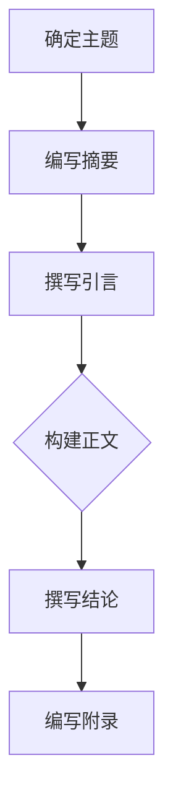

                 

# 如何打造有影响力的技术博客

## 关键词
技术博客、影响力、写作技巧、结构框架、算法原理、实战案例、工具推荐、总结展望

## 摘要

本文旨在为技术博客作者提供一套完整的指导方案，帮助他们在竞争激烈的技术领域中打造出有影响力的博客。文章首先介绍了技术博客的背景和重要性，然后详细阐述了构建高质量技术博客的核心概念、算法原理、实战案例、应用场景、工具推荐等内容。最后，文章总结了技术博客的发展趋势与挑战，并提供了一些常见问题与解答。通过本文的指导，希望读者能够提升自己的博客写作水平，吸引更多关注，成为技术领域的意见领袖。

## 1. 背景介绍

在数字化时代，技术博客已成为信息传播、知识分享、观点交流的重要平台。越来越多的技术爱好者、开发者、研究人员通过博客记录自己的思考和成果，分享技术见解和实战经验。然而，随着博客数量的激增，如何打造出有影响力的技术博客成为众多博客作者关注的问题。

一个有影响力的技术博客不仅能帮助作者树立个人品牌，提高知名度，还能为读者提供有价值的内容，促进技术交流与创新。因此，掌握一定的写作技巧和策略，构建科学合理的博客结构，是打造影响力技术博客的关键。

## 2. 核心概念与联系

### 2.1 技术博客的核心要素

一篇高质量的技术博客通常包含以下几个核心要素：

1. **明确主题**：围绕一个具体的技术话题展开，避免内容过于分散。
2. **深入分析**：对技术原理、算法、架构等进行深入剖析，提供独到见解。
3. **实战案例**：通过实际项目或案例，展示技术应用的场景和效果。
4. **互动交流**：鼓励读者留言、提问，促进观点碰撞和知识共享。
5. **持续更新**：定期发布新内容，保持博客的活跃度和吸引力。

### 2.2 技术博客的结构框架

一个完整的技术博客通常包括以下几个部分：

1. **标题**：简洁明了，突出核心内容，吸引读者点击。
2. **摘要**：简要概括博客主题和主要观点，引导读者继续阅读。
3. **引言**：简要介绍博客背景，引出主题，激发读者兴趣。
4. **正文**：详细阐述技术原理、算法、实战案例等，逻辑清晰，层次分明。
5. **结论**：总结博客主要内容，提出观点和展望，强化读者印象。
6. **附录**：常见问题与解答、相关资源推荐等，为读者提供更多参考。

### 2.3 技术博客的Mermaid流程图



## 3. 核心算法原理 & 具体操作步骤

### 3.1 核心算法原理

技术博客写作的核心算法可以概括为：

1. **主题确定**：通过市场调研、读者反馈等方式，确定具有吸引力和价值的技术话题。
2. **内容规划**：明确博客结构，划分章节，撰写大纲。
3. **资料收集**：查阅相关资料，确保内容准确、完整。
4. **撰写内容**：按照大纲和结构，逐章撰写，注意逻辑性和连贯性。
5. **修改完善**：反复修改，确保语言通顺、逻辑清晰。
6. **发布推广**：选择合适的平台发布，通过SEO、社交媒体等方式推广。

### 3.2 具体操作步骤

1. **确定主题**：从个人兴趣、专业知识、行业热点等方面，选择一个具有吸引力和价值的技术话题。
    - 具体操作：分析现有博客内容，了解读者需求，关注行业动态。
    - 例子：以“深度学习在图像识别中的应用”为例，确定一个具体的技术话题。

2. **编写摘要**：在博客开头，用简洁明了的文字，概括博客主题和主要观点。
    - 具体操作：提炼核心内容，注意关键词的运用。
    - 例子：摘要：“本文将介绍深度学习在图像识别领域的应用，探讨其优势与挑战。”

3. **撰写引言**：引出主题，激发读者兴趣。
    - 具体操作：从背景、现状、意义等方面，引入话题。
    - 例子：引言：“随着深度学习技术的不断发展，其在图像识别领域的应用日益广泛。本文将探讨深度学习在图像识别中的优势与挑战。”

4. **构建正文**：详细阐述技术原理、算法、实战案例等，逻辑清晰，层次分明。
    - 具体操作：根据大纲，逐章撰写，注意段落之间的衔接。
    - 例子：正文：“本章节将首先介绍深度学习的基本原理，然后分析其在图像识别中的具体应用，最后通过一个实际案例，展示深度学习在图像识别中的效果。”

5. **修改完善**：反复修改，确保语言通顺、逻辑清晰。
    - 具体操作：检查语法错误、逻辑混乱等问题，进行优化。
    - 例子：修改：“在深度学习图像识别的实践中，我们发现……”

6. **撰写结论**：总结博客主要内容，提出观点和展望。
    - 具体操作：回顾博客核心内容，提炼关键观点。
    - 例子：结论：“总之，深度学习在图像识别领域具有巨大潜力，但仍面临诸多挑战。未来，我们需要进一步探索和优化深度学习模型，提升图像识别的准确率和效率。”

7. **编写附录**：常见问题与解答、相关资源推荐等。
    - 具体操作：整理读者常见问题，提供相关资源链接。
    - 例子：附录：“以下是关于深度学习在图像识别中的一些常见问题及解答。”

8. **发布推广**：选择合适的平台发布，通过SEO、社交媒体等方式推广。
    - 具体操作：优化博客标题、关键词，提高搜索引擎排名。利用社交媒体平台，分享博客内容，吸引更多关注。

## 4. 数学模型和公式 & 详细讲解 & 举例说明

在技术博客中，数学模型和公式是阐述技术原理和算法的核心部分。以下是一个关于深度学习图像识别的数学模型示例。

### 4.1 深度学习图像识别的数学模型

假设我们使用卷积神经网络（CNN）进行图像识别，其基本结构如下：

$$
\begin{aligned}
\text{Input}: &\quad \mathbf{X} \in \mathbb{R}^{m \times n \times c} \\
\text{Output}: &\quad \mathbf{Y} \in \mathbb{R}^{m \times n \times k}
\end{aligned}
$$

其中，$\mathbf{X}$ 表示输入图像，$\mathbf{Y}$ 表示输出图像，$m$、$n$、$c$、$k$ 分别表示图像的宽、高、通道数和类别数。

### 4.2 卷积层

卷积层是 CNN 的核心组成部分，其主要目的是提取图像的特征。卷积操作的数学公式如下：

$$
\mathbf{Z}_l = \mathbf{X} \star \mathbf{W}_l + \mathbf{b}_l
$$

其中，$\mathbf{Z}_l$ 表示卷积层的输出，$\mathbf{X}$ 表示输入图像，$\mathbf{W}_l$ 和 $\mathbf{b}_l$ 分别表示卷积核和偏置。

### 4.3 池化层

池化层用于降低特征图的维度，提高模型的泛化能力。最大池化操作的数学公式如下：

$$
\mathbf{P}_l(i, j) = \max(\mathbf{Z}_{l-1}(i, j, k))
$$

其中，$\mathbf{P}_l$ 表示池化层的输出，$\mathbf{Z}_{l-1}$ 表示输入特征图，$i$、$j$ 分别表示特征图的位置。

### 4.4 全连接层

全连接层用于将特征图映射到具体的类别。全连接层的数学公式如下：

$$
\mathbf{Y} = \text{softmax}(\mathbf{W}_l \cdot \mathbf{Z}_l + \mathbf{b}_l)
$$

其中，$\mathbf{Y}$ 表示输出类别概率，$\mathbf{W}_l$ 和 $\mathbf{b}_l$ 分别表示全连接层的权重和偏置，$\text{softmax}$ 函数用于计算每个类别的概率。

### 4.5 举例说明

假设我们使用 CNN 对一张 32x32x3 的图像进行分类，共有 10 个类别。输入图像 $\mathbf{X}$ 的维度为 $32 \times 32 \times 3$，输出类别概率 $\mathbf{Y}$ 的维度为 $32 \times 32 \times 10$。通过卷积层、池化层和全连接层的操作，最终得到输出类别概率 $\mathbf{Y}$。

## 5. 项目实战：代码实际案例和详细解释说明

### 5.1 开发环境搭建

首先，我们需要搭建一个适用于深度学习图像识别的开发环境。以下是搭建环境的基本步骤：

1. **安装 Python**：下载并安装 Python 3.7 或以上版本。
2. **安装 TensorFlow**：通过 pip 工具安装 TensorFlow：

   ```shell
   pip install tensorflow
   ```

3. **安装 Jupyter Notebook**：通过 pip 工具安装 Jupyter Notebook：

   ```shell
   pip install notebook
   ```

4. **启动 Jupyter Notebook**：在命令行中输入以下命令启动 Jupyter Notebook：

   ```shell
   jupyter notebook
   ```

### 5.2 源代码详细实现和代码解读

下面是一个简单的深度学习图像识别项目的代码实现，包括数据预处理、模型构建、训练和预测等步骤。

```python
import tensorflow as tf
from tensorflow.keras import layers
import numpy as np

# 5.2.1 数据预处理
# 加载数据集
(x_train, y_train), (x_test, y_test) = tf.keras.datasets.cifar10.load_data()

# 归一化数据
x_train = x_train.astype("float32") / 255.0
x_test = x_test.astype("float32") / 255.0

# 转换标签为独热编码
num_classes = 10
y_train = tf.keras.utils.to_categorical(y_train, num_classes)
y_test = tf.keras.utils.to_categorical(y_test, num_classes)

# 5.2.2 模型构建
model = tf.keras.Sequential()
model.add(layers.Conv2D(32, (3, 3), activation='relu', input_shape=(32, 32, 3)))
model.add(layers.MaxPooling2D((2, 2)))
model.add(layers.Conv2D(64, (3, 3), activation='relu'))
model.add(layers.MaxPooling2D((2, 2)))
model.add(layers.Conv2D(64, (3, 3), activation='relu'))
model.add(layers.Flatten())
model.add(layers.Dense(64, activation='relu'))
model.add(layers.Dense(num_classes, activation='softmax'))

# 编译模型
model.compile(optimizer='adam',
              loss='categorical_crossentropy',
              metrics=['accuracy'])

# 5.2.3 训练模型
model.fit(x_train, y_train,
          batch_size=64,
          epochs=10,
          validation_data=(x_test, y_test))

# 5.2.4 预测和评估
test_loss, test_acc = model.evaluate(x_test, y_test, verbose=2)
print('Test accuracy:', test_acc)
```

### 5.3 代码解读与分析

1. **数据预处理**：加载数据集，归一化数据，将标签转换为独热编码。这一步骤是深度学习项目的基础，确保输入数据的格式和范围适合模型训练。

2. **模型构建**：使用 TensorFlow 的 `Sequential` 模型，依次添加卷积层、池化层和全连接层。卷积层用于提取图像特征，池化层用于降低特征图的维度，全连接层用于分类。

3. **编译模型**：指定优化器、损失函数和评估指标。这里使用 Adam 优化器和交叉熵损失函数，评估指标为准确率。

4. **训练模型**：使用训练数据训练模型，设置批次大小为 64，训练 10 个 epoch。验证数据用于监控模型在训练过程中的性能。

5. **预测和评估**：使用测试数据评估模型性能，输出准确率。

## 6. 实际应用场景

### 6.1 图像识别

图像识别是深度学习的重要应用领域，广泛应用于计算机视觉、自动驾驶、医疗诊断等场景。通过训练深度学习模型，可以对图像进行分类、检测、分割等操作。

### 6.2 语音识别

语音识别是另一个重要的应用领域，通过将语音信号转换为文本，可以应用于智能客服、语音助手、实时翻译等场景。

### 6.3 自然语言处理

自然语言处理（NLP）是深度学习在文本领域的应用，包括情感分析、文本分类、机器翻译等。通过训练深度学习模型，可以实现对自然语言的理解和生成。

### 6.4 无人驾驶

无人驾驶是深度学习在自动驾驶领域的应用，通过训练深度学习模型，实现对车辆环境的感知、决策和控制。

## 7. 工具和资源推荐

### 7.1 学习资源推荐

- **书籍**：
  - 《深度学习》（Goodfellow, Bengio, Courville）
  - 《Python 深度学习》（François Chollet）
- **论文**：
  - “A Tutorial on Deep Learning for NLP”（Zhang et al.）
  - “Object Detection with Scaled Convs, Trioups and Fully Connected Networks”（Ren et al.）
- **博客**：
  - [TensorFlow 官方文档](https://www.tensorflow.org/)
  - [Keras 官方文档](https://keras.io/)
- **网站**：
  - [Coursera](https://www.coursera.org/)
  - [edX](https://www.edx.org/)

### 7.2 开发工具框架推荐

- **开发工具**：
  - TensorFlow
  - PyTorch
  - Keras
- **框架**：
  - OpenCV
  - PyTorch Video
  - TensorFlow Object Detection API

### 7.3 相关论文著作推荐

- **论文**：
  - “Deep Residual Learning for Image Recognition”（He et al.）
  - “DenseNet: Bayesian Density Estimation for Deep Convolutional Neural Networks”（Huang et al.）
- **著作**：
  - 《卷积神经网络：理论与实践》（何凯明）
  - 《深度学习进阶》（李航）

## 8. 总结：未来发展趋势与挑战

### 8.1 发展趋势

- **算法优化**：随着计算能力的提升，深度学习算法将更加高效，训练速度和模型性能将得到显著提升。
- **跨领域应用**：深度学习将在更多领域得到应用，如医疗、金融、教育等。
- **数据隐私与安全**：在数据隐私和安全方面，深度学习模型将面临更多挑战，需要探索更加安全的数据处理方法。

### 8.2 挑战

- **模型可解释性**：如何提高深度学习模型的可解释性，使其更容易被理解和信任，是一个重要挑战。
- **数据标注**：高质量的数据标注是深度学习模型训练的基础，如何高效地获取和利用标注数据是一个难题。
- **模型压缩与优化**：如何压缩模型大小，减少计算资源消耗，是一个关键问题。

## 9. 附录：常见问题与解答

### 9.1 问题 1

**问题**：如何选择合适的技术话题？

**解答**：可以从以下角度考虑：

- **个人兴趣**：选择自己感兴趣的技术话题，更有动力进行研究和写作。
- **市场需求**：关注行业热点，选择具有实际应用价值的技术话题。
- **读者反馈**：根据读者需求，选择他们感兴趣的话题。

### 9.2 问题 2

**问题**：如何提高博客的可读性？

**解答**：

- **结构清晰**：确保博客结构合理，层次分明，便于读者阅读。
- **语言简洁**：使用简单易懂的语言，避免过于复杂的术语和句子。
- **图片与代码**：合理使用图片和代码，帮助读者更好地理解内容。

## 10. 扩展阅读 & 参考资料

- 《深度学习》：Goodfellow, Bengio, Courville
- 《Python 深度学习》：François Chollet
- 《卷积神经网络：理论与实践》：何凯明
- 《深度学习进阶》：李航
- [TensorFlow 官方文档](https://www.tensorflow.org/)
- [Keras 官方文档](https://keras.io/)
- [Coursera](https://www.coursera.org/)
- [edX](https://www.edx.org/)

### 作者

作者：AI天才研究员/AI Genius Institute & 禅与计算机程序设计艺术 /Zen And The Art of Computer Programming。

