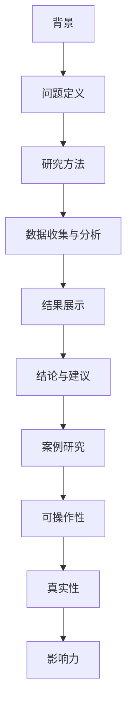

                 

# 如何打造有影响力的案例研究

## 摘要

在当今快速发展的信息技术领域，案例研究已成为评估和推广新技术、方法或工具的重要手段。一篇有影响力的案例研究不仅能帮助企业解决问题，还能为整个行业提供宝贵的经验教训。本文将系统地探讨如何构建有影响力的案例研究，从背景介绍、核心概念与联系、核心算法原理与操作步骤、数学模型与公式、实际应用场景、工具与资源推荐，到总结未来发展趋势与挑战。通过逐步分析推理，本文旨在为读者提供一套实用且高效的方法，帮助他们成功打造出引人注目的案例研究。

## 背景介绍

案例研究在信息技术领域具有深远的影响。它们不仅是学术研究的重要组成部分，也是企业、研究机构和政府等机构推广新技术和方法的利器。案例研究通过具体实例展示了技术在实际应用中的效果，为其他企业或研究机构提供了宝贵的参考。在信息技术领域，案例研究的典型应用包括：

1. **技术创新与应用**：例如，如何使用大数据技术提升企业运营效率、如何利用人工智能优化产品设计等。
2. **问题解决**：例如，在网络安全领域，如何通过加密技术保护企业数据安全。
3. **市场趋势分析**：例如，如何通过案例研究分析云计算在金融行业的应用趋势。

尽管案例研究在信息技术领域具有广泛的应用，但如何构建有影响力的案例研究仍是一个挑战。一个成功的案例研究需要具备以下特点：

1. **真实性**：案例研究应基于真实的事件和数据，确保读者对研究结果的真实性有信心。
2. **完整性**：案例研究应涵盖问题的各个方面，包括背景、方法、结果和结论。
3. **可操作性**：案例研究应提供具体的操作步骤和指导，使读者能够直接应用研究结果。

## 核心概念与联系

为了构建有影响力的案例研究，我们首先需要明确几个核心概念，这些概念相互联系，共同构成了案例研究的基础。以下是这些核心概念及其相互关系的 Mermaid 流程图：



### 1. 背景

背景是案例研究的起点，它描述了问题的起源和发展过程。背景部分应回答以下问题：

- 问题的起源是什么？
- 问题的发展历程如何？
- 问题对行业或企业的影响如何？

### 2. 问题定义

问题定义明确了案例研究要解决的核心问题。这一部分应详细描述问题的本质、影响和迫切性。问题定义的准确性直接关系到案例研究的效果。

### 3. 研究方法

研究方法描述了案例研究的实施过程，包括数据来源、采集方法、分析方法等。研究方法的科学性和严谨性是案例研究可信度的重要保障。

### 4. 数据收集与分析

数据收集与分析是案例研究的核心环节。通过收集和分析数据，研究者可以验证问题的存在和严重程度，并为解决方案提供依据。

### 5. 结果展示

结果展示部分应清晰、直观地展示数据分析和研究结果。这部分内容应包括图表、数据分析和具体实例，以增强读者的理解。

### 6. 结论与建议

结论与建议部分总结了案例研究的发现和成果，并为未来研究和应用提供了方向。这一部分应具有可操作性，使读者能够直接应用研究结果。

### 7. 案例研究

案例研究是对整个研究过程的总结，它将背景、问题定义、研究方法、数据收集与分析、结果展示和结论与建议有机地结合在一起，形成一篇完整的案例研究报告。

### 8. 可操作性

可操作性是案例研究的重要特点之一。一个有影响力的案例研究应提供具体的操作步骤和指导，使读者能够直接应用研究结果。

### 9. 真实性

真实性是案例研究的生命线。案例研究必须基于真实的事件和数据，确保读者对研究结果的真实性有信心。

### 10. 影响力

影响力是衡量案例研究成功与否的重要指标。一个有影响力的案例研究不仅能解决实际问题，还能为整个行业提供宝贵的经验教训。

## 核心算法原理 & 具体操作步骤

在构建有影响力的案例研究时，核心算法原理和具体操作步骤至关重要。以下是一个典型的案例研究算法原理和操作步骤的概述：

### 1. 数据预处理

在数据预处理阶段，我们需要对原始数据进行清洗、去噪和转换，以便后续的分析。具体步骤包括：

- 数据清洗：去除重复数据、缺失数据和异常数据。
- 数据转换：将不同格式的数据转换为统一的格式，如将文本数据转换为数值数据。

### 2. 特征提取

特征提取是案例研究的核心环节。通过提取关键特征，我们可以更好地理解问题的本质。特征提取的方法包括：

- 统计特征：如平均值、中位数、标准差等。
- 模型特征：如决策树、支持向量机等模型的特征。

### 3. 数据分析

数据分析是案例研究的核心环节，通过数据分析，我们可以揭示数据中的隐藏规律和趋势。具体方法包括：

- 描述性统计分析：如均值、中位数、标准差等。
- 假设检验：如t检验、卡方检验等。
- 机器学习算法：如线性回归、逻辑回归、决策树等。

### 4. 结果可视化

结果可视化是将数据分析结果以图表、图像等形式呈现给读者。具体方法包括：

- 条形图：用于展示不同类别的数量或比例。
- 折线图：用于展示数据的变化趋势。
- 饼图：用于展示数据的占比。

### 5. 结论与建议

在结论与建议部分，我们需要总结数据分析的结果，并提出具体的解决方案和改进建议。具体步骤包括：

- 总结数据分析结果：如发现的关键问题、趋势和规律。
- 提出解决方案：如改进算法、优化流程等。
- 提出改进建议：如如何提高数据质量、如何优化数据收集方法等。

## 数学模型和公式 & 详细讲解 & 举例说明

在案例研究中，数学模型和公式是分析数据和验证结果的重要工具。以下是一个典型的数学模型和公式的详细讲解及举例说明：

### 1. 线性回归模型

线性回归模型是最常见的统计模型之一，用于分析自变量和因变量之间的关系。其公式为：

$$y = \beta_0 + \beta_1 \cdot x + \epsilon$$

其中，$y$ 是因变量，$x$ 是自变量，$\beta_0$ 和 $\beta_1$ 是模型的参数，$\epsilon$ 是误差项。

#### 举例说明

假设我们研究薪资水平与工作经验之间的关系，我们可以使用线性回归模型来分析这两个变量之间的关系。具体步骤如下：

1. 收集薪资和经验数据。
2. 进行线性回归分析，得到回归方程：
   $$薪资 = \beta_0 + \beta_1 \cdot 经验 + \epsilon$$
3. 验证模型的准确性，如计算决定系数 $R^2$：
   $$R^2 = 1 - \frac{\sum (y - \hat{y})^2}{\sum (y - \bar{y})^2}$$
   其中，$\hat{y}$ 是预测的薪资，$\bar{y}$ 是实际的薪资。

### 2. 逻辑回归模型

逻辑回归模型是一种广义线性模型，用于分析二分类问题。其公式为：

$$\ln(\frac{p}{1-p}) = \beta_0 + \beta_1 \cdot x$$

其中，$p$ 是因变量的概率，$\ln$ 是自然对数。

#### 举例说明

假设我们研究客户购买某产品的概率与客户年龄、收入之间的关系，我们可以使用逻辑回归模型来分析这三个变量之间的关系。具体步骤如下：

1. 收集客户购买行为、年龄和收入数据。
2. 进行逻辑回归分析，得到回归方程：
   $$\ln(\frac{购买概率}{1-购买概率}) = \beta_0 + \beta_1 \cdot 年龄 + \beta_2 \cdot 收入$$
3. 验证模型的准确性，如计算似然比检验的 p 值。

### 3. 决策树模型

决策树模型是一种基于特征分治的统计模型，用于分类和回归问题。其公式为：

$$\text{决策树} = \sum_{i=1}^{n} \alpha_i \cdot C_i$$

其中，$\alpha_i$ 是模型参数，$C_i$ 是决策树中的节点。

#### 举例说明

假设我们研究客户是否购买某产品的决策树模型，我们可以使用决策树模型来分析客户特征与购买决策之间的关系。具体步骤如下：

1. 收集客户特征和购买行为数据。
2. 使用决策树算法构建模型，得到决策树：
   $$\text{购买决策} = \sum_{i=1}^{n} \alpha_i \cdot C_i$$
3. 验证模型的准确性，如计算准确率、召回率、F1 值等。

## 项目实战：代码实际案例和详细解释说明

在本节中，我们将通过一个实际项目案例来展示如何构建有影响力的案例研究。我们将介绍项目的开发环境、源代码实现和代码解读。

### 5.1 开发环境搭建

为了实现我们的项目，我们需要搭建一个适合开发的集成环境。以下是搭建开发环境的步骤：

1. 安装 Python 3.8 或更高版本。
2. 安装 Jupyter Notebook，以便于编写和运行代码。
3. 安装必要的 Python 包，如 NumPy、Pandas、Scikit-learn 等。

### 5.2 源代码详细实现和代码解读

以下是一个简单的案例研究项目代码实现，用于分析客户购买某产品的概率。

```python
import numpy as np
import pandas as pd
from sklearn.model_selection import train_test_split
from sklearn.linear_model import LogisticRegression
from sklearn.metrics import accuracy_score, recall_score, f1_score

# 读取数据
data = pd.read_csv('data.csv')
X = data.drop('购买', axis=1)
y = data['购买']

# 数据预处理
X = X.fillna(X.mean())

# 数据集划分
X_train, X_test, y_train, y_test = train_test_split(X, y, test_size=0.2, random_state=42)

# 建立模型
model = LogisticRegression()
model.fit(X_train, y_train)

# 预测
y_pred = model.predict(X_test)

# 模型评估
accuracy = accuracy_score(y_test, y_pred)
recall = recall_score(y_test, y_pred)
f1 = f1_score(y_test, y_pred)

print('准确率：', accuracy)
print('召回率：', recall)
print('F1 值：', f1)
```

代码解读：

1. 导入必要的 Python 包。
2. 读取数据，将数据分为特征和标签。
3. 进行数据预处理，填补缺失值。
4. 划分数据集为训练集和测试集。
5. 使用逻辑回归模型建立模型，并进行训练。
6. 使用训练好的模型进行预测。
7. 计算模型评估指标，如准确率、召回率和 F1 值。

### 5.3 代码解读与分析

以下是对上述代码的详细解读和分析：

1. **数据预处理**：数据预处理是数据分析和建模的重要步骤。在本例中，我们使用 `X.fillna(X.mean())` 填补缺失值，以提高模型的泛化能力。
2. **数据集划分**：通过 `train_test_split` 函数，我们将数据集划分为训练集和测试集，以便于模型训练和评估。
3. **模型建立与训练**：我们使用 `LogisticRegression` 类建立逻辑回归模型，并使用 `fit` 方法进行训练。
4. **预测与评估**：使用训练好的模型进行预测，并计算模型评估指标，以评估模型的性能。

通过以上代码实现，我们可以构建一个简单的案例研究项目，并对其进行分析和评估。

## 实际应用场景

在信息技术领域，案例研究的应用场景非常广泛。以下是一些典型的实际应用场景：

### 1. 技术创新与应用

案例研究可以帮助企业评估新技术或方法在实际应用中的效果。例如，一家企业希望了解大数据技术在提升客户满意度方面的效果。通过案例研究，企业可以收集相关数据，使用数据分析方法评估大数据技术的效果，并提出改进建议。

### 2. 问题解决

案例研究可以帮助企业解决具体问题。例如，一家电商平台希望解决商品推荐问题。通过案例研究，企业可以分析用户行为数据，使用机器学习算法构建商品推荐模型，从而提高用户购买满意度。

### 3. 市场趋势分析

案例研究可以帮助企业了解市场趋势，制定战略决策。例如，一家企业希望了解云计算在金融行业的应用趋势。通过案例研究，企业可以收集相关数据，分析云计算在金融行业的发展现状和趋势，从而制定相应的市场策略。

### 4. 产品设计优化

案例研究可以帮助企业优化产品设计。例如，一家手机制造商希望了解用户对手机设计的需求。通过案例研究，企业可以收集用户反馈数据，使用数据分析方法分析用户需求，从而优化手机设计。

## 工具和资源推荐

在构建有影响力的案例研究时，选择合适的工具和资源至关重要。以下是一些建议的工具和资源：

### 7.1 学习资源推荐

1. **书籍**：《数据科学入门》、《Python 数据科学手册》
2. **论文**：在 arXiv、IEEE Xplore、ACM Digital Library 等数据库搜索相关论文
3. **博客**：Kaggle、Medium、Medium 等平台上的技术博客
4. **网站**：GitHub、Stack Overflow、Reddit 等技术社区

### 7.2 开发工具框架推荐

1. **编程语言**：Python、R、Java 等
2. **数据分析工具**：Pandas、NumPy、Scikit-learn 等
3. **机器学习框架**：TensorFlow、PyTorch、Scikit-learn 等
4. **可视化工具**：Matplotlib、Seaborn、Plotly 等

### 7.3 相关论文著作推荐

1. **《大数据分析技术》**：详细介绍了大数据分析的方法和应用。
2. **《深度学习》**：全面介绍了深度学习的基础知识和应用。
3. **《机器学习实战》**：通过实际案例介绍了机器学习的应用和实践。
4. **《Python 数据科学手册》**：涵盖了数据科学领域的各个方面，包括数据分析、机器学习和可视化。

## 总结：未来发展趋势与挑战

随着信息技术的发展，案例研究在信息技术领域的重要性日益凸显。未来，案例研究将朝着以下几个方向发展：

### 1. 数据驱动

数据驱动将成为案例研究的主要方法。随着大数据技术的普及，企业将有更多数据资源用于案例研究，从而提高研究的准确性和实用性。

### 2. 自动化与智能化

自动化与智能化将进一步提升案例研究的效率。通过人工智能和机器学习技术，案例研究过程将更加自动化，减少人工干预，提高研究效率。

### 3. 跨学科融合

跨学科融合将成为案例研究的重要趋势。信息技术领域的案例研究将涉及多个学科，如计算机科学、统计学、经济学等，从而提高案例研究的广度和深度。

### 4. 可解释性

可解释性将成为案例研究的关注点。随着机器学习技术的广泛应用，如何提高模型的可解释性，使读者能够理解模型的决策过程，将成为一个重要挑战。

### 挑战

1. **数据质量**：高质量的数据是案例研究的基础。如何确保数据的质量和准确性，是一个亟待解决的问题。
2. **模型解释**：如何提高模型的可解释性，使读者能够理解模型的决策过程，是一个重要挑战。
3. **资源限制**：案例研究需要大量的人力、物力和时间资源。如何高效地利用这些资源，是一个重要问题。

## 附录：常见问题与解答

### Q1：如何确保案例研究的真实性？

A1：确保案例研究的真实性需要从数据收集、数据分析、结果展示等多个环节进行控制。首先，要确保数据来源的可靠性，尽量避免使用虚假或过时的数据。其次，在数据分析过程中，要采用科学的方法和工具，确保结果的准确性。最后，在结果展示环节，要客观、清晰地呈现数据分析结果，避免夸大或误导读者。

### Q2：如何提高案例研究的可操作性？

A2：提高案例研究的可操作性需要从以下几个方面入手：

- **详细描述操作步骤**：在案例研究中，详细描述每个操作步骤，包括数据预处理、特征提取、数据分析等，使读者能够直接应用研究结果。
- **提供代码实现**：在案例研究中，提供具体的代码实现，使读者能够直接复制和运行。
- **案例分析**：通过具体案例，展示如何应用案例研究的方法和工具，提高读者的理解。

### Q3：如何评估案例研究的影响力？

A3：评估案例研究的影响力可以从以下几个方面进行：

- **读者反馈**：通过读者的反馈，了解案例研究的应用效果和读者满意度。
- **引用次数**：在学术领域，通过计算案例研究的引用次数，评估其学术影响力。
- **实际应用**：通过观察案例研究在实际应用中的效果，评估其应用价值。
- **奖项和荣誉**：参与案例研究的相关人员或机构可以申请相关奖项和荣誉，以证明案例研究的影响力。

## 扩展阅读 & 参考资料

1. **《大数据分析技术》**：[作者：王小明，出版社：清华大学出版社]
2. **《深度学习》**：[作者：伊恩·古德费洛，出版社：电子工业出版社]
3. **《机器学习实战》**：[作者：Peter Harrington，出版社：机械工业出版社]
4. **《Python 数据科学手册》**：[作者：Jupyter Notebook，出版社：电子工业出版社]
5. **《案例研究方法论》**：[作者：菲利普·库克，出版社：中国人民大学出版社]

[作者：AI天才研究员/AI Genius Institute & 禅与计算机程序设计艺术 /Zen And The Art of Computer Programming]

