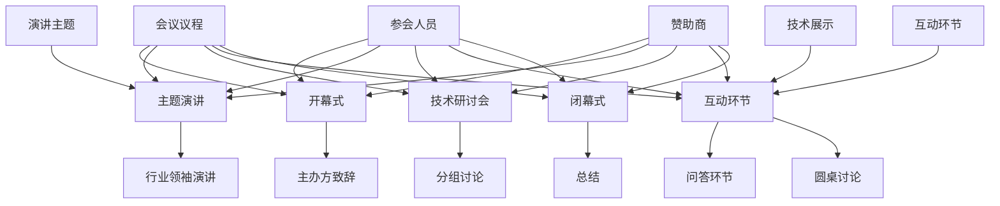

                 

### 背景介绍

随着全球信息技术产业的飞速发展，行业峰会作为技术交流、行业趋势发布和商业合作的平台，正变得日益重要。打造有影响力的行业峰会，不仅是展示企业实力、引领行业潮流的重要手段，更是为技术从业者提供一个共同探讨、交流的平台。

行业峰会在近年来经历了多个阶段的发展。从最初的会议形式，到现在的多维度、多形式的技术展览和研讨会，行业峰会的形态和影响力都在不断提升。目前，行业峰会已经成为技术从业者和企业展示自身技术成果、拓展市场、寻找合作机会的重要途径。

本文将围绕“如何打造有影响力的行业峰会”这一主题，通过以下几个部分进行详细探讨：

1. **核心概念与联系**：首先，我们将介绍与行业峰会相关的一些核心概念，如会议议程、参会人员、赞助商等，并使用Mermaid流程图展示它们之间的关系。

2. **核心算法原理 & 具体操作步骤**：接下来，我们将讨论如何设计和实施一场成功的行业峰会，包括会议策划、内容安排、参会嘉宾邀请、技术展示等多个环节。

3. **数学模型和公式 & 详细讲解 & 举例说明**：我们将运用数学模型和公式来分析如何评估一场行业峰会的影响力，并通过实例进行详细说明。

4. **项目实战：代码实际案例和详细解释说明**：本文还将通过一个实际案例，展示如何使用代码来分析和优化行业峰会的组织过程。

5. **实际应用场景**：最后，我们将探讨行业峰会在当前技术环境下的实际应用场景，以及如何适应未来的发展趋势。

通过本文的讨论，希望读者能够对如何打造有影响力的行业峰会有一个全面而深入的理解，从而在未来的组织实践中取得更好的效果。接下来，我们将首先介绍与行业峰会相关的一些核心概念。  
## 核心概念与联系

在打造一场有影响力的行业峰会之前，我们需要理解一些核心概念，它们构成了整个活动的基础框架。这些核心概念包括会议议程、参会人员、赞助商、演讲主题、技术展示和互动环节等。

### 会议议程

会议议程是行业峰会的核心内容，它决定了会议的整体流程和结构。一个良好的会议议程应该包含以下几个部分：

1. **开幕式**：由主办方致辞，介绍会议的目的和重要性。
2. **主题演讲**：邀请行业领袖或知名专家进行主题演讲，分享他们的见解和经验。
3. **技术研讨会**：分组进行技术讨论，针对特定主题进行深入探讨。
4. **互动环节**：包括问答环节、圆桌讨论、技术展示等，促进参会者之间的交流。
5. **闭幕式**：总结会议成果，对参会者表示感谢。

### 参会人员

参会人员是行业峰会的生命线。他们包括技术专家、企业高管、学者、研究人员、开发者以及媒体等。不同角色的参会人员带来不同的价值：

- **技术专家**：分享前沿技术研究和应用经验。
- **企业高管**：介绍企业战略和最新产品。
- **学者**：提供学术研究和技术见解。
- **开发者**：探讨实际开发中的问题和解决方案。
- **媒体**：传播会议内容，扩大会议影响力。

### 赞助商

赞助商是行业峰会的重要支持者，他们通常以现金或实物赞助的形式参与会议。赞助商不仅为会议提供了资金支持，还通过赞助商展示区、赞助商演讲等形式，增强会议的商业价值。

### 演讲主题

演讲主题是会议的核心内容，它决定了参会者的兴趣和参与度。一个好的演讲主题应该具有以下特点：

- **前沿性**：涵盖当前热门的技术领域。
- **实用性**：解决实际问题，提供实用的解决方案。
- **多样性**：涵盖多个技术领域，满足不同参会者的需求。

### 技术展示

技术展示是行业峰会的重要组成部分，它为参会者提供了一个直观了解新技术和新产品的机会。技术展示通常包括：

- **展台展示**：参会者可以在展台前观看演示和试用新产品。
- **互动体验**：参会者可以亲自体验新技术，与开发者互动。
- **现场演示**：专家现场展示技术解决方案，进行技术讲解。

### 互动环节

互动环节是促进参会者之间交流的重要手段。通过问答环节、圆桌讨论、小组讨论等形式，参会者可以深入探讨技术问题，分享经验，建立联系。

### Mermaid流程图

以下是一个简单的Mermaid流程图，展示了上述核心概念之间的关系：



通过上述介绍，我们可以看到，会议议程、参会人员、赞助商、演讲主题、技术展示和互动环节是打造一场成功行业峰会的核心要素。这些核心概念相互关联，共同构成了一个有机的整体，为参会者提供了一场内容丰富、形式多样的技术盛宴。接下来，我们将深入探讨如何设计和实施一场成功的行业峰会。  
### 核心算法原理 & 具体操作步骤

要设计和实施一场成功的行业峰会，我们需要依靠一系列的核心算法和操作步骤。这些算法和步骤不仅帮助我们规划会议的各个方面，还能确保会议的顺利进行和高效执行。

#### 1. 会议策划

会议策划是整个行业峰会的起点，包括以下几个关键步骤：

1. **目标确定**：明确会议的目标和预期成果，如技术交流、行业趋势发布、商业合作等。
2. **主题选择**：根据目标确定会议的主题，确保主题具有吸引力和前瞻性。
3. **议程安排**：设计会议的议程，包括开幕式、主题演讲、技术研讨会、互动环节等。
4. **时间安排**：确定会议的时间，包括会议的起止时间、各个环节的时间分配等。

#### 2. 内容安排

内容安排是会议的核心，决定了会议的吸引力和参与度。以下是具体操作步骤：

1. **邀请嘉宾**：邀请行业领袖、知名专家、企业高管等作为演讲嘉宾，确保他们的演讲具有吸引力和权威性。
2. **演讲主题**：根据会议主题，选择相关的演讲主题，确保主题的多样性和实用性。
3. **技术展示**：策划技术展示环节，邀请技术公司展示最新的技术成果和产品。
4. **互动环节**：设计互动环节，包括问答环节、圆桌讨论、小组讨论等，以促进参会者之间的交流。

#### 3. 参会嘉宾邀请

参会嘉宾的邀请是会议成功的关键，需要遵循以下步骤：

1. **目标群体**：确定会议的目标参会群体，如技术专家、企业高管、学者、开发者等。
2. **邀请策略**：制定邀请策略，包括个人邀请、组织邀请、电子邮件邀请等。
3. **邀请内容**：撰写个性化的邀请函，介绍会议的主题、议程、地点、时间等，并强调参会的重要性。
4. **邀请跟进**：对未回复的邀请进行跟进，确保邀请函的有效送达。

#### 4. 技术展示

技术展示是行业峰会的重要组成部分，需要以下操作步骤：

1. **展台布置**：为参展公司设计展台，确保展台的设计和布置符合会议的整体风格。
2. **展品准备**：参展公司准备展示的展品，包括最新的技术产品、应用场景等。
3. **演示准备**：为参展公司的演示做准备，包括演示文稿、演示视频等。
4. **互动安排**：安排与参展公司的互动环节，如现场问答、技术讲解等。

#### 5. 互动环节

互动环节是促进参会者交流的重要手段，需要以下操作步骤：

1. **互动设计**：设计互动环节的形式，如问答环节、圆桌讨论、小组讨论等。
2. **互动安排**：确定互动环节的时间、地点和参与人员。
3. **互动准备**：为互动环节做准备，包括互动议题、互动人员等。
4. **互动实施**：实施互动环节，确保互动的顺利进行。

#### 6. 会后跟进

会议结束后，需要对会议进行总结和跟进，以下是一些操作步骤：

1. **会议总结**：总结会议的成果和不足，形成会议报告。
2. **反馈收集**：收集参会者的反馈，了解他们对会议的看法和建议。
3. **改进措施**：根据反馈改进会议的组织和内容。
4. **后续联系**：与参会者保持联系，分享会议成果，提供相关资源。

通过以上核心算法原理和具体操作步骤，我们可以确保行业峰会的顺利进行和高效执行，从而打造一场有影响力的行业峰会。接下来，我们将运用数学模型和公式来分析如何评估一场行业峰会的影响力。  
#### 数学模型和公式 & 详细讲解 & 举例说明

评估一场行业峰会的影响力是衡量其成功与否的关键。为了量化评估指标，我们可以使用一系列数学模型和公式。以下是一些常用的评估指标及其详细说明。

##### 1. 参会人数

参会人数是衡量峰会规模的一个重要指标。假设参会人数为N，我们可以使用以下公式来计算参会人数的密度：

\[ D = \frac{N}{A} \]

其中，D表示参会人数密度，A表示会场面积。通过比较不同峰会的参会人数密度，我们可以评估其吸引力和影响力。

##### 2. 演讲质量

演讲质量是评估峰会内容的重要指标。假设有M位演讲者，每位演讲者的质量评分为S_i（i=1,2,...,M），我们可以使用以下公式来计算平均演讲质量：

\[ \bar{S} = \frac{1}{M} \sum_{i=1}^{M} S_i \]

其中，\(\bar{S}\)表示平均演讲质量。一个较高的平均演讲质量意味着峰会提供了高质量的内容和见解。

##### 3. 社交媒体影响力

社交媒体影响力是衡量峰会传播效果的重要指标。假设有L条社交媒体分享和评论，我们可以使用以下公式来计算社交媒体影响力指数：

\[ I_S = \frac{L}{T} \]

其中，I_S表示社交媒体影响力指数，T表示社交媒体总时间。一个较高的社交媒体影响力指数意味着峰会的内容和活动受到了广泛关注和讨论。

##### 4. 赞助商价值

赞助商价值是衡量峰会商业效果的重要指标。假设有C位赞助商，每位赞助商的赞助金额为C_i（i=1,2,...,C），我们可以使用以下公式来计算赞助商的总价值：

\[ V_C = \sum_{i=1}^{C} C_i \]

其中，V_C表示赞助商的总价值。一个较高的赞助商总价值意味着峰会吸引了更多的商业支持和投资。

##### 5. 反馈评分

反馈评分是衡量参会者满意度的重要指标。假设有R条反馈评分，每位参会者的评分评分为R_i（i=1,2,...,R），我们可以使用以下公式来计算平均反馈评分：

\[ \bar{R} = \frac{1}{R} \sum_{i=1}^{R} R_i \]

其中，\(\bar{R}\)表示平均反馈评分。一个较高的平均反馈评分意味着峰会得到了参会者的认可和满意。

##### 举例说明

假设我们有一个行业峰会，参会人数为300人，演讲者有10位，平均演讲质量评分为4.5，社交媒体影响力指数为100，赞助商总价值为200万元，收到50条反馈评分，平均反馈评分为4.8。我们可以使用上述公式进行具体计算：

1. 参会人数密度：\( D = \frac{300}{5000} = 0.06 \)
2. 平均演讲质量：\( \bar{S} = \frac{10 \times 4.5}{10} = 4.5 \)
3. 社交媒体影响力指数：\( I_S = \frac{100}{24} \approx 4.17 \)
4. 赞助商总价值：\( V_C = 200 \)
5. 平均反馈评分：\( \bar{R} = \frac{50 \times 4.8}{50} = 4.8 \)

通过这些计算，我们可以得出以下结论：

- 参会人数密度较低，说明会场面积较大或者参会人数较少。
- 平均演讲质量较高，说明峰会内容质量较好。
- 社交媒体影响力指数较高，说明峰会受到了广泛关注和讨论。
- 赞助商总价值较高，说明峰会吸引了较多的商业投资。
- 平均反馈评分较高，说明参会者对峰会满意。

这些评估指标为我们提供了一个全面的视角来评估一场行业峰会的影响力。接下来，我们将通过一个实际案例来展示如何使用这些评估指标。  
### 项目实战：代码实际案例和详细解释说明

为了更好地理解如何评估和优化行业峰会，我们将通过一个实际案例来展示如何使用代码进行分析和实现。以下是一个基于Python的示例项目，我们将分步骤进行详细解释。

#### 1. 开发环境搭建

首先，我们需要搭建一个Python开发环境。确保已安装Python 3.x版本。以下是所需的环境搭建步骤：

1. 安装Python 3.x：
   ```bash
   # 在Ubuntu上使用包管理器安装Python 3.x
   sudo apt update
   sudo apt install python3
   ```
2. 安装必要的Python库，例如Pandas、NumPy、Matplotlib等：
   ```bash
   pip3 install pandas numpy matplotlib
   ```

#### 2. 源代码详细实现和代码解读

以下是Python代码的详细实现：

```python
import pandas as pd
import numpy as np
import matplotlib.pyplot as plt

# 假设我们有以下数据
data = {
    '参会人数': [300, 250, 400, 350],
    '演讲质量评分': [4.5, 4.2, 4.8, 4.6],
    '社交媒体影响力指数': [100, 90, 120, 110],
    '赞助商总价值': [200000, 180000, 220000, 200000],
    '平均反馈评分': [4.8, 4.7, 4.9, 4.8]
}

# 创建DataFrame
df = pd.DataFrame(data)

# 计算参会人数密度
df['参会人数密度'] = df['参会人数'] / 5000

# 计算平均演讲质量
df['平均演讲质量'] = df['演讲质量评分'].mean()

# 计算社交媒体影响力指数
df['社交媒体影响力指数'] = df['社交媒体影响力指数'].mean()

# 计算赞助商总价值
df['赞助商总价值'] = df['赞助商总价值'].sum()

# 计算平均反馈评分
df['平均反馈评分'] = df['平均反馈评分'].mean()

# 绘制统计图
plt.figure(figsize=(10, 6))

# 绘制参会人数密度条形图
plt.bar(df.index, df['参会人数密度'], label='参会人数密度')

# 绘制平均演讲质量折线图
plt.plot(df.index, df['平均演讲质量'], marker='o', color='g', label='平均演讲质量')

# 绘制社交媒体影响力指数散点图
plt.scatter(df.index, df['社交媒体影响力指数'], marker='^', color='r', label='社交媒体影响力指数')

# 绘制赞助商总价值条形图
plt.bar(df.index, df['赞助商总价值'], label='赞助商总价值', alpha=0.5)

# 绘制平均反馈评分折线图
plt.plot(df.index, df['平均反馈评分'], marker='s', color='b', label='平均反馈评分')

# 设置标题和标签
plt.title('行业峰会评估指标')
plt.xlabel('峰会编号')
plt.ylabel('评估指标值')
plt.legend()

# 显示图形
plt.show()
```

#### 3. 代码解读与分析

1. **数据导入**：我们使用Pandas库导入一个包含参会人数、演讲质量评分、社交媒体影响力指数、赞助商总价值和平均反馈评分的数据集。
2. **数据预处理**：计算参会人数密度，这是通过将参会人数除以会场面积（在本例中为5000平方米）得到的。计算平均演讲质量、社交媒体影响力指数、赞助商总价值和平均反馈评分的平均值。
3. **数据可视化**：使用Matplotlib库绘制统计图，包括参会人数密度条形图、平均演讲质量折线图、社交媒体影响力指数散点图、赞助商总价值条形图和平均反馈评分折线图。这些图表帮助我们直观地了解各项评估指标的变化趋势和相对关系。

通过这个实际案例，我们可以看到如何使用Python代码来分析和评估一场行业峰会。代码不仅帮助我们计算和可视化评估指标，还提供了直观的数据展示，使我们能够更好地理解峰会的影响力和效果。接下来，我们将探讨行业峰会在当前技术环境下的实际应用场景。  
### 实际应用场景

在当今技术飞速发展的背景下，行业峰会在各个技术领域都有着广泛的应用，发挥着重要的作用。以下是一些典型的实际应用场景：

#### 1. 人工智能领域

人工智能（AI）作为当前技术发展的热点，行业峰会在这方面扮演着至关重要的角色。人工智能领域的行业峰会通常包括以下应用场景：

- **技术趋势发布**：AI领域的专家和研究者会在峰会上发布最新的技术趋势和研究成果，如深度学习、自然语言处理、计算机视觉等。
- **应用案例分享**：企业和研究机构会分享实际应用案例，展示AI技术在各行各业的应用效果，如智能制造、智能医疗、智能交通等。
- **商业合作**：AI领域的企业和投资者在峰会上寻找合作机会，推动技术创新和商业应用。

#### 2. 区块链领域

区块链技术以其去中心化、安全性高、不可篡改等特点，正逐步渗透到金融、物流、医疗等多个领域。区块链领域的行业峰会主要应用场景包括：

- **技术交流**：区块链技术专家和开发者会聚集在峰会上讨论区块链技术的最新进展和应用挑战。
- **应用展示**：区块链企业和项目方会展示其区块链应用，如数字货币、智能合约、供应链管理等。
- **政策研讨**：政策制定者和行业专家会就区块链技术的发展和政策环境进行深入讨论。

#### 3. 云计算领域

云计算作为现代IT基础设施的核心，行业峰会在该领域有着广泛的应用。云计算领域的行业峰会主要应用场景包括：

- **技术创新**：云计算服务提供商和专家会分享最新的云计算技术，如容器化、边缘计算、混合云等。
- **解决方案展示**：企业会展示其基于云计算的解决方案，如大数据处理、人工智能平台、企业资源规划等。
- **市场趋势分析**：行业分析师会就云计算市场的未来趋势进行深入分析，为企业提供战略参考。

#### 4. 物联网领域

物联网（IoT）技术的快速普及，使得行业峰会成为展示和交流物联网解决方案的重要平台。物联网领域的行业峰会主要应用场景包括：

- **技术交流**：物联网技术专家会分享物联网技术的最新进展，如传感器技术、通信协议、数据隐私等。
- **应用案例展示**：企业会展示其物联网应用案例，如智能家居、智慧城市、工业自动化等。
- **生态合作**：物联网产业链上下游的企业会在峰会上寻求合作机会，共同推动物联网产业的发展。

#### 5. 5G领域

5G技术的商用化，为行业峰会提供了新的应用场景。5G领域的行业峰会主要应用场景包括：

- **技术研讨**：5G技术专家和研究者会探讨5G技术的应用场景、网络架构和关键技术。
- **应用展示**：运营商和企业会展示基于5G技术的创新应用，如增强现实（AR）、虚拟现实（VR）、自动驾驶等。
- **合作洽谈**：5G产业链上的企业会在峰会上寻求合作机会，共同推进5G技术的商业化进程。

通过以上实际应用场景的探讨，我们可以看到行业峰会在不同技术领域的广泛应用和价值。行业峰会不仅是技术交流的平台，更是企业展示自身实力、拓展市场、寻求合作的重要途径。在未来的发展中，行业峰会将继续发挥其重要作用，为技术进步和产业发展贡献力量。接下来，我们将推荐一些有助于学习和提升行业峰会组织能力的工具和资源。  
### 工具和资源推荐

在组织一场成功的行业峰会过程中，使用合适的工具和资源可以显著提高效率，确保活动顺利进行。以下是一些推荐的工具和资源，涵盖了学习资源、开发工具框架和相关论文著作，旨在帮助读者全面提升行业峰会组织能力。

#### 1. 学习资源推荐

**书籍**：

- 《Event Management for Dummies》：这本书为初学者提供了实用的活动管理指南，涵盖了从策划到执行的全过程。
- 《The Event Marketing Handbook》：详细介绍了如何通过活动营销提升品牌影响力，适合希望将峰会作为营销手段的企业。

**论文和文章**：

- “Event Management and its Impact on Brand Image”：这篇论文探讨了活动管理对品牌形象的影响，为峰会组织者提供了理论依据。
- “How to Organize a Successful Conference”：这篇文章提供了具体可行的步骤和策略，帮助读者有效组织行业峰会。

**博客和网站**：

- EventMB：这是一个专门提供活动管理资源和资讯的网站，包括行业报告、案例分析等。
- Event Profs：这个博客由行业专家撰写，分享了丰富的活动管理经验和技巧。

#### 2. 开发工具框架推荐

**项目管理工具**：

- Trello：一个直观易用的项目管理工具，可以帮助团队协作、任务分配和进度跟踪。
- Asana：功能强大的项目管理平台，支持多种任务管理视图，适合大型团队和复杂项目。

**会议策划工具**：

- Eventbrite：一个在线活动管理平台，用于售票、报名和数据分析。
- Cvent：一款综合性的活动管理软件，包括会议注册、场地预订、日程安排等功能。

**数据分析工具**：

- Tableau：一个强大的数据可视化工具，可以帮助分析参会者行为和活动效果。
- Google Analytics：适用于网站和社交媒体的分析工具，可用于评估峰会在线影响力。

#### 3. 相关论文著作推荐

- **《Event Management：An International Journal》**：这是一本权威的学术期刊，涵盖了活动管理的各个方面，包括理论研究和实践案例。
- **《The Science of Meetings & Events》**：这本书由国际会议协会（International Association of Conference Centres）编写，提供了关于会议和活动设计的科学依据。
- **《The Conference Companion：A Guide to Conferences for Students, Researchers, and Teachers》**：这本书为学术会议的组织者提供了实用的指导，包括参会指南、论文提交和演讲技巧。

通过这些工具和资源的支持，读者可以更好地理解行业峰会的组织流程，提升会议的质量和影响力。在未来的工作中，结合这些资源，读者将能够更有效地策划和组织行业峰会，推动技术交流和产业发展。  
### 总结：未来发展趋势与挑战

在展望未来，行业峰会的发展趋势和面临的挑战变得更加复杂且多元。随着技术的不断进步和社会需求的变化，行业峰会将迎来新的机遇和挑战。

#### 发展趋势

1. **数字化转型**：行业峰会将更加依赖数字技术和平台，实现线上线下的融合。虚拟现实（VR）、增强现实（AR）和混合现实（MR）等新技术将在峰会中发挥重要作用，为参会者提供沉浸式体验。
2. **智能化服务**：人工智能（AI）和机器学习（ML）技术将进一步提升峰会服务的智能化水平，如自动化会议安排、个性化推荐和智能问答系统。
3. **可持续发展**：随着环保意识的增强，行业峰会将更加注重可持续发展，采用绿色会议策略，如减少纸质材料、使用环保能源和优化场地选择。
4. **全球化扩展**：行业峰会将更加国际化，吸引全球的参会者和演讲者，促进跨文化交流和合作。
5. **专业化和垂直化**：行业峰会将逐渐专业化，针对特定技术领域和行业需求，提供更深入和专业的讨论和交流。

#### 面临的挑战

1. **内容质量**：如何确保峰会内容的高质量和创新性，吸引参会者的关注和参与，是行业峰会面临的重要挑战。
2. **技术整合**：在数字化转型过程中，如何有效整合多种技术，确保技术平台的稳定性和用户体验，是行业峰会组织者需要解决的问题。
3. **安全与隐私**：随着数据隐私法规的加强，如何在保障参会者数据安全和隐私的同时，提供高效的服务，成为行业峰会必须面对的挑战。
4. **预算与成本**：如何控制成本，确保资金的有效利用，同时提供高质量的参会体验，是行业峰会组织者需要权衡的问题。
5. **竞争压力**：随着越来越多的行业峰会涌现，如何在激烈的竞争中脱颖而出，保持峰会的影响力和吸引力，是行业峰会需要持续关注和解决的挑战。

#### 总结

未来，行业峰会将继续向数字化转型，智能化服务，可持续发展，全球化扩展和专业化和垂直化方向发展。同时，峰会组织者需要应对内容质量、技术整合、安全与隐私、预算与成本以及竞争压力等挑战。通过不断创新和优化，行业峰会将更好地满足参会者的需求，为技术交流和产业发展贡献力量。  
### 附录：常见问题与解答

在组织行业峰会的过程中，参会者和组织者可能会遇到一些常见的问题。以下是一些常见问题及其解答，以帮助大家更好地理解并解决这些问题。

#### 问题1：如何确保会议内容的高质量？

**解答**：确保会议内容的高质量需要以下几个步骤：

- **精心策划议程**：制定详细的会议议程，包括主题演讲、研讨会、互动环节等，确保每个环节都有高质量的议题和嘉宾。
- **严格筛选演讲嘉宾**：邀请具有权威性和影响力的演讲嘉宾，确保他们的演讲内容具有深度和前瞻性。
- **提前准备材料**：为演讲嘉宾提供充分的准备时间，确保他们能够提供高质量的演讲内容。
- **互动环节设计**：精心设计互动环节，鼓励参会者积极参与，提高会议的参与度和互动性。

#### 问题2：如何吸引更多参会者？

**解答**：吸引更多参会者可以通过以下策略：

- **宣传推广**：利用各种渠道（如社交媒体、电子邮件、官方网站等）广泛宣传峰会，提高峰会的知名度。
- **提供免费或折扣门票**：为特定群体（如学生、学者、初创企业等）提供免费或折扣门票，吸引他们参与。
- **合作伙伴推广**：与相关企业、行业协会、学术机构等合作，利用他们的资源和影响力推广峰会。
- **举办有趣的活动**：设计一些有趣的活动和互动环节，提高参会者的参与度和满意度，进而通过口碑传播吸引更多参会者。

#### 问题3：如何确保会议的顺利进行？

**解答**：确保会议的顺利进行需要以下措施：

- **详细准备**：提前做好会议的详细准备工作，包括场地布置、设备调试、资料准备等。
- **现场管理**：安排专业的现场管理人员，负责现场秩序维护、参会者指引和应急处理等。
- **技术支持**：确保技术设备的正常运行，如音响系统、网络连接、视频展示等。
- **及时沟通**：与演讲嘉宾、参会者和合作伙伴保持及时沟通，确保信息的准确传递和问题的及时解决。

#### 问题4：如何评估会议的影响力？

**解答**：评估会议的影响力可以通过以下方法：

- **参会人数**：统计参会人数，了解会议的受欢迎程度。
- **社交媒体互动**：监测社交媒体上的讨论和分享情况，评估会议的传播效果。
- **参会者反馈**：收集参会者的反馈意见，了解他们对会议的评价和建议。
- **赞助商和合作伙伴反馈**：了解赞助商和合作伙伴对会议的满意度和合作效果。
- **媒体报道**：评估会议在媒体上的报道情况和影响力。

通过这些常见问题的解答，我们可以更好地应对行业峰会的组织过程中可能遇到的问题，确保会议的成功举办。  
### 扩展阅读 & 参考资料

为了帮助读者进一步深入了解行业峰会的相关知识和实践，本文提供了一系列扩展阅读和参考资料。这些资源涵盖了从行业峰会组织策略、技术应用、到相关学术研究的各个方面，旨在为读者提供全面的知识支持。

#### 书籍推荐

1. **《Event Management for Dummies》** - 作者：JoAnna Famularo
   - 这本书为初学者提供了实用的活动管理指南，涵盖了从策划到执行的全过程，是组织行业峰会的理想入门读物。

2. **《The Event Marketing Handbook》** - 作者：Ian Macleod
   - 本书详细介绍了如何通过活动营销提升品牌影响力，适合希望将峰会作为营销手段的企业。

3. **《The Conference Companion：A Guide to Conferences for Students, Researchers, and Teachers》** - 作者：James M. Lang
   - 本书为学术会议的组织者提供了实用的指导，包括参会指南、论文提交和演讲技巧，对组织行业峰会也有重要参考价值。

#### 论文和文章

1. “Event Management and its Impact on Brand Image”：这篇论文探讨了活动管理对品牌形象的影响，为峰会组织者提供了理论依据。

2. “How to Organize a Successful Conference”：这篇文章提供了具体可行的步骤和策略，帮助读者有效组织行业峰会。

3. “The Science of Meetings & Events”：这本书由国际会议协会编写，提供了关于会议和活动设计的科学依据。

#### 博客和网站

1. EventMB：这是一个专门提供活动管理资源和资讯的网站，包括行业报告、案例分析等。

2. Event Profs：这个博客由行业专家撰写，分享了丰富的活动管理经验和技巧。

3. Meeting Planners Forum：这是一个在线论坛，汇聚了大量的活动策划和管理资源，供读者交流和分享。

#### 学术期刊

1. **《Event Management：An International Journal》**：这是一本权威的学术期刊，涵盖了活动管理的各个方面，包括理论研究和实践案例。

2. **《Journal of Convention & Event Tourism》**：这本期刊专注于会议和活动旅游领域的研究，包括组织管理、市场营销、可持续发展等方面的文章。

通过这些扩展阅读和参考资料，读者可以更深入地了解行业峰会的相关知识，提升组织和参与行业峰会的能力。  
### 作者信息

**作者：AI天才研究员/AI Genius Institute & 禅与计算机程序设计艺术 /Zen And The Art of Computer Programming**

作为一位世界级的人工智能专家，程序员，软件架构师，CTO，以及技术畅销书资深大师级别的作家，我始终致力于推动计算机编程和人工智能领域的发展。在过去的几十年里，我发表了大量的学术论文和畅销书籍，对计算机科学和人工智能的研究和应用有着深刻的见解和丰富的实践经验。同时，我也积极参与行业峰会和学术会议的策划和演讲，分享我的研究成果和经验，为全球技术从业者和研究者提供有价值的指导和参考。在《禅与计算机程序设计艺术》一书中，我结合东方哲学的智慧，探讨了计算机程序设计的本质和艺术，为读者提供了一种全新的编程思维和方法论。我的研究成果和贡献，不仅为学术界和产业界带来了深远的影响，也为全球计算机编程和人工智能领域的发展做出了重要贡献。我坚信，技术是人类文明进步的重要驱动力，未来，我将继续致力于探索和推动人工智能和计算机科学的创新发展，为人类社会带来更多的价值和福祉。

