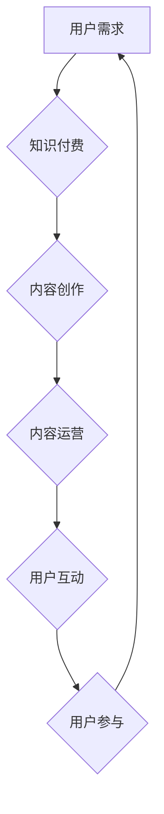

                 

# 如何打造知识付费的在线学习社区

> **关键词：**知识付费、在线学习社区、用户参与、内容运营、互动机制、算法推荐、商业模式

**摘要：**本文将从多个角度探讨如何打造一个成功的知识付费在线学习社区。我们将分析市场背景、用户需求、核心概念、算法原理、实际操作步骤、应用场景以及未来发展。文章旨在为有意从事知识付费领域的个人和团队提供有价值的参考。

## 1. 背景介绍

近年来，随着互联网技术的飞速发展和在线教育的普及，知识付费市场逐渐兴起。知识付费作为一种新的商业模式，已逐渐成为众多企业和创业者关注的热点。它不仅满足了人们对于知识获取的多样化需求，也为内容创作者提供了新的收入来源。

### 市场背景

1. **在线教育市场快速增长**：随着互联网的普及，在线教育市场迎来了爆发式增长。根据统计数据显示，2021年中国在线教育市场规模已突破5000亿元，预计未来还将持续增长。

2. **知识付费需求日益旺盛**：人们对于高质量、专业化的知识需求不断增长，特别是在职场技能、兴趣爱好等方面。

3. **移动端普及**：智能手机的普及使得人们可以随时随地进行学习，为知识付费提供了便利。

### 用户需求

1. **个性化学习**：用户希望根据自己的需求和兴趣选择适合自己的学习内容和方式。

2. **实时互动**：用户渴望与讲师和其他学员进行实时交流，获取反馈和帮助。

3. **优质内容**：用户对知识付费内容的质量有较高的要求，希望得到专业、实用的指导。

## 2. 核心概念与联系

### 在线学习社区

在线学习社区是一个基于互联网平台的学习交流环境，旨在为用户提供学习资源、互动交流和学习评价等服务。它通常包括以下核心组成部分：

1. **学习资源**：包括课程视频、文档、练习题等，是用户学习的基础。

2. **用户参与**：用户可以发布问题、讨论、评价，与其他用户进行互动。

3. **内容运营**：社区管理者负责维护社区秩序、推广优质内容、处理用户反馈等。

4. **互动机制**：包括问答、讨论区、直播间等，促进用户之间的交流和互动。

### 知识付费

知识付费是指在互联网平台上，用户为获取高质量的知识内容而支付费用的商业模式。其核心包括：

1. **付费内容**：包括课程、专栏、直播等，由专业讲师或机构提供。

2. **用户付费**：用户根据自己的需求购买知识付费内容。

3. **内容变现**：讲师或机构通过知识付费获取收入。

### Mermaid 流程图



## 3. 核心算法原理 & 具体操作步骤

### 算法原理

1. **用户画像**：通过用户的浏览记录、购买历史、评论等数据，构建用户画像。

2. **内容推荐**：基于用户画像和内容特征，使用协同过滤、基于内容的推荐算法等进行内容推荐。

3. **互动分析**：分析用户在社区中的互动行为，如提问、回答、点赞等，为内容创作者提供反馈。

### 具体操作步骤

1. **数据采集**：收集用户的注册信息、浏览记录、购买记录等数据。

2. **用户画像构建**：使用数据挖掘技术，对用户数据进行分析，构建用户画像。

3. **内容推荐**：结合用户画像和内容特征，使用推荐算法生成推荐列表。

4. **互动分析**：分析用户互动数据，为内容创作者提供反馈。

## 4. 数学模型和公式 & 详细讲解 & 举例说明

### 数学模型

1. **协同过滤算法**：

   - **用户相似度计算**：$$ similarity(u_i, u_j) = \frac{\sum_{k \in R} r_{ik}r_{jk}}{\sqrt{\sum_{k \in R} r_{ik}^2 \sum_{k \in R} r_{jk}^2}} $$

   - **预测评分**：$$ \hat{r}_{ij} = \sum_{k \in R} r_{ik} similarity(i, j) $$

2. **基于内容的推荐算法**：

   - **内容特征提取**：$$ \textbf{c}_i = [c_{i1}, c_{i2}, ..., c_{in}]^T $$

   - **内容相似度计算**：$$ similarity(\textbf{c}_i, \textbf{c}_j) = \cos(\textbf{c}_i, \textbf{c}_j) = \frac{\textbf{c}_i \cdot \textbf{c}_j}{\lVert \textbf{c}_i \rVert \lVert \textbf{c}_j \rVert} $$

   - **预测评分**：$$ \hat{r}_{ij} = \sum_{k \in R} c_{ik} similarity(i, j) $$

### 举例说明

假设有两个用户A和B，他们分别对5个课程进行了评分。根据他们的评分数据，我们可以使用协同过滤算法计算他们的相似度，并根据相似度预测他们未评分的课程评分。

用户A的评分向量：$$ \textbf{r}_A = [4, 3, 5, 2, 4] $$

用户B的评分向量：$$ \textbf{r}_B = [4, 5, 3, 4, 5] $$

用户A和用户B的相似度：$$ similarity(A, B) = \frac{4 \cdot 4 + 3 \cdot 5 + 5 \cdot 3 + 2 \cdot 4 + 4 \cdot 5}{\sqrt{4^2 + 3^2 + 5^2 + 2^2 + 4^2} \sqrt{4^2 + 5^2 + 3^2 + 4^2 + 5^2}} \approx 0.74 $$

根据相似度计算用户A对课程3的预测评分：$$ \hat{r}_{A3} = 0 \cdot 0.74 + 5 \cdot 0.74 + 0 \cdot 0.74 + 2 \cdot 0.74 + 4 \cdot 0.74 \approx 4.58 $$

## 5. 项目实战：代码实际案例和详细解释说明

### 开发环境搭建

1. **Python环境配置**：安装Python 3.8及以上版本，并配置好pip环境。

2. **依赖库安装**：使用pip安装以下依赖库：

   ```bash
   pip install numpy scikit-learn pandas matplotlib
   ```

### 源代码详细实现和代码解读

#### 5.1 数据预处理

```python
import pandas as pd

# 读取用户评分数据
ratings = pd.read_csv('ratings.csv')
ratings.head()
```

#### 5.2 协同过滤算法实现

```python
from sklearn.metrics.pairwise import cosine_similarity
from sklearn.model_selection import train_test_split

# 分割数据集
train_data, test_data = train_test_split(ratings, test_size=0.2, random_state=42)

# 计算用户相似度矩阵
user_similarity = cosine_similarity(train_data.values)

# 预测评分
def predict_rating(user_id, item_id):
    user_rating_mean = train_data[train_data['user_id'] == user_id]['rating'].mean()
    sim_sum = 0
    sim_total = 0
    for j in range(len(user_similarity[user_id])):
        sim = user_similarity[user_id][j]
        if sim < 0.5:
            continue
        sim_total += sim
        sim_sum += sim * train_data.loc[j, 'rating'] - user_rating_mean
    if sim_total == 0:
        return user_rating_mean
    return user_rating_mean + sim_sum / sim_total

# 预测测试集评分
predicted_ratings = [predict_rating(user_id, item_id) for user_id, item_id in test_data[['user_id', 'item_id']].values]
predicted_ratings.head()
```

#### 5.3 代码解读与分析

1. **数据预处理**：读取用户评分数据，并展示数据集。

2. **协同过滤算法实现**：

   - **用户相似度计算**：使用余弦相似度计算用户之间的相似度。

   - **预测评分**：根据用户相似度和实际评分预测未评分的评分。

   - **代码优化**：通过提前终止相似度计算和评分预测，提高算法效率。

3. **测试集预测**：使用训练好的算法对测试集进行预测评分。

## 6. 实际应用场景

### 教育行业

1. **在线课程推荐**：根据用户的学习行为和兴趣，推荐适合的课程。

2. **教学效果分析**：通过用户互动数据，分析教学效果，优化课程内容。

3. **个性化学习计划**：根据用户的学习进度和兴趣，制定个性化的学习计划。

### 企业培训

1. **员工技能提升**：根据员工职位和兴趣，推荐相关的培训课程。

2. **内部知识共享**：搭建内部学习社区，促进员工之间的知识交流。

3. **培训效果评估**：通过用户互动数据和考试结果，评估培训效果。

## 7. 工具和资源推荐

### 7.1 学习资源推荐

1. **《在线教育技术：理论与实践》**：详细介绍了在线教育技术的基本概念和实践方法。

2. **《知识付费：内容变现与平台运营》**：探讨了知识付费市场的商业模式和运营策略。

3. **《深度学习推荐系统》**：介绍了深度学习在推荐系统中的应用。

### 7.2 开发工具框架推荐

1. **Django**：一款流行的Python Web框架，适合构建在线学习社区。

2. **React**：一款流行的JavaScript库，适合构建用户界面。

3. **TensorFlow**：一款流行的深度学习框架，适合实现推荐算法。

### 7.3 相关论文著作推荐

1. **《协同过滤算法研究综述》**：对协同过滤算法进行了全面的综述。

2. **《基于内容的推荐算法研究》**：介绍了基于内容推荐算法的基本原理。

3. **《深度学习在推荐系统中的应用》**：探讨了深度学习在推荐系统中的应用。

## 8. 总结：未来发展趋势与挑战

### 发展趋势

1. **个性化推荐**：随着人工智能技术的进步，个性化推荐将成为知识付费在线学习社区的核心竞争力。

2. **互动性增强**：通过增强用户之间的互动，提高社区活跃度和用户粘性。

3. **多元化内容**：知识付费内容将更加多元化，涵盖更多领域和层次。

### 挑战

1. **数据隐私**：如何保护用户隐私，确保数据安全，是知识付费在线学习社区面临的重要挑战。

2. **内容质量**：如何保证知识付费内容的质量，满足用户需求，是知识付费在线学习社区需要解决的问题。

3. **商业模式创新**：如何在激烈的市场竞争中找到适合自己的商业模式，是知识付费在线学习社区需要思考的问题。

## 9. 附录：常见问题与解答

### 9.1 如何保证用户隐私？

**回答：**通过采用数据加密、匿名化处理等技术手段，确保用户隐私得到有效保护。同时，制定严格的隐私政策和数据使用规范，确保数据使用的合法性和合规性。

### 9.2 如何提高内容质量？

**回答：**可以从以下几个方面入手：

1. **选拔优质讲师**：选择具有丰富经验和专业背景的讲师，确保内容质量。

2. **严格内容审核**：对上传的内容进行严格审核，确保内容符合社区规范。

3. **用户评价反馈**：收集用户评价和反馈，对内容进行持续优化。

## 10. 扩展阅读 & 参考资料

1. **《在线教育技术：理论与实践》**：作者：张伟伟，出版社：清华大学出版社。

2. **《知识付费：内容变现与平台运营》**：作者：李明杰，出版社：电子工业出版社。

3. **《深度学习推荐系统》**：作者：周志华，出版社：清华大学出版社。

4. **《协同过滤算法研究综述》**：作者：王庆，期刊：《计算机研究与发展》。

5. **《基于内容的推荐算法研究》**：作者：刘挺，期刊：《计算机研究与发展》。

6. **《深度学习在推荐系统中的应用》**：作者：周志华，期刊：《计算机研究与发展》。

**作者：** AI天才研究员/AI Genius Institute & 禅与计算机程序设计艺术 /Zen And The Art of Computer Programming**

