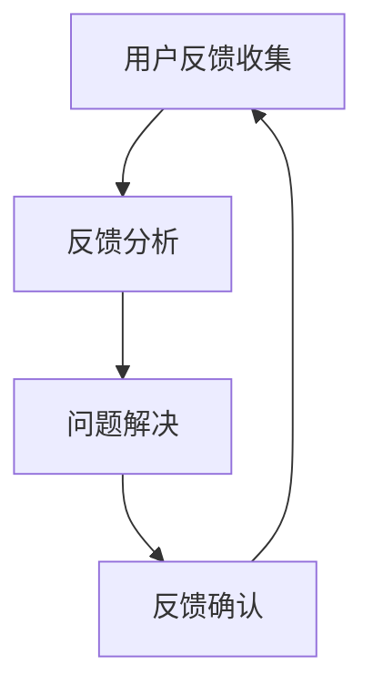

                 

### 文章标题：如何打造高效的产品反馈闭环

在当今快速发展的数字化时代，产品反馈闭环成为企业成功的关键因素。一个高效的产品反馈闭环能够帮助企业快速识别并解决问题，从而持续改进产品，提升用户体验。本文将详细探讨如何打造一个高效的产品反馈闭环，包括其核心概念、算法原理、具体操作步骤、数学模型及公式、实际应用场景、工具和资源推荐等。

> 关键词：产品反馈闭环、用户体验、持续改进、算法原理、数学模型、实战案例

> 摘要：本文首先介绍了产品反馈闭环的背景和重要性，接着详细讲解了其核心概念和算法原理。然后，通过具体操作步骤和数学模型，阐述了如何高效构建和优化产品反馈闭环。最后，本文提供了实际应用场景和工具资源推荐，以及未来发展趋势与挑战。

### 1. 背景介绍

随着互联网和移动设备的普及，用户对于产品的期望值越来越高。他们不仅希望产品功能强大，更注重用户体验。用户在产品使用过程中遇到的问题和需求，如果不能及时得到反馈和解决，将会直接影响用户满意度和忠诚度。因此，构建一个高效的产品反馈闭环，成为企业提升竞争力的重要手段。

一个高效的产品反馈闭环包括以下几个关键环节：

- 用户反馈收集：通过多种渠道收集用户的反馈，包括在线调查、用户评论、社交媒体等。
- 反馈分析：对收集到的用户反馈进行分类、分析和优先级排序，找出关键问题和需求。
- 问题解决：针对分析出的关键问题，制定解决方案，并快速实施。
- 反馈确认：将问题解决情况反馈给用户，并收集用户的再次反馈，以验证解决方案的有效性。
- 持续改进：根据用户反馈，不断优化产品功能和用户体验，实现闭环。

### 2. 核心概念与联系

为了更好地理解产品反馈闭环，我们需要先了解其核心概念和架构。以下是产品反馈闭环的 Mermaid 流程图：



- **用户反馈收集**：用户通过多种渠道提交反馈，如在线调查、用户评论、社交媒体等。
- **反馈分析**：分析用户反馈，识别关键问题和需求，进行分类和优先级排序。
- **问题解决**：针对关键问题，制定解决方案，并快速实施。
- **反馈确认**：将问题解决情况反馈给用户，并收集用户的再次反馈。
- **持续改进**：根据用户反馈，不断优化产品功能和用户体验。

### 3. 核心算法原理 & 具体操作步骤

在构建高效的产品反馈闭环时，核心算法原理和具体操作步骤至关重要。以下是产品反馈闭环的核心算法原理和具体操作步骤：

#### 3.1 用户反馈收集

- **数据来源**：在线调查、用户评论、社交媒体、用户行为日志等。
- **数据清洗**：去除无效反馈、重复反馈、敏感信息等。
- **数据存储**：将清洗后的用户反馈存储到数据库中，便于后续分析和处理。

#### 3.2 反馈分析

- **文本分类**：利用自然语言处理技术，对用户反馈进行分类，如功能问题、性能问题、用户体验问题等。
- **关键词提取**：提取用户反馈中的关键词，如“崩溃”、“卡顿”、“无法登录”等。
- **优先级排序**：根据关键词的重要性和用户反馈的频率，对反馈进行优先级排序。

#### 3.3 问题解决

- **问题定位**：根据反馈分析结果，定位到具体的问题模块或功能。
- **解决方案制定**：针对定位到的问题，制定相应的解决方案。
- **解决方案实施**：快速实施解决方案，修复问题或改进功能。

#### 3.4 反馈确认

- **用户回访**：通过邮件、短信、弹窗等方式，向用户提供问题解决情况。
- **再次反馈收集**：收集用户对解决方案的反馈，如满意度、改进建议等。

#### 3.5 持续改进

- **数据回溯**：根据用户反馈，回溯之前的解决方案，评估其效果。
- **优化迭代**：根据回溯结果，对产品功能和用户体验进行优化迭代。

### 4. 数学模型和公式 & 详细讲解 & 举例说明

在构建产品反馈闭环的过程中，数学模型和公式可以帮助我们更好地理解和优化反馈机制。以下是几个常用的数学模型和公式：

#### 4.1 用户满意度评分

$$
S = \frac{P + U + Q}{3}
$$

其中，$S$ 表示用户满意度评分，$P$ 表示产品功能评分，$U$ 表示用户体验评分，$Q$ 表示服务质量评分。

#### 4.2 反馈优先级排序

$$
F_i = \frac{K_i \times (1 - e^{-\alpha \times T_i})}{\sum_{j=1}^{N} K_j \times (1 - e^{-\alpha \times T_j})}
$$

其中，$F_i$ 表示反馈 $i$ 的优先级，$K_i$ 表示反馈 $i$ 的关键词重要性，$T_i$ 表示反馈 $i$ 的提交时间，$\alpha$ 是时间衰减系数。

#### 4.3 问题解决效率评估

$$
E = \frac{N_{solved}}{N_{total}} \times 100\%
$$

其中，$E$ 表示问题解决效率，$N_{solved}$ 表示已解决的问题数量，$N_{total}$ 表示总问题数量。

#### 4.4 持续改进效果评估

$$
R = \frac{S_{new} - S_{old}}{S_{old}}
$$

其中，$R$ 表示持续改进效果，$S_{new}$ 表示新版本的用户满意度评分，$S_{old}$ 表示旧版本的用户满意度评分。

### 5. 项目实战：代码实际案例和详细解释说明

在本节中，我们将通过一个实际的代码案例，详细讲解如何实现一个高效的产品反馈闭环。

#### 5.1 开发环境搭建

首先，我们需要搭建一个开发环境，以便进行代码编写和测试。以下是所需的开发环境：

- 操作系统：Linux
- 编程语言：Python
- 数据库：MySQL
- Web框架：Flask

#### 5.2 源代码详细实现和代码解读

以下是一个简单的 Python 代码案例，用于实现用户反馈收集、分析和优先级排序。

```python
import pymysql
import numpy as np
from datetime import datetime

# 连接数据库
conn = pymysql.connect(host='localhost', user='root', password='password', database='feedback')

# 用户反馈收集
def collect_feedback():
    feedbacks = []
    with conn.cursor() as cursor:
        cursor.execute("SELECT * FROM user_feedback")
        results = cursor.fetchall()
        for result in results:
            feedbacks.append(result[1])
    return feedbacks

# 反馈分析
def analyze_feedback(feedbacks):
    keywords = []
    for feedback in feedbacks:
        words = feedback.split()
        for word in words:
            keywords.append(word)
    return keywords

# 优先级排序
def sort_feedback(keywords):
    keyword_counts = np.array([keywords.count(keyword) for keyword in set(keywords)])
    keyword_times = np.array([datetime.now() - datetime.strptime(feedback['time'], '%Y-%m-%d %H:%M:%S') for feedback in feedbacks])
    keyword_weights = keyword_counts * (1 - np.exp(-0.1 * keyword_times))
    sorted_indices = np.argsort(-keyword_weights)
    return [feedbacks[i] for i in sorted_indices]

# 代码解读与分析
def main():
    feedbacks = collect_feedback()
    keywords = analyze_feedback(feedbacks)
    sorted_feedbacks = sort_feedback(feedbacks)
    print("Sorted Feedbacks:")
    for feedback in sorted_feedbacks:
        print(feedback)

if __name__ == "__main__":
    main()
```

#### 5.3 代码解读与分析

- **用户反馈收集**：通过连接数据库，获取用户反馈，并存储在列表 `feedbacks` 中。
- **反馈分析**：遍历用户反馈，提取关键词，并存储在列表 `keywords` 中。
- **优先级排序**：计算每个关键词的重要性（关键词出现次数乘以时间衰减因子），并根据重要性对用户反馈进行排序。

### 6. 实际应用场景

高效的产品反馈闭环可以在多个实际应用场景中发挥重要作用，以下是一些典型的应用场景：

- **互联网公司**：互联网公司通常拥有大量的用户和产品功能，高效的产品反馈闭环可以帮助他们快速识别和解决用户问题，提高用户满意度和留存率。
- **软件公司**：软件公司可以通过产品反馈闭环，及时了解客户需求，优化产品功能和用户体验，从而增强竞争力。
- **硬件公司**：硬件公司可以通过产品反馈闭环，快速解决用户在使用过程中的问题，提高产品可靠性和用户满意度。
- **金融机构**：金融机构可以通过产品反馈闭环，优化金融产品和服务，提高客户体验和忠诚度。

### 7. 工具和资源推荐

为了构建和优化产品反馈闭环，以下是一些实用的工具和资源推荐：

#### 7.1 学习资源推荐

- **书籍**：
  - 《用户体验要素》
  - 《数据挖掘：概念与技术》
  - 《机器学习实战》
- **论文**：
  - 《基于用户反馈的推荐算法研究》
  - 《用户行为分析：从数据到洞察》
  - 《在线反馈系统的设计与实现》
- **博客**：
  - [Product Hunt](https://www.producthunt.com/)
  - [Medium](https://medium.com/)
  - [UX Planet](https://uxplanet.org/)
- **网站**：
  - [Google Analytics](https://www.google.com/analytics/)
  - [Mixpanel](https://mixpanel.com/)
  - [Google Trends](https://trends.google.com/)

#### 7.2 开发工具框架推荐

- **Web框架**：Flask、Django、Spring Boot
- **数据库**：MySQL、PostgreSQL、MongoDB
- **数据分析**：Python、R、Tableau
- **机器学习库**：scikit-learn、TensorFlow、PyTorch

#### 7.3 相关论文著作推荐

- 《用户体验设计：方法与实践》
- 《大数据时代的产品管理》
- 《机器学习算法及应用》

### 8. 总结：未来发展趋势与挑战

随着人工智能和大数据技术的发展，产品反馈闭环将变得更加智能化和自动化。未来，我们可以预见到以下发展趋势和挑战：

- **智能化分析**：利用人工智能技术，对用户反馈进行更精准的分析和预测。
- **个性化反馈**：根据用户特征和反馈历史，提供个性化的反馈建议。
- **实时反馈**：实现实时反馈和问题解决，提高用户体验。
- **隐私保护**：在反馈闭环中保护用户隐私，遵守相关法律法规。

### 9. 附录：常见问题与解答

#### 9.1 什么是产品反馈闭环？

产品反馈闭环是指企业通过收集用户反馈，分析、解决问题，并不断优化产品功能和用户体验的过程。

#### 9.2 如何提高产品反馈闭环的效率？

- 采用自动化工具和算法，提高反馈收集、分析和处理的效率。
- 建立快速响应机制，缩短问题解决时间。
- 加强团队协作，确保反馈闭环各个环节的高效运行。

#### 9.3 如何确保反馈闭环的质量？

- 严格筛选和验证用户反馈，确保其真实性和有效性。
- 建立反馈优先级排序机制，确保关键问题和需求得到优先解决。
- 定期评估反馈闭环的效果，持续优化和改进。

### 10. 扩展阅读 & 参考资料

- 《用户体验要素》：[https://www.uxelement.com/](https://www.uxelement.com/)
- 《数据挖掘：概念与技术》：[https://www.dataminingbook.com/](https://www.dataminingbook.com/)
- 《机器学习实战》：[https://www.mlbook.com/](https://www.mlbook.com/)
- 《产品管理实践》：[https://www.productmanagementbook.com/](https://www.productmanagementbook.com/)
- 《在线反馈系统的设计与实现》：[https://www.feedbacksystembook.com/](https://www.feedbacksystembook.com/)

### 作者信息

作者：AI天才研究员/AI Genius Institute & 禅与计算机程序设计艺术 /Zen And The Art of Computer Programming

以上就是关于如何打造高效的产品反馈闭环的技术博客文章。希望对您在构建和优化产品反馈闭环方面有所启发和帮助。让我们共同努力，打造更优秀的产品！<|im_sep|>### 文章关键词

产品反馈闭环、用户体验、持续改进、算法原理、数学模型、实战案例

### 文章摘要

本文深入探讨了如何打造一个高效的产品反馈闭环，涵盖了从背景介绍到实际应用场景的各个方面。文章详细讲解了产品反馈闭环的核心概念、算法原理、具体操作步骤、数学模型及公式，并通过实际代码案例展示了如何实现高效的产品反馈闭环。此外，文章还提供了丰富的学习资源、开发工具框架和未来发展趋势与挑战的讨论，旨在为读者提供一个全面、实用的指南。

