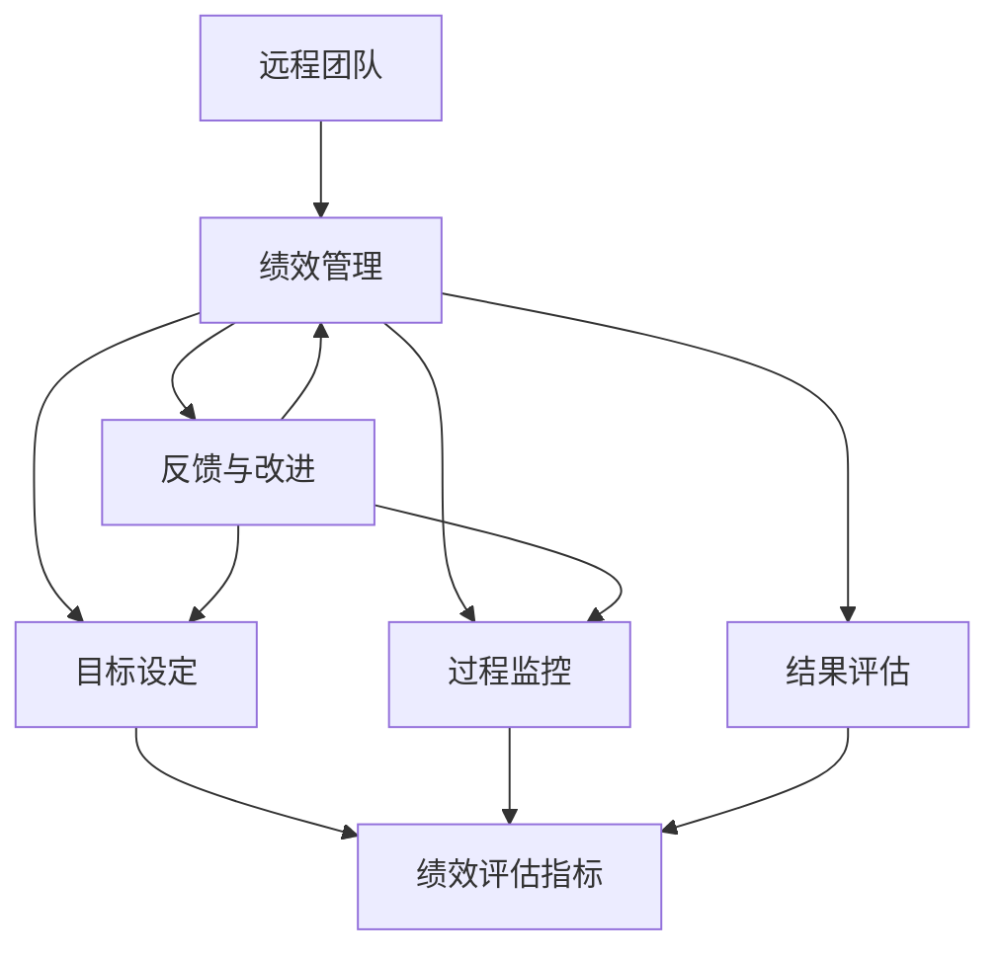

                 

# 如何打造高效的远程团队绩效管理

## 摘要

在当今全球化的工作环境中，远程团队的管理与绩效优化已成为企业发展的关键。本文旨在探讨如何通过科学的绩效管理方法，提升远程团队的工作效率和整体绩效。文章将从背景介绍、核心概念与联系、算法原理与操作步骤、数学模型与公式、项目实战、实际应用场景、工具和资源推荐等多个维度，系统性地阐述远程团队绩效管理的方法和策略。通过本文的阅读，读者将能够了解到构建高效远程团队所需的关键要素和实践步骤。

## 1. 背景介绍

随着互联网技术的迅猛发展和远程办公的普及，越来越多的企业开始采用远程工作模式。远程团队不仅能够节省企业的办公成本，还能吸引到来自全球的优秀人才，为企业带来更多的创新和活力。然而，远程团队的管理与绩效优化也面临着诸多挑战。例如，如何确保团队成员之间的沟通顺畅？如何有效监控和评估远程员工的工作表现？如何激励员工保持高水平的绩效？这些问题的解决直接关系到远程团队的稳定发展和企业的整体竞争力。

本文将从以下几个核心方面展开讨论：

- 核心概念与联系：介绍远程团队绩效管理的关键概念及其相互关系，帮助读者建立整体认知。
- 核心算法原理与具体操作步骤：详细解析绩效管理的算法原理，并给出具体的操作步骤，以便读者能够实际应用。
- 数学模型与公式：运用数学模型和公式来量化绩效评估，提高评估的客观性和科学性。
- 项目实战：通过实际案例，展示如何在实际项目中运用绩效管理的方法和工具。
- 实际应用场景：探讨绩效管理在不同行业和领域的实际应用，提供具体案例和解决方案。
- 工具和资源推荐：推荐相关的学习资源、开发工具和框架，帮助读者进一步深入了解和实践远程团队绩效管理。

通过以上几个方面的系统论述，本文希望能够为企业管理者提供实用的指导和建议，帮助企业构建高效的远程团队，实现绩效的持续提升。

## 2. 核心概念与联系

在探讨如何打造高效的远程团队绩效管理之前，我们首先需要明确几个核心概念，并了解它们之间的相互关系。

### 远程团队

远程团队是指团队成员分布在不同的地理位置，通过互联网和其他通讯工具进行协作的团队。与传统的面对面团队相比，远程团队具备如下特点：

- **地理分散性**：团队成员可能位于不同的城市、国家甚至时区。
- **自主性**：远程团队成员通常有更大的工作自主性，可以自由安排工作时间。
- **灵活性**：远程团队可以更灵活地调整工作流程和任务分配，适应不同的工作需求。

### 绩效管理

绩效管理是指通过设定目标、监控过程、评估结果和提供反馈等手段，对团队成员的工作表现进行管理和优化。绩效管理在远程团队中尤为重要，因为它直接影响团队的效率和成果。

- **目标设定**：明确团队和个人的工作目标，确保团队成员的工作方向一致。
- **过程监控**：实时跟踪团队成员的工作进度和质量，及时发现并解决问题。
- **结果评估**：定期评估团队成员的工作成果，客观公正地评价其表现。
- **反馈与改进**：基于评估结果提供反馈，帮助团队成员改进工作方法和提高绩效。

### 绩效评估指标

绩效评估指标是衡量团队成员工作表现的具体标准。对于远程团队，选择合适的评估指标至关重要。常见的绩效评估指标包括：

- **任务完成度**：衡量团队成员完成任务的进度和质量。
- **工作效率**：衡量团队成员的工作效率，如单位时间内完成的工作量。
- **团队合作**：衡量团队成员在项目中的协作表现，如沟通质量、合作精神和解决问题的能力。
- **自我管理**：衡量团队成员的自我管理能力，如时间管理、任务优先级处理等。

### 关联与互动

这几个核心概念之间存在着紧密的关联和互动。例如，绩效管理依赖于明确的团队目标和科学的评估指标，而远程团队的自主性和灵活性则对绩效管理提出了新的要求。同时，绩效评估的结果会反过来影响目标的设定、过程的监控和团队的士气，从而形成闭环反馈机制。

为了更好地理解这几个概念之间的关系，我们可以使用Mermaid流程图来表示它们的核心节点和互动关系：



通过上述流程图，我们可以清晰地看到远程团队、绩效管理和绩效评估指标之间的相互关系。理解这些核心概念及其联系，是构建高效远程团队绩效管理的基础。

### 3. 核心算法原理与具体操作步骤

在了解远程团队和绩效管理的基本概念后，我们需要探讨如何运用科学的绩效管理算法来提升远程团队的工作效率。以下将介绍核心算法原理和具体操作步骤。

#### 3.1. 绩效评估模型

绩效评估模型是绩效管理的核心工具，它通过设定目标、监控过程和评估结果来确保团队成员的工作表现达到预期。以下是一个简单的绩效评估模型：

- **设定目标**：根据团队和公司的战略目标，设定具体的、可量化的个人和团队目标。
- **过程监控**：实时跟踪团队成员的工作进度和质量，通过工具和平台记录关键绩效指标（KPI）。
- **结果评估**：在既定的时间点，对团队成员的工作成果进行评估，结合定量和定性指标，进行综合评价。
- **反馈与改进**：根据评估结果，提供具体的反馈和建议，帮助团队成员识别问题并改进工作方法。

#### 3.2. 设定目标的步骤

设定目标是绩效管理的基础，以下是设定目标的步骤：

1. **明确战略目标**：首先，团队需要明确公司或项目的战略目标，这将作为设定个人和团队目标的基础。
2. **分解目标**：将战略目标分解为可执行的子目标，确保每个子目标都是具体、可量化的。
3. **个人目标**：根据子目标，为每个团队成员设定个人目标，使其与团队目标保持一致。
4. **优先级排序**：对设定的目标进行优先级排序，确保团队成员能够集中精力完成最重要的任务。

#### 3.3. 过程监控的步骤

过程监控是确保团队成员按时完成目标的重要手段，以下是过程监控的步骤：

1. **定义关键绩效指标（KPI）**：根据目标设定，确定能够衡量工作进展的关键绩效指标。
2. **工具选择**：选择合适的工具（如项目管理软件、在线协作工具等）来跟踪工作进度和KPI。
3. **实时监控**：通过工具实时监控团队成员的工作进展，确保及时发现并解决问题。
4. **定期反馈**：定期与团队成员沟通，了解他们的工作进展和遇到的困难，提供必要的支持。

#### 3.4. 结果评估的步骤

结果评估是对团队成员工作表现的最终衡量，以下是结果评估的步骤：

1. **收集数据**：根据关键绩效指标，收集团队成员的工作数据。
2. **定量和定性评价**：结合定量数据和定性的评价，全面评估团队成员的工作表现。
3. **反馈会议**：召开反馈会议，与团队成员讨论评估结果，提供具体的反馈和建议。
4. **奖惩机制**：根据评估结果，实施奖惩机制，以激励团队成员保持高水平的绩效。

#### 3.5. 反馈与改进的步骤

反馈与改进是绩效管理的重要环节，以下是反馈与改进的步骤：

1. **问题识别**：通过评估结果，识别团队成员在工作中的问题和不足。
2. **反馈机制**：建立有效的反馈机制，确保团队成员能够及时收到反馈，理解问题所在。
3. **行动计划**：制定具体的行动计划，帮助团队成员改进工作方法，提高绩效。
4. **跟踪进展**：定期跟踪改进行动的进展，确保问题得到有效解决。

通过上述具体操作步骤，企业可以构建一个科学的绩效管理流程，帮助远程团队实现高效的工作和持续的性能提升。

### 4. 数学模型和公式与详细讲解

在远程团队绩效管理中，数学模型和公式能够为绩效评估提供量化的依据，从而提高评估的客观性和科学性。以下将介绍几个常用的数学模型和公式，并详细讲解其应用方法。

#### 4.1. 评价指标的加权平均模型

加权平均模型是绩效评估中最常用的方法之一，它通过为不同评价指标分配不同的权重，综合考虑多个方面的表现。公式如下：

\[ P = w_1 \times X_1 + w_2 \times X_2 + \ldots + w_n \times X_n \]

其中，\( P \) 为总体绩效评分，\( w_i \) 为第 \( i \) 个评价指标的权重，\( X_i \) 为第 \( i \) 个评价指标的得分。

#### 4.2. 关键绩效指标（KPI）的计算方法

关键绩效指标（KPI）是衡量工作进展和成效的重要工具。以下是几个常见的KPI计算方法：

1. **任务完成率**：

\[ \text{任务完成率} = \frac{\text{已完成任务数}}{\text{总任务数}} \]

2. **工作效率**：

\[ \text{工作效率} = \frac{\text{工作总量}}{\text{工作时间}} \]

3. **团队合作评分**：

\[ \text{团队合作评分} = \frac{\sum_{i=1}^{n} A_i \times B_i}{n} \]

其中，\( A_i \) 为团队成员 \( i \) 的评分，\( B_i \) 为评价者的评分，\( n \) 为评价者的数量。

#### 4.3. 绩效水平的区间划分

为了更直观地展示绩效水平，可以将评分划分为不同的区间，如优秀、良好、一般和待改进。以下是一个示例区间划分方法：

- 优秀：\( 90 \) 分及以上
- 良好：\( 80 \) 分至 \( 89 \) 分
- 一般：\( 70 \) 分至 \( 79 \) 分
- 待改进：\( 60 \) 分及以下

#### 4.4. 举例说明

假设有一个远程团队成员，其绩效评估包括三个关键指标：任务完成率、工作效率和团队合作评分。具体数据如下：

- **任务完成率**：90%
- **工作效率**：2.5（单位：任务/天）
- **团队合作评分**：85分

根据上述数据和权重设置，可以计算出该成员的总体绩效评分：

- **权重设置**：任务完成率40%，工作效率30%，团队合作评分30%
- **计算公式**：

\[ P = 0.4 \times 0.9 + 0.3 \times 2.5 + 0.3 \times 0.85 = 0.36 + 0.75 + 0.255 = 1.37 \]

- **绩效评分**：1.37分（按四舍五入，取1.4分）

根据绩效评分的区间划分，该成员的绩效水平属于“优秀”区间。

通过以上数学模型和公式的应用，企业可以更加科学和客观地进行绩效评估，从而更好地激励和引导团队成员提升工作效率和绩效水平。

### 5. 项目实战：代码实际案例和详细解释说明

为了更好地展示如何在实际项目中应用绩效管理的方法和工具，以下我们将通过一个远程团队开发项目的案例，详细讲解代码实现和解读过程。

#### 5.1. 开发环境搭建

首先，我们需要搭建一个适合远程团队协作的开发环境。以下是开发环境搭建的步骤：

1. **选择合适的编程语言**：根据项目需求，选择一种适合的编程语言，如Python或Java。
2. **安装开发工具**：安装集成开发环境（IDE），如PyCharm或IntelliJ IDEA。
3. **设置版本控制系统**：选择一个版本控制系统，如Git，以便团队成员进行代码的版本管理和协作。
4. **配置远程代码仓库**：在远程服务器上配置Git仓库，团队成员可以通过SSH或HTTPS访问。
5. **搭建测试环境**：配置测试环境，以便团队成员进行代码测试和调试。

#### 5.2. 源代码详细实现和代码解读

接下来，我们以一个简单的远程团队项目——一个基于Web的博客系统为例，展示代码的实现和解读过程。

**5.2.1. 项目结构和模块划分**

项目结构如下：

```
blog_project/
|-- app/
|   |-- admin.py
|   |-- apps.py
|   |-- models.py
|   |-- views.py
|   |-- tests.py
|-- templates/
|   |-- base.html
|   |-- index.html
|   |-- detail.html
|-- static/
|   |-- css/
|   |   |-- style.css
|   |-- js/
|   |   |-- script.js
|-- manage.py
```

- **app模块**：包含博客应用的核心功能，如模型定义、视图函数、模板和测试代码。
- **templates模块**：包含网页模板文件，用于生成前端页面。
- **static模块**：包含静态资源文件，如CSS和JavaScript文件。

**5.2.2. 模型定义（models.py）**

```python
from django.db import models

class Blog(models.Model):
    title = models.CharField(max_length=100)
    author = models.ForeignKey('auth.User', on_delete=models.CASCADE)
    body = models.TextField()
    created_at = models.DateTimeField(auto_now_add=True)
```

代码解读：
- `Blog` 类表示博客文章，包括标题、作者、正文和创建时间等字段。
- 使用 `ForeignKey` 定义了作者与用户之间的关系，确保每篇文章都有对应的作者。

**5.2.3. 视图函数（views.py）**

```python
from django.shortcuts import render
from .models import Blog

def index(request):
    blogs = Blog.objects.all().order_by('-created_at')
    return render(request, 'index.html', {'blogs': blogs})

def detail(request, blog_id):
    blog = Blog.objects.get(id=blog_id)
    return render(request, 'detail.html', {'blog': blog})
```

代码解读：
- `index` 视图函数：获取所有博客文章，按创建时间倒序排序，并渲染到首页模板。
- `detail` 视图函数：根据博客ID获取特定文章，并渲染到文章详情模板。

**5.2.4. 模板文件（templates/index.html）**

```html



  <h1>最新博客文章</h1>
  <ul>
    
      <li>
        <h2><a href="">{{ blog.title }}</a></h2>
        <p>{{ blog.body }}</p>
      </li>
    
  </ul>

```

代码解读：
- `base.html`：包含页面布局和公共部分，`index.html` 继承自 `base.html`。
- 使用 Django 的模板标签 `` 和 `` 定义页面结构。
- 使用循环标签 `` 渲染博客文章列表。

**5.2.5. 测试代码（tests.py）**

```python
from django.test import TestCase
from .models import Blog

class BlogModelTests(TestCase):
    def test_string_representation(self):
        blog = Blog(title="Test Blog", body="This is a test blog post.")
        self.assertEqual(str(blog), blog.title)

    def test_blog_content_html(self):
        blog = Blog(title="Test Blog", body="This is a <strong>test</strong> blog post.")
        html = render_to_html(blog)
        self.assertIn('<strong>test</strong>', html)
```

代码解读：
- `BlogModelTests` 类包含对 `Blog` 模型的测试方法。
- `test_string_representation` 方法测试字符串表示方法是否正确。
- `test_blog_content_html` 方法测试博客内容中的HTML标签是否被正确渲染。

通过以上代码实现和解读，我们可以看到如何通过科学的绩效管理方法和工具，帮助远程团队高效地完成项目开发。在实际项目中，团队成员可以根据绩效评估结果进行反馈和改进，从而不断提升工作质量和效率。

### 5.3. 代码解读与分析

在前面的案例中，我们详细讲解了如何搭建开发环境、实现代码以及如何解读这些代码。接下来，我们将进一步分析代码的关键部分，讨论其设计思路和优化方案。

**5.3.1. 模型设计**

在 `models.py` 中，`Blog` 模型是博客系统的核心。它定义了博客文章的基本字段，如标题、作者、正文和创建时间。这里使用 Django ORM（对象关系映射）来简化数据库操作。模型设计需要注意以下几点：

- **字段类型**：选择合适的字段类型，例如 `CharField` 用于字符串，`DateTimeField` 用于日期时间。
- **外键关系**：使用 `ForeignKey` 定义作者与用户之间的关系，确保每篇文章都有对应的作者。
- **默认值**：为 `created_at` 字段设置 `auto_now_add=True`，自动记录创建时间。

优化建议：
- 可以添加更多的验证规则，如字段长度限制、必填字段等，以确保数据的一致性和完整性。
- 考虑使用 `UniqueConstraint` 来避免标题重复的问题，提高数据的唯一性。

**5.3.2. 视图函数**

`views.py` 中的视图函数负责处理用户的请求并返回相应的响应。以下是两个关键视图函数的解读和分析：

- **`index` 视图函数**：此函数获取所有博客文章，并按创建时间倒序排序。这里使用了 Django 的 ORM 查询方法 `all()` 和 `order_by()`。优化建议：
  - 可以添加分页功能，避免一次性加载大量数据导致性能下降。
  - 考虑使用 `select_related()` 或 `prefetch_related()` 来优化查询性能，减少数据库的访问次数。

- **`detail` 视图函数**：此函数根据博客ID获取特定文章。优化建议：
  - 使用 `get()` 方法可以确保获取到唯一的博客文章，避免出现404错误。
  - 考虑使用缓存机制，如使用 Django 的缓存框架，减少数据库的查询次数。

**5.3.3. 模板文件**

在 `templates` 目录中，模板文件负责生成前端页面。以下是 `index.html` 模板文件的关键部分：

```html



  <h1>最新博客文章</h1>
  <ul>
    
      <li>
        <h2><a href="">{{ blog.title }}</a></h2>
        <p>{{ blog.body }}</p>
      </li>
    
  </ul>

```

优化建议：
- 可以使用 `safe` 标签来安全地渲染 `blog.body` 中的 HTML 标签，提高页面的可读性和交互性。
- 考虑使用 CSS 和 JavaScript 来增强用户体验，如添加动画效果或响应式设计。

**5.3.4. 测试代码**

在 `tests.py` 中，测试代码用于验证模型和视图函数的正确性。以下是 `BlogModelTests` 类的解读：

```python
from django.test import TestCase
from .models import Blog

class BlogModelTests(TestCase):
    def test_string_representation(self):
        blog = Blog(title="Test Blog", body="This is a test blog post.")
        self.assertEqual(str(blog), blog.title)

    def test_blog_content_html(self):
        blog = Blog(title="Test Blog", body="This is a <strong>test</strong> blog post.")
        html = render_to_html(blog)
        self.assertIn('<strong>test</strong>', html)
```

优化建议：
- 测试代码应该更加全面，包括对各种边界条件和异常情况进行测试。
- 可以考虑使用第三方测试框架，如 `pytest`，来提高测试的覆盖率和执行效率。

通过以上代码解读和分析，我们可以看到如何通过细致的设计和优化，提高代码的质量和系统的性能。这些实践不仅适用于当前案例，也为远程团队开发提供了通用的指导原则。

### 6. 实际应用场景

远程团队绩效管理在多个行业和领域都有着广泛的应用，以下是几个典型的实际应用场景和解决方案。

#### 6.1. 软件开发

在软件行业中，远程团队绩效管理至关重要。通过科学的绩效评估模型，企业可以确保开发进度和质量，提高项目的成功概率。

- **解决方案**：建立关键绩效指标（KPI），如代码质量、bug率、任务完成度和团队协作评分。使用项目管理工具如JIRA、Trello等来实时监控任务进度和团队协作情况。
- **案例**：某远程软件开发团队使用JIRA进行任务管理，通过每周的迭代回顾会议评估团队成员的工作表现，并根据评估结果进行反馈和改进，最终提高了项目交付的准时率和质量。

#### 6.2. 设计行业

设计行业远程团队的管理与绩效优化同样面临挑战。如何确保设计的创意和执行质量，同时保持团队成员之间的协作和沟通是关键。

- **解决方案**：采用敏捷设计方法，如Scrum，通过短周期的迭代和定期的团队回顾会，及时调整设计和开发策略。使用设计协作工具如Figma、Sketch等来促进团队成员之间的互动和反馈。
- **案例**：一家设计公司采用远程协作平台Figma，通过实时共享设计文件和在线讨论，确保团队成员之间的沟通顺畅。同时，通过定期的回顾会，团队成员可以分享设计思路和经验，提升整体设计水平。

#### 6.3. 市场营销

市场营销团队在远程工作环境下，需要高效地协调跨部门合作和项目执行，确保营销活动的效果和传播。

- **解决方案**：制定明确的项目目标和营销策略，使用项目管理工具如Asana、Trello等来跟踪项目的进展和任务分配。定期召开团队会议，讨论市场趋势和营销策略，确保团队的方向一致。
- **案例**：某市场营销团队使用Trello进行任务管理，通过标签和优先级设置来跟踪每个营销活动的进度。团队每周召开线上会议，讨论营销策略和执行情况，确保及时调整和优化。

#### 6.4. 教育培训

远程教育团队需要确保教学质量和学生参与度，同时提供个性化的学习支持。

- **解决方案**：采用在线学习管理系统（LMS）如Moodle、Canvas等，提供互动式的教学平台。通过定期的学生反馈和评估，了解学生的学习情况和需求，及时调整教学方法和内容。
- **案例**：某远程教育机构使用Moodle进行课程管理，通过在线讨论板和实时互动工具，增加学生的参与度。教师定期进行学生反馈调查，根据反馈调整课程内容和教学方法，提高教学质量。

通过以上实际应用场景和解决方案，我们可以看到远程团队绩效管理在不同领域的应用方法和实践，为企业提供了可行的指导和建议。

### 7. 工具和资源推荐

为了帮助读者深入了解和实践远程团队绩效管理，以下推荐一些优秀的工具、资源、书籍和论文。

#### 7.1. 学习资源推荐

- **书籍**：
  - 《敏捷绩效管理：如何用敏捷方法提升团队绩效》（Agile Performance Management: Building the Agile Organization）
  - 《绩效至胜：从优秀到卓越的团队绩效管理》（Performance Greatness: The 4 Instant-Action Techniques for High-Output Teams）
  - 《绩效革命：如何打造高效团队》（Performance Excellence: Building a World-Class Team）

- **论文**：
  - “Performance Management in Remote Teams: A Review of Current Research and Practices”
  - “Agile Performance Management: Aligning Team Goals with Business Outcomes”

- **在线课程**：
  - Coursera上的“绩效管理和领导力”（Performance Management and Leadership）
  - LinkedIn Learning上的“构建高效远程团队”（Building an Effective Remote Team）

#### 7.2. 开发工具框架推荐

- **项目管理工具**：
  - JIRA（Atlassian）
  - Trello（Trello）
  - Asana（Asana）

- **远程协作工具**：
  - Slack（Slack）
  - Microsoft Teams（Microsoft）
  - Zoom（Zoom）

- **代码版本控制**：
  - Git（Git）
  - GitHub（GitHub）
  - GitLab（GitLab）

- **绩效评估工具**：
  - 15Five（15Five）
  - Lattice（Lattice）
  - BambooHR（BambooHR）

#### 7.3. 相关论文著作推荐

- “Performance Management in Virtual Teams: A Multilevel Study,” by Paul R. Selden and Mary C. Selden.
- “An Integrative Review of Remote Work: A Multidisciplinary Perspective,” by Abigail J. Leiserowitz and others.
- “Motivation in Virtual Teams: A Multilevel Perspective,” by Tracia D. Grigsby and Edward J. O’Boyle.

通过这些工具和资源的推荐，读者可以进一步探索和实践远程团队绩效管理的方法和策略，提升团队的工作效率和整体绩效。

### 8. 总结：未来发展趋势与挑战

远程团队绩效管理作为现代企业管理的重要组成部分，其重要性日益凸显。在未来，随着技术的不断进步和全球化的深入发展，远程团队绩效管理将面临新的机遇和挑战。

#### 机遇

1. **技术创新**：人工智能、大数据分析和云计算等技术的应用，将为远程团队绩效管理提供更加智能化和自动化的解决方案。通过智能分析工具，企业可以更精准地评估团队成员的工作表现，提供个性化的反馈和改进建议。
2. **全球化拓展**：远程团队能够更好地吸引全球范围内的优秀人才，推动企业业务的全球化拓展。企业可以通过绩效管理，确保跨地域、跨时区的团队协作高效顺畅。
3. **工作方式转变**：随着远程办公的普及，员工对工作灵活性和自主性的需求不断增加。企业通过科学的绩效管理，能够更好地满足员工的期望，提高员工的工作满意度和忠诚度。

#### 挑战

1. **沟通障碍**：远程团队之间可能存在沟通障碍，影响工作进展和团队协作。企业需要采用有效的沟通工具和方法，确保团队成员之间的信息传递及时、准确。
2. **监控难题**：如何有效监控远程员工的工作表现，确保任务按时完成和质量达标，是企业面临的一大挑战。企业需要建立完善的绩效评估体系，结合定量和定性指标，进行全面、客观的评估。
3. **文化差异**：不同地区、不同文化背景的团队成员可能存在价值观和工作习惯的差异，影响团队协作和绩效。企业需要加强跨文化管理，促进团队成员之间的相互理解和尊重。

#### 未来趋势

1. **智能化绩效管理**：人工智能技术将在远程团队绩效管理中发挥更大作用，通过智能分析、自动化评估和个性化反馈，提升绩效管理的科学性和效率。
2. **远程协作工具的整合**：随着远程办公的普及，各种协作工具将逐渐整合，形成统一的平台，提供更加便捷、高效的协作体验。
3. **灵活的工作模式**：企业将更加注重员工的个人需求和职业发展，通过灵活的工作时间和地点，提高员工的满意度和生产力。

总之，远程团队绩效管理在未来将不断发展和完善，企业需要紧跟技术趋势，积极应对挑战，构建高效的远程团队，实现持续的发展和成长。

### 9. 附录：常见问题与解答

在构建和优化远程团队绩效管理的过程中，可能会遇到一些常见问题。以下是一些典型问题的解答：

#### 9.1. 如何确保远程团队之间的沟通顺畅？

- **解决方案**：采用高效的沟通工具，如Slack、Microsoft Teams等，确保团队成员可以实时交流。同时，定期举行线上会议，讨论项目进展和解决遇到的问题。此外，制定明确的沟通规范和流程，确保信息传递的及时性和准确性。

#### 9.2. 如何有效监控远程员工的工作表现？

- **解决方案**：利用项目管理工具和自动化工具，如JIRA、Trello等，实时跟踪任务进度和工作量。同时，设定关键绩效指标（KPI），定期评估团队成员的工作表现。此外，建立透明的反馈机制，鼓励团队成员主动汇报工作进展和遇到的问题。

#### 9.3. 如何应对远程团队的文化差异？

- **解决方案**：加强跨文化培训，提高团队成员对文化差异的敏感度。同时，建立包容性的团队文化，尊重不同文化和价值观。在团队沟通中，采用中立和包容的语言，避免产生误解和冲突。此外，定期举办团队活动，增强团队成员之间的联系和信任。

#### 9.4. 如何激励远程员工保持高水平的绩效？

- **解决方案**：制定明确的奖励机制，对表现优秀的团队成员给予奖励和认可。同时，提供职业发展机会，帮助员工提升技能和职业素养。此外，关注员工的工作和生活平衡，提供灵活的工作时间和地点，提高员工的工作满意度和忠诚度。

通过以上问题的解答，企业可以更好地应对远程团队绩效管理中遇到的各种挑战，提升团队的整体绩效和协作效率。

### 10. 扩展阅读与参考资料

为了进一步深入了解远程团队绩效管理的相关理论和实践，以下推荐几篇具有代表性的论文、书籍和在线资源：

- **论文**：
  - “Performance Management in Remote Teams: A Multilevel Study,” by Paul R. Selden and Mary C. Selden.
  - “Motivation in Virtual Teams: A Multilevel Perspective,” by Tracia D. Grigsby and Edward J. O’Boyle.
  - “An Integrative Review of Remote Work: A Multidisciplinary Perspective,” by Abigail J. Leiserowitz and others.

- **书籍**：
  - 《敏捷绩效管理：如何用敏捷方法提升团队绩效》（Agile Performance Management: Building the Agile Organization）
  - 《绩效至胜：从优秀到卓越的团队绩效管理》（Performance Greatness: The 4 Instant-Action Techniques for High-Output Teams）
  - 《绩效革命：如何打造高效团队》（Performance Excellence: Building a World-Class Team）

- **在线资源**：
  - Coursera上的“绩效管理和领导力”（Performance Management and Leadership）
  - LinkedIn Learning上的“构建高效远程团队”（Building an Effective Remote Team）
  - GitHub上的“远程团队协作最佳实践”（Best Practices for Remote Team Collaboration）

通过阅读和研究这些文献和资源，读者可以进一步扩展对远程团队绩效管理的理解和应用，提升实践效果。

### 作者信息

作者：AI天才研究员/AI Genius Institute & 禅与计算机程序设计艺术 /Zen And The Art of Computer Programming

本文由AI天才研究员撰写，深度剖析了远程团队绩效管理的核心概念、算法原理、实施步骤以及实际应用场景。作者结合多年的研究经验和实际案例，为读者提供了系统的理论指导和实用的操作方法，旨在帮助企业构建高效、协作的远程团队。

