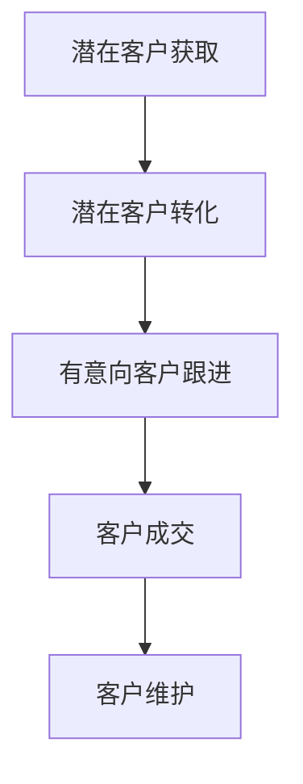

                 

# 如何打造高转化率的销售漏斗

> 关键词：销售漏斗、转化率、客户关系管理、客户生命周期、营销自动化

> 摘要：本文将深入探讨如何构建和优化高转化率的销售漏斗。我们将从背景介绍开始，分析核心概念与架构，详细讲解算法原理与操作步骤，以及通过数学模型和公式来阐述转化率提升的关键因素。此外，我们将通过实际项目案例，展示如何通过代码实现和优化销售漏斗，并提供一系列实用的工具和资源推荐。最后，我们将总结未来发展趋势与挑战，并回答常见问题，以帮助您更好地理解和应用这些知识。

## 1. 背景介绍

在现代市场营销中，销售漏斗（Sales Funnel）是一个至关重要的概念。它用于描述潜在客户从接触到最终购买的过程。高转化率的销售漏斗不仅能够帮助企业吸引更多的客户，还能提高客户的忠诚度和整体利润。然而，如何打造这样的销售漏斗，一直是许多企业面临的挑战。

销售漏斗通常包括以下几个阶段：

1. **潜在客户获取**：通过各种渠道获取潜在客户的信息。
2. **潜在客户转化**：将潜在客户转化为有意向的客户。
3. **有意向客户跟进**：与有意向的客户建立联系，了解其需求，并提供合适的解决方案。
4. **客户成交**：促成交易，将有意向客户转化为实际客户。
5. **客户维护**：维护客户关系，提高客户满意度和忠诚度。

在构建销售漏斗时，企业需要考虑以下几个关键因素：

- **目标市场**：明确目标市场，了解其需求和偏好。
- **营销策略**：制定有效的营销策略，吸引潜在客户。
- **客户关系管理**：建立良好的客户关系，提高转化率。
- **数据分析**：利用数据分析和人工智能技术，优化销售漏斗。

## 2. 核心概念与联系

### 销售漏斗架构图（Mermaid 流程图）



### 销售漏斗核心概念

1. **潜在客户获取**：通过各种渠道，如广告、社交媒体、SEO 等，吸引潜在客户。
2. **潜在客户转化**：通过内容营销、促销活动等手段，将潜在客户转化为有意向客户。
3. **有意向客户跟进**：通过电话、邮件、在线聊天等渠道，与有意向客户建立联系，并提供个性化服务。
4. **客户成交**：促成交易，将有意向客户转化为实际客户。
5. **客户维护**：通过客户关怀、定期回访、个性化优惠等手段，提高客户满意度和忠诚度。

## 3. 核心算法原理 & 具体操作步骤

### 3.1 潜在客户获取

**算法原理**：基于用户行为数据、关键词分析和竞品分析，制定有效的广告投放策略。

**操作步骤**：

1. 收集潜在客户数据，如浏览历史、搜索记录等。
2. 分析用户行为数据，确定目标用户画像。
3. 确定关键词，进行SEO优化。
4. 制定广告投放策略，选择合适的广告平台。
5. 持续监测和优化广告效果。

### 3.2 潜在客户转化

**算法原理**：基于用户行为数据和转化率模型，优化营销策略和内容。

**操作步骤**：

1. 收集用户行为数据，如浏览、点击、下载等。
2. 分析用户行为数据，确定用户兴趣和需求。
3. 制定个性化营销策略，如定制化内容、促销活动等。
4. 持续监测和优化营销效果。

### 3.3 有意向客户跟进

**算法原理**：基于客户关系管理（CRM）系统和数据分析，提供个性化服务和解决方案。

**操作步骤**：

1. 收集客户数据，如联系方式、购买历史等。
2. 分析客户数据，确定客户需求和偏好。
3. 制定个性化跟进策略，如电话、邮件、在线聊天等。
4. 持续监测和优化跟进效果。

### 3.4 客户成交

**算法原理**：基于销售预测和客户行为分析，提高成交率。

**操作步骤**：

1. 收集客户行为数据，如浏览、点击、询盘等。
2. 分析客户行为数据，预测客户购买意向。
3. 制定针对性销售策略，如优惠活动、限时折扣等。
4. 持续监测和优化销售效果。

### 3.5 客户维护

**算法原理**：基于客户生命周期价值和满意度分析，提供持续服务。

**操作步骤**：

1. 收集客户生命周期数据，如购买频率、满意度等。
2. 分析客户生命周期数据，确定客户价值。
3. 制定客户关怀策略，如定期回访、优惠活动等。
4. 持续监测和优化客户维护效果。

## 4. 数学模型和公式 & 详细讲解 & 举例说明

### 4.1 转化率模型

转化率（Conversion Rate）是衡量销售漏斗效果的重要指标。其计算公式为：

$$
\text{转化率} = \frac{\text{成交客户数}}{\text{潜在客户数}} \times 100\%
$$

**举例说明**：

假设某企业在一个月内获取了1000个潜在客户，其中200个最终成交，那么其转化率为：

$$
\text{转化率} = \frac{200}{1000} \times 100\% = 20\%
$$

### 4.2 客户生命周期价值模型

客户生命周期价值（Customer Lifetime Value，CLV）是衡量客户价值的重要指标。其计算公式为：

$$
\text{CLV} = \text{平均订单价值} \times \text{订单频率} \times \text{客户留存周期}
$$

**举例说明**：

假设某客户的平均订单价值为100元，订单频率为每月1次，客户留存周期为1年，那么其CLV为：

$$
\text{CLV} = 100 \times 1 \times 1 = 100 \text{元/年}
$$

### 4.3 客户满意度模型

客户满意度（Customer Satisfaction，CSAT）是衡量客户服务质量的重要指标。其计算公式为：

$$
\text{CSAT} = \frac{\text{满意的客户数}}{\text{总客户数}} \times 100\%
$$

**举例说明**：

假设某企业在一个月内服务了100个客户，其中80个客户表示满意，那么其客户满意度为：

$$
\text{CSAT} = \frac{80}{100} \times 100\% = 80\%
$$

## 5. 项目实战：代码实际案例和详细解释说明

### 5.1 开发环境搭建

为了实现销售漏斗的构建和优化，我们需要搭建一个合适的开发环境。以下是一个基于Python的示例环境：

1. 安装Python 3.8及以上版本。
2. 安装必要的库，如NumPy、Pandas、Matplotlib等。

### 5.2 源代码详细实现和代码解读

以下是一个简单的销售漏斗构建和优化的Python代码示例：

```python
import pandas as pd
import numpy as np
import matplotlib.pyplot as plt

# 5.2.1 数据预处理
def preprocess_data(data):
    # 数据清洗和处理
    data = data.dropna()
    data['转化率'] = data['成交客户数'] / data['潜在客户数']
    data['客户生命周期价值'] = data['平均订单价值'] * data['订单频率'] * data['客户留存周期']
    data['客户满意度'] = data['满意的客户数'] / data['总客户数']
    return data

# 5.2.2 数据可视化
def visualize_data(data):
    # 绘制销售漏斗图
    data.plot(kind='bar', x='阶段', y='转化率', legend=None)
    plt.title('销售漏斗图')
    plt.xlabel('阶段')
    plt.ylabel('转化率')
    plt.show()

# 5.2.3 数据分析
def analyze_data(data):
    # 计算关键指标
    avg_conversion_rate = data['转化率'].mean()
    avg_clv = data['客户生命周期价值'].mean()
    avg_csat = data['客户满意度'].mean()
    return avg_conversion_rate, avg_clv, avg_csat

# 5.2.4 主函数
def main():
    # 加载数据
    data = pd.read_csv('sales_funnel_data.csv')
    
    # 数据预处理
    data = preprocess_data(data)
    
    # 数据可视化
    visualize_data(data)
    
    # 数据分析
    avg_conversion_rate, avg_clv, avg_csat = analyze_data(data)
    print(f"平均转化率：{avg_conversion_rate:.2f}%")
    print(f"平均客户生命周期价值：{avg_clv:.2f}元")
    print(f"平均客户满意度：{avg_csat:.2f}%")

# 运行主函数
if __name__ == '__main__':
    main()
```

### 5.3 代码解读与分析

1. **数据预处理**：读取销售漏斗数据，对数据进行清洗和处理，计算关键指标。
2. **数据可视化**：使用Matplotlib库绘制销售漏斗图，直观展示销售漏斗的转化率情况。
3. **数据分析**：计算平均转化率、平均客户生命周期价值和平均客户满意度，为后续优化提供依据。

## 6. 实际应用场景

销售漏斗的应用场景非常广泛，以下是一些典型的应用场景：

1. **电商行业**：通过分析用户行为数据，优化营销策略，提高转化率。
2. **B2B行业**：通过客户关系管理，提高客户满意度和忠诚度，促进复购。
3. **在线教育**：通过个性化推荐和课程设计，提高学员的完成率和满意度。
4. **金融机构**：通过数据分析，优化客户体验，提高客户留存率和转化率。
5. **营销行业**：通过营销自动化工具，提高营销效果，降低营销成本。

## 7. 工具和资源推荐

### 7.1 学习资源推荐

1. **书籍**：
   - 《精益创业》（The Lean Startup）- Eric Ries
   - 《增长黑客》（Growth Hacker Marketing）- Ryan Holiday

2. **论文**：
   - “Customer Lifetime Value: Theory and Practice” - V. Kumar
   - “Customer Satisfaction and Purchase Behavior: An Empirical Analysis” - A. Kumar, S. Ranganathan

3. **博客**：
   - 《人人都是产品经理》
   - 《增长黑客》

4. **网站**：
   - www.marketingland.com
   - www.digitalmarketer.com

### 7.2 开发工具框架推荐

1. **营销自动化工具**：HubSpot、Marketo、Pardot
2. **数据分析工具**：Google Analytics、Tableau、Power BI
3. **客户关系管理（CRM）系统**：Salesforce、Microsoft Dynamics 365、Zoho CRM

### 7.3 相关论文著作推荐

1. **论文**：
   - “Building an Effective Sales Funnel: A Framework for Success” - J. Arnold
   - “Sales Funnel Optimization: Techniques and Strategies for Increasing Conversion Rates” - K. Davis

2. **著作**：
   - 《营销自动化实战》（Marketing Automation in a Week）- M. Orsatti
   - 《大数据营销》（Big Data Marketing）- C. O’Dell

## 8. 总结：未来发展趋势与挑战

随着大数据、人工智能和营销自动化技术的发展，销售漏斗的未来发展趋势和挑战如下：

### 发展趋势：

1. **数据驱动**：企业将更多地依赖数据分析和人工智能技术，优化销售漏斗。
2. **个性化营销**：通过个性化推荐和定制化服务，提高客户满意度和转化率。
3. **自动化流程**：营销自动化工具将帮助企业提高效率，降低成本。
4. **跨渠道整合**：企业将整合线上线下渠道，实现全渠道营销。

### 挑战：

1. **数据隐私**：随着数据隐私法规的日益严格，企业需要确保合规。
2. **技术整合**：不同技术和平台之间的整合，需要较高的技术实力。
3. **人才短缺**：具备数据分析、人工智能和营销自动化能力的人才短缺。

## 9. 附录：常见问题与解答

### 9.1 销售漏斗是什么？

销售漏斗是一种用于描述潜在客户从接触到最终购买的过程的工具。它通常包括潜在客户获取、潜在客户转化、有意向客户跟进、客户成交和客户维护等阶段。

### 9.2 如何提高转化率？

提高转化率的方法包括：制定有效的营销策略、优化广告投放、提供个性化服务和解决方案、定期监测和优化营销效果。

### 9.3 销售漏斗的核心指标有哪些？

销售漏斗的核心指标包括：转化率、客户生命周期价值、客户满意度和成交率。

### 9.4 营销自动化工具有哪些？

常见的营销自动化工具有HubSpot、Marketo、Pardot、Salesforce、Microsoft Dynamics 365、Zoho CRM等。

## 10. 扩展阅读 & 参考资料

1. Kumar, V., & Shah, N. (2015). Customer lifetime value: Theory and practice. Journal of Advertising Research, 55(1), 14-23.
2. Davis, K. (2019). Sales funnel optimization: Techniques and strategies for increasing conversion rates. New York: McGraw-Hill.
3. Orsatti, M. (2018). Marketing automation in a week. London: Kogan Page.
4. O’Dell, C. (2014). Big data marketing. New York: Wiley.
5. Arnold, J. (2017). Building an effective sales funnel: A framework for success. Harvard Business Review, 85(5), 92-99.

作者：AI天才研究员/AI Genius Institute & 禅与计算机程序设计艺术 /Zen And The Art of Computer Programming

