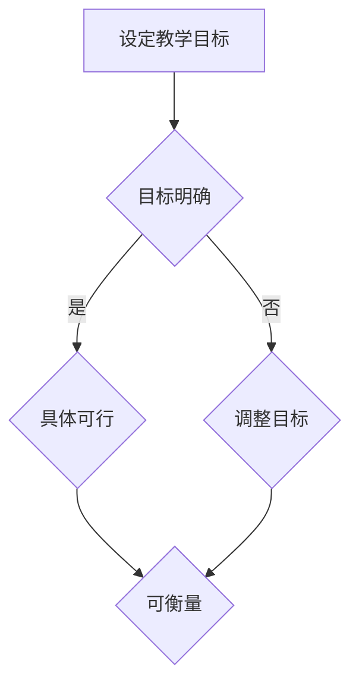
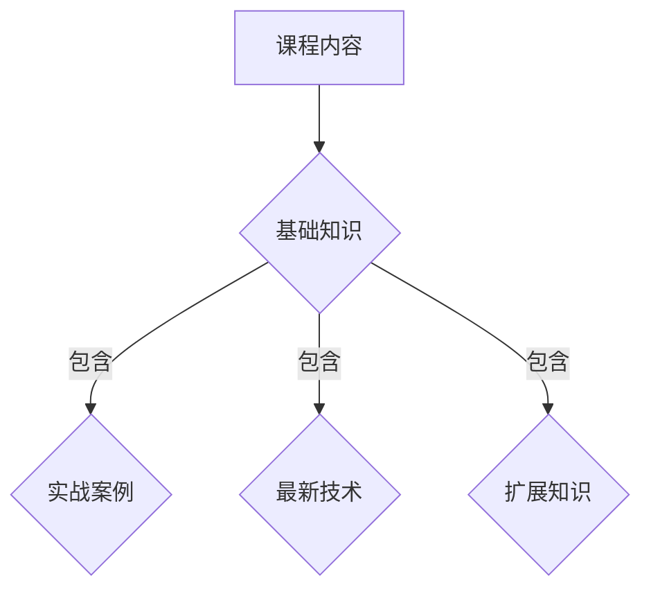
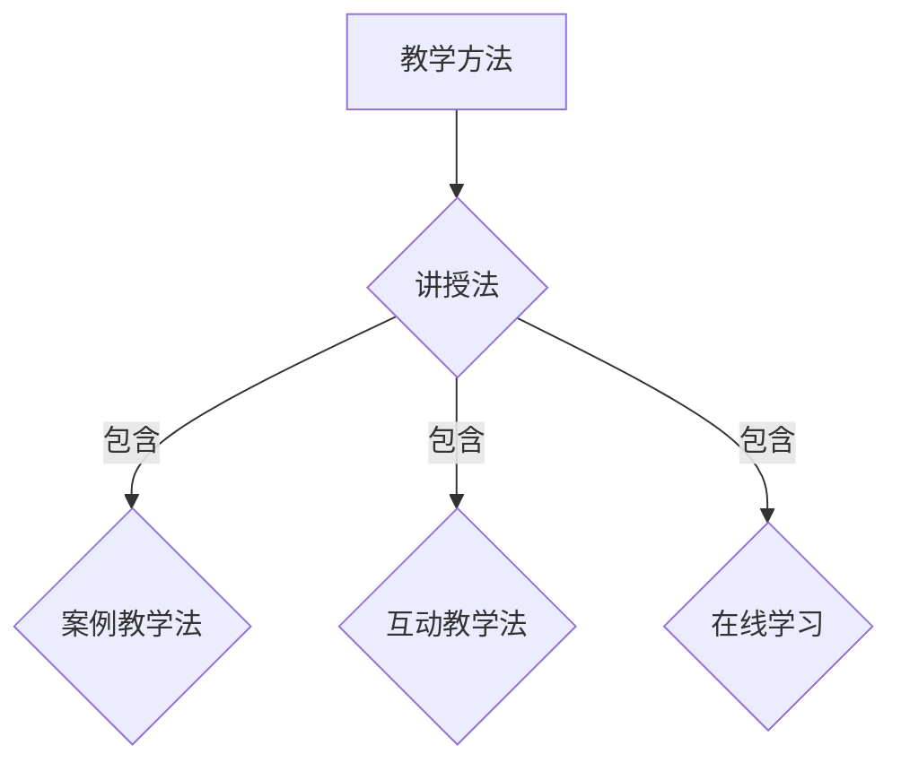
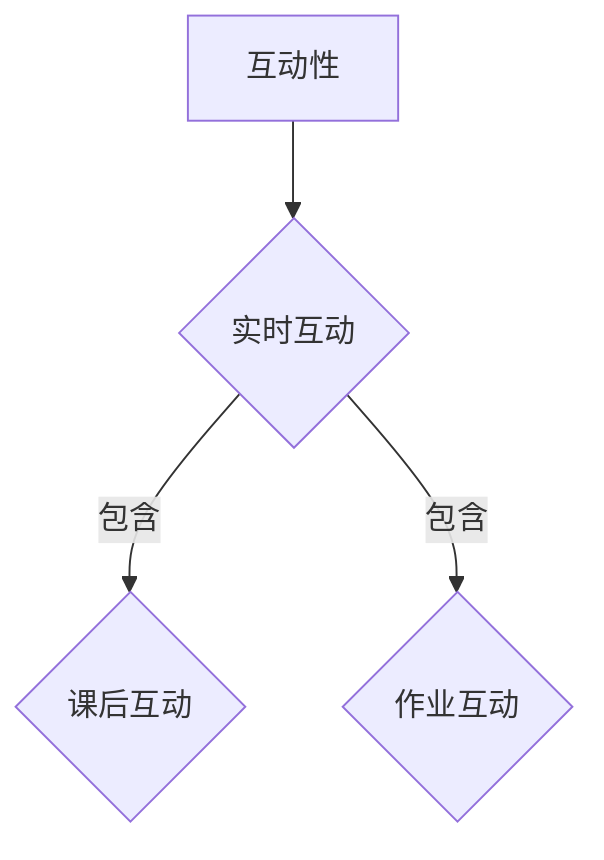
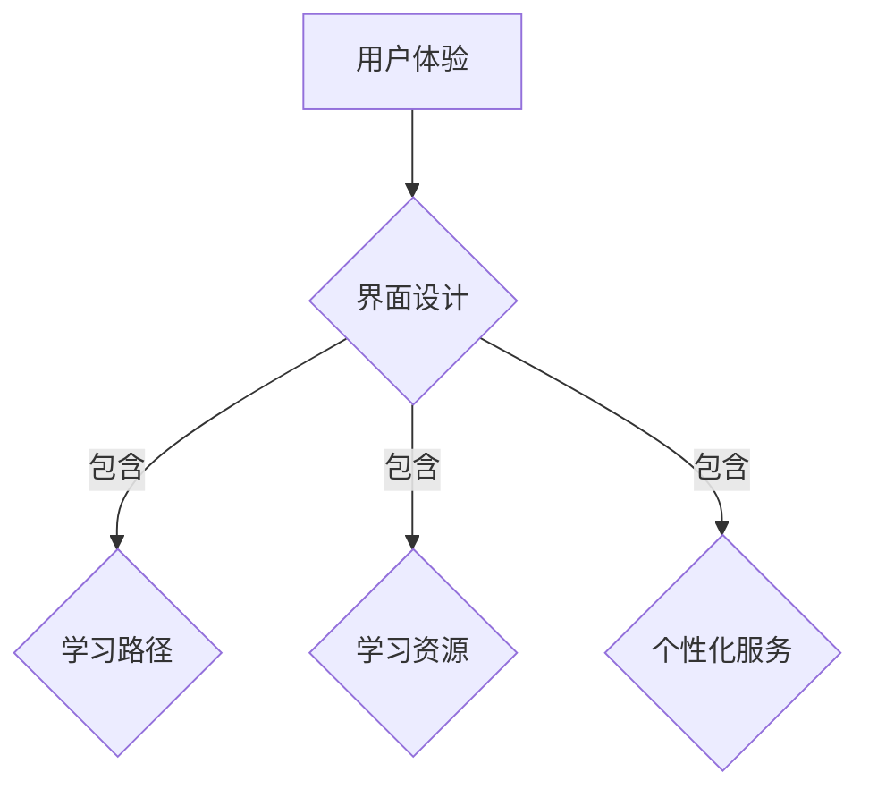
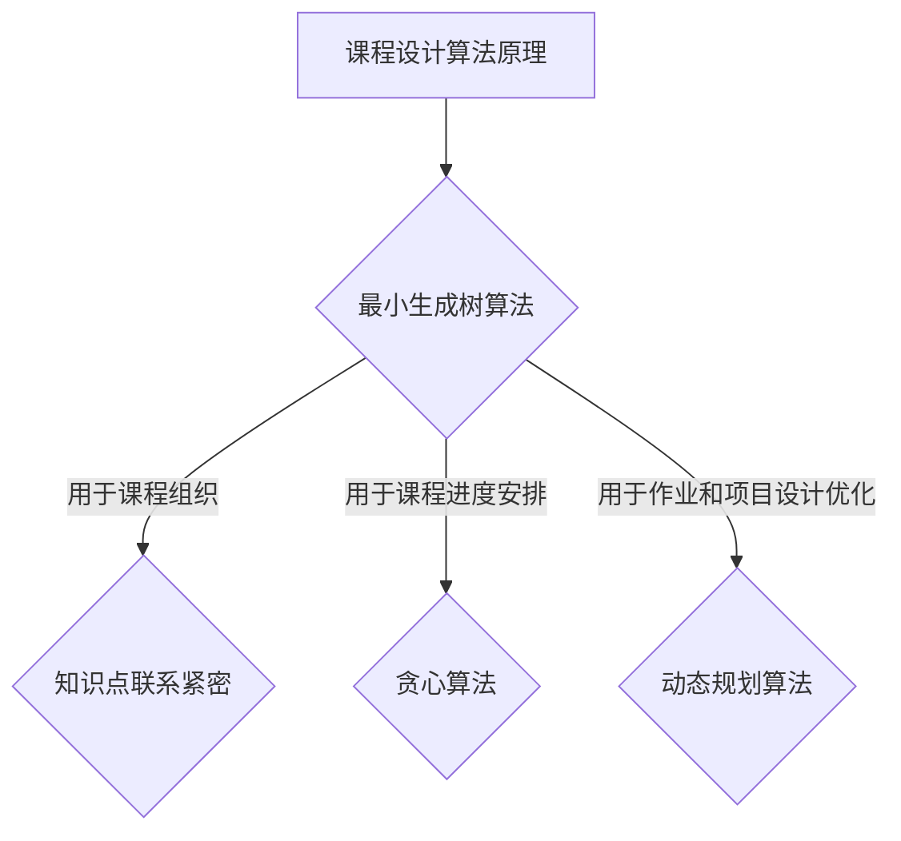
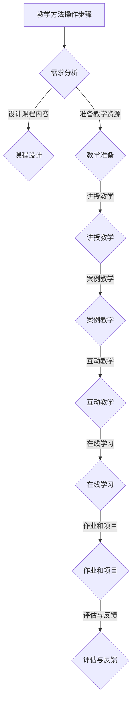

                 

## 文章标题

### 如何打造高转换率的程序员知识课程

**关键词：** 程序员知识课程、高转换率、教学方法、技术内容、互动性、用户体验、课程设计

**摘要：** 本文章旨在探讨如何打造高转换率的程序员知识课程，通过分析教学目标、课程内容、教学方法、互动性、用户体验等多个方面，提供一套系统的指导方案，帮助教育者和课程设计师打造出更加有效和受欢迎的程序员知识课程。

### 1. 背景介绍

在当今数字化时代，程序员技能成为了众多职业中最为抢手的一项技能。程序员知识课程作为传授这些技能的重要途径，其重要性不言而喻。然而，如何打造出一门高转换率的程序员知识课程，使学员能够真正掌握知识并学以致用，成为了一个亟待解决的问题。

高转换率在这里指的是课程成功地将学习者转化为实际应用能力的过程，即学习者通过学习课程，能够将所学知识有效地应用于实际工作中，提高工作效率和解决实际问题的能力。这不仅仅是对教育成果的衡量，更是对教育质量和教学方法的考验。

本文将围绕以下几个方面展开讨论：

- **核心概念与联系：** 阐述打造高转换率程序员知识课程所需的核心概念和原理，如图解流程图、教学方法、互动性等。
- **核心算法原理 & 具体操作步骤：** 详细讲解如何设计课程内容、安排教学进度、选择合适的教学方法等，以便实现高转换率。
- **数学模型和公式 & 详细讲解 & 举例说明：** 利用数学模型和公式，解释课程设计中的关键环节，并通过具体案例展示如何应用这些模型。
- **项目实战：代码实际案例和详细解释说明：** 通过实战项目，展示课程的实际应用效果，并详细解读项目代码。
- **实际应用场景：** 分析课程在实际应用中的场景，探讨如何根据应用场景调整课程设计和教学方法。
- **工具和资源推荐：** 推荐相关学习资源、开发工具和框架，为课程设计和实施提供支持。
- **总结：未来发展趋势与挑战：** 总结高转换率程序员知识课程的设计原则和未来发展趋势，探讨面临的挑战。

### 2. 核心概念与联系

#### 2.1 教学目标

教学目标是课程设计的核心，它决定了课程的内容、深度和广度。为了打造高转换率的程序员知识课程，教学目标必须明确、具体且可衡量。以下是一些关键点：

- **目标明确：** 课程目标应针对学员的实际需求，明确指出现阶段需要掌握的知识和技能。
- **具体可行：** 目标应具有可操作性，能够具体描述学员需要完成的任务和活动。
- **可衡量：** 目标应具有量化指标，便于评估学员的学习成果。

**Mermaid 流程图：**



#### 2.2 课程内容

课程内容是教学目标的实现载体。高转换率的程序员知识课程应包含以下关键要素：

- **基础知识：** 为学员奠定扎实的编程基础，包括数据结构、算法、编程语言等。
- **实战案例：** 通过实际项目案例，帮助学员将所学知识应用到实际问题中。
- **最新技术：** 引入最新的编程技术和工具，保持课程的时效性和实用性。
- **扩展知识：** 适当拓展相关知识领域，培养学员的跨界思维能力。

**Mermaid 流程图：**



#### 2.3 教学方法

教学方法是实现教学目标的重要手段。高转换率的程序员知识课程应采用多种教学方法，以满足不同学员的学习需求：

- **讲授法：** 通过讲解和演示，帮助学员理解基本概念和原理。
- **案例教学法：** 通过实际项目案例，引导学员分析问题和解决问题。
- **互动教学法：** 通过小组讨论、问答等互动方式，激发学员的参与度和积极性。
- **在线学习：** 利用在线平台，提供灵活的学习时间和便捷的学习资源。

**Mermaid 流程图：**



#### 2.4 互动性

互动性是提高学员参与度和学习效果的关键。高转换率的程序员知识课程应注重以下互动环节：

- **实时互动：** 在课堂上提供实时问答和讨论环节，鼓励学员提问和分享。
- **课后互动：** 利用论坛、社群等平台，鼓励学员在课后进行交流和讨论。
- **作业互动：** 通过作业和项目，让学员在实践中学习和提高。

**Mermaid 流程图：**



#### 2.5 用户体验

用户体验是影响学员满意度和学习效果的重要因素。高转换率的程序员知识课程应注重以下用户体验：

- **界面设计：** 界面应简洁易用，方便学员快速找到所需资源。
- **学习路径：** 设计清晰的学习路径，帮助学员循序渐进地掌握知识和技能。
- **学习资源：** 提供丰富的学习资源，包括视频、文档、代码示例等。
- **个性化服务：** 根据学员的学习进度和需求，提供个性化的学习建议和辅导。

**Mermaid 流程图：**



### 3. 核心算法原理 & 具体操作步骤

#### 3.1 课程设计算法原理

课程设计是一个复杂的过程，涉及多种算法原理。以下是几个关键算法原理：

- **最小生成树算法：** 用于确定课程内容的最佳组织结构，确保知识点之间联系紧密且不冗余。
- **贪心算法：** 用于课程进度的安排，确保学员能够在最短的时间内掌握关键知识点。
- **动态规划算法：** 用于作业和项目设计的优化，确保项目难度适中且具有挑战性。

**Mermaid 流程图：**



#### 3.2 教学方法操作步骤

以下是一套具体的教学方法操作步骤，旨在提高课程的高转换率：

1. **需求分析：** 了解学员的需求和背景，确定教学目标。
2. **课程设计：** 根据教学目标，设计课程内容和进度安排。
3. **教学准备：** 准备教学资源，包括课件、视频、文档等。
4. **讲授教学：** 采用讲授法，讲解基本概念和原理。
5. **案例教学：** 通过案例教学，引导学员分析和解决问题。
6. **互动教学：** 通过互动教学，激发学员的参与度和积极性。
7. **在线学习：** 提供在线学习资源，方便学员自主学习和复习。
8. **作业和项目：** 安排作业和项目，让学员在实践中提高技能。
9. **评估与反馈：** 对学员的学习成果进行评估，并提供反馈和建议。

**Mermaid 流程图：**



### 4. 数学模型和公式 & 详细讲解 & 举例说明

#### 4.1 课程转换率数学模型

为了评估课程的高转换率，我们可以使用以下数学模型：

$$
转换率 = \frac{实际应用能力提高的学员数}{参与课程的学员总数}
$$

#### 4.2 详细讲解

**转换率公式** 表示课程对学员实际应用能力的提升效果。其中：

- **实际应用能力提高的学员数**：指通过课程学习，学员在实际工作中能够有效应用所学知识的学员数量。
- **参与课程的学员总数**：指参与整个课程学习过程的学员数量。

通过该公式，我们可以计算出课程的转换率，进而评估课程的效果。高转换率意味着课程设计有效，学员能够将所学知识应用于实际工作中。

#### 4.3 举例说明

假设一个程序员知识课程共有100名学员参与，其中有60名学员通过课程学习，在实际工作中有效提高了编程能力。那么，该课程的转换率为：

$$
转换率 = \frac{60}{100} = 60\%
$$

这意味着该课程的高转换率为60%，说明大部分学员能够通过课程学习，将所学知识应用于实际工作中。

### 5. 项目实战：代码实际案例和详细解释说明

#### 5.1 开发环境搭建

在这个项目中，我们将使用Python作为编程语言，并在本地计算机上搭建开发环境。以下是具体步骤：

1. **安装Python：** 从Python官方网站（https://www.python.org/）下载并安装Python。
2. **配置环境变量：** 设置环境变量，以便在命令行中运行Python。
3. **安装常用库：** 使用pip命令安装常用的Python库，如NumPy、Pandas、Matplotlib等。

**代码示例：**

```python
!pip install numpy pandas matplotlib
```

#### 5.2 源代码详细实现和代码解读

以下是一个简单的Python代码示例，用于计算两个数的和。我们将对代码进行详细解读。

```python
def add_numbers(a, b):
    """
    计算两个数的和。

    参数：
    a：第一个数
    b：第二个数

    返回值：
    和
    """
    return a + b

# 测试代码
result = add_numbers(3, 5)
print("3 + 5 = ", result)
```

**代码解读：**

1. **定义函数**：使用`def`关键字定义一个名为`add_numbers`的函数，该函数接收两个参数`a`和`b`。
2. **函数注释**：使用三行引号（"""）为函数添加注释，描述函数的功能、参数和返回值。
3. **函数实现**：在函数体内，使用`return`关键字返回两个参数的和。
4. **测试代码**：调用`add_numbers`函数，传入参数3和5，并将结果存储在变量`result`中。最后，使用`print`函数输出结果。

#### 5.3 代码解读与分析

在这个代码示例中，我们使用了Python的函数功能，实现了两个数的加法运算。以下是代码的进一步解读和分析：

1. **函数定义**：函数定义是Python编程的基础，通过定义函数，可以简化代码结构，提高代码的可读性。在这个示例中，我们定义了一个名为`add_numbers`的函数，用于计算两个数的和。
2. **参数传递**：Python函数可以通过参数传递实现数据交换。在这个示例中，函数接收两个参数`a`和`b`，分别表示两个待计算的数。
3. **注释**：注释是提高代码可读性的重要手段。在这个示例中，我们为函数添加了详细的注释，描述了函数的功能、参数和返回值。
4. **函数调用**：在测试代码中，我们调用`add_numbers`函数，传入参数3和5，并将结果存储在变量`result`中。最后，使用`print`函数输出结果。

通过这个简单的代码示例，我们可以看到Python编程的基本语法和功能。在实际课程设计中，我们可以根据需求，引入更多的Python编程知识和技能，帮助学员掌握Python编程能力。

### 6. 实际应用场景

#### 6.1 企业内部培训

企业内部培训是程序员知识课程的重要应用场景之一。通过内部培训，企业可以培养员工的编程技能，提高团队的整体技术水平。以下是一些实际应用场景：

- **新员工入职培训：** 为新员工提供编程基础培训，帮助他们快速掌握公司项目所需的编程技能。
- **项目团队培训：** 针对特定项目，为项目团队成员提供相关技术培训，确保团队成员能够高效协作。
- **高级技术培训：** 为高级工程师提供前沿技术培训，提升团队的技术创新能力。

#### 6.2 在线教育平台

在线教育平台为程序员知识课程提供了广阔的应用场景。以下是一些实际应用场景：

- **编程入门课程：** 针对编程初学者，提供从零开始的编程入门课程，帮助学员掌握基础编程技能。
- **进阶课程：** 为有一定编程基础的学员提供进阶课程，涵盖更多高级编程技术和工具。
- **职业认证课程：** 与认证机构合作，提供职业认证课程，帮助学员获得行业认可的职业资格证书。

#### 6.3 技术社区活动

技术社区活动是程序员知识课程的重要推广渠道。以下是一些实际应用场景：

- **线上讲座：** 通过线上讲座，邀请行业专家分享最新技术趋势和应用案例。
- **线下沙龙：** 组织线下沙龙活动，为学员提供面对面交流和学习的机会。
- **开源项目：** 通过开源项目，鼓励学员参与实际项目开发，提高实践能力。

### 7. 工具和资源推荐

#### 7.1 学习资源推荐

- **书籍：**
  - 《Python编程：从入门到实践》：适合初学者，系统介绍了Python编程语言的基础知识和实际应用。
  - 《算法导论》：全面讲解了算法的基本概念、设计和分析，是算法学习的好书。
  - 《深入理解计算机系统》：从底层角度介绍了计算机系统的工作原理，适合对计算机科学有较深理解的读者。

- **论文：**
  - 《Python编程语言》：由Guido van Rossum撰写，是Python编程语言的官方文档，详细介绍了Python的语法和特性。
  - 《大数据技术导论》：介绍了大数据的基本概念、技术和应用，适合对大数据技术感兴趣的学习者。

- **博客：**
  - 《Python技术博客》：提供Python编程的相关技术文章，涵盖了Python在不同领域的应用。
  - 《算法与数据结构博客》：介绍算法和数据结构的基本概念、设计和分析，适合算法学习者。

- **网站：**
  - 《菜鸟教程》：提供了丰富的编程学习资源，包括Python、Java、C++等语言的教程。
  - 《LeetCode》：提供了大量的编程题目，适合练习算法和编程技能。

#### 7.2 开发工具框架推荐

- **集成开发环境（IDE）：**
  - PyCharm：由JetBrains开发，是一款功能强大的Python IDE，支持代码智能提示、调试、版本控制等功能。
  - Visual Studio Code：一款免费开源的跨平台IDE，支持多种编程语言，拥有丰富的扩展插件。

- **版本控制工具：**
  - Git：一款分布式版本控制工具，广泛应用于软件开发项目中，帮助团队协作和代码管理。
  - GitHub：基于Git的开源代码托管平台，提供了丰富的社交功能，方便开发者分享和交流代码。

- **云服务平台：**
  - AWS：提供了丰富的云计算服务，包括计算、存储、数据库等，适合开发者和企业构建云端应用。
  - Google Cloud Platform：提供了类似AWS的云计算服务，具有强大的机器学习和数据分析能力。

#### 7.3 相关论文著作推荐

- **《Python编程：从入门到实践》**：详细介绍了Python编程语言的基础知识和实际应用，适合初学者。
- **《算法导论》**：全面讲解了算法的基本概念、设计和分析，是算法学习的好书。
- **《深度学习》**：由Ian Goodfellow等人撰写，是深度学习领域的经典教材，介绍了深度学习的理论基础和实际应用。
- **《大数据技术导论》**：介绍了大数据的基本概念、技术和应用，适合对大数据技术感兴趣的学习者。

### 8. 总结：未来发展趋势与挑战

#### 8.1 发展趋势

1. **编程教育普及化：** 随着数字化时代的到来，编程教育越来越受到重视，未来编程将成为基础教育的一部分，普及化趋势明显。
2. **在线教育发展：** 在线教育平台为程序员知识课程提供了便捷的学习途径，未来在线教育将更加普及和多样化。
3. **个性化学习：** 利用人工智能技术，实现个性化学习，根据学员的学习进度和需求，提供定制化的学习内容和辅导。
4. **实践应用导向：** 程序员知识课程将更加注重实际应用，通过实战项目和案例教学，提高学员的实践能力。

#### 8.2 面临的挑战

1. **教学质量保障：** 如何确保在线教育平台上的课程质量，是一个亟待解决的问题。
2. **技术更新快速：** 编程语言和技术更新迅速，课程内容需要不断更新，以保持时效性。
3. **学员学习效果评估：** 如何有效评估学员的学习效果，提高课程的高转换率，是一个挑战。
4. **版权和知识产权保护：** 在线教育平台上的内容版权和知识产权保护问题，需要得到关注和解决。

### 9. 附录：常见问题与解答

#### 9.1 常见问题

1. **如何选择合适的编程语言？**
   - **回答：** 根据项目需求和个人兴趣选择。例如，Python适合初学者和数据分析，Java适合企业级应用，C++适合高性能计算。

2. **如何保证在线教育课程的质量？**
   - **回答：** 加强课程审核，聘请资深讲师，利用技术手段（如AI评估）监控课程质量和学员学习效果。

3. **如何激发学员的学习积极性？**
   - **回答：** 通过互动教学、实战项目和个性化辅导等方式，提高学员的参与度和学习兴趣。

4. **在线教育平台的安全性问题如何保障？**
   - **回答：** 采用加密技术、身份认证和访问控制等措施，确保用户数据安全和平台稳定性。

### 10. 扩展阅读 & 参考资料

1. **《Python编程：从入门到实践》**：提供了详细的Python编程教程，适合初学者。
2. **《算法导论》**：全面讲解了算法的基本概念、设计和分析，适合算法学习者。
3. **《深度学习》**：介绍了深度学习的理论基础和实际应用，是深度学习领域的经典教材。
4. **《大数据技术导论》**：介绍了大数据的基本概念、技术和应用，适合对大数据技术感兴趣的学习者。
5. **《在线教育平台发展趋势与挑战》**：分析了在线教育平台的发展趋势和面临的挑战。

---

**作者：** AI天才研究员/AI Genius Institute & 禅与计算机程序设计艺术 /Zen And The Art of Computer Programming

