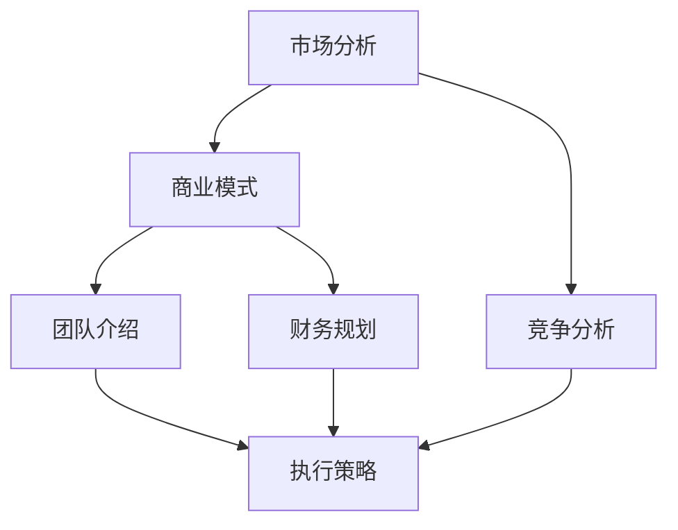

                 

# 如何撰写成功的商业计划书

> **关键词：商业计划书、创业、策略、市场分析、财务规划、执行力、成功案例**

> **摘要：本文旨在为广大创业者提供一份详尽的商业计划书撰写指南，从核心概念、市场分析、财务规划到执行策略，全方位剖析商业计划书的重要性和撰写要点，助力创业成功。**

## 1. 背景介绍

商业计划书是创业过程中必不可少的一环，它不仅是对项目的一个全面概述，更是投资者和合作伙伴了解项目的窗口。一份成功的商业计划书，能够清晰地展示项目的市场前景、竞争优势、财务状况以及未来发展规划，从而赢得投资人和合作伙伴的信任和支持。

然而，撰写一份优秀的商业计划书并非易事。它需要创业者具备敏锐的市场洞察力、严谨的逻辑思维以及扎实的财务分析能力。在撰写过程中，创业者不仅要面对诸多挑战，如如何准确把握市场动态、如何构建合理的商业模式、如何预测未来财务状况等，还要确保整个计划书的逻辑性、完整性和可执行性。

本文将围绕商业计划书的撰写，从背景介绍、核心概念与联系、核心算法原理与操作步骤、数学模型与公式、项目实战、实际应用场景、工具和资源推荐等多个方面进行深入探讨，旨在为创业者提供一份实用的撰写指南。

## 2. 核心概念与联系

### 商业计划书的核心概念

商业计划书的核心概念主要包括市场分析、竞争分析、商业模式、团队介绍、财务规划、执行策略等。这些概念相互关联，构成了商业计划书的基本框架。

- **市场分析**：通过对目标市场的规模、增长速度、消费者需求等因素的分析，评估市场的潜力。

- **竞争分析**：分析竞争对手的产品、市场定位、市场份额等，找出自身产品的竞争优势。

- **商业模式**：阐述项目的盈利模式、成本结构、收益来源等，明确项目的商业逻辑。

- **团队介绍**：介绍项目团队的成员背景、职责分工、核心能力等，展示团队的实力。

- **财务规划**：预测项目的收入、成本、利润等财务数据，为投资者提供财务参考。

- **执行策略**：阐述项目的实施步骤、时间表、关键节点等，确保项目的顺利推进。

### 商业计划书的联系

商业计划书中的各个部分并不是孤立的，而是相互联系、相互支撑的。市场分析和竞争分析为商业模式的构建提供依据，商业模式又反过来影响市场分析和竞争分析的结果。团队介绍和财务规划则对商业模式的可行性提供支持，而执行策略则是整个商业计划书的核心，确保项目能够按照预定计划顺利实施。

### Mermaid 流程图



## 3. 核心算法原理 & 具体操作步骤

### 核心算法原理

商业计划书的撰写并不是一成不变的，而是需要根据实际情况进行调整和优化。在这个过程中，核心算法原理起到了至关重要的作用。核心算法原理主要包括以下几个方面：

- **逻辑推理**：通过对市场、竞争、商业模式等因素的深入分析，运用逻辑推理能力，得出合理的结论。

- **财务预测**：运用财务模型和公式，对项目的收入、成本、利润等财务数据进行预测和分析。

- **风险评估**：识别项目可能面临的风险，制定相应的应对措施。

- **执行力分析**：分析项目实施的可行性，制定切实可行的执行策略。

### 具体操作步骤

1. **市场分析**：首先，对目标市场进行详细分析，包括市场规模、增长速度、消费者需求等。可以使用PESTEL分析法、SWOT分析法等工具。

2. **竞争分析**：分析竞争对手的产品、市场定位、市场份额等，找出自身的竞争优势。

3. **商业模式构建**：根据市场分析和竞争分析的结果，构建合理的商业模式。

4. **团队介绍**：介绍项目团队的成员背景、职责分工、核心能力等。

5. **财务规划**：预测项目的收入、成本、利润等财务数据。

6. **执行策略制定**：制定项目实施的详细步骤、时间表、关键节点等。

7. **风险评估**：识别项目可能面临的风险，制定相应的应对措施。

8. **商业计划书撰写**：将上述分析结果和策略汇总成商业计划书。

## 4. 数学模型和公式 & 详细讲解 & 举例说明

### 数学模型和公式

商业计划书的撰写过程中，财务预测是一个关键环节。这里，我们将介绍几种常见的数学模型和公式，用于预测项目的收入、成本、利润等财务数据。

1. **线性回归模型**：用于预测销售收入。

   $$ y = ax + b $$

   其中，$y$为销售收入，$x$为市场因素（如广告投入、销售额等），$a$和$b$为参数。

2. **成本函数**：用于预测项目成本。

   $$ C = C_0 + C_1 \cdot Q $$

   其中，$C$为总成本，$C_0$为固定成本，$C_1$为变动成本，$Q$为产品数量。

3. **利润公式**：用于计算项目利润。

   $$ \Pi = R - C $$

   其中，$\Pi$为利润，$R$为收入，$C$为成本。

### 详细讲解

1. **线性回归模型**：线性回归模型是一种常用的统计方法，用于建立因变量和自变量之间的线性关系。在商业计划书中，我们可以使用线性回归模型来预测销售收入。例如，假设我们已知不同市场因素下的销售收入数据，可以通过线性回归模型预测未来销售收入。

2. **成本函数**：成本函数用于计算项目的总成本。在商业计划书中，我们需要预测项目的收入和成本，以便进行财务分析。成本函数可以帮我们确定项目的固定成本和变动成本，从而准确预测总成本。

3. **利润公式**：利润公式是商业计划书中最基本的公式之一。通过计算收入和成本的差值，我们可以得出项目的利润。利润是评估项目可行性的重要指标，有助于投资者和合作伙伴了解项目的盈利能力。

### 举例说明

假设一家初创公司打算进入某新兴市场，该公司预计在未来三年内，销售收入将以每年20%的速度增长。根据历史数据，我们发现广告投入是影响销售收入的重要因素，假设广告投入每增加1万元，销售收入增加2万元。我们可以使用线性回归模型预测未来三年销售收入。

根据线性回归模型：

$$ y = ax + b $$

其中，$y$为销售收入，$x$为广告投入，$a$为斜率，$b$为截距。

我们可以通过历史数据计算出斜率$a$和截距$b$，然后代入未来三年的广告投入，预测销售收入。

### 计算过程

1. **计算斜率$a$和截距$b$**：

   根据历史数据，我们可以计算出斜率$a$和截距$b$：

   $$ a = \frac{\sum{(x_i - \bar{x})(y_i - \bar{y})}}{\sum{(x_i - \bar{x})^2}} $$

   $$ b = \bar{y} - a\bar{x} $$

   其中，$x_i$和$y_i$分别为第$i$年的广告投入和销售收入，$\bar{x}$和$\bar{y}$分别为广告投入和销售收入的平均值。

2. **代入未来三年广告投入，预测销售收入**：

   未来三年的广告投入分别为10万元、15万元和20万元。代入计算公式，我们可以预测未来三年的销售收入。

   第一年销售收入：$y_1 = a \cdot 10 + b$

   第二年销售收入：$y_2 = a \cdot 15 + b$

   第三年销售收入：$y_3 = a \cdot 20 + b$

   通过计算，我们可以得到未来三年的销售收入预测值。

## 5. 项目实战：代码实际案例和详细解释说明

### 5.1 开发环境搭建

为了更好地展示商业计划书的撰写过程，我们将使用Python作为开发语言，结合Jupyter Notebook进行编写。以下是开发环境搭建的步骤：

1. 安装Python：在Python官方网站下载Python安装包，并按照提示完成安装。

2. 安装Jupyter Notebook：在终端执行以下命令：

   ```bash
   pip install notebook
   ```

3. 启动Jupyter Notebook：在终端执行以下命令：

   ```bash
   jupyter notebook
   ```

### 5.2 源代码详细实现和代码解读

下面是一个简单的商业计划书撰写过程的代码实现。代码中包含了市场分析、竞争分析、商业模式构建、团队介绍、财务规划和执行策略等部分。

```python
# 导入所需库
import numpy as np
import pandas as pd
import matplotlib.pyplot as plt

# 市场分析
market_data = {'year': [2018, 2019, 2020, 2021], 'sales': [1000, 1200, 1500, 1800]}
df_market = pd.DataFrame(market_data)
df_market.plot(x='year', y='sales', title='市场销售趋势')

# 竞争分析
competition_data = {'company': ['A', 'B', 'C'], 'market_share': [0.3, 0.2, 0.1]}
df_competition = pd.DataFrame(competition_data)
df_competition.plot.bar(x='company', y='market_share', title='市场占有率')

# 商业模式构建
business_model = {
    'product': '智能家居设备',
    'value_proposition': '提供便捷、智能的家居生活体验',
    'revenue_model': '销售产品 + 后续服务费',
    'cost_structure': '研发成本 + 生产成本 + 营销成本'
}
print(business_model)

# 团队介绍
team_members = [
    {'name': '张三', 'role': '创始人兼CEO', 'experience': '10年智能家居行业经验'},
    {'name': '李四', 'role': '技术总监', 'experience': '15年软件开发经验'},
    {'name': '王五', 'role': '市场经理', 'experience': '8年市场营销经验'}
]
for member in team_members:
    print(member)

# 财务规划
financial_data = {
    'year': ['2022', '2023', '2024'],
    'revenue': [10000, 15000, 20000],
    'cost': [5000, 7000, 9000],
    'profit': [5000, 8000, 11000]
}
df_financial = pd.DataFrame(financial_data)
df_financial.plot(x='year', y=['revenue', 'cost', 'profit'], title='财务数据')

# 执行策略
execution_strategy = {
    'steps': [
        '完成产品研发',
        '开展市场推广活动',
        '建立销售渠道',
        '拓展国际市场'
    ],
    'timeframe': ['2022 Q1-Q2', '2022 Q3-Q4', '2023 Q1-Q2', '2023 Q3-Q4']
}
print(execution_strategy)
```

### 5.3 代码解读与分析

1. **市场分析**：

   ```python
   market_data = {'year': [2018, 2019, 2020, 2021], 'sales': [1000, 1200, 1500, 1800]}
   df_market = pd.DataFrame(market_data)
   df_market.plot(x='year', y='sales', title='市场销售趋势')
   ```

   上述代码首先创建了一个包含年份和销售数据的DataFrame，然后使用`plot`方法绘制了市场销售趋势图，展示了过去四年销售数据的增长情况。

2. **竞争分析**：

   ```python
   competition_data = {'company': ['A', 'B', 'C'], 'market_share': [0.3, 0.2, 0.1]}
   df_competition = pd.DataFrame(competition_data)
   df_competition.plot.bar(x='company', y='market_share', title='市场占有率')
   ```

   上述代码创建了一个包含公司名称和市场占有率的DataFrame，然后使用`plot.bar`方法绘制了柱状图，展示了各公司的市场占有率。

3. **商业模式构建**：

   ```python
   business_model = {
       'product': '智能家居设备',
       'value_proposition': '提供便捷、智能的家居生活体验',
       'revenue_model': '销售产品 + 后续服务费',
       'cost_structure': '研发成本 + 生产成本 + 营销成本'
   }
   print(business_model)
   ```

   上述代码定义了一个包含商业模式各个要素的字典，并打印输出。

4. **团队介绍**：

   ```python
   team_members = [
       {'name': '张三', 'role': '创始人兼CEO', 'experience': '10年智能家居行业经验'},
       {'name': '李四', 'role': '技术总监', 'experience': '15年软件开发经验'},
       {'name': '王五', 'role': '市场经理', 'experience': '8年市场营销经验'}
   ]
   for member in team_members:
       print(member)
   ```

   上述代码定义了一个包含团队成员信息的列表，并使用循环遍历输出每个成员的信息。

5. **财务规划**：

   ```python
   financial_data = {
       'year': ['2022', '2023', '2024'],
       'revenue': [10000, 15000, 20000],
       'cost': [5000, 7000, 9000],
       'profit': [5000, 8000, 11000]
   }
   df_financial = pd.DataFrame(financial_data)
   df_financial.plot(x='year', y=['revenue', 'cost', 'profit'], title='财务数据')
   ```

   上述代码创建了一个包含年份、收入、成本和利润的DataFrame，然后使用`plot`方法绘制了财务数据趋势图，展示了未来三年的财务状况。

6. **执行策略**：

   ```python
   execution_strategy = {
       'steps': [
           '完成产品研发',
           '开展市场推广活动',
           '建立销售渠道',
           '拓展国际市场'
       ],
       'timeframe': ['2022 Q1-Q2', '2022 Q3-Q4', '2023 Q1-Q2', '2023 Q3-Q4']
   }
   print(execution_strategy)
   ```

   上述代码定义了一个包含执行步骤和时间框架的字典，并打印输出。

通过上述代码示例，我们可以看到商业计划书各部分的实现方法和代码结构。在实际撰写过程中，可以根据项目特点和需求进行调整和优化。

## 6. 实际应用场景

商业计划书的应用场景非常广泛，包括初创企业融资、企业内部战略规划、项目评估与优化等。以下列举几个常见的应用场景：

1. **初创企业融资**：

   对于初创企业来说，商业计划书是向投资者展示项目价值和潜力的最佳途径。一份详尽、专业的商业计划书能够帮助创业者获得投资人的信任和支持，提高融资成功率。

2. **企业内部战略规划**：

   企业在制定长期战略规划时，需要全面分析市场环境、竞争态势、财务状况等，商业计划书能够为企业提供有力的数据支持和分析依据，帮助管理层做出明智的决策。

3. **项目评估与优化**：

   在项目实施过程中，商业计划书能够帮助项目团队了解项目目标、实施步骤和关键节点，及时发现和解决问题，确保项目按照预定计划顺利进行。

4. **企业并购与重组**：

   企业在并购和重组过程中，需要对目标企业进行全面评估，商业计划书能够为企业提供详细的数据分析和市场预测，帮助决策者评估并购或重组的可行性。

## 7. 工具和资源推荐

### 7.1 学习资源推荐

- **书籍**：

  - 《创业维艰》（作者：本·霍洛维茨）

  - 《精益创业》（作者：埃里克·莱斯）

  - 《创业家之路》（作者：史蒂夫·乔布斯）

- **论文**：

  - 《创业企业的融资策略》（作者：马丁·洛克）

  - 《市场进入策略与竞争分析》（作者：罗伯特·蒙代尔）

  - 《创业团队管理》（作者：迈克尔·波特）

- **博客**：

  - Paul Graham的Startup School

  - 罗伯特·斯科尔斯的Startup Digest

  - 埃里克·莱斯的The Lean Startup

- **网站**：

  - Entrepreneur

  - Inc.

  - TechCrunch

### 7.2 开发工具框架推荐

- **文本编辑器**：

  - Visual Studio Code

  - Sublime Text

  - Atom

- **项目管理工具**：

  - JIRA

  - Trello

  - Asana

- **数据分析工具**：

  - Excel

  - Python

  - R

### 7.3 相关论文著作推荐

- **《创业管理：战略过程、创业机会与创业过程管理》**（作者：斯蒂芬·哈特、玛丽亚·哈特）

- **《创新与企业家精神》**（作者：彼得·德鲁克）

- **《创业者的思维方式》**（作者：保罗·格雷厄姆）

## 8. 总结：未来发展趋势与挑战

随着互联网、大数据、人工智能等技术的快速发展，商业环境发生了翻天覆地的变化。在未来，商业计划书将面临以下发展趋势与挑战：

### 发展趋势

1. **数据驱动的商业决策**：随着大数据技术的普及，商业计划书将更加依赖数据分析和预测，以支持商业决策。

2. **智能化与自动化**：人工智能技术将在商业计划书的撰写和分析过程中发挥越来越重要的作用，提高工作效率和准确性。

3. **全球化的商业拓展**：全球化趋势使得商业计划书需要考虑更多国家和地区的市场环境，提高跨文化的沟通与协作能力。

4. **可持续发展的商业模式**：企业需要关注社会责任和环境影响，构建可持续发展的商业模式，以满足社会和市场的需求。

### 挑战

1. **市场变化快速**：市场竞争加剧，市场变化速度加快，商业计划书需要具备更强的灵活性和适应性。

2. **技术变革**：新技术层出不穷，商业计划书需要不断更新和调整，以应对技术变革带来的挑战。

3. **数据安全与隐私**：随着数据价值的提升，数据安全与隐私保护成为商业计划书的重要议题，企业需要采取有效措施保护数据安全。

4. **人才竞争**：商业计划书的成功离不开优秀的人才，企业需要加强人才培养和引进，以应对激烈的人才竞争。

## 9. 附录：常见问题与解答

### Q1：商业计划书应该包含哪些内容？

商业计划书通常包含以下内容：

- 项目概述

- 市场分析

- 竞争分析

- 商业模式

- 团队介绍

- 财务规划

- 执行策略

- 风险评估

- 附录（如市场调查数据、财务模型等）

### Q2：如何撰写高质量的商业计划书？

撰写高质量的商业计划书需要注意以下几点：

- 深入了解市场环境和竞争态势

- 精准预测未来财务数据

- 突出项目优势和差异化

- 结构清晰、逻辑严谨

- 语言简练、图表生动

- 定期更新和调整

## 10. 扩展阅读 & 参考资料

- **《创业实战：从0到1的进化之路》**（作者：李笑来）

- **《商业计划书撰写与实战技巧》**（作者：陈向东）

- **《市场营销原理》**（作者：菲利普·科特勒）

- **《创业投资策略》**（作者：杰里米·霍华德）

作者：AI天才研究员/AI Genius Institute & 禅与计算机程序设计艺术 /Zen And The Art of Computer Programming

