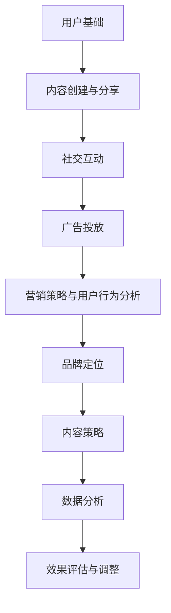

                 

# 如何有效利用社交媒体进行产品推广

## 关键词：社交媒体、产品推广、营销策略、数据分析、用户互动

## 摘要：
随着社交媒体的普及，企业通过社交媒体平台进行产品推广成为了一种重要的营销手段。本文将详细探讨如何有效利用社交媒体进行产品推广，包括核心概念与联系、核心算法原理与操作步骤、数学模型与应用、实战案例与代码解析，以及实际应用场景与工具资源推荐。通过本文的深入分析，读者将掌握社交媒体推广的策略与方法，提升产品知名度和市场竞争力。

## 1. 背景介绍

### 社交媒体与产品推广的关系

社交媒体平台，如Facebook、Twitter、Instagram、LinkedIn等，已经成为现代营销策略中不可或缺的一部分。这些平台不仅拥有庞大的用户基础，还提供了丰富的功能，使得企业可以与目标受众进行直接互动，传递产品信息，并收集用户反馈。因此，社交媒体成为产品推广的绝佳渠道。

### 产品推广的目标

产品推广的目标通常包括提高产品知名度、增加销售额、提升品牌形象等。通过社交媒体进行产品推广，可以快速扩大受众范围，实现上述目标。

### 社交媒体推广的优势

- **广泛的受众覆盖**：社交媒体平台拥有海量的用户，企业可以轻松触达潜在客户。
- **高效的互动性**：用户可以实时评论、点赞和分享产品信息，有助于建立品牌忠诚度。
- **灵活的广告形式**：社交媒体提供了多种广告形式，如横幅广告、视频广告、原生广告等，可以根据产品特点选择合适的广告形式。
- **精准的定位**：通过用户数据分析和精准定位，企业可以针对特定受众进行有针对性的广告投放。

## 2. 核心概念与联系

### 社交媒体平台的特点与功能

- **用户基础**：社交媒体平台拥有广泛的用户基础，这是进行产品推广的基础。
- **内容创建与分享**：用户可以在平台上创建和分享内容，这为产品推广提供了丰富的素材。
- **社交互动**：用户之间的互动，如点赞、评论、分享等，有助于传播产品信息。
- **广告投放**：平台提供了多种广告投放选项，如定向广告、品牌合作等。

### 营销策略与用户行为分析

- **用户画像**：通过用户数据，可以了解目标受众的年龄、性别、兴趣等特征，制定相应的营销策略。
- **用户行为分析**：分析用户在社交媒体上的行为，如浏览、点赞、评论等，了解用户偏好和需求。
- **互动策略**：根据用户行为，制定互动策略，如回复评论、发起话题等，增加用户参与度。

### 社交媒体推广的核心概念

- **品牌定位**：明确品牌形象和定位，确保推广内容与品牌一致。
- **内容策略**：制定有吸引力的内容策略，提高用户参与度。
- **数据分析**：通过数据分析，评估推广效果，调整推广策略。

### Mermaid 流程图



## 3. 核心算法原理 & 具体操作步骤

### 社交媒体数据分析算法

社交媒体数据分析是产品推广的重要环节。通过数据分析，可以了解用户需求和行为，优化推广策略。

- **数据收集**：从社交媒体平台获取用户数据，包括用户画像、行为数据等。
- **数据处理**：对收集到的数据进行清洗、转换和整合，为后续分析做准备。
- **特征提取**：从数据中提取有用特征，如用户年龄、性别、兴趣等。
- **数据建模**：使用机器学习算法，建立用户行为预测模型。

### 数据分析流程

1. **数据收集**：从社交媒体平台获取用户数据。
2. **数据预处理**：清洗和转换数据，确保数据质量。
3. **特征提取**：提取用户画像和用户行为特征。
4. **数据建模**：使用机器学习算法，建立用户行为预测模型。
5. **模型评估**：评估模型性能，调整模型参数。
6. **模型应用**：将模型应用于实际推广场景，优化推广策略。

### 社交媒体推广策略

1. **内容策略**：根据用户需求和兴趣，制定有吸引力的内容策略。
2. **广告投放**：选择合适的广告形式和投放渠道，提高广告效果。
3. **互动策略**：与用户互动，增加用户参与度。
4. **数据分析**：通过数据分析，评估推广效果，调整推广策略。

### 实际操作步骤

1. **确定目标受众**：根据产品特点和目标市场，确定目标受众。
2. **收集用户数据**：从社交媒体平台获取用户数据。
3. **分析用户需求**：通过数据分析，了解用户需求和偏好。
4. **制定内容策略**：根据用户需求，制定有吸引力的内容策略。
5. **设计广告形式**：选择合适的广告形式，如横幅广告、视频广告等。
6. **投放广告**：在社交媒体平台上投放广告。
7. **互动与反馈**：与用户互动，收集用户反馈，优化推广策略。
8. **效果评估**：评估推广效果，调整推广策略。

## 4. 数学模型和公式 & 详细讲解 & 举例说明

### 用户行为预测模型

用户行为预测模型是社交媒体数据分析的核心。以下是一个简单的用户行为预测模型，基于线性回归算法。

### 线性回归模型

$$y = \beta_0 + \beta_1 x_1 + \beta_2 x_2 + ... + \beta_n x_n$$

其中，$y$ 是用户行为指标，$x_1, x_2, ..., x_n$ 是用户特征变量，$\beta_0, \beta_1, \beta_2, ..., \beta_n$ 是模型参数。

### 模型参数估计

$$\beta = (X^T X)^{-1} X^T y$$

其中，$X$ 是特征矩阵，$y$ 是行为指标向量。

### 模型评估

- **均方误差（MSE）**：
  $$MSE = \frac{1}{n} \sum_{i=1}^{n} (y_i - \hat{y_i})^2$$
  其中，$y_i$ 是实际行为指标，$\hat{y_i}$ 是预测行为指标。

- **决定系数（R^2）**：
  $$R^2 = 1 - \frac{\sum_{i=1}^{n} (y_i - \hat{y_i})^2}{\sum_{i=1}^{n} (y_i - \bar{y})^2}$$
  其中，$\bar{y}$ 是行为指标的平均值。

### 举例说明

假设我们有一个用户行为预测模型，特征变量包括用户年龄、性别和兴趣。使用线性回归算法，我们可以预测用户是否会在社交媒体上点赞某个产品。

$$y = \beta_0 + \beta_1 x_1 + \beta_2 x_2 + \beta_3 x_3$$

其中，$y$ 是用户是否点赞的标签，$x_1$ 是用户年龄，$x_2$ 是用户性别（0为男性，1为女性），$x_3$ 是用户兴趣。

通过训练模型，我们得到以下参数：

$$\beta_0 = 0.5, \beta_1 = 0.2, \beta_2 = -0.1, \beta_3 = 0.3$$

使用这个模型，我们可以预测一个用户是否会在社交媒体上点赞某个产品。例如，一个用户年龄为25岁，性别为女性，兴趣为购物，我们将其特征变量代入模型：

$$y = 0.5 + 0.2 \times 25 + (-0.1) \times 1 + 0.3 \times 1 = 5.2$$

由于预测值大于0，我们可以认为这个用户有很大可能性在社交媒体上点赞该产品。

## 5. 项目实战：代码实际案例和详细解释说明

### 5.1 开发环境搭建

为了实现社交媒体数据分析，我们需要搭建一个开发环境。以下是所需的工具和软件：

- **Python**：主要编程语言。
- **Pandas**：数据处理库。
- **Scikit-learn**：机器学习库。
- **Matplotlib**：数据可视化库。

安装步骤如下：

```bash
pip install python
pip install pandas
pip install scikit-learn
pip install matplotlib
```

### 5.2 源代码详细实现和代码解读

以下是社交媒体数据分析的代码实现，包括数据收集、预处理、特征提取、模型训练和预测等步骤。

```python
import pandas as pd
from sklearn.model_selection import train_test_split
from sklearn.linear_model import LinearRegression
from sklearn.metrics import mean_squared_error, r2_score

# 数据收集
data = pd.read_csv('social_media_data.csv')

# 数据预处理
data = data.dropna()

# 特征提取
X = data[['age', 'gender', 'interest']]
y = data['like']

# 数据划分
X_train, X_test, y_train, y_test = train_test_split(X, y, test_size=0.2, random_state=42)

# 模型训练
model = LinearRegression()
model.fit(X_train, y_train)

# 预测
y_pred = model.predict(X_test)

# 模型评估
mse = mean_squared_error(y_test, y_pred)
r2 = r2_score(y_test, y_pred)

print("MSE:", mse)
print("R^2:", r2)

# 预测新用户
new_user = pd.DataFrame({'age': [25], 'gender': [1], 'interest': [1]})
new_user_pred = model.predict(new_user)
print("Predicted like probability:", new_user_pred[0])
```

### 5.3 代码解读与分析

1. **数据收集**：使用Pandas库读取社交媒体数据。
2. **数据预处理**：删除缺失值，确保数据质量。
3. **特征提取**：将用户年龄、性别和兴趣作为特征变量。
4. **数据划分**：将数据划分为训练集和测试集。
5. **模型训练**：使用线性回归算法训练模型。
6. **预测**：使用训练好的模型预测测试集结果。
7. **模型评估**：计算均方误差和决定系数，评估模型性能。
8. **预测新用户**：使用训练好的模型预测新用户的点赞概率。

通过这个案例，我们实现了社交媒体数据分析的基本流程，包括数据收集、预处理、特征提取、模型训练和预测。这个案例可以作为进一步优化和扩展的基础。

## 6. 实际应用场景

### 社交媒体营销策略

- **品牌宣传**：通过发布有吸引力的内容，提高品牌知名度。
- **用户互动**：与用户互动，增加用户参与度，提升品牌忠诚度。
- **市场调研**：通过社交媒体收集用户反馈，了解市场需求。
- **广告投放**：根据用户画像和兴趣，进行精准的广告投放。

### 社交媒体推广案例

1. **Instagram广告**：通过Instagram平台发布精美图片和视频，吸引潜在客户。
2. **Twitter话题营销**：发起或参与热门话题，提高品牌曝光率。
3. **Facebook广告**：根据用户兴趣和偏好，投放有针对性的广告。
4. **LinkedIn专业交流**：与行业专家和潜在客户建立联系，提升品牌形象。

## 7. 工具和资源推荐

### 7.1 学习资源推荐

- **书籍**：《社交媒体营销实战手册》、《数字营销全攻略》
- **论文**：社交媒体营销领域的相关学术论文，如《社交媒体平台对品牌口碑的影响》
- **博客**：知名社交媒体营销博客，如Moz、Neil Patel
- **网站**：社交媒体营销平台，如Facebook Ads、Twitter Ads

### 7.2 开发工具框架推荐

- **Python**：强大的编程语言，适用于数据分析、数据可视化等任务。
- **Pandas**：数据处理库，用于数据清洗、转换和整合。
- **Scikit-learn**：机器学习库，提供多种机器学习算法。
- **Matplotlib**：数据可视化库，用于生成图表和可视化分析结果。

### 7.3 相关论文著作推荐

- **论文**：《社交媒体营销策略研究》、《基于大数据的社交媒体营销方法》
- **著作**：《社交媒体营销实战手册》、《数字化营销：从理论到实践》

## 8. 总结：未来发展趋势与挑战

### 发展趋势

- **人工智能应用**：随着人工智能技术的发展，社交媒体营销将更加智能化、个性化。
- **大数据分析**：大数据技术将在社交媒体营销中发挥更大作用，帮助企业更准确地了解用户需求和行为。
- **跨平台整合**：社交媒体平台之间的整合，将提供更丰富的营销机会。

### 挑战

- **用户隐私保护**：如何在保护用户隐私的同时，有效利用用户数据，是社交媒体营销面临的重要挑战。
- **算法透明性**：社交媒体营销中使用的算法需要透明，以增强用户信任。
- **广告效果评估**：如何准确评估广告效果，优化营销策略，是社交媒体营销中的重要问题。

## 9. 附录：常见问题与解答

### 问题1：社交媒体推广效果如何评估？

**解答**：可以通过以下指标评估社交媒体推广效果：

- **点击率（CTR）**：广告或内容的点击率，衡量用户对广告或内容的兴趣。
- **转化率**：广告或内容带来的转化，如销售额、注册量等。
- **用户互动**：用户对广告或内容的互动，如点赞、评论、分享等。
- **品牌曝光**：广告或内容在社交媒体上的曝光次数。

### 问题2：如何提高社交媒体推广效果？

**解答**：

- **优化内容**：发布有吸引力的内容，提高用户参与度。
- **精准定位**：根据用户画像和兴趣，进行精准的广告投放。
- **互动与反馈**：积极与用户互动，收集用户反馈，优化推广策略。
- **数据分析**：通过数据分析，了解用户需求和偏好，优化推广策略。

## 10. 扩展阅读 & 参考资料

- **书籍**：《数字营销》、《社交媒体营销策略》
- **论文**：社交媒体营销领域的相关学术论文，如《社交媒体平台对品牌口碑的影响》
- **网站**：社交媒体营销平台，如Facebook Ads、Twitter Ads
- **博客**：知名社交媒体营销博客，如Moz、Neil Patel

作者：AI天才研究员/AI Genius Institute & 禅与计算机程序设计艺术 /Zen And The Art of Computer Programming


