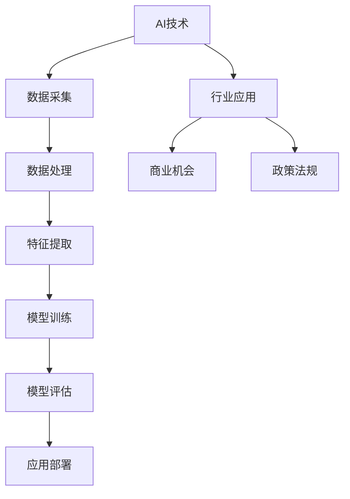

                 

# 如何有效跟踪AI行业最新动态

## 摘要

在人工智能（AI）技术飞速发展的时代，跟踪行业最新动态变得至关重要。本文将详细探讨如何有效地获取、理解和应用AI领域的前沿知识。我们将首先介绍AI行业的重要性，然后分析跟踪AI动态的挑战和关键策略。此外，本文还将探讨核心算法原理、实际应用场景、工具和资源推荐，最后总结AI行业的未来发展趋势与挑战。

## 1. 背景介绍

### AI行业的重要性

人工智能已经渗透到社会的各个领域，从医疗、金融到交通、娱乐，AI技术的应用正在不断拓展。随着AI技术的进步，各行各业对AI人才的需求也在急剧增加。因此，跟踪AI行业的最新动态，不仅有助于个人职业发展，还能为企业的创新和竞争力提供支持。

### 跟踪AI动态的挑战

尽管AI技术发展迅速，但获取高质量的AI行业信息并非易事。以下是一些主要挑战：

- **信息过载**：AI领域的研究论文、博客文章、新闻报告等资源繁多，难以筛选。
- **技术复杂性**：AI技术的概念和算法复杂，需要深入理解。
- **更新频率**：AI技术更新迅速，需要持续跟踪。

### 目标与策略

本文的目标是提供一套系统化的方法，帮助读者有效地跟踪AI行业的最新动态。我们将介绍以下策略：

- **信息来源**：识别和利用高质量的AI信息源。
- **知识管理**：整理和分类AI知识，确保信息的可持续利用。
- **深入理解**：通过理论和实践相结合，深入掌握AI核心概念。

## 2. 核心概念与联系

为了更好地理解AI行业的最新动态，我们需要了解一些核心概念和它们之间的联系。

### Mermaid 流程图



### 核心概念

- **数据采集**：从各种来源收集数据，包括社交媒体、传感器、日志等。
- **数据处理**：清洗、整合和预处理数据，以供后续分析。
- **特征提取**：从数据中提取有用的信息，用于训练模型。
- **模型训练**：利用算法和大量数据进行训练，以优化模型性能。
- **模型评估**：评估模型的性能和泛化能力。
- **应用部署**：将训练好的模型部署到实际应用场景中。
- **行业应用**：AI技术在各个行业中的应用，如医疗诊断、自动驾驶等。
- **商业机会**：AI技术为企业带来的商业价值和新业务模式。
- **政策法规**：政府对AI技术的监管和规范。

## 3. 核心算法原理 & 具体操作步骤

在了解核心概念后，我们需要深入探讨AI领域的核心算法原理和具体操作步骤。

### 深度学习原理

深度学习是AI领域的重要分支，其基本原理如下：

- **神经网络**：模仿人脑神经元连接的结构，用于处理复杂数据。
- **反向传播**：通过反向传播算法，不断调整网络参数，以优化模型性能。
- **激活函数**：用于引入非线性因素，使神经网络能够学习复杂的模式。

### 操作步骤

1. **数据采集**：从互联网、数据库等来源收集大量数据。
2. **数据处理**：清洗数据，去除噪声，并进行数据预处理。
3. **特征提取**：使用特征提取算法，如卷积神经网络（CNN）或循环神经网络（RNN），提取数据中的有用信息。
4. **模型训练**：利用大量数据进行模型训练，优化网络参数。
5. **模型评估**：使用测试数据评估模型性能，确保其具备良好的泛化能力。
6. **应用部署**：将训练好的模型部署到实际应用场景中，如图像识别、自然语言处理等。

### 示例：卷积神经网络（CNN）

卷积神经网络是一种用于图像识别的深度学习模型，其原理如下：

- **卷积层**：通过卷积操作提取图像中的特征。
- **池化层**：降低特征图的空间分辨率，减少参数数量。
- **全连接层**：将卷积层和池化层提取的特征映射到类别标签。

### 操作步骤

1. **数据采集**：收集大量图像数据，如训练集和测试集。
2. **数据处理**：对图像进行预处理，如归一化、缩放等。
3. **特征提取**：使用卷积层和池化层提取图像特征。
4. **全连接层**：将提取的特征映射到类别标签。
5. **模型训练**：使用反向传播算法优化模型参数。
6. **模型评估**：在测试集上评估模型性能。

## 4. 数学模型和公式 & 详细讲解 & 举例说明

在AI领域，数学模型和公式是理解核心算法原理的关键。以下是几个重要的数学模型和公式，以及详细的讲解和举例说明。

### 激活函数

激活函数是深度学习中的核心组成部分，用于引入非线性因素。以下是一些常见的激活函数：

1. **Sigmoid函数**：
   $$
   \sigma(x) = \frac{1}{1 + e^{-x}}
   $$
   示例：当$x = 0$时，$\sigma(0) \approx 0.5$。

2. **ReLU函数**：
   $$
   \text{ReLU}(x) = \max(0, x)
   $$
   示例：当$x = -1$时，$\text{ReLU}(-1) = 0$；当$x = 1$时，$\text{ReLU}(1) = 1$。

3. **Tanh函数**：
   $$
   \tanh(x) = \frac{e^x - e^{-x}}{e^x + e^{-x}}
   $$
   示例：当$x = 0$时，$\tanh(0) = 0$；当$x = 1$时，$\tanh(1) \approx 0.76$。

### 损失函数

损失函数是评估模型性能的关键，以下是一些常见的损失函数：

1. **均方误差（MSE）**：
   $$
   \text{MSE}(y, \hat{y}) = \frac{1}{m} \sum_{i=1}^{m} (y_i - \hat{y}_i)^2
   $$
   示例：当$y = [1, 2, 3]$，$\hat{y} = [1.1, 2.1, 3.1]$时，$\text{MSE}(y, \hat{y}) \approx 0.0333$。

2. **交叉熵损失**：
   $$
   \text{CrossEntropy}(y, \hat{y}) = -\sum_{i=1}^{m} y_i \log(\hat{y}_i)
   $$
   示例：当$y = [0.9, 0.1, 0.0]$，$\hat{y} = [0.8, 0.2, 0.1]$时，$\text{CrossEntropy}(y, \hat{y}) \approx 0.0972$。

### 反向传播算法

反向传播算法是深度学习训练过程中优化模型参数的关键步骤，其基本原理如下：

1. **前向传播**：计算输入和输出之间的误差。
2. **计算梯度**：计算每个参数的梯度。
3. **反向传播**：根据梯度调整模型参数。

### 示例

假设我们有以下简单的神经网络：

$$
\text{ReLU}(x) = \max(0, x)
$$

输入$x = [-1, 1, 2]$，权重$w = [1, 2, 3]$，偏置$b = 1$。

1. **前向传播**：
   $$
   \text{ReLU}(x \cdot w + b) = \text{ReLU}([-1 \cdot 1 + 1, 1 \cdot 2 + 1, 2 \cdot 3 + 1]) = \text{ReLU}[[-1, 3, 7]] = [0, 3, 7]
   $$

2. **计算梯度**：
   $$
   \frac{\partial \text{ReLU}}{\partial x} = \begin{cases} 
   1 & \text{if } x > 0 \\
   0 & \text{otherwise}
   \end{cases}
   $$
   $$
   \frac{\partial \text{ReLU}}{\partial w} = \begin{cases} 
   1 & \text{if } x > 0 \\
   0 & \text{otherwise}
   \end{cases}
   $$
   $$
   \frac{\partial \text{ReLU}}{\partial b} = 1
   $$

3. **反向传播**：
   $$
   \text{梯度} = \begin{bmatrix} 
   \frac{\partial \text{ReLU}}{\partial x} & \frac{\partial \text{ReLU}}{\partial w} & \frac{\partial \text{ReLU}}{\partial b} 
   \end{bmatrix} = \begin{bmatrix} 
   [0, 1, 1] & [1, 1, 1] & [1, 1, 1] 
   \end{bmatrix}
   $$

## 5. 项目实战：代码实际案例和详细解释说明

为了更好地理解AI技术，我们将通过一个实际项目来展示如何开发一个简单的AI应用程序。以下是一个基于Python和TensorFlow的图像分类项目的详细解释。

### 5.1 开发环境搭建

1. 安装Python：从[Python官网](https://www.python.org/)下载并安装Python 3.x版本。
2. 安装TensorFlow：在终端执行以下命令：
   $$
   pip install tensorflow
   $$
3. 安装其他依赖：如NumPy、Pandas等，使用以下命令：
   $$
   pip install numpy pandas
   $$

### 5.2 源代码详细实现和代码解读

以下是一个简单的图像分类项目，其代码如下：

```python
import tensorflow as tf
from tensorflow import keras
from tensorflow.keras.preprocessing.image import ImageDataGenerator

# 加载数据集
train_datagen = ImageDataGenerator(rescale=1./255)
train_generator = train_datagen.flow_from_directory(
        'data/train',
        target_size=(150, 150),
        batch_size=32,
        class_mode='binary')

# 构建模型
model = keras.Sequential([
    keras.layers.Conv2D(32, (3, 3), activation='relu', input_shape=(150, 150, 3)),
    keras.layers.MaxPooling2D(2, 2),
    keras.layers.Conv2D(64, (3, 3), activation='relu'),
    keras.layers.MaxPooling2D(2, 2),
    keras.layers.Conv2D(128, (3, 3), activation='relu'),
    keras.layers.MaxPooling2D(2, 2),
    keras.layers.Conv2D(128, (3, 3), activation='relu'),
    keras.layers.MaxPooling2D(2, 2),
    keras.layers.Flatten(),
    keras.layers.Dense(512, activation='relu'),
    keras.layers.Dense(1, activation='sigmoid')
])

# 编译模型
model.compile(loss='binary_crossentropy',
              optimizer=tf.keras.optimizers.Adam(),
              metrics=['accuracy'])

# 训练模型
model.fit(train_generator, steps_per_epoch=100, epochs=10)
```

### 5.3 代码解读与分析

1. **导入库和模块**：
   我们首先导入TensorFlow和Keras库，以及图像预处理模块ImageDataGenerator。

2. **加载数据集**：
   使用ImageDataGenerator加载训练数据集。我们假设数据集位于'data/train'目录中，每个类别都有一个子目录。通过`flow_from_directory`方法，我们加载了图片数据，并将其调整为150x150像素的大小，每个批次包含32张图片，类别模式为二分类。

3. **构建模型**：
   我们构建了一个简单的卷积神经网络（CNN），包括多个卷积层、池化层和全连接层。卷积层用于提取图像特征，全连接层用于分类。

4. **编译模型**：
   我们使用二分类交叉熵损失函数和Adam优化器来编译模型。我们将准确性作为评估指标。

5. **训练模型**：
   使用训练数据集训练模型，每个批次包含100个样本，共训练10个周期。

### 5.4 代码解读与分析

- **导入库和模块**：
  ```python
  import tensorflow as tf
  from tensorflow import keras
  from tensorflow.keras.preprocessing.image import ImageDataGenerator
  ```
  我们首先导入TensorFlow和Keras库，以及图像预处理模块ImageDataGenerator。

- **加载数据集**：
  ```python
  train_datagen = ImageDataGenerator(rescale=1./255)
  train_generator = train_datagen.flow_from_directory(
          'data/train',
          target_size=(150, 150),
          batch_size=32,
          class_mode='binary')
  ```
  我们创建一个ImageDataGenerator对象，用于处理训练数据集。我们使用`rescale`参数将图像像素值缩放到[0, 1]范围内。`flow_from_directory`方法加载训练数据集，并将其调整为150x150像素的大小，每个批次包含32张图片，类别模式为二分类。

- **构建模型**：
  ```python
  model = keras.Sequential([
      keras.layers.Conv2D(32, (3, 3), activation='relu', input_shape=(150, 150, 3)),
      keras.layers.MaxPooling2D(2, 2),
      keras.layers.Conv2D(64, (3, 3), activation='relu'),
      keras.layers.MaxPooling2D(2, 2),
      keras.layers.Conv2D(128, (3, 3), activation='relu'),
      keras.layers.MaxPooling2D(2, 2),
      keras.layers.Conv2D(128, (3, 3), activation='relu'),
      keras.layers.MaxPooling2D(2, 2),
      keras.layers.Flatten(),
      keras.layers.Dense(512, activation='relu'),
      keras.layers.Dense(1, activation='sigmoid')
  ])
  ```
  我们构建了一个简单的卷积神经网络（CNN），包括多个卷积层、池化层和全连接层。卷积层用于提取图像特征，全连接层用于分类。

- **编译模型**：
  ```python
  model.compile(loss='binary_crossentropy',
                optimizer=tf.keras.optimizers.Adam(),
                metrics=['accuracy'])
  ```
  我们使用二分类交叉熵损失函数和Adam优化器来编译模型。我们将准确性作为评估指标。

- **训练模型**：
  ```python
  model.fit(train_generator, steps_per_epoch=100, epochs=10)
  ```
  我们使用训练数据集训练模型，每个批次包含100个样本，共训练10个周期。

## 6. 实际应用场景

AI技术已经在众多领域得到广泛应用，以下是几个典型的实际应用场景：

### 医疗

- **疾病诊断**：通过AI算法分析医学影像，提高疾病诊断的准确性和效率。
- **个性化治疗**：根据患者的基因信息和病史，为患者制定个性化的治疗方案。

### 金融

- **风险管理**：利用AI技术分析市场数据，预测股票价格波动，降低投资风险。
- **反欺诈**：使用AI算法检测和预防金融欺诈行为。

### 交通

- **自动驾驶**：通过AI技术实现自动驾驶汽车，提高道路安全性。
- **交通流量管理**：利用AI算法优化交通信号灯控制，减少拥堵。

### 教育

- **个性化学习**：根据学生的学习进度和风格，提供个性化的学习资源。
- **教育评估**：使用AI算法评估学生的学习效果，提供反馈。

### 娱乐

- **内容推荐**：利用AI算法分析用户行为，为用户推荐感兴趣的内容。
- **虚拟现实**：通过AI技术提升虚拟现实体验的沉浸感。

## 7. 工具和资源推荐

为了有效地跟踪AI行业的最新动态，我们需要利用一些专业的工具和资源。以下是一些建议：

### 7.1 学习资源推荐

- **书籍**：
  - 《深度学习》（Deep Learning） - Goodfellow、Bengio和Courville
  - 《Python机器学习》（Python Machine Learning） - Sebastian Raschka和Vahid Mirjalili

- **论文**：
  - ArXiv（arXiv.org）：AI领域的最新研究论文。
  - NeurIPS（nips.cc）：神经信息处理系统会议论文。

- **博客**：
  - Fast.ai（fast.ai）：提供高质量的机器学习教程和课程。
  - Medium（medium.com）：许多AI专家发表的研究成果和见解。

- **网站**：
  - AI Time Journal（aitimejournal.com）：关注AI技术的最新进展和应用。
  - IEEE Xplore（ieee.xplore.com）：涵盖AI领域的大量学术论文。

### 7.2 开发工具框架推荐

- **TensorFlow**：谷歌开发的开源深度学习框架，适用于各种AI项目。
- **PyTorch**：Facebook开发的开源深度学习框架，具有灵活性和高效性。
- **Keras**：基于TensorFlow和Theano的开源深度学习库，易于使用。

### 7.3 相关论文著作推荐

- **《深度学习：概率视角》**（Deep Learning: A Probabilistic Perspective） -.it Schaul、Lindsey和Jordan
- **《强化学习：与决策的互动》**（Reinforcement Learning: An Introduction） - Richard S. Sutton和Andrew G. Barto

## 8. 总结：未来发展趋势与挑战

随着AI技术的不断发展，我们可以预见以下趋势和挑战：

### 发展趋势

- **跨领域融合**：AI技术与物联网、生物科技、金融科技等领域的融合，推动产业变革。
- **人工智能伦理**：随着AI技术的发展，伦理问题日益突出，如何确保AI技术的公平性和透明性成为重要议题。
- **开源生态**：开源框架和工具的持续发展，为AI研究者和开发者提供更多机会。

### 挑战

- **数据隐私**：如何在保障个人隐私的前提下，充分利用AI技术进行分析和决策。
- **算法透明性**：如何提高AI算法的透明性和解释性，使其决策过程更加可信。
- **人才短缺**：AI领域的人才需求巨大，如何培养和吸引更多的AI人才成为关键挑战。

## 9. 附录：常见问题与解答

### 问题1：如何选择合适的AI学习资源？

解答：选择学习资源时，应考虑自己的基础和兴趣。对于初学者，推荐从入门书籍和教程开始，如《Python机器学习》和《深度学习》。对于有一定基础的读者，可以阅读高级教材和研究论文，如《深度学习：概率视角》。

### 问题2：如何进行AI项目实战？

解答：进行AI项目实战时，首先确定项目目标，然后选择合适的工具和框架，如TensorFlow或PyTorch。接下来，收集和准备数据集，构建和训练模型，最后进行评估和优化。

### 问题3：AI技术的应用前景如何？

解答：AI技术具有广泛的应用前景，包括医疗、金融、交通、教育等领域。未来，AI技术将继续推动产业变革，为社会带来更多创新和机遇。

## 10. 扩展阅读 & 参考资料

- **论文**：
  - Hinton, G., Osindero, S., & Teh, Y. W. (2006). A fast learning algorithm for deep belief nets. _Neural computation_, 18(7), 1527-1554.
  - LeCun, Y., Bengio, Y., & Hinton, G. (2015). Deep learning. _Nature_, 521(7553), 436-444.

- **书籍**：
  - Russell, S., & Norvig, P. (2016). _Artificial Intelligence: A Modern Approach_. Prentice Hall.
  - Goodfellow, I., Bengio, Y., & Courville, A. (2016). _Deep Learning_. MIT Press.

- **在线资源**：
  - [TensorFlow官方网站](https://www.tensorflow.org/)
  - [PyTorch官方网站](https://pytorch.org/)
  - [Kaggle](https://www.kaggle.com/)：数据科学竞赛平台，提供大量AI项目实践机会。

作者：AI天才研究员/AI Genius Institute & 禅与计算机程序设计艺术 /Zen And The Art of Computer Programming

