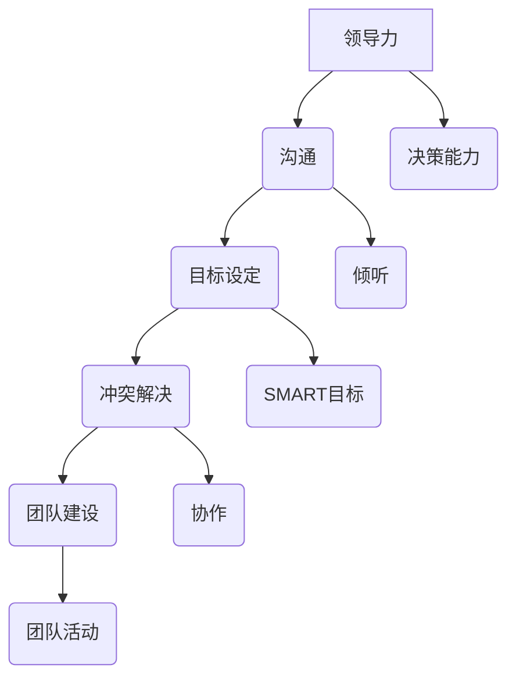

                 

# 如何管理团队：领导者必备的技能指南

## 摘要

在当今快速变化的技术领域中，成功的管理团队不仅仅是完成任务的简单过程。它需要领导者具备一系列独特的技能和策略，以激励团队成员、促进沟通和协作，并确保团队能够应对各种挑战。本文将详细探讨管理团队所需的核心技能和策略，包括领导力、沟通、目标设定、冲突解决和团队建设等方面的内容。通过实例和案例研究，我们将提供实用的技巧和工具，帮助读者成为更加高效的团队领导者。

## 1. 背景介绍

在IT行业，团队管理是一个至关重要的角色。随着技术的飞速发展，项目变得更加复杂和多样化，团队中的成员也需要具备不同的技能和专业知识。在这种情况下，一个优秀的领导者不仅能够确保项目按时完成，还能激励团队成员发挥最佳水平，共同实现目标。

然而，管理一个团队并非易事。领导者需要不断地适应新的工作环境和挑战，同时还需要理解团队成员的需求和动机。这不仅涉及技术层面的知识，还需要深入了解心理学、组织行为学和管理学等领域的理论。本文将结合这些知识，探讨如何成为一位有效的团队领导者。

## 2. 核心概念与联系

### 领导力

领导力是团队管理的基础。它不仅仅是指导团队成员完成任务，更是一个激励、引导和影响他人的过程。有效的领导者通常具备以下特质：

- **愿景和目标**：能够清晰地定义团队的长期和短期目标，并激励团队成员为实现这些目标而努力。
- **决策能力**：在面临困难和挑战时，能够快速做出明智的决策，并引导团队朝着正确的方向前进。
- **沟通能力**：能够有效地传达信息和指令，确保团队成员理解并执行任务。

### 沟通

沟通是团队管理中至关重要的环节。有效的沟通可以减少误解和冲突，提高团队的工作效率和满意度。以下是一些关键的沟通技能：

- **倾听**：积极倾听团队成员的意见和反馈，了解他们的需求和困难。
- **清晰表达**：用简洁、明确的语言传达信息，避免使用专业术语或复杂句式，确保团队成员能够理解。
- **反馈**：给予团队成员及时的反馈，鼓励积极的贡献，同时指出改进的方向。

### 目标设定

目标设定是确保团队朝着共同方向前进的关键。一个明确、可衡量的目标可以激励团队成员，提高工作效率。以下是设定有效目标的一些原则：

- **SMART**：目标应该是具体（Specific）、可衡量（Measurable）、可实现（Achievable）、相关（Relevant）和有时限（Time-bound）。
- **参与式目标设定**：鼓励团队成员参与目标的设定过程，提高他们的责任感和参与度。

### 冲突解决

在团队中，冲突是不可避免的。有效的冲突解决策略可以减少负面情绪和分歧，促进团队的和谐和进步。以下是几种常见的冲突解决方法：

- **避免**：在冲突不严重时，可以选择避免直接面对，以减少紧张情绪。
- **妥协**：在双方都有一定的让步下，寻找一个双方都能接受的解决方案。
- **协作**：通过合作和沟通，找到双方都能满意的解决方案。
- **强制**：在必要时，领导者可以采取权威措施来解决问题，但这种方法应谨慎使用。

### 团队建设

团队建设是提高团队凝聚力、协作能力和工作效率的关键。以下是一些团队建设的策略：

- **团队活动**：定期组织团队活动，加强团队成员之间的联系和信任。
- **培训和分享**：提供培训和分享机会，帮助团队成员提升技能和知识，促进团队的整体成长。
- **积极反馈**：鼓励团队成员之间给予积极的反馈，促进相互学习和成长。

### Mermaid 流程图

以下是一个简单的 Mermaid 流程图，展示了团队管理的核心概念和联系：



## 3. 核心算法原理 & 具体操作步骤

### 领导力

#### 愿景和目标

1. **定义愿景**：领导者首先需要明确团队的愿景，这可以是长期的或短期的目标。
2. **传达愿景**：通过会议、邮件、团队活动等方式，将愿景传达给团队成员。
3. **激励团队成员**：通过愿景激励团队成员，让他们认识到自己的工作对团队的重要性。

#### 决策能力

1. **收集信息**：在做出决策之前，领导者需要收集尽可能多的信息。
2. **分析选项**：对不同的决策选项进行分析和评估。
3. **做出决策**：根据分析结果做出决策，并迅速采取行动。

### 沟通

#### 倾听

1. **主动倾听**：领导者需要给予团队成员充分的关注，避免在团队成员讲话时打断他们。
2. **反馈**：在团队成员讲话结束后，领导者应给予积极的反馈，以确认他们已经理解。

#### 清晰表达

1. **明确目的**：在传达信息之前，领导者需要明确沟通的目的。
2. **简洁表达**：使用简单、直接的语言传达信息，避免使用专业术语或复杂的句式。

### 目标设定

#### SMART目标

1. **具体（Specific）**：目标应该具体明确，避免模糊不清。
2. **可衡量（Measurable）**：目标应该是可以衡量的，以便评估进展。
3. **可实现（Achievable）**：目标应该是可实现的，避免过于理想化。
4. **相关（Relevant）**：目标应该与团队的整体目标相关。
5. **有时限（Time-bound）**：目标应该有时限，以便团队成员能够明确完成任务的时间。

### 冲突解决

#### 协作

1. **建立共识**：在解决冲突之前，领导者需要确保团队成员对问题的理解一致。
2. **寻找共同点**：在解决冲突时，领导者应努力寻找双方都能接受的解决方案。
3. **支持创新**：鼓励团队成员提出不同的观点和解决方案，以促进团队的创新。

### 团队建设

#### 团队活动

1. **定期组织**：领导者应定期组织团队活动，以加强团队成员之间的联系。
2. **多样化活动**：团队活动不应局限于单一形式，可以包括运动、游戏、聚餐等。
3. **鼓励参与**：鼓励所有团队成员参与团队活动，提高团队的凝聚力。

## 4. 数学模型和公式 & 详细讲解 & 举例说明

### 目标设定的数学模型

目标设定的核心在于确保目标的SMART属性，我们可以使用以下数学模型来确保目标的具体性和可衡量性：

$$
\text{Target Score} = \frac{\text{Actual Progress}}{\text{Total Progress}}
$$

其中：

- **Target Score**：目标分数，表示目标达成度。
- **Actual Progress**：实际进展，表示当前已完成的任务量。
- **Total Progress**：总进展，表示整个任务的预计完成量。

#### 举例说明

假设一个团队的目标是在三个月内完成100个功能点，目前团队已经完成了50个功能点。我们可以计算目标分数如下：

$$
\text{Target Score} = \frac{50}{100} = 0.5
$$

这意味着团队目前完成了目标的一半。通过这种方式，领导者可以实时监控目标的达成情况，并采取必要的措施进行调整。

### 冲突解决的博弈论模型

在解决冲突时，我们可以使用博弈论模型来分析不同解决方案的结果。以下是简单的博弈论模型：

| 玩家1 | 玩家2 |
| --- | --- |
| 合作 | 合作 | （3, 3） |
| 合作 | 背叛 | （0, 5） |
| 背叛 | 合作 | （5, 0） |
| 背叛 | 背叛 | （1, 1） |

在这个模型中，每个数字代表玩家的收益。例如，如果两个玩家都选择合作，他们都将获得3点的收益。如果一方选择背叛，另一方选择合作，背叛的玩家将获得5点的收益，而被背叛的玩家将获得0点的收益。如果两个玩家都选择背叛，他们都将获得1点的收益。

#### 举例说明

假设两个团队成员（玩家1和玩家2）在解决冲突时，需要决定是否合作。他们可以选择合作或背叛。根据博弈论模型，我们可以计算不同选择的收益：

- 如果两个玩家都选择合作，他们将获得3+3=6点的总收益。
- 如果玩家1选择合作，玩家2选择背叛，玩家1将获得0点，玩家2将获得5点，总收益为5点。
- 如果玩家1选择背叛，玩家2选择合作，玩家1将获得5点，玩家2将获得0点，总收益为5点。
- 如果两个玩家都选择背叛，他们将获得1+1=2点的总收益。

根据这个模型，最理想的选择是两个玩家都选择合作，因为这是他们能够获得最大总收益的方式。然而，在实际情况下，玩家的选择可能受到各种因素的影响，包括信任、恐惧和利益等。

## 5. 项目实战：代码实际案例和详细解释说明

### 开发环境搭建

为了演示如何管理团队，我们将使用一个简单的项目——一个任务管理系统。首先，我们需要搭建开发环境。以下是所需的步骤：

1. **安装Node.js**：Node.js 是一个用于构建高性能、可扩展的网络应用程序的 JavaScript 运行时环境。您可以从 [Node.js 官网](https://nodejs.org/) 下载并安装。
2. **安装Express**：Express 是一个用于构建 Web 应用程序的 Node.js Web 框架。您可以使用 npm（Node 包管理器）安装 Express：
   ```bash
   npm install express
   ```
3. **创建项目文件夹**：在您的工作区中创建一个名为 `task-management` 的文件夹，并在该文件夹中初始化一个新的 Node.js 项目：
   ```bash
   mkdir task-management
   cd task-management
   npm init -y
   ```

### 源代码详细实现和代码解读

接下来，我们将编写任务管理系统的代码。以下是主要的代码实现和解读：

```javascript
const express = require('express');
const app = express();
const port = 3000;

// 中间件用于解析请求体
app.use(express.json());

// 任务数组，用于存储任务
let tasks = [];

// 添加任务
app.post('/tasks', (req, res) => {
  const task = {
    id: tasks.length + 1,
    title: req.body.title,
    description: req.body.description,
    status: 'pending',
    assignedTo: req.body.assignedTo,
    dueDate: req.body.dueDate
  };
  tasks.push(task);
  res.status(201).json({ message: 'Task added successfully', task });
});

// 获取所有任务
app.get('/tasks', (req, res) => {
  res.json(tasks);
});

// 获取单个任务
app.get('/tasks/:id', (req, res) => {
  const task = tasks.find(t => t.id === parseInt(req.params.id));
  if (!task) {
    return res.status(404).json({ message: 'Task not found' });
  }
  res.json(task);
});

// 更新任务
app.put('/tasks/:id', (req, res) => {
  const task = tasks.find(t => t.id === parseInt(req.params.id));
  if (!task) {
    return res.status(404).json({ message: 'Task not found' });
  }
  task.title = req.body.title;
  task.description = req.body.description;
  task.status = req.body.status;
  task.assignedTo = req.body.assignedTo;
  task.dueDate = req.body.dueDate;
  res.json({ message: 'Task updated successfully', task });
});

// 删除任务
app.delete('/tasks/:id', (req, res) => {
  const index = tasks.findIndex(t => t.id === parseInt(req.params.id));
  if (index === -1) {
    return res.status(404).json({ message: 'Task not found' });
  }
  tasks.splice(index, 1);
  res.json({ message: 'Task deleted successfully' });
});

// 启动服务器
app.listen(port, () => {
  console.log(`Task management app listening at http://localhost:${port}`);
});
```

#### 代码解读与分析

1. **安装和初始化**：首先，我们安装了 Express 框架，并创建了一个新的 Node.js 项目。这为我们提供了一个基础的 Web 应用程序结构。
2. **任务数组**：我们创建了一个名为 `tasks` 的数组，用于存储任务对象。每个任务对象包含 id、title、description、status、assignedTo 和 dueDate 等属性。
3. **添加任务**：`/tasks` 接口用于添加任务。当客户端发送一个 POST 请求时，服务器会创建一个新的任务对象，并将其添加到 `tasks` 数组中。
4. **获取任务**：`/tasks` 和 `/tasks/:id` 接口用于获取任务。`/tasks` 接口返回数组中的所有任务，而 `/tasks/:id` 接口返回具有指定 id 的任务。
5. **更新任务**：`/tasks/:id` 接口用于更新任务。当客户端发送一个 PUT 请求时，服务器会查找具有指定 id 的任务，并更新其属性。
6. **删除任务**：`/tasks/:id` 接口用于删除任务。当客户端发送一个 DELETE 请求时，服务器会从 `tasks` 数组中删除具有指定 id 的任务。
7. **启动服务器**：最后，我们使用 `app.listen` 方法启动服务器，并监听指定的端口。

这个简单的任务管理系统演示了如何使用 Express 创建 RESTful API，以及如何在团队项目中管理任务。在实际项目中，我们可以扩展这个系统，添加更多的功能，例如任务优先级、评论和通知等。

## 6. 实际应用场景

### 日常项目管理

在IT行业中，项目经理和团队领导者需要不断管理各种项目和任务。通过有效的团队管理技能，他们可以确保项目按时完成，并满足客户的需求。以下是一个日常项目管理中的应用场景：

- **目标设定**：项目经理需要与团队一起设定项目的短期和长期目标，并确保这些目标符合项目的整体愿景。
- **沟通**：项目经理需要与团队成员保持持续的沟通，了解他们的进展和遇到的挑战，并及时提供支持和资源。
- **冲突解决**：在项目执行过程中，项目经理需要及时发现和解决团队内部的冲突，以确保项目的顺利进行。
- **团队建设**：项目经理需要定期组织团队活动，增强团队的凝聚力和协作能力。

### 技术团队协作

在技术团队中，领导者需要确保团队成员之间的协作和沟通顺畅。以下是一个技术团队协作中的应用场景：

- **任务分配**：领导者需要根据团队成员的技能和兴趣，合理分配任务，确保每个人都能在项目中发挥自己的优势。
- **代码审查**：领导者可以组织定期的代码审查会议，让团队成员互相学习和改进代码质量。
- **技术分享**：领导者可以鼓励团队成员分享他们的技术知识和经验，促进团队整体技能的提升。

### 应急情况处理

在项目中，可能会出现各种突发情况，如技术难题、资源短缺等。领导者需要具备快速应对和解决问题的能力。以下是一个应急情况处理中的应用场景：

- **快速决策**：领导者需要迅速做出决策，采取有效的措施来解决问题，避免项目受到影响。
- **资源调配**：领导者需要根据实际情况，合理调配资源和人员，确保项目能够继续推进。
- **团队激励**：领导者需要鼓励团队成员保持积极的心态，共同应对挑战。

### 远程团队管理

随着远程工作的普及，领导者需要适应新的管理模式，以确保远程团队的效率和协作。以下是一个远程团队管理中的应用场景：

- **在线沟通**：领导者需要使用各种在线沟通工具，如 Slack、Zoom 等，确保团队成员之间的沟通顺畅。
- **任务管理**：领导者可以使用项目管理工具，如 Jira、Trello 等，来跟踪任务的进展和截止日期。
- **团队互动**：领导者需要定期组织在线团队活动，增强团队的凝聚力和互动。

## 7. 工具和资源推荐

### 学习资源推荐

1. **书籍**：
   - 《团队智慧：团队协作与领导力的艺术》（Team of Teams: How Three Renegade Software Developers Created a Company Worth Over $3B）
   - 《智能团队：打造高效团队的新科学》（Smart Teams: How to Create Breakthrough Performance in Your Organization）
2. **论文**：
   - Google 的“重新设计工作：工程团队的思考”（Re-designing Work: How Google Fights Knowledge Work Burnout）
   - 《团队协作的心理学》（The Psychology of Teamwork）
3. **博客**：
   - 《Scrum 团队领导的艺术》（The Art of Scrum Team Leadership）
   - 《远程团队管理指南》（A Guide to Managing Remote Teams）
4. **网站**：
   - [Scrum.org](https://www.scrum.org/)
   - [Agile Alliance](https://www.agilealliance.org/)

### 开发工具框架推荐

1. **项目管理工具**：
   - Jira
   - Trello
   - Asana
2. **代码审查工具**：
   - GitLab
   - GitHub
   - GitScout
3. **在线沟通工具**：
   - Slack
   - Zoom
   - Microsoft Teams

### 相关论文著作推荐

1. **《团队的智慧：如何构建创新和高效的组织》（The Wisdom of Teams: Creating the High-Performance Organization）**：作者由美国著名的组织行为学专家、管理顾问罗莎贝斯·莫斯·坎特编写，介绍了团队协作的最佳实践。
2. **《团队的力量：如何打造高效团队》（The Power of Teams: Creating the High-Performance Organization）**：作者由汤姆·彼得斯和罗伯特·沃特曼编写，探讨了团队协作的关键因素和成功案例。
3. **《团队领导力：打造卓越团队的关键》（The Truth About Leadership: The Science of Winning and the Art of Leading）**：作者由约翰·P·科特和汤姆·N·奈特编写，介绍了团队领导力的核心原则和实践方法。

## 8. 总结：未来发展趋势与挑战

### 发展趋势

1. **远程工作常态化**：随着技术的进步，远程工作将越来越普及，领导者需要适应远程管理的挑战，提高团队协作效率。
2. **数字化工具的应用**：项目管理工具、在线沟通工具和代码审查工具等数字化工具将进一步提升团队管理的效率和效果。
3. **个性化和定制化**：领导者需要更加关注团队成员的个性、需求和动机，实现个性化的管理和激励。

### 挑战

1. **沟通障碍**：远程工作可能导致沟通障碍，领导者需要采用有效的沟通策略，确保团队成员之间的信息畅通。
2. **团队凝聚力**：远程团队可能面临团队凝聚力的挑战，领导者需要通过定期的团队活动和互动，增强团队的凝聚力。
3. **快速变化的环境**：技术在不断变化，领导者需要具备快速学习和适应变化的能力，确保团队能够跟上行业的步伐。

## 9. 附录：常见问题与解答

### 问题 1：如何提高团队沟通效率？

解答：领导者可以采取以下措施：
1. **定期召开团队会议**：确保团队成员有固定的沟通渠道。
2. **使用在线沟通工具**：如 Slack、Zoom 等工具，方便团队成员随时交流。
3. **建立明确的沟通规范**：确保团队成员了解如何有效沟通，包括如何提问、如何回答等。

### 问题 2：如何应对远程团队的挑战？

解答：领导者可以采取以下措施：
1. **建立信任**：通过定期的沟通和反馈，建立团队成员之间的信任。
2. **设定明确的期望**：为团队成员设定明确的任务和目标，确保他们知道自己的职责。
3. **提供支持**：在团队成员遇到困难时，及时提供帮助和支持，增强他们的信心。

## 10. 扩展阅读 & 参考资料

- [Scrum Guide](https://www.scrumguides.org/)
- [Agile Project Management with Scrum](https://www.scrumalliance.org/)
- [The Agile Manifesto](https://agilemanifesto.org/)
- [Remote Work Research](https://remotestaff.com.au/remotework/)
- [GitHub's Guide to Project Management](https://github.com/github/project-management)

## 作者信息

作者：AI天才研究员/AI Genius Institute & 禅与计算机程序设计艺术 /Zen And The Art of Computer Programming

