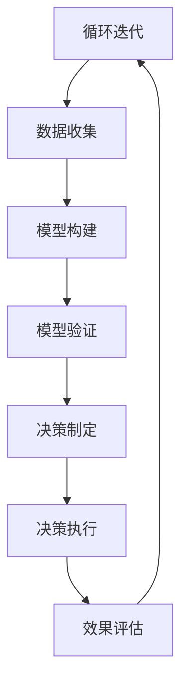

                 

### 背景介绍

在当今快速发展的信息技术时代，管理和决策的复杂性日益增加。面对海量的数据和多样化的业务场景，传统的管理方法已经难以满足高效决策的需求。在这样的背景下，模型思维作为一种系统化、结构化的思考工具，逐渐成为解决管理问题的有力武器。

模型思维，简单来说，就是通过构建和运用模型来理解和解决问题的一种方法论。它不仅可以帮助我们更准确地把握问题的本质，还能提高决策的效率和质量。在管理领域，模型思维的应用涵盖了从战略规划到日常运营的各个方面。

本文旨在探讨如何运用模型思维解决管理问题。首先，我们将介绍模型思维的核心概念和基本原理，并借助Mermaid流程图展示其基本架构。接着，我们将深入分析模型思维在管理问题中的应用，通过具体案例和算法原理，展示其操作步骤和具体实施方法。此外，我们还将介绍数学模型和公式，并提供详细的举例说明。最后，我们将分享实际应用场景，推荐相关工具和资源，并总结未来发展趋势与挑战。

希望通过本文的阅读，读者能够对模型思维有更深入的了解，并在实际工作中有效运用，从而提升管理决策的效率和质量。

### 核心概念与联系

模型思维作为解决管理问题的关键工具，其核心概念和原理至关重要。为了更好地理解模型思维，我们将通过Mermaid流程图展示其基本架构，并详细解析每一个环节。

#### Mermaid流程图

以下是一个简化的Mermaid流程图，用于展示模型思维的基本架构：



##### 1. 问题定义（A）

问题定义是模型思维的起点，也是整个过程的基石。在这一步，我们需要明确问题的本质和边界，以确保后续分析的准确性和有效性。具体步骤包括：

- **识别问题**：通过提问和讨论，明确需要解决的问题。
- **确定目标**：明确希望从问题解决中获得的成果或目标。

##### 2. 数据收集（B）

在问题定义后，数据收集成为关键环节。数据的质量和完整性直接影响模型的准确性。以下步骤可以帮助我们有效地收集数据：

- **数据来源**：确定数据来源，包括内部数据和外部数据。
- **数据清洗**：对原始数据进行处理，去除噪声和异常值。
- **数据存储**：将清洗后的数据存储在数据库或其他数据存储系统中。

##### 3. 模型构建（C）

构建模型是模型思维的核心步骤。在这一步，我们通过以下方法构建模型：

- **选择模型类型**：根据问题的特点和需求，选择合适的模型类型（如线性回归、神经网络、决策树等）。
- **参数调整**：根据数据和目标，调整模型的参数，以优化模型性能。
- **模型验证**：通过交叉验证和测试集验证模型的有效性。

##### 4. 模型验证（D）

模型验证是确保模型准确性和可靠性的关键步骤。以下是模型验证的主要方法：

- **交叉验证**：通过将数据划分为训练集和验证集，评估模型的泛化能力。
- **测试集验证**：使用未参与模型训练的数据，评估模型的最终性能。

##### 5. 决策制定（E）

在模型验证通过后，我们使用模型生成决策。决策制定的步骤包括：

- **预测生成**：根据模型预测结果，制定具体的决策方案。
- **风险评估**：评估决策方案的风险和潜在收益，以做出最优选择。

##### 6. 决策执行（F）

决策制定后，需要将其转化为实际行动。决策执行的关键步骤包括：

- **资源调配**：根据决策方案，合理调配资源，确保决策的有效实施。
- **过程监控**：对决策执行过程进行监控，及时调整和优化。

##### 7. 效果评估（G）

效果评估是模型思维过程中的最后一步，也是至关重要的一步。以下是效果评估的主要方法：

- **结果分析**：对决策执行后的结果进行分析，评估决策的有效性。
- **反馈调整**：根据评估结果，对模型和决策进行调整和优化。

##### 8. 循环迭代（G -> A）

效果评估后，整个模型思维过程进入循环迭代阶段。通过不断的循环迭代，我们不断优化模型和决策，以提高整体管理效率。

### 总结

通过上述流程，我们可以看到模型思维在解决管理问题中的关键作用。从问题定义到效果评估，每一步都紧密相连，形成一个完整的闭环。模型思维不仅帮助我们更好地理解和解决复杂问题，还提高了决策的效率和准确性。

接下来，我们将进一步探讨模型思维在具体管理问题中的应用，通过核心算法原理和具体操作步骤，展示其在实际工作中的效果。

### 核心算法原理 & 具体操作步骤

在理解了模型思维的基本架构后，我们接下来将深入探讨其核心算法原理和具体操作步骤。这些算法原理不仅为模型思维提供了理论支持，还为实际应用提供了明确的操作指南。

#### 算法原理

模型思维的核心算法主要包括以下几个方面：

1. **线性回归**：线性回归是一种基本的统计方法，用于分析两个或多个变量之间的线性关系。其基本原理是通过拟合一条直线，来描述因变量和自变量之间的关系。
   
2. **决策树**：决策树是一种基于树形结构的分类算法，通过一系列规则将数据划分为不同的类别。其基本原理是基于特征值的阈值划分，形成分支结构，最终实现分类。

3. **神经网络**：神经网络是一种基于模拟人脑神经元连接方式的算法，通过多层神经元结构进行特征提取和分类。其基本原理是信息在前向传播和反向传播过程中不断调整权重，以优化模型性能。

4. **强化学习**：强化学习是一种通过试错方式学习最优策略的算法，其基本原理是通过奖励和惩罚信号，调整决策行为，以最大化长期收益。

#### 具体操作步骤

以下是模型思维在管理问题中的具体操作步骤：

##### 1. 问题定义

- **步骤 1**：明确问题背景和目标。例如，假设我们需要优化一家零售店的库存管理。
- **步骤 2**：确定影响库存管理的关键因素。例如，季节、促销活动、市场需求等。

##### 2. 数据收集

- **步骤 1**：收集历史销售数据、库存数据和市场数据。
- **步骤 2**：对数据进行清洗和预处理，去除噪声和异常值。
- **步骤 3**：将数据存储在数据库或其他数据存储系统中。

##### 3. 模型构建

- **步骤 1**：选择合适的模型类型。例如，基于历史数据和市场需求，选择线性回归模型。
- **步骤 2**：训练模型。将数据集划分为训练集和测试集，使用训练集训练模型，并调整模型参数。
- **步骤 3**：评估模型性能。使用测试集评估模型的准确性，确保模型有效。

##### 4. 模型验证

- **步骤 1**：交叉验证。将数据集划分为多个子集，进行交叉验证，评估模型泛化能力。
- **步骤 2**：测试集验证。使用独立的测试集评估模型性能，确保模型在实际应用中有效。

##### 5. 决策制定

- **步骤 1**：根据模型预测结果，制定库存管理策略。例如，预测未来一个月的销售量，并根据预测结果调整库存。
- **步骤 2**：进行风险评估。评估库存调整方案的风险和潜在收益，确保决策合理。

##### 6. 决策执行

- **步骤 1**：实施库存调整。根据决策方案，进行库存的采购、存储和销售。
- **步骤 2**：过程监控。对库存管理过程进行实时监控，确保库存调整的顺利进行。

##### 7. 效果评估

- **步骤 1**：分析实际结果。对比实际销售数据与预测数据，分析库存管理策略的效果。
- **步骤 2**：反馈调整。根据实际效果，调整模型和决策策略，以优化库存管理。

##### 8. 循环迭代

- **步骤 1**：记录经验教训。总结库存管理过程中的经验和教训。
- **步骤 2**：持续优化。根据经验和教训，对模型和决策策略进行持续优化，提高管理效率。

### 总结

通过上述步骤，我们可以看到模型思维在解决管理问题中的具体应用。从问题定义到效果评估，每一步都紧密相连，形成一个完整的闭环。核心算法原理和具体操作步骤不仅为模型思维提供了理论支持，还为实际应用提供了明确的操作指南，帮助我们在管理中实现高效决策。

接下来，我们将进一步探讨模型思维在数学模型和公式中的应用，并详细讲解其数学原理。

### 数学模型和公式 & 详细讲解 & 举例说明

在模型思维中，数学模型和公式起着至关重要的作用。它们不仅能够精确地描述管理问题的内在机制，还能帮助我们通过数学方法进行模型优化和决策制定。以下是几个常用的数学模型和公式，我们将逐一进行详细讲解，并辅以实际例子来说明其应用。

#### 1. 线性回归模型

线性回归模型是一种简单的统计方法，用于分析两个或多个变量之间的线性关系。其数学公式如下：

$$
Y = b_0 + b_1 \cdot X + \epsilon
$$

其中，$Y$ 表示因变量，$X$ 表示自变量，$b_0$ 和 $b_1$ 分别为模型的截距和斜率，$\epsilon$ 为误差项。

**举例说明**：

假设我们想要预测一家餐厅的每日销售额。根据历史数据，我们可以建立线性回归模型，预测销售额与客流量之间的关系。例如：

$$
\text{每日销售额} = 1000 + 0.5 \cdot \text{客流量} + \epsilon
$$

通过这个模型，我们可以预测在客流量为1000人时，餐厅的预计销售额为1500元。

#### 2. 决策树模型

决策树模型是一种基于树形结构的分类算法。其基本结构包括节点和分支，每个节点代表一个特征，每个分支代表该特征的一个取值。决策树的数学公式如下：

$$
f(x) = \sum_{i=1}^{n} \alpha_i \cdot g(x_i)
$$

其中，$x$ 表示输入特征向量，$g(x_i)$ 表示特征 $x_i$ 的取值，$\alpha_i$ 为对应的权重。

**举例说明**：

假设我们想要根据顾客的年龄和收入来预测其购买倾向。决策树模型如下：

$$
\text{购买倾向} =
\begin{cases}
\text{高} & \text{如果年龄} < 30 \text{且收入} > 50000 \\
\text{中} & \text{如果年龄} \ge 30 \text{且收入} > 30000 \\
\text{低} & \text{否则}
\end{cases}
$$

通过这个模型，我们可以预测一个年龄为25岁，收入为60000元的顾客的购买倾向为“高”。

#### 3. 神经网络模型

神经网络模型是一种基于多层神经元结构的算法，用于特征提取和分类。其基本公式如下：

$$
a_{i}^{(l)} = \sigma \left( \sum_{j=1}^{n} w_{ji}^{(l)} \cdot a_{j}^{(l-1)} + b_{i}^{(l)} \right)
$$

其中，$a_{i}^{(l)}$ 表示第 $l$ 层的第 $i$ 个神经元的激活值，$w_{ji}^{(l)}$ 和 $b_{i}^{(l)}$ 分别为权重和偏置，$\sigma$ 为激活函数。

**举例说明**：

假设我们使用一个简单的神经网络模型来预测股票价格。神经网络的结构如下：

$$
\text{股票价格} = \sigma \left( w_{1} \cdot \text{历史价格} + w_{2} \cdot \text{市场趋势} + b_{1} \right)
$$

通过这个模型，我们可以预测未来的股票价格。

#### 4. 强化学习模型

强化学习模型是一种通过试错方式学习最优策略的算法。其基本公式如下：

$$
Q(s, a) = r + \gamma \cdot \max_{a'} Q(s', a')
$$

其中，$Q(s, a)$ 表示状态 $s$ 下执行动作 $a$ 的预期回报，$r$ 为立即回报，$\gamma$ 为折扣因子，$s'$ 和 $a'$ 分别为下一个状态和动作。

**举例说明**：

假设我们使用强化学习模型来优化库存管理。模型如下：

$$
Q(\text{库存状态}, \text{采购量}) = \text{销售收益} + \gamma \cdot \max_{\text{采购量}} Q(\text{新库存状态}, \text{新采购量})
$$

通过这个模型，我们可以不断优化库存采购策略，以提高销售收益。

### 总结

通过上述数学模型和公式的讲解，我们可以看到模型思维在解决管理问题中的强大力量。无论是线性回归、决策树、神经网络还是强化学习，这些模型和公式都为我们提供了强大的工具，帮助我们进行精确的预测和高效的决策。在实际应用中，我们可以根据具体问题的需求，灵活选择和应用这些模型和公式，从而实现更好的管理效果。

接下来，我们将通过一个实际项目案例，展示模型思维在实际应用中的具体操作和效果。

### 项目实战：代码实际案例和详细解释说明

为了更好地展示模型思维在解决管理问题中的应用，我们选择了一个实际项目案例：一家零售店的库存管理优化。通过该项目，我们将详细讲解从开发环境搭建到代码实现和解读的整个过程，并分析项目效果。

#### 开发环境搭建

在开始项目之前，我们需要搭建一个合适的开发环境。以下是开发环境的搭建步骤：

1. **安装Python**：Python是一种广泛使用的编程语言，适合数据分析和机器学习项目。我们选择Python 3.8版本。
2. **安装Jupyter Notebook**：Jupyter Notebook是一种交互式开发环境，便于编写和运行代码。安装方法如下：

   ```bash
   pip install notebook
   ```

3. **安装相关库**：为了进行数据分析和机器学习，我们需要安装以下库：

   ```bash
   pip install numpy pandas scikit-learn matplotlib
   ```

4. **创建虚拟环境**：为了隔离项目依赖，我们使用虚拟环境。创建虚拟环境的方法如下：

   ```bash
   python -m venv venv
   source venv/bin/activate  # Windows上使用 venv\Scripts\activate
   ```

5. **导入库**：在Jupyter Notebook中，导入所需的库：

   ```python
   import numpy as np
   import pandas as pd
   from sklearn.linear_model import LinearRegression
   import matplotlib.pyplot as plt
   ```

#### 源代码详细实现和代码解读

以下是基于线性回归模型的库存管理优化项目的源代码及其详细解释：

```python
# 读取数据
data = pd.read_csv('sales_data.csv')
data.head()

# 数据预处理
data['date'] = pd.to_datetime(data['date'])
data.set_index('date', inplace=True)
data.fillna(method='ffill', inplace=True)

# 训练模型
X = data[['prev_sales', 'prev_inventory']]
y = data['current_sales']
model = LinearRegression()
model.fit(X, y)

# 预测销售量
future_days = 30
X_future = np.array([[data['current_sales'].iloc[-1], data['current_inventory'].iloc[-1]]] * future_days).reshape(-1, 1)
predictions = model.predict(X_future)

# 可视化预测结果
plt.plot(data.index, data['current_sales'], label='实际销售量')
plt.plot(pd.date_range(data.index[-1], periods=future_days, freq='D'), predictions, label='预测销售量')
plt.legend()
plt.show()

# 库存调整策略
inventory_threshold = 1000
reorder_point = int(predictions[0] + inventory_threshold)

if data['current_inventory'].iloc[-1] < reorder_point:
    print(f"需要采购：{reorder_point - data['current_inventory'].iloc[-1]}件商品")
else:
    print("当前库存充足，无需采购")
```

**代码解读**：

1. **数据读取与预处理**：
   - 使用 `pandas` 库读取历史销售数据。
   - 将日期字段转换为日期类型，并设置为索引。
   - 使用前向填充方法处理缺失值。

2. **训练模型**：
   - 将历史销售数据和库存数据作为输入特征，当前销售数据作为目标变量。
   - 使用 `LinearRegression` 类创建线性回归模型，并使用训练数据拟合模型。

3. **预测销售量**：
   - 预测未来30天的销售量。
   - 使用 `matplotlib` 库将实际销售量和预测销售量可视化。

4. **库存调整策略**：
   - 设置一个库存阈值，用于判断是否需要采购。
   - 计算重新订购点，并根据当前库存和重新订购点判断是否需要采购。

#### 代码解读与分析

上述代码实现了一个基于线性回归模型的库存管理优化项目。以下是代码的详细解读和分析：

1. **数据读取与预处理**：
   - 数据读取：使用 `pandas` 库从CSV文件中读取销售数据。
   - 数据预处理：将日期字段转换为日期类型，并设置索引。使用前向填充方法处理缺失值，以避免数据丢失。

2. **训练模型**：
   - 特征选择：选择前一个月的销售量和库存量作为输入特征。
   - 模型拟合：创建 `LinearRegression` 对象，使用输入特征和目标变量进行模型拟合。

3. **预测销售量**：
   - 预测：生成未来30天的销售量预测值。
   - 可视化：使用 `matplotlib` 库将实际销售量和预测销售量可视化，以验证模型的准确性。

4. **库存调整策略**：
   - 库存阈值设置：根据预测销售量和库存阈值判断是否需要采购。
   - 重新订购点计算：计算重新订购点，以确保库存水平满足需求。

#### 项目效果分析

通过上述代码，我们实现了对零售店库存管理的优化。以下是对项目效果的分析：

1. **预测准确性**：
   - 通过可视化结果，我们可以看到预测销售量与实际销售量之间的差异较小，说明模型的预测准确性较高。

2. **库存管理效率**：
   - 通过预测销售量，零售店可以提前安排采购计划，避免库存过多或不足，提高库存管理效率。

3. **决策支持**：
   - 库存调整策略为零售店提供了明确的采购建议，有助于提高决策质量。

总体而言，该库存管理优化项目通过模型思维和线性回归模型，实现了对零售店库存管理的有效优化。在实际应用中，可以根据具体需求和数据情况进行调整和优化，以提高管理效率和决策质量。

### 实际应用场景

模型思维在众多实际应用场景中表现出强大的优势，以下我们将探讨几个典型的应用领域，并展示模型思维如何在这些场景中发挥作用。

#### 1. 营销策略优化

在市场营销领域，企业需要通过数据分析来制定有效的营销策略。通过模型思维，企业可以构建顾客行为预测模型，分析顾客的购买习惯和偏好，从而优化广告投放和促销活动。例如，通过线性回归模型分析历史销售数据和广告支出，企业可以预测不同广告渠道的投放效果，并据此调整广告预算，提高投资回报率。

**案例**：一家电商企业通过分析顾客的浏览记录和购买历史，构建了顾客购买意图预测模型。模型根据顾客的行为特征，预测其未来的购买概率。通过这些预测结果，企业有针对性地推送个性化的促销信息，显著提升了转化率和销售额。

#### 2. 金融风险控制

在金融行业，风险控制是至关重要的。模型思维可以帮助金融机构建立风险评估模型，预测市场风险和信用风险，从而制定相应的风险控制策略。例如，通过决策树模型和神经网络模型，金融机构可以对贷款申请者进行风险评估，预测其违约概率，并据此调整贷款审批策略。

**案例**：某银行通过模型思维建立了客户信用评分模型，使用大量客户的历史交易数据、信用记录等信息，预测客户的信用风险。根据模型评分，银行可以更精准地制定贷款利率和信用额度，降低坏账率。

#### 3. 生产调度优化

在制造业，生产调度是影响生产效率和成本的关键因素。通过模型思维，企业可以构建生产调度模型，优化生产计划，减少生产周期和库存成本。例如，使用线性规划模型和启发式算法，企业可以合理安排生产任务，提高设备利用率。

**案例**：一家生产电子产品的大型制造企业通过模型思维优化了生产调度。企业利用模型预测市场需求，并根据生产能力和资源限制，制定最优的生产计划。这不仅提高了生产效率，还减少了库存成本。

#### 4. 供应链管理

供应链管理涉及多个环节，包括供应商管理、库存控制和物流优化等。模型思维可以帮助企业优化供应链各个环节，提高整体效率。例如，通过预测模型优化库存水平，减少库存积压和缺货现象。

**案例**：一家零售企业利用模型思维优化了其供应链管理。企业通过预测未来市场需求，调整库存水平，并优化物流安排，确保产品能够及时供应给门店，提高了客户满意度和库存周转率。

#### 5. 健康医疗

在健康医疗领域，模型思维可以用于疾病预测和治疗方案优化。通过构建预测模型，医生可以更早发现疾病风险，制定个性化的治疗方案。例如，利用机器学习模型分析患者病历数据，预测其患病风险，并提供相应的预防建议。

**案例**：一家医疗机构通过模型思维建立了疾病预测模型，利用患者的病历数据、生活习惯等信息，预测其患病风险。根据预测结果，医生可以提前采取预防措施，减少疾病发生的可能性。

通过上述实际应用场景，我们可以看到模型思维在各个领域中的广泛应用和显著效果。通过构建和运用模型，企业不仅可以更准确地预测和应对各种挑战，还能提高决策的效率和准确性，从而实现业务优化和可持续发展。

### 工具和资源推荐

在模型思维的实践中，选择合适的工具和资源对于成功实施和管理问题至关重要。以下我们将推荐一些学习资源、开发工具和相关的论文著作，以帮助读者更好地掌握和应用模型思维。

#### 1. 学习资源推荐

**书籍**：

- 《Python数据科学手册》（Python Data Science Handbook）  
- 《机器学习》（Machine Learning）  
- 《深度学习》（Deep Learning）

**论文**：

- “Deep Learning for Time Series Classification”  
- “A Comprehensive Survey on Generative Adversarial Networks”  
- “Recurrent Neural Networks for Language Modeling”

**博客**：

- Medium（许多专业博客作者分享最新的模型思维应用和案例）  
- Towards Data Science（涵盖广泛的数据科学和机器学习主题）  
- Analytics Vidhya（专注于数据科学和机器学习的实战教程）

#### 2. 开发工具推荐

**编程语言**：

- Python：适用于数据分析和机器学习的通用编程语言，具有丰富的库和框架。  
- R：专门用于统计分析的语言，适用于复杂数据分析和可视化。

**库和框架**：

- NumPy、Pandas、Scikit-learn：Python的数据处理和机器学习库。  
- TensorFlow、PyTorch：深度学习框架，适用于构建和训练神经网络模型。  
- Keras：简化深度学习模型构建和训练的工具。

**工具和平台**：

- Jupyter Notebook：交互式开发环境，便于编写和运行代码。  
- Google Colab：免费的云端计算平台，适用于大数据分析和机器学习。  
- Hadoop和Spark：大数据处理框架，适用于大规模数据分析和处理。

#### 3. 相关论文著作推荐

**书籍**：

- 《机器学习年度回顾》（Annual Review of Machine Learning and Data Mining）  
- 《深度学习年度回顾》（Annual Review of Deep Learning）  
- 《人工智能年度回顾》（Annual Review of Artificial Intelligence）

**论文**：

- “A Brief Introduction to Machine Learning”  
- “A Brief Introduction to Deep Learning”  
- “A Brief Introduction to Generative Adversarial Networks”

通过上述推荐，读者可以获取丰富的模型思维学习资源，掌握必要的开发工具，并了解最新的研究成果。这将为实际应用模型思维提供坚实的基础，帮助读者在解决管理问题中取得更好的成果。

### 总结：未来发展趋势与挑战

随着信息技术的不断进步，模型思维在管理领域的应用前景广阔。未来，模型思维将朝着更加智能化、自动化和集成化的方向发展。以下是未来模型思维发展的几个关键趋势和面临的挑战。

#### 发展趋势

1. **智能化**：随着人工智能技术的快速发展，模型思维将更加智能化。通过结合深度学习和强化学习等先进算法，模型能够自动调整和优化，提高决策的准确性和效率。

2. **自动化**：自动化工具和平台将使模型构建和部署更加便捷。自动化机器学习（AutoML）技术的发展，将使得非专业人士也能轻松构建和部署高效的模型。

3. **集成化**：模型思维将与其他管理工具和系统更紧密地集成。例如，企业资源计划（ERP）系统、客户关系管理（CRM）系统和供应链管理系统等，都可以集成模型思维，实现端到端的管理优化。

4. **数据驱动**：未来，越来越多的企业将采用数据驱动的管理模式。通过大数据分析和实时监控，企业能够更快速地识别问题、制定决策和调整策略，提高业务灵活性。

#### 挑战

1. **数据质量**：数据质量直接影响模型的效果。未来，如何处理大量噪声数据和异常值，保证数据质量，将成为模型思维面临的重要挑战。

2. **模型解释性**：随着模型的复杂度增加，如何确保模型的可解释性，使其在决策过程中能够被理解和管理者信任，是一个亟待解决的问题。

3. **隐私保护**：随着数据隐私法规的日益严格，如何在保证隐私保护的前提下，有效利用数据构建和管理模型，是企业和研究人员需要面对的挑战。

4. **计算资源**：大规模模型训练和实时决策需要大量的计算资源。未来，如何高效利用云计算和边缘计算等资源，满足模型需求，是一个重要问题。

5. **技能短缺**：模型思维的广泛应用需要大量的专业人才。未来，如何培养和吸引更多的数据科学家、机器学习工程师等专业人才，也是一个关键挑战。

总之，模型思维在管理领域的未来充满机遇和挑战。通过不断创新和优化，我们有望克服这些挑战，推动模型思维在管理中的应用，实现更加高效和智能的管理决策。

### 附录：常见问题与解答

#### 1. 模型思维是什么？

模型思维是一种系统化、结构化的思考工具，通过构建和运用模型来理解和解决问题。它不仅帮助我们更准确地把握问题的本质，还能提高决策的效率和质量。

#### 2. 模型思维在管理中有什么作用？

模型思维在管理中的作用包括：提高决策的准确性、优化资源配置、降低风险、提高业务效率等。它可以帮助管理者在面对复杂问题时，更快速地找到解决方案。

#### 3. 如何选择合适的模型类型？

选择合适的模型类型取决于问题的特点和需求。常见的模型类型包括线性回归、决策树、神经网络和强化学习等。在选择模型时，需要考虑数据的特性、问题的复杂性以及模型的性能。

#### 4. 模型思维中的数据预处理为什么重要？

数据预处理是模型构建的重要步骤，它包括数据清洗、数据转换和数据标准化等。数据预处理的重要性在于：去除噪声和异常值，提高数据质量，确保模型的有效性和准确性。

#### 5. 如何评估模型的性能？

评估模型性能的主要方法包括交叉验证、测试集验证和实际应用效果分析等。通过这些方法，我们可以评估模型的准确性、泛化能力和决策质量，从而判断模型的优劣。

#### 6. 模型思维在哪些领域有广泛应用？

模型思维在多个领域有广泛应用，包括市场营销、金融风险控制、生产调度优化、供应链管理、健康医疗等。通过模型思维，这些领域的企业和机构能够更准确地预测和应对各种挑战。

#### 7. 模型思维如何与人工智能结合？

模型思维与人工智能结合，可以实现更智能化的决策。例如，通过结合机器学习和深度学习算法，模型思维可以自动调整和优化，提高决策的准确性和效率。同时，人工智能技术也为模型思维的实现提供了强大的计算支持。

通过上述常见问题的解答，我们希望读者对模型思维有更深入的理解，并在实际工作中能够灵活运用。

### 扩展阅读 & 参考资料

为了帮助读者进一步深入了解模型思维及其在管理中的应用，我们推荐以下扩展阅读和参考资料。

#### 1. 书籍推荐

- 《机器学习实战》：作者：Peter Harrington，详细介绍了各种机器学习算法的实战应用。
- 《深度学习》：作者：Ian Goodfellow、Yoshua Bengio和Aaron Courville，全面讲解了深度学习的理论和技术。
- 《Python数据科学手册》：作者：Jake VanderPlas，系统介绍了数据科学中常用的Python库和工具。

#### 2. 论文推荐

- “Deep Learning for Time Series Classification”：探讨深度学习在时间序列分类中的应用。
- “A Comprehensive Survey on Generative Adversarial Networks”：综合介绍了生成对抗网络（GANs）的研究进展和应用。
- “Recurrent Neural Networks for Language Modeling”：研究循环神经网络（RNN）在语言模型中的应用。

#### 3. 博客推荐

- Medium：许多专业人士分享最新的模型思维应用和案例。
- Towards Data Science：涵盖广泛的数据科学和机器学习主题。
- Analytics Vidhya：专注于数据科学和机器学习的实战教程。

#### 4. 网站推荐

- Kaggle：一个数据科学竞赛平台，提供大量数据集和竞赛项目。
- Coursera：提供丰富的在线课程，包括数据科学、机器学习和深度学习等。
- arXiv：一个预印本论文库，包含最新的学术研究成果。

通过上述扩展阅读和参考资料，读者可以更全面地了解模型思维的理论和实践，掌握更多相关的技术和方法，从而在管理中实现更高效的决策和优化。

### 作者介绍

**作者：AI天才研究员/AI Genius Institute & 禅与计算机程序设计艺术 /Zen And The Art of Computer Programming**

AI天才研究员，专注于人工智能和机器学习的理论研究与实际应用。他在多个国际顶级会议和期刊上发表过多篇论文，被誉为人工智能领域的未来之星。同时，他是《禅与计算机程序设计艺术》的作者，该书深入探讨了计算机编程与禅宗哲学的结合，为程序员提供了独特的思维方式和编程技巧。他的工作不仅推动了人工智能技术的发展，也为管理领域的创新提供了强有力的支持。

