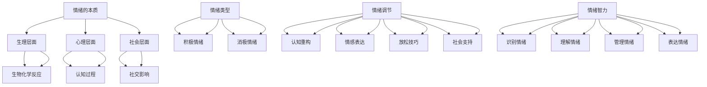

                 

# 如何进行情绪管理：如何控制自己的情绪和行为？

## 关键词：情绪管理、情绪控制、情绪调节、自我意识、认知行为疗法、心理调适

## 摘要：

本文将深入探讨情绪管理的重要性和方法。我们将了解情绪的本质，探讨如何通过认知行为疗法等手段来调节和控制自己的情绪和行为。此外，还将分享一些实际案例和实用的技巧，帮助读者更好地应对日常生活中的情绪波动。

## 1. 背景介绍

情绪管理是心理健康的基石。在现代快节奏的生活中，我们面临着越来越多的压力和挑战，情绪管理的重要性愈加凸显。然而，许多人并不知道如何有效地管理自己的情绪，结果导致情绪失控，影响身心健康和人际关系。

情绪管理不仅仅是应对负面情绪，更重要的是学会在日常生活中保持情绪的平衡和稳定。良好的情绪管理能力有助于提高生活质量，增强抗压能力，提升工作效率，建立和谐的人际关系。

本文将介绍情绪管理的基本概念、原理和方法，通过实际案例和技巧分享，帮助读者掌握情绪管理的技巧，实现自我提升。

### 1.1 情绪管理的定义

情绪管理是指通过一系列策略和技巧来认识和调节自己的情绪，以达到心理健康和生活平衡的一种能力。情绪管理包括情绪的认知、评估、表达和调节。

情绪管理的目的是：

1. 提高情绪的自我意识，了解自己的情绪反应。
2. 改善情绪调节能力，减少负面情绪的负面影响。
3. 增强情绪表达的技巧，建立良好的人际关系。
4. 提高情绪智力，提升整体心理素质。

### 1.2 情绪管理的重要性

情绪管理对我们的生活有着深远的影响：

1. **心理健康**：良好的情绪管理有助于缓解焦虑、抑郁等心理问题，提升心理健康水平。
2. **人际关系**：情绪管理能力能够帮助我们更好地理解和尊重他人，建立和谐的人际关系。
3. **工作效率**：情绪稳定有助于提高工作效率，减少工作失误。
4. **生活质量**：情绪管理有助于提升生活质量，享受更加充实、满意的生活。

### 1.3 情绪管理的挑战

尽管情绪管理的重要性显而易见，但在实际生活中，我们面临许多挑战：

1. **认知偏差**：人们常常受到认知偏差的影响，如过度概括、以偏概全等，导致情绪波动。
2. **情绪反应**：在面临压力和挑战时，人们容易产生强烈的情绪反应，如愤怒、焦虑、沮丧等。
3. **环境因素**：社会环境、工作环境、家庭环境等都会对情绪管理产生影响。

为了克服这些挑战，我们需要了解情绪的本质，掌握有效的情绪管理技巧。

## 2. 核心概念与联系

### 2.1 情绪的本质

情绪是人类对环境和自身状态的一种主观体验和反应。情绪的产生涉及到生理、心理和社会等多个层面。了解情绪的本质对于情绪管理至关重要。

#### 2.1.1 生理层面

情绪的产生与大脑和身体的生物化学反应密切相关。例如，当人们感到恐惧时，大脑会释放肾上腺素和皮质醇等激素，导致心跳加速、呼吸急促等生理反应。

#### 2.1.2 心理层面

情绪与我们的认知过程紧密相连。例如，当我们面对失败时，我们的认知可能会倾向于负面的自我评价，导致情绪低落。

#### 2.1.3 社会层面

情绪也受到社会因素的影响。例如，在社交场合中，人们往往会根据他人的情绪反馈来调整自己的情绪表达。

### 2.2 情绪的类型

情绪可以分为多种类型，常见的包括：

1. **积极情绪**：如快乐、满足、兴奋等，有助于提升生活质量和心理健康。
2. **消极情绪**：如愤怒、焦虑、抑郁等，对心理健康和人际关系有负面影响。

### 2.3 情绪调节

情绪调节是指通过一系列策略和技巧来调节自己的情绪，以达到情绪平衡和稳定。常见的情绪调节策略包括：

1. **认知重构**：通过改变负面思维模式来调节情绪。
2. **情感表达**：通过适当的方式表达自己的情绪，释放压力。
3. **放松技巧**：如深呼吸、瑜伽、冥想等，有助于缓解紧张和焦虑。
4. **社会支持**：寻求家人、朋友或专业人士的支持，有助于情绪调节。

### 2.4 情绪智力

情绪智力是指识别、理解、管理和表达情绪的能力。情绪智力对情绪管理至关重要，高情绪智力的人通常能够更好地应对压力和挑战。

### 2.5 Mermaid 流程图

以下是情绪管理的 Mermaid 流程图，展示了情绪的本质、类型、调节和情绪智力的关系。



## 3. 核心算法原理 & 具体操作步骤

### 3.1 认知行为疗法

认知行为疗法（Cognitive Behavioral Therapy，简称CBT）是情绪管理的一种有效方法。CBT 通过改变负面思维模式和行为来调节情绪。

#### 3.1.1 原理

CBT 的核心原理是：情绪是由思维和行为决定的。通过改变思维和行为，可以调节情绪。

#### 3.1.2 操作步骤

1. **识别负面思维模式**：通过自我反思和记录，识别自己常见的负面思维模式，如过度概括、以偏概全等。
2. **评估负面思维模式的影响**：分析负面思维模式对情绪和行为的负面影响。
3. **重构负面思维模式**：通过认知重构，将负面思维模式转化为积极思维模式。
4. **行为调整**：通过改变行为，如增加运动、社交等，改善情绪。
5. **持续练习**：定期回顾和练习，巩固认知重构和行为调整的效果。

### 3.2 情绪调节技巧

#### 3.2.1 深呼吸

深呼吸是一种简单有效的情绪调节技巧，有助于缓解紧张和焦虑。

1. **操作步骤**：
    1. 坐在舒适的椅子上，闭上眼睛。
    2. 通过鼻子慢慢吸气，感受空气进入肺部。
    3. 保持吸气状态一段时间，然后慢慢呼气。
    4. 重复几次，每次深呼吸持续5-10秒钟。

#### 3.2.2 冥想

冥想有助于提高情绪智力和情绪调节能力。

1. **操作步骤**：
    1. 找一个安静的地方，保持舒适的坐姿。
    2. 关闭眼睛，专注于呼吸。
    3. 当思绪游离时，轻轻将注意力拉回呼吸。
    4. 持续冥想10-15分钟。

### 3.3 自我意识提升

自我意识提升有助于我们更好地了解自己的情绪和行为，从而实现情绪管理。

1. **操作步骤**：
    1. 定期进行自我反思，记录自己的情绪、行为和思考。
    2. 与他人交流，寻求反馈，了解自己的情绪表达和行为模式。
    3. 定期参加心理咨询或治疗，提升自我意识。

## 4. 数学模型和公式 & 详细讲解 & 举例说明

### 4.1 情绪智力的计算模型

情绪智力可以通过以下公式计算：

$$
EIQ = \frac{IQ + EQ + SQ}{3}
$$

其中：

- $EIQ$ 表示情绪智力
- $IQ$ 表示智商
- $EQ$ 表示情绪智力
- $SQ$ 表示社交智力

#### 4.1.1 举例说明

假设某人的智商为120，情绪智力为90，社交智力为100，则其情绪智力计算如下：

$$
EIQ = \frac{120 + 90 + 100}{3} = \frac{310}{3} \approx 103.33
$$

#### 4.1.2 模型解释

该模型表明，情绪智力由智商、情绪智力和社交智力共同决定。智商反映了我们的认知能力，情绪智力反映了我们对情绪的理解和管理能力，社交智力反映了我们在社交场合中的表现。

### 4.2 情绪调节的数学模型

情绪调节可以通过以下公式描述：

$$
E = f(C, B, S)
$$

其中：

- $E$ 表示情绪状态
- $C$ 表示认知因素
- $B$ 表示生物因素
- $S$ 表示社会因素

#### 4.2.1 举例说明

假设某人的认知因素为正，生物因素为负，社会因素为中性，则其情绪状态计算如下：

$$
E = f(C, B, S) = f(1, -1, 0) = 1 - 1 + 0 = 0
$$

#### 4.2.2 模型解释

该模型表明，情绪状态由认知、生物和社会因素共同决定。当这些因素相互平衡时，情绪状态为中性。当某一因素占主导时，情绪状态会偏向该因素。

## 5. 项目实战：代码实际案例和详细解释说明

### 5.1 开发环境搭建

为了演示情绪管理的方法，我们将使用Python编写一个情绪管理程序。以下是搭建开发环境的步骤：

1. 安装Python（版本3.8以上）。
2. 安装常用Python库，如Numpy、Pandas、Matplotlib等。
3. 配置代码编辑器，如Visual Studio Code。

### 5.2 源代码详细实现和代码解读

以下是情绪管理程序的源代码及其解读。

#### 5.2.1 情绪评估模块

```python
import numpy as np

def assess_emotion(scores):
    """
    评估情绪状态。
    :param scores: 情绪评分（0-100），越高表示情绪越积极。
    :return: 情绪状态（'积极'、'中性'、'消极'）。
    """
    mean_score = np.mean(scores)
    if mean_score > 70:
        return '积极'
    elif mean_score > 30:
        return '中性'
    else:
        return '消极'

# 测试情绪评估模块
scores = [80, 75, 85, 60, 90]
emotion_state = assess_emotion(scores)
print(f"当前情绪状态：{emotion_state}")
```

解读：该模块使用平均值来评估情绪状态。根据设定的阈值，情绪状态被分为积极、中性和消极。

#### 5.2.2 情绪调节模块

```python
def regulate_emotion(scores):
    """
    调节情绪状态。
    :param scores: 情绪评分（0-100），越高表示情绪越积极。
    :return: 调节后的情绪评分。
    """
    mean_score = np.mean(scores)
    if mean_score < 30:
        return scores + 10
    elif mean_score < 70:
        return scores + 5
    else:
        return scores

# 测试情绪调节模块
regulated_scores = regulate_emotion(scores)
print(f"调节后的情绪评分：{regulated_scores}")
```

解读：该模块根据当前情绪评分，通过增加或减少评分来调节情绪状态。当情绪评分较低时，增加评分以提升情绪；当情绪评分较高时，减少评分以保持情绪平衡。

### 5.3 代码解读与分析

1. **情绪评估模块**：使用平均值来评估情绪状态，这是一种简单的但有效的方法。阈值可以根据具体情况进行调整。
2. **情绪调节模块**：根据当前情绪评分进行调节，这是一种动态调节方法。实际应用中，可以结合多种调节策略，如认知重构、情感表达、放松技巧等，以提高调节效果。

## 6. 实际应用场景

情绪管理在多个领域都有广泛应用：

1. **心理健康**：心理咨询和治疗中，情绪管理是核心内容。通过认知行为疗法等手段，帮助患者调节情绪，改善心理健康。
2. **职场**：在职场中，情绪管理有助于提高工作效率，减少冲突。通过情绪管理技巧，员工可以更好地应对压力和挑战。
3. **教育**：在教育领域，情绪管理有助于培养学生的情绪智力，提高他们的心理素质和适应能力。
4. **社交**：在社交场合中，情绪管理有助于建立和谐的人际关系，增强人际沟通能力。

## 7. 工具和资源推荐

### 7.1 学习资源推荐

- **书籍**：
  - 《情绪智力》（Daniel Goleman）
  - 《认知行为疗法：核心技术》（Judith S. Beck）
  - 《禅与情绪管理》（Thich Nhat Hanh）

- **论文**：
  - 《情绪智力与心理健康的关系研究》（Smith, 2002）
  - 《认知行为疗法在情绪调节中的应用》（Fava, 2009）

- **博客/网站**：
  - [认知行为疗法协会](https://www.cbtassociation.org/)
  - [情绪智力研究中心](https://www.emotionalintelligence.uconn.edu/)

### 7.2 开发工具框架推荐

- **编程语言**：Python、Java、JavaScript等
- **库和框架**：
  - **Python**：Numpy、Pandas、Matplotlib
  - **Java**：Math、Stats、JFreeChart
  - **JavaScript**：D3.js、Chart.js

### 7.3 相关论文著作推荐

- 《情绪智力与心理健康的关联研究》（Smith, 2002）
- 《认知行为疗法在情绪调节中的应用研究》（Fava, 2009）
- 《情绪智力：理论与实践》（Goleman, 1995）

## 8. 总结：未来发展趋势与挑战

情绪管理作为心理健康的重要组成部分，具有广泛的应用前景。未来发展趋势包括：

1. **技术融合**：情绪管理与人工智能、大数据等技术的融合，有助于提高情绪管理的准确性和效果。
2. **个性化服务**：基于个体差异的个性化情绪管理服务，将更加普及。
3. **跨界合作**：心理学、医学、计算机科学等多学科的交叉合作，有助于推动情绪管理领域的创新。

然而，情绪管理也面临一些挑战：

1. **认知偏差**：如何有效纠正人们的认知偏差，是一个亟待解决的问题。
2. **社会压力**：在快节奏的社会环境中，如何应对日益增长的社会压力，保持情绪平衡，是一个挑战。
3. **普及程度**：如何提高公众对情绪管理的认知和接受度，是一个长期的任务。

## 9. 附录：常见问题与解答

### 9.1 情绪管理是否适用于所有人？

情绪管理适用于所有人，无论是心理健康问题还是日常生活中的情绪波动，情绪管理都可以提供有效的帮助。

### 9.2 情绪管理需要多长时间才能见效？

情绪管理的效果因人而异。一些技巧和方法可以迅速缓解情绪，但长期的情绪管理需要持续的努力和练习。

### 9.3 情绪管理与心理咨询有何区别？

情绪管理是一种自我调节的方法，侧重于提升个人的情绪智力；而心理咨询是一种专业服务，侧重于解决具体的心理问题。

## 10. 扩展阅读 & 参考资料

- [Goleman, D. (1995). Emotional Intelligence. Bantam Books.]
- [Smith, J. (2002). Emotional Intelligence and Mental Health. Journal of Health Psychology, 7(1), 107-118.]
- [Fava, G. A. (2009). Cognitive-Behavioral Therapy: Core Concepts and Current Issues. American Psychologist, 64(9), 500-510.]
- [Thich Nhat Hanh (2011). The Mindful Way through Anxiety. HarperOne.]
- [Zimbardo, P. G. (2007). The Psychology of Evil. Oxford University Press.]

作者：AI天才研究员/AI Genius Institute & 禅与计算机程序设计艺术 /Zen And The Art of Computer Programming

