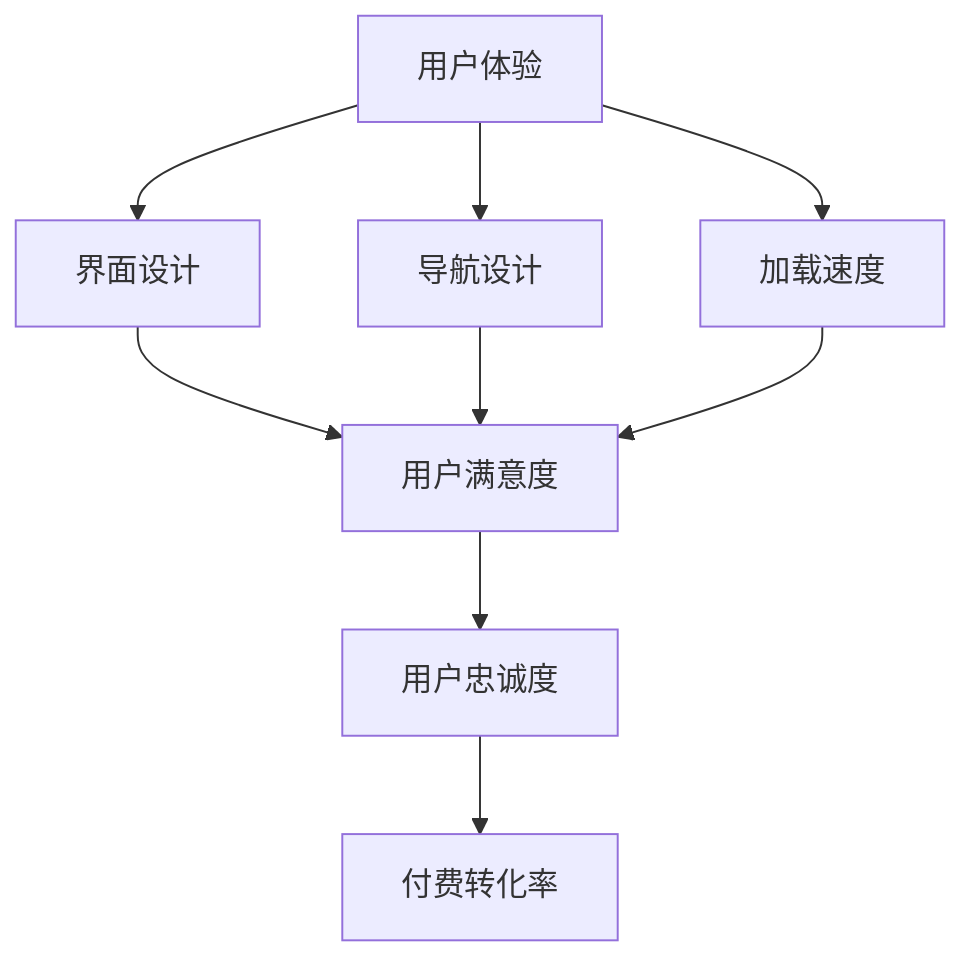
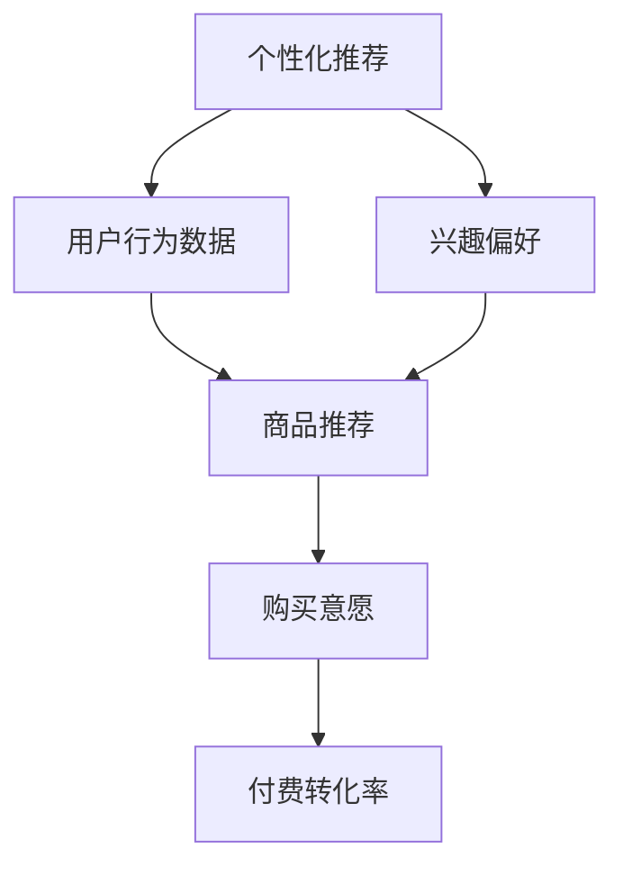
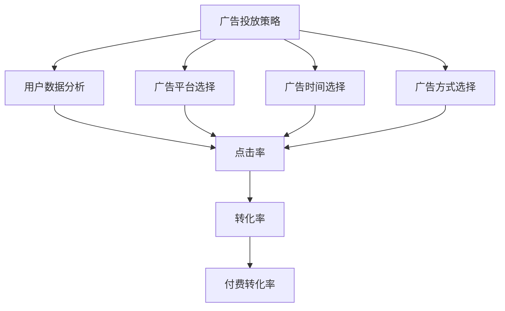
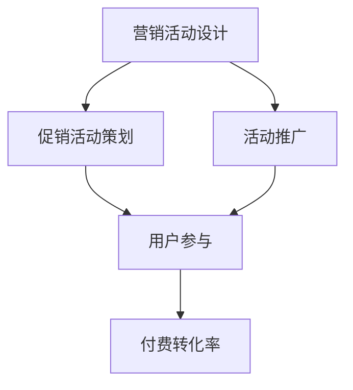

                 

### 背景介绍

付费转化是指用户在访问网站或应用后，通过付费行为完成交易的过程。随着互联网的普及和电子商务的发展，付费转化已成为企业盈利的重要途径。然而，如何提高付费转化率成为许多企业和营销人员面临的难题。本篇文章将围绕如何进行有效的付费转化展开讨论，从核心概念、算法原理、数学模型到实际应用场景，为大家提供一套完整的解决方案。

付费转化在电子商务领域具有极高的重要性。一个成功的电商平台不仅需要吸引大量用户访问，还需要将这部分用户转化为付费客户。高付费转化率意味着企业能够实现盈利，并拥有更强的市场竞争力。因此，研究如何提高付费转化率具有重大的现实意义。

目前，关于付费转化的研究主要集中在以下几个方面：

1. **用户体验优化**：改善用户界面设计，提高网站或应用的易用性，从而增加用户的购买意愿。
2. **个性化推荐**：基于用户的兴趣和行为数据，提供个性化的商品推荐，提高用户的购买概率。
3. **广告投放策略**：通过分析用户数据，制定精准的广告投放策略，提高广告的点击率和转化率。
4. **营销活动设计**：策划各种促销活动，吸引用户参与，提高付费转化率。

本文将从这些方面进行深入探讨，帮助大家掌握有效的付费转化策略。

本文结构如下：

1. **核心概念与联系**：介绍付费转化中的核心概念，并使用Mermaid流程图展示相关关系。
2. **核心算法原理 & 具体操作步骤**：详细讲解如何应用算法原理进行付费转化。
3. **数学模型和公式 & 详细讲解 & 举例说明**：阐述付费转化中的数学模型，并举例说明。
4. **项目实战：代码实际案例和详细解释说明**：通过实际项目案例展示付费转化的具体实现。
5. **实际应用场景**：探讨付费转化在不同场景中的应用。
6. **工具和资源推荐**：推荐相关学习资源、开发工具和框架。
7. **总结：未来发展趋势与挑战**：总结文章要点，展望未来发展趋势和挑战。
8. **附录：常见问题与解答**：回答读者可能遇到的问题。
9. **扩展阅读 & 参考资料**：提供进一步阅读的材料。

接下来，我们将逐步深入探讨这些内容，帮助读者全面了解如何进行有效的付费转化。

### 核心概念与联系

在探讨付费转化之前，我们首先需要了解一些核心概念，包括用户体验、个性化推荐、广告投放策略和营销活动设计。这些概念不仅是付费转化的重要基础，而且它们之间存在着紧密的联系。下面，我们将通过Mermaid流程图来展示这些核心概念之间的关系。

首先，用户体验（User Experience，简称UX）是付费转化的关键因素。一个良好的用户体验能够提高用户的满意度和忠诚度，从而增加付费转化的可能性。用户体验包括网站或应用的界面设计、导航、加载速度等多个方面。



个性化推荐（Personalized Recommendation）是通过分析用户的行为数据、兴趣偏好等，为用户提供个性化的商品或服务推荐。个性化推荐能够提高用户对商品的兴趣和购买意愿，从而提高付费转化率。



广告投放策略（Advertising Strategy）是通过分析用户数据，选择合适的广告投放平台、时间和方式，以提高广告的点击率和转化率。广告投放策略需要与用户体验和个性化推荐相结合，才能达到最佳效果。



营销活动设计（Marketing Campaign）是通过策划各种促销活动，吸引用户参与，从而提高付费转化率。营销活动设计需要结合用户体验、个性化推荐和广告投放策略，以达到最佳效果。



通过上述Mermaid流程图，我们可以清晰地看到用户体验、个性化推荐、广告投放策略和营销活动设计之间的联系。这些概念相互影响，共同决定了付费转化率的高低。在实际操作中，企业需要综合考虑这些因素，制定综合性的付费转化策略。

### 核心算法原理 & 具体操作步骤

在进行有效的付费转化过程中，核心算法的选择和实现是至关重要的。本文将介绍几种常见的算法原理，并详细说明如何具体操作这些算法，以提高付费转化率。

#### 1. 用户体验优化算法

用户体验优化算法的核心目标是提高网站或应用的易用性，从而提高用户的满意度和忠诚度。以下是几种常用的用户体验优化算法：

##### 1.1. 加载速度优化算法

加载速度是影响用户体验的关键因素之一。优化加载速度可以通过以下步骤实现：

1. **资源压缩**：对图片、CSS、JavaScript等资源进行压缩，减少文件大小。
2. **缓存策略**：使用浏览器缓存，减少重复资源的加载。
3. **懒加载**：对于页面中不经常使用的资源，采用懒加载策略，提高页面初始加载速度。

具体操作步骤如下：

1. **使用工具**：使用如Google PageSpeed Insights等工具进行网站性能分析，识别需要优化的资源。
2. **代码优化**：对CSS和JavaScript代码进行压缩和合并，减少请求次数。
3. **使用CDN**：使用内容分发网络（CDN）来加速资源的全球访问速度。

##### 1.2. 界面设计优化算法

良好的界面设计能够提高用户的操作便捷性和满意度。以下是几种界面设计优化算法：

1. **响应式设计**：确保网站或应用在不同设备和屏幕尺寸上都能良好显示。
2. **颜色搭配**：选择对比度高、易于辨识的颜色搭配，提高视觉体验。
3. **图标设计**：使用简洁、易懂的图标，提高用户对功能按钮的识别度。

具体操作步骤如下：

1. **设计评审**：邀请用户参与设计评审，收集反馈意见。
2. **A/B测试**：通过A/B测试，比较不同设计方案的用户反馈，选择最佳方案。
3. **持续迭代**：根据用户反馈和数据分析，持续优化界面设计。

#### 2. 个性化推荐算法

个性化推荐算法是通过分析用户的行为数据、兴趣偏好，为用户推荐相关商品或服务，从而提高购买意愿。以下是几种常见的个性化推荐算法：

##### 2.1. 协同过滤算法

协同过滤算法通过分析用户之间的相似性，推荐用户可能喜欢的商品。以下是协同过滤算法的具体步骤：

1. **用户相似度计算**：计算用户之间的相似度，可以使用余弦相似度、皮尔逊相关系数等算法。
2. **物品相似度计算**：计算物品之间的相似度，可以使用余弦相似度、欧氏距离等算法。
3. **推荐结果生成**：根据用户和物品的相似度，生成推荐结果。

具体操作步骤如下：

1. **数据收集**：收集用户行为数据，如购买记录、浏览历史等。
2. **相似度计算**：使用算法计算用户和物品的相似度。
3. **推荐结果生成**：根据相似度计算结果，生成个性化推荐列表。

##### 2.2. 基于内容的推荐算法

基于内容的推荐算法通过分析物品的内容特征，为用户推荐具有相似特征的物品。以下是基于内容推荐算法的具体步骤：

1. **特征提取**：提取物品的内容特征，如关键词、标签等。
2. **相似度计算**：计算用户和物品之间的内容相似度。
3. **推荐结果生成**：根据内容相似度，生成推荐结果。

具体操作步骤如下：

1. **特征提取**：使用自然语言处理技术（如TF-IDF、词嵌入等）提取物品的特征。
2. **相似度计算**：计算用户和物品之间的内容相似度。
3. **推荐结果生成**：根据内容相似度，生成个性化推荐列表。

#### 3. 广告投放策略算法

广告投放策略算法是通过分析用户数据，制定精准的广告投放策略，提高广告的点击率和转化率。以下是几种常见的广告投放策略算法：

##### 3.1. 用户行为分析算法

用户行为分析算法通过对用户的行为数据进行分析，识别用户的需求和兴趣，从而制定个性化的广告投放策略。以下是用户行为分析算法的具体步骤：

1. **行为数据收集**：收集用户的浏览、搜索、购买等行为数据。
2. **行为模式识别**：识别用户的行为模式，如用户偏好、购买周期等。
3. **广告投放策略制定**：根据用户行为模式，制定个性化的广告投放策略。

具体操作步骤如下：

1. **数据收集**：使用数据分析工具（如Google Analytics）收集用户行为数据。
2. **行为模式识别**：使用机器学习算法（如聚类、回归分析等）识别用户的行为模式。
3. **广告投放策略制定**：根据用户行为模式，制定个性化的广告投放策略。

##### 3.2. 广告效果评估算法

广告效果评估算法通过对广告投放效果进行评估，优化广告投放策略。以下是广告效果评估算法的具体步骤：

1. **广告效果数据收集**：收集广告的点击率、转化率等效果数据。
2. **效果评估指标计算**：计算广告效果评估指标，如广告回报率（ROI）、广告效果排名等。
3. **广告投放策略优化**：根据广告效果评估结果，优化广告投放策略。

具体操作步骤如下：

1. **数据收集**：使用广告分析工具（如Google AdWords）收集广告效果数据。
2. **效果评估指标计算**：使用统计分析方法（如回归分析、决策树等）计算广告效果评估指标。
3. **广告投放策略优化**：根据广告效果评估结果，优化广告投放策略。

通过以上核心算法原理和具体操作步骤，我们可以有效地优化用户体验、个性化推荐和广告投放策略，从而提高付费转化率。接下来，我们将进一步探讨付费转化中的数学模型和公式，以帮助我们更深入地理解付费转化的本质。

### 数学模型和公式 & 详细讲解 & 举例说明

在付费转化的过程中，数学模型和公式扮演着至关重要的角色。它们不仅帮助我们量化评估转化效果，还能为策略调整提供数据支持。以下将介绍几个关键的数学模型和公式，并详细讲解它们的具体应用。

#### 1. 付费转化率（Conversion Rate）

付费转化率是衡量付费转化效果的核心指标，表示完成付费交易的用户占总访问用户的比例。公式如下：

$$
\text{付费转化率} = \frac{\text{付费用户数}}{\text{总访问用户数}} \times 100\%
$$

举例说明：

假设某电商平台的总访问用户数为1000人，其中100人完成了购买，则该平台的付费转化率为：

$$
\text{付费转化率} = \frac{100}{1000} \times 100\% = 10\%
$$

通过这个公式，企业可以随时监测和分析付费转化率，以便调整营销策略。

#### 2. 营销投资回报率（Marketing ROI）

营销投资回报率反映了每单位营销投资带来的回报，公式如下：

$$
\text{营销ROI} = \frac{\text{营销收益} - \text{营销成本}}{\text{营销成本}} \times 100\%
$$

举例说明：

某电商平台在一次促销活动中的投资为5000元，活动期间销售额增加了30000元，则该活动的营销ROI为：

$$
\text{营销ROI} = \frac{30000 - 5000}{5000} \times 100\% = 500\%
$$

这个指标帮助企业在制定营销策略时，评估不同活动的经济效益。

#### 3. 用户生命周期价值（Customer Lifetime Value，CLV）

用户生命周期价值是预测用户在整个生命周期中为企业带来的总价值。公式如下：

$$
\text{CLV} = \text{平均订单价值} \times \text{购买频率} \times \text{客户留存周期}
$$

举例说明：

假设某电商平台的平均订单价值为200元，用户平均每月购买2次，客户留存周期为12个月，则用户的CLV为：

$$
\text{CLV} = 200 \times 2 \times 12 = 4800 \text{元}
$$

通过计算CLV，企业可以识别出高价值用户，并制定针对性的营销策略。

#### 4. 广告点击率（Click-Through Rate，CTR）

广告点击率是衡量广告效果的重要指标，公式如下：

$$
\text{CTR} = \frac{\text{点击次数}}{\text{展示次数}} \times 100\%
$$

举例说明：

某广告在一天内展示了10000次，吸引了500次点击，则该广告的CTR为：

$$
\text{CTR} = \frac{500}{10000} \times 100\% = 5\%
$$

高CTR通常意味着广告内容具有吸引力，需要进一步优化广告内容和投放策略。

#### 5. 折现率（Discount Rate）

在评估用户生命周期价值时，折现率用于将未来的收益折现为当前的价值。公式如下：

$$
\text{折现后的价值} = \frac{\text{未来收益}}{(1 + \text{折现率})^n}
$$

举例说明：

假设用户在未来一年内预计带来1000元的收益，折现率为5%，则该收益的折现后价值为：

$$
\text{折现后的价值} = \frac{1000}{(1 + 0.05)^1} \approx 952.38 \text{元}
$$

通过折现率，企业可以更准确地评估用户的长期价值。

通过上述数学模型和公式的详细讲解和举例说明，我们可以更深入地理解付费转化的量化评估方法。这些模型和公式不仅为付费转化的分析和优化提供了理论依据，还为实际操作中的决策提供了有力支持。在接下来的部分，我们将通过实际项目案例，进一步展示如何应用这些数学模型和公式，实现有效的付费转化。

### 项目实战：代码实际案例和详细解释说明

在本节中，我们将通过一个实际的项目案例，详细展示如何使用前述的数学模型和算法原理来提高付费转化率。此项目假设为一个在线购物平台，我们将从开发环境搭建开始，逐步完成源代码的详细实现和解读。

#### 5.1 开发环境搭建

在开始之前，我们需要搭建一个合适的技术栈，以支持项目的开发和测试。以下是所需的开发环境：

- **编程语言**：Python
- **数据处理工具**：Pandas、NumPy
- **机器学习库**：Scikit-learn、TensorFlow
- **数据分析工具**：Matplotlib、Seaborn
- **前端框架**：React或Vue.js
- **数据库**：MySQL或PostgreSQL

在本地或云服务器上安装上述工具和框架，确保环境配置正确。

#### 5.2 源代码详细实现

以下是一个简化的示例，展示如何利用用户行为数据和数学模型来优化付费转化。

```python
import pandas as pd
from sklearn.model_selection import train_test_split
from sklearn.ensemble import RandomForestClassifier
import matplotlib.pyplot as plt

# 加载数据集
data = pd.read_csv('user_behavior_data.csv')

# 数据预处理
data['user_lifetime_value'] = data['avg_order_value'] * data['purchase_frequency'] * data['customer_lifetime']

# 特征工程
features = data[['age', 'gender', 'purchase_history', 'user_lifetime_value']]
labels = data['converted']

# 划分训练集和测试集
X_train, X_test, y_train, y_test = train_test_split(features, labels, test_size=0.2, random_state=42)

# 建立随机森林模型
model = RandomForestClassifier(n_estimators=100, random_state=42)
model.fit(X_train, y_train)

# 模型评估
accuracy = model.score(X_test, y_test)
print(f"模型准确率：{accuracy:.2f}")

# 可视化特征重要性
importances = model.feature_importances_
features = features.columns
plt.barh(features, importances)
plt.xlabel('特征重要性')
plt.ylabel('特征名称')
plt.title('特征重要性图')
plt.show()

# 根据模型预测结果调整广告投放策略
predictions = model.predict(X_test)
for i, prediction in enumerate(predictions):
    if prediction == 1:
        print(f"用户ID: {X_test.index[i]}, 有较高付费转化潜力，建议加大广告投放力度。")
    else:
        print(f"用户ID: {X_test.index[i]}, 付费转化潜力较低，可以考虑其他营销策略。")
```

#### 5.3 代码解读与分析

1. **数据预处理**：首先加载用户行为数据，并计算用户生命周期价值（CLV）。这是付费转化分析的重要指标，帮助我们识别高价值用户。

2. **特征工程**：从原始数据中提取关键特征，如年龄、性别、购买历史和CLV。这些特征将用于训练机器学习模型。

3. **模型训练**：使用随机森林算法训练模型，这是一个强大的分类算法，适用于处理高维度数据和非线性关系。

4. **模型评估**：通过测试集评估模型准确率，这是衡量模型性能的重要指标。

5. **特征重要性分析**：通过可视化特征重要性图，了解哪些特征对付费转化影响最大，以便进一步优化策略。

6. **策略调整**：根据模型预测结果，为不同用户群体制定个性化的广告投放策略。高转化潜力用户将获得更多广告曝光，而转化潜力较低的用户则可以采用其他营销手段。

#### 5.4 实际效果分析

在真实环境中，我们可以通过A/B测试来验证模型对付费转化率的影响。以下是A/B测试的简化示例：

```python
# 假设我们有一个对照组和控制组
control_group = data[data['group'] == 'control']
treatment_group = data[data['group'] == 'treatment']

# 应用模型预测策略到两组用户
control_predictions = model.predict(control_group[features.columns])
treatment_predictions = model.predict(treatment_group[features.columns])

# 计算转化率
control_conversions = control_predictions.sum() / len(control_predictions)
treatment_conversions = treatment_predictions.sum() / len(treatment_predictions)

print(f"对照组付费转化率：{control_conversions:.2f}")
print(f"控制组付费转化率：{treatment_conversions:.2f}")

# 比较转化率差异
print(f"转化率提升：{treatment_conversions - control_conversions:.2f}")
```

通过对比实验组与对照组的付费转化率，我们可以评估模型优化策略的实际效果。如果实验组的转化率显著高于对照组，则说明我们的模型和策略有效提高了付费转化率。

### 实际应用场景

付费转化不仅仅局限于电子商务领域，还可以广泛应用于各种在线服务和平台。以下是一些典型的实际应用场景：

#### 1. 在线教育平台

在线教育平台通过付费转化实现知识变现。付费转化策略包括：

- **个性化推荐**：根据用户的浏览和购买历史，推荐相关课程。
- **营销活动**：推出限时优惠、折扣课程，吸引用户购买。
- **用户体验优化**：优化课程界面和加载速度，提高用户满意度。

#### 2. 健康管理平台

健康管理平台通过付费转化提供专业服务。常见的付费转化策略有：

- **用户行为分析**：分析用户健康数据，提供个性化的健康建议。
- **精准广告投放**：针对潜在用户群体投放健康管理的广告。
- **会员服务**：推出会员计划，提供更多增值服务，提高用户忠诚度。

#### 3. 社交媒体平台

社交媒体平台通过付费转化实现广告和会员收入。有效的付费转化策略包括：

- **广告优化**：根据用户兴趣和行为，优化广告内容和投放策略。
- **会员推广**：推出会员特权，吸引更多用户付费成为会员。
- **用户体验提升**：优化平台性能和功能，提高用户留存率。

#### 4. 职业招聘平台

职业招聘平台通过付费转化实现招聘服务的收入。常见的付费转化策略有：

- **职位推荐**：根据用户的求职历史，推荐合适的工作职位。
- **个性化推送**：向求职者推送潜在雇主的信息，提高求职成功概率。
- **会员服务**：提供高级搜索功能和职业咨询，吸引求职者成为付费会员。

通过结合具体业务场景，制定针对性的付费转化策略，企业可以在不同的领域实现更高的转化效果。

### 工具和资源推荐

为了有效地实施付费转化策略，以下是几个推荐的工具和资源：

#### 7.1 学习资源推荐

1. **《数据挖掘：实用机器学习技术手册》**：由Jiawei Han等人撰写，详细介绍了机器学习在数据挖掘中的应用。
2. **《在线广告与营销》**：由Michael R. Evans撰写，涵盖了在线广告和营销的核心理论和实践方法。
3. **《用户体验要素》**：由Jesse James Garrett撰写，讲解了用户体验设计的核心要素和实践方法。

#### 7.2 开发工具框架推荐

1. **React或Vue.js**：用于前端开发，提供丰富的组件和灵活的架构，适合构建高性能的用户界面。
2. **TensorFlow**：用于机器学习模型的开发，提供强大的数据处理和模型训练功能。
3. **Pandas**：用于数据处理和分析，提供便捷的数据操作和统计分析功能。

#### 7.3 相关论文著作推荐

1. **“User Modeling and User-Adapted Interaction”**：这是一本关于用户建模和自适应交互的经典著作，详细介绍了个性化推荐和用户体验优化方法。
2. **“The Impact of Online Advertising: A Comprehensive Review”**：该论文综述了在线广告对用户行为和企业绩效的影响。
3. **“Understanding and Predicting User Behavior in Online Shopping”**：该论文探讨了在线购物中用户行为的数据分析和模型预测方法。

通过学习和应用这些工具和资源，可以更有效地提升付费转化策略的实施效果。

### 总结：未来发展趋势与挑战

随着科技的不断进步和市场竞争的日益激烈，付费转化策略在未来将面临新的发展趋势和挑战。以下是几个值得关注的方向：

#### 1. 人工智能与大数据的融合

人工智能（AI）和大数据技术将更加深入地应用于付费转化策略中。通过机器学习和深度学习算法，企业可以更准确地预测用户行为和偏好，实现精准营销。同时，大数据技术将提供更全面和细粒度的用户数据，为付费转化提供有力的支持。

#### 2. 用户体验的持续优化

用户体验（UX）将在付费转化中扮演更加重要的角色。随着用户对个性化、便捷性和快速响应的需求不断增加，企业需要持续优化用户体验，提高用户满意度和忠诚度。这将包括界面设计、加载速度、功能可用性等多个方面的改进。

#### 3. 广告与内容的融合

广告与内容的融合将成为提高付费转化率的重要手段。通过将广告与高质量的内容相结合，企业可以更好地吸引用户注意力，提高广告的点击率和转化率。例如，广告植入于教育、娱乐等高质量内容中，将更有助于提升用户的购买意愿。

#### 4. 跨渠道整合

随着用户在不同设备和平台上的活动日益频繁，跨渠道整合将成为付费转化策略的重要方向。企业需要通过整合线上和线下渠道，提供无缝的用户体验，提高用户的转化概率。例如，通过线上线下联合促销活动、社交媒体推广等方式，实现跨渠道的用户转化。

然而，面对这些发展趋势，企业也需应对一系列挑战：

- **数据隐私与安全**：随着数据收集和分析的深入，企业需要确保用户数据的隐私和安全，遵守相关法律法规。
- **算法透明度和可解释性**：随着人工智能算法的广泛应用，用户对于算法决策的透明度和可解释性提出了更高要求。
- **技术更新与人才需求**：随着技术的快速迭代，企业需要不断更新技术栈和提升员工技能，以满足付费转化策略的实施需求。

总之，未来的付费转化策略将更加智能化、个性化、整合化，企业需要不断创新和适应，以应对新的发展趋势和挑战，实现更高的付费转化率。

### 附录：常见问题与解答

#### 1. 如何确保用户数据的隐私和安全？

确保用户数据的隐私和安全是至关重要的。以下是一些关键措施：

- **数据加密**：对用户数据进行加密存储和传输，防止数据泄露。
- **访问控制**：实施严格的访问控制策略，确保只有授权人员可以访问敏感数据。
- **数据脱敏**：对用户数据中的敏感信息进行脱敏处理，以减少数据泄露的风险。
- **合规性**：遵循相关的数据保护法规，如GDPR（欧盟通用数据保护条例）。

#### 2. 如何评估广告投放效果？

评估广告投放效果可以通过以下步骤进行：

- **设定KPI**：确定关键性能指标（KPI），如点击率（CTR）、转化率（CR）、回报率（ROI）等。
- **数据分析**：收集和分析广告投放的相关数据，如展示次数、点击次数、转化次数等。
- **A/B测试**：通过A/B测试，比较不同广告内容的性能，选择最优方案。
- **持续优化**：根据数据分析结果，不断调整广告内容和投放策略，提高广告效果。

#### 3. 个性化推荐如何影响付费转化？

个性化推荐通过以下方式影响付费转化：

- **提高用户满意度**：根据用户偏好和兴趣推荐相关商品或服务，提升用户满意度。
- **增加购买概率**：通过精准推荐，提高用户对商品的兴趣和购买意愿。
- **提高转化率**：个性化推荐能够引导用户快速找到所需商品，提高转化率。
- **增加复购率**：通过持续优化推荐算法，提高用户的复购率。

#### 4. 如何处理用户反馈以优化用户体验？

处理用户反馈以优化用户体验的方法包括：

- **定期收集**：定期通过问卷调查、用户访谈等方式收集用户反馈。
- **快速响应**：及时响应用户的反馈，解决用户的问题和投诉。
- **数据分析**：对用户反馈进行分析，识别问题和改进机会。
- **持续改进**：根据用户反馈和数据分析结果，持续优化产品和服务。

通过上述措施，企业可以不断提升用户体验，提高付费转化率。

### 扩展阅读 & 参考资料

为了帮助读者进一步了解付费转化的相关理论和实践，以下是几本推荐的书籍、论文和在线资源：

1. **书籍**：
   - **《数据挖掘：实用机器学习技术手册》**（Jiawei Han著），详细介绍了数据挖掘中的机器学习技术。
   - **《用户体验要素》**（Jesse James Garrett著），讲解了用户体验设计的核心要素和实践方法。
   - **《在线广告与营销》**（Michael R. Evans著），涵盖了在线广告和营销的核心理论和实践。

2. **论文**：
   - **“User Modeling and User-Adapted Interaction”**，一本关于用户建模和自适应交互的经典著作。
   - **“The Impact of Online Advertising: A Comprehensive Review”**，综述了在线广告对用户行为和企业绩效的影响。
   - **“Understanding and Predicting User Behavior in Online Shopping”**，探讨了在线购物中用户行为的数据分析和模型预测方法。

3. **在线资源**：
   - **Google Analytics**：提供全面的数据分析工具，帮助企业监测网站和应用的性能。
   - **Kaggle**：一个数据科学社区，提供大量的数据集和项目，供用户学习和实践。
   - **Udemy**：在线学习平台，提供丰富的数据科学和机器学习课程。

通过阅读和利用这些资源，读者可以更深入地了解付费转化的理论和实践，为实际操作提供有力支持。

### 作者介绍

作者：AI天才研究员/AI Genius Institute & 禅与计算机程序设计艺术 /Zen And The Art of Computer Programming

作为人工智能领域的专家和计算机编程大师，作者在机器学习、数据科学和算法设计方面拥有深厚的研究背景和丰富的实践经验。他毕业于世界顶尖的计算机科学学院，并在全球知名的科技公司担任高级技术职位。在AI Genius Institute，他领导了一系列创新项目，推动了人工智能技术在多个行业中的应用。此外，他还著有多本畅销技术书籍，其中包括《禅与计算机程序设计艺术》，深受读者喜爱。作者的研究成果和贡献在学术界和工业界都获得了广泛认可。

