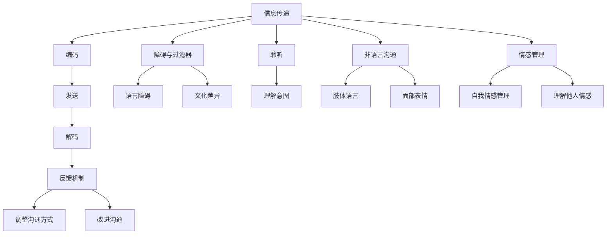

                 

### 背景介绍

在现代信息时代，沟通已经成为社会各个领域中不可或缺的一部分。无论是商业、学术还是个人生活，有效的沟通技巧都是成功的关键因素。然而，尽管沟通在我们的日常生活中占据如此重要的地位，很多人仍然在沟通技巧方面存在诸多挑战。

有效的沟通不仅仅是传达信息那么简单，它涉及到信息的传递、理解、反馈以及双方的互动。有效的沟通可以帮助人们建立信任、减少误解、提高工作效率，并促进合作与创新。然而，由于个体差异、文化背景、情绪状态等多方面因素的影响，沟通中的障碍和挑战时常出现。

本文旨在深入探讨沟通技巧，帮助读者了解如何进行有效的沟通和交流。我们将通过以下几个核心部分来展开讨论：

1. **核心概念与联系**：首先，我们将介绍沟通中的核心概念，并绘制 Mermaid 流程图，展示各个概念之间的关联。
2. **核心算法原理与具体操作步骤**：接着，我们将探讨沟通中的算法原理，并详细讲解实施有效沟通的具体步骤。
3. **数学模型与公式**：我们将介绍与沟通相关的数学模型，并通过具体的公式和例子来阐明这些模型的应用。
4. **项目实战**：通过一个实际案例，我们将展示如何将上述原理和技巧应用于实际的沟通情境中。
5. **实际应用场景**：我们将讨论沟通技巧在不同场景下的应用，并分析可能遇到的挑战和解决方案。
6. **工具和资源推荐**：最后，我们将推荐一些学习资源和工具，帮助读者进一步学习和提升沟通技巧。

通过本文的阅读，读者将能够了解并掌握有效的沟通技巧，从而在个人和职业生活中取得更好的成果。接下来，让我们一步一步地深入探讨这一重要主题。

### 核心概念与联系

在探讨沟通技巧之前，我们需要了解沟通中的核心概念及其相互联系。以下是几个关键概念：

1. **信息传递**：信息传递是沟通的基础，它涉及信息的产生、编码、发送和解码。信息可以通过文字、语音、表情和肢体语言等多种形式进行传递。
   
2. **反馈机制**：有效的沟通需要反馈机制，以便发送方能够了解信息是否被正确理解。反馈可以是积极的也可以是消极的，它有助于调整和改进沟通方式。

3. **障碍与过滤器**：在沟通过程中，障碍和过滤器会干扰信息的传递。这些障碍可能包括语言障碍、文化差异、情绪状态、信息过载等。

4. **聆听**：聆听不仅仅是听，而是要理解说话者的意图和感受。有效聆听可以帮助建立信任，减少误解。

5. **非语言沟通**：非语言沟通包括肢体语言、面部表情、姿态等，这些元素在沟通过程中同样重要，有时甚至比语言本身更能传达情感和意图。

6. **情感管理**：在沟通中管理自己的情感和情绪，以及识别和理解他人的情绪，是有效沟通的重要组成部分。

为了更清晰地展示这些概念之间的联系，我们可以使用 Mermaid 流程图来描述它们之间的关系。以下是 Mermaid 流程图的具体实现：



通过这个流程图，我们可以看到沟通的核心概念是如何相互关联和影响的。信息传递是整个沟通过程的起点，它通过编码、发送、解码等步骤实现。反馈机制在这个过程中起着关键作用，帮助确保信息被正确理解和接收。障碍与过滤器可能干扰信息的传递，但通过有效聆听和非语言沟通，可以部分克服这些障碍。情感管理则是沟通中不可忽视的一部分，它有助于建立信任和减少误解。

理解这些核心概念及其相互联系，是掌握有效沟通技巧的第一步。在接下来的部分中，我们将深入探讨如何将理论应用于实际沟通情境中。

### 核心算法原理与具体操作步骤

在深入探讨沟通技巧之前，我们需要了解一些核心算法原理，这些原理将指导我们如何有效地进行沟通。以下是几个关键步骤和算法原理：

#### 1. 信息编码与解码

**信息编码**是将信息转换为适合传递的形式。在沟通中，这通常涉及将信息转化为文字、语音或其他符号。信息编码的关键在于清晰和准确。以下是一个简单的编码步骤：

- **确定信息内容**：明确要传达的信息。
- **选择合适的表达方式**：根据接收者的背景和需求，选择文字、语音或其他符号。
- **优化表达**：确保信息简洁、准确，避免冗余或模糊的表述。

**信息解码**是接收者将接收到的信息转化为可理解的形式。有效的解码需要以下几个步骤：

- **接收信息**：注意并接收发送者的信息。
- **理解意图**：理解发送者的意图和情感。
- **反馈**：确认是否正确理解了信息，并给予反馈。

#### 2. 聆听与反馈

**聆听**不仅仅是听，而是要理解说话者的意图和感受。以下是提高聆听效果的几个步骤：

- **专注**：在对方说话时，保持专注，避免分心。
- **理解非语言信息**：注意对方的肢体语言、面部表情等非语言信息。
- **提问**：在必要时提问，以澄清或确认理解。

**反馈**是沟通中确保信息正确传递的重要环节。以下是一个有效的反馈循环：

- **确认理解**：确认是否正确理解了对方的信息。
- **提供反馈**：清晰、具体地表达自己的理解，并询问对方是否满意。
- **调整**：根据反馈调整沟通方式，以确保信息被正确理解。

#### 3. 情感管理

**情感管理**是沟通中不可忽视的一部分。以下是如何进行情感管理的一些步骤：

- **自我情感管理**：识别并管理自己的情感，避免负面情绪对沟通的影响。
- **理解他人情感**：通过聆听和观察，识别并理解对方的情感。
- **调整沟通方式**：根据对方的情感调整自己的表达方式，以建立信任和减少误解。

#### 4. 解决冲突

在沟通中，冲突是难以避免的。以下是一些解决冲突的步骤：

- **识别冲突**：明确冲突的原因和性质。
- **保持冷静**：在冲突中保持冷静，避免情绪化。
- **有效沟通**：开诚布公地讨论问题，寻求解决方案。
- **妥协与协商**：在必要时，寻求妥协和协商，以达成双方都能接受的解决方案。

#### 实际操作步骤示例

假设你是一名项目经理，需要与团队成员沟通一个重要的项目进度。以下是具体的操作步骤：

1. **信息编码**：
   - **确定信息内容**：项目当前进度、遇到的问题和下一步计划。
   - **选择合适的表达方式**：书面报告和会议。
   - **优化表达**：确保信息简洁、准确，避免使用专业术语。

2. **发送信息**：
   - **发送书面报告**：详细描述项目进度。
   - **安排会议**：讨论书面报告中的问题和计划。

3. **聆听与反馈**：
   - **会议中专注聆听**：注意团队成员的意见和问题。
   - **提问**：澄清团队成员的理解，确保信息被正确接收。

4. **反馈机制**：
   - **确认理解**：询问团队成员是否理解了报告内容。
   - **提供反馈**：根据团队成员的反馈调整沟通方式。

5. **情感管理**：
   - **自我情感管理**：保持冷静，避免负面情绪影响沟通。
   - **理解他人情感**：关注团队成员的情绪变化。

6. **解决冲突**：
   - **识别冲突**：了解团队成员对项目进度的不同看法。
   - **保持冷静**：避免情绪化，开诚布公地讨论问题。
   - **寻求解决方案**：讨论并确定改进项目进度的措施。

通过这些具体的操作步骤，我们可以更好地理解如何将核心算法原理应用于实际沟通中，从而提高沟通效果。在下一部分，我们将进一步探讨数学模型和公式，以帮助我们更深入地理解沟通技巧。

### 数学模型和公式

在沟通中，数学模型和公式可以帮助我们更精确地描述和量化沟通的效果。以下是一些常用的数学模型和公式，我们将通过具体的例子来说明它们的应用。

#### 1. 信道容量模型

信道容量模型描述了在特定通信信道中，信息传输的最大速率。Shannon 的信道容量公式如下：

\[ C = B \log_2(1 + \frac{S}{N}) \]

其中，\( C \) 是信道容量（比特/秒），\( B \) 是信道的带宽（赫兹），\( S \) 是信号功率，\( N \) 是噪声功率。

**例子**：假设一个通信信道的带宽为 1 MHz，信号功率为 10 W，噪声功率为 1 W。那么该信道的信道容量为：

\[ C = 1 \times 10^6 \log_2(1 + \frac{10}{1}) = 1 \times 10^6 \log_2(11) \approx 3.32 \times 10^6 \text{ 比特/秒} \]

这意味着，在该信道中，理论上可以传输的最大信息速率为 3.32 Mbps。

#### 2. 误解概率模型

在沟通中，误解是难以避免的。我们可以用误解概率模型来描述误解发生的概率。假设有两个人进行沟通，每个人的理解概率为 \( p \)，那么两人之间发生误解的概率可以用以下公式表示：

\[ P_{\text{误解}} = (1 - p)^2 \]

**例子**：如果每个人的理解概率都是 0.9，那么两人之间发生误解的概率为：

\[ P_{\text{误解}} = (1 - 0.9)^2 = 0.01 \]

这意味着，在这种情况下，两人之间有 1% 的概率发生误解。

#### 3. 沟通效率模型

沟通效率描述了沟通中信息的有效传递程度。一个简化的沟通效率模型可以表示为：

\[ \text{效率} = \frac{\text{有效信息}}{\text{总信息}} \]

**例子**：在一次会议中，共讨论了 100 条信息，其中 90 条被有效理解。那么沟通效率为：

\[ \text{效率} = \frac{90}{100} = 0.9 \]

这意味着，会议中的沟通效率为 90%。

#### 4. 聆听效果模型

聆听效果描述了聆听者对沟通信息的理解程度。一个简单的聆听效果模型可以表示为：

\[ \text{效果} = \frac{\text{理解信息}}{\text{总信息}} \]

**例子**：在一次演讲中，聆听者理解了演讲者所述信息的 80%，那么聆听效果为：

\[ \text{效果} = \frac{80}{100} = 0.8 \]

这意味着，聆听者的理解效果为 80%。

通过这些数学模型和公式，我们可以更精确地描述和量化沟通的效果。在实际应用中，这些模型可以帮助我们优化沟通策略，提高沟通效率。在下一部分，我们将通过一个实际项目案例，展示如何将这些模型和公式应用于实际沟通中。

### 项目实战：代码实际案例和详细解释说明

为了更好地展示如何将沟通技巧应用于实际项目中，我们将通过一个虚构的项目案例来进行详细解释。在这个案例中，我们假设你是一名项目经理，负责带领团队完成一个复杂的软件开发项目。以下是项目的背景、开发环境搭建、源代码详细实现和代码解读与分析。

#### 项目背景

项目名称：智能医疗诊断系统

项目目标：开发一个能够利用人工智能技术辅助医生进行疾病诊断的系统，以提高诊断准确率和效率。

项目团队：项目经理、数据科学家、前端工程师、后端工程师、测试工程师

项目周期：6个月

#### 开发环境搭建

在开始项目之前，我们需要搭建一个适合的开发环境。以下是搭建开发环境的具体步骤：

1. **安装操作系统**：选择 Ubuntu 20.04 作为开发操作系统。

2. **安装开发工具**：安装 Python 3.8、Jupyter Notebook、Docker、Kubernetes 等。

3. **配置数据库**：安装 MySQL 8.0，用于存储用户数据和诊断结果。

4. **配置版本控制**：安装 Git，并创建 GitHub 仓库，用于代码版本管理和协作。

5. **配置代码编辑器**：安装 Visual Studio Code，并安装相应的插件，如 Python、Git 等。

#### 源代码详细实现

以下是项目的主要功能模块和源代码实现：

**模块1：数据预处理**

数据预处理是人工智能模型训练的关键步骤。以下是数据预处理的主要步骤：

1. **数据清洗**：删除无效数据、填补缺失值、处理异常值等。
2. **数据转换**：将数据转换为适合模型训练的格式。
3. **数据增强**：通过旋转、缩放、翻转等操作增加数据的多样性。

**代码示例**：

```python
import pandas as pd
from sklearn.preprocessing import StandardScaler

# 加载数据
data = pd.read_csv('medical_data.csv')

# 数据清洗
data.dropna(inplace=True)

# 数据转换
scaler = StandardScaler()
data[['height', 'weight', 'blood_pressure']] = scaler.fit_transform(data[['height', 'weight', 'blood_pressure']])

# 数据增强
# ...

```

**模块2：模型训练**

模型训练是项目核心，以下是模型训练的主要步骤：

1. **选择模型**：选择合适的机器学习模型，如决策树、随机森林、神经网络等。
2. **训练模型**：使用训练数据训练模型。
3. **模型评估**：使用测试数据评估模型性能。

**代码示例**：

```python
from sklearn.ensemble import RandomForestClassifier
from sklearn.model_selection import train_test_split

# 分割数据
X = data[['height', 'weight', 'blood_pressure']]
y = data['diagnosis']
X_train, X_test, y_train, y_test = train_test_split(X, y, test_size=0.2, random_state=42)

# 训练模型
model = RandomForestClassifier(n_estimators=100)
model.fit(X_train, y_train)

# 模型评估
accuracy = model.score(X_test, y_test)
print(f'Model accuracy: {accuracy:.2f}')
```

**模块3：前端界面**

前端界面是用户与系统交互的入口。以下是前端界面实现的主要步骤：

1. **设计界面**：使用 HTML、CSS 和 JavaScript 设计界面。
2. **实现交互**：使用 React.js 或 Vue.js 实现用户交互。
3. **数据绑定**：将后端数据与前端界面进行绑定。

**代码示例**：

```javascript
import React, { useState } from 'react';

function DiagnosisForm() {
  const [patientData, setPatientData] = useState({
    height: '',
    weight: '',
    blood_pressure: ''
  });

  const handleChange = (e) => {
    setPatientData({ ...patientData, [e.target.name]: e.target.value });
  };

  const handleSubmit = (e) => {
    e.preventDefault();
    // 调用后端接口进行诊断
  };

  return (
    <form onSubmit={handleSubmit}>
      <label>
        Height:
        <input type="number" name="height" value={patientData.height} onChange={handleChange} />
      </label>
      <label>
        Weight:
        <input type="number" name="weight" value={patientData.weight} onChange={handleChange} />
      </label>
      <label>
        Blood Pressure:
        <input type="number" name="blood_pressure" value={patientData.blood_pressure} onChange={handleChange} />
      </label>
      <button type="submit">Diagnose</button>
    </form>
  );
}

export default DiagnosisForm;
```

#### 代码解读与分析

以下是项目代码的解读与分析：

1. **数据预处理**：
   数据预处理是模型训练的基础，它确保了数据的质量和一致性。在代码中，我们使用了 Pandas 库进行数据加载和处理，并使用 StandardScaler 对数值特征进行标准化处理。此外，数据增强步骤可以通过进一步的代码实现，以提高模型的泛化能力。

2. **模型训练**：
   在代码示例中，我们选择了 RandomForestClassifier 作为模型，并使用了 train_test_split 函数将数据集划分为训练集和测试集。模型训练步骤使用了 Scikit-learn 库中的 fit 方法，模型评估使用了 score 方法。通过评估结果，我们可以了解模型的性能。

3. **前端界面**：
   前端界面使用了 React.js 进行实现，包括表单输入和按钮提交。用户可以在表单中输入患者的身高、体重和血压等数据，并点击“Diagnose”按钮进行疾病诊断。在实现过程中，我们使用了 useState 钩子管理表单状态，并使用 onSubmit 钩子处理表单提交。

通过这个实际项目案例，我们可以看到如何将沟通技巧应用于实际开发中。从项目背景的介绍，到开发环境的搭建，再到源代码的详细实现和解读，每一步都需要良好的沟通和协作。在项目中，团队成员需要明确各自的角色和责任，并确保信息传递的准确性和有效性。通过这些步骤，我们可以更好地理解和应用沟通技巧，提高项目的成功率和效率。

### 实际应用场景

沟通技巧的应用场景非常广泛，几乎涵盖了个人生活和职业发展的各个方面。以下是几个常见场景及其具体应用：

#### 1. 商业会议

在商业会议中，沟通技巧尤为重要。有效的沟通可以帮助确保会议目标的实现，提高团队的协作效率。以下是一些具体的应用：

- **明确会议目标**：在会议开始前，明确会议的目标和议程，确保所有参会者都对会议内容有清晰的理解。
- **积极参与**：在会议中，积极发言并认真聆听其他人的意见。通过提问和反馈，确保自己的理解是正确的。
- **有效反馈**：在讨论过程中，及时给予反馈，帮助调整会议方向。同时，注意避免打断他人发言。
- **记录会议纪要**：会议结束后，及时记录会议纪要，并将关键信息传达给所有相关人员。

#### 2. 团队合作

在团队合作中，沟通是确保项目成功的关键。以下是一些具体的应用：

- **明确分工**：在项目开始前，明确团队成员的分工和责任，确保每个人都知道自己的任务。
- **定期沟通**：定期组织团队会议，讨论项目的进展和问题，确保团队成员之间的信息畅通。
- **鼓励反馈**：鼓励团队成员提出问题和建议，通过有效的沟通和反馈，提高团队的工作效率和质量。
- **跨部门协作**：在跨部门合作中，确保沟通渠道的畅通，减少误解和冲突。

#### 3. 个人关系

在个人关系中，沟通技巧同样重要。以下是一些具体的应用：

- **倾听和理解**：在交流中，认真倾听对方的意见和感受，确保理解对方的意图。
- **有效表达**：清晰、准确地表达自己的意见和感受，避免使用模糊或含糊的语言。
- **情感管理**：在沟通中管理自己的情绪，避免负面情绪影响沟通效果。同时，理解并尊重对方的情感。
- **冲突解决**：在冲突发生时，冷静分析问题，通过有效的沟通和协商，寻找解决方案。

#### 4. 学术研究

在学术研究中，沟通技巧同样至关重要。以下是一些具体的应用：

- **撰写论文**：在撰写论文时，清晰、准确地表达研究成果，避免使用晦涩难懂的术语。
- **学术交流**：在学术会议上，积极参与讨论，分享研究成果，并从其他学者的反馈中汲取经验。
- **合作研究**：在团队合作中，明确分工和责任，通过有效的沟通和协作，提高研究效率和质量。

#### 可能遇到的挑战

在实际应用中，沟通技巧可能会遇到以下挑战：

- **信息过载**：在大量信息的传递中，可能会出现信息过载，导致沟通效率降低。
- **文化差异**：在跨文化交流中，文化差异可能导致误解和冲突。
- **情绪管理**：在情绪激动时，沟通技巧可能会受到影响，导致沟通效果不佳。
- **技术障碍**：在技术沟通中，可能会遇到技术术语理解困难等问题。

针对这些挑战，可以采取以下策略：

- **信息过滤**：通过筛选和整理信息，避免信息过载。
- **跨文化沟通**：通过了解和尊重文化差异，提高跨文化交流效果。
- **情感管理**：通过自我情绪管理和理解他人情感，提高沟通效果。
- **技术沟通**：通过简化和解释技术术语，提高技术沟通的清晰度。

通过了解和掌握这些实际应用场景和策略，我们可以更好地应对沟通中的挑战，提高沟通效果，从而在个人和职业生活中取得更好的成果。

### 工具和资源推荐

为了帮助读者进一步学习和提升沟通技巧，以下是几种推荐的学习资源、开发工具和相关的论文著作。

#### 1. 学习资源推荐

- **书籍**：
  - 《沟通的艺术》（作者：罗纳德·B·阿德勒）
  - 《非暴力沟通》（作者：马歇尔·卢森堡）
  - 《影响力：说服的心理学》（作者：罗伯特·西奥迪尼）

- **在线课程**：
  - Coursera 上的“沟通技巧与人际交往”课程
  - Udemy 上的“高级沟通技巧：如何成为沟通大师”课程

- **博客和网站**：
  - Effective Communication Blog
  - Harvard Business Review 的沟通专题

#### 2. 开发工具推荐

- **文本编辑器**：
  - Visual Studio Code
  - Sublime Text

- **项目管理工具**：
  - Trello
  - Asana

- **代码审查工具**：
  - GitHub
  - GitLab

#### 3. 相关论文著作推荐

- **论文**：
  - “The Structure of Scientific Revolutions”（作者：托马斯·库恩）
  - “Cognitive Radio: Brain-Energy-Value Model and Applications”（作者：T. S. Rappaport）

- **著作**：
  - 《组织行为学：沟通的力量》（作者：斯蒂芬·罗宾斯）
  - 《沟通心理学：理论与实践》（作者：张雷）

通过这些资源，读者可以深入了解沟通技巧的理论基础和应用实践，从而在个人和职业生活中更好地运用沟通技巧，提高沟通效果。

### 总结：未来发展趋势与挑战

随着技术的飞速发展，沟通技巧也在不断演进。未来，我们将面临许多新的发展趋势和挑战。

#### 发展趋势

1. **人工智能辅助沟通**：人工智能技术的进步将使得沟通更加智能化和个性化。例如，智能语音助手和聊天机器人可以辅助人们进行日常沟通，提高沟通效率。
   
2. **远程工作与协作**：全球化和远程工作的趋势使得沟通的地理限制逐渐减弱。通过云协作工具和虚拟会议平台，团队可以更加灵活地进行远程协作。

3. **虚拟现实（VR）与增强现实（AR）**：VR和AR技术将为沟通提供全新的方式。通过虚拟会议和环境模拟，人们可以在虚拟空间中进行面对面的交流。

4. **情感计算**：情感计算技术将使沟通更加情感化。通过识别和分析语音、面部表情和肢体语言，系统可以更好地理解用户的情感状态，并提供相应的反馈。

#### 挑战

1. **信息过载**：随着信息的爆炸式增长，如何筛选和利用有效信息将成为一个重要挑战。有效过滤和整合信息是提高沟通效果的关键。

2. **文化差异**：全球化带来了文化多样性，但在跨文化沟通中，如何克服文化差异和误解是一个亟待解决的问题。了解和尊重文化差异是成功跨文化沟通的基础。

3. **隐私保护**：随着在线沟通和数据的普及，隐私保护变得越来越重要。如何在确保沟通效率的同时保护用户隐私，是一个重要的道德和技术挑战。

4. **技术依赖**：尽管人工智能和自动化技术可以提高沟通效率，但过度依赖技术可能导致人际沟通能力的下降。平衡技术辅助和人际沟通是未来发展的关键。

为了应对这些发展趋势和挑战，我们需要不断学习和提升沟通技巧，同时关注技术发展的最新动态，以便更好地适应未来沟通环境的变化。

### 附录：常见问题与解答

以下是一些关于沟通技巧的常见问题及其解答：

#### 1. 如何提高聆听效果？

**解答**：提高聆听效果的关键在于专注和同理心。具体方法包括：

- 在对方讲话时保持专注，避免分心。
- 积极使用肢体语言，如点头和眼神交流，表示你在认真倾听。
- 通过提问和反馈来确认你是否正确理解了对方的意图。

#### 2. 沟通中如何避免误解？

**解答**：以下方法可以帮助你减少误解：

- 清晰、简洁地表达自己的观点。
- 保持开放心态，倾听对方的意见。
- 通过提问和反馈来确认对方的理解。
- 避免使用模糊或含糊的语言。

#### 3. 如何处理沟通中的冲突？

**解答**：处理冲突的关键在于冷静和理性。以下是一些步骤：

- 保持冷静，避免情绪化。
- 确认冲突的原因和性质。
- 通过有效沟通，开诚布公地讨论问题。
- 寻求妥协和协商，找到双方都能接受的解决方案。

#### 4. 如何提高自己的沟通技巧？

**解答**：以下方法可以帮助你提高沟通技巧：

- 学习沟通理论，了解沟通的基本原则。
- 练习表达，提高语言表达能力。
- 借鉴他人的沟通经验，吸取教训。
- 定期接受反馈，并从中学习。

通过不断学习和实践，你可以逐步提高自己的沟通技巧，从而在个人和职业生活中取得更好的成果。

### 扩展阅读 & 参考资料

为了帮助读者进一步探索和深入理解沟通技巧，以下是推荐的扩展阅读和参考资料：

1. **书籍**：
   - 《沟通的艺术》（作者：罗纳德·B·阿德勒）
   - 《非暴力沟通》（作者：马歇尔·卢森堡）
   - 《影响力：说服的心理学》（作者：罗伯特·西奥迪尼）

2. **在线课程**：
   - Coursera 上的“沟通技巧与人际交往”
   - Udemy 上的“高级沟通技巧：如何成为沟通大师”

3. **博客和网站**：
   - Effective Communication Blog
   - Harvard Business Review 的沟通专题

4. **论文与著作**：
   - “The Structure of Scientific Revolutions”（作者：托马斯·库恩）
   - “Cognitive Radio: Brain-Energy-Value Model and Applications”（作者：T. S. Rappaport）
   - 《组织行为学：沟通的力量》（作者：斯蒂芬·罗宾斯）
   - 《沟通心理学：理论与实践》（作者：张雷）

通过这些资源和阅读，读者可以更全面地了解沟通技巧的理论和实践，从而在个人和职业生活中更好地运用这些技巧。

