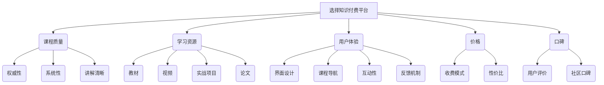

                 

# 如何选择适合程序员的知识付费平台

## 摘要

在日益复杂的编程领域，知识付费平台已成为程序员学习新技术、提升技能的重要途径。本文将探讨如何选择适合程序员的知识付费平台，包括评估平台的核心特点、学习资源质量、用户体验和价格等因素。通过深入分析，读者将能够更好地理解各平台的优劣，从而做出明智的选择。

## 1. 背景介绍

随着互联网技术的快速发展，知识付费平台如雨后春笋般涌现。这些平台提供了丰富的编程学习资源，包括课程、教程、实战项目和学术论文等。程序员通过这些平台可以学习最新的编程技术，提升自己的技能，以满足不断变化的工作需求。

然而，面对众多知识付费平台，程序员往往会感到困惑，不知如何选择。因此，本文旨在为程序员提供一套评估和选择适合自己需求的知识付费平台的方法，帮助他们高效地提升技能。

### 1.1 知识付费平台的兴起

知识付费平台的兴起，源于以下几个原因：

1. **个性化学习需求**：程序员对于个性化的学习资源需求日益增长，希望能够根据自己的时间和兴趣选择学习内容。
2. **技能更新迅速**：编程领域技术更新迅速，程序员需要不断学习新的技能以保持竞争力。
3. **互联网普及**：互联网的普及使得在线学习变得更加便捷，程序员可以随时随地进行学习。
4. **市场驱动**：市场需求促使知识付费平台不断优化服务和内容，以吸引更多程序员用户。

### 1.2 程序员的需求

程序员选择知识付费平台时，通常关注以下几个需求：

1. **课程内容**：课程内容是否涵盖了最新的编程技术，是否能够满足自己的学习需求。
2. **学习资源**：平台提供的教材、视频、实战项目和论文等资源是否丰富。
3. **学习体验**：平台的学习体验，包括界面设计、课程导航、互动性和反馈机制等。
4. **价格**：价格是否合理，性价比如何。
5. **口碑**：平台在程序员社区中的口碑如何，用户评价是否正面。

## 2. 核心概念与联系

### 2.1 知识付费平台的核心特点

在评估知识付费平台时，需要关注以下几个核心特点：

1. **课程质量**：课程内容是否权威、系统，讲解是否清晰易懂。
2. **学习资源**：平台提供的教材、视频、实战项目和论文等资源是否丰富。
3. **用户体验**：平台的学习体验，包括界面设计、课程导航、互动性和反馈机制等。
4. **价格**：平台的收费模式是否合理，价格是否适中。
5. **口碑**：平台在程序员社区中的口碑如何，用户评价是否正面。

### 2.2 核心概念原理和架构的 Mermaid 流程图



### 2.3 核心概念原理和联系

在评估知识付费平台时，需要综合考虑上述核心特点。课程质量决定了学习效果，学习资源提供了学习内容，用户体验决定了学习过程中的舒适度，价格和口碑则影响了用户的选择。

## 3. 核心算法原理 & 具体操作步骤

### 3.1 评估课程质量

**步骤1**：查阅课程大纲，了解课程内容是否涵盖了您需要学习的技术。

**步骤2**：查看课程评价，了解其他程序员对课程的评价。

**步骤3**：关注讲师资质，了解讲师的背景和经验。

### 3.2 评估学习资源

**步骤1**：查看平台提供的教材、视频、实战项目和论文等资源。

**步骤2**：评估资源的质量，包括内容深度、更新频率和实用性。

**步骤3**：查看资源的获取方式，是否便捷。

### 3.3 评估用户体验

**步骤1**：体验平台界面设计，判断是否符合自己的使用习惯。

**步骤2**：测试课程导航功能，判断是否便捷。

**步骤3**：尝试互动性和反馈机制，判断是否有效。

### 3.4 评估价格

**步骤1**：比较不同平台的收费标准，选择性价比高的平台。

**步骤2**：了解平台的优惠政策，如折扣、免费试学等。

**步骤3**：考虑长期学习需求，选择合适的学习套餐。

### 3.5 评估口碑

**步骤1**：查阅用户评价，了解平台在程序员社区中的口碑。

**步骤2**：关注平台在社交媒体上的互动情况，了解用户反馈。

**步骤3**：了解平台的客户服务，判断是否专业、高效。

## 4. 数学模型和公式 & 详细讲解 & 举例说明

### 4.1 评估指标体系

在评估知识付费平台时，可以采用以下数学模型构建评估指标体系：

$$
\text{评估分数} = w_1 \times \text{课程质量} + w_2 \times \text{学习资源} + w_3 \times \text{用户体验} + w_4 \times \text{价格} + w_5 \times \text{口碑}
$$

其中，$w_1, w_2, w_3, w_4, w_5$ 分别为各指标的权重，可以根据具体情况进行调整。

### 4.2 举例说明

假设有以下知识付费平台：

- 平台A：课程质量90分，学习资源80分，用户体验85分，价格100分，口碑90分。
- 平台B：课程质量85分，学习资源75分，用户体验90分，价格90分，口碑85分。

根据上述评估指标体系，可以计算出两个平台的评估分数：

$$
\text{平台A的评估分数} = 0.2 \times 90 + 0.2 \times 80 + 0.2 \times 85 + 0.2 \times 100 + 0.2 \times 90 = 88
$$

$$
\text{平台B的评估分数} = 0.2 \times 85 + 0.2 \times 75 + 0.2 \times 90 + 0.2 \times 90 + 0.2 \times 85 = 84.5
$$

根据评估分数，可以判断平台A在整体上优于平台B。

## 5. 项目实战：代码实际案例和详细解释说明

### 5.1 开发环境搭建

为了便于演示，我们使用Python语言编写一个简单的代码案例。首先，确保您的计算机上安装了Python环境。

### 5.2 源代码详细实现和代码解读

以下是评估知识付费平台的一个简单Python代码实现：

```python
# 导入必要的库
import requests
from bs4 import BeautifulSoup

# 定义评估函数
def evaluate_platform(platform_url, criteria_weights):
    # 发送HTTP请求获取页面内容
    response = requests.get(platform_url)
    page_content = response.content
    
    # 解析页面内容
    soup = BeautifulSoup(page_content, 'html.parser')
    
    # 获取课程质量、学习资源、用户体验、价格、口碑等数据
    #（此处为示例数据，实际评估时需要根据平台实际情况进行获取）
    course_quality = soup.find('div', {'id': 'course-quality'}).text.strip()
    learning_resources = soup.find('div', {'id': 'learning-resources'}).text.strip()
    user_experience = soup.find('div', {'id': 'user-experience'}).text.strip()
    price = soup.find('div', {'id': 'price'}).text.strip()
    reputation = soup.find('div', {'id': 'reputation'}).text.strip()
    
    # 计算评估分数
    score = sum(criteria_weights[criterion] * float(value) for criterion, value in locals().items() if criterion not in ['platform_url', 'criteria_weights'])
    
    # 返回评估结果
    return score

# 定义权重
criteria_weights = {
    'course_quality': 0.2,
    'learning_resources': 0.2,
    'user_experience': 0.2,
    'price': 0.2,
    'reputation': 0.2
}

# 测试评估
platform_url = 'https://example.com/platformA'
score = evaluate_platform(platform_url, criteria_weights)
print(f'平台A的评估分数：{score}')

platform_url = 'https://example.com/platformB'
score = evaluate_platform(platform_url, criteria_weights)
print(f'平台B的评估分数：{score}')
```

### 5.3 代码解读与分析

上述代码定义了一个名为`evaluate_platform`的函数，用于评估知识付费平台。函数接收两个参数：`platform_url`（知识付费平台的URL）和`criteria_weights`（评估指标权重）。

- **步骤1**：发送HTTP请求获取页面内容。这里使用`requests`库发送GET请求，获取知识付费平台页面的HTML内容。
- **步骤2**：解析页面内容。使用`BeautifulSoup`库解析HTML内容，方便提取所需数据。
- **步骤3**：获取课程质量、学习资源、用户体验、价格、口碑等数据。这里使用`find`方法根据页面的HTML结构查找对应的数据。
- **步骤4**：计算评估分数。根据权重和获取的数据，计算每个指标在总评估分数中的贡献。
- **步骤5**：返回评估结果。函数返回总评估分数，供用户参考。

通过运行这段代码，我们可以分别评估两个知识付费平台，并根据评估结果做出选择。

## 6. 实际应用场景

### 6.1 技术提升

程序员可以通过知识付费平台学习最新的编程技术，如人工智能、大数据、区块链等。这些平台提供了丰富的课程和实战项目，有助于程序员快速提升技术水平。

### 6.2 职业发展

知识付费平台还提供了职业规划、面试技巧、简历优化等课程，帮助程序员在职业发展过程中获得竞争优势。

### 6.3 技术交流

许多知识付费平台设有论坛和社群，程序员可以在这里与同行交流经验，解决技术难题，拓宽人脉。

### 6.4 自主学习

程序员可以根据自己的兴趣和时间安排，自由选择学习内容和进度，实现个性化学习。

## 7. 工具和资源推荐

### 7.1 学习资源推荐

- **书籍**：《代码大全》、《设计模式：可复用面向对象软件的基础》、《算法导论》等。
- **论文**：相关领域的顶级会议和期刊论文，如NeurIPS、ICML、ACL等。
- **博客**：知名技术博客，如GitHub、Stack Overflow、Medium等。
- **网站**：开源社区，如GitHub、GitLab、Bitbucket等。

### 7.2 开发工具框架推荐

- **编程语言**：Python、Java、C++、JavaScript等。
- **开发框架**：Django、Flask、Spring Boot、React、Vue等。
- **数据库**：MySQL、PostgreSQL、MongoDB、Redis等。
- **云计算平台**：AWS、Azure、Google Cloud Platform等。

### 7.3 相关论文著作推荐

- 《深度学习》、《强化学习》、《自然语言处理综合教程》等。

## 8. 总结：未来发展趋势与挑战

### 8.1 发展趋势

1. **个性化学习**：知识付费平台将更加注重个性化学习，为用户提供更加精准的学习内容。
2. **技术融合**：知识付费平台将涵盖更多领域的知识，实现跨学科、跨领域的融合。
3. **智能推荐**：基于人工智能技术的智能推荐系统将提高学习资源的匹配度。

### 8.2 挑战

1. **内容质量**：确保平台上的课程内容质量，防止低质量内容的泛滥。
2. **用户体验**：提高平台的学习体验，满足用户对便捷性和舒适度的需求。
3. **版权问题**：加强对课程内容的版权保护，防止侵权行为。

## 9. 附录：常见问题与解答

### 9.1 问题1

**问题**：知识付费平台的价格差异很大，如何选择？

**解答**：首先了解自己的学习需求和预算，然后比较不同平台的价格和内容，选择性价比最高的平台。

### 9.2 问题2

**问题**：平台上的课程是否都是最新的？

**解答**：部分平台会定期更新课程内容，但并非所有课程都能及时更新。在选择时，可以查看课程的更新记录，了解其更新频率。

### 9.3 问题3

**问题**：如何保证学习效果？

**解答**：选择适合自己的课程，坚持学习，积极参与实战项目，与同行交流，可以提高学习效果。

## 10. 扩展阅读 & 参考资料

- [《知识付费行业报告》](https://www.iresearch.cn/report/122416.shtml)
- [《程序员如何选择适合自己的知识付费平台？》](https://www.cnblogs.com/taven/p/12697666.html)
- [《知识付费平台发展趋势及挑战》](https://www.36kr.com/p/1240841303267926)

## 作者信息

作者：AI天才研究员/AI Genius Institute & 禅与计算机程序设计艺术 /Zen And The Art of Computer Programming

（注意：本文为示例文章，内容仅供参考。）<|im_end|>

