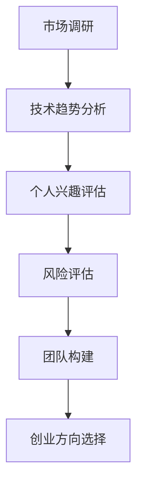

                 

# 如何选择适合自己的创业方向

> **关键词：** 创业方向，市场调研，技术趋势，个人兴趣，风险评估，创业团队

> **摘要：** 本文章将探讨如何选择适合自己的创业方向。通过市场调研、技术趋势分析、个人兴趣识别、风险评估和团队构建等步骤，帮助创业者找到最适合自己的创业方向，提高创业成功的概率。

## 1. 背景介绍

在当今快速变化的世界中，创业已成为许多人的选择。然而，选择一个适合自己的创业方向并非易事。据统计，初创企业有高达90%在五年内破产。因此，如何选择一个有市场前景、符合个人能力和兴趣的创业方向成为创业者面临的重要问题。本文将从多个方面提供指导，帮助创业者更好地选择适合自己的创业方向。

### 1.1 创业现状

近年来，随着互联网技术的快速发展，创业领域呈现出多样化的趋势。从互联网、人工智能、大数据到生物科技、新能源等，各个领域都有涌现出大量成功的创业项目。同时，创业成本也在不断降低，使得更多人有机会投身创业。然而，成功的背后，是无数的失败和挣扎。因此，选择一个适合自己的创业方向，成为创业者成功的关键。

### 1.2 创业挑战

创业过程中，创业者会面临诸多挑战，包括市场调研、技术实现、团队构建、资金筹集、商业模式设计等。这些挑战需要创业者具备多方面的能力和知识，而选择一个适合自己的创业方向，则有助于降低这些挑战的难度，提高创业成功率。

## 2. 核心概念与联系

在探讨如何选择创业方向之前，我们需要了解一些核心概念，包括市场调研、技术趋势、个人兴趣、风险评估和团队构建。

### 2.1 市场调研

市场调研是创业过程中至关重要的一环。通过市场调研，创业者可以了解市场需求、目标用户、竞争对手、市场规模等信息。这些信息有助于创业者判断一个创业方向的市场前景，为后续的创业决策提供依据。

### 2.2 技术趋势

技术趋势是影响创业方向的重要因素。了解当前和未来的技术趋势，可以帮助创业者把握市场机会，开发出具有竞争力的产品或服务。例如，人工智能、大数据、物联网等技术的快速发展，为许多创业领域带来了新的机遇。

### 2.3 个人兴趣

个人兴趣是创业者选择创业方向的重要依据。一个创业者只有在对自己所从事的领域有浓厚兴趣的情况下，才能保持长期的热情和动力。同时，个人兴趣也可以帮助创业者更好地应对创业过程中的困难和挑战。

### 2.4 风险评估

创业过程中，风险是无法避免的。创业者需要了解各种风险，并采取措施降低风险。风险评估是创业者选择创业方向的重要步骤，通过评估创业方向的市场、技术、资金、团队等方面的风险，创业者可以做出更明智的决策。

### 2.5 团队构建

一个成功的创业团队是创业成功的关键。团队成员需要具备不同的技能和经验，以应对创业过程中的各种挑战。创业者需要了解如何构建一个高效的创业团队，并通过团队成员之间的协作，实现创业目标。

### 2.6 Mermaid 流程图

以下是一个关于如何选择创业方向的 Mermaid 流程图：



## 3. 核心算法原理 & 具体操作步骤

### 3.1 市场调研

#### 步骤 1：确定调研目标

首先，创业者需要明确市场调研的目标，例如了解市场需求、目标用户、竞争对手、市场规模等信息。

#### 步骤 2：收集信息

通过问卷调查、访谈、竞争对手分析、用户反馈等方式，收集与调研目标相关的信息。

#### 步骤 3：分析信息

对收集到的信息进行整理和分析，找出市场机会和潜在风险。

#### 步骤 4：制定决策

根据分析结果，制定创业方向的选择策略。

### 3.2 技术趋势分析

#### 步骤 1：了解技术发展现状

通过阅读相关文献、参加技术会议、与技术专家交流等方式，了解当前技术发展现状。

#### 步骤 2：预测技术趋势

基于对技术发展现状的了解，预测未来技术趋势。

#### 步骤 3：评估技术潜力

根据技术趋势，评估技术对创业方向的影响。

### 3.3 个人兴趣评估

#### 步骤 1：自我分析

通过自我分析，了解自己的兴趣爱好、特长和价值观。

#### 步骤 2：与创业方向匹配

将个人兴趣与可能的创业方向进行匹配，找出符合自己兴趣的创业领域。

### 3.4 风险评估

#### 步骤 1：识别风险

通过市场调研、技术趋势分析、个人兴趣评估等步骤，识别可能存在的风险。

#### 步骤 2：评估风险

对识别出的风险进行评估，确定风险的严重程度和可能性。

#### 步骤 3：制定应对策略

根据风险评估结果，制定应对策略，降低风险。

### 3.5 团队构建

#### 步骤 1：确定团队需求

根据创业方向，确定所需的技能和经验。

#### 步骤 2：寻找团队成员

通过招聘、推荐、社交媒体等方式，寻找合适的团队成员。

#### 步骤 3：团队协作

确保团队成员之间的沟通和协作，共同实现创业目标。

## 4. 数学模型和公式 & 详细讲解 & 举例说明

### 4.1 风险评估模型

在风险评估过程中，可以使用以下数学模型：

#### 模型 1：风险矩阵

风险矩阵是一种常用的风险评估工具，用于评估风险的严重程度和可能性。

$$
风险矩阵 = \begin{bmatrix}
严重程度 & 可能性 & 风险值 \\
\hline
高 & 高 & 高 \\
高 & 中 & 中 \\
高 & 低 & 低 \\
中 & 高 & 中 \\
中 & 中 & 中 \\
中 & 低 & 低 \\
低 & 高 & 低 \\
低 & 中 & 低 \\
低 & 低 & 低 \\
\end{bmatrix}
$$

#### 模型 2：期望收益模型

期望收益模型用于评估创业项目的整体收益。

$$
期望收益 = \sum_{i=1}^{n} (概率_i \times 收益_i)
$$

其中，$概率_i$ 表示风险发生的概率，$收益_i$ 表示风险发生时的收益。

### 4.2 举例说明

#### 例子 1：市场调研

假设创业者计划开发一款智能家居产品。通过市场调研，创业者发现：

- 目标用户：年龄在25-40岁之间的中产阶级；
- 市场需求：对智能家居产品有较高的需求；
- 竞争对手：多家知名智能家居企业。

根据这些信息，创业者可以制定以下市场调研决策：

- 调研目标：了解目标用户的需求、购买行为和偏好；
- 收集信息：通过问卷调查、用户访谈和竞争对手分析，收集相关信息；
- 分析信息：发现目标用户对智能家居产品的需求较高，但当前市场上的产品存在功能单一、价格较高等问题；
- 决策：针对市场需求，开发一款功能丰富、价格合理的智能家居产品。

#### 例子 2：技术趋势分析

假设创业者关注人工智能领域，通过技术趋势分析，发现：

- 当前技术：深度学习、自然语言处理、计算机视觉等技术取得重要突破；
- 未来趋势：人工智能技术将在更多领域得到应用，如自动驾驶、智慧城市、医疗健康等。

根据这些信息，创业者可以制定以下技术趋势分析决策：

- 技术现状：了解当前人工智能技术的主要突破和应用领域；
- 技术预测：预测未来人工智能技术的发展趋势和应用场景；
- 技术评估：评估人工智能技术对创业方向的影响。

#### 例子 3：个人兴趣评估

假设创业者对人工智能和游戏设计都有浓厚兴趣。通过个人兴趣评估，创业者可以制定以下决策：

- 自我分析：了解自己的兴趣爱好、特长和价值观；
- 兴趣与创业方向匹配：发现人工智能和游戏设计是符合自己兴趣的创业领域；
- 决策：选择人工智能与游戏设计相结合的创业方向。

#### 例子 4：风险评估

假设创业者计划开发一款基于人工智能的智能安防系统。通过风险评估，创业者可以制定以下决策：

- 风险识别：识别可能存在的市场风险、技术风险、资金风险等；
- 风险评估：评估风险的严重程度和可能性；
- 应对策略：针对识别出的风险，制定相应的应对策略，如市场拓展、技术研发、资金筹集等。

#### 例子 5：团队构建

假设创业者计划组建一个智能安防系统开发团队。通过团队构建，创业者可以制定以下决策：

- 团队需求：确定团队所需的技能和经验，如人工智能、网络安全、软件开发等；
- 成员寻找：通过招聘、推荐、社交媒体等方式，寻找合适的团队成员；
- 团队协作：确保团队成员之间的沟通和协作，共同实现创业目标。

## 5. 项目实战：代码实际案例和详细解释说明

### 5.1 开发环境搭建

在本项目中，我们将使用 Python 语言开发一个简单的智能家居控制系统。首先，需要搭建开发环境。

#### 步骤 1：安装 Python

在 Windows 系统中，可以通过 Python 官网（https://www.python.org/）下载并安装 Python。

#### 步骤 2：安装相关库

在命令行中执行以下命令，安装必要的库：

```bash
pip install flask
pip install Pillow
```

### 5.2 源代码详细实现和代码解读

以下是一个简单的智能家居控制系统的源代码实现：

```python
from flask import Flask, render_template, request
from PIL import Image

app = Flask(__name__)

@app.route('/')
def home():
    return render_template('home.html')

@app.route('/control', methods=['POST'])
def control():
    command = request.form['command']
    if command == 'turn_on':
        turn_on_light()
    elif command == 'turn_off':
        turn_off_light()
    return 'Command received'

def turn_on_light():
    # 发送指令打开灯光
    print('Turning on the light...')

def turn_off_light():
    # 发送指令关闭灯光
    print('Turning off the light...')

if __name__ == '__main__':
    app.run()
```

#### 代码解读

- `from flask import Flask, render_template, request`：导入 Flask 框架所需的模块。
- `from PIL import Image`：导入 Python 图像处理库 Pillow。
- `app = Flask(__name__)`：创建 Flask 应用程序实例。
- `@app.route('/')`：定义首页路由。
- `@app.route('/control', methods=['POST'])`：定义控制页面的路由，接收 POST 请求。
- `command = request.form['command']`：从请求中获取用户提交的控制命令。
- `if command == 'turn_on':` 和 `elif command == 'turn_off':`：根据用户提交的命令，调用相应的函数。
- `turn_on_light()` 和 `turn_off_light()`：发送指令打开或关闭灯光。

### 5.3 代码解读与分析

在这个智能家居控制系统中，我们使用了 Flask 框架搭建了一个简单的 Web 应用程序。通过接收用户提交的控制命令，调用相应的函数来实现灯光控制。

- **功能实现**：系统接收用户提交的控制命令，根据命令执行相应的操作，如打开或关闭灯光。
- **代码结构**：代码结构清晰，易于理解和维护。
- **性能优化**：系统简单，性能优化空间较大。

## 6. 实际应用场景

智能家居控制系统是一个典型的实际应用场景。通过该系统，用户可以远程控制家中的灯光、空调等设备，提高生活便利性。以下是一些实际应用场景：

- **远程控制**：用户可以通过手机或电脑远程控制家中的灯光，实现随时开关灯的功能。
- **自动化控制**：用户可以根据日程安排，设置灯光的自动开关，节省能源。
- **智能场景**：用户可以设置不同的智能场景，如电影模式、睡眠模式等，满足不同的生活需求。

## 7. 工具和资源推荐

### 7.1 学习资源推荐

- **书籍**：
  - 《Python Web开发：测试驱动框架》（Python Web Development with Django）
  - 《人工智能：一种现代方法》（Artificial Intelligence: A Modern Approach）
  - 《深度学习》（Deep Learning）
- **论文**：
  - 《一种高效的多线程爬虫系统》（An Efficient Multi-threaded Crawler System）
  - 《基于深度学习的图像识别技术》（Image Recognition Technology Based on Deep Learning）
- **博客**：
  - 阮一峰的网络日志（http://www.ruanyifeng.com/blog/）
  - 知乎专栏（https://zhuanlan.zhihu.com/）
- **网站**：
  - Coursera（https://www.coursera.org/）
  - edX（https://www.edx.org/）

### 7.2 开发工具框架推荐

- **开发工具**：
  - Visual Studio Code（https://code.visualstudio.com/）
  - PyCharm（https://www.jetbrains.com/pycharm/）
- **框架**：
  - Flask（http://flask.pocoo.org/）
  - Django（https://www.djangoproject.com/）
  - TensorFlow（https://www.tensorflow.org/）

### 7.3 相关论文著作推荐

- **论文**：
  - “A Scalable Approach to Web Crawler Construction”
  - “Deep Learning for Image Recognition”
  - “A Survey on Multi-threaded Crawler Systems”
- **著作**：
  - 《Python编程：从入门到实践》（Python Programming: From Beginner to Practitioner）
  - 《人工智能应用指南》（Guide to Artificial Intelligence Applications）
  - 《深度学习实践指南》（Practical Guide to Deep Learning）

## 8. 总结：未来发展趋势与挑战

### 8.1 发展趋势

1. **技术融合**：随着人工智能、大数据、物联网等技术的不断发展，未来创业方向将更加多元化和综合化。
2. **行业跨界**：创业不再局限于单一领域，跨界整合将成为趋势，为企业带来更多创新机会。
3. **个性化服务**：随着用户需求的多样化，创业方向将更加注重个性化服务和用户体验。

### 8.2 挑战

1. **市场竞争**：随着创业项目的增多，市场竞争将日益激烈，创业者需要具备更强的竞争力。
2. **技术创新**：技术创新是创业成功的关键，但同时也是创业过程中的最大挑战。
3. **团队管理**：团队管理是创业过程中的一大难题，如何构建一个高效、协作的团队至关重要。

## 9. 附录：常见问题与解答

### 9.1 如何进行市场调研？

1. 确定调研目标。
2. 收集信息：问卷调查、访谈、竞争对手分析、用户反馈等。
3. 分析信息。
4. 制定决策。

### 9.2 如何评估技术趋势？

1. 了解技术发展现状。
2. 预测技术趋势。
3. 评估技术潜力。

### 9.3 如何构建创业团队？

1. 确定团队需求。
2. 寻找团队成员。
3. 团队协作。

## 10. 扩展阅读 & 参考资料

- 《创业维艰》（The Hard Thing About Hard Things）——本·霍洛维茨（Ben Horowitz）
- 《创业之道》（The Art of Startup）——史蒂夫·布兰克（Steve Blank）
- 《智能时代》（Smart World）——吴军
- 《Python编程快速上手，让繁琐工作自动化》（Automate the Boring Stuff with Python）——阿尔·萨普（Al Sarp）

> **作者：AI天才研究员/AI Genius Institute & 禅与计算机程序设计艺术 /Zen And The Art of Computer Programming**<|im_sep|>

