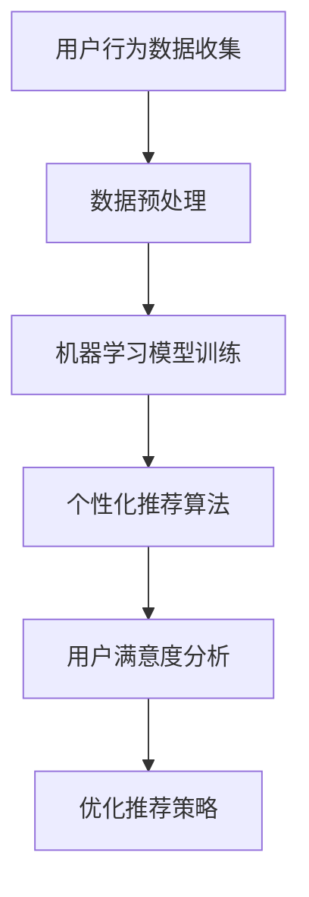

                 

# 如何通过AI提升用户购物粘性

> 关键词：人工智能、用户粘性、购物体验、个性化推荐、数据分析、机器学习算法

> 摘要：本文将探讨如何利用人工智能技术提升用户购物粘性。通过深入分析用户行为数据，运用个性化推荐算法和智能分析技术，实现精准营销和用户满意度提升，从而增强用户对电商平台的忠诚度。

## 1. 背景介绍

在互联网时代，电子商务已成为人们日常生活中不可或缺的一部分。随着消费者需求的多样化，电商平台之间的竞争愈发激烈。如何提升用户购物粘性，增加用户复购率，成为各大电商平台亟待解决的问题。人工智能技术的发展，为解决这一难题提供了新的思路和工具。

用户粘性是指用户对某一平台的忠诚度和活跃度。提升用户粘性意味着增加用户在平台上的停留时间，提高用户对平台的满意度和忠诚度。人工智能通过大数据分析和机器学习算法，可以深度挖掘用户行为数据，为用户提供个性化推荐和服务，从而提升用户购物体验和满意度，增强用户粘性。

## 2. 核心概念与联系

### 2.1 个性化推荐算法

个性化推荐算法是基于用户历史行为和兴趣，为用户推荐相关商品的一种技术。常见的推荐算法有基于内容的推荐、协同过滤推荐和混合推荐等。

**基于内容的推荐：**根据用户过去喜欢的商品特征，推荐具有相似特征的商品。

**协同过滤推荐：**通过分析用户之间的相似性，为用户推荐其他用户喜欢的商品。

**混合推荐：**结合多种推荐算法，提高推荐效果。

### 2.2 机器学习算法

机器学习算法是人工智能的核心技术之一。通过训练模型，从大量数据中自动发现规律和模式，实现对未知数据的预测和分类。常见的机器学习算法有决策树、支持向量机、神经网络等。

### 2.3 数据分析

数据分析是通过对海量数据进行挖掘和分析，发现数据背后的规律和趋势，为决策提供支持。数据分析技术在用户行为分析、需求预测、风险控制等方面具有广泛应用。

### Mermaid 流程图



## 3. 核心算法原理 & 具体操作步骤

### 3.1 数据收集与预处理

首先，从电商平台获取用户行为数据，如浏览记录、购买记录、搜索关键词等。然后，对数据进行清洗、去重和去噪等预处理操作，确保数据质量。

### 3.2 机器学习模型训练

选择合适的机器学习算法，如决策树、神经网络等，对预处理后的数据集进行训练。训练过程中，通过调整模型参数，优化模型性能。

### 3.3 个性化推荐算法

基于训练好的模型，为每个用户生成个性化推荐列表。推荐算法可以根据用户历史行为、兴趣偏好、购物车信息等多维度数据进行推荐。

### 3.4 用户满意度分析

通过收集用户反馈数据，如评价、评分等，分析用户对推荐的满意度。根据用户满意度，调整推荐策略，提高推荐效果。

### 3.5 优化推荐策略

根据用户反馈和满意度数据，不断优化推荐算法和策略，提高用户购物体验和满意度。

## 4. 数学模型和公式 & 详细讲解 & 举例说明

### 4.1 协同过滤推荐算法

协同过滤推荐算法的核心是计算用户之间的相似度。假设用户集为U，商品集为I，用户-商品评分矩阵为R。

**用户相似度计算：**

$$
sim(u_i, u_j) = \frac{R_{ui} \cdot R_{uj}}{\sqrt{\sum_{v \in U} R_{vi}^2} \cdot \sqrt{\sum_{v \in U} R_{vj}^2}}
$$

**商品相似度计算：**

$$
sim(i_j, i_k) = \frac{\sum_{u \in U} R_{uj} \cdot R_{uk}}{\sqrt{\sum_{v \in U} R_{vi}^2} \cdot \sqrt{\sum_{v \in U} R_{vk}^2}}
$$

**用户-商品推荐评分预测：**

$$
\hat{R}_{ui} = \sum_{j \in N_i} sim(u_i, u_j) \cdot R_{uj}
$$

其中，$N_i$ 表示与用户 $u_i$ 相似的一组用户集合。

### 4.2 基于内容的推荐算法

基于内容的推荐算法主要通过分析商品的内容特征，为用户推荐相似的商品。假设商品特征向量表示为 $C_i$，用户兴趣特征向量表示为 $U_i$。

**商品相似度计算：**

$$
sim_c(i_j, i_k) = \frac{C_{i_j} \cdot C_{i_k}}{\|C_{i_j}\| \cdot \|C_{i_k}\|}
$$

**用户-商品推荐评分预测：**

$$
\hat{R}_{ui} = \sum_{j \in N_i} sim_c(i_j, i_k) \cdot R_{uj}
$$

其中，$N_i$ 表示与用户 $u_i$ 相似的一组商品集合。

### 4.3 混合推荐算法

混合推荐算法结合协同过滤推荐和基于内容的推荐，提高推荐效果。假设协同过滤推荐得到的评分预测为 $\hat{R}_{ui}^c$，基于内容的推荐得到的评分预测为 $\hat{R}_{ui}^c$。

**混合推荐评分预测：**

$$
\hat{R}_{ui} = \alpha \cdot \hat{R}_{ui}^c + (1 - \alpha) \cdot \hat{R}_{ui}^c
$$

其中，$\alpha$ 为权重系数。

## 5. 项目实战：代码实际案例和详细解释说明

### 5.1 开发环境搭建

本案例使用 Python 语言和 scikit-learn 库实现。首先，安装 Python 和 scikit-learn：

```bash
pip install python
pip install scikit-learn
```

### 5.2 源代码详细实现和代码解读

以下是一个简单的协同过滤推荐算法实现：

```python
import numpy as np
from sklearn.metrics.pairwise import cosine_similarity

# 用户-商品评分矩阵
R = np.array([[5, 3, 0, 1],
              [4, 0, 0, 1],
              [1, 5, 0, 0],
              [5, 1, 0, 1]])

# 计算用户相似度
sim = cosine_similarity(R)

# 为用户推荐商品
def recommend(R, user_id, k=5):
    # 计算与目标用户的相似度
    user_similarity = sim[user_id]

    # 获取相似用户及其评分
    similar_users = np.argsort(user_similarity)[::-1]
    similar_users = similar_users[1:k+1]

    # 计算预测评分
    pred_scores = R[similar_users].mean(axis=0)

    # 排序并返回推荐商品
    return np.argsort(pred_scores)[::-1]

# 测试
user_id = 0
recommendations = recommend(R, user_id)
print("推荐商品：", recommendations)
```

代码解读：

1. 导入必要的库。
2. 定义用户-商品评分矩阵 R。
3. 使用余弦相似度计算用户相似度。
4. 定义推荐函数，计算与目标用户的相似度，获取相似用户及其评分，计算预测评分，排序并返回推荐商品。

### 5.3 代码解读与分析

1. **数据预处理：**使用 numpy 库创建用户-商品评分矩阵 R。
2. **相似度计算：**使用 scikit-learn 库中的 cosine_similarity 函数计算用户相似度。
3. **推荐函数：**定义推荐函数，计算与目标用户的相似度，获取相似用户及其评分，计算预测评分，排序并返回推荐商品。

## 6. 实际应用场景

### 6.1 电商平台

电商平台可以利用个性化推荐算法，为用户推荐相关商品，提高用户购物体验和满意度，从而提升用户粘性。

### 6.2 新零售

新零售企业可以通过用户行为数据，实现精准营销，提高用户转化率和复购率。

### 6.3 社交电商

社交电商可以通过分析用户社交行为，为用户提供个性化推荐，提高用户活跃度和留存率。

## 7. 工具和资源推荐

### 7.1 学习资源推荐

- **《机器学习》（周志华著）**
- **《深度学习》（Goodfellow、Bengio、Courville 著）**
- **《Python数据分析》（Wes McKinney 著）**

### 7.2 开发工具框架推荐

- **Scikit-learn**
- **TensorFlow**
- **PyTorch**

### 7.3 相关论文著作推荐

- **"Recommender Systems Handbook"（F. Crestani 著）**
- **"Deep Learning for Recommender Systems"（H. Yang 著）**

## 8. 总结：未来发展趋势与挑战

### 8.1 发展趋势

1. **人工智能技术进一步融合：**人工智能技术将更加深入地应用于电商平台，实现更精准的推荐和更智能的服务。
2. **数据隐私保护：**随着数据隐私保护意识的提高，如何平衡数据利用和隐私保护将成为重要课题。
3. **跨平台协作：**电商平台将加强与其他平台的合作，实现数据共享和协同推荐。

### 8.2 挑战

1. **数据质量：**高质量的数据是人工智能算法的基础，如何保证数据质量成为挑战。
2. **计算资源：**大规模的推荐系统需要强大的计算资源支持，如何高效利用计算资源成为难题。
3. **用户体验：**如何提高用户体验，避免过度推荐和推荐质量下降，是持续需要关注的问题。

## 9. 附录：常见问题与解答

### 9.1 什么是个性化推荐算法？

个性化推荐算法是一种基于用户兴趣和行为的推荐技术，通过分析用户的历史数据和兴趣标签，为用户推荐相关商品或内容。

### 9.2 机器学习算法在推荐系统中有哪些应用？

机器学习算法在推荐系统中主要应用于预测用户偏好、发现潜在关联和优化推荐策略等方面。

### 9.3 如何评估推荐系统的性能？

评估推荐系统性能的指标包括准确率、召回率、F1 值、点击率、转化率等。

## 10. 扩展阅读 & 参考资料

- **"Recommender Systems: The Textbook"（H. Chen 著）**
- **"Deep Learning for Web Search and Natural Language Processing"（J. Langford 著）**
- **"A Brief Introduction to Neural Networks"（I. Goodfellow 著）**

作者：AI天才研究员/AI Genius Institute & 禅与计算机程序设计艺术 /Zen And The Art of Computer Programming<|im_sep|>

