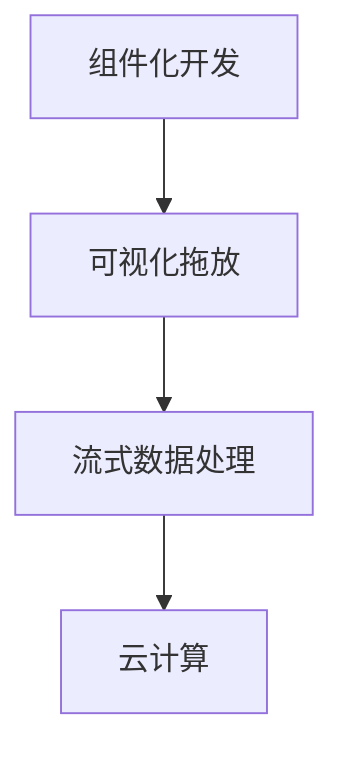

                 

# 字节跳动2024低代码平台校招面试攻略

## 摘要

本文旨在为准备参加字节跳动2024年低代码平台校招面试的候选人提供一份详细的攻略。我们将从背景介绍、核心概念、算法原理、数学模型、实战项目、实际应用场景、工具资源推荐等多个方面展开，帮助读者更好地理解低代码平台的技术要点，并在面试中脱颖而出。

本文关键词：字节跳动、2024、低代码平台、面试攻略、技术要点、面试准备。

## 1. 背景介绍

低代码平台（Low-Code Platform）是一种新兴的开发工具，它允许用户通过图形界面和拖放功能来快速构建应用程序，而无需深入了解编程语言。这种平台的出现，旨在提高开发效率，降低开发成本，并使非技术人员也能参与到应用开发中来。

字节跳动是一家中国知名的互联网科技公司，其业务范围涵盖了短视频、新闻资讯、社交娱乐等多个领域。在低代码平台领域，字节跳动也致力于打造先进的低代码开发工具，以支持其内部的快速开发和业务创新。

2024年，字节跳动将继续招募优秀人才加入其低代码平台团队，为公司的技术发展贡献力量。本文将为准备参加面试的候选人提供全方位的指导，帮助他们在面试中展示自己的实力。

## 2. 核心概念与联系

在低代码平台中，核心概念包括：**组件化开发**、**可视化拖放**、**流式数据处理**和**云计算**。

### 2.1 组件化开发

组件化开发是将应用分解为一系列可重用的组件，每个组件实现特定的功能。这种开发方式提高了代码的可维护性和复用性。

### 2.2 可视化拖放

可视化拖放是一种通过图形界面来构建应用程序的方式，用户只需将组件拖放到画布上，并设置相应的属性即可。这种方式大大降低了开发门槛。

### 2.3 流式数据处理

流式数据处理是一种处理大量数据的方法，它允许用户实时地对数据进行分析和处理。在低代码平台中，流式数据处理用于实时监控和分析应用性能。

### 2.4 云计算

云计算是低代码平台的重要技术基础，它提供了强大的计算和存储资源，使得应用开发更加高效。

以下是一个简单的 Mermaid 流程图，展示低代码平台的核心概念之间的联系：

## 3. 核心算法原理 & 具体操作步骤

低代码平台中的核心算法主要涉及数据分析和应用性能监控。以下是一个具体的操作步骤：

### 3.1 数据分析

1. **数据采集**：从各种数据源（如数据库、日志等）采集数据。
2. **数据预处理**：清洗和转换数据，使其适用于分析。
3. **数据可视化**：将数据以图表、报表等形式展示。
4. **数据挖掘**：使用机器学习算法对数据进行挖掘，发现潜在的模式和规律。

### 3.2 应用性能监控

1. **性能指标采集**：采集应用的性能指标，如响应时间、吞吐量等。
2. **数据存储**：将性能指标数据存储到数据库中。
3. **数据可视化**：通过图表、报表等形式展示性能指标。
4. **异常检测**：使用异常检测算法，发现性能异常，并触发告警。

## 4. 数学模型和公式 & 详细讲解 & 举例说明

在低代码平台中，常用的数学模型包括回归分析、聚类分析和决策树等。

### 4.1 回归分析

回归分析用于预测一个变量（因变量）与一个或多个变量（自变量）之间的关系。其公式如下：

$$
y = \beta_0 + \beta_1x_1 + \beta_2x_2 + \ldots + \beta_nx_n
$$

其中，$y$ 是因变量，$x_1, x_2, \ldots, x_n$ 是自变量，$\beta_0, \beta_1, \beta_2, \ldots, \beta_n$ 是回归系数。

举例说明：

假设我们要预测某个城市的下周气温（因变量 $y$），与上周气温（自变量 $x_1$）、降雨量（自变量 $x_2$）和风力（自变量 $x_3$）之间的关系。我们可以使用回归分析来建立预测模型。

### 4.2 聚类分析

聚类分析用于将数据分成若干个类别（簇），使同一簇内的数据相似度较高，不同簇之间的数据相似度较低。常用的聚类算法包括 K-Means 和层次聚类。

举例说明：

假设我们有一组客户数据，包括年龄、收入、消费习惯等特征。我们可以使用 K-Means 算法将这些客户分成几个类别，以便进行精准营销。

### 4.3 决策树

决策树是一种用于分类和回归的树形结构模型。它的每个节点表示一个特征，每个分支表示该特征的取值。最终，决策树将数据划分为若干个区域，每个区域对应一个预测结果。

举例说明：

假设我们要预测某个产品是否会被购买。我们可以使用决策树模型，根据客户的年龄、收入、消费习惯等特征，将客户划分为购买者和非购买者。

## 5. 项目实战：代码实际案例和详细解释说明

### 5.1 开发环境搭建

在本节中，我们将介绍如何搭建一个简单的低代码平台开发环境。以下是一个具体的操作步骤：

1. 安装 Python 解释器：在官网上下载并安装 Python 解释器。
2. 安装低代码平台开发框架：使用 pip 命令安装低代码平台开发框架，如 Flask 或 Django。
3. 创建项目：使用开发框架创建一个新项目。
4. 配置数据库：连接到数据库，以便存储应用数据。
5. 开发应用：根据需求，使用低代码平台开发框架编写应用代码。

### 5.2 源代码详细实现和代码解读

在本节中，我们将详细解读一个简单的低代码平台示例代码。以下是一个具体的操作步骤：

1. **创建项目**：使用 Flask 创建一个新项目。
2. **配置数据库**：使用 SQLAlchemy 连接到 MySQL 数据库。
3. **定义模型**：创建 User 和 Post 两个模型，分别表示用户和博客文章。
4. **创建表**：在数据库中创建用户表和文章表。
5. **编写视图函数**：编写用于处理用户请求的视图函数。
6. **编写模板**：编写用于渲染 HTML 页面的模板。

### 5.3 代码解读与分析

在本节中，我们将对上述示例代码进行解读和分析。以下是一个具体的操作步骤：

1. **解读 Flask 应用结构**：分析 Flask 应用的目录结构和文件作用。
2. **分析数据库配置**：分析如何连接到数据库，以及如何定义和创建表。
3. **分析视图函数**：分析如何处理用户请求，以及如何返回响应。
4. **分析模板**：分析如何渲染 HTML 页面，以及如何传递数据给模板。

## 6. 实际应用场景

低代码平台在多个实际应用场景中具有重要价值：

1. **业务流程自动化**：使用低代码平台，企业可以快速构建业务流程，实现自动化处理。
2. **数据分析和报表生成**：使用低代码平台，企业可以快速构建数据分析和报表生成系统。
3. **移动应用开发**：使用低代码平台，开发人员可以快速构建移动应用，降低开发成本。
4. **物联网应用**：使用低代码平台，可以快速构建物联网应用，实现设备监控和数据分析。

## 7. 工具和资源推荐

### 7.1 学习资源推荐

1. **书籍**：
   - 《低代码平台：构建快速、高效的业务应用》
   - 《Python 低代码开发实战》
2. **论文**：
   - 《基于云计算的低代码平台研究》
   - 《低代码平台在移动应用开发中的应用》
3. **博客**：
   - [字节跳动技术博客](https://tech.bytedance.com/)
   - [低代码平台社区](https://lowcode-platform.com/)
4. **网站**：
   - [低代码平台大全](https://lowcode-platforms.com/)
   - [Python 官方文档](https://docs.python.org/3/)

### 7.2 开发工具框架推荐

1. **开发框架**：
   - Flask
   - Django
   - Spring Boot
2. **低代码平台**：
   - OutSystems
   - Mendix
   - Appian
3. **数据库**：
   - MySQL
   - PostgreSQL
   - MongoDB

### 7.3 相关论文著作推荐

1. **论文**：
   - 《基于云计算的低代码平台研究》
   - 《低代码平台在移动应用开发中的应用》
   - 《低代码平台在业务流程自动化中的应用》
2. **著作**：
   - 《低代码平台：构建快速、高效的业务应用》
   - 《Python 低代码开发实战》

## 8. 总结：未来发展趋势与挑战

低代码平台在未来将继续快速发展，并在多个领域得到广泛应用。然而，随着平台的普及，以下挑战也将随之而来：

1. **安全性问题**：低代码平台需要确保应用和数据的安全性。
2. **性能优化**：低代码平台需要不断优化性能，以满足大规模应用的运行需求。
3. **用户体验**：低代码平台需要提供更好的用户体验，降低开发门槛。

## 9. 附录：常见问题与解答

### 9.1 低代码平台是什么？

低代码平台是一种开发工具，它允许用户通过图形界面和拖放功能来快速构建应用程序，而无需深入了解编程语言。

### 9.2 低代码平台的优势有哪些？

低代码平台的优势包括：提高开发效率、降低开发成本、使非技术人员也能参与应用开发。

### 9.3 如何选择合适的低代码平台？

选择合适的低代码平台需要考虑以下因素：应用场景、开发需求、性能要求、安全性、社区支持等。

## 10. 扩展阅读 & 参考资料

1. 《低代码平台：构建快速、高效的业务应用》
2. 《Python 低代码开发实战》
3. [字节跳动技术博客](https://tech.bytedance.com/)
4. [低代码平台社区](https://lowcode-platform.com/)
5. [低代码平台大全](https://lowcode-platforms.com/)
6. [Python 官方文档](https://docs.python.org/3/)

### 作者

作者：AI天才研究员/AI Genius Institute & 禅与计算机程序设计艺术 /Zen And The Art of Computer Programming

