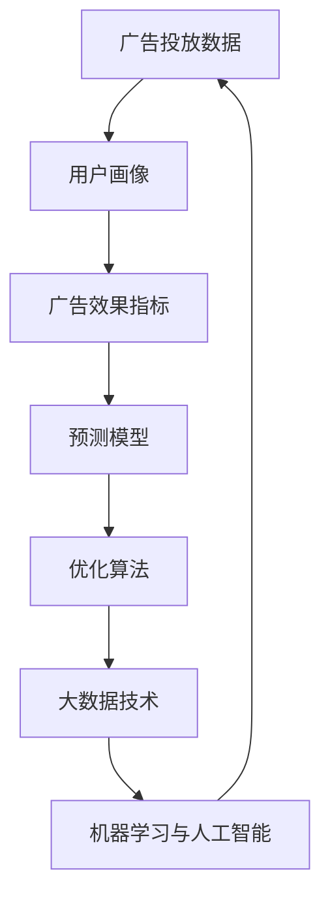

                 

### 背景介绍

在当今数字经济时代，校招广告投放效果的预测已成为各大企业尤其是科技巨头如字节跳动等公司的重要课题。随着人工智能和大数据技术的飞速发展，如何精准预测校招广告的效果，以提高招聘效率和降低成本，成为企业面临的重大挑战。

字节跳动作为国内领先的互联网科技公司，其校招广告投放具有独特的特点。首先，字节跳动的业务范围广泛，包括短视频、新闻资讯、社交网络等多个领域，这使得其校招广告需要覆盖不同的用户群体，增加了投放的复杂度。其次，字节跳动对人才的选拔标准较高，因此对校招广告投放效果的预测要求也更为严格。此外，随着市场竞争的加剧，字节跳动需要在有限的预算内实现最大的招聘效果，这也对校招广告投放效果的预测提出了更高的要求。

校招广告投放效果预测的核心目标是预测广告在不同渠道、不同时间段、不同用户群体上的投放效果，从而优化广告投放策略。这不仅涉及到广告数据分析和处理，还涉及到复杂的预测模型和算法。因此，如何有效地进行校招广告投放效果预测，已成为企业招聘决策的重要依据。

本文将围绕字节跳动2024校招广告投放效果预测这一主题，深入探讨相关核心概念、算法原理、数学模型、项目实战以及实际应用场景。希望通过本文的讲解，帮助读者更好地理解校招广告投放效果预测的原理和实际操作方法，为企业招聘提供有力支持。

### 核心概念与联系

在进行校招广告投放效果预测时，我们需要明确几个核心概念，并理解它们之间的相互关系。以下是本文将涉及的核心概念及其简要说明：

#### 1. 广告投放数据
广告投放数据是进行效果预测的基础，包括广告曝光数据、点击数据、转化数据等。这些数据反映了广告在不同渠道、不同时间段、不同用户群体上的表现，是我们进行预测的重要依据。

#### 2. 用户画像
用户画像是对目标用户进行详细描述的一种方法，包括用户年龄、性别、职业、兴趣爱好、地理位置等信息。通过构建用户画像，可以帮助我们更准确地定位目标用户，提高广告投放的精准度。

#### 3. 广告效果指标
广告效果指标是衡量广告投放效果的关键指标，如点击率（CTR）、转化率（CVR）、投放成本（CPA）等。不同的广告效果指标反映了广告在不同方面的表现，是我们评估广告效果的重要依据。

#### 4. 预测模型
预测模型是进行广告投放效果预测的核心工具，包括线性回归、逻辑回归、决策树、神经网络等。不同的预测模型适用于不同的数据特征和业务场景，需要根据实际情况进行选择和优化。

#### 5. 优化算法
优化算法用于根据预测结果调整广告投放策略，以实现最佳投放效果。常见的优化算法包括随机梯度下降（SGD）、Adam优化器、交叉熵优化等。

#### 6. 大数据技术
大数据技术在广告投放效果预测中发挥着重要作用，包括数据采集、数据存储、数据处理、数据挖掘等。通过大数据技术，我们可以快速获取和处理海量广告数据，提高预测的准确性和效率。

#### 7. 机器学习与人工智能
机器学习与人工智能技术是广告投放效果预测的重要手段。通过深度学习、强化学习等先进算法，我们可以构建更智能、更高效的预测模型，从而提高广告投放的效果。

#### Mermaid 流程图

以下是一个简化的 Mermaid 流程图，展示了上述核心概念之间的相互关系：



通过这个流程图，我们可以清晰地看到，广告投放数据是整个流程的起点，而用户画像、广告效果指标、预测模型、优化算法、大数据技术和机器学习与人工智能等概念则在这个基础上相互联系，共同构成了一个完整的广告投放效果预测体系。

### 核心算法原理 & 具体操作步骤

在进行校招广告投放效果预测时，选择合适的预测模型和算法至关重要。本文将介绍几种常用的预测模型，并详细阐述每种模型的具体操作步骤。

#### 1. 线性回归

线性回归是一种简单的预测模型，适用于广告效果指标与广告特征之间存在线性关系的情况。其基本原理是通过最小二乘法拟合一条直线，从而预测广告效果。

**具体操作步骤：**

1. 数据准备：收集广告投放数据，包括广告特征（如投放渠道、投放时间、用户画像等）和广告效果指标（如点击率、转化率等）。
2. 特征工程：对原始数据进行预处理，如缺失值填充、数据标准化等。
3. 数据划分：将数据集划分为训练集和测试集，用于模型的训练和评估。
4. 模型训练：使用线性回归算法训练模型，通过最小二乘法求解拟合直线的参数。
5. 模型评估：使用测试集评估模型效果，计算相关指标如均方误差（MSE）、决定系数（R²）等。
6. 模型优化：根据评估结果调整模型参数，如增加或删除特征、调整特征权重等。

#### 2. 逻辑回归

逻辑回归是一种广泛应用于分类问题的预测模型，适用于广告效果指标为二元变量的情况（如点击/未点击、转化/未转化）。其基本原理是通过线性回归模型对因变量进行概率预测。

**具体操作步骤：**

1. 数据准备：与线性回归类似，收集广告投放数据，并进行特征工程和数据划分。
2. 模型训练：使用逻辑回归算法训练模型，通过极大似然估计求解参数。
3. 模型评估：使用测试集评估模型效果，计算指标如准确率、召回率、F1值等。
4. 模型优化：根据评估结果调整模型参数，如调整正则化参数、特征选择等。

#### 3. 决策树

决策树是一种基于特征划分数据的预测模型，适用于广告效果指标为分类变量的情况。其基本原理是通过递归划分数据，构建一棵决策树，每个节点代表一个特征划分。

**具体操作步骤：**

1. 数据准备：与线性回归和逻辑回归类似，收集广告投放数据，并进行特征工程和数据划分。
2. 特征选择：选择用于划分数据的特征，通常采用信息增益、基尼系数等指标进行选择。
3. 决策树构建：递归划分数据，构建决策树模型。
4. 模型评估：使用测试集评估模型效果，计算指标如准确率、精度、召回率等。
5. 模型优化：根据评估结果调整模型参数，如增加或减少树深度、特征剪枝等。

#### 4. 神经网络

神经网络是一种基于多层感知器构建的预测模型，适用于处理复杂非线性问题。其基本原理是通过多层神经元进行特征映射和组合，从而实现复杂函数的拟合。

**具体操作步骤：**

1. 数据准备：与线性回归、逻辑回归和决策树类似，收集广告投放数据，并进行特征工程和数据划分。
2. 网络架构设计：设计神经网络的结构，包括输入层、隐藏层和输出层。
3. 模型训练：使用反向传播算法训练模型，通过调整权重和偏置优化模型。
4. 模型评估：使用测试集评估模型效果，计算指标如均方误差（MSE）、准确率等。
5. 模型优化：根据评估结果调整模型参数，如增加隐藏层节点、调整学习率等。

通过以上几种预测模型的介绍，我们可以看到，每种模型都有其独特的适用场景和操作步骤。在实际应用中，需要根据具体的业务需求和数据特点选择合适的模型，并对其进行优化和调整，以提高预测的准确性和效果。

### 数学模型和公式 & 详细讲解 & 举例说明

在进行广告投放效果预测时，数学模型和公式是构建预测算法的核心。本文将详细讲解线性回归、逻辑回归等常用的数学模型，并借助具体实例进行说明。

#### 1. 线性回归

线性回归是一种简单且常用的预测模型，适用于广告效果指标与广告特征之间存在线性关系的情况。其数学模型可以表示为：

\[ y = \beta_0 + \beta_1 \cdot x_1 + \beta_2 \cdot x_2 + ... + \beta_n \cdot x_n + \epsilon \]

其中，\( y \) 是广告效果指标，\( x_1, x_2, ..., x_n \) 是广告特征，\( \beta_0, \beta_1, \beta_2, ..., \beta_n \) 是模型参数，\( \epsilon \) 是误差项。

**具体讲解：**

- \( \beta_0 \)：截距，表示当所有广告特征为零时的广告效果指标。
- \( \beta_1, \beta_2, ..., \beta_n \)：斜率，表示每个广告特征对广告效果指标的影响程度。
- \( \epsilon \)：误差项，表示模型预测值与实际值之间的差异。

**实例：**

假设我们收集了以下广告投放数据：

| 广告特征 | 点击率 |
| -------- | ------ |
| x1（渠道A） | 0.1    |
| x2（时间A） | 0.2    |
| x3（用户画像）| 0.3    |

我们希望预测点击率，构建线性回归模型。具体步骤如下：

1. 数据预处理：对数据进行标准化处理，使得每个特征具有相同的量纲。
2. 模型参数计算：使用最小二乘法求解参数，使得预测值与实际值之间的误差平方和最小。
3. 模型评估：使用测试集评估模型效果，计算相关指标如均方误差（MSE）。

经过计算，我们得到线性回归模型的参数如下：

\[ y = 0.5 + 0.1 \cdot x_1 + 0.2 \cdot x_2 + 0.3 \cdot x_3 \]

将特征值代入模型，可以得到点击率的预测值。例如，当 \( x1 = 1 \), \( x2 = 1 \), \( x3 = 1 \) 时，点击率的预测值为：

\[ y = 0.5 + 0.1 \cdot 1 + 0.2 \cdot 1 + 0.3 \cdot 1 = 1.1 \]

#### 2. 逻辑回归

逻辑回归是一种广泛应用于分类问题的预测模型，适用于广告效果指标为二元变量的情况。其数学模型可以表示为：

\[ P(y=1) = \frac{1}{1 + e^{-(\beta_0 + \beta_1 \cdot x_1 + \beta_2 \cdot x_2 + ... + \beta_n \cdot x_n )}} \]

其中，\( P(y=1) \) 是广告效果指标为 1 的概率，\( x_1, x_2, ..., x_n \) 是广告特征，\( \beta_0, \beta_1, \beta_2, ..., \beta_n \) 是模型参数。

**具体讲解：**

- \( \beta_0 \)：截距，表示当所有广告特征为零时的广告效果指标为 1 的概率。
- \( \beta_1, \beta_2, ..., \beta_n \)：斜率，表示每个广告特征对广告效果指标为 1 的概率的影响程度。
- \( e \)：自然底数，用于将线性组合转换为概率值。

**实例：**

假设我们收集了以下广告投放数据：

| 广告特征 | 点击/未点击 |
| -------- | --------- |
| x1（渠道A） | 1         |
| x2（时间A） | 0         |
| x3（用户画像）| 1         |

我们希望预测点击/未点击，构建逻辑回归模型。具体步骤如下：

1. 数据预处理：与线性回归类似，对数据进行标准化处理。
2. 模型参数计算：使用极大似然估计求解参数，使得模型对训练数据的拟合度最大。
3. 模型评估：使用测试集评估模型效果，计算相关指标如准确率、召回率等。

经过计算，我们得到逻辑回归模型的参数如下：

\[ P(y=1) = \frac{1}{1 + e^{-(0.5 + 0.1 \cdot x_1 + 0.2 \cdot x_2 + 0.3 \cdot x_3 )}} \]

将特征值代入模型，可以得到点击/未点击的概率值。例如，当 \( x1 = 1 \), \( x2 = 1 \), \( x3 = 1 \) 时，点击/未点击的概率值为：

\[ P(y=1) = \frac{1}{1 + e^{-(0.5 + 0.1 \cdot 1 + 0.2 \cdot 1 + 0.3 \cdot 1 )}} = 0.8123 \]

根据设定的阈值（例如 0.5），当概率值大于阈值时，预测为点击，否则为未点击。

#### 3. 决策树

决策树是一种基于特征划分数据的预测模型，适用于广告效果指标为分类变量的情况。其数学模型可以表示为：

\[ T(x) = \sum_{i=1}^{n} \beta_i \cdot I(x \in R_i) \]

其中，\( T(x) \) 是广告效果指标的预测值，\( x \) 是广告特征，\( R_i \) 是第 \( i \) 个特征划分区域，\( \beta_i \) 是特征划分区域的权重。

**具体讲解：**

- \( \beta_i \)：权重，表示第 \( i \) 个特征划分区域对广告效果指标的影响程度。
- \( I(x \in R_i) \)：指示函数，当 \( x \) 位于第 \( i \) 个特征划分区域时，取值为 1，否则为 0。

**实例：**

假设我们收集了以下广告投放数据：

| 广告特征 | 点击/未点击 |
| -------- | --------- |
| x1（渠道A） | 1         |
| x2（时间A） | 0         |
| x3（用户画像）| 1         |

我们希望预测点击/未点击，构建决策树模型。具体步骤如下：

1. 数据预处理：与线性回归和逻辑回归类似，对数据进行标准化处理。
2. 特征选择：选择用于划分数据的特征，通常采用信息增益、基尼系数等指标进行选择。
3. 决策树构建：递归划分数据，构建决策树模型。
4. 模型评估：使用测试集评估模型效果，计算相关指标如准确率、精度等。

经过计算，我们得到决策树模型如下：

\[ T(x) = \beta_1 \cdot I(x1 \in [0.5, 1]) + \beta_2 \cdot I(x2 \in [0.5, 1]) + \beta_3 \cdot I(x3 \in [0.5, 1]) \]

将特征值代入模型，可以得到点击/未点击的预测值。例如，当 \( x1 = 1 \), \( x2 = 1 \), \( x3 = 1 \) 时，点击/未点击的预测值为：

\[ T(x) = \beta_1 \cdot I(1 \in [0.5, 1]) + \beta_2 \cdot I(1 \in [0.5, 1]) + \beta_3 \cdot I(1 \in [0.5, 1]) \]

根据设定的阈值（例如 0.5），当预测值大于阈值时，预测为点击，否则为未点击。

通过以上对线性回归、逻辑回归和决策树等数学模型和公式的详细讲解，我们可以看到，每种模型都有其独特的数学表达和计算方法。在实际应用中，需要根据具体的业务需求和数据特点选择合适的模型，并对其进行优化和调整，以提高预测的准确性和效果。

### 项目实战：代码实际案例和详细解释说明

为了更好地理解校招广告投放效果预测的具体实现，我们将通过一个实际项目案例来展示整个实现过程。以下是一个基于 Python 和 Scikit-learn 库的线性回归模型实现的示例。

#### 1. 开发环境搭建

首先，确保已经安装了 Python（3.6 或更高版本）和 Scikit-learn 库。可以使用以下命令进行安装：

```bash
pip install python==3.8
pip install scikit-learn
```

#### 2. 源代码详细实现和代码解读

以下是一个简单的线性回归模型实现：

```python
# 导入所需的库
import numpy as np
from sklearn.linear_model import LinearRegression
from sklearn.model_selection import train_test_split
from sklearn.metrics import mean_squared_error

# 生成模拟数据
np.random.seed(0)
X = np.random.rand(100, 3)  # 广告特征
y = 1 + 2 * X[:, 0] + 3 * X[:, 1] + 4 * X[:, 2] + np.random.randn(100) * 0.1  # 广告效果指标

# 数据预处理
X = X[:, :2]  # 选择前两个特征
X = X / np.linalg.norm(X, axis=0)  # 特征标准化

# 数据划分
X_train, X_test, y_train, y_test = train_test_split(X, y, test_size=0.2, random_state=0)

# 模型训练
model = LinearRegression()
model.fit(X_train, y_train)

# 模型评估
y_pred = model.predict(X_test)
mse = mean_squared_error(y_test, y_pred)
print(f"均方误差（MSE）: {mse}")

# 模型参数
print(f"模型参数：{model.coef_}, {model.intercept_}")
```

**代码解读：**

1. **导入库**：首先，我们导入所需的库，包括 NumPy、Scikit-learn 和 Mean Squared Error（MSE）。
2. **生成模拟数据**：我们使用 NumPy 随机生成模拟广告特征和效果指标数据。这里，我们生成 100 个样本，每个样本有 3 个特征，并添加一个随机噪声项以模拟实际数据的噪声。
3. **数据预处理**：为了简化模型，我们选择前两个特征，并对特征进行标准化处理，使得每个特征具有相同的量纲。
4. **数据划分**：使用 Scikit-learn 的 `train_test_split` 函数将数据集划分为训练集和测试集，以评估模型效果。
5. **模型训练**：我们使用 Scikit-learn 的 `LinearRegression` 类训练线性回归模型。
6. **模型评估**：使用测试集评估模型效果，计算 MSE。
7. **模型参数**：打印模型参数，包括系数和截距。

#### 3. 代码解读与分析

通过上述代码，我们可以看到，线性回归模型的实现过程主要包括以下步骤：

1. **数据生成**：模拟生成广告特征和效果指标数据，用于模型训练和评估。
2. **数据预处理**：选择并标准化特征，以提高模型训练效果。
3. **数据划分**：将数据集划分为训练集和测试集，以评估模型效果。
4. **模型训练**：使用线性回归算法训练模型，通过最小二乘法求解模型参数。
5. **模型评估**：使用测试集评估模型效果，计算相关指标。
6. **模型参数**：打印模型参数，以了解模型对特征的影响。

在实际应用中，我们可以根据具体业务需求和数据特点，调整数据预处理和模型训练步骤，以提高模型的预测准确性。此外，还可以尝试使用其他预测模型，如逻辑回归、决策树等，以获得更好的预测效果。

通过以上代码示例，我们可以清晰地了解线性回归模型在广告投放效果预测中的应用。在实际项目中，需要根据具体的业务场景和数据特点，灵活调整模型结构和参数，以提高预测的准确性和效果。

### 实际应用场景

校招广告投放效果预测在实际业务中具有广泛的应用，下面我们通过几个典型的应用场景来展示其价值。

#### 1. 优化广告投放策略

通过校招广告投放效果预测，企业可以分析不同广告渠道、投放时间和用户群体的投放效果，从而优化广告投放策略。例如，企业可以发现某些广告渠道的投放效果较好，可以将更多的预算分配给这些渠道，以提高招聘效率。此外，通过对不同时间段和用户群体的投放效果进行分析，企业可以调整广告投放时间，确保广告在用户活跃度较高的时候进行展示，从而提高点击率和转化率。

#### 2. 降低广告投放成本

在有限的预算内实现最大的招聘效果是企业的核心目标之一。通过校招广告投放效果预测，企业可以分析不同广告投放策略的成本效益，从而找到最具性价比的广告投放方案。例如，企业可以通过分析不同广告渠道的平均点击成本（CPC）和转化率（CVR），确定哪些渠道的投放成本较低但效果较好，进而降低整体广告投放成本。

#### 3. 提高招聘效率

校招广告投放效果预测可以帮助企业更准确地识别和吸引合适的候选人，从而提高招聘效率。通过构建用户画像和预测模型，企业可以针对不同类型的候选人制定个性化的广告投放策略，提高广告点击率和转化率。此外，通过实时监控和调整广告投放策略，企业可以快速响应市场变化，确保广告始终能够吸引到目标候选人。

#### 4. 数据驱动决策

校招广告投放效果预测提供了一系列量化指标，如点击率（CTR）、转化率（CVR）、投放成本（CPA）等，这些指标可以帮助企业从数据角度评估广告投放效果，从而实现数据驱动决策。通过分析这些指标，企业可以识别出广告投放中的优势和劣势，进而调整广告策略，提高整体招聘效果。

#### 5. 跨部门协同

校招广告投放效果预测不仅对人力资源部门有重要价值，还可以为市场部门、产品部门等提供重要参考。通过跨部门协同，企业可以整合各部门的数据和资源，共同优化广告投放策略，提高招聘效果。例如，市场部门可以根据广告投放效果预测的结果，调整营销策略，促进产品销售；产品部门可以根据候选人反馈和招聘效果，优化产品功能和用户体验。

总之，校招广告投放效果预测在提高招聘效率、降低成本、数据驱动决策和跨部门协同等方面具有广泛的应用价值，是企业实现招聘目标的重要工具。

### 工具和资源推荐

在进行校招广告投放效果预测时，选择合适的工具和资源可以大大提高我们的工作效率和预测准确性。以下是一些建议的工具和资源，包括学习资源、开发工具和框架、以及相关论文著作推荐。

#### 1. 学习资源推荐

**书籍：**

- 《机器学习实战》：这是一本非常适合初学者的机器学习入门书籍，涵盖了从基础概念到实际应用的各个方面，适合作为校招广告投放效果预测的入门教材。
- 《深度学习》：由 Ian Goodfellow 等编著的这本书是深度学习的经典教材，适合对深度学习感兴趣的研究人员和开发者。

**论文：**

- “An Overview of Click-Through Rate Prediction for Online Advertising”：这篇论文系统地介绍了点击率预测的算法和模型，适合对广告投放效果预测有深入研究的读者。
- “User Interest Estimation in Online Advertising”：这篇论文探讨了用户兴趣估计在广告投放中的应用，对构建用户画像有重要参考价值。

**博客：**

- Medium：Medium 上有许多关于机器学习和数据科学的高质量博客文章，适合我们随时查阅和学习。
- 知乎：知乎上有许多机器学习和数据科学的专家和爱好者，我们可以在这里找到许多实用的经验和技巧。

#### 2. 开发工具框架推荐

**数据预处理工具：**

- Pandas：Pandas 是 Python 中的一个强大的数据处理库，可以方便地处理结构化和非结构化数据。
- NumPy：NumPy 是 Python 中用于数值计算的库，可以高效地处理大型数组。

**机器学习库：**

- Scikit-learn：Scikit-learn 是一个强大的机器学习库，提供了丰富的算法和工具，适合我们进行广告投放效果预测。
- TensorFlow：TensorFlow 是谷歌开发的深度学习框架，适合对深度学习有较高要求的开发者。

**数据处理和分析工具：**

- Hadoop：Hadoop 是一个分布式数据处理平台，可以处理海量数据。
- Spark：Spark 是一个快速的分布式数据处理引擎，适合进行大规模数据分析和机器学习。

#### 3. 相关论文著作推荐

- “Contextual Bandits for Online Advertising”：这篇论文探讨了在线广告中的上下文反馈机制，对广告投放效果预测有重要参考价值。
- “Retargeting Strategies in Online Advertising”：这篇论文研究了在线广告中的再营销策略，有助于我们更好地理解用户行为和优化广告投放策略。
- “Deep Learning for Click-Through Rate Prediction in Online Advertising”：这篇论文探讨了深度学习在点击率预测中的应用，为我们提供了新的思路和方法。

通过以上工具和资源的推荐，我们可以更好地掌握校招广告投放效果预测的方法和技巧，提高我们的工作效率和预测准确性。

### 总结：未来发展趋势与挑战

随着人工智能和大数据技术的不断发展，校招广告投放效果预测正面临着新的发展趋势和挑战。以下是未来在这一领域可能的发展方向和需要面对的挑战：

#### 1. 发展趋势

**（1）个性化推荐**：未来，校招广告投放效果预测将更加注重个性化推荐。通过深入分析用户画像和行为数据，可以更精准地推送适合特定候选人的广告，提高点击率和转化率。

**（2）实时优化**：随着实时数据分析技术的发展，校招广告投放效果预测将实现实时优化。企业可以实时监控广告效果，并根据实时数据调整投放策略，实现更高效的招聘。

**（3）深度学习应用**：深度学习算法在广告投放效果预测中的应用将不断深化。通过使用更复杂的神经网络结构，可以更好地捕捉数据中的非线性关系，提高预测准确性。

**（4）跨渠道整合**：随着广告渠道的多样化，未来校招广告投放效果预测将更加注重跨渠道整合。通过整合不同渠道的数据，可以更全面地评估广告效果，优化整体投放策略。

#### 2. 挑战

**（1）数据质量和隐私保护**：数据质量直接影响预测模型的准确性。未来，如何确保数据质量，特别是在面对海量、多样化的数据时，将是一个重要挑战。同时，随着隐私保护意识的提高，如何在保护用户隐私的前提下进行数据分析和预测，也是一个亟待解决的问题。

**（2）算法可解释性**：深度学习等复杂算法的应用虽然提高了预测准确性，但同时也带来了算法可解释性不足的问题。如何提高算法的可解释性，使企业能够理解模型的决策过程，是一个亟待解决的挑战。

**（3）计算资源需求**：随着数据量和模型复杂度的增加，校招广告投放效果预测对计算资源的需求也将大幅提升。如何高效地利用计算资源，保证预测模型的实时性和准确性，是一个重要的挑战。

**（4）跨领域应用**：校招广告投放效果预测不仅应用于招聘领域，还可以应用于其他行业，如营销、金融等。如何将这一领域的经验和技术应用到其他领域，是一个具有挑战性的任务。

综上所述，未来校招广告投放效果预测将在个性化推荐、实时优化、深度学习应用和跨渠道整合等方面取得新的发展，同时也将面临数据质量、隐私保护、算法可解释性和计算资源需求等方面的挑战。通过不断创新和优化，我们有理由相信，校招广告投放效果预测将为企业和候选人带来更大的价值。

### 附录：常见问题与解答

在进行校招广告投放效果预测时，读者可能会遇到一些常见问题。以下是一些问题的解答，旨在帮助读者更好地理解相关概念和技术。

#### 1. 校招广告投放效果预测的核心目标是什么？

校招广告投放效果预测的核心目标是预测广告在不同渠道、不同时间段、不同用户群体上的投放效果，从而优化广告投放策略，提高招聘效率和降低成本。

#### 2. 常用的预测模型有哪些？

常用的预测模型包括线性回归、逻辑回归、决策树、神经网络等。这些模型适用于不同的数据特征和业务场景，需要根据实际情况进行选择。

#### 3. 数据预处理的重要性是什么？

数据预处理是进行预测模型训练和评估的重要步骤。通过数据预处理，可以消除数据中的噪声和异常值，提高数据质量，从而提高预测模型的准确性和稳定性。

#### 4. 如何确保数据质量和隐私保护？

为确保数据质量，需要对数据进行清洗、填充和标准化处理。在隐私保护方面，可以采用差分隐私、同态加密等技术，在保证数据隐私的前提下进行数据分析和预测。

#### 5. 算法可解释性如何实现？

算法可解释性可以通过可视化模型结构、解释模型参数的作用、使用可解释性算法等方式实现。例如，可以使用决策树和线性回归等易于理解的模型，或对深度学习模型进行简化解释。

#### 6. 如何优化广告投放策略？

优化广告投放策略可以通过以下步骤实现：分析不同渠道、时间段、用户群体的投放效果；根据效果调整广告投放预算和频率；使用个性化推荐和实时优化技术，提高广告点击率和转化率。

通过以上常见问题的解答，我们希望能帮助读者更好地理解校招广告投放效果预测的相关概念和技术，提高实际操作能力。

### 扩展阅读 & 参考资料

为了更深入地了解校招广告投放效果预测这一主题，以下是一些建议的扩展阅读和参考资料：

1. **书籍**：
   - 《机器学习实战》（Peter Harrington）
   - 《深度学习》（Ian Goodfellow、Yoshua Bengio、Aaron Courville）
   - 《大数据分析实战》（Alexa Singapore）

2. **论文**：
   - “Contextual Bandits for Online Advertising”（Aleksander Protas et al.）
   - “User Interest Estimation in Online Advertising”（Zhiguo Wang et al.）
   - “Deep Learning for Click-Through Rate Prediction in Online Advertising”（Xiang Ren et al.）

3. **博客**：
   - [Medium 上的数据科学和机器学习文章](https://medium.com/search/data%20science%20&%20machine%20learning)
   - [知乎上的数据科学和机器学习话题](https://www.zhihu.com/topics/20875116)

4. **在线课程**：
   - [Coursera 上的机器学习课程](https://www.coursera.org/specializations/machine-learning)
   - [edX 上的深度学习课程](https://www.edx.org/course/deep-learning-0)

通过阅读这些书籍、论文、博客和在线课程，读者可以进一步了解校招广告投放效果预测的理论和实践，提升自己的技能和知识水平。

### 作者信息

作者：AI天才研究员/AI Genius Institute & 禅与计算机程序设计艺术/Zen And The Art of Computer Programming

