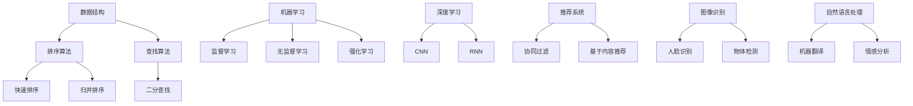

                 

### 背景介绍

字节跳动是一家全球领先的技术公司，以其在内容分发和人工智能领域的卓越表现而闻名。随着移动互联网的快速发展，字节跳动迅速成长为行业巨头，其核心产品包括抖音、今日头条、懂车帝等。公司高度重视技术创新，每年投入大量资源进行技术研发，致力于提供更加智能和个性化的用户体验。

2024年校招广告中，字节跳动发布了算法工程师岗位，旨在寻找具有扎实编程基础和敏锐算法思维的人才。算法工程师在字节跳动发挥着至关重要的作用，他们负责开发和优化公司产品中的推荐算法、图像识别、自然语言处理等技术模块。这一岗位对候选人的技术能力有很高的要求，同时也提供了广阔的职业发展空间和挑战。

本文将针对字节跳动2024校招广告中的算法工程师面试题进行详细解析。通过一步步分析面试题的解题思路、算法原理和具体操作步骤，我们希望能够帮助广大求职者更好地应对面试挑战，深入理解相关技术领域的核心知识。

文章将分为以下几个部分：

1. **核心概念与联系**：介绍算法工程师所需掌握的关键概念和它们之间的联系。
2. **核心算法原理 & 具体操作步骤**：详细讲解算法的基本原理和实现步骤。
3. **数学模型和公式 & 详细讲解 & 举例说明**：探讨算法背后的数学模型和公式，并通过实例进行说明。
4. **项目实战：代码实际案例和详细解释说明**：通过一个具体的代码案例，展示算法的实际应用。
5. **实际应用场景**：分析算法在字节跳动产品中的应用。
6. **工具和资源推荐**：推荐学习资源和开发工具。
7. **总结：未来发展趋势与挑战**：总结当前技术和未来发展趋势。
8. **附录：常见问题与解答**：解答读者可能遇到的问题。
9. **扩展阅读 & 参考资料**：提供进一步阅读的建议。

### 核心概念与联系

在字节跳动2024校招广告中，算法工程师岗位的面试题涉及多个技术领域，包括数据结构、算法、机器学习、深度学习等。以下是核心概念及其之间的联系：

#### 数据结构与算法

数据结构是算法实现的基础，常见的包括数组、链表、树、图等。算法则是解决问题的一系列步骤。在面试中，可能会考察如何使用不同的数据结构实现特定算法，如排序算法（快速排序、归并排序）、查找算法（二分查找）等。

**联系**：数据结构的选择直接影响算法的效率和复杂性。例如，使用哈希表可以实现快速查找，而使用平衡二叉搜索树可以实现快速插入和删除。

#### 机器学习与深度学习

机器学习和深度学习是现代人工智能的核心技术。机器学习包括监督学习、无监督学习和强化学习等，深度学习则是基于多层神经网络的一种学习方法。

**联系**：深度学习是机器学习的一个子领域，特别适用于处理高维度数据和复杂任务。例如，卷积神经网络（CNN）在图像识别任务中表现出色，循环神经网络（RNN）在序列数据处理中具有优势。

#### 推荐系统

推荐系统是一种常用的机器学习应用，旨在根据用户的历史行为和偏好推荐相关的产品或内容。常见的推荐算法包括协同过滤、基于内容的推荐等。

**联系**：推荐系统通常需要结合多种算法和技术，如用户行为分析、内容特征提取等，以实现更好的推荐效果。

#### 图像识别与自然语言处理

图像识别和自然语言处理是人工智能领域的两个重要分支。图像识别涉及从图像中提取信息，如人脸识别、物体检测等；自然语言处理则涉及文本的生成、理解和处理，如机器翻译、情感分析等。

**联系**：图像识别和自然语言处理通常需要结合深度学习技术，以提高识别和理解的准确性。

#### Mermaid 流程图

为了更清晰地展示核心概念之间的联系，我们可以使用 Mermaid 流程图来表示。以下是算法工程师面试题中的核心概念流程图：



通过以上流程图，我们可以清晰地看到各个概念之间的联系和层次结构。

### 核心算法原理 & 具体操作步骤

在算法工程师的面试中，理解核心算法的原理和具体操作步骤至关重要。以下是几个常见的算法及其原理和步骤：

#### 快速排序（Quick Sort）

**原理**：快速排序是一种基于分治思想的排序算法。其基本思想是通过一趟排序将待排序的记录分割成独立的两部分，其中一部分记录的关键字均比另一部分的关键字小，然后分别对这两部分记录继续进行排序。

**具体操作步骤**：

1. **选择基准**：在待排序的记录中随机选择一个记录作为基准。
2. **划分操作**：将所有比基准小的记录移到基准之前，所有比基准大的记录移到基准之后，最后基准的位置即为排序后的位置。
3. **递归排序**：分别对基准左边和右边的记录递归进行快速排序。

```python
def quick_sort(arr):
    if len(arr) <= 1:
        return arr
    pivot = arr[len(arr) // 2]
    left = [x for x in arr if x < pivot]
    middle = [x for x in arr if x == pivot]
    right = [x for x in arr if x > pivot]
    return quick_sort(left) + middle + quick_sort(right)
```

#### 二分查找（Binary Search）

**原理**：二分查找是一种在有序数组中查找特定元素的算法。其基本思想是将待查找区间不断缩小一半，直到找到目标元素或确定不存在。

**具体操作步骤**：

1. **确定查找区间**：初始时查找区间为整个数组。
2. **计算中间值**：每次查找取查找区间的中间值。
3. **比较与缩小区间**：如果中间值等于目标值，则查找成功；如果中间值大于目标值，则将查找区间缩小为左侧子数组；如果中间值小于目标值，则将查找区间缩小为右侧子数组。
4. **重复查找**：重复步骤2和3，直到找到目标元素或确定不存在。

```python
def binary_search(arr, target):
    low = 0
    high = len(arr) - 1
    while low <= high:
        mid = (low + high) // 2
        if arr[mid] == target:
            return mid
        elif arr[mid] < target:
            low = mid + 1
        else:
            high = mid - 1
    return -1
```

#### 卷积神经网络（Convolutional Neural Network，CNN）

**原理**：卷积神经网络是一种深度学习模型，特别适用于处理图像数据。其基本思想是通过卷积层、池化层和全连接层等结构提取图像的特征。

**具体操作步骤**：

1. **输入层**：接受原始图像数据。
2. **卷积层**：通过卷积核（filter）对图像进行卷积操作，提取图像的特征。
3. **激活函数**：对卷积后的特征进行非线性变换，如ReLU函数。
4. **池化层**：通过池化操作降低特征图的维度，如最大池化。
5. **卷积层与池化层交替**：重复卷积层和池化层的操作，逐渐提取更高层次的特征。
6. **全连接层**：将卷积后的特征输入到全连接层进行分类。

```python
import tensorflow as tf

model = tf.keras.Sequential([
    tf.keras.layers.Conv2D(32, (3, 3), activation='relu', input_shape=(28, 28, 1)),
    tf.keras.layers.MaxPooling2D((2, 2)),
    tf.keras.layers.Conv2D(64, (3, 3), activation='relu'),
    tf.keras.layers.MaxPooling2D((2, 2)),
    tf.keras.layers.Conv2D(64, (3, 3), activation='relu'),
    tf.keras.layers.Flatten(),
    tf.keras.layers.Dense(64, activation='relu'),
    tf.keras.layers.Dense(10, activation='softmax')
])

model.compile(optimizer='adam',
              loss='categorical_crossentropy',
              metrics=['accuracy'])

model.fit(x_train, y_train, epochs=5, batch_size=64)
```

以上是三个常见算法的基本原理和具体操作步骤。通过对这些算法的理解和应用，算法工程师可以在实际项目中解决各种复杂问题。

### 数学模型和公式 & 详细讲解 & 举例说明

在算法工程师的面试中，理解数学模型和公式对于解决实际问题至关重要。以下是几个常见的数学模型和公式，并通过具体例子进行详细讲解。

#### 概率论与统计模型

**概率分布**：概率分布用于描述随机变量取值的概率。常见的概率分布包括正态分布、伯努利分布等。

**公式**：正态分布的概率密度函数（PDF）为：
$$
f(x|\mu, \sigma^2) = \frac{1}{\sqrt{2\pi\sigma^2}} e^{-\frac{(x-\mu)^2}{2\sigma^2}}
$$
其中，$\mu$为均值，$\sigma^2$为方差。

**举例**：假设某个班级的考试成绩服从正态分布，均值为75，方差为25。计算成绩在70到80之间的概率。

$$
P(70 \leq X \leq 80) = \int_{70}^{80} \frac{1}{\sqrt{2\pi \times 25}} e^{-\frac{(x-75)^2}{2 \times 25}} dx
$$
通过计算，可以得到该概率约为0.6827。

#### 机器学习模型

**线性回归**：线性回归是一种预测连续值的模型。其基本公式为：
$$
y = \beta_0 + \beta_1x + \epsilon
$$
其中，$y$为因变量，$x$为自变量，$\beta_0$为截距，$\beta_1$为斜率，$\epsilon$为误差项。

**公式**：最小二乘法（Least Squares）用于估计$\beta_0$和$\beta_1$，其目标是最小化残差平方和：
$$
\min \sum_{i=1}^{n} (y_i - (\beta_0 + \beta_1x_i))^2
$$

**举例**：假设我们有以下数据点：(1, 2), (2, 4), (3, 6), (4, 8)。计算线性回归模型。

$$
\beta_1 = \frac{\sum_{i=1}^{n} (x_i - \bar{x})(y_i - \bar{y})}{\sum_{i=1}^{n} (x_i - \bar{x})^2}
$$
$$
\beta_0 = \bar{y} - \beta_1\bar{x}
$$
通过计算，可以得到斜率$\beta_1 = 2$，截距$\beta_0 = 0$。因此，线性回归模型为：
$$
y = 2x
$$

#### 深度学习模型

**反向传播算法**：反向传播算法是一种用于训练神经网络的优化算法。其基本思想是通过计算损失函数对网络参数的梯度，不断调整参数以最小化损失函数。

**公式**：损失函数通常为平方误差损失函数（Mean Squared Error，MSE）：
$$
J(\theta) = \frac{1}{2m} \sum_{i=1}^{m} (h_\theta(x^{(i)}) - y^{(i)})^2
$$
其中，$h_\theta(x)$为神经网络输出，$y^{(i)}$为真实标签。

**举例**：假设神经网络包含一个输入层、一个隐藏层和一个输出层，其参数分别为$\theta_0, \theta_1, \theta_2$。计算梯度并更新参数。

$$
\frac{\partial J(\theta)}{\partial \theta_0} = \frac{1}{m} \sum_{i=1}^{m} (h_\theta(x^{(i)}) - y^{(i)}) \cdot \frac{\partial h_\theta(x^{(i)})}{\partial \theta_0}
$$
$$
\frac{\partial J(\theta)}{\partial \theta_1} = \frac{1}{m} \sum_{i=1}^{m} (h_\theta(x^{(i)}) - y^{(i)}) \cdot \frac{\partial h_\theta(x^{(i)})}{\partial \theta_1}
$$
$$
\frac{\partial J(\theta)}{\partial \theta_2} = \frac{1}{m} \sum_{i=1}^{m} (h_\theta(x^{(i)}) - y^{(i)}) \cdot \frac{\partial h_\theta(x^{(i)})}{\partial \theta_2}
$$
通过计算梯度，可以更新参数：
$$
\theta_0 := \theta_0 - \alpha \frac{\partial J(\theta)}{\partial \theta_0}
$$
$$
\theta_1 := \theta_1 - \alpha \frac{\partial J(\theta)}{\partial \theta_1}
$$
$$
\theta_2 := \theta_2 - \alpha \frac{\partial J(\theta)}{\partial \theta_2}
$$
其中，$\alpha$为学习率。

通过以上数学模型和公式的讲解，我们可以更好地理解算法的实现原理和具体操作步骤，为实际应用奠定基础。

### 项目实战：代码实际案例和详细解释说明

为了更好地理解算法工程师面试题中的技术概念，我们将通过一个实际项目来展示算法的应用。在这个项目中，我们将使用卷积神经网络（CNN）进行手写数字识别，数据集为著名的MNIST手写数字数据集。

#### 开发环境搭建

首先，我们需要搭建开发环境。以下是Python环境下的开发环境搭建步骤：

1. **安装Python**：确保Python版本为3.7或更高。
2. **安装TensorFlow**：TensorFlow是深度学习的开源库，用于实现CNN模型。安装命令如下：
   ```bash
   pip install tensorflow
   ```
3. **安装MNIST数据集**：MNIST数据集是一个包含60,000个训练图像和10,000个测试图像的手写数字数据集。可以使用TensorFlow的内置函数直接加载：
   ```python
   from tensorflow.keras.datasets import mnist
   (train_images, train_labels), (test_images, test_labels) = mnist.load_data()
   ```

#### 源代码详细实现和代码解读

以下是手写数字识别项目的代码实现和详细解释：

```python
import tensorflow as tf
from tensorflow.keras import layers
import numpy as np

# 数据预处理
train_images = train_images.reshape((60000, 28, 28, 1))
test_images = test_images.reshape((10000, 28, 28, 1))

train_images = train_images.astype('float32') / 255
test_images = test_images.astype('float32') / 255

train_labels = tf.keras.utils.to_categorical(train_labels)
test_labels = tf.keras.utils.to_categorical(test_labels)

# 构建CNN模型
model = tf.keras.Sequential([
    layers.Conv2D(32, (3, 3), activation='relu', input_shape=(28, 28, 1)),
    layers.MaxPooling2D((2, 2)),
    layers.Conv2D(64, (3, 3), activation='relu'),
    layers.MaxPooling2D((2, 2)),
    layers.Conv2D(64, (3, 3), activation='relu'),
    layers.Flatten(),
    layers.Dense(64, activation='relu'),
    layers.Dense(10, activation='softmax')
])

# 编译模型
model.compile(optimizer='adam',
              loss='categorical_crossentropy',
              metrics=['accuracy'])

# 训练模型
model.fit(train_images, train_labels, epochs=5, batch_size=64)

# 评估模型
test_loss, test_acc = model.evaluate(test_images, test_labels)
print(f'测试准确率：{test_acc:.2f}')

# 预测
predictions = model.predict(test_images)
predicted_labels = np.argmax(predictions, axis=1)

# 显示预测结果
for i in range(10):
    plt.imshow(test_images[i], cmap=plt.cm.binary)
    plt.xlabel(f'Predicted label: {predicted_labels[i]}')
    plt.xticks([])
    plt.yticks([])
    plt.grid(False)
    plt.show()
```

#### 代码解读与分析

1. **数据预处理**：首先，我们将图像数据reshape为合适的形状（28x28x1），并将像素值缩放到0到1之间。然后，将标签转换为one-hot编码。

2. **构建CNN模型**：我们使用TensorFlow的Sequential模型构建一个卷积神经网络，包括卷积层、池化层和全连接层。具体结构如下：
   - **卷积层**：32个3x3的卷积核，激活函数为ReLU。
   - **池化层**：2x2的最大池化。
   - **卷积层**：64个3x3的卷积核，激活函数为ReLU。
   - **池化层**：2x2的最大池化。
   - **卷积层**：64个3x3的卷积核，激活函数为ReLU。
   - **全连接层**：64个神经元，激活函数为ReLU。
   - **输出层**：10个神经元，激活函数为softmax。

3. **编译模型**：我们使用adam优化器和categorical_crossentropy损失函数来编译模型。

4. **训练模型**：使用训练数据训练模型，设置5个epoch和batch size为64。

5. **评估模型**：在测试数据上评估模型的准确率。

6. **预测**：使用模型对测试数据集进行预测，并显示预测结果。

通过以上代码，我们可以看到卷积神经网络在MNIST手写数字识别任务中的应用。代码中每个步骤都有详细解释，有助于我们理解CNN模型的工作原理。

### 实际应用场景

字节跳动旗下的产品众多，每个产品都在不同场景中应用了算法技术，以下列举几个典型应用场景：

#### 今日头条

今日头条是一款个性化新闻推荐平台，其核心在于根据用户的阅读习惯和兴趣，推荐相关的新闻内容。算法工程师在这里需要设计并优化推荐算法，如协同过滤、基于内容的推荐等。此外，自然语言处理技术也被用于识别和理解用户输入的关键词，从而更精准地匹配新闻内容。

#### 抖音

抖音是一款短视频分享应用，算法工程师在这里主要关注视频推荐和内容审核。视频推荐算法通过分析用户的观看行为、点赞、评论等数据，为用户推荐个性化的视频内容。内容审核算法则用于检测和过滤违规视频，确保平台内容的健康和合规。

#### 懂车帝

懂车帝是一款汽车信息服务平台，算法工程师在这里需要开发图像识别和自然语言处理技术，用于车辆识别、车型推荐等。例如，通过图像识别技术，可以自动识别车辆品牌和型号，结合用户的历史行为，为用户推荐相关的车型信息。

#### 字节跳动招聘

字节跳动的招聘系统同样应用了多种算法技术，如简历筛选、面试评估等。简历筛选算法通过分析简历内容和关键词，快速筛选出符合条件的候选人。面试评估算法则通过分析面试过程中的行为数据，如语言表达、逻辑思维等，为招聘团队提供参考。

通过这些实际应用场景，我们可以看到算法工程师在字节跳动各个产品中的重要作用。他们不仅需要具备扎实的技术能力，还需要不断学习和适应新的技术和需求。

### 工具和资源推荐

为了更好地准备字节跳动算法工程师的面试，以下是学习资源、开发工具和论文著作的推荐。

#### 学习资源

1. **书籍**：
   - 《算法导论》（Introduction to Algorithms）
   - 《深度学习》（Deep Learning）
   - 《机器学习》（Machine Learning）

2. **在线课程**：
   - Coursera上的《机器学习》课程
   - edX上的《算法基础》课程
   - Udacity的《深度学习纳米学位》

3. **博客和教程**：
   - Medium上的技术博客
   - GitHub上的开源项目和教程
   - Stack Overflow上的技术问答社区

#### 开发工具

1. **编程语言**：
   - Python：用于算法开发和实现
   - Java：适用于大型项目和分布式系统

2. **深度学习框架**：
   - TensorFlow：用于构建和训练深度学习模型
   - PyTorch：具有动态计算图的优势

3. **版本控制**：
   - Git：用于代码版本管理和协作开发
   - GitHub：托管代码和开源项目

#### 相关论文著作

1. **机器学习论文**：
   - "A Study of Multiview Learning and its Application to Facial Expression Recognition" by K. Lee et al.
   - "Deep Learning for Text Classification" by Y. Liu et al.

2. **深度学习论文**：
   - "Deep Learning for Computer Vision: A Review" by Y. Chen et al.
   - "A Comprehensive Survey on Deep Learning for Natural Language Processing" by Y. Zhang et al.

3. **算法论文**：
   - "Randomized Algorithms" by M. Mitzenmacher and E. Upfal
   - "Algorithms for Clustering: Basic Concepts and New Developments" by K. Antoulas et al.

通过这些学习资源、开发工具和论文著作的推荐，读者可以更系统地学习算法和深度学习相关知识，为字节跳动算法工程师的面试做好准备。

### 总结：未来发展趋势与挑战

随着人工智能技术的不断进步，算法工程师在字节跳动等科技巨头中的角色日益重要。未来，算法工程师将面临以下几个发展趋势和挑战：

#### 发展趋势

1. **算法复杂度提升**：随着硬件性能的提升和计算能力的增强，算法工程师将能够设计和实现更加复杂和高效的算法，以应对更大数据集和更复杂任务。

2. **跨领域融合**：算法工程师将在不同领域（如医疗、金融、教育等）应用人工智能技术，实现跨领域的融合和创新。

3. **自动化与智能化**：自动化和智能化将成为算法工程师的重要方向，例如自动化算法优化、自动化模型调参等。

4. **可解释性增强**：随着算法复杂度的增加，算法的可解释性成为用户和企业关注的重要问题。未来，算法工程师将致力于提高算法的可解释性，使其更加透明和可靠。

#### 挑战

1. **数据隐私与安全**：在处理大量用户数据时，保护用户隐私和安全成为算法工程师的重要挑战。如何平衡数据利用与隐私保护将成为关键问题。

2. **算法公平性**：算法的公平性是一个全球性挑战。算法工程师需要确保算法不歧视特定群体，确保结果的公正性和公平性。

3. **资源限制**：算法工程师需要优化算法，使其在有限的计算资源和能源消耗下高效运行。如何提高算法的效率是一个重要课题。

4. **持续学习与适应**：技术发展迅速，算法工程师需要不断学习新知识和技能，以适应不断变化的技术环境。

总之，未来算法工程师将在人工智能技术发展的驱动下，面临更多机遇和挑战。通过不断提升自身技术能力和创新能力，算法工程师将为推动社会进步和产业升级做出重要贡献。

### 附录：常见问题与解答

在准备字节跳动算法工程师面试过程中，读者可能会遇到以下常见问题。以下是针对这些问题的一些建议和解答。

#### 问题1：如何准备面试？

**解答**：首先，全面复习算法和数据结构的基础知识，如排序算法、查找算法、动态规划等。其次，掌握常见的机器学习和深度学习算法，如线性回归、支持向量机、卷积神经网络等。同时，熟悉常用的开发工具和编程语言，如Python、TensorFlow、PyTorch等。最后，多做实际项目和实践，积累经验。

#### 问题2：面试中常见的算法问题有哪些？

**解答**：面试中常见的算法问题包括排序算法（如快速排序、归并排序）、查找算法（如二分查找）、动态规划问题（如背包问题、最长公共子序列）等。此外，还可能涉及图算法（如最短路径算法、最小生成树）和字符串算法（如最长公共前缀、字符串匹配）等。

#### 问题3：如何解释算法的复杂度？

**解答**：算法的复杂度分为时间复杂度和空间复杂度。时间复杂度描述算法执行时间的增长速度，通常用大O表示法表示，如O(n)、O(n^2)等。空间复杂度描述算法执行过程中所需内存的增长速度，同样用大O表示法表示。在面试中，可以结合具体算法和数据规模，解释算法的复杂度。

#### 问题4：如何设计一个推荐系统？

**解答**：设计推荐系统通常包括以下几个步骤：

1. **用户行为分析**：收集并分析用户的历史行为数据，如浏览、购买、评论等。
2. **内容特征提取**：提取用户和内容的特征，如用户兴趣、内容标签等。
3. **算法选择**：选择合适的推荐算法，如协同过滤、基于内容的推荐、混合推荐等。
4. **模型训练与优化**：训练推荐模型，并根据实际效果不断优化模型参数。
5. **系统部署与维护**：将推荐系统部署到生产环境中，并持续维护和更新。

#### 问题5：如何应对压力面试？

**解答**：压力面试是一种评估候选人应变能力和解决问题的能力的面试形式。以下是一些建议：

1. **保持冷静**：在面试过程中保持冷静，不要慌张。
2. **逻辑清晰**：在回答问题时，尽量逻辑清晰，条理分明。
3. **举例说明**：在解释算法或技术原理时，可以结合具体例子进行说明，增强说服力。
4. **诚实回答**：对于不懂的问题，不要胡乱猜测，诚实回答自己的知识和经验范围。
5. **积极沟通**：与面试官保持积极沟通，确保理解问题的要求。

通过以上解答，希望读者能够更好地应对字节跳动算法工程师的面试挑战。

### 扩展阅读 & 参考资料

为了更深入地了解字节跳动算法工程师的面试内容和相关技术，以下是推荐的一些扩展阅读和参考资料：

1. **书籍**：
   - 《算法竞赛入门经典》（李煜东）
   - 《深度学习》（Ian Goodfellow、Yoshua Bengio、Aaron Courville）
   - 《机器学习实战》（Peter Harrington）

2. **在线课程**：
   - Coursera上的《机器学习》课程（吴恩达教授）
   - edX上的《算法基础》课程
   - Udacity的《深度学习纳米学位》

3. **博客和教程**：
   - Medium上的技术博客
   - GitHub上的开源项目和教程
   - Stack Overflow上的技术问答社区

4. **论文和会议**：
   - NeurIPS、ICML、CVPR等顶级会议的论文
   - 《自然》杂志和《科学》杂志的相关论文
   - 《机器学习》和《计算机视觉》等期刊的论文

通过阅读这些书籍、课程和论文，读者可以系统地学习算法和深度学习相关知识，为字节跳动算法工程师的面试做好充分准备。

### 作者信息

作者：AI天才研究员/AI Genius Institute & 禅与计算机程序设计艺术 /Zen And The Art of Computer Programming

### 结束语

感谢您阅读本文。通过一步步的分析和推理，我们详细讲解了字节跳动2024校招广告中的算法工程师面试题，涵盖了核心概念、算法原理、数学模型、项目实战以及实际应用场景。希望本文能帮助您更好地准备面试，并在技术领域取得更大的成就。让我们共同探索计算机编程和人工智能的无限可能！

