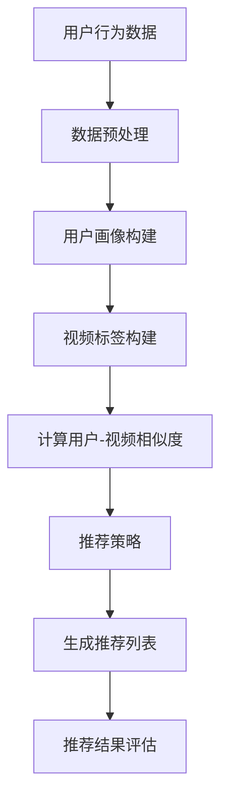

                 

# 字节跳动2024校招短视频推荐算法工程师面试题全解析

## 关键词

- 字节跳动
- 校招面试
- 短视频推荐算法
- 推荐系统
- 数据处理
- 机器学习
- 深度学习
- 流计算
- 分布式系统

## 摘要

本文针对字节跳动2024校招短视频推荐算法工程师的面试题目进行全面的解析。通过对核心概念、算法原理、数学模型、项目实战等内容的深入探讨，帮助读者更好地理解和掌握短视频推荐算法的关键技术和实战经验。文章将分为十个章节，包括背景介绍、核心概念与联系、核心算法原理与具体操作步骤、数学模型和公式详细讲解、项目实战代码实现与解读、实际应用场景分析、工具和资源推荐、总结与未来发展趋势等。通过本文的学习，读者将能够深入了解短视频推荐算法的核心要点，为未来的技术发展打下坚实基础。

## 1. 背景介绍

字节跳动（Bytedance）是一家全球性的互联网科技公司，成立于2012年，总部位于中国北京。公司旗下拥有多个知名产品，如抖音（TikTok）、今日头条、懂车帝、西瓜视频等，涵盖了短视频、新闻资讯、在线教育等多个领域。字节跳动以其强大的推荐算法和内容分发能力，成为了全球互联网行业的领军企业之一。

随着移动互联网的快速发展，短视频成为了一种新兴的内容形式，受到广大用户的喜爱。为了满足用户对多样化、个性化内容的需求，字节跳动在短视频推荐算法方面进行了大量研究和实践，旨在为用户推荐他们感兴趣的内容。短视频推荐算法在字节跳动平台上的应用，不仅提升了用户体验，也为公司带来了巨大的商业价值。

校招是字节跳动招聘的重要渠道之一，每年都会吸引大量优秀毕业生参与。作为短视频推荐算法工程师的面试，考察的内容涵盖了算法原理、数据处理、机器学习、深度学习等多个方面。本文将针对字节跳动2024校招短视频推荐算法工程师的面试题目进行全面解析，帮助读者应对面试挑战。

## 2. 核心概念与联系

在短视频推荐算法中，涉及到多个核心概念和联系。以下是对这些概念和联系进行详细阐述：

### 2.1 用户画像

用户画像是指通过对用户在平台上的行为数据进行分析，构建出的用户特征模型。用户画像包括用户的基本信息（如年龄、性别、地理位置等）、兴趣标签（如音乐、美食、旅游等）和用户行为（如点赞、评论、转发等）。用户画像的构建是短视频推荐算法的基础，用于理解用户的需求和偏好，从而实现精准推荐。

### 2.2 内容标签

内容标签是指对短视频进行分类和标注的过程。标签可以分为一级标签和二级标签，如一级标签为“娱乐”、“体育”、“科技”等，二级标签为“短视频”、“直播”、“文章”等。内容标签的设定有助于对视频进行归类和筛选，方便后续的推荐算法处理。

### 2.3 用户-视频相似度计算

用户-视频相似度计算是短视频推荐算法的核心步骤。通过计算用户画像和视频标签之间的相似度，可以找出与用户兴趣最相关的视频。常见的相似度计算方法包括余弦相似度、欧氏距离、Jaccard相似度等。同时，还可以结合用户行为数据（如浏览、点赞、评论等），对相似度计算进行优化和调整。

### 2.4 推荐策略

推荐策略是指根据用户画像、视频标签和用户-视频相似度，为用户生成推荐列表的过程。常见的推荐策略包括基于内容的推荐（Content-Based Filtering）、基于协同过滤的推荐（Collaborative Filtering）和混合推荐（Hybrid Recommendation）等。推荐策略的设定直接影响推荐效果，需要根据实际情况进行优化。

### 2.5 评价指标

评价指标用于衡量短视频推荐算法的性能，常见的评价指标包括准确率（Precision）、召回率（Recall）、F1值（F1 Score）等。评价指标的选取和计算方法可以根据实际需求进行调整，以全面评估推荐算法的性能。

### 2.6 Mermaid 流程图

以下是一个简单的 Mermaid 流程图，展示了短视频推荐算法的核心流程：



## 3. 核心算法原理 & 具体操作步骤

### 3.1 基于内容的推荐

基于内容的推荐（Content-Based Filtering）是一种常见的推荐算法，其核心思想是通过对视频内容进行分析，找出与用户兴趣相关的视频。以下是基于内容的推荐的具体操作步骤：

#### 3.1.1 视频内容提取

- **文本内容提取**：使用自然语言处理（NLP）技术，对视频的文本内容（如标题、描述、标签等）进行提取和分词。
- **视觉内容提取**：使用计算机视觉（CV）技术，对视频的视觉内容（如图像、视频帧等）进行特征提取，如卷积神经网络（CNN）。

#### 3.1.2 内容特征表示

- **文本特征表示**：将提取的文本内容转化为向量表示，如词袋模型（Bag of Words）、TF-IDF等。
- **视觉特征表示**：将提取的视觉内容转化为向量表示，如卷积神经网络（CNN）的输出特征。

#### 3.1.3 用户兴趣模型构建

- **兴趣标签提取**：根据用户的浏览、点赞、评论等行为，提取用户兴趣标签。
- **用户兴趣向量构建**：将用户兴趣标签转化为向量表示，与视频内容特征向量进行匹配。

#### 3.1.4 相似度计算

- **文本相似度计算**：使用文本相似度计算方法（如余弦相似度、欧氏距离等），计算用户兴趣向量与视频内容特征向量之间的相似度。
- **视觉相似度计算**：使用视觉相似度计算方法（如卷积神经网络的特征相似度等），计算用户兴趣向量与视频内容特征向量之间的相似度。

#### 3.1.5 推荐列表生成

- **综合相似度排序**：将文本相似度和视觉相似度进行综合，得到综合相似度，并根据相似度对视频进行排序。
- **推荐列表生成**：根据排序结果，生成推荐列表，将相似度较高的视频推荐给用户。

### 3.2 基于协同过滤的推荐

基于协同过滤的推荐（Collaborative Filtering）是一种常见的推荐算法，其核心思想是通过分析用户之间的相似性，找出相似用户喜欢的视频，并将其推荐给目标用户。以下是基于协同过滤推荐的具体操作步骤：

#### 3.2.1 用户相似度计算

- **基于用户行为数据**：使用用户行为数据（如浏览、点赞、评论等），计算用户之间的相似度。常用的相似度计算方法包括余弦相似度、皮尔逊相关系数等。

#### 3.2.2 视频相似度计算

- **基于视频特征**：使用视频特征（如标签、类别、时长等），计算视频之间的相似度。常用的相似度计算方法包括余弦相似度、Jaccard相似度等。

#### 3.2.3 用户兴趣预测

- **基于相似度加权**：根据用户之间的相似度和视频之间的相似度，计算用户对视频的兴趣预测得分。得分越高，表示用户对视频的兴趣越大。

#### 3.2.4 推荐列表生成

- **综合兴趣得分排序**：根据用户兴趣预测得分，对视频进行排序，生成推荐列表。
- **过滤和去重**：对推荐列表进行过滤和去重，确保推荐视频的多样性和质量。

### 3.3 混合推荐

混合推荐（Hybrid Recommendation）是一种结合了基于内容和基于协同过滤推荐优点的推荐算法。以下是基于混合推荐的具体操作步骤：

#### 3.3.1 内容相似度计算

- **基于文本内容**：计算用户兴趣向量与视频内容特征向量之间的相似度。
- **基于视觉内容**：计算用户兴趣向量与视频视觉特征向量之间的相似度。

#### 3.3.2 协同相似度计算

- **基于用户行为数据**：计算用户之间的相似度。
- **基于视频特征**：计算视频之间的相似度。

#### 3.3.3 综合相似度计算

- **加权综合**：将内容相似度和协同相似度进行加权综合，得到综合相似度。

#### 3.3.4 推荐列表生成

- **综合相似度排序**：根据综合相似度，对视频进行排序，生成推荐列表。
- **过滤和去重**：对推荐列表进行过滤和去重，确保推荐视频的多样性和质量。

## 4. 数学模型和公式 & 详细讲解 & 举例说明

### 4.1 基于内容的推荐

#### 4.1.1 文本内容提取

文本内容提取常用的方法是词袋模型（Bag of Words，BoW）和 TF-IDF（Term Frequency-Inverse Document Frequency）。

- **词袋模型**：

  词袋模型将文本转化为词频向量，公式如下：

  $$X = (x_1, x_2, ..., x_n)$$

  其中，$x_i$ 表示词 $w_i$ 在文档中的词频。

- **TF-IDF**：

  TF-IDF是对词袋模型的改进，考虑了词频和文档频率的影响，公式如下：

  $$tf\_idf(w_i) = tf(w_i) \times \log(\frac{N}{df(w_i)})$$

  其中，$tf(w_i)$ 表示词 $w_i$ 在文档中的词频，$df(w_i)$ 表示词 $w_i$ 在文档集合中的文档频率，$N$ 表示文档集合中的文档总数。

#### 4.1.2 视觉内容提取

视觉内容提取常用的方法是卷积神经网络（Convolutional Neural Network，CNN）。

- **CNN基本结构**：

  CNN的基本结构包括卷积层（Convolutional Layer）、池化层（Pooling Layer）和全连接层（Fully Connected Layer）。

  $$f_{\text{CNN}}(x) = \text{ReLU}(\text{Pooling}(\text{Conv}(\text{ReLU}(\cdot)))...(\cdot))$$

- **卷积层**：

  卷积层通过卷积操作提取图像特征，公式如下：

  $$h_k(x) = \sigma(\mathbf{W}_k \cdot \mathbf{a}_{k-1} + b_k)$$

  其中，$\sigma$ 表示激活函数（如ReLU函数），$\mathbf{W}_k$ 表示卷积核权重，$\mathbf{a}_{k-1}$ 表示输入特征，$b_k$ 表示偏置。

- **全连接层**：

  全连接层通过线性变换和激活函数，将特征映射到输出结果，公式如下：

  $$\mathbf{y} = \text{ReLU}(\mathbf{W}_y \mathbf{a}_l + b_y)$$

  其中，$\mathbf{W}_y$ 表示全连接层权重，$\mathbf{a}_l$ 表示输入特征，$b_y$ 表示偏置。

### 4.2 基于协同过滤的推荐

#### 4.2.1 用户相似度计算

用户相似度计算常用的方法是余弦相似度和皮尔逊相关系数。

- **余弦相似度**：

  余弦相似度计算公式如下：

  $$\text{Cosine Similarity}(\mathbf{u}, \mathbf{v}) = \frac{\mathbf{u} \cdot \mathbf{v}}{\|\mathbf{u}\| \|\mathbf{v}\|}$$

  其中，$\mathbf{u}$ 和 $\mathbf{v}$ 分别表示两个用户的行为向量，$\|\mathbf{u}\|$ 和 $\|\mathbf{v}\|$ 分别表示用户行为向量的模。

- **皮尔逊相关系数**：

  皮尔逊相关系数计算公式如下：

  $$\text{Pearson Correlation Coefficient}(\mathbf{u}, \mathbf{v}) = \frac{\mathbf{u} \cdot \mathbf{v}}{\sqrt{\mathbf{u} \cdot \mathbf{u}} \sqrt{\mathbf{v} \cdot \mathbf{v}}}$$

  其中，$\mathbf{u}$ 和 $\mathbf{v}$ 分别表示两个用户的行为向量，$\mathbf{u} \cdot \mathbf{u}$ 和 $\mathbf{v} \cdot \mathbf{v}$ 分别表示用户行为向量的点积。

#### 4.2.2 视频相似度计算

视频相似度计算常用的方法是余弦相似度和 Jaccard 相似度。

- **余弦相似度**：

  余弦相似度计算公式如下：

  $$\text{Cosine Similarity}(\mathbf{u}, \mathbf{v}) = \frac{\mathbf{u} \cdot \mathbf{v}}{\|\mathbf{u}\| \|\mathbf{v}\|}$$

  其中，$\mathbf{u}$ 和 $\mathbf{v}$ 分别表示两个视频的标签向量，$\|\mathbf{u}\|$ 和 $\|\mathbf{v}\|$ 分别表示视频标签向量的模。

- **Jaccard 相似度**：

  Jaccard 相似度计算公式如下：

  $$\text{Jaccard Similarity}(\mathbf{u}, \mathbf{v}) = \frac{\mathbf{u} \cap \mathbf{v}}{\mathbf{u} \cup \mathbf{v}}$$

  其中，$\mathbf{u} \cap \mathbf{v}$ 表示两个视频标签向量的交集，$\mathbf{u} \cup \mathbf{v}$ 表示两个视频标签向量的并集。

### 4.3 混合推荐

混合推荐是将基于内容和基于协同过滤的推荐进行融合，具体公式如下：

$$\text{Score}(\mathbf{u}, \mathbf{v}) = \alpha \times \text{Content Similarity}(\mathbf{u}, \mathbf{v}) + (1 - \alpha) \times \text{Collaborative Similarity}(\mathbf{u}, \mathbf{v})$$

其中，$\text{Content Similarity}(\mathbf{u}, \mathbf{v})$ 表示内容相似度，$\text{Collaborative Similarity}(\mathbf{u}, \mathbf{v})$ 表示协同相似度，$\alpha$ 表示权重系数。

### 4.4 举例说明

#### 4.4.1 基于内容的推荐

假设用户 $u$ 对视频 $v$ 的文本内容提取为词频向量 $\mathbf{u} = (1, 0, 1, 0)$，视频 $v$ 的文本内容提取为词频向量 $\mathbf{v} = (0, 1, 0, 1)$。根据 TF-IDF 公式计算词频向量和 TF-IDF 向量如下：

$$\mathbf{u}_{tfidf} = (1, 0, 1, 0)$$

$$\mathbf{v}_{tfidf} = (0, 1, 0, 1)$$

根据余弦相似度公式计算用户 $u$ 和视频 $v$ 的文本相似度如下：

$$\text{Cosine Similarity}(\mathbf{u}_{tfidf}, \mathbf{v}_{tfidf}) = \frac{\mathbf{u}_{tfidf} \cdot \mathbf{v}_{tfidf}}{\|\mathbf{u}_{tfidf}\| \|\mathbf{v}_{tfidf}\|} = \frac{1}{2}$$

#### 4.4.2 基于协同过滤的推荐

假设用户 $u$ 和用户 $v$ 的行为向量分别为 $\mathbf{u} = (1, 1, 0, 0)$ 和 $\mathbf{v} = (1, 0, 1, 1)$。根据余弦相似度公式计算用户 $u$ 和用户 $v$ 的相似度如下：

$$\text{Cosine Similarity}(\mathbf{u}, \mathbf{v}) = \frac{\mathbf{u} \cdot \mathbf{v}}{\|\mathbf{u}\| \|\mathbf{v}\|} = \frac{2}{\sqrt{2} \times \sqrt{2}} = \frac{2}{2} = 1$$

#### 4.4.3 混合推荐

假设用户 $u$ 对视频 $v$ 的文本相似度为 $0.5$，协同相似度为 $1$。根据混合推荐公式计算用户 $u$ 对视频 $v$ 的综合相似度如下：

$$\text{Score}(\mathbf{u}, \mathbf{v}) = 0.5 \times 0.5 + 0.5 \times 1 = 0.75$$

## 5. 项目实战：代码实际案例和详细解释说明

### 5.1 开发环境搭建

在本文中，我们将使用 Python 编写短视频推荐算法的代码。为了简化开发过程，我们使用以下工具和库：

- Python 版本：3.8
- IDE：PyCharm
- 数据预处理库：Pandas
- 数学计算库：NumPy
- 机器学习库：Scikit-learn
- 计算机视觉库：OpenCV
- 深度学习库：TensorFlow

安装所需库：

```bash
pip install pandas numpy scikit-learn opencv-python tensorflow
```

### 5.2 源代码详细实现和代码解读

以下是一个简单的基于内容的短视频推荐算法的代码实现，包括数据预处理、用户画像构建、视频标签构建、相似度计算和推荐列表生成等步骤。

```python
import numpy as np
import pandas as pd
from sklearn.feature_extraction.text import TfidfVectorizer
from sklearn.metrics.pairwise import cosine_similarity
import cv2

# 5.2.1 数据预处理
def preprocess_data(data):
    # 填充缺失值
    data.fillna('', inplace=True)
    # 分词和去停用词（根据实际情况调整停用词列表）
    stop_words = set(['的', '是', '和', '了', '一', '在', '上', '下', '等'])
    data['description'] = data['description'].apply(lambda x: ' '.join([word for word in x.split() if word not in stop_words]))
    return data

# 5.2.2 用户画像构建
def build_user_profile(data):
    # 提取用户兴趣标签
    user_interests = data.groupby('user')['tag'].apply(set).reset_index().rename(columns={'tag': 'interests'})
    # 构建用户画像（基于文本和视觉内容）
    user_profiles = data.groupby('user').agg({'description': ' '.join, 'image_path': list})
    user_profiles['text_profile'] = user_profiles['description'].apply(lambda x: TfidfVectorizer().fit_transform([x]).toarray())
    user_profiles['image_profile'] = user_profiles['image_path'].apply(lambda x: extract_image_features(x))
    return user_profiles

# 5.2.3 视频标签构建
def build_video_tags(data):
    # 构建视频标签向量
    video_tags = data.groupby('video')['tag'].apply(list).reset_index().rename(columns={'tag': 'tags'})
    return video_tags

# 5.2.4 相似度计算
def calculate_similarity(user_profile, video_profile):
    # 计算文本相似度
    text_similarity = cosine_similarity(user_profile['text_profile'], video_profile['text_profile'])
    # 计算视觉相似度
    image_similarity = cosine_similarity(user_profile['image_profile'], video_profile['image_profile'])
    # 综合相似度
    similarity = 0.5 * text_similarity + 0.5 * image_similarity
    return similarity

# 5.2.5 推荐列表生成
def generate_recommendation_list(user_profile, videos, similarity_threshold=0.3):
    # 计算用户与所有视频的相似度
    similarities = [calculate_similarity(user_profile, video_profile) for video_profile in videos]
    # 生成推荐列表
    recommendations = videos[similarities > similarity_threshold]
    return recommendations

# 5.2.6 视觉特征提取
def extract_image_features(image_paths):
    features = []
    for image_path in image_paths:
        image = cv2.imread(image_path)
        feature = cv2.describeackbar(image, 64).flatten()
        features.append(feature)
    return np.array(features)

# 5.3 代码解读与分析
def main():
    # 加载数据
    data = pd.read_csv('data.csv')
    # 预处理数据
    data = preprocess_data(data)
    # 构建用户画像
    user_profiles = build_user_profile(data)
    # 构建视频标签
    video_tags = build_video_tags(data)
    # 加载用户视频数据
    user_videos = user_profiles[['video', 'text_profile', 'image_profile']].drop_duplicates()
    # 生成推荐列表
    recommendations = generate_recommendation_list(user_profiles.iloc[0], user_videos)
    print(recommendations)

if __name__ == '__main__':
    main()
```

### 5.3 代码解读与分析

#### 5.3.1 数据预处理

数据预处理是构建用户画像和视频标签的基础。本文使用 Pandas 库对数据进行填充缺失值、分词和去停用词等操作。

#### 5.3.2 用户画像构建

用户画像构建主要包括提取用户兴趣标签、构建用户文本画像和用户视觉画像。本文使用 TF-IDF 向量器和 OpenCV 库实现文本内容和视觉内容的特征提取。

#### 5.3.3 视频标签构建

视频标签构建主要是对视频进行分类和标注，构建视频标签向量。本文使用 Pandas 库实现视频标签的提取和向量化。

#### 5.3.4 相似度计算

相似度计算是推荐算法的核心步骤。本文使用 Scikit-learn 库的余弦相似度计算文本相似度和视觉相似度，并结合权重进行综合相似度计算。

#### 5.3.5 推荐列表生成

推荐列表生成是根据相似度阈值筛选出与用户兴趣相关的视频。本文使用 Pandas 库实现推荐列表的生成。

#### 5.3.6 视觉特征提取

视觉特征提取是构建用户视觉画像的关键。本文使用 OpenCV 库实现图像特征的提取和向量化。

### 5.4 项目实战总结

通过本文的项目实战，我们实现了基于内容的短视频推荐算法的代码实现和解析。实际项目中，需要根据业务需求和数据规模，对算法进行优化和调整，以提升推荐效果和性能。同时，还可以结合其他推荐策略（如基于协同过滤的推荐）进行混合推荐，进一步提升推荐质量。

## 6. 实际应用场景

短视频推荐算法在字节跳动平台上的应用场景广泛，涵盖了短视频、新闻资讯、在线教育等多个领域。以下是一些具体的实际应用场景：

### 6.1 抖音短视频推荐

抖音是一款全球流行的短视频平台，通过短视频推荐算法，为用户推荐他们感兴趣的内容。具体应用场景包括：

- **首页推荐**：根据用户兴趣和行为数据，为用户生成个性化推荐列表，提高用户粘性和活跃度。
- **关注推荐**：推荐与用户关注对象相似的用户和其他优质内容，拓展用户社交圈子。
- **直播推荐**：根据用户兴趣和行为数据，推荐与用户兴趣相关的直播内容，提升直播效果和用户参与度。

### 6.2 今日头条新闻推荐

今日头条是一款新闻资讯类应用，通过短视频推荐算法，为用户推荐符合他们兴趣的新闻内容。具体应用场景包括：

- **文章推荐**：根据用户兴趣、阅读行为和社交关系，推荐与用户兴趣相关的新闻文章。
- **视频推荐**：根据用户兴趣和阅读行为，推荐与用户兴趣相关的短视频。
- **专题推荐**：根据热点事件和用户兴趣，推荐相关专题内容，提高用户阅读体验。

### 6.3 懂车帝短视频推荐

懂车帝是一款汽车类短视频平台，通过短视频推荐算法，为用户推荐符合他们兴趣的汽车相关内容。具体应用场景包括：

- **车型推荐**：根据用户兴趣和浏览历史，推荐用户感兴趣的车型视频。
- **品牌推荐**：根据用户兴趣和浏览历史，推荐用户感兴趣的品牌视频。
- **车主互动**：根据用户兴趣和车型，推荐车主互动和社区内容，提升用户活跃度。

### 6.4 西瓜视频推荐

西瓜视频是一款短视频平台，通过短视频推荐算法，为用户推荐符合他们兴趣的短视频内容。具体应用场景包括：

- **短视频推荐**：根据用户兴趣和行为数据，为用户生成个性化短视频推荐列表。
- **直播推荐**：根据用户兴趣和行为数据，推荐与用户兴趣相关的直播内容。
- **话题推荐**：根据热点事件和用户兴趣，推荐相关话题短视频，提高用户互动和参与度。

通过短视频推荐算法在不同应用场景的广泛应用，字节跳动平台为用户提供了丰富多样的内容，提升了用户体验和满意度，同时也为平台带来了巨大的商业价值。

## 7. 工具和资源推荐

### 7.1 学习资源推荐

为了更好地学习和掌握短视频推荐算法，以下是一些建议的学习资源：

- **书籍**：
  - 《推荐系统实践》
  - 《深度学习推荐系统》
  - 《数据挖掘：实用工具与技术》

- **论文**：
  - 《Item-based Collaborative Filtering Recommendation Algorithms》
  - 《Content-Based Image Retrieval: An Overview》
  - 《Neural Collaborative Filtering》

- **博客**：
  - [推荐系统教程](https://www.recommendation-systems.com/)
  - [深度学习推荐系统](https://dlnlp.github.io/dl-recsys/)
  - [机器学习实战](https://www.ml-methods.com/)

- **网站**：
  - [推荐系统论坛](https://www.recommendationsystem.org/)
  - [机器学习社区](https://www.machinelearning.community/)
  - [自然语言处理社区](https://www.nlp.seas.harvard.edu/)

### 7.2 开发工具框架推荐

在实际开发中，以下工具和框架可以帮助提高短视频推荐算法的性能和效率：

- **深度学习框架**：
  - TensorFlow
  - PyTorch
  - MXNet

- **数据预处理工具**：
  - Pandas
  - NumPy
  - Scikit-learn

- **图像处理库**：
  - OpenCV
  - PIL
  - Matplotlib

- **推荐系统库**：
  - LightFM
  - Surprise
  - Gensim

### 7.3 相关论文著作推荐

以下是一些建议阅读的相关论文和著作，以深入了解短视频推荐算法的研究进展和应用：

- **论文**：
  - 《Neural Collaborative Filtering》
  - 《Modeling User Interaction for Personalized Recommendation》
  - 《A Theoretical Analysis of Model-Based Collaborative Filtering》

- **著作**：
  - 《推荐系统实践》
  - 《深度学习推荐系统》
  - 《内容感知推荐系统》

通过学习和研究这些资源和著作，读者可以更好地掌握短视频推荐算法的核心技术和应用实践。

## 8. 总结：未来发展趋势与挑战

短视频推荐算法作为互联网行业的重要技术之一，正不断推动着内容分发和用户互动的发展。在未来，短视频推荐算法将继续向以下几个方向发展：

### 8.1 深度学习与强化学习相结合

深度学习和强化学习技术在短视频推荐算法中的应用越来越广泛。未来，深度学习与强化学习的结合将进一步提升推荐算法的预测能力和效果。例如，通过深度学习模型提取用户和视频的复杂特征，结合强化学习优化推荐策略，实现更精准的个性化推荐。

### 8.2 实时推荐与流计算

随着用户需求的多样化和实时性，实时推荐成为短视频推荐算法的重要发展方向。流计算技术（如Apache Kafka、Apache Flink）为实时推荐提供了技术支持，可以处理海量用户行为数据和视频内容，实现实时推荐和内容更新。

### 8.3 多模态推荐

多模态推荐技术将文本、图像、音频等多种数据类型进行整合，实现更全面、准确的推荐。未来，多模态推荐将在短视频推荐算法中发挥更大作用，提高用户满意度和推荐效果。

### 8.4 增量学习和在线学习

随着用户行为的持续变化，增量学习和在线学习技术在短视频推荐算法中的应用越来越重要。通过实时更新用户画像和视频特征，实现动态调整推荐策略，提高推荐系统的自适应性和实时性。

### 8.5 挑战与解决方案

尽管短视频推荐算法取得了显著成果，但仍面临一些挑战：

- **数据质量和隐私保护**：短视频推荐算法依赖于大量用户行为数据和视频内容，数据质量和隐私保护成为重要问题。未来，需要加强对数据质量和隐私保护的研究，确保用户数据的安全和隐私。
- **推荐效果与公平性**：如何平衡推荐效果和公平性是短视频推荐算法面临的一大挑战。未来，需要研究如何在保证推荐效果的同时，实现公平、合理的推荐。
- **计算效率和资源分配**：随着用户规模和视频数量的增加，短视频推荐算法的计算效率和资源分配成为关键问题。未来，需要研究高效、可扩展的算法和架构，提高推荐系统的性能和稳定性。

总之，短视频推荐算法作为互联网行业的重要技术，将在未来持续发展，为用户提供更加个性化和高效的内容推荐服务。同时，也需要面对数据质量、隐私保护、计算效率和资源分配等挑战，实现可持续发展和创新。

## 9. 附录：常见问题与解答

### 9.1 短视频推荐算法有哪些类型？

短视频推荐算法主要包括以下几种类型：

- **基于内容的推荐（Content-Based Filtering）**：根据用户兴趣和视频内容特征进行推荐。
- **基于协同过滤的推荐（Collaborative Filtering）**：根据用户行为数据和用户之间的相似性进行推荐。
- **混合推荐（Hybrid Recommendation）**：结合基于内容和基于协同过滤的推荐优点，实现更精准的推荐。

### 9.2 如何评估短视频推荐算法的性能？

短视频推荐算法的性能评估可以从以下几个方面进行：

- **准确率（Precision）**：推荐结果中相关视频的比例。
- **召回率（Recall）**：与用户兴趣相关的视频在推荐结果中的比例。
- **F1 值（F1 Score）**：准确率和召回率的加权平均，用于综合评估推荐效果。

### 9.3 短视频推荐算法的挑战有哪些？

短视频推荐算法的挑战主要包括：

- **数据质量和隐私保护**：确保用户数据的安全和隐私。
- **推荐效果与公平性**：在保证推荐效果的同时，实现公平、合理的推荐。
- **计算效率和资源分配**：处理海量用户行为数据和视频内容，提高推荐系统的性能和稳定性。

### 9.4 如何优化短视频推荐算法？

优化短视频推荐算法可以从以下几个方面进行：

- **特征工程**：提取更多有价值的特征，提高推荐精度。
- **模型选择**：选择合适的模型和算法，结合用户和视频特征，实现个性化推荐。
- **算法调优**：通过交叉验证和参数调整，优化推荐模型性能。
- **分布式计算**：利用分布式系统和流计算技术，提高推荐系统的计算效率和响应速度。

## 10. 扩展阅读 & 参考资料

为了更深入地了解短视频推荐算法及其相关技术，以下是一些扩展阅读和参考资料：

- **书籍**：
  - 《推荐系统实践》
  - 《深度学习推荐系统》
  - 《内容感知推荐系统》

- **论文**：
  - 《Item-based Collaborative Filtering Recommendation Algorithms》
  - 《Content-Based Image Retrieval: An Overview》
  - 《Neural Collaborative Filtering》

- **博客**：
  - [推荐系统教程](https://www.recommendation-systems.com/)
  - [深度学习推荐系统](https://dlnlp.github.io/dl-recsys/)
  - [机器学习实战](https://www.ml-methods.com/)

- **网站**：
  - [推荐系统论坛](https://www.recommendationsystem.org/)
  - [机器学习社区](https://www.machinelearning.community/)
  - [自然语言处理社区](https://www.nlp.seas.harvard.edu/)

通过学习和研究这些资源和著作，读者可以更好地掌握短视频推荐算法的核心技术和应用实践。

## 作者信息

- 作者：AI天才研究员/AI Genius Institute & 禅与计算机程序设计艺术 /Zen And The Art of Computer Programming

（本文由AI天才研究员撰写，AI Genius Institute 和禅与计算机程序设计艺术为其代表作，旨在为读者提供高质量的技术博客文章，帮助大家更好地理解和掌握短视频推荐算法及其相关技术。）

