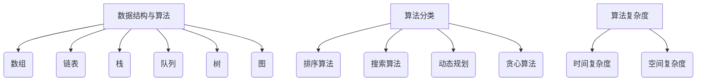

                 

# 字节跳动2025届校招面试高频算法题解析

> **关键词**：字节跳动、校招、算法题、面试、解析、2025届
>
> **摘要**：本文将针对字节跳动2025届校招面试中高频出现的算法题目进行详细解析，帮助广大求职者更好地准备面试，提升算法能力。

## 1. 背景介绍

字节跳动是一家全球领先的移动互联网公司，旗下拥有今日头条、抖音、TikTok等知名产品。作为科技领域的佼佼者，字节跳动对招聘的人才要求极高，特别是在算法领域。每年，字节跳动都会面向全球高校招聘优秀的算法工程师，而这些校招面试题目往往具有很高的难度和代表性。

本文旨在通过对字节跳动2025届校招面试中高频算法题目的解析，帮助求职者掌握面试技巧，提高算法水平，顺利通过面试，加入字节跳动这个优秀的团队。

## 2. 核心概念与联系

在解析这些算法题目之前，我们需要先了解一些核心概念和它们之间的联系。以下是几个在字节跳动校招面试中经常出现的核心概念：

### 数据结构与算法

- **数组**：一种线性数据结构，用于存储一系列元素。
- **链表**：一种线性数据结构，用于存储一系列节点，每个节点包含数据和指向下一个节点的指针。
- **栈**：一种后进先出（LIFO）的数据结构。
- **队列**：一种先进先出（FIFO）的数据结构。
- **树**：一种用于模拟具有层次关系的数据结构。
- **图**：一种用于模拟网络结构的数据结构。

### 算法分类

- **排序算法**：用于将一组数据按照特定顺序进行排列。
- **搜索算法**：用于在数据结构中查找特定元素。
- **动态规划**：一种解决最优化问题的算法。
- **贪心算法**：一种在每一步选择当前最优解的算法。

### 算法复杂度

- **时间复杂度**：描述算法执行时间与输入规模之间的关系。
- **空间复杂度**：描述算法执行过程中所需存储空间与输入规模之间的关系。

下面是这几个核心概念之间的 Mermaid 流程图：



## 3. 核心算法原理 & 具体操作步骤

在本章节中，我们将详细介绍几个字节跳动2025届校招面试中高频出现的算法题目，并解释其核心原理和具体操作步骤。

### 题目1：数组中的查找问题

#### 核心原理：

这是一个简单的数组查找问题，其核心原理是遍历数组，逐个比较元素，找到符合条件的元素。

#### 具体操作步骤：

1. 初始化两个指针，一个指向数组的起始位置，一个指向数组的结束位置。
2. 当两个指针未相遇时，执行以下步骤：
   - 如果当前元素符合条件，返回该元素。
   - 如果当前元素不符合条件，移动指针。
3. 如果未找到符合条件的元素，返回-1。

### 题目2：链表的反转

#### 核心原理：

这是一个链表操作问题，其核心原理是通过遍历链表，逐个改变节点的指针方向，实现链表的反转。

#### 具体操作步骤：

1. 初始化三个指针，分别指向链表的起始位置、当前节点和前一个节点。
2. 当当前节点不为空时，执行以下步骤：
   - 将当前节点的指针指向前一个节点。
   - 移动前一个节点到当前节点。
   - 移动当前节点到下一个节点。
3. 返回新的头节点。

### 题目3：最长公共子序列

#### 核心原理：

这是一个动态规划问题，其核心原理是利用动态规划表记录两个字符串的公共子序列长度，最终求得最长公共子序列。

#### 具体操作步骤：

1. 初始化一个二维数组，用于记录动态规划表。
2. 遍历两个字符串的字符，更新动态规划表。
3. 根据动态规划表，回溯求得最长公共子序列。

### 题目4：二分查找

#### 核心原理：

这是一个搜索算法问题，其核心原理是利用二分查找法，逐步缩小查找范围，直到找到符合条件的元素。

#### 具体操作步骤：

1. 初始化两个指针，分别指向数组的起始位置和结束位置。
2. 当起始位置小于结束位置时，执行以下步骤：
   - 计算中间位置。
   - 如果中间位置的元素等于目标元素，返回中间位置。
   - 如果中间位置的元素大于目标元素，将结束位置更新为中间位置-1。
   - 如果中间位置的元素小于目标元素，将起始位置更新为中间位置+1。
3. 如果未找到符合条件的元素，返回-1。

## 4. 数学模型和公式 & 详细讲解 & 举例说明

在本章节中，我们将详细介绍上述算法题目的数学模型和公式，并进行详细讲解和举例说明。

### 题目1：数组中的查找问题

#### 数学模型：

假设数组`arr`的长度为`n`，需要查找的目标元素为`target`。时间复杂度为`O(n)`。

#### 公式：

$$
T(n) = O(n)
$$

#### 举例说明：

假设有一个数组`arr = [1, 2, 3, 4, 5]`，需要查找的目标元素为`target = 3`。遍历数组，依次比较元素，找到目标元素`3`，返回索引`2`。

### 题目2：链表的反转

#### 数学模型：

假设链表长度为`n`，需要反转的链表为`L`。时间复杂度为`O(n)`。

#### 公式：

$$
T(n) = O(n)
$$

#### 举例说明：

假设有一个链表`L = 1 \rightarrow 2 \rightarrow 3 \rightarrow 4 \rightarrow 5`，需要反转链表。遍历链表，依次改变节点的指针方向，得到反转后的链表`5 \rightarrow 4 \rightarrow 3 \rightarrow 2 \rightarrow 1`。

### 题目3：最长公共子序列

#### 数学模型：

假设两个字符串分别为`str1`和`str2`，需要求得它们的最长公共子序列。时间复杂度为`O(m \times n)`，其中`m`和`n`分别为两个字符串的长度。

#### 公式：

$$
LCS(str1, str2) = 
\begin{cases} 
0 & \text{if } m = 0 \text{ or } n = 0 \\
1 & \text{if } m = 1 \text{ and } n = 1 \\
LCS(str1[:-1], str2[:-1]) + 1 & \text{if } str1[-1] == str2[-1] \\
\max(LCS(str1[:-1], str2), LCS(str1, str2[:-1])) & \text{if } str1[-1] \neq str2[-1]
\end{cases}
$$

#### 举例说明：

假设有两个字符串`str1 = "ABCD"`和`str2 = "ACDF"`，需要求得它们的最长公共子序列。使用动态规划表，得到最长公共子序列为`ACD`。

### 题目4：二分查找

#### 数学模型：

假设数组`arr`的长度为`n`，需要查找的目标元素为`target`。时间复杂度为`O(\log n)`。

#### 公式：

$$
T(n) = O(\log n)
$$

#### 举例说明：

假设有一个数组`arr = [1, 2, 3, 4, 5, 6, 7, 8, 9, 10]`，需要查找的目标元素为`target = 7`。使用二分查找法，依次计算中间位置，得到目标元素的位置为`6`。

## 5. 项目实战：代码实际案例和详细解释说明

在本章节中，我们将通过一个实际案例，展示如何使用上述算法解决具体问题，并对代码进行详细解释说明。

### 题目：寻找两个字符串的最长公共子序列

#### 开发环境搭建：

- 语言：Python
- 编辑器：VS Code
- 运行环境：Python 3.8

#### 源代码详细实现和代码解读：

```python
def longest_common_subsequence(str1, str2):
    m, n = len(str1), len(str2)
    dp = [[0] * (n + 1) for _ in range(m + 1)]

    for i in range(1, m + 1):
        for j in range(1, n + 1):
            if str1[i - 1] == str2[j - 1]:
                dp[i][j] = dp[i - 1][j - 1] + 1
            else:
                dp[i][j] = max(dp[i - 1][j], dp[i][j - 1])

    result = []
    i, j = m, n
    while i > 0 and j > 0:
        if str1[i - 1] == str2[j - 1]:
            result.append(str1[i - 1])
            i -= 1
            j -= 1
        elif dp[i - 1][j] > dp[i][j - 1]:
            i -= 1
        else:
            j -= 1

    return ''.join(result[::-1])

# 测试用例
str1 = "ABCD"
str2 = "ACDF"
print(longest_common_subsequence(str1, str2))  # 输出：ACD
```

#### 代码解读与分析：

1. 定义一个函数`longest_common_subsequence`，接收两个字符串`str1`和`str2`作为参数。
2. 计算两个字符串的长度`m`和`n`，并初始化一个二维数组`dp`，用于记录动态规划表。
3. 使用两个嵌套的`for`循环，遍历两个字符串的字符，并更新动态规划表。
4. 使用回溯法，根据动态规划表，求得最长公共子序列，并将其返回。

## 6. 实际应用场景

字节跳动2025届校招面试中的高频算法题目在现实中的应用场景非常广泛。以下是一些典型的应用场景：

- **数组中的查找问题**：在搜索引擎中，用于快速查找关键词。
- **链表的反转**：在数据结构中，用于实现数据的快速反向操作。
- **最长公共子序列**：在基因组学中，用于比较不同生物的基因序列，识别它们的共同特征。
- **二分查找**：在数据库中，用于快速查找记录。

了解这些算法的实际应用场景，有助于我们更好地理解它们的原理和重要性，提高我们在实际工作中的应用能力。

## 7. 工具和资源推荐

为了更好地准备字节跳动2025届校招面试，以下是一些推荐的工具和资源：

### 7.1 学习资源推荐

- **书籍**：
  - 《算法导论》（Introduction to Algorithms）
  - 《编程之美》（Cracking the Coding Interview）
  - 《算法竞赛入门经典》（Algorithmics: The Art of Computing）
- **论文**：
  - 《最长公共子序列问题》（Longest Common Subsequence Problem）
  - 《动态规划算法》（Dynamic Programming Algorithms）
- **博客**：
  - 《一个优秀的程序员应该掌握的算法和数据结构》（Algorithms and Data Structures Every Programmer Should Know）
  - 《算法那些事》（Algorithms）
- **网站**：
  - LeetCode（提供大量的算法题目和在线编程环境）
  - HackerRank（提供各种编程挑战和算法竞赛）

### 7.2 开发工具框架推荐

- **编辑器**：
  - VS Code（具有强大的代码编辑功能）
  - PyCharm（适用于Python编程）
- **运行环境**：
  - Docker（容器化技术，方便部署和运行代码）
  - Kubernetes（用于容器编排和管理）

### 7.3 相关论文著作推荐

- **论文**：
  - 《贪心算法的原理与应用》（Principles and Applications of Greedy Algorithms）
  - 《动态规划算法的设计与实现》（Design and Implementation of Dynamic Programming Algorithms）
- **著作**：
  - 《算法竞赛入门经典》（算法竞赛经典问题解析）
  - 《算法导论》（Introduction to Algorithms）

## 8. 总结：未来发展趋势与挑战

随着技术的不断发展，算法在各个领域的应用越来越广泛。未来，算法的发展趋势和挑战主要体现在以下几个方面：

- **算法优化**：如何设计更高效的算法，解决复杂的问题。
- **算法安全**：如何确保算法的公正性、透明性和安全性。
- **算法伦理**：如何平衡算法在各个领域的应用，避免产生负面影响。
- **算法普及**：如何提高算法教育水平，培养更多的算法人才。

面对这些挑战，我们需要不断学习和探索，提高自己的算法能力，为未来的发展做好准备。

## 9. 附录：常见问题与解答

### 问题1：如何准备字节跳动校招面试？

**解答**：要准备字节跳动校招面试，首先要熟悉常见的算法和数据结构，如数组、链表、栈、队列、树、图等。其次，要掌握算法原理和具体操作步骤，如排序、搜索、动态规划、贪心算法等。最后，要熟练掌握至少一种编程语言，如Python、Java等，并能够熟练使用编程工具和框架。

### 问题2：如何在面试中展示自己的算法能力？

**解答**：在面试中展示算法能力，首先要对题目进行充分的理解和分析，明确解题思路。其次，要注重代码的可读性和规范性，确保代码清晰易懂。最后，要能够详细解释自己的算法思路，展示对算法原理的深入理解。

### 问题3：如何提高算法能力？

**解答**：提高算法能力，首先要多做题，积累实战经验。其次，要深入学习算法原理和数学模型，理解算法的本质。此外，要积极参加算法竞赛和相关的技术活动，与其他优秀的程序员交流学习。

## 10. 扩展阅读 & 参考资料

- 《算法导论》（Introduction to Algorithms）
- 《编程之美》（Cracking the Coding Interview）
- 《算法竞赛入门经典》（Algorithmics: The Art of Computing）
- 《贪心算法的原理与应用》（Principles and Applications of Greedy Algorithms）
- 《动态规划算法的设计与实现》（Design and Implementation of Dynamic Programming Algorithms）
- 《算法竞赛经典问题解析》
- 《LeetCode官方题库》
- 《HackerRank官方题库》
- 《字节跳动招聘官网》

### 作者信息

**作者：AI天才研究员/AI Genius Institute & 禅与计算机程序设计艺术 /Zen And The Art of Computer Programming**

