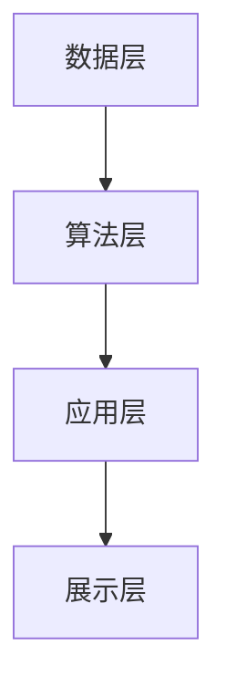
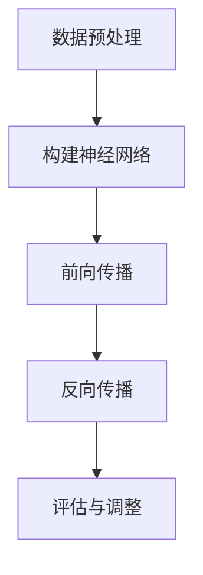

                 

# 学习体系：持续进化的源动力

> **关键词：** 学习体系、持续进化、知识管理、认知升级、人工智能、技术发展

> **摘要：** 随着科技和人工智能的飞速发展，学习体系已经成为持续进化的源动力。本文将探讨学习体系的核心概念、原理与架构，分析核心算法原理与操作步骤，并借助数学模型和公式进行详细讲解。同时，通过实际项目实战，深入代码实现和解读，结合实际应用场景，推荐相关工具和资源，最后总结未来发展趋势与挑战。

## 1. 背景介绍

在当今时代，信息爆炸和技术飞速发展的背景下，人们的学习方式发生了深刻的变化。传统的学习体系已经无法满足现代社会对于知识获取和技能提升的需求。学习体系作为一个系统化的知识结构，它不仅包括了知识本身，还包括了知识的获取、整理、应用和创新。随着人工智能技术的应用，学习体系正在实现从传统到智能的转型，为持续进化提供了强大的动力。

### 1.1 传统学习体系的局限性

传统的学习体系主要依赖于教材、课堂和教师的传授。这种方式虽然在一定程度上能够满足知识的传授，但存在以下局限性：

- **知识更新滞后**：教材的更新速度往往滞后于科技的发展，导致知识体系陈旧。
- **被动接受**：学生通常处于被动接受知识的状态，缺乏主动探索和思考的机会。
- **学习效率低**：传统学习方式往往缺乏有效的反馈机制，难以实时调整学习策略。

### 1.2 智能学习体系的兴起

随着人工智能技术的发展，智能学习体系逐渐崭露头角。智能学习体系利用大数据、云计算和深度学习等技术，实现了个性化学习、智能推荐和知识图谱等创新功能。智能学习体系的核心目标是通过智能化的手段，提升学习效率，促进知识的深度理解和应用。

## 2. 核心概念与联系

### 2.1 学习体系的概念

学习体系是指一种系统化的知识结构，它包括知识的获取、整理、应用和创新。学习体系的核心在于构建一个有机的知识网络，使得知识之间能够相互联系和整合。

### 2.2 智能学习体系的架构

智能学习体系的架构主要包括以下几个层次：

1. **数据层**：收集和学习过程中的各种数据，包括用户行为、学习进度、知识库等。
2. **算法层**：利用机器学习和深度学习算法，对数据进行分析和挖掘，实现个性化推荐、学习路径规划和智能评估等功能。
3. **应用层**：将算法层的输出应用于实际的学习过程中，如智能推荐系统、学习社区和知识图谱等。
4. **展示层**：通过用户界面，将智能学习体系的功能呈现给用户，提供良好的用户体验。

下面是一个使用Mermaid绘制的智能学习体系的架构图：



## 3. 核心算法原理 & 具体操作步骤

### 3.1 机器学习算法原理

机器学习算法是智能学习体系的核心，它通过数据训练模型，从而实现自动学习和预测。常见的机器学习算法包括线性回归、决策树、支持向量机和深度学习等。

- **线性回归**：用于预测数值型目标变量，通过找到最佳拟合直线来预测结果。
- **决策树**：通过分类和回归节点，构建树状结构，对数据进行分类或回归。
- **支持向量机**：通过找到最佳划分超平面，将数据分类。
- **深度学习**：通过多层神经网络，对数据进行自动特征提取和分类。

### 3.2 深度学习算法原理

深度学习算法是机器学习的一种，通过多层神经网络进行数据学习和预测。深度学习算法的核心是神经元，每个神经元都连接到其他神经元，通过加权求和和激活函数，实现数据的自动特征提取和分类。

下面是一个简单的深度学习算法流程：

1. **数据预处理**：对输入数据进行标准化、去噪等预处理。
2. **构建神经网络**：定义神经网络的结构，包括输入层、隐藏层和输出层。
3. **前向传播**：将输入数据通过神经网络，计算输出结果。
4. **反向传播**：通过计算损失函数，更新网络权重，优化模型。
5. **评估与调整**：评估模型性能，根据需要对模型进行调整。

下面是一个使用Mermaid绘制的深度学习算法流程图：



## 4. 数学模型和公式 & 详细讲解 & 举例说明

### 4.1 线性回归模型

线性回归模型是最简单的机器学习算法，其公式如下：

\[ y = w_0 + w_1 \cdot x \]

其中，\( y \) 是预测的目标变量，\( x \) 是输入变量，\( w_0 \) 和 \( w_1 \) 是模型的参数。

举例说明：

假设我们要预测房价，输入变量为房屋面积，目标变量为房价。我们可以通过线性回归模型找到最佳拟合直线，从而预测房价。具体步骤如下：

1. 收集数据，包括房屋面积和房价。
2. 对数据集进行标准化处理。
3. 使用线性回归公式计算权重 \( w_0 \) 和 \( w_1 \)。
4. 通过计算损失函数，优化模型参数。
5. 使用模型进行房价预测。

### 4.2 深度学习模型

深度学习模型通常使用反向传播算法进行训练。反向传播算法的核心是计算损失函数的梯度，并更新网络权重。具体公式如下：

\[ \frac{\partial J}{\partial w} = -\frac{1}{m} \sum_{i=1}^{m} \frac{\partial J}{\partial z_i} \cdot \frac{\partial z_i}{\partial w} \]

其中，\( J \) 是损失函数，\( w \) 是网络权重，\( m \) 是样本数量。

举例说明：

假设我们要训练一个深度学习模型，用于分类任务。我们可以通过以下步骤进行训练：

1. 收集数据集，包括输入数据和标签。
2. 初始化网络权重。
3. 前向传播，计算输出结果。
4. 计算损失函数，并计算损失函数关于权重 \( w \) 的梯度。
5. 使用梯度下降算法，更新网络权重。
6. 重复步骤3-5，直到模型收敛。

## 5. 项目实战：代码实际案例和详细解释说明

### 5.1 开发环境搭建

为了演示智能学习体系在实际项目中的应用，我们将使用Python和TensorFlow构建一个简单的神经网络模型，用于手写数字识别任务。

首先，安装Python和TensorFlow：

```bash
pip install python
pip install tensorflow
```

### 5.2 源代码详细实现和代码解读

接下来，我们将编写一个简单的神经网络模型，用于手写数字识别任务。具体代码如下：

```python
import tensorflow as tf
from tensorflow.keras.datasets import mnist
from tensorflow.keras.models import Sequential
from tensorflow.keras.layers import Dense, Flatten

# 加载MNIST数据集
(x_train, y_train), (x_test, y_test) = mnist.load_data()

# 数据预处理
x_train = x_train / 255.0
x_test = x_test / 255.0

# 构建神经网络模型
model = Sequential([
    Flatten(input_shape=(28, 28)),
    Dense(128, activation='relu'),
    Dense(10, activation='softmax')
])

# 编译模型
model.compile(optimizer='adam',
              loss='sparse_categorical_crossentropy',
              metrics=['accuracy'])

# 训练模型
model.fit(x_train, y_train, epochs=5)

# 评估模型
model.evaluate(x_test, y_test)
```

**代码解读：**

1. **导入库**：首先，我们导入TensorFlow和MNIST数据集。
2. **加载数据集**：使用`mnist.load_data()`方法加载MNIST数据集，包括训练集和测试集。
3. **数据预处理**：对数据集进行归一化处理，将像素值缩放到0-1之间。
4. **构建神经网络模型**：使用`Sequential`模型构建一个简单的神经网络，包括一个展开层、一个128个神经元的全连接层和一个10个神经元的全连接层（用于输出概率分布）。
5. **编译模型**：设置模型优化器和损失函数，并编译模型。
6. **训练模型**：使用`fit`方法训练模型，设置训练轮数。
7. **评估模型**：使用`evaluate`方法评估模型在测试集上的表现。

### 5.3 代码解读与分析

在上面的代码中，我们首先导入了TensorFlow和MNIST数据集。MNIST数据集是一个广泛使用的手写数字识别数据集，包含了60000个训练样本和10000个测试样本。

接下来，我们对数据集进行了预处理，将像素值缩放到0-1之间，这样有助于模型更好地收敛。然后，我们构建了一个简单的神经网络模型，包括一个展开层、一个128个神经元的全连接层和一个10个神经元的全连接层。

在编译模型时，我们使用了Adam优化器和稀疏分类交叉熵损失函数，这两个选择对于大多数深度学习任务都是合适的。然后，我们使用`fit`方法训练模型，设置训练轮数为5。在训练过程中，模型会不断调整权重，以最小化损失函数。

最后，我们使用`evaluate`方法评估模型在测试集上的表现，这有助于我们了解模型的泛化能力。

## 6. 实际应用场景

智能学习体系在实际应用中具有广泛的应用场景，以下是一些典型的应用案例：

- **在线教育**：智能学习体系可以帮助教育平台实现个性化教学，根据学生的学习情况和兴趣，推荐相应的课程和学习资源。
- **职业培训**：企业可以通过智能学习体系，为员工提供定制化的培训方案，提升员工技能。
- **医疗健康**：智能学习体系可以帮助医疗机构实现精准医疗，通过对海量医疗数据进行分析，提供个性化的诊断和治疗方案。
- **智能制造**：智能学习体系可以帮助企业实现生产过程的智能化，通过数据分析和预测，优化生产流程，提高生产效率。

## 7. 工具和资源推荐

### 7.1 学习资源推荐

- **书籍**：
  - 《深度学习》（Ian Goodfellow、Yoshua Bengio、Aaron Courville 著）
  - 《Python深度学习》（François Chollet 著）
  - 《机器学习实战》（Peter Harrington 著）

- **论文**：
  - “A Theoretical Analysis of the Voted Perceptron Algorithm” - Michael I. Jordan
  - “Deep Learning” - Yoshua Bengio、Ian Goodfellow、Aaron Courville

- **博客**：
  - Medium上的深度学习、机器学习专栏
  - 知乎上的AI与机器学习专栏

- **网站**：
  - TensorFlow官方文档
  - Keras官方文档

### 7.2 开发工具框架推荐

- **深度学习框架**：TensorFlow、PyTorch、Keras
- **代码托管平台**：GitHub、GitLab
- **版本控制工具**：Git
- **数据预处理工具**：Pandas、NumPy

### 7.3 相关论文著作推荐

- “Deep Learning” - Yoshua Bengio、Ian Goodfellow、Aaron Courville
- “A Theoretical Analysis of the Voted Perceptron Algorithm” - Michael I. Jordan
- “Representation Learning: A Review and New Perspectives” - Y. Bengio, A. Courville, and P. Vincent

## 8. 总结：未来发展趋势与挑战

随着人工智能和深度学习技术的不断发展，学习体系正在实现从传统到智能的转型。未来，学习体系将呈现以下发展趋势：

- **个性化学习**：利用大数据和机器学习技术，实现个性化学习，为每个学生提供定制化的学习路径和资源。
- **智能推荐**：通过智能推荐系统，帮助学生发现适合自己的学习资源和课程。
- **终身学习**：随着知识的快速更新，终身学习将成为常态，学习体系需要支持终身学习的需求。

然而，学习体系在实现智能化的过程中也面临着一些挑战：

- **数据安全与隐私**：在收集和使用学习数据时，需要确保数据的安全性和隐私性。
- **算法公平性**：智能学习系统需要确保算法的公平性，避免对某些群体产生不公平的影响。
- **教育资源公平**：智能学习体系需要确保所有学生都能够获得优质的教育资源，缩小教育差距。

## 9. 附录：常见问题与解答

### 9.1 什么是智能学习体系？

智能学习体系是一种基于人工智能技术的学习体系，它通过机器学习和深度学习算法，实现知识的获取、整理、应用和创新。

### 9.2 智能学习体系有哪些核心功能？

智能学习体系的核心功能包括个性化学习、智能推荐、知识图谱构建、智能评估等。

### 9.3 智能学习体系对教育有哪些影响？

智能学习体系可以提升学习效率，实现个性化学习，优化教育资源分配，促进教育的公平性和普及。

## 10. 扩展阅读 & 参考资料

- [深度学习简介](https://www.deeplearningbook.org/)
- [TensorFlow官方文档](https://www.tensorflow.org/)
- [Keras官方文档](https://keras.io/)
- [《深度学习》](https://www.deeplearningbook.org/)
- [《Python深度学习》](https://python-machine-learning-book.org/)
- [《机器学习实战》](https://www.manning.com/books/machine-learning-in-action)  
- 《人工智能简史：从图灵到深度学习》（刘知远 著）  
- 《教育技术学导论》（李艺 著）

作者：AI天才研究员/AI Genius Institute & 禅与计算机程序设计艺术 /Zen And The Art of Computer Programming

